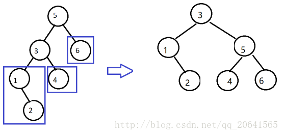
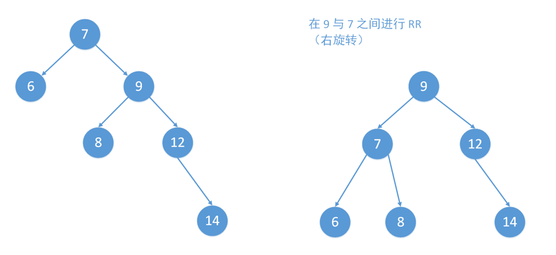
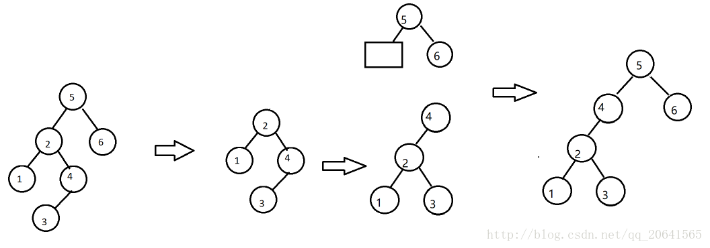
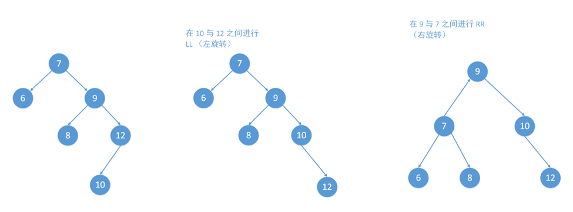
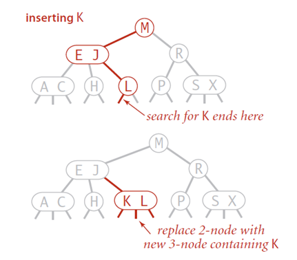

#	树

##	总述

###	Free tree

自由树：**连通**、**无回路图**，具有一些其他图不具有的重要
特性

-	边数总比顶点数少一：$|E|=|V|-1$
	-	这个是图为一棵树的必要条件，但不充分
	-	若图是连通的，则是充分条件

-	任意两个顶点之间总是存在简单路径

###	Forest

森林：**无回路**但不一定连通的图

-	其每个连通分量是一棵树

###	Rooted Tree

有根树：存在根节点的自由树

-	树中任何两个节点间**总存在简单路径**，所以可以任选自由树
	中某节点，作为有根树的根

-	有根树远远比自由树重要，所以也简称为树
	-	根一般放在树的顶层，第0层
	-	之后节点根据和根的距离放在相应层数

###	Ordered Tree

有序树：所有顶点的所有子女都是有序的有根树

###	应用

-	常用于描述层次关系
	-	文件目录
	-	企业的组织结构
	-	字典的实现
	-	超大型的数据集合的高效存储
	-	数据编码

-	用于分析递归算法
	-	*state-space tree*：状态空间树，强调了两种算法设计
		技术：回溯、分支界限

###	结构

-	*ancestor*：从根到该顶点上的简单路径上的所有顶点
-	*proper ancestor*：除自身外的所有祖先顶点
-	*parent*：从根到顶点简单路径中，最后一条边的另一端节点
-	*parental*：至少有一个子女的顶点
-	*child*：
-	*sibling*：具有相同父母的顶点
-	*leaf*：没有子女的顶点
-	*descendent*：所有以该顶点为祖先的顶点
-	*proper descendent*：不包括顶点自身的子孙
-	*subtree*：顶点的所有子孙、连接子孙的边构成以该顶点为根的
	子树
-	*depth*：根到该顶点的简单路径的长度
-	*height*：根到叶节点的最长简单路径的长度

##	Binary Tree

二叉树：所有顶点子女个数不超过2个，每个子女不是父母的
*left child*就是*right child*

-	左（右）子树：二叉树的根是另一棵二叉树顶点的左（右）子女
	-	左右子树也是二叉树，所以二叉树可以递归定义
	-	涉及二叉树的问题可以用递归算法解决

-	完全二叉树（essentially complete）：基本完备的，树的每层
	都是满的，除了最后一层最右边的元素（一个或多个）可能有
	缺位

	-	只存在一棵n个节点完全二叉树，高度为
		$\lfloor log_2 n\r floor$

	-	可以使用数组H实现堆：从上到下、从左到右记录堆元素

		-	为方便，可以从1开始记录堆中的n个元素，H[0]至置空
			，或者存放限位器（值大于任何元素）

		-	父母节点键会位于数组前$\lfloor n/2 \rfloot$个
			位置中，叶子节点位于后
			$\floor \lceiling n/2 \rceiling$

		-	对位于父母位置i的键，其子女位于2i、2i+1，相应的
			对于子女位置i的键，父母位于$\lfloor i/2 \rfloor$

###	表示方法

出于计算方便，常由代表树顶点的一系列节点表示

-	每个节点包含相关顶点的某些信息
-	两个分别指向左右子女的指针

####	简单表示

简单的在父节点中加入与子女相同数量的指针

-	这种表示方法在不同子女数目相差很大时不方便

####	First Child-next Silbling Representaion

先子女后兄弟表示法

-	每个节点只包含两个指针，左指针指向第一个子女，右指针指向
	节点的下一个兄弟

-	节点的所有兄弟通过节点右指针被单独的链表连接

可高效的将有序树改造成一棵二叉树，称为关联二叉树

###	Binary Search Tree

二叉查找树：分配给每个父母顶点的数字都比其左子树中数字大，
比右子树数字小

-	对于n个顶点的二叉树，满足
	$ \lfloor {log_{2}^{n}} \rfloor \leq h \leq n-1 $

-	二叉查找树的查找算法效率取决于二叉树的**高度**

	-	平均情况下，查找、插入、删除时间$\in Theta(logn)$

	-	最差情况下（严重不平衡的树，接近链表结构），树高度
		h接近节点数n，查找、插入、删除时间$\in Theta(n)$

-	包含n个键的二叉查找树总数量
	$c(n) = \frac 1 {n+1} \left( \frac {2n} n \right), c(0)=1$

####	查找

在给定二叉查找树中查找给定键值K

-	若K等于根键值，停止
-	若K小、大于根键值，在左、右子树中递归查找

####	插入

除非是空树，否则总是把新键K插入叶子节点中

-	通过查找K确定合适插入位置（叶子节点）
-	若K大于叶子节点键值，则作为右子女，否则作为左子女

###	最优二叉查找树

对集合中元素确定的查找概率，成功查找的平均比较次数最小的
二叉查找树（可以扩展到包含不成功查找）

-	$a_i, i=1,2,\cdots,n$：从小到大互不相等的键
-	$p_i, i=1,2,\cdots,n$：键查找概率
-	$T_i^j$：由键$a_i, \cdots, \a_j$构成的二叉树
-	$C(i, j)$：成功查找的最小平均查找次数

####	动态规划构造

-	根据最优化法则，最优二叉查找树左右子树均是最优排列的

-	二叉树$T_i^j$有序，设树根为$a_k$，$a_i,..,a_{k-1}$构成
	的左子树、$a_{k+1},..,a_j$构成右子树均是最优排列的

递推式如下

-	$1 \leqslant i \leqslant j \leqslant n$

	$$\begin{align}
	C(i, j) & = \min_{i \leqslant k \leqslant j} \{p_k + 
			\sum_{s=i}^{k-1} p_s * (a_s在T_i^{k-1}中层数 + 1) +
			\sum_{s=k+1}^j p_s * (a_s在T_{k+1}^j中层数 + 1) \\
		& = \min_{i \leqslant k \leqslant j} \{
			\sum_{s=i}^{k-1} p_s * a_s在T_i^{k-1}中层数 +
			\sum_{s=k+1}^j p_s * a_s在T_{k+1}^j中层数 +
			\sum_{s=i}^j p_s \}
		& = \min_{i \leqslant k \leqslant j}
			\{C(i, k-1) + C(k+1, j)\} + \sum_{s=i}^j p_s
	\end{align}$$

-	$1 \leqslant i \leqslant n+1, C(i, i-1)=0$：空树

-	$1 \leqslant i \leqslant n, C(i, i)=p_i$：单节点

```md
OptimalBST(P[1..n])
	// 动态规划法构建最优二叉查找树
	// 输入：P[1..n]n个键查找概率
	// 输出：在最优BST中查找成功的平均比较次数，最优BST子树根表
	for i = 1 to n do
		C[i, i-1] = 0
		C[i, i] = P[i]
		R[i, i] = i
	C[n+1, n] = 0
		// 初始化平均查找次数表、子树根表
	for d = 1 to n-1 do
		// d为二叉树节点数
		for i = 1 to n-d do
			// n-d是为了控制j的取值
			j = i + d
			minval = \infty
			for k = i to j do
				// 遍历设置二叉树根节点
				if C[i, k-1] + C[k+1, j] < minval
					minval = C[i, k-1] + C[k+1, j]
					kmin = k
			R[i, j] = kmin
			sum = P[i]
			for s=i+1 to j do
				sum += P[s]
			C[i, j] = minval + sum
	return C[1, n], R
```

####	算法特点

-	算法效率
	-	算法时间效率为立方级
	-	算法空间效率为平方级


##	Self-Balancing Binary Tree

自平衡查找树：如果节点插入、删除产生了一棵违背平衡要求的树，
就从称为**旋转**的一系列特定变换中选择一种，重新构造树使得
树满足平衡要求

-	不同的对**平衡**的定义产生了不同的实现
-	这种方案属于**变治法**中**实例化简**

###	Rotation

旋转需要使得二叉树平衡时，保证二叉树依然**有序**

-	左旋：节点T**下沉**为其**右**儿子R的**左**儿子
	-	如果右儿子R本身有**左子树RL**，则左子树RL成为节点T
		新右子树

-	右旋：节点T**下沉**为其**左**儿子L的**右**儿子
	-	如果左儿子L本身有**右子树LR**，则右子树LR成为节点T
		新左子树

##	AVL Tree

AVL树：要求其节点在左右子树高度差不能超过1的平衡二叉树

-	如果树插入操作使得一棵AVL树失去平衡，利用旋转对树作变换

-	若有多个这样的节点，找出最靠近新插入的叶子节点的不平衡
	点，然后旋转以该节点为根的子树

###	Balance Factor

平衡因子：节点左、右子树高度差

-	AVL树中平衡情况下节点平衡因子只能为-1、+1、0

-	更新节点后可能存在不平衡节点，其平衡因子可能变为-2、+2

-	平衡因子也可以被定义为左右子树叶子数

###	4种插入情况

根据插入情况的不同，对最靠近新插入叶子节点的不平衡点T

####	LL

插入T**左儿子L的左子树LL**

-	即T到最底层叶节点（只可能有一个）的路径为LL（中间省略）
-	*R-rotation*：右单转，对T做一次右旋即可平衡



####	RR

插入T**右儿子R的右子树R**

-	即T到最底层叶节点（只可能有一个）的路径为RR（中间省略）
-	*L-rotation*：左单转，对T做一次左旋即可平衡



####	LR

插入T**左儿子L的右子树R**

-	即T到最底层叶节点（只可能有一个）的路径为LR（中间省略）
-	*LR-rotation*：左右双转
	-	先对左儿子L做一次左旋，变成LL模式
	-	在LL模式下，再对T做一次右旋



####	RL

插入T**右儿子R的左子树L**

-	即T到最底层叶节点（只可能有一个）的路径为RL（中间省略）
-	*RL-rotation*：右左双转
	-	先对右儿子R做一次右旋，变成RR模式
	-	在RR模式下，再对T做一次左旋



###	AVL树特点

-	AVL树高度h即为其查找、插入效率

	-	包含n个节点AVL树高度h满足
	$\lfloor log_2 n \rfloor \leq h < 1.4405log_2(n+2) - 1.3277$

	-	最差情况下，操作效率$\in \Theta(logn)$

	-	平均而言，在n不是太小时，高度h平均为
		$1.01log_2 n + 0.1$（几乎同折半查找有序数组）

-	在AVL树中删除键相对而言比较困难，但也是对数级的

-	AVL树缺点（平衡代价）

	-	需要频繁旋转
	-	维护树的节点平衡
	-	总体比较复杂

	这些阻碍AVL树成为实现字典的标准结构

##	Red-Black Tree

红黑树：能够容忍同一节点的一棵子树高度是另一棵的2倍

##	Splay Tree

分裂树：

##	Multiway Search Tree

多路查找树：允许查找树中单个节点中不止包含一个元素

-	二叉查找树的推广，用于磁盘超大数据集的高效存取
-	此方案属于**变治法**中**改变表现**

##	2-3树

2-3树：可以包含两种类型的节点2节点、3节点，树的所有叶子节点
必须位于同一层


-	2节点：只包含1个键K、2个子女
	-	左子女：作为所有键都小于K的子树的根
	-	右子女：作为所有键都大于K的子树的根
-	3节点：两个有序键$K_1 < K_2$、3个子女
	-	最左边子女：作为键值小于$K_1$的子树的根
	-	中间子女：作为键值位于$[K_1, K_2]$之间子树的根
	-	最右边子女：作为键值大于$K_2$的子树的根

###	查找

在2-3树种查找给定键K非常简单

-	如果根是2节点，当作二叉树查找
	-	若K等于根键值，停止
	-	若K小、大于根键值，在左、右子树中查找

-	若根是3节点
	-	和两个键值比较，有相等，停止
	-	否则能确定应该在3棵子树中哪棵继续查找

###	插入

除非是空树，否则总是把新键K插入叶子节点中

-	查找K确定合适的插入位置（叶子节点）

-	若叶子节点2节点，根据大小关系将K作为第一个键或第二个键
	插入
	

-	若叶子节点3节点，把叶子分裂为两个节点：3个键中最小的放入
	第一个叶子中，最大的放入第二个叶子中，中间的键提升到原
	叶子节点父母中

	

	-	若叶子就是根，则需要创建新根容纳中间键
	-	中间键的提升可能会导致父母节点分裂，并引起祖先链条上
		多个节点的分裂

###	特点

-	2-3树的高度即为其查找、插入、删除效率
	-	节点数为n的2-3数高度h满足
		$log_3(n+1)-1 \leq h \leq log_2(n+1) - 1$
	-	最差、平均情况下，操作效率$\in \Theta(logn)$

-	2-3树总是高度平衡的：对每个叶子，树根到其路径长度相同

-	2-3树平衡代价
	-	树中节点可以有1或2个键，需要处理2种节点类型
	-	拆分3节点的情况有很多种

##	2-4树

##	B树

B树可以看作是2-3树的扩展，允许节点可以有$[1, m-1]$个键值，
（m为节点*次数*，节点最大允许指针数目），对于*次数*为
$m \geqslang 2$的B树

-	根要么为叶子节点，要么具有2~m个子女

-	除根、叶子节点，节点具有$[\lceiling m/2 \rceiling, m]$个
	子女（指向子树的指针）

	-	即具有$[\lceiling m/2 \rceiling - 1, m]$个**有序**键

	-	其中子树$T_0$所有键小于$K_1$，子树$T_1$中所有键大于
		等于$K_1$小于 $K_2$，以此类推

-	B树是完美平衡的（所有叶子节点在同一层上）

###	查找

####	算法

-	从根开始，比较查找键K和节点中键大小
	-	父母节点、叶子节点都是有序的，如果B树次数足够大，
		可以考虑使用**折半查找**

-	否则根据比较结果选择合适指针，顺着指针链前进，在相应子女
	节点中进行比较

####	算法效率

###	插入

类似于2-3树插入

####	算法

###	删除

###	应用

-	类似一般查找树，把数据记录插入初始为空的树中构造B树

##	B+树

B+树是B树的一种变形树

-	其中非叶节点只有**索引**作用，跟记录相关信息均存放在
	叶结点中
-	B+树中所有叶结点构成**有序链表**，可以按照键次序遍历

###	查找

####	算法

-	从根开始，比较查找键K和节点中键大小，选择合适指针，顺着
	指针链前进

-	指针链指向可能包含查找键的叶子节点，在其中查找K
	-	父母节点、叶子节点都是有序的，如果B树次数足够
		大，可以考虑使用**折半查找**

####	算法效率

以B树作索引存储大型数据文件为例

-	查找指定查找键访问B树节点数量为B树高度$h+1$
	（即磁盘访问次数）

-	次数为m、高度为h的B树能够包含最少节点数为
	$n \geqslant 4 \lceiling m/2 \rceiling ^ {h-1} -1$，
	即$h \leqslant \lfloor log_{[m/2]} \frac {n+1} 4 \rfloor + 1$

-	所以在B树中查找，访问磁盘次数$\in O(logn)$
	-	实际应用中，磁盘访问次数很少超过3，因为B树的根、甚至
		是第一层节点会存储在内存中减少磁盘访问次数

###	插入

####	算法

-	查找新记录键K对应的叶子节点

-	若叶子节点中还有空间存放此记录，在保持键有序的情况下插入

-	若节点中没有空间
	-	将节点分裂，后半部分记录放在新节点中
	-	新节点中最小键$K^{'}$、指向其的指针插入原叶子节点
		父母节点中（原叶子节点键、指针之后）
	-	插入过程可以一直回溯到树根，甚至直到树根分裂

其他考虑

-	查找新记录对应叶子节点时就分裂满节点，可以避免递归分裂
-	将满叶子节点中部分键移动给兄弟节点，同时替换父母节点中的
	键值（保证B树特点），增加少许复杂度以节约空间

####	算法特点

-	算法效率
	-	算法时间效率$\in O(logn)$

###	应用

-	B+树是存储结构化记录数据集合最重要的索引结构
	-	所有数据记录（键）按照升序存储在叶子节点中，其父母
		节点作为索引
	-	B+树中节点常常对应磁盘中页
	-	考虑到访问磁盘页面是比较内存中键值比较时间多好几个
		数量级，磁盘访问次数是衡量B树效率的主要指标


