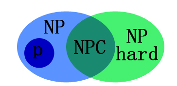

##	基础

算法：一系列解决问题的**明确**指令，即对于符合一定规范的
输入，能够在有限时间内获得要求的输出

-	算法每步都必须**没有歧义**
-	必须确定算法所处理的**输入的值域**
-	同一算法可以用几种不同的形式描述
-	同一问题，可能存在几种不同的算法
-	同问题的不同算法，可能基于不同的解题思路，速度也会不同

###	算法正确性证明

-	对某些算法，正确性证明十分简单，对于另一些算法，可能十分
	复杂
-	证明正确性的一般方法是使用数学归纳法，因为算法的迭代过程
	本身就符合其所需的一系列步骤
-	根据特定输入追踪算法操作有意义，但是并不能证明算法的
	正确性，只需要一个算法不能正确处理的输入实例就足够了
-	对于近似算法，常常试图证明算法所产生的误差，不超出预定义
	的误差

###	算法分析方向

-	时间效率（time efficiency）：算法运行速度
-	空间效率（space efficiency）：算法需要多少额外的存储空间
-	简单性（simplicity）：取决于审视者的眼光
	-	简单的算法更容易理解、实现
	-	相应程序包含更少的bug
-	一般性（generality）
	-	所解决问题的一般性
	-	所接受输入的一般性
-	最优性（optimality）：与所解决问题的复杂度有关，与某算法
	效率无关
-	是否每个问题都能够用算法的方法来解决

###	非确定性

####	*Deterministic Alogrithm*

确定算法：利用问题解析性质，产生确定的有限、无限序列使其收敛
于全局最优解

-	依某确定性策略搜索局部极小，试图跳跃已获得的局部极小而
	达到某个全局最优点

-	能充分利用问题解析性质，从计算效率高

####	*Nondeterministic Algorithm*

不确定算法，包括两个阶段，将判定问题的实例l作为其输入

> - 猜测（非确定）阶段：生成任意串S作为l候选解
> - 验证（确定）阶段：把l、S作为输入，，若S是l解输出*是*，
	否则返回*否*或无法停止

-	当选仅当对问题每个真实例，不确定算法会在**某次**执行中
	返回*是*时，称算法能求解此问题

-	即要求不确定算法对某个解至少能够猜中一次、验证正确性，
	同时不应该将错误答案判定为*是*

-	*Nondeterministic Polynominal Algorithm*：验证阶段时间
	效率是多项式级的不确定算法

##	分析框架

-	time complexity：算法运行速度
-	space complexity：算法需要的额外空间
	-	算法需要的额外空间已经不是需要重点关注的问题

###	影响因素

####	输入规模$n$

-	几乎所有算法，对规模更大的输入需要运行更长时间，因此使用
	输入规模作为参数很有价值

-	在有些情况下，选择不同的参数表示输入规模有差别

-	选择输入规模的度量单位还受到算法的操作细节影响

-	和数字特性相关的算法，倾向于使用$n$的二进制位数
	$b=\lfloor {log_{2}^{n}} \rfloor + 1$

####	其他因素

有些算法的运行时间不仅取决于输入规模，还取决于特定输入的细节

-	*worst-case efficiency*：最坏情况下的效率
-	*best-case efficiency*：最优情况下的效率
-	*average-case efficiency*
	-	平均效率的研究比最差、优效率研究困难很多
	-	可以将输入划分为几种类型，使得对同类实例，算法基本
		执行次数相同，推导各类输入的概率分布，得到平均次数
-	*amortized efficiency*：应用于算法对同样的数据结构所执行
	的一系列操作
	-	有些情况下，算法单次执行时间代价高，但是n次运行的
		总运行时间明显优于单次执行最差效率 * n

###	衡量角度

####	运行时间

-	使用**时间**标准的度量算法程序运行时间缺陷
	-	计算机速度
	-	程序实现质量
	-	编译器
	-	计时困难

-	找到*basic operation*并计算其运行次数
	-	不依赖于其他无关因素
	-	对总运行时间贡献最大，不需要统计算法每步操作执行次数
	-	如：对排序基本操作为键比较，数学问题则是四则运算，
		需要注意除法、乘法、加减法耗时依次减小

-	时间估计
	-	$c_{op}$：特定计算一个基本操作的执行时间
	-	$C(n)$：算法执行基本操作的次数
	-	$T(n)=c_{op}C(n)$：可以用于估算算法的执行时间
		-	需要小心使用
		-	$C(n)$不包含非基本操作的信息，也只是估计的结果
		-	$c_{op}$也是不可靠的估计值

####	Order of Growth

小规模输入运行时间差别不足以将高效算法与低效算法相区别，
对大规模输入忽略乘法常量，仅关注执行次数的*order of growth*
及其常数倍，即算法的渐进效率

-	按照算法渐进效率进行分类的方法缺乏使用价值，因为没有指定
	乘法常量的值

-	但是对于实际类型输入，除了少数算法，乘法常量之间不会相差
	悬殊，作为规律，即使是中等规模的输入，属于较优渐进
	效率类型的算法也会比来自较差类型的算法效果好

-	对数函数：增长慢，以至于可以认为，对数级操作次数的算法能
	瞬间完成任何实际规模输入
-	指数级：指数函数、阶乘函数
	-	需要指数级操作次数的算法只能用于解决规模非常小的问题

###	渐进效率

####	渐进符号

#####	$O(g(n))$

-	对于足够大的n，$t(n)$的上界由$g(n)$的常数倍确定，则
	$t(n) \in O(g(n))$

-	即存在大于0的常数$c$、非负整数$n_{0}$，使得
	$$ n > n_{0} 时，t(n) \leqslant cg(n) $$

-	增长次数小于等于$g(n) n \rightarrow \infty$
	（及常数倍）的函数集合

#####	$\Omega (g(n))$

-	对于足够大的n，$t(n)$的下界由$g(n)$的常数倍确定，则
	$t(n) \in \Omega(g(n))$

-	即存在大于0的常数$c$、非负整数$n_{0}$，使得
	$$ n > n_{0} 时，t(n) \geqslant cg(n) $$

-	增长次数大于等于$g(n) n \rightarrow \infty$
	（及常数倍）的函数集合

#####	$\Theta (g(n))$

-	对于足够大的n，$t(n)$的上、下界由$g(n)$的常数倍确定，则
	$t(n) \in \Theta(g(n))$

-	即存在大于0的常数$c_{1}, c_{2}$、非负整数$n_{0}$，使得
	$$
	n > n_{0} 时，c_{2}g(n) \leqslant t(n) \leqslant c_{1}g(n)
	$$

-	增长次数等于$g(n) n \rightarrow \infty$（及常数倍）
	的函数集合

####	极限比较增长次数

利用极限比较增长次数：比直接利用定义判断算法的增长次数方便，
可以使用微积分技术计算极限

$$
\lim_{n \rightarrow \infty} \frac {t(n)} {g_n}
\left\{
	\begin{array}\\
	0		& t(n)的增长次数比g(n)小，t(n) \in O(g(n))\\
	c>0		& t(n)的增长次数同g(n)，t(n) \in \Theta(g(n)) \\
	\infty	& t(n)的增长次数比g(n)大，t(n) \in \Omega(g(n))\\
	不存在 \\
	\end{array}
\right.
$$

####	基本渐进效率类型

|类型|名称|注释|
|------|------|------|
|$1$|常量|很少，效率最高|
|$log_{n}$|对数|算法的每次循环都会消去问题规模的常数因子，对数算法不可能关注输入的每个部分|
|$n$|线性|能关注输入每个部分的算法至少是线性运行时间|
|$nlog_{n}$|线性对数|许多分治算法都属于此类型|
|$n^{2}$|平方|包含两重嵌套循环的典型效率|
|$n^{3}$|立方|包含三重嵌套循环的典型效率|
|$2^{n}$|指数|求n个元素的所有子集|
|$n!$|阶乘|n个元素集合的全排列|

##	算法的数学分析

###	非递归算法

####	分析通用方案

1.	决定表示输入规模的参数
2.	找出算法的基本操作：一般位于算法最内层循环
3.	检查算法基本操作执行次数是否只依赖于输入规模，如果和其他
	特性有关，需要分别研究最差、最优、平均效率
4.	建立算法基本操作执行次数的求和表达式（或者是递推关系）
5.	利用求和运算的标准公式、法则建立操作次数的闭合公式，或
	至少确定其增长次数

###	递归算法

用一个方程把squence的generic term和一个或多个其他项相关联，
并提供第一个项或前几项的精确值

$$
\begin{array}\\
	x(n) = x(n-1) + n (n>0) \\
	x(0) = 0
\end{array}
$$

-	*recurrence*：递推式
-	*initial condition*：序列起始值、递归调用结束条件
-	求解：找到序列通项的精确公式满足递推式、初始条件，或者
	证明序列不存在
-	*general solution*：满足**递推方程**所有解序列公式，通常
	会包含参数
-	*particular solution*：满足给定递推方程的特定序列，通常
	感兴趣的是满足初始条件的特解

####	递归求解方法

-	*method of forward substituion*：从序列初始项开始，使用
	递推方程生成给面若干项，从中找出能用闭合公式表示的模式
	-	带入递推方程、初始条件验证
	-	数学归纳法证明

-	*method of backward subsitution*：从序列末尾开始，把序列
	通项$x(n)$表示为$x(n-i)$的函数，使得i是初始条件之一，
	再求和公式得到递推式的解

-	*second-order linear recurrence with constant coefficients*
	：求解*characteristic equation*得到特征根得到通解

####	常见递推类型

#####	*decrease-by-one*

减一法：利用规模为n、n-1的给定实例之间的关系求解问题

-	减常数法特例

$$
\begin{align*}
T(n)& = T(n-1) + f(n) \\
	& = T(n-2) + f(n-2) + f(n) \\
	& = \cdots \\
	& = T(0) + \sum_{j=1}^{n} f(j) \\
\end{align*}
$$

#####	*decrease-by-a-constant-factor*

减常因子法：把规模为n的实例化简为规模为n/b的实例求解问题

$$
\begin{align*}
T(b^{k}) &= T(b^{k-1}) + f(b^{k}) \\
		&= T(b^{k-2}) + f(b^{k-1}) + f(b^{k}) \\
		&= \cdots \\
		&= T(1) + \sum_{j=1}^{k} f(b^{j})
\end{align*}
$$

#####	*divide-and-conquer*

分治法：将给定实例划分为若干较小实例，对每个实例递归求解，如有必要，
再将较小实例的接合并为给定实例的一个解

$$
\begin{align*}
T(b^{k}) &= aT(n/b) + f(n) \\
		&= a[aT(b^{k-2} + f(b^{k-1})] + f(b^{k}) \\
		&= a^{2}T(b^{k-2}) + af(b^{k-1}) + f(b^{k}) \\
		&= a^{2}[aT(b^{k-3} + f(b^{k-2})] + af(b^{k-1}) + f(b^{k}) \\
		&= a^{3}aT(b^{k-3} + a^{2}f(b^{k-2}) + af(b^{k-1}) + f(b^{k}) \\
		&= \cdots \\
		&=a^{k}T(1) + a^{k-1}f(b^{1}) + a^{k-2}f(b^{2}) + \cdots + a^{0}f(b^{k}) \\
		&=a^{k} \left[ T(1) + \sum_{j=1}^{k} \frac {f(b^{j})} {a^{j}} \right] \\

n = b^{k} \\
T(n) &= n^{log_{b}^{a}} \left[ T(1) + \sum_{j=1}^{log_{b}^{n}} \frac {f(b^{j})} {a^{j}} \right]
\end{align*}
$$

####	平滑法则、主定理

-	*eventually nondecreaing*：$f(n)$在自然数上非负，若
	$\exists n_{0}, \forall n_{2} > n_{1} \geqslant n_{0}, f(n_{2}) > f(n_{1})$，
	则为最终非递减

-	*smooth*：$f(n)$在自然数上非负、最终非递减，若
	$f(2n) \in \Theta(f(n))$，则平滑

	-	若$f(n)$平滑，则对任何整数b有$f(bn) \in \Theta(f(n))$

#####	平滑法则

$T(n)$最终非递减，$f(n)$平滑，若$n=b^{k}(b>2)$时有
$T(n) \in \Theta(f(n))$，则$T(n) \in \Theta(f(n))$

#####	主定理

-	方便对分治法、减常因子法效率进行分析

$T(n)$最终非递减，满足递推式

$$
T(n) = aT(n/b) + f(n), \quad n=b^{k}, k=1,2,3,\cdots \\
T(1) = c \\
a \geqslant 1, b \geqslant 2, c > 0
$$
若$f(n) \in \Theta(n^{d}), d \geqslant 0$，则
$$ T(n) \in
\left\{
	\begin{array}\\
	\Theta(n^{d})	& a<b^{d} \\
	\Theta(n^{d}log_{n})	& a=b^{d} \\
	\Theta(n^{log_{b}^{a}})	& a>b^{d} \\
	\end{array}
\right.
$$

####	分析通用方案

1.	决定衡量输入规模的参数
2.	找出算法基本操作
3.	检查算法基本操作执行次数是否只依赖于输入规模，如果和其他
	特性有关，需要分别研究最差、最优、平均效率
4.	建立算法基本操作执行次数的递推关系、相应初始条件
5.	求解递推式，或至少确定其增长次数

##	算法时间效率极限

确定已知、未知算法效率极限

###	算法下界

算法下界是问题可能具有的最佳效率

-	可以用于评价某问题具体算法效率

	-	不同问题算法直接比较无意义

-	寻找问题的更优算法时，可以根据算法下界确定期望获得的改进

	-	若算法下界是紧密的，则改进至多不过是常数因子
	-	若算法下界和算法仍有差距，则可能存在更快算法，或者是
		证明更好的下界

####	Trivial Lower Bound

平凡下界：任何算法只要要“读取”所有要处理的项、“写”全部
输出，对其计数即可得到平凡下界

-	往往过小，用处不大

-	确定问题中所有算法都必须要处理的输入也是个障碍

-	例

	-	生成n个不同项所有排列的算法$\in \Omega(n!)$，且下界
		是紧密的，因为好的排列算法在每个排列上时间为常数

	-	计算n次多项式值算法至少必须要处理所有系数，否则改变
		任意系数多项式值改变，任何算法$\in \Omega(n)$

	-	计算两个n阶方阵乘积算法$\in Omega(n^2)$，因为任何
		算法必须处理矩阵中$2n^2$个元素

####	Information-Theoretic Lower Bound

信息论下界：试图通过算法必须处理的信息量（比特数）建立
效率下界

-	例

	-	猜整数中，整数的不确定信息量就是
		$\lceil \log_2 n \rceil$（数字二进制位数），
		n为整数上界

####	Adversary Lower Bound

敌手下界：敌手基于恶意、一致的逻辑，迫使算法尽可能多执行，
从而确定的为了保证算法正确性的下界

> - 恶意使得它不断把算法推向最消耗时间的路径
> - 一致要求它必须和已经做出的选择保持一致（按照一定规则）

-	例

	-	猜整数中，敌手把1~n个数字作为可选对象，每次做出判断
		后，敌手保留数字较多集合，使得最消耗时间、不违背之前
		选择

	-	两个有序列表${a_i}, {b_j}$归并排序中，敌手使用规则：
		当前仅当i < j时，对$a_i < b_j$返回真（设置列表值大小
		可以达到），则任何算法必须比较2n-1次，否则交换未比较
		元素归并错误

####	问题化简

问题Q下界已知，考虑**将问题Q转换**为下界未知问题P，得到P下界

> - 应该表明任意Q问题实例可以转换为P问题
> - 即问题Q应该是问题P的子集，正确的算法至少应该能解决Q问题

-	许多问题复杂性不清楚，而对问题复杂度的直观判断和问题表现
	形式相关，并不可靠

-	常在问题化简中使用的已知下界问题

	|问题|下界|紧密性|
	|-----|-----|-----|
	|排序|$\Omega(nlogn)$|是|
	|有序数组查找|$\Omega(logn)$|是|
	|元素惟一性|$\Omega(nlogn)$|是|
	|n位整数乘法|$\Omega(n)$|未知|
	|n阶方程点乘|$\Omega(n^2)$|未知|

-	例

	-	欧几里得最小生成树：使用元素唯一性问题作为下界已知
		问题

		-	将n个实数映射为x轴上的n个点
		-	设T为此点集最小生成树，T必然包含一条最短边??#todo
		-	检查T是否包含长度为0的边即为元素惟一性

	-	任意矩阵A、B乘法：使用方阵乘法作为下界已知问题

		-	将A、B化成对称方阵进行计算

			$$
			X =  \begin{bmatrix}
			0 & A \\
			A^T & 0 \\
			\end{bmatrix},
			Y = \begin{bmatrix}
			0 & B^T \\
			B & 0 \\
			\end{bmatrix} \\
			XY = \begin{bmatrix}
			AB & 0 \\
			0 & A^TB^T \\
			\end{bmatrix}
			$$

		-	乘积AB可以方便提取，而翻倍的矩阵乘法不会影响复杂性

###	决策树（二叉）

可以使用（二叉）决策树研究基于比较的算法性能

-	每个非叶子节点代表一次键值比较

-	叶子节点个数大于等于输出，不同叶子节点可以产生相同输出

-	对于特定规模为n的输入，算法操作沿着决策树一条从根到叶子
	节点完成，所以最坏情况下比较次数等于算法**决策树高度**

-	如果树具有由输出数量确定叶子，则树必须由足够高度容纳叶子
	，即对于任何具有$l$个叶子，树高度
	$h \leqslant \lceil log_2 l \rceil$，这也就是
	信息论下界

####	线性表排序

任意n个元素列表排序输出数量等于$n!$，所以任何基于比较的排序
算法的二叉树高度，即最坏情况下比较次数

$$
\begin{align*}
C_{worst} & \geqslant \lceil log_2 n! \rceil \\
	& \approx log_2 \sqrt {2\pi n} (n/e)^n  \\
	& = nlog_2n - nlog_2e + \frac {log_2n + log_22\pi} 2 \\
	& \approx nlog_2n
\end{align*}
$$

-	归并排序、堆排序在最坏情况下大约必须要做$nlog_2n$次比较
	，所以其渐进效率最优

-	也说明**渐进下界**$\lceil log_2n! \rceil$是紧密的
	，不能继续改进

	-	但这个只是基于二叉决策树的渐进下界，对于具体值估计
		可能不准

	-	如$\lceil log_2 12! \rceil = 29$，而事实证明
		12个元素排序30次比较是必要、充分的

-	也可以使用决策树分析基于比较的排序算法的平均性能，即
	决策树叶子节点平均深度

	-	基于排序的所有输出都不特殊的标准假设，可以证明平均
		比较次数**下界**$C_{avg}(n) \geqslant log_2n!$

	-	这个平均是建立在所有输出都不特殊假设上，所以这个其实
		应该是**不同算法平均比较次数下界的上界**

	-	对于单独排序算法，平均效率会明显好于最差效率

####	有序线性表查找

有序线性表查找最主要算法是折半查找，其在最坏情况下下效率
$C_{worst}^{bs} = \lfloor log_2n \rfloor + 1 = \lceil log_(n+1) \rceil$

-	折半查找使用的**三路比较**（小于、等于、大于），可以使用
	三叉查找树表示

	-	三叉查找树会有2n+1个节点：n个查找成功节点、n+1个查找
		失败节点

	-	所以在最坏情况下，比较次数下界
		$C_{worst}(n) \geqslant \lceil log_3{2n+1} \rceil$
		小于折半查找最坏情况下比较次数（渐进）

-	然而，事实上可以删除三叉查找树中间子树（等于分支），得到
	一棵二叉树

	-	非叶子节点同样表示三路比较，只是同时作为查找成功终点

	-	可以得到一个新的下界
		$C_{worst}(n) \geqslant \lceil log_2{n+1} \rceil$

-	更复杂的分析表明，标准查找假设下，折半查找平均情况比较
	次数是最少的

	-	查找成功时$log_2n - 1$
	-	查找失败时$log_2(n+1)$

##	P、NP、完全NP问题

###	复杂性理论

> - 如果算法的最差时间效率$\in O(p(n))$，$p(n)$为问题输入
	规模n的多项式函数，则称算法能在多项式时间内对问题求解

> - *Tractable*：易解的，可以在多项式时间内求解的问题

> - *Intractable*：难解的，不能在多项式内求解的问题

使用多项式函数理由

-	无法保证在合理时间内对难解问题所有实例求解，除非问题实例
	非常小

-	对实用类型的算法而言，其多项式次数很少大于3，虽然多项式
	次数相差很大时运行时间也会有巨大差别

-	多项式函数具有方便的特性

	-	多项式加和、组合也为多项式

-	多项式类型可以发展出*Computational Complexity*利用

	-	该理论试图对问题内在复杂性进行分类
	-	只要使用一种主要计算模型描述问题，并用合理编码方案
		描述输入，问题难解性都是相同的

### Decision Problem

判定问题：寻求一种可行的、机械的算法，能够对某类问题在有穷
步骤内确定是否具有某性质

-	*Undecidable*问题：不可判定问题，不能使用任何算法求解的
	判定问题

	-	停机问题：给定程序、输入，判断程序对于输入停止还是
		无限运行下去

-	*Decidable*问题：可判定问题，能用算法求解的问题

	-	可判定、难解问题存在，但非常少

	-	很多判定问题（或者可以转化为等价判定问题），既没有
		找到多项式类型算法，也没有证明这样算法不存在，即无法
		判断是否难解

###	P、NP问题

####	P问题

Polynomial类型问题

> - 非正式定义：易解的问题，即能够在多项式时间内求解的
	问题（计算机范畴）

> - 正式定义：能够用**确定性**算法在多项式时间内求解的
	**判定问题**

> > -	多项式时间内求解：排除难解问题

> > -	判定问题：很多重要问题可以化简为更容易研究的判断问题
		，虽然原始表达形式不是判定问题

####	NP问题

Nondeterministic Polynomial类型问题：可以用**不确定多项式**
算法求解的判定问题

-	NP问题虽然计算上对问题求解困难，但是在计算上判定待定结
	是否解决问题是简单的：可以在多项式时间内完成

-	大多数判断问题都是属于NP类型的

	-	$P \subseteq NP$：如果问题属于P，在不确定算法验证
		阶段忽略猜测

	-	还包括以下没有找到多项式算法、也没有证明算法不存在
		的组合优化问题的判定版本

		-	哈密顿回路问题
		-	旅行商问题
		-	背包问题
		-	划分问题
		-	装箱问题
		-	图着色问题
		-	整数线性规划问题

-	$P \overset ? = NP$：P和NP问题是否一致，计算机科学理论
	中最重要的未解之谜

	-	P = NP意味着虽然没有找到，但能够在多项式时间内求解
		许多组合优化问题确实存在

####	NPC问题

*NP Complete*问题

> - 属于NP问题种，和该类型其他问题难度一致

> > -	证明问题属于NP问题比较简单

> - NP中其他任何问题（已知或未知）可以在多项式时间内化简为
	NPC问题

> > -	直接证明任何NP问题都可以在多项式时间内化简为当前问题
		比较困难

> > -	常常利用多项式规约特性，证明某个确定NPC问题可以
		多项式规约为当前问题

-	判定问题相互转换例

	-	哈密顿回路问题中图G映射加权图$G^{'}$，G中存在边在
	权重为1，不存在边权重为2，则哈密顿回路问题转换为$G^{'}$
	是否存在长度不超过$|V|$的哈密顿回路，即旅行商问题的等价

-	NPC问题案例

	-	*CNF-Satisfied Problem*：合取范式可满足性问题，首个
		被发现NPC问题

	-	前面提到的著名NP问题都是NPC问题

		-	包括哈密顿回路问题？？？

-	仅仅得到一个NPC问题的**多项式确定**算法，所有NP问题可以
	在多项式时间内求解
	
	-	则$P = NP$

	-	即对于所有类型判定问题而言，检验待定解、在多项式时间
		内求解在复杂性商没有本质区别

-	而NPC问题可以被其他NP问题转换而来意味着，NPC问题目前不
	存在对所有实例通用的多项式时间算法

####	NP-Hard问题

NP-Hard问题：所有NP问题都可以通过多项式规约到其

-	不满足NPC问题第一个条件，可以不是NP问题

-	其范围包含NPC问题，前述组合优化问题最优版本也是NP-Hard

-	可以理解为：至少和NPC问题一样困难的问题

###	Reference

####	Polynomially Reducible

判定问题$D_1$可以**多项式规约**为判定问题$D_2$，条件是存在
函数t可以把$D_1$的实例转换为$D_2$的实例，满足

> - t把$D_1$所有真实例映射为$D_2$真实例，把$D_1$所有假实例
	映射为$D_2$假实例

> - t可以用多项式算法计算

####	CNF-Satisfied Problem

合取范式满足性问题：能否设置合取范式类型的布尔表达式中布尔
变量值，使得整个表达式值为*真*

-	每个布尔表达式都可以表达为合取范式

