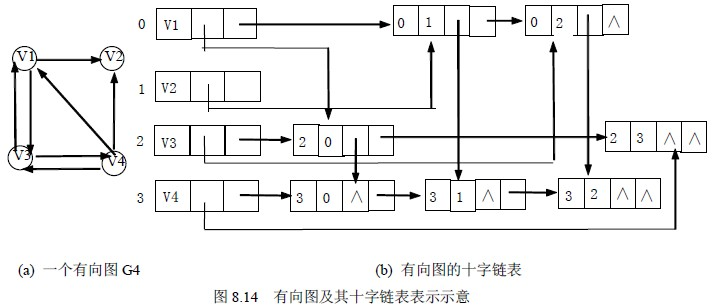

#	图

##	分类

图$G=<V, E>$：由一些称为顶点的点构成的集合，其中某些顶点由
称为边的线段相连

-	有限集合V：元素为顶点*vertex*
-	有限集合E：元素为**顶点二元组**，称为边*edge*/弧*arc*

###	边方向

####	*Undigraph*/*Undirected Graph*

> - 无向图：所有边都是无向边的图
> - 无向边：若有序对$(u, v) \in E$，必有$(v, u) \in E$，
	即E是对称的，顶点对$(u, v)$等同于$(v, u)$，没有顺序

对无向边$(u, v)$

-	则顶点u、v相互*adjcent*
-	其通过*undirected edge*$(u, v)$相连接
-	顶点u、v称为边$(u, v)$的*endpoint*
-	u、v和该边*incident*（相依附）

####	*Digraph*

> - 有向图：所有边都是有向边的图
> - 有向边：若有序对对$(u, v) \in E$无法得到$(v, u) \in E$，
	即两者不等同，有顺序

对有向边$(u, v)$

-	边$(u, v)$的方向是从顶点u到顶点v
-	u称为tail，v称为head

###	边权重

####	*Ordered Graph*

有序图：各边地位有序

####	*Weighted Graph*/*Network*

加权图/网络：给边赋值的图

-	值称为*weight*或*cost*
-	有大量的现实应用

###	边数量

-	*complete graph*：任意两个顶点直接都有的边相连的图
	-	使用$K_{|v|}$表示有|V|个顶点的完全图
-	*dense graph*：图中所缺的边数量相对较少
-	*sparse*：图中边相对顶点数量较少

####	特点

-	不考虑**loop**（顶点连接自身边），则含有|V|个顶点无向图
	包含边的数量|E|满足：
	$ 0 \leq |E| \leq \frac {|V|(|V| - 1)} {2} $

-	对于稀疏图、稠密图可能会影响图的表示方法，影响设计、使用
	算法的运行时间

##	图表示方法（存储结构）

###	*Adjacency Matrix*

邻接矩阵：两个数组分别存储数据元素（顶点）信息、数据元素之间
关系（边）的信息

-	n个顶点的图对应n * n的bool矩阵
	-	图中每个顶点使用一行和一列表示
	-	i、j节点间有边，则矩阵第i行、j列元素为1，否则为0
-	无向图邻接矩阵一定是对称的，有向图邻接矩阵不一定

```c
typedef enum{DG, DN< UDG, UDN} GraphKind;
typedef struct ArcCell{
	VRType adj;
		// 顶点关系类型：无权图0、1是否相邻，加权图权值类型
	InfoType * info;
		// 弧相关信息
}ArcCell, AdjMatrix[MAX_VERTEX_NUM][MAX_VERTEX_NUM];
typedef struct{
	VertexType vexs[MAX_VERTEX_NUM];
		// 顶点向量
	AdjMatrix arcs;
	int vexnum, arcnum;
		// 图当前顶点弧数
	GraphKind kind;
}
```

###	*Adjacency List*

邻接表：n条单链表代替邻接矩阵的n行，对应图G的n个顶点

-	每个顶点用一个邻接表表示

	-	线性表的*header*表示对应的顶点
	-	链表中结点表示依附于顶点的边

-	无向图一条边在邻接链表中对应两条链，有向图对应一条

	-	有向图出度计算简单
	-	计算入度则比较复杂，如果需要频繁计算入度，可以再存储
		一个反向邻接表

```c
typedef struct ArcNode{
	int adjvex;
		// 弧指向顶点信息
	struct ArcNode *nextarc;
		// 指向下条弧指针
	InfoType * info;
		// 弧相关信息
}ArcNode;
typedef struct VNode{
	VertexType data;
		// 顶点信息
	ArcNode * firstarc;
		// 首条依附该顶点的弧指针
}VNode, AdjList[MAX_VERTEX_NUM];
typedef struct{
	AdjList vertices;
	int vexnum, arcnum;
	int kind;
}
```

###	*Orthogonal List*

十字链表：将**有向图**的邻接表、逆邻接表结合起来

-	有向图中每条弧、每个顶点对应一个结点
-	弧结点所在链表为非循环链表，
	-	结点之间相对位置自然形成，不一定按照顶点序号有序
-	表头结点即顶点结点，顺序存储



```c
typedef struct ArcBox{
	int tailvex, headvex;
		// 头、尾顶点链域
	struct ArcBox *hlink, *tlink;
		// 头相同、尾相同弧链域
	InfoType *info;
		// 弧相关信息
}ArcBox;
typedef struct VexNode{
	VertexType data;
		// 顶点信息
	ArcBox *firstin, *firstout;
		// 顶点第一条出、入弧
}VexNode;
typedef struct{
	VexNode xlist[MAX_VERTEX _NUM];
		// 表头
	int vexnum, arcnum;
}OLGraph;
```

###	*Adjacency Multilist*

邻接多重表：**无向图**的另一种存储形式

-	一条边对应**唯一结点**
	-	所有依附于同一顶点的串联在同一链表中
	-	每个边界点同时链接在两个链表中
	-	避免无向图邻接表中一条边两次出现
-	类似十字链表，仅无需区分头尾结点


```c
typedef struct EBox{
	VisitIf mark;
		// 访问标记
	int ivex, jvex;
		// 边依附的两个顶点
	struct EBox *ilink, *jlink;
		// 依附两个顶点的下条边
	InfoType *info;
		// 边信息指针
}EBox;
typedef struct VexBox{
	VertexType data;
	EBox *firstedge;
		// 第一条依附该顶点的边
}VexBox;
typedef struct{
	VexBox adjmulist[MAX_VERTEX_NUM];
	int vexnum, edgenum;
}AMLGraph;
```

###	说明

-	稀疏图：尽管链表指针会占用额外存储器，但是相对于邻接矩阵
	占用空间依然较少

-	稠密图：邻接矩阵占用空间较少

-	邻接矩阵、邻接链表都可以方便的表示加权图
	-	邻接矩阵元素A[i, j]设置为有限值表示存在的边的权重，
		设置为$\infty$表示不存在边，此时矩阵也称
		**weighted matrix**或**cost matrix**
	-	邻接链表在节点中型跨同时包含节点名称和相应边权重

-	任何可以存储顶点、边的数据结构（如集合）都可以表示图，
	只是存储效率低、无法高效操作

##	概念

###	路径

####	有向图

-	*directed path*：有向图中顶点的一个序列，序列中每对连续
	顶点都被边连接，边方向为一个顶点指向下一个顶点

-	*directed cycle*：有向图中节点序列，起点、终点相同，每个
	节点和其直接前趋之间，都有一条从前趋指向后继的边

-	*directed acyclic graph*：DAG，有向无环图

####	无向图

-	*path*：（无向）图G中始于u而止于v的邻接顶点序列，即为顶点u
	到顶点v的路径

-	*simple path*：路径上所有点互不相同

-	*cycle*：特殊的path
	-	起点、终点都是同一顶点
	-	长度大于0
	-	不包含同一条边两次

-	*acyclic*：不包含回路的图

####	长度

-	*length*：路径中代表顶点序列中的顶点数目减1，等于路径中
	包含的边数目
-	*distance*：顶点间距离，顶点之间最短路径长度

###	连通性

####	无向图

-	*connected*：顶点u、v连通，当且仅当存在u到v的路径
-	*connected graph*：连通图，对图中的每对顶点$(u, v)$，
	都有从u到v的路径
-	*connected component*：连通分量，给定图的极大连通子图，
	即没有可以添加的连通子图用于扩充
	-	非连通图中包含的几个自我连通的部分

####	有向图

-	强连通图：对所有不同顶点u、v，都存在u到v、v到u的路径
-	*strongly connected component*：强连通分量，有向图的
	极大连通子图

###	源点、汇点

-	*soruce*：源，没有输入边的顶点
-	*sink*：汇点，没有输出边顶点

###	*cut*

割：$C(X,\bar X)$=所有头在$X$、尾在$\bar X$边集合

-	$X$；包含源点、不包含汇点的顶点V的子集
-	$\bar X$：$X$的补集，包含汇点
-	删除割中所有边，则不存在从源点的汇点的路径

##	图遍历

遍历图：实质是对每个顶点查找其邻接顶点的过程

> - 具体算法参见*algorithm/problem/graph*

###	遍历方式

> - BFS：*Breadth First Search*：广度优先搜索，类似树的先序
	遍历
> - DFS：*Depth First Search*：深度优先搜索，类似树的按层次
	遍历

> - 具体算法参见*algorithm/problem/graph*

###	结点添加方式

####	*Pre-Order*

正前序：处理子节点**前**处理当前顶点、添加进**队列**

####	*Reverse Pre-Order*

逆前序：处理子节点**前**处理当前结点、添加进**栈**

####	*Post-Order*

正后序：处理子节点**后**处理当前顶点、添加进**队列**

####	*Reversed Post-Order*

逆后序：处理子节点**后**处理当前结点、添加进**栈**

-	逆后序栈依次出栈得到的逆后序序列中

	-	同一连通路径上结点按照访问先后依次依次排列
	-	不同连通路径中结点整体**逆序排列**
	-	对有序图，若**访问路径中**两节点$u, v$之间存在有向边
		$(u, v)$，则在逆后序排列中，结点$u$仍然在$v$之前
		（不在访问路径中、有环则不一定）

-	用途最广

	-	有向图拓扑排序
	-	Kosaraju算法中用到

> - 类似DAG的拓扑排序，只是这里有向图可以有环，也称为
	**伪拓扑排序**

###	BFS、DFS森林

广度优先、深度优先生成森林

-	遍历的初始顶点可以作为森林中树的根
-	遇到新未访问的顶点，将其附加为**直接前趋**子女
-	其实**仅有树向边**才是符合森林定义（其他边都只是搜索过程
	中遇到）

####	边类型

-	*tree edge*：树向边，连接父母、子女的边
-	*back edge*：回边，连接非直接前驱的边
	-	对有向图包括连接父母的边
	-	对无向图不存在连接父母边
-	*cross edge*：交叉边，连接非前驱、后继的边
-	*forward edge*：前向边，连接非直接后代的边

####	边存在性

-	无向图
	-	DFS森林：只可能有回边
	-	BFS森林：只可能有交叉边
-	有向图
	-	DFS森林：可以都有
	-	BFS森林：只可能有回边、交叉边

###	*Spanning Tree*

生成树/极小连通子图：包含图中所有顶点的连通无环子图（树）

-	n个顶点的生成树有且仅有n-1条边，反之不成立

-	在生成树添加一条边必定构成一个环，因为其实使得其依附的
	两个顶点之间生成了第二条路径

####	*Minimum Cost Spanning Tree*

最小生成树：图的一棵权重最小的生成树（权重指所有边权重之和）

> - 具体算法参见*algorithm/problem/graph*

###	连通性

-	对图进行遍历是判断图连通性、求解连通分量的好方法

####	有向图

-	连通图：从图中任意顶点出发，进行深度、广度优先搜索即可
	访问到图中所有顶点

-	非连通图：从多个顶点出发进行搜索
	-	每次从新的起始点出发进行搜索过程中得到顶点访问序列
		就是各个连通分量的顶点集

####	无向图

-	深度优先搜索是求有向图**强连通分量**的有效方法

> - 具体算法参见*algorithm/problem/graph*

