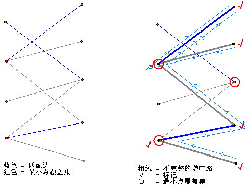

##	Bipartite Graph

二分图：所有顶点可以分为两个不相交集合U、V，两个集合大小不定
相等，但每条边都连接两个集合中各一顶点

-	可以证明：**当且仅当**图中不存在奇数长度回路时，为二分图

-	二分图中顶点可以可以染成两种颜色，使得每条边两头顶点颜色
	不同

-	矩阵存储二分图时，因为U、V内部节点之间无边，大部分场景
	只需要$|V| * |U|$的矩阵（对有序、加权适用）

-	性质
	-	二分图匹配意义：同类型（集合内部）之间没有连接

###	Augmenting-Path

（二分图）增益路径：对合法匹配M，简单**路径两端**连接V、U中
的自由顶点，路径中**边**交替出现在$E-M, M$中，称M的增益路径

-	增益路径长度总为奇数，为M中匹配两倍+1

-	则路径中奇数边组成新的匹配，比M多一条边

###	增益路径-最大匹配证明

当且仅当G中不存在M增益路径时，M为G最大匹配

必要性

-	若M存在增益路径，则可以扩展M得到更多匹配，M不是最大匹配

充分性

-	若存在M无增益路径，但不为最大匹配，设$M{*}$是G中的最大
	匹配，则$M{*}$中边至少比M中边数量大1，有
	$|M^{*}| > |M|, |M^{*} - M| > |M - M^{*}|$

-	则两者对称差集为
	$M \bigoplus M^{*} = (M - M^{*}) \cup (M^{*} - M)$

-	设$G^{'} \subseteq G$为二者差集中所有边、点，根据匹配
	定义，$G^{'}$中任何**单个点**和$M, M^{*}$相连接不会超过
	一条边

-	则$G^{'}$中顶点连通度不大于2，其中连通分量为
	
	-	偶数长度回路，其中边交替属于
		$|M^{*} - M|, |M - M^{*}|$，在两者中数量相同

		-	若不交替，则说明连续两条边在同个匹配中，有交点，
			和匹配定义冲突

		-	若不为偶数长度，同样的首、尾两条边在同一匹配中，
			和匹配定义冲突

	-	交替路径（无环）

		-	因为$|M^{*} - M| > |M - M^{*}|$，所以$G^{*}$中
			不可能仅有回路

		-	所以至少存在一条具有交替边路径，起点终点都是
			$M^{*} - M$同一条边（如单边路径），M具有增益路径
			，矛盾

> - 最大匹配求解匈牙利算法实现详见*graph*

###	Konig Theorem

Konig定理：二分图中最大匹配数|M| = 最小点覆盖数|C|

-	已经通过匈牙利算法求出最大匹配M

-	从集合V中**每个未被匹配**点开始，走一条**类似**增益路径
	的交替路径，标记路径中的所有点

	-	只是因为已经找到了最大匹配，所以路径另外一端不可能
		是自由顶点

	-	**允许重复**走过同一条边

-	路径中V到U的均为非匹配边、U到V均为匹配边

> - 当然也可以从U的所有未匹配顶点开始

记集合V中中未被访问、U集合中已被访问的已匹配顶点点集为C，则
$顶点数目|C| = 最大匹配数 = 最小点覆盖数$

-	因为每个点都是M中某边端点，且V中已标记同U中未标记、V中
	未标记顶点同U中已标记一一对应，为匹配边两端点，所以

	$$
	顶点数 = V中未被访问 + U中已访问 = \\
	V中未访问 + V中已访问 = （最大）匹配数
	$$

-	在最大匹配情况下，所有边至少有一个端点为已匹配点

	-	对于匹配边，肯定被C中顶点覆盖
	
	-	若非匹配顶点在V中，则一定在某个路径中被访问，则被U
		中某个已访问匹配顶点覆盖

	-	若非匹配顶点在U中，则被V中未访问顶点覆盖的

	-	或者说不存在这样的边：其左端点没有标记、而右端点有
		标记
		-	匹配边肯定不是起点，不可能
		-	非匹配边，右端有标记则能直接访问左端，标记左端
			（通样广度优先搜索遍历所有邻接有顶点点）

-	而要覆盖匹配边需要至少$|M|$个点，所以$|M|$是最小覆盖点数

####	推论 1

二分图中：最小边覆盖|W| = 图中顶点数|V| - 最小点覆盖数|C|

$$
|W| = |V| - |M| = |V| - |C|
$$

##	Ordered Bipartite Graph

有序二分图：以同一顶点作为端点的边的有优先级（独立于其他点）

-	即：V中顶点对U中顶点都有优先级排序，U中顶点对V中顶点也有
	优先级排序

###	Marriage Matching

婚姻匹配问题可以使用特殊的**完全有序二分图**代表

-	集合V（男士集合）、U（女士集合）大小相同为n

-	任意男士、女士都有之间都有边连接，即任意男士、女士都需要
	给出所有女士、男士优先级

####	存储、表示方法

-	优先列表：各男士、女士按照异性优先级排序列表，共2n个

	-	对实现匹配算法而言效率更高

-	等级矩阵：男士、女士为分别作为矩阵行、列，矩阵元素$P_ij$
	为男士$m_i$对女士$w_j$优先级排序、女士$w_j$对男士$m_i$
	优先级排序元组

	-	更容易看出集合元素匹配
	-	只需要$n * n$阶方阵

####	Stable Marriage Matching

对包含n个对的婚姻匹配M

-	*Block Pair*：受阻对，满足$m \in V, w \in U$，而$(m, w)$
	更倾向于对方，而不是匹配M中对象

-	*Stable Marriage Matching*：稳定婚姻匹配，不存在受阻对的
	婚姻匹配

####	稳定婚姻存在性

V中存在自由男士时，任选*求婚*、*回应*之一执行，直至不存在
自由男士

> - 求婚：自由男士m向女士w求婚，w为其优先级最大、之前未拒绝
	过其女士（可以是已匹配）

> - 回应：若女士w自由则接受男士m求婚，与之配对；女士w不自由
	则把m同当前配偶匹配，选择其中优先级较高者

当不存在自由男士时，得到匹配M就是稳定匹配

-	若M是不稳定的，设存在受阻对$(m, w)$

-	因为m按照降序求婚，所以m必然在某次迭代向w求过婚，则w当前
	对偶必然比m拥有更高优先级，和受阻对假设矛盾

> - 稳定婚姻问题求解算法参见*graph*

##	Weighted Bipartite Graph

加权二分图；每条边都有权重的二分图

###	Distribution Problem

分配问题可以使用特殊的**完全加权二分图**代表

-	集合V（人员集合）、U（任务集合）大小相同为n

-	任意人员、任务有边相连，人员、任务内部之间无边

####	存储方法

-	使用$n * n$阶成本矩阵C存储，其元素$c_{ij}$表示人员$i$
	完成任务$j$的成本

-	则问题转化为：从成本矩阵中每行分别选择元素，且元素不属于
	同一行，使得和最小

> - （最小成本）分配问题算法参见*graph*

##	*Biconnected Graph*

> - *articulation point*：关节点，删除顶点v、与v相连的各边
	之后，将图一个连通分量分割成 两个、两个以上连通分量，则
	称顶点v为图的一个关节点

> - *biconnected graph*：重连通图，没有关节点的连通图

-	重连通图中任意一对结点之间至少存在两条路径

-	若在重连通图中至少删除k个顶点才能破坏图的连通性，则称图
	的**连通度**为k

###	求解关节点

利用DFS可以求出图的关节点，判断图是否是重连通的，对DFS生成树

-	生成树有两棵及以上子树，则根节点为关节点
	-	因为不同子树之间不存在连通不同子树顶点的边
-	非叶子顶点v**某棵子树**中没有指向v前驱的回边，则v为关节点

> - 算法参见*algorithm/problems/graph*

