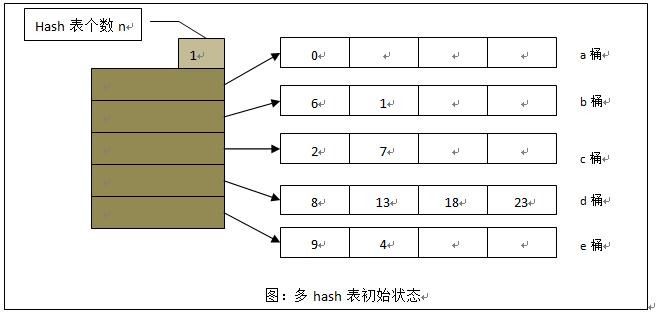
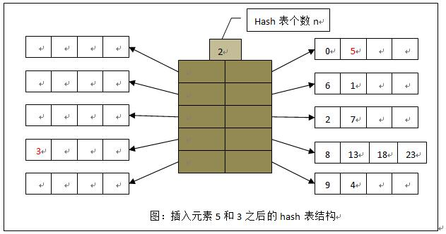
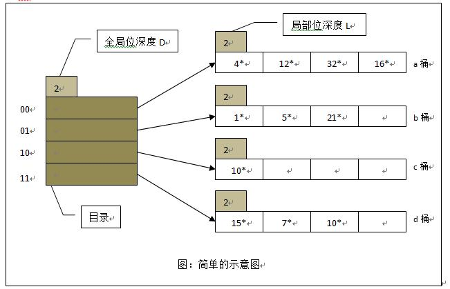
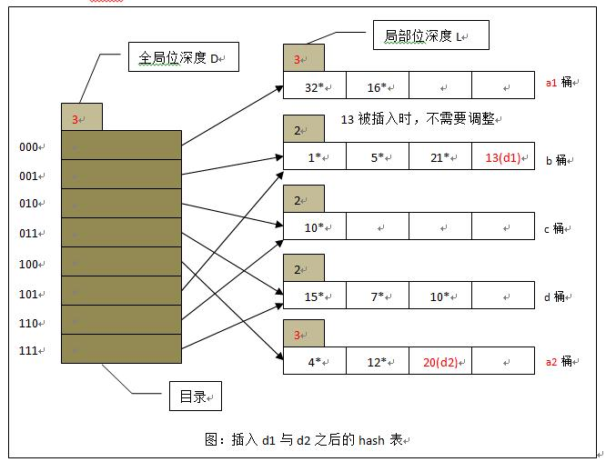
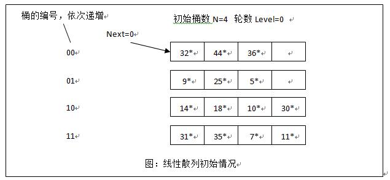
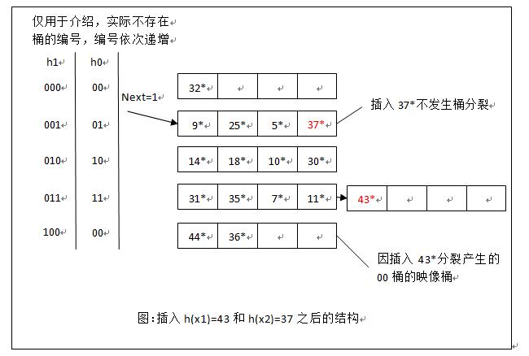
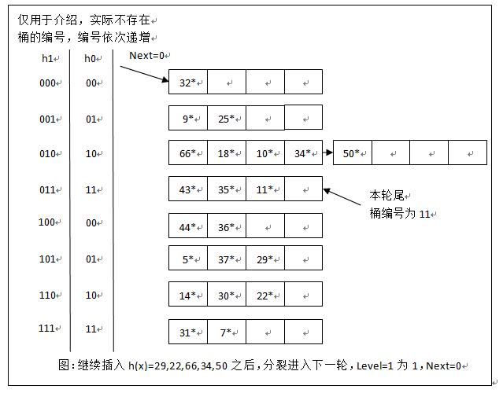

#	Hashing

##	*Hashing Table*

> - 哈希表/散列表：可根据哈希值**直接访问**的数据结构

-	原理：以哈希值做为地址，缩小搜索空间、提高查找效率
	-	使用哈希函数为每个键计算哈希值，得到位于
		$0, \cdots, m-1$之间整数
	-	按照哈希值把键分布在$H[0, \cdots, m-1]$哈希表中
	-	查找匹配键时，以查找键**哈希值作为起点**在哈希表中
		搜索

-	应选择合适的哈希函数、哈希表长度，尽量把键尽量均分在
	哈希表中
	-	哈希函数$hash$：参见*math_algebra/#todo*
		-	对闭散列：减少冲突
		-	对开散列：避免数据集中
	-	散列表长度$m$：常为质数（方便双散列）

###	*Load Factor*

负载因子：$\alpha = \frac {noempty} {prime}$

> - $prime$：哈希表长度（哈希桶数量）
> - $noempty$：非空数量

-	闭散列：负载因子反映哈希表冲突可能性、查找效率
	-	负载因子过小：冲突可能性小，查找效率高，但浪费空间
	-	负载因子过大：冲突可能性大，查找效率低，空间利用率高
	-	负载因子取值最大为1
	-	应适当平衡负载因子，负载因子接近1时重散列，避免冲突
		过多影响查找效率

	> - Java中`HashMap`初始负载值为0.75

-	开散列：负载因子反映查找效率
	-	但应该无法反映冲突可能性（也无必要）
		-	开散列往往被用于应对大规模数据，冲突总是存在
		-	查找效率更多取决于数据（哈希值）偏倚程度
	-	负载因子可以大于1

###	应用

-	字典/映射实现：*cs_algorithm/data_structure/set*

##	*Open Addressing*

闭散列/开放寻址：所有键存储在散列表本身中，不扩展存储空间

-	哈希表$m$至少要和哈希键数量$n$一样大

-	冲突问题解决：根据一定规则计算下个地址

-	*cluster*：聚合，散列表接近满时，一序列连续单元格被占据
	-	线性探查性能恶化，操作效率降低
	-	聚合越来的越大时，新元素插入聚类可能性增加
	-	聚合可能被新插入元素连接，导致更大程度聚合

###	增量类型

增量类型：碰撞发生后，根据一定规则对原哈希值修正

$$
H_i = (hash(key) + d_i) mod m, i=1,2,\cdots
$$

> - $d_i = i$：*linear probing*，线性探查
> - $d_i = i^2, -i^2$：*quadratic probing*，二次探查
> - $d_i = 伪随机数$：伪随机探查
> - $d_i = i * hash_2(K), i=0,1,2,\cdots$：*double hashing*
	，再散列法

-	再散列法说明：为保证哈希表中每个位置被探查，增量$s(K)$
	必须互质
	-	$m$为质数时自动满足
	-	文献推荐：$s(K) = m - 2 - K mod (m-2)$
	-	对较小散列：$s(K) = 8 - (K mod 8)$
	-	对较大散列：$s(K) = K mod 97 + 1$

####	操作

-	插入：依次检查哈希值$h(K)$、探查目标序列，直至找到空
	单元格放置键

-	查找：给定查找键K，计算哈希值$h(K)$、探查目标序列，比较
	K和单元格中键值
	-	若查找到匹配键，查找成功
	-	遇到空单元格，查找失败

-	删除：**延迟删除**，用特殊符号标记曾经被占用过、现被删除
	的位置
	-	不能直接删除，否则的中间出现空单元格，影响查找正确性

####	算法效率

-	成功查找访问次数：
	$S \approx \frac 1 2 (1+\frac 1 {(1-\alpha)})$

-	失败查找访问次数：
	$U \approx \frac 1 2 [1+\frac 1 {(1-\alpha)^2}]$

> - 简化版本近似结论（散列规模越大，近似结论越正确）
> - 无法避免散列表趋满时性能恶化
> - 再哈希法数学分析困难，经验表明优秀的散列函数（两个），
	性能较线性探查好

###	*Multi Hashing*

多重哈希：使用一组哈希函数$h_0,\cdots,h_n$依次计算哈希值，
确定插入、查找地址

-	类似增量类型方法，仅各次地址独立使用哈希函数计算

###	*Rehashing*

重散列：扫描当前表，将所有键重新放置在更大的表中

-	散列表趋满时唯一解决办法

##	*Chaining*

开散列/分离链：哈希表作为目录，使用额外数据空间组织哈希键

###	拉链法/分桶法

拉链法/分桶法：哈希表作为目录项存储指向hash桶的指针，hash桶
中存储哈希键

-	目录项：顺序表，连续存储空间
	-	可以通过hash值在常数时间内定位：一般其索引位置就是
		hash值
	-	目录项越多，数据分布相对越稀疏、碰撞概率越小、效率
		越高

-	hash桶：目录项对应的线性表、线性表链
	-	桶内每个元素hash值相同
	-	链表、顺序表、顺序表链均可用于实现桶

####	操作

-	查找
	-	对查找键K，使用同样散列函数计算键散的函数值$h(K)$
	-	遍历相应单元格附着链表，查找是否存在键K
-	插入：计算键对应桶，在链表尾部添加键即可
-	删除：查找需要删除的键，从链表中移除即可

####	算法效率

-	效率取决于链表长度，而链表长度取决于字典、散列表长度
	和散列函数质量
	-	成功查找需要检查指针次数$S = 1 + \alpha / 2$
	-	不成功查找需要检查指针次数$U = \alpha$
	-	计算散列函数值是常数时间操作
	-	若n和m大致相等，平均情况下$\in \Theta(1)$

-	算法查找的高效是以额外空间为代价的

##	*Dynamic Hashing*

动态hash：在hash表中元素增加同时，动态调整hash桶数目

-	在原hash表基础上进行动态桶扩展
-	不需要遍历表元素重复执行插入操作
-	**开散列法在大规模、在线数据的扩展**

###	多hash表

多hash表：通过建立多个hash表的方式扩展原hash表

-	思想、实现简单
-	占用空间大，数据分布偏斜程度较大时，桶利用率不高

####	实现

操作时需要考虑多个hash表

-	插入
	-	若存在hash相应桶中存在空闲区域，直接插入
		
	-	否则分裂，新建hash表，插入元素至空闲区域
		

-	查找：需要查找所有hash表相应桶才能确定
	-	当表中元素较多时，可以考虑并行执行查找操作

-	删除操作：若删除元素导致某hash表空，可考虑删除该表

###	可扩展动态hash

可扩展动态hash：只分裂将要溢出的桶，**使用目录项作为索引**

-	多个目录项可能指向同一个桶
-	分裂时代价较小
	-	翻倍目录项替代翻倍整个hash表
	-	每次只分裂将要溢出桶
	-	只需要进行局部重散列，重分布需要分裂的桶
-	目录指数级增长
	-	数据分布不均时，会使得目录项很大

####	插入

> - `D`：全局位深度，hash值截断长度，为局部桶深度最大值
> - `L_i`：桶局部深度，等于指向其目录项数目

-	若对应桶存在空闲位，则直接插入

	

-	否则分裂桶：分裂后两桶局部深度加1

	

	-	若分裂桶局部深度不大于全局位深度
		-	创建新桶
		-	重散列原始桶中数据
		-	更新目录项中对应指针：分别指向分裂后桶

	-	若分类桶局部深度大于全局位深度
		-	更新全局位深度
		-	目录项翻倍
		-	创建新桶
		-	重散列原始桶中数据
		-	更新目录项中对应指针
			-	（新增）无关目录项仍然指向对应桶
			-	相关目录项指向分别指向分裂后桶

####	查找

-	计算原始hash值
-	按照全局位深度截断
-	寻找相应目录项，找到对应桶，在桶中进行比较、查找

####	删除

-	计算原始hash值
-	按照全局位深度截断
-	寻找相应目录项，找到对应桶，在桶中进行比较、删除
	-	若删除后发现桶为空，考虑与其兄弟桶合并，并使局部深度
		减1

###	线性散列

线性散列：按次序分裂桶，**保证整个建表过程类似完全二叉树**

-	整个哈希表建表过程**始终保持为完全二叉树**
	-	每次分裂的桶是完全二叉树编号最小的叶子节点
	-	分裂前后桶间均为有序

-	相较于可扩展散列
	-	无需存放数据桶指针的专门目录项，节省空间
	-	能更自然的处理数据桶满的情况
	-	允许更灵活的选择桶分裂时机
	-	但若数据散列后分布不均，则问题可能比可扩散散列严重

-	实现相较而言更复杂

####	桶分裂

> - `N`：hash表中初始桶数目，应为2的幂次
> - `d = log_2N`：表示桶数目需要位数
> - `level`：分裂轮数，初始值为0，则每轮初始桶数为
	$N * 2^{level}$
> - `Next`：下次要发生分裂的桶编号

-	每次同分裂条件可以灵活选择
	-	设置桶填充因子，桶中记录数达到该值时进行分裂
	-	桶满时发生分裂

-	每次发生的分裂的桶总是由`Next`决定
	
	-	与当前被插入的桶溢出无关，可引入溢出页处理桶溢出
	-	每次只分裂`Next`指向的桶，桶分裂后`Next += 1`
	-	后续产生映像桶总是位于上次产生映像桶之后

-	“轮转分裂进化”：各桶轮流进行分裂，一轮分裂完成后进入下轮
	分裂
	

####	查找

-	根据`N`、`level`计算当前`d`值，截取原始hash值

-	若hash值位于`Next`、`N`之间，说明该轮对应桶还未分裂，
	直接在桶中查找

-	若hash值小于`Next`，说明该轮对应桶已经分裂，hash值向前
	多取一位，在对应桶中查找

####	删除

> - 删除操作是插入操作的逆操作

-	若删除元素后溢出块为空，可直接释放
-	若删除元素后某个桶元素为空，`Next -= 1`
	-	当`Next`减少到0，且最后桶也是空时，`Next = N/2 - 1`
		，同时`level -= 1`

