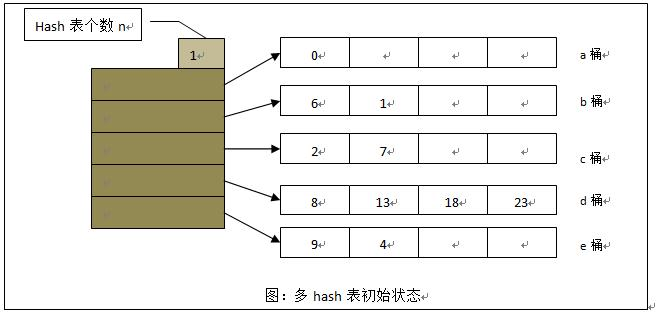
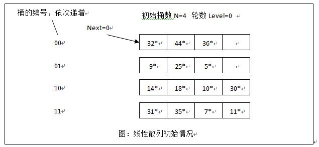
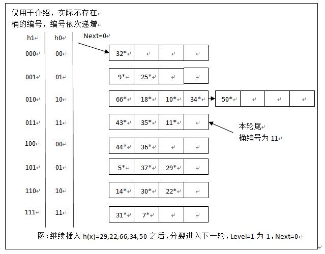

#	Hashing

##	*Hashing*

散列/哈希：将任意类型值转换为数值（地址），用于确定（接近）
键值、地址

-	对每个键使用*hash function*进行计算
-	得到位于$0, \cdots, m-1$之间的*hash address/code*整数
-	把键分布在一维数组$H[0, \cdots, m-1]$ *hash table*中
-	在哈希表中查找匹配键时，以键哈希码作为**起点**查询

###	*Hash Function*

选择合适散列表长度、散列函数尽可能减少*collision*

-	散列表长度相对键个数不应该过大避免空间浪费，也不应该过小
	影响算法时间效率

-	散列函数需要把键在散列表单元格中尽量均匀分

	-	所以散列表长度m常常选为质数（方便双散列）
	-	此要求散列函数必须考虑键所有比特位（否则容易发生碰撞）

-	散列函数必须容易计算

###	*Load Factor*

负载因子：$\alpha = \frac n m$不应该和1相差太大

-	太大说明链表太长，查找时间很长
-	太小说明存在许多空链表，没有有效利用空间
-	接近1时，平均使用一次两次比较就能完成查找

###	分类

-	*Data Independent Hashing*：数据无关哈希

	-	对原始的特征空间作均匀划分
	-	对分布不均、有趋向性的数据集时，可能会导致高密度区域
		hash桶臃肿，降低索引效率

-	*Data Dependent Hashing*：数据依赖哈希

	-	通过学习数据集的分布从而给出较好划分的hash函数，得到针对
		数据密度的hash索引

	-	破坏了传统LSH的数据无关性，索引不具备普适性

###	应用

####	字典实现

字典实现主要是：平衡查找树、散列表

||散列表|平衡查找树|
|-----|-----|------|
|渐进时间效率|平均$\in \Theta(1)；最坏$\in \Theta(n)$|$\in \Theta(logn)|
|有序性保留|不假定键有序，不保证，不适合按序遍历、按范围查询|保证|

####	Extendible Hashing

其散列函数计算结果是一个存储段的磁盘地址

-	可扩充散列可用于存储磁盘上非常大型字典
	-	查找时先计算可能包含查找键K的存储段磁盘地址
	-	然后从磁盘中读取段中所有键，从中查找K
	-	存取主存开销较磁盘小很多，宁可多次存取主存

##	开散列（分离链）

开散列：目录项存储指向hash桶的指针，hash桶中存储标识值

-	目录项：顺序表，连续存储空间	
	-	可以通过hash值在常数时间内定位：一般其索引位置就是
		hash值
	-	目录项越多，数据分布相对越稀疏、碰撞概率越小、效率
		越高

-	hash桶：线性表
	-	桶内每个元素hash值相同
	-	链表、顺序表均可用于实现桶，特点同普通

###	查找

-	对查找键K，使用同样散列函数计算键散的函数值$h(K)$
-	遍历相应单元格附着链表，查找是否存在键K

####	算法效率

-	算法效率取决于链表长度，而链表长度取决于字典、散列表长度
	和散列函数质量
	-	成功查找需要检查指针次数$S = 1 + \alpha / 2$
	-	不成功查找需要检查指针次数$U = \alpha$
	-	计算散列函数值是常数时间操作
	-	若n和m大致相等，平均情况下$\in \Theta(1)$

-	算法查找的高效是以额外空间为代价的

###	插入

-	类似于查找，在链表尾部添加键即可
-	若n和m大致相等，平均状态下算法时间效率$\in \Theta(1)$

###	删除

-	查找需要删除的键，在链表中移除即可
-	若n和m大致相等，平均情况下算法时间效率$\in \Theta(1)$

##	闭散列（开式寻址）

闭散列：所有键存储在散列表本身中，没有使用链表

-	表长度m至少要和键数量n一样大
-	需要解决碰撞问题

###	Linear Probing

线性探查，检查发生碰撞处后面单元格，如果单元格为空，则放置键
，否则继续查找直接后继（到尾部则循环）

####	查找

-	给定查找键K，计算散列函数值$h(K)$
-	从$h(K)$开始向后遍历后继，比较K和单元格中键值
	-	若查找到匹配键，查找成功
	-	遇到空单元格，查找失败

####	删除

闭散列不能直接删除，否则的中间出现空单元格，影响查找正确性

-	延迟删除：用特殊符号标记曾经被占用过、现被删除的位置

####	算法效率

简化版本近似结论（散列规模越大，近似结论越正确）

-	成功查找访问次数：
	$S \approx \frac 1 2 (1+\frac 1 {(1-\alpha)})$

-	失败查找访问次数：
	$U \approx \frac 1 2 [1+\frac 1 {(1-\alpha)^2}]$

####	*Cluster*

聚类：散列表接近满时，一序列连续单元格被占据

-	线性探查性能恶化，降低字典操作效率
-	聚类越来的越大时，新元素加入聚类可能性增加
-	大的聚类可能被新插入元素连接，导致更大程度聚合

###	Double Hashing

双散列法：增加一个散列函数$s(K)$，用于确定碰撞发生后，所使用
的探查序列遍历的固定增量

-	被探查序列为：$(h(K)+ i * s(K)) mod m, i=0, 1, 2, \cdots$

-	为了保证散列表中每个位置被探查，增量$s(K)$必须互质
	-	m为质数时自动满足
	-	文献推荐：$s(K) = m - 2 - K mod (m-2)$
	-	对较小散列：$s(K) = 8 - (K mod 8)$
	-	对较大散列：$s(K) = K mod 97 + 1$

####	算法特点

-	数学分析比较困难，经验表明优秀的散列函数（两个），其性能
	较线性探查好
-	散列表趋满时，性能也会恶化

###	Rehashing

重散列：扫描当前表，将所有键重新放置在更大的表中

-	散列表趋满时唯一解决办法

##	*Dynamic Hashing*

动态hash：在hash表中元素增加同时，动态调整hash桶数目

-	在原hash表基础上进行动态桶扩展
-	不需要对表元素进行再次插入操作

###	多hash表

多hash表：通过建立多个hash表的方式扩展原hash表

-	思想、实现简单
-	占用空间大，数据分布偏斜程度较大时，桶利用率不高

####	实现

操作时需要考虑多个hash表

-	插入
	-	若存在hash相应桶中存在空闲区域，直接插入
		
	-	否则分裂，新建hash表，插入元素至空闲区域
		

-	查找：需要查找所有hash表相应桶才能确定
	-	当表中元素较多时，可以考虑并行执行查找操作

-	删除操作：若删除元素导致某hash表空，可考虑删除该表

###	可扩展动态hash

可扩展动态hash：只分裂将要溢出的桶

-	多个目录项可能指向同一个桶
-	分裂时代价较小
	-	翻倍目录项替代翻倍整个hash表
	-	每次只分裂将要溢出桶
	-	只需要进行局部重散列，重分布需要分裂的桶
-	目录指数级增长
	-	数据分布不均时，会使得目录项很大

####	插入

> - `D`：全局位深度，hash值截断长度，为局部桶深度最大值
> - `L_i`：桶局部深度，等于指向其目录项数目

-	若对应桶存在空闲位，则直接插入

	

-	否则分裂桶：分裂后两桶局部深度加1

	

	-	若分裂桶局部深度不大于全局位深度
		-	创建新桶
		-	重散列原始桶中数据
		-	更新目录项中对应指针：分别指向分裂后桶

	-	若分类桶局部深度大于全局位深度
		-	更新全局位深度
		-	目录项翻倍
		-	创建新桶
		-	重散列原始桶中数据
		-	更新目录项中对应指针
			-	（新增）无关目录项仍然指向对应桶
			-	相关目录项指向分别指向分裂后桶

####	查找

-	计算原始hash值
-	按照全局位深度截断
-	寻找相应目录项，找到对应桶，在桶中进行比较、查找

####	删除

-	计算原始hash值
-	按照全局位深度截断
-	寻找相应目录项，找到对应桶，在桶中进行比较、删除
	-	若删除后发现桶为空，考虑与其兄弟桶合并，并使局部深度
		减1

###	线性散列

线性散列

-	相较于可扩展散列
	-	无需存放数据桶指针的专门目录项，节省空间
	-	能更自然的处理数据桶满的情况
	-	允许更灵活的选择桶分裂时机
	-	但若数据散列后分布不均，则问题可能比可扩散散列严重

-	实现相较而言更复杂

####	桶分裂

> - `N`：hash表中初始桶数目，应为2的幂次
> - `d = log_2N`：表示桶数目需要位数
> - `level`：分裂轮数，初始值为0，则每轮初始桶数为
	$N * 2^{level}$
> - `Next`：下次要发生分裂的桶编号

-	每次同分裂条件可以灵活选择
	-	设置桶填充因子，桶中记录数达到该值时进行分裂
	-	桶满时发生分裂

-	每次发生的分裂的桶总是由`Next`决定
	
	-	与当前被插入的桶溢出无关，可引入溢出页处理桶溢出
	-	每次只分裂`Next`指向的桶，桶分裂后`Next += 1`
	-	后续产生映像桶总是位于上次产生映像桶之后

-	“轮转分裂进化”：各桶轮流进行分裂，一轮分裂完成后进入下轮
	分裂
	

####	查找

-	根据`N`、`level`计算当前`d`值，截取原始hash值

-	若hash值位于`Next`、`N`之间，说明该轮对应桶还未分裂，
	直接在桶中查找

-	若hash值小于`Next`，说明该轮对应桶已经分裂，hash值向前
	多取一位，在对应桶中查找

####	删除

> - 删除操作是插入操作的逆操作

-	若删除元素后溢出块为空，可直接释放
-	若删除元素后某个桶元素为空，`Next -= 1`
	-	当`Next`减少到0，且最后桶也是空时，`Next = N/2 - 1`
		，同时`level -= 1`

##	*Locality Sensitive Hashing*

*LSH*：局部敏感hash，数据依赖hash

> - $(r_1,r_2,P_1,P_2)-sensitive$hash函数族$H$需满足如下条件
	$$\begin{align*}
	Pr_{H}[h(v) = h(q)] \geq P_1, & \forall q \in
		B(v, r_1) \\
	Pr_{H}[h(v) = h(q)] \geq P_2, & \forall q \notin
		B(v, r_2) \\
	\end{align*}$$
> > -	$h \in H$
> > -	$r_1 < r_2, P_1 > P_2$：函数族有效的条件
> > -	强调比例时会表示为$r_1 = R, r_2 = cR$

###	说明

####	思想

-	使用一组来自局部敏感哈希族的哈希函数对目标进行映射，使得
	**相似目标比不相似目标有更大概率发生冲突**

-	则相似目标更有可能映射到相同hash桶中
	-	则只需要在目标所属的hash桶中进行比较、查找即可
	-	无需和全集数据比较，大大缩小查找空间，

-	可视为降维
	-	在低维空间（一维hash值）寻找可能近邻的数据点
	-	缩小范围后再进行精确比较

####	概率放大

局部敏感哈希函数族$Pr_1, Pr_2$之间差距不够大

-	增加哈希键位长（级联哈希函数中哈希函数数量）$k$
	-	每个哈希函数独立选择，则对每个级联哈希函数$g_i$
		$Pr[g_i(v) = g_i(q)] \geq P_1^k$
	-	虽然增加哈希键位长会减小目标和近邻碰撞的概率，但同时
		也更大成都上减少了和非近邻碰撞的概率、减少搜索空间

-	增加哈希表（级联哈希函数数量）$L$
	-	$L$个哈希表中候选项包含真实近邻概率**至少**为
		$1 - (1 - P_1^k)^L$
	-	增加哈希表数量能有效增加候选集包含近邻可能性
	-	但是

####	搜索近似最近邻

-	使用$L$个级联哈希函数分别处理待搜索目标
-	在$L$个哈希表分别寻找落入相同哈希桶个体作为候选项
-	在所有候选项中线性搜索近邻

###	*Original LSH*

*Original LSH*：原始LSH

-	基于汉明距离空间
	-	要求数据为二进制表示
	-	使用汉明距离，否则需要将其他距离嵌入汉明距离空间

-	欧几里得距离没有直接嵌入汉明空间的方法
	-	一般假设欧几里得距离和曼哈顿距离差别不大
	-	直接使用对曼哈顿距离保距嵌入方式

####	哈希函数

考虑哈希函数族$H$

-	其中函数为$\{0, 1\}^d$到$\{0, 1\}$的映射：随机返回
	特定比特位上的值

-	从$H$中随机的选择哈希函数$h_i$

-	则$Pr[h(v) = h(q)]$等于$v, q$相比特数比例，则
	-	$Pr_1 = 1 - \frac R d$
	-	$Pr_2 = 1 - \frac {cR} d$

-	$Pr_1 > Pr_2$，即此哈希函数族是局部敏感的

###	*Exact Euclidean LSH*

$E^2LSH$：欧式局部LSH

-	*LSH Based-on P-stable Distribution*
	-	使用内积将向量随机映射到hash值
	-	*p-stable*分布性质将欧式距离同hash值相联系，实现
		局部敏感

-	特点
	-	基于概率模型生成索引编码的结不稳定
	-	随编码位数$k$增加的，准确率提升缓慢
	-	哈希表数量较多时，需要大量存储空间，不适合大规模数据
		索引

####	哈希函数

####	碰撞概率

###	*Scalable LSH*

*Scalable LSH*：可扩展的LSH

-	对动态变化的数据集，固定hash编码方法的局部敏感hash方法
	对数据**动态支持性有限**，无法很好的适应数据集动态变化

	-	受限于初始数据集分布特性，无法持续保证有效性
	-	虽然在原理上支持数据集动态变化，但若数据集大小发生
		较大变化，则其相应hash参数（如hash编码长度）等需要
		随之调整，需要从新索引整个数据库

-	在$E^2LSH$基础上通过**动态增强哈希键长**，增强哈希函数
	区分能力，实现可扩展LSH

