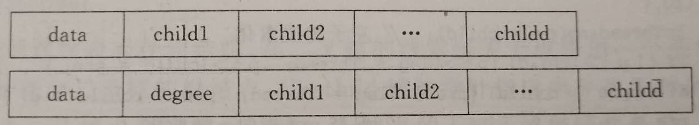
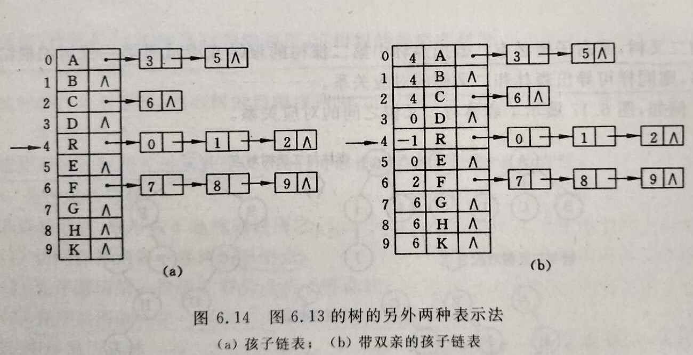

##	树&森林

###	*Free tree*

自由树：**连通**、**无回路图**，具有一些其他图不具有的重要
特性

-	边数总比顶点数少一：$|E|=|V|-1$
	-	这个是图为一棵树的必要条件，但不充分
	-	若图是连通的，则是充分条件

-	任意两个顶点之间总是存在简单路径

###	*(Rooted)Tree*

（有根）树：存在根节点的自由树

$$
Tree = (root, F)
$$

> - $root$：根节点数据元素
> - $F=(T_1, T_2, \cdots, T_m)$：森林
> - $T_i=(r_i, F_i)$：根root的第i棵子树

-	在任意一棵非空树中
	-	有且仅有一个特定称为根的节点
	-	节点数n>1时，其余节点可以分为m个**互不相交**的有限集
		，每个集合本身又是一棵树，称为根的子树

-	树中任何两个节点间**总存在简单路径**，所以可以任选自由树
	中某节点，作为有根树的根

-	有根树远远比自由树重要，所以也简称为树
	-	根一般放在树的顶层，第0层
	-	之后节点根据和根的距离放在相应层数

###	*Forest*

森林：**无回路**但不一定连通的图

-	其每个连通分量是一棵树
-	对树中每个节点，其子树集合即为森林

###	Ordered Tree

有序树：所有顶点的所有子女都是有序（不能交换次序）的有根树

###	应用

-	常用于描述层次关系
	-	文件目录
	-	企业的组织结构
	-	字典的实现
	-	超大型的数据集合的高效存储
	-	数据编码

-	用于分析递归算法
	-	*state-space tree*：状态空间树，强调了两种算法设计
		技术：回溯、分支界限

###	结构

-	*ancestor*：从根到该顶点上的简单路径上的所有顶点
-	*proper ancestor*：除自身外的所有祖先顶点
-	*parent*：从根到顶点简单路径中，最后一条边的另一端节点
-	*parental*：至少有一个子女的顶点
-	*child*：
-	*sibling*：具有相同父母的顶点
-	*leaf*：没有子女的顶点
-	*descendent*：所有以该顶点为祖先的顶点
-	*proper descendent*：不包括顶点自身的子孙
-	*subtree*：顶点的所有子孙、连接子孙的边构成以该顶点为根的
	子树
-	*depth*：根到该顶点的简单路径的长度
-	*height*：根到叶节点的最长简单路径的长度

###	链式存储结构

-	链表结点代表树中一个顶点，其中至少包含：数据域、指向子女
	的指针域
-	链表头指针指向二叉树根节点

####	双亲表存储

双亲表示法

-	利用除根节点外，每个结点只有一个双亲，给所有结点添加一个
	指向双亲的指针域

```c
typedef struct PTNode{
	TElemType data;
	int parent;
}PTNode;
typedef struct{
	PTNode nodes[MAX_TREE_SIZE];
	int r, n;
}PTree;
```

-	求结点双亲时是常数时间
-	求结点孩子时需要遍历整个结构

####	孩子链表存储

孩子表示法

-	把每个结点的孩子结点排列起来，视为线性表，以单链表作为
	存储结构

	-	否则结点同构则浪费空间，不同构时操作不方便

		

```c
typedef struct CTNode{
	// 逻辑意义的结点，存储兄弟关系
	int child;
		// 结点位置，`nodes`中序号
	struct CTNode *next;
		// 指示下个兄弟结点
}*ChildPtr;
typedef struct{
	// 实际存储信息的结点
	TElemType data;
	ChildPtr firstchild;
		// 孩子链表头指针
}CTBox;
typedef struct{
	CTBox nodes[MAX_TREE_SIZE];
	int n, r;
		// 节点数，根节点位置
}CTree;
```



####	二叉链表存储

*First Child-next Silbling Representaion*：孩子兄弟/二叉链表
/二叉树表示法

> - 每个节点只包含两个指针，左指针指向第一个子女，右指针指向
	节点的下一个兄弟
> - 节点的所有兄弟通过节点右指针被单独的链表连接

```c
typedef struct CSNode{
	ElemType data;
	struct CSNode *firstchild, *nextsibling;
}CSNode, *CSTree;
```

-	可高效的将有序树改造成一棵二叉树，称为**关联二叉树**
-	易于实现某些操作
	-	寻找孩子结点

###	森林与二叉树转换

-	给定一棵树，可以以二叉链表为媒介导出树与二叉树之间的对应
	关系，即可以找到唯一一棵二叉树和与之对应

	-	任何一棵树对应的二叉树，其右子树必然为空

-	将森林中各棵树的根节点看作兄弟结点，则可以得到森林和
	二叉树的对应关系

####	森林转换为二叉树

森林$F=\{T_1, T_2, \cdots, T_M\}$转换为二叉树的
$B=(root, LB, RB)$

-	若F为空，即m=0，则B为空树
-	若F非空
	-	root即为森林中第一个树的根$ROOT(T_1)$
	-	LB是从$T_1$中根节点的子树森林转换而成的二叉树
	-	RB是从森林$F^{'}$转换而来的二叉树

####	二叉树转换为森林

二叉树的$B=(root, LB, RB)$转换为森林
$F=\{T_1, T_2, \cdots, T_M\}$

-	若B为空，即m=0，则F为空树
-	若B非空
	-	F中第一棵树根$ROOT(T_1)$即为二叉树根root
	-	$T_1$中根节点的子树森林$F_1$是由B的左子树LB转换来的
		子树森林
	-	F中除$T_1$外的其余树组成的森林$F^{'}$是由B的右子树
		RB转换而来的子树森林

###	树、森林遍历

-	以二叉链表作树、森林的存储结构式，树、森林的先（根）序
	遍历、后（根）序遍历对应二叉树先序、后序遍历

##	Binary Tree

二叉树：所有顶点子女个数不超过2个，每个子女不是父母的
*left child*就是*right child*的有序树

-	二叉树的根是另一棵二叉树顶点的左（右）子女
-	左右子树也是二叉树，所以二叉树可以递归定义
-	涉及二叉树的问题可以用递归算法解决

###	特点

-	二叉树第i层之多有$2^{i-1}$个节点
-	深度为k的二叉树最多有$2^k-1$节点
-	对任何二叉树$T$，如果其终端节点数$n_0$，度为2的节点数为
	$n_2$，则$n_0=n_2+1$

	$$\left. \begin{array}{r}
		考虑节点数：n = n_0 + n_1 + n_2 \\
		考虑分支数：n = n_1 + 2n_2 + 1
	\end{array} \right \} \rightarrow
	n_0 = n_2 + 1
	$$

	> - $n, n_0, n_1, n_2$：总结点数、终端节点数、度1节点数
		、度2节点数

###	顺序存储结构

####	完全二叉树

顺序存储结构：顺序存储**完全二叉树**结点元素

```c
typedef TElemType SqBiTree[MAX_TREE_SIZE];
SqBiTree bt;
```

-	将完全二叉树编号为i的结点存储在一维数组中下标为i-1分量中
-	一般二叉树则将每个结点与完全二叉树结点相对照，存储在相应
	分量中，并标记不存在的结点
	-	对某些二叉树空间利用效率极低
	-	所以顺序存储结构只适合完全二叉树

###	链式存储结构

-	二叉树的链表节点中至少包含3个域：数据域、左右指针域
-	链表头指针指向二叉树根节点
	-	为方便，也可以添加一个头结点，其`lchild`指针域指向
		根结点

####	二叉链表

```c
typedef struct BiTNode{
	TElemType data;
	struct BiTNode *lchild, *rchild;
}BiTNode, *BiTree;
```

-	含有n个结点的二叉链表中有n+1个空链域

####	三叉链表

```c
typedef struct BiTriNode{
	TElemType data;
	struct BiTriNode *parent, *lchild, *rchild;
}BiTriNode, *BiTriTree;
```

> - 在二叉链表基础上增加指向双亲结点的指针域

####	二叉线索链表

*Threaded Binary Tree*：线索二叉树/线索化树

> - 使用二叉链表中的n+1个空链域存放二叉树遍历的前驱、后继
	信息
> - 附设标记域区分指针域存放子孙结点、前驱/后继

-	适合经常需要遍历的二叉树、查找遍历所得线性序列中前驱、
	后继
	-	时间复杂度常数系数小
	-	无需设栈

```c
typedef enum PointerTag{Link, Thread};
typedef struct BiThrNode{
	TElemType data;
	struct BitThrNode *lchild, *rchild;
	PointerTag LTag, RTag;
}BiThrNode, *BiThrTree;
```

> - 后序线索化树找后继时需要知道双亲，应该使用带标志域的
	三叉链表

###	*Complete Binary Tree*

> - 满二叉树：深度为k且有$2^k-1$节点的二叉树，每层上的节点数
	都是最大节点数

> - 完全二叉树：*essentially complete*，树的每层都是满的，除
	最后一层最右边的元素（一个或多个）可能有缺位

####	特点

-	**只存在一棵**n个节点完全二叉树，高度为
	$\lfloor log_2 n \rfloor$

	-	深度为k、节点数为n的完全二叉树同深度为k的满二叉树中
		1-n号节点一一对应
	-	叶子节点只可能在层次最大的两层上出现
	-	对任一节点，其左分支只能和右分支深度相同或大1

-	从上到下、从左到右对结点编号，即使用数组H存储完全二叉树
	（从1开始编号，数组H[0]不存储节点值，或存放限位器）

	-	父母节点键会位于数组前$\lfloor n/2 \rfloor$个位置中
		，叶子节点位于后$\lceil n/2 \rceil$

	-	对位于父母位置i的键，其子女位于2i、2i+1，相应的对于
		子女位置i的键，父母位于$\lfloor i/2 \rfloor$

####	应用

-	堆

###	二叉树高度

> - 将空树高度定义为-1

####	算法

```c
Height(T):
	// 递归计算二叉树的高度
	// 输入：二叉树T
	// 输出：T的高度
	if T = null_set
		return -1
	else
		return max{Height(T_left), Height(T_right)} + 1
```

####	特点

-	检查树是否为空是这个算法中最频繁的操作

-	算法时间效率

	-	树的节点数为n，则根据加法操作次数满足递推式
		$A(n(T))=A(n(T_{left})) + A(n(T_{right})) + 1$，
		得到$A(n(T)) = n$

	-	考虑为树中每个节点的**空子树**添加**外部节点**得到
		扩展树，则外部节点数量x满足$x=n+1$
		
	-	检查树是否为空次数即为扩展树节点数目
		$C(n(T))=n+x=2x+1$

###	二叉树遍历

-	不是所有关于二叉树的算法都需要遍历两棵子树，如：查找、
	插入、删除只需要遍历两颗子树中的一棵，所以这些操作属于
	减可变规模（减治法）

-	先序、中序、后序遍历都需要用到栈

-	中序遍历得到的序列称为中序置换/中序序列，先序、后序类似

####	递归版本

-	*Preorder Traversal*：先序

	```c
	PreOrder(T):
		visit(T)
		if T_left not null:
			PreOrder(T_left)
		if T_right not null:
			PreOrder(T_right)
	```

-	*Inorder Traversal*：中序

	```c
	InOrder(T):
		if T_left not null:
			InOrder(T_left)
		visit(T)
		if T_right not null:
			InOrder(T_right)
	```

-	*Postorder Traversal*：后序

	```c
	PostOrder(T):
		if T_left not null:
			PostOrder(T_left)
		visit(T)
		if T_right not null:
			PostOrder(T_right)
	```

####	栈非递归

-	先序遍历

	-	深度优先入栈：左子树优先入栈
		-	节点先访问后入栈，栈内存已访问节点

		```c
		PreOrder(T):
			s = InitStack()
			cur = T
			while s.not_empty() or cur:
				while cur:
					visit(cur)
					s.push_back(cur)
					cur = cur.left
				cur = s.pop()
				cur = cur.right

		// 等价写法，仅使用`if`利用外层循环
		PreOrder(T):
			s = InitStack()
			cur = T
			while s.not_empty() or cur:
				if cur:
					visit(cur)
					s.push_back(cur)
					cur = cur.left
				else:
					cur = s.pop()
					cur = cur.right
		```

		-	基于对遍历性质的考虑
		-	扩展性较好，可以扩展到中序、后序遍历

	-	广度优先入栈：同层右、左节点先后入栈

		```c
		PreOrder(T):
			s = InitStack()
			s.push_back(T)
			while s.not_empty():
				cur = s.pop()
				if cur.right:
					s.push_back(cur.right)
				if cur.left:
					s.push_back(cur.left)
				visit(cur)
		```

-	中序遍历

	-	深度优先入栈
		-	节点先入栈后访问，栈内存未访问节点

		```c
		InOrder(T):
			s = InitStack()
			cur = T
			while s.not_empty() or cur:
				while cur:
					s.push_back(cur)
					cur = cur.left
				cur = s.pop()
				visit(cur)
				cur = cur.right

		// 等价写法，仅使用`if`利用外层循环
		InOrder(T):
			s = InitStack()
			cur = T
			while s.not_empty() or cur:
				if cur:
					s.push_back(cur)
					cur = cur.left
				else:
					cur = s.pop()
					visit(cur)
					cur = cur.right
		```

-	后序：需要标记当前节点左、右子树是否被访问

	-	深度优先入栈
		-	节点先入栈后访问，栈内存未访问节点
		-	记录最后一次访问节点，判断右子树是否被访问
			（若右子树被访问，右子节点必然是上个被访问节点）

		```c
		PostOrder(T):
			s = InitStack()
			cur = T
			last = NULL
			while s.not_empty() or cur:
				while cur:
					s.push_back(cur)
					cur = cur.left
				cur = s.top()
				// 检查右子树是否被访问过
				if cur.right == NULL or cur.right == last:
					visit(cur)
					last = s.pop()	// 此时再弹出`cur`
					cur = NULL		// 置`cur`为`NULL`，否则
									// 再次访问左子树，死循环
				else:
					cur = cur.right
		```

	-	或者为每个节点附设标志位

####	层次遍历

-	队列实现

	```c
	# 判断节点是否存在、再填充至队列
	LevelTraversal(T):
		q = InitQueue()
		cur = T
		while q.not_empty() or cur:
			if cur.left:
				q.push_back(cur.left)
			if cur.right:d
				q.push_back(cur.right)
			visit(cur)
			cur = q.pop_first()

	# 先填充、再判断节点是否为`None`
	# 填充可保证、适合节点位置和满二叉树对应
	LevelTraversal(T):
		q = InitQueue()
		q.push(T)
		# 层次遍历使用队列实现，所以无需像栈一样使用
			# 两个判断条件`q.not_empty or cur`
		while q.not_empty():
			cur = q.pop_first()
			# 弹出时判断节点是否有效
			if cur:
				visit(cur)
				q.push_back(cur.left)
				q.push_back(cur.right)
	```

-	**严格分层遍历**：记录队列长度、遍历固定长度

	```c
	LevelTraversal(T):
		q = InitQueue()
		q.push(T)
		while q.not_empty():
			# 记录当前开始时队列长度
			# 每轮遍历该长度数目元素，严格分层遍历节点
			for i=0 to len(q):
				cur_node = q.pop_left()
				visit(cur_node)
				if cur.left:
					q.push_back(cur.left)
				if cur.right:
					q.push_back(cur.right)
	```

###	树的计数

> - 二叉树相似：二者为空树或二者均不为空树，且其左右子树分别
	相似
> - 二叉树等价：二者不仅相似，而且所有对应结点上的数据元素
	均相同

-	二叉树的计数：n个结点、互不相似的二叉树数量$b_n$
-	树和一棵没有右子树的二叉树一一对应，所以具有n个结点不同
	形态的树的数目，等于具有n-1个结点互不相似的二叉树数目

####	数学推导

二叉树可以看作是根节点、i个结点的左子树、n-i-1个结点的右子树
组成，所有有如下递推

$$\left \{ \begin{array}{l}
b_0 & = 1 \\
b_n & = \sum_{i=0}^{n-1} b_i b_{n-i-1}, & n \geq 1
\end{array} \right.$$

求解得

$$
b_n = \frac 1 {n+1} \frac {(2n)!} {n!n!} = 
	\frac 1 {n+1} C_{2n}^n
$$

####	遍历性质

-	给定结点的前序序列、中序序列，可以唯一确定一棵二叉树

-	n个结点，不同形态二叉树数目恰是前序序列为$1 \cdots n$
	二叉树能得到的中序序列数目

-	中序遍历过程实质是结点进栈、出栈的过程，序列$1 \cdots n$
	按不同顺序进栈、出栈能得到排列的数目即为中序置换数目
	$C_{2n}^n - C_{2n}^{n-1} = \frac 1 {n+1} C_{2n}^n$
	


