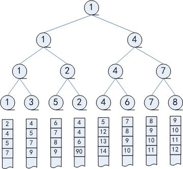
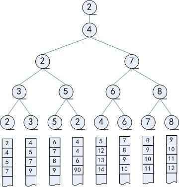
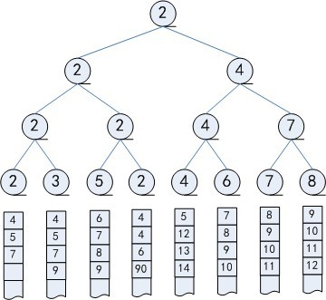

#	二叉树衍生

##	*Huffman Tree*

哈夫曼树/最优树：带权路径长度WPL最短的树

-	哈夫曼树中没有度为1的结点，又称为严格的（正则的）二叉树

> - 树带权路径长度：树中所有叶子结点的带权路径长度之和
	$WPL = \sum_{k=1}^n w_k l_k$

###	哈夫曼算法

哈夫曼算法：构建最小加权路径二叉树

> - 输入：给定的n个权值$\{w_1, w_2, \cdots, w_n\}$

-	初始化n个单节点二叉树集合$F=\{T_1, T_2, \cdots, T_n\}$
-	合并权重最小的两棵树，将其权重之和作为新树权重记录于新树
	根节点中
-	重复，直至生成单独一棵树

####	特点

-	贪婪算法
-	Huffman算法构建的最优二叉树是只有叶子节点有权值，若所有
	节点都有权值的**最优二叉查找树**，需要使用动态规划算法，
	参见*cs_algorithm/data_structure/tree_search*

###	哈夫曼编码

> - 哈夫曼编码：编码总长度最短的二进制前缀编码
> - 前缀编码：任意编码都不是其他编码的前缀，此时编码可以

-	前缀编码可以使用二叉树设计，叶子结点代表字符，根节点到
	叶子结点路径上分支代表的二进制串即为其二进制编码

-	对给定出现频率$P[1..n]$的字符集$C[1..n]$，生成哈夫曼树
	即可得到哈夫曼编码

###	链式存储

####	哈夫曼树

```c
typedef struct HTNode{
	unsigned int weight;
	struct HTNode *parent, *lchild, *rchild;
}HTNode, *HuffmanTree;
```

##	选拔树

###	优胜树

优胜树：非叶结点取值是两个孩子中较小者的完全二叉树



-	根据定义，根节点的取值是整个树的最小值
-	**从叶节点**构建/重构优胜树的过程中
	-	每对兄弟结点捉对比赛，胜利者晋升为父亲结点
	-	胜者逐级向上直到根节点为止
	-	调整优胜树的时间效率$\in \Theta(logk)$

####	顺序存储结构

```c
typedef SqBiTree SqVictTree;
```

> - 数组实现的二叉树可以通过完全二叉树性质迅速计算父节点、
	孩子节点位置

###	淘汰树

淘汰树：非叶结点值是两个孩子结点中较大者，即指向失败者的
选拔树



-	可以简化选拔树重构过程
-	需要额外结点记录/指向胜者

###	用途

####	归并多路有序序列

> - 问题：k路有序（降序）序列，要将其归并为一组有序序列，
	归并过程每轮输出一个最小关键字记录
	（显然只能是当前k路序列中第一个记录）

-	以k路序列首k个元素建立k个叶节点的选拔树

-	构建选拔树，输出最小元素值

	

-	用其所属序列下个元素替换其所在叶节点值，重构选拔

	

-	重复n轮：所有k轮归并总时间为$\in \Theta(nlogk)$

