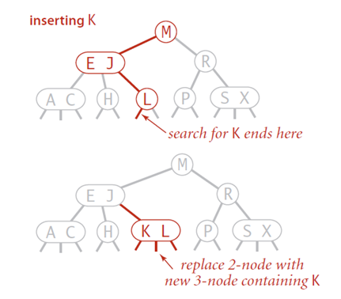

##	总述

> - 二叉查找树：最基础的查找树，但是不平衡时效率很差
> - 自平衡查找树：使用旋转技术得到平衡二叉树
> - 多路查找树：使用多叉树达到平衡

-	**树高度一般即决定其查找、插入、删除效率**
-	以代码复杂性、插入节点时间代价，换取查询时$logN$性能

###	*Self-Balancing Binary Tree*

自平衡查找树：如果节点插入、删除产生了一棵违背平衡要求的树，
就从称为**旋转**的一系列特定变换中选择一种，重新构造树使得
树满足平衡要求

-	不同的对**平衡**的定义产生了不同的实现
-	这种方案属于**变治法**中**实例化简**

####	*Balance Factor*

平衡因子：节点左、右子树高度差（一般右树-左数）

-	AVL树中平衡情况下节点平衡因子只能为-1、+1、0

-	更新节点后可能存在不平衡节点，其平衡因子可能变为-2、+2

-	平衡因子也可以被定义为左右子树叶子数

####	*Rotation*

旋转需要使得二叉树平衡时，保证二叉树依然**有序**

-	左旋：节点平衡因子**符号为正**，即右子树高于左子树
	-	节点T**下沉**为其**右**儿子R的**左**儿子
	-	如果右儿子R本身有**左子树RL**，则左子树RL成为节点T
		新右子树

-	右旋：节点平衡因子**符号为负**，即左子树高于右子树，
	-	节点T**下沉**为其**左**儿子L的**右**儿子
	-	如果左儿子L本身有**右子树LR**，则右子树LR成为节点T
		新左子树

> - 旋转只涉参与选择的至多3个节点指针变化，其余节点状态保持
> - “旋转”行为确实类似：节点绕其子节点旋转，子节点旋转后上浮
	成为父节点
> - 参与旋转的两个节点也称为轴

####	分类

-	AVL树
-	红黑树
-	分裂树

###	Multiway Search Tree

多路查找树：允许查找树中单个节点中不止包含一个元素

-	二叉查找树的推广，用于磁盘超大数据集的高效存取
-	此方案属于**变治法**中**改变表现**

####	分类

-	2-3树
-	2-4树
-	B树
-	B+树

##	Binary Search Tree

二叉查找树：分配给每个父母顶点的数字都比其左子树中数字大，
比右子树数字小

-	二叉树有序，保证二叉树能够快速找到**中间元素**，从而支持
	**二分查找**

###	特点

-	对于n个顶点的二叉树，满足
	$ \lfloor {log_{2}^{n}} \rfloor \leq h \leq n-1 $

-	二叉查找树的查找算法效率取决于二叉树的**高度**

	-	平均情况下，查找、插入、删除时间$\in Theta(logn)$

	-	最差情况下（严重不平衡的树，接近链表结构），树高度
		h接近节点数n，查找、插入、删除时间$\in Theta(n)$

-	包含n个键的二叉查找树总数量
	$c(n) = \frac 1 {n+1} C_{2n}^n, c(0)=1$

###	应用

-	查找

###	操作

####	查找

在给定二叉查找树中查找给定键值K

-	如果树为空，查找失败

-	若树不为空，将查找键K和树根节点K(r)比较

	-	相等则查找停止
	-	$K < K(r)$：在左子树中继续查找
	-	$K > K(r)$：在右子树中继续查找

#####	特点

-	算法时间效率
	-	最差情况下，二叉树完全偏斜，需要进行n次比较
	-	随机情况下，查找n个随机键构造的二叉树比较次数$2logn$

####	插入

除非是空树，否则总是把新键K插入叶子节点中

-	通过查找K确定合适插入位置（叶子节点）
-	若K大于叶子节点键值，则作为右子女，否则作为左子女

###	最优二叉查找树

对集合中元素确定的查找概率，成功查找的平均比较次数最小的
二叉查找树（可以扩展到包含不成功查找）

> - $a_i, i=1,2,\cdots,n$：从小到大互不相等的键
> - $p_i, i=1,2,\cdots,n$：键查找概率
> - $T_i^j$：由键$a_i, \cdots, a_j$构成的二叉树
> - $C(i, j)$：成功查找的最小平均查找次数

####	动态规划构造

-	根据最优化法则，最优二叉查找树左右子树均是最优排列的

-	二叉树$T_i^j$有序，设树根为$a_1$，$a_2,..,a_{k-1}$构成
	的左子树、$a_{k+1},..,a_j$构成右子树均是最优排列的

递推式如下

-	$1 \leqslant i \leqslant j \leqslant n$

	$$\begin{align}
	C(i, j) & = \min_{i \leqslant k \leqslant j} \{p_k + 
			\sum_{s=i}^{k-1} p_s * (a_s在T_i^{k-1}中层数 + 1) +
			\sum_{s=k+1}^j p_s * (a_s在T_{k+1}^j中层数 + 1) \}\\
		& = \min_{i \leqslant k \leqslant j} \{
			\sum_{s=i}^{k-1} p_s * a_s在T_i^{k-1}中层数 +
			\sum_{s=k+1}^j p_s * a_s在T_{k+1}^j中层数 +
			\sum_{s=i}^j p_s \} \\
		& = \min_{i \leqslant k \leqslant j}
			\{C(i, k-1) + C(k+1, j)\} + \sum_{s=i}^j p_s
	\end{align}$$

-	$1 \leqslant i \leqslant n+1, C(i, i-1)=0$：空树

-	$1 \leqslant i \leqslant n, C(i, i)=p_i$：单节点

```c
OptimalBST(P[1..n])
	// 动态规划法构建最优二叉查找树
	// 输入：P[1..n]n个键查找概率
	// 输出：在最优BST中查找成功的平均比较次数，最优BST子树根表
	for i = 1 to n do
		C[i, i-1] = 0
		C[i, i] = P[i]
		R[i, i] = i
	C[n+1, n] = 0
		// 初始化平均查找次数表、子树根表
	for d = 1 to n-1 do
		// d为二叉树节点数
		for i = 1 to n-d do
			// n-d是为了控制j的取值
			j = i + d
			minval = \infty
			for k = i to j do
				// 遍历设置二叉树根节点
				if C[i, k-1] + C[k+1, j] < minval
					minval = C[i, k-1] + C[k+1, j]
					kmin = k
			R[i, j] = kmin
			sum = P[i]
			for s=i+1 to j do
				sum += P[s]
			C[i, j] = minval + sum
	return C[1, n], R
```

####	算法特点

-	算法效率
	-	算法时间效率为立方级
	-	算法空间效率为平方级

##	AVL Tree

AVL树：要求其节点在左右子树高度差不能超过1的平衡二叉树

-	基本思想：总能通过一次简单的节点重排使树达到平衡

	-	如果树插入操作使得一棵AVL树失去平衡，利用旋转对树作
		变换
	-	若有多个这样的节点，找出最靠近新插入的叶子节点不平衡
		结点，然后旋转以该节点为根的子树

-	AVL树高度h即为其查找、插入效率

	-	包含n个节点AVL树高度h满足
		$\lfloor log_2 n \rfloor \leq h < 1.4405log_2(n+2) - 1.3277$

	-	最差情况下，操作效率$\in \Theta(logn)$

	-	平均而言，在n不是太小时，高度h平均为
		$1.01log_2 n + 0.1$（几乎同折半查找有序数组）

-	AVL树缺点（平衡代价），阻碍AVL树成为实现字典的标准结构
	-	需要频繁旋转
	-	维护树的节点平衡
	-	总体比较复杂

###	旋转

按照**节点平衡符号**进行旋转：`+`左旋、`-`右旋

-	单旋：**不平衡节点**、**不平衡子节点**不平衡因子符号相同
	-	全为`+`：**不平衡节点**左旋
	-	全为`-`：**不平衡节点**右旋

-	双旋：**不平衡节点**、**不平衡子节点**不平衡因子符号不同
	-	先旋转**不平衡子节点**
	-	再旋转**不平衡节点**

> - 优先考虑最底层、不平衡节点

###	插入节点

AVL树插入关键：查找不平衡节点

-	节点中应有存储其平衡因子的实例变量
-	插入过程中**经过每个节点**返回当前节点子树深度是否变化
-	比较节点平衡因子、子节点深度变化返回值判断是否平衡

> - 插入过程中查询的每个节点都有可能不平衡
> - 自下而上返回深度变化情况，优先旋转最底层不平衡节点

####	4种插入情况

根据插入情况的不同，对最靠近新插入叶子节点的不平衡点T

#####	LL

插入T**左儿子L的左子树LL**：平衡因子全`-`

-	即T到最底层叶节点（只可能有一个）的路径为LL（中间省略）
-	*R-rotation*：右单转，对T做一次右旋即可平衡


#####	RR

插入T**右儿子R的右子树R**：平衡因子全`+`

-	即T到最底层叶节点（只可能有一个）的路径为RR（中间省略）
-	*L-rotation*：左单转，对T做一次左旋即可平衡


#####	LR

插入T**左儿子L的右子树R**：平衡因子`-+`

-	即T到最底层叶节点（只可能有一个）的路径为LR（中间省略）
-	*LR-rotation*：左右双转
	-	先对左儿子L做一次左旋，变成LL模式
	-	在LL模式下，再对T做一次右旋


#####	RL

插入T**右儿子R的左子树L**：平衡因子`+-`

-	即T到最底层叶节点（只可能有一个）的路径为RL（中间省略）
-	*RL-rotation*：右左双转
	-	先对右儿子R做一次右旋，变成RR模式
	-	在RR模式下，再对T做一次左旋


####	实现

###	删除节点

> - 在AVL树中删除键相对而言比较困难，但也是对数级的

####	实现

##	Red-Black Tree

红黑树：能够容忍同一节点的一棵子树高度是另一棵的2倍

##	Splay Tree

分裂树：

##	2-3树

2-3树：可以包含两种类型的节点2节点、3节点，树的所有叶子节点
必须位于同一层


-	2-3树的高度即决定其查找、插入、删除效率
	-	节点数为n的2-3数高度h满足
		$log_3(n+1)-1 \leq h \leq log_2(n+1) - 1$
	-	最差、平均情况下，操作效率$\in \Theta(logn)$

-	2-3树总是高度平衡
	-	所有叶子节点位于同一层，即树根到其路径长度相同
	-	2-3树平衡代价
		-	树中节点可以有1或2个键，需要处理2种节点类型
		-	拆分3节点的情况有很多种

-	节点类型
	-	2节点：只包含1个键K、2个子女
		-	左子女：作为所有键都小于K的子树的根
		-	右子女：作为所有键都大于K的子树的根

	-	3节点：两个有序键$K_1 < K_2$、3个子女
		-	最左边子女：作为键值小于$K_1$的子树的根
		-	中间子女：作为键值位于$[K_1, K_2]$之间子树的根
		-	最右边子女：作为键值大于$K_2$的子树的根

> - 类似的还有2-4树

###	查找

-	如果根是2节点，当作二叉树查找
	-	若K等于根键值，停止
	-	若K小、大于根键值，在左、右子树中查找

-	若根是3节点
	-	和两个键值比较，有相等，停止
	-	否则能确定应该在3棵子树中哪棵继续查找

###	插入节点

除非是空树，否则总是把新键K插入叶子节点中

-	查找K确定合适的插入位置（叶子节点）

-	若叶子节点2节点，根据大小关系将K作为第一个键或第二个键
	插入
	

-	若叶子节点3节点，把叶子分裂为两个节点：3个键中最小的放入
	第一个叶子中，最大的放入第二个叶子中，中间的键提升到原
	叶子节点父母中

	

	-	若叶子就是根，则需要创建新根容纳中间键
	-	中间键的提升可能会导致父母节点分裂，并引起祖先链条上
		多个节点的分裂

###	删除节点

##	B树

B树：允许节点可以有$1~m-1$个键（$2~m$个子女）

```c
#define BTREE_M
typedef struct BTNode{
	unsigned int degree;				// 节点实际包含键数
	KeyType key_slots[BTREE_M-1];		// 节点存储键数组
	struct BTNode ptr_slots[BTREE_M];	// 指向子女节点指针
	struct BTNode * ptr_parent;			// 父节点指针
}BTNode, *BTNodePtr;
```

> - $m$：B树阶数，节点允许最大子女数
> > -	节点最多允许有$m-1$个条目
> > -	$m=2$即为二叉树、$m=3$即为2-3树
> - 键：用于构建树的关键字，和具体条目类似于键值对

-	根节点具有$2~m$个子女，除非为叶子节点

-	非根、非叶节点具有$[\lceil m/2 \rceil, m]$个子女

	-	即具有$[\lceil m/2 \rceil - 1, m]$个**有序**键

	-	其中子树$T_0$所有键小于$K_1$，子树$T_1$中所有键大于
		等于$K_1$小于 $K_2$，以此类推

-	B树是完美平衡的：所有叶子节点在同一层上

###	查找

####	算法

> - 输入：B树、目标查找键
> - 输出：查找键所属B树节点（若存在）

-	从根节点开始，比较查找键k和节点中键序列大小
	-	节点中键有序，若B树阶数足够大，可考虑**折半查找**

-	若在节点键序列中找到匹配键，则查找成功、返回

-	否则根据比较结果选择合适分支，顺着指针链前进，在相应子女
	节点中进行查找

```c
BTreeSearch(T, k):
	// 在B树中搜索键
	// 输入：B树根节点T、目标查找键k
	// 输出：目标键所在节点、目标键在节点中序号
	i = 0
	cur = T

	// 遍历寻找目标键对应键、分支
	while i < cur.degree and k > cur.key_slots[i]:
		i += 1

	if i < cur.degree and k == cur.key_slots[i]:
		return cur, i
	elif cur.is_leaf():			// 未找到目标键
		return cur, -1
	else:
		return BTreeSearch(cur.ptr_slots[i], k)
```

###	分裂

####	算法

> - 输入：待分裂节点父节点、待分裂节点序号

-	计算待分裂节点分裂中心
	-	将分裂中心右侧数据移动至新节点

-	将节点分裂中心、新节点提升至父节点

```c
BTreeNodeSplit(T, ptr_idx):
	// 分裂B树中节点
	// 输入：待分裂节点父节点`T`、待分裂节点序号`ptr_idx`

	nnode = BTreeNode()
	fnode = T.ptr_slots[ptr_idx]

	// 分裂中心
	mid = fnode.degree // 2

	// 复制右半部分键至新节点
	nnode.key_slots[:fnode.degree - mid] = fnode.key_slots[mid:fnode.degree]
	fnode.key_slots[mid:fnode.degree] = NULL

	// 若原节点非叶子节点，复制右半部分指针至新节点
	if not fnode.is_leaf():
		nnode.ptr_slots[:fnode.degree + 1 - mid] = fnode.ptr_slots[mid: fnode.degree + 1]
		fnode.ptr_slots[mid: fnode.degree+1] = NULL

	// 修改两节点度
	nnode.degree = fnode.degree - mid
	fnode.degree = mid

	// 将分裂中心提升至父节点
	// 修改父节点指向子女节点指针
	T.key_slots.insert(fnode.key_slots[mid], ptr_idx)
	T.ptr_slots.insert(nnode, ptr_idx+1)	// 原节点指针不变
```

###	插入

> - 输入：B树根T、待插入键K
> - 假设B树中不存在键K，否则查找、更新对应值即可

-	根据需要插入键K，查找需要插入的**叶子节点**L
-	若叶子节点L键数小于m-1，直接插入结束
-	否则以叶子节点键值中位数mid为中心分裂
	-	将mid插入叶子节点L父节点P中
	-	将mid左子支指向分裂后左子树、右子支指向分裂后右子树
-	对父节点尝试操作

```c
BTreeInsert(T, k)
	// 向B树中插入不存在键K
	// 输入：B树根T、待插入键k

	// 找到键`k`应该插入的叶子节点`L`
	L, _ = BTreeSearch(T, k)
	L.key_slots.insert_in_order(k)


	// 若节点已满、须分裂
	while L.is_full():
		BTreeNodeSplit(L.parent_ptr, L.get_index())
		L = L.parent_ptr
```

-	此实现是考虑**节点都有空位容纳新键**，节点插入新键后再
	判断是否需要分裂

###	删除#todo

###	应用

-	类似一般查找树，把数据记录插入初始为空的树中构造B树

##	B+树

B+树：B树的一种变形树

-	其中非叶节点只有**索引**作用，跟记录相关信息均存放在
	叶结点中
-	B+树中所有叶结点构成**有序链表**，可以按照键次序遍历

###	查找

####	算法

-	从根开始，比较查找键K和节点中键大小，选择合适指针，顺着
	指针链前进

-	指针链指向可能包含查找键的叶子节点，在其中查找K
	-	父母节点、叶子节点都是有序的，如果B树次数足够
		大，可以考虑使用**折半查找**

####	算法效率

以B树作索引存储大型数据文件为例

-	查找指定查找键访问B树节点数量为B树高度$h+1$
	（即磁盘访问次数）

-	次数为m、高度为h的B树能够包含最少节点数为
	$n \geqslant 4 \lceiling m/2 \rceiling ^ {h-1} -1$，
	即$h \leqslant \lfloor log_{[m/2]} \frac {n+1} 4 \rfloor + 1$

-	所以在B树中查找，访问磁盘次数$\in O(logn)$
	-	实际应用中，磁盘访问次数很少超过3，因为B树的根、甚至
		是第一层节点会存储在内存中减少磁盘访问次数

###	插入

####	算法

-	查找新记录键K对应的叶子节点

-	若叶子节点中还有空间存放此记录，在保持键有序的情况下插入

-	若节点中没有空间
	-	将节点分裂，后半部分记录放在新节点中
	-	新节点中最小键$K^{'}$、指向其的指针插入原叶子节点
		父母节点中（原叶子节点键、指针之后）
	-	插入过程可以一直回溯到树根，甚至直到树根分裂

其他考虑

-	查找新记录对应叶子节点时就分裂满节点，可以避免递归分裂
-	将满叶子节点中部分键移动给兄弟节点，同时替换父母节点中的
	键值（保证B树特点），增加少许复杂度以节约空间

####	算法特点

-	算法效率
	-	算法时间效率$\in O(logn)$

###	应用

-	B+树是存储结构化记录数据集合最重要的索引结构
	-	所有数据记录（键）按照升序存储在叶子节点中，其父母
		节点作为索引
	-	B+树中节点常常对应磁盘中页
	-	考虑到访问磁盘页面是比较内存中键值比较时间多好几个
		数量级，磁盘访问次数是衡量B树效率的主要指标


标


