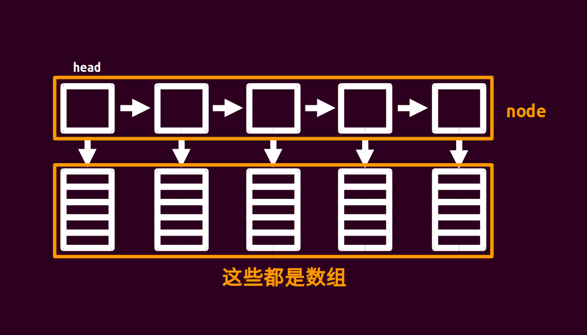

##	概述

-	*Data Structure* 数据结构：数据（集）+ 关系
	-	存储结构：数据元素在计算机中的表示方式
		-	顺序存储（映像）：数据存储在连续的内存空间中
			-	初始化时即须确定容量，后续可能需要动态扩展
		-	链式（非顺序）存储（映像）：数据存储在不连续的内存空间中，通过指针相互连接
			-	此处指针指可表示连接关系的实体，可为指针、索引等
		-	顺序存储、链式存储可混用以满足需求，如：分块结构中块内顺序、块间链式
	-	逻辑结构：数据元素之间的逻辑关系
		-	逻辑关系的表示方式
			-	相对位置：仅适用于顺序存储结构
			-	指针（广义）：常用于链式存储结构，也可用于顺序存储结构中，如：数组中存储数组索引作为指针
		-	逻辑结构体现的逻辑关系才是核心，存储结构仅影响实现
			-	不同存储结构可具有相同的逻辑结构
			-	当然，不同的存储结构实现会影响存储效率、时间效率
		-	逻辑结构可分为 4 类
			-	集合：结构中数据元素只有同属一个集合的关系
			-	线性结构：结构中数据元素之间存在一对一关系
			-	树型结构：结构中数据元素存在一对多关系
			-	图状/网状结构：结构中数据元素存在多对多的关系

-	*Data Type* 数据类型：数据结构 + 操作
	-	逻辑结构决定、服务操作可行性，具体的存储结构（实现）决定操作效率
		-	即，逻辑结构本身对应基本的数据类型
		-	则，在基本数据类型上 **设定操作、修改存储结构** 即可得新数据类型
	-	根据数据类型值可分情况
		-	*Atomic Data Type*：原子类型，值不可分解（有计算机平台提供）
		-	*Fixed-Aggregate Data Type*：固定聚合类型，值由确定数目的成分按某种结构组成
		-	*Variable-Aggregate Data Type*：可变聚合类型，值的成分数目不确定
	-	*Abstract Data Type* 抽象数据类型：数据类型数学化、形式化抽象
		-	将数据类型行为和其实现相分离

-	思路、想法
	-	数据结构本身就可以认为是预处理，通过保存预处理信息保证效率

#	线性数据类型

-	线性结构：结构中数据元素之间存在一对一关系
	-	存在唯一一个被称为 “第一个” 的数据元素
	-	存在唯一一个被称为 “最后一个” 的数据元素
	-	除第一个外，每个数据元素均只有一个前驱
	-	除最后一个外，每个数据元素均只有一个后继

##	线性表

-	线性表：包含 $n$ 个数据元素的有限序列
	-	最简单的线性数据类型，未定义额外操作

###	顺序表

-	顺序表：顺序排列的数据域
	-	语言原生数据类型基本包含顺序表实现，提及场合不多
	-	操作、时间效率
		-	插入、删除：$O(n)$
		-	获取元素：$O(1)$

###	链表

```cpp
typedef struct LinkedListNode{
	int value;									// 数据域
	LinkedListNode * next;						// 后继指针
} LinkedListNode;
```


-	单向链表：数据域 + 指针域构成节点串联
	-	操作、时间效率
		-	插入、删除：$O(1)$
		-	获取元素：$O(n)$
	-	实现、应用技巧
		-	头节点、头指针：指向链表首个节点，不记录信息、方便调整链表

```cpp
typedef struct DoubleLinkedListNode{
	int value;									// 数据域
	DoubleLinkedListNode * next, * prev;		// 前驱、后继指针
} DoubleLinkedListNode;
```


-	双向链表：数据域 + 前驱指针域 + 后继指针域构成节点串联
	-	双向异或链表：存储前驱、后继地址异或结果
		-	遍历时用前节点地址与之再次异或即得到后节点地址

-	其他一些链表数据结构
	-	循环链表：末尾节点指向首个节点成环
	-	双向循环链表

> - *OI Wiki* 链表：<https://oi-wiki.org/ds/linked-list/>

###	静态链表

```cpp
typedef struct StaticLinkedListNode{
	int value;
	int next;							// 存储后继在数组索引
} StaticLinkedListNode, StaticLinkedList[MAXSIZE];
```

-	静态链表：数组描述链表 + 数组索引表示连接关系
	-	可在无指针语言中实现链表
	-	类似的，可用多个数组分别存储值、指针（索引）
		-	此实现甚至不要求语言支持自定义数据类型

```cpp
typedef int val[MAXSIZE];				// 多个数组分别存储值、指针
typedef int next[MAXSIZE];				// 语言支持随机访问序列即可
```

> - 索引作为指针表示连接关系同样可用于其他数据类型

##	*Stack*


-	*Stack* 栈、*LIFO* 表：限定在栈顶（表尾）进行插入、删除的受限线性表
	-	栈按照 *LIFO* 先进后出原则运转，被限制在仅能在栈顶插入、删除数据
		-	入栈：栈顶插入数据
		-	出栈：栈顶删除数据
	-	实现递归嵌套的必须数据结构

-	单调栈：满足单调性的栈结构
	-	为保证栈单调性
		-	出栈：无区别
		-	入栈：弹出所有在插入新元素后破坏栈单调性元素后，在栈顶插入数据
	-	单调栈核心，即 **维护以当前元素为端点的最长有序序列**

> - *OI Wiki* 栈：<https://oi-wiki.org/ds/stack/>
> - *OI Wiki* 单调栈：<https://oi-wiki.org/ds/monotonous-stack/>

###	实现：顺序栈

```cpp
struct Stack{
	int values[MAXSIZE];				// 存储数据
	int top;							// 栈顶指针
	void Stack() { top = 0; }
	void push_back(int val) { values[++top] = val; }
	int pop_back() { return values[top--] = val; }
};
```

-	顺序栈：数组 + 栈顶指针 + 栈底指针
	-	实现、使用细节
		-	入栈：插入数据、移动栈顶指针
		-	出栈：移动栈顶指针即可（旧数据无须覆盖）
	-	操作、时间效率
		-	插入、删除：$O(1)$

```cpp
typedef int IntStack[MAXSIZE+1];		// 直接在栈底记录栈顶
IntStack st;
*st = 0;								// 初始化栈
st[++*st];								// 入栈
st[*st--];								// 出栈
```

##	*Queue*


-	*Queue* 队列、*FIFO* 表：限定在队尾（表尾）进行插入、删除的受限线性表
	-	队列按照 *FIFO* 先进后出原则运转，被限制在仅能在队尾插入、队首删除数据
		-	入队：队尾插入数据
		-	出队：队首删除数据

-	双端队列：可同时在队首、队尾进行插入、删除操作的队列
	-	相当于栈 + 队列
		-	`push_back`：队尾插入数据
		-	`push_front`：队首插入数据
		-	`pop_back`：队尾删除数据
		-	`pop_front`：队首删除数据

-	单调（双端）队列：满足单调性的双端队列结构
	-	为保证队列单调性
		-	`push_back`：弹出所有在插入新元素后破坏队列单调性元素后，在队尾插入数据
		-	`push_front`：弹出所有在插入新元素后破坏队列单调性元素后，在队首插入数据
		-	`pop_back`：无区别
		-	`pop_front`：无区别
	-	核心同单调栈，但支持通过出队修改端点范围
		-	实操中常限制一侧仅出队，表示单方向滑动窗口
		-	可用于维护滑动窗口极值
			-	单增队列：滑动窗口极小值
			-	单减队列：滑动窗口极大值

> - *OI Wiki* 队列：<https://oi-wiki.org/ds/queue/>
> - *OI Wiki* 单调队列：<https://oi-wiki.org/ds/monotonous-queue/>

###	实现：顺序队列

```cpp
struct Queue{
	int values[MAXSIZE];						// 存储数据
	int head, tail;								// 队列头、尾指针
	void Queue(){ head = tail = 0; }			// 初始化队列
	void push_back(){ values[(++tail) %= MAXSIZE]; }			// 入队
	int pop_front(){ return values[(++head) %= MAXSIZE]; }		// 出队
}
```

-	顺序队列：数组 + 队首指针 + 队尾指针
	-	操作、时间效率
		-	插入、删除：$O(1)$
	-	实现、使用细节
		-	入队：插入数据、移动队尾指针
		-	出队：移动队首指针（旧数据无需覆盖）
		-	循环队列：将数组尾、首相连，即以循环方式组织队列，避免数组空间浪费

-	双栈（栈底相连）模拟队列
	-	两栈分别作为队尾栈、队首栈
		-	队首栈空时，队尾栈元素依次弹出、压入队首栈即可
	-	操作、时间效率
		-	插入、删除：可证明每个元素只被转移一次，均摊复杂度为 $O(1)$

> - *OI Wiki* 队列：<https://oi-wiki.org/ds/queue/>

##	分块表

-	分块：适当划分数据、并在划分后块上预处理部分信息，从而提高时间效率
	-	分块大小：决定时间复杂度（当然，取决于具体问题）
		-	一般设置为 $\sqrt N$：按均值不等式可证明的最优块长
		-	实务中，直接按最大数据量确定块长（保证敌手下界即可）
	-	预处理、维护信息：通用性更好，可维护很多其他数据结构无法维护信息
		-	可为各块整体维护信息：分块预处理核心
		-	支持按位置修改数据：分块不改变元素顺序（若需暂时改变顺序，则可复制至新数组中操作）
		-	支持按块懒更新：避免不必要的大规模计算、修改数据

> - *OI Wiki* 分块思想：<https://oi-wiki.org/ds/decompose/>

###	实现：块状数组

```cpp
struct BlockArray{
	int data[MAXSIZE], belong[MAXSIZE];			// 数据、数据所属块（1 起始）
	int st[MAXBLOCK], ed[MAXBLOCK];				// 块起始、结尾位置（1 起始）
	int size, szs[MAXBLOCK];					// 数据数量、块长度（也即块数量）
	int deltas[MAXBLOCK], sums[MAXBLOCK];		// 各块信息

	void init(){
		int num = sqrt(size);					// 块长度为 $\sqrt n$ 时较优
		for (int i=1; i<=num; i++) st[i] = size / num * (i-1) + 1, ed[i] = size / num * i;
		end[num] = size;
		for(int i=1; i<=num; i++){
			for (int j=st[i]; j<=ed[i]; j++) belong[j] = i;
			szs[i] = ed[i] - st[i] + 1;
		}
	}
}
```

-	块状数组：存储全部数据数组 + 各块起始、结尾、大小 + 各元素所属块 + 各块（整体）信息
	-	操作、时间效率：与块大小 $\sqrt n$ 相关
	-	实现、使用细节
		-	修改区间数据：块部分直接更新、块整体则懒更新
		-	问询区间数据：块部分直接计算、块整体则利用预处理信息（懒更新信息）

> - *OI Wiki* 块状数组：<https://oi-wiki.org/ds/block-array/>

###	实现：块状链表



```cpp
struct LinkedBlock{
	int size, data[BLOCKSIZE];					// 节点数据数量、数据
	LinkedBlock * next;

	LinkedBlock() { size=0, next=nullptr, memset(data, 0, sizeof(d)); }
	void push_back(int val){ d[size++] = val, split(); }
	void split(){								// 节点超限时分裂，保证性能
		if(size < 2 * SQRTMAXSIZE) return;
		LinkedBlock * lb = new LinkedBlock();
		copy(size+SQRTMAXSIZE, lb->data, size - SQRTMAXSIZE), size-=SQRTMAXSIZE;
	}
}
```

-	块状链表节点：存储各块数据数组 + 块（整体）信息 + 下个块指针
	-	操作、时间效率：与块大小 $\sqrt n$ 相关
	-	实现、使用细节
		-	修改区间数据：块部分直接更新、块整体则懒更新
		-	问询区间数据：块部分直接计算、块整体则利用预处理信息（懒更新信息）
		-	插入：只需要移动数据插入的块
		-	分裂：节点大小超限时分裂为两块

> - *OI Wiki* 块状数组：<https://oi-wiki.org/ds/block-list/>

#	集合数据类型

-	集合：结构中数据元素只有同属一个集合的关系

##	并查集

-	并查集：处理不交集的合并、查询问题
	-	核心操作
		-	查询：确定元素所属的子集
		-	合并：将两子集合并

###	实现：顺序并查集

```cpp
struct UFSet{
	int ufs[MAXSIZE];												// 存储父索引（各元素即自身）

	void init(){ for(int i=0; i<MAXSIZE; i++) ufs[i]=i; }			// 初始化并查集
	int find(int key) { return key == ufs[key] ? key : find(ufs[key]) }
	void union(int x, int y) { ufs[find(x)] = find(y); }
}
```

-	顺序并查集：数组 + 父节点指针构建树
	-	操作、时间效率
		-	查找：启用路径压缩、启发式合并后 $O(\alpha(n))$（$\alpha$ 为 *Ackermann* 函数反函数）
		-	合并：同查找
	-	实现、应用细节
		-	初始化：数组中元素值置为对应索引，即各节点属于自身集合（单节点树）
		-	祖先（树根）：值等于索引即为祖先（树根）
		-	合并：将任一子集祖先设为另外祖先儿子

> - *OI Wiki* 并查集：<https://oi-wiki.org/ds/dsu/>
> - *OI Wiki* 并查集复杂度：<https://oi-wiki.org/ds/dsu-complexity/>
> - *OI Wiki* 并查集应用：<https://oi-wiki.org/topic/dsu-app/>

####	优化：路径压缩

-	路径压缩：集合中每个节点直接指向祖先（所有节点直接指向树根）
	-	只有节点与祖先关系重要，寻找父亲路径可被压缩
	-	路径压缩一般在查找阶段顺便完成，可能造成大量修改
	-	仅应用路径压缩时，最坏 $O(m log n)$、平均 $O(m \alpha(m,n))$

	```cpp
	int find(int x){
		Stack st;
		while(x != ufs[x]) st.push(x), x=ufs[x];	// 带路径压缩的查找
		while(st) ufs[st.pop()] = x;
		return x;
	}
	```

####	优化：启发式合并

-	启发式合并：设计基于秩、树深度估价确定合并方向
	-	估价函数一般仅使用秩、树深度之一，时间效率均为 $O(m log n)$
	-	同时应用路径压缩、启发式合并 $O(m \alpha(m,n))$

	```cpp
	int size[MAXSIZE] = {1};			// 需额外维护节点规模
	void union(int x, int y){
		int xp = find(x), yp = find(y);
		if (xp == yp) return;
		if (size[xp] > size[yp]) swap(xp, yp);
		ufs[xp] = yp, size[yp] += size[xp];
	}
	```

##	哈希表（散列表）

-	哈希表：以键值对形式存储数据
	-	哈希映射（函数）：将键映射至指定位置
		-	哈希核心逻辑
		-	即，定义域为键取值范围、值域为指定整数范围（地址）的映射
	-	核心操作
		-	插入：哈希映射获取位置，在该位置上插入值
		-	查找：哈希映射获取位置，查询位置上值

-	（哈希）冲突：不同键值的哈希映射结果相同
	-	冲突不可避免（键取值数量总是大于地址取值数量），需要设计方法处理冲突
		-	*Open (Address) Hashing* 闭散列、开放寻址：哈希表直接存储所有键，冲突时按规律搜索哈希表
		-	*Chaining Hashing* 开散列、拉链：哈希表存储指向哈希桶的指针的目录项，桶中存储哈希键
	-	但，需要设计合适的哈希映射以减少冲突

-	负载因子 $\alpha = \frac {n_{set}} {n}$：哈希表的负载情况
	-	负载因子一定程度上反映
		-	查找效率
		-	冲突可能性
		-	空间利用率
	-	需将负载因子控制在合适水平以保证性能、耗费的平衡

###	实现：静态链表开散列

```cpp
struct HashTable{
	struct StaticLinkedNode{							// 静态链表整体作为哈希桶存储数据
		int key, value, next;
	} data[MAXSIZE];
	int head[MAXSIZE];									// 哈希表存储目录项
	int size=0;											// 指示链表可用位置

	int f(int key) { return key % MAXSIZE; }			// 哈希函数
	int get(int key){
		for (int p = head[f(key)]; data[p].key != key && data[p].next; p=data[p].next);
		if(data[p].key == key) return data[p].value;
		return -1;
	}
	int set(int key, int value){
		for (int p = head[f(key)]; data[p].key != key && data[p].next; p=data[p].next);
		if(data[p].key == key) data[p].value = value;
		else data[data[p].next = ++size] = (StaticLinkedNode){key, value, NULL};	// 新元素插入桶尾
	}
}
```

-	静态链表开散列：使用静态链表作为开散列哈希桶存储数据
	-	操作、时间效率
		-	查找、赋值：$O(1)$
	-	实现、应用细节
		-	额外指针：记录静态链表表尾位置，指示可插入新键值对位置
		-	查找：从哈希表查找哈希桶指针，即桶链在静态链表中起始索引，之后遍历桶链
		-	赋值：遍历对应哈希桶链，键不存在则插入额外指针指示位置并与哈希桶串联

```cpp
struct hash_map{							// 优化实现
	struct Node{
		long long key;
		int val, next;
	} data[MAXSIZE];
	int head[MAXSIZE], size;
	int hash_map() { size=0; memset(head, 0, sizeof(head)); }					// 键 0 作为桶尾标记
	int f(long long key){ return key % MAXSIZE; }
	int& operator[](long long key){
		for (int p = head[f(key)]; data[p] != key && data[p].next; p=data[p].next);
		if(data[p].key == key) return data[p].val;
		data[++size] = (Node){key, -1, head[f(key)]}, head[key]=size;			// 新元素插入桶头
		return data[size].val;
	}
}
```

###	实现：数组闭散列

```cpp
struct hash_map{
	int keys[MAXSIZE];
	int vals[MAXSIZE];
	int hash_map() { memset(vals, 0, sizeof(vals)); }
	int f(long long key){ return key % MAXSIZE; }
	int& operator[](long long key){
		int p = f(key), i = 0;
		for(p, i; keys[p+i*i] != key && vals[p+i*i] != 0; i++);					// 值 0 表示搜索终止
		if(keys[p] == key) return vals[p];
		return keys[p] = key, vals[p] = -1;
	}
}
```

-	数组闭散列：数组实现闭散列
	-	操作、时间效率
		-	查找、赋值：$O(1)$
	-	实现、应用细节
		-	两个数组分别记录键、值
		-	查找：冲突时按平方数跳跃搜索键

##	堆、优先队列

-	堆、优先队列：可按优先级依次从中获取元素的集合
	-	核心操作
		-	插入：向堆中插入新数据
		-	查询最值：获取堆中最值
		-	删除最值：删除队中最值
		-	合并：合并两个堆
		-	修改：修改队中元素的值

-	堆一般均通过树实现，但是考虑逻辑结构，将其放在集合类中
	-	优先级（权值）低至高、高至低的堆分别称为小根堆、大根堆
	-	同样的，核心是确保树高度可接受
		-	二叉堆：完全二叉树
		-	左偏树堆：维护节点距外节点距离 `dist` 保证左偏
		-	随机合并堆：合并时，随机交换左、右子树
		-	配对堆：删除树根时，配对合并、右至左依次合并兄弟链

|堆时间效率|配对堆|二叉堆|左偏树|二项堆|斐波那契堆|
|-----|-----|-----|-----|-----|-----|
|插入		|$O(1)$|$O(log n)$|$O(log n)$|$O(1)$|$O(1)$|
|查询最值	|$O(1)$|$O(1)$|$O(1)$|$O(log n)$|$O(1)$|
|删除最值	|$O(log n)$|$O(log n)$|$O(log n)$|$O(log n)$|$O(log n)$|
|合并		|$O(1)$|$O(n)$|$O(log n)$|$O(log n)$|$O(1)$|
|修改元素值	|$o(log n)$|$O(log n)$|$O(log n)$|$O(log n)$|$O(1)$|
|是否支持持久化|$O(1)$|$O(log n)$|$O(log n)$|$O(1)$|$O(1)$|

###	实现：数组二叉堆


```cpp
struct BiHeap{
	int data[MAXSIZE], size;

	// `up`、`down` 均只调整至当前节点局部满足堆性质
	void up(int x){ while(x > 1 && data[x] > data[x / 2]) swap(data[x], data[x/2]), x /= 2; }
	void down(int x){
		while(x*2 <= size){
			int t = x * 2;
			if (t + 1 <= size && data[t] < data[t+1]) t++;			// 找到最大子节点
			if (data[t] <= data[x]) break;							// 满足堆性质则停止
			swap(data[x], data[t]), x = t;
		}
	}
	void build_up(){ for(int i = 1; i <= size; i++) up(i); }		// O(n)
	void build_down(){ for(int i = size; i >= 1; i--) down(i); }	// O(nlogn)
	int del(){ return swap(data[1], data[size--]), down(1), data[size+1]; };
}
```

-	（大根）二叉堆：数组 + 完全二叉树 + 堆性质：父亲节点权值不小于子节点权值
	-	二叉堆依赖完全二叉树数组实现存储结构（蕴含大量元信息）保证操作复杂度
		-	完全二叉树将节点按层次遍历顺序（根节点索引置 1）放入数组中
		-	考虑到完全二叉树性质，父子节点索引满足
			-	$idx_l = 2 * idx_p$
			-	$idx_r = 2 * idx_p + 1$
	-	实现、操作细节
		-	向上：将节点与父节点交换，直到节点局部（节点、父节点）局部满足堆性质
		-	向下：将节点与子节点交换，直到节点局部（节点、子节点）局部满足堆性质
			-	向上、向下仅保证局部性质，不保证根至叶子路径上节点均满足
		-	建堆：遍历元素，通过向上、向下操作保证堆性质
			-	为保证局部可推广到全局，则 **已完成部分整体应满足堆性质**
			-	即，或顶部开始向下 $O(n log n)$
			-	或，底部开始向上 $O(n)$：堆性质较弱、结果不唯一，故可 $O(n)$ 建堆
		-	插入：在最下层、最右侧叶子节点上插入新元素，之后向上调整（交换）节点直到满足堆性质
		-	删除（最值）：交换根节点与最下层、最右侧叶子节点，之后向下调整（交换）节点直到满足堆性质
		-	修改权值：增加权值向上调整、减少权值向下调整

###	衍生：对顶二叉堆

```cpp
struct TopKBiHeap{
	BiHeap bh, sh;
	int K;

	// 初始所有元素在大根堆中
	// 删除元素，直接放入小根堆相应位置
	void build_from_bh(){ for( bh.build_down(); sh.size <= K; sh[K - (sh.size++)] = bh.del()); }
	void build_from_sh(){ for( sh.build_down(); sh.size > K; bh[sh.size - K] = sh.del()); }
	int del(){
		int val = sh.data[1];
		sh.data[1] = bh.del();				// 删除大根堆顶，直接插入小根堆顶
		return val;
	}
	void set_K(int newk){
		if (K > newk) copy(bh.data+1, bh.data+1+K-newk, bh.size), build_from_sh();
		if (K < newk) copy(sh.data+1, sh.data+1+newk-K, sh.size), build_from_bh();
	}
}
```

-	对顶堆：大根堆 + 小根堆 + 树根相对
	-	对顶堆可用于实现可变第 $K$ 大元素的获取删除
	-	实现、操作细节
		-	维护：不断取出大根堆、小根堆树根插入对方堆中，直到小根堆元素数量为 $K$
		-	插入：若插入元素大于小根堆树根，插入小根堆，否则插入大根堆，维护对顶堆
		-	删除：删除小根堆树根，维护对顶堆
		-	$K$ 值修改：根据 $K$ 值维对顶堆

> - *OI Wiki* 二叉堆：<https://oi-wiki.org/ds/binary-heap/>

###	实现：左偏树堆

```cpp
typedef struct{
	int val, dist;
	Node * l, * r;
} Node;
Node * merge(Node * x, Node * y){
	if (x == nullptr) return y;
	if (y == nullptr) return x;
	if (x->val < y->val) swap(x, y);
	x->r = merge(x->r, y);								// 递归合并右子树、较小树
	if(x->l->dist < x->r->dist) swap(x->l, x->r);		// 交换左、右子树保证左偏性质
	return x->dist = x->r->dist + 1, x;
}
Node * del(Node * x){ return merge(x -> l, x -> r); }
```

-	（大根）左偏树堆：二叉树 + 左偏 + 堆性质：父亲节点权值不小于子节点权值
	-	左偏树堆通过维护节点到外节点（存在空儿子的节点） *dist* 确定合并顺序
		-	左偏树定义即 `l->dist > r->dist`，则总应有 `fa->dist = r->dist + 1`
		-	左偏树不保证深度
	-	实现、细节、效率
		-	合并：较大根作为新根，递归合并右子树、较小根树，若需则交换左、右节点保证左偏
		-	插入：单节点视为左偏树与原堆合并
		-	删除：合并左右子树

####	优化：更多操作支持

```cpp
typedef struct{
	int val, dist;
	Node * l, * r, * fa;						// 增加指向父节点指针
} Node;
void up_update_dist(Node * x){					// 向上更新 `dist` 直至根节点
	if (x == nullptr) return;					// 更新 `dist` 至根节点
	x->dist = x->r->dist + 1, up_update_dist(x->fa);
}
Node * merge(Node * x, Node * y){
	if ( x == nullptr ) return y;
	if ( y == nullptr ) return x;
	if ( x->val < y->val ) swap(x, y);
	x->r = merge(x->r, y), x->r->fa = x;
	return up_update_dist(x), x;
}
void del(Node * x){ up_update_dist(merge(x->l, x->r)->fa = x->fa); }
```

-	左偏树堆增加父节点指针后，可实现更多操作
	-	删除任意节点：合并节点左、右子树，替代原节点，向上更新 *dist*

###	随机合并（二叉）堆

```cpp
typedef struct{
	int val;
	Node * l, * r;
} Node;
Node * merge(Node * x, Node * y){
	if (x == nullptr) return y;
	if (y == nullptr) return x;
	if (x->val < y->val) swap(x, y);
	if (rand() & 1) swap(x->l, x->r);					// 随机交换左、右子树
	x->r = merge(x->r, y);								// 递归合并右子树、较小根树
	return x;
}
```

-	（大根）随机合并堆：二叉树 + 合并时随机交换左右子树 + 堆性质：父亲节点权值不小于子节点权值

> - 随机堆效率证明：<https://cp-algorithms.com/data_structures/randomized_heap.html>

###	实现：多叉树配对堆


```cpp
typedef struct{
	int w;
	Node * child, * sibling;			// 儿子、兄弟表示法存储多叉树
} Node;
Node * meld(Node * x, Node * Y){		// 合并两个堆
	if (x == nullptr) return y;
	if (y == nullptr) return x;
	if (x->w < y->w) swap(x, y);
	return y->sibling = x->child, x->child = y, x;
}
Node * merge(Node * x){										// 核心、辅助：合并兄弟链
	if (x == nullptr || x->siblings == nullptr) return x;
	Node * y = x->sibling, * c = y->sibling;
	x->sibling = y->sibling = nullptr;
	return meld(merges(c), meld(x, y));						// 两两合并 -> 从右往左依次合并
}
Node * del(Node * root){ return merge(root->child); }
```


-	（大根）配对堆：多叉树 + 堆性质：父亲节点权值不小于子节点权值
	-	配对堆完全不维护树的元数据：大小、深度、排名
		-	任何满足堆性质的树都是合法的配对堆，在实践中效率优秀
		-	但需，通过精心设计的操作顺序保证均摊复杂度
	-	实现、细节
		-	合并：较大根节点作为新根节点，较小根节点作为最左侧儿子
		-	插入：新元素视为新配对堆与原堆合并
		-	删除（最大值）：两两合并儿子（即配对）、按从右往左顺序依次合并
			-	删除操作被精心设计顺序保证以保证均摊复杂度
		-	增加节点值：剖出子树与原树合并
			-	需修改节点结构，添加指向父节点、左兄弟的指针
	-	配对堆基于势能分析的时间效率分析复杂，仍未有紧结论
		-	合并、删除均摊：$O(log n)$
		-	增加节点值：$O(2^{2 * \sqrt {log log n}})$

> - *OI Wiki* 配对堆：<https://oi-wiki.org/ds/pairing-heap/>
> - *Brilliant* 配对堆教程：<https://brilliant.org/wiki/pairing-heap/>
> - *The Pairing Heap: A New Form of Self-Adjusting Heap*：<http://www.cs.cmu.edu/~sleator/papers/pairing-heaps.pdf>

#	树数据类型

-	树型结构：结构中数据元素存在一对多关系
	-	自由树：由 $n$ 节点、$n-1$ 边组成的无向连通图
	-	（有根）树：存在（指定有）根节点的自由树
		-	最平常意义的树，树不特意说明即指有根树
		-	在自由树基础上指定根节点，由此确定树的层次（父子）关系
	-	有序树：节点子节点有序的有根树
		-	最常使用的树：为保证性能，子节点往往需要根据节点权值排序
		-	在有根树的基础上固定子节点顺序，由此确定节点次序（兄弟）关系

##	有序树

###	实现：链树

```cpp
typedef struct TNodePLinked{
	int val;
	struct TNodePLinked * p;					// 1、父节点指针
	struct TNodePLinked *fc, *sib;				// 2、首个孩子节点、下个兄弟指针
	struct TNodePLinked (*chs)[MAXCHILD];		// 3、孩子节点指针数组
} TNodePLinked;
```

-	链树（节点）：权值（数据）+ 父节点指针 + 孩子节点指针
	-	操作、时间复杂度
		-	插入：$O(1)$
		-	查找双亲：设置有父节点指针时 $O(1)$、否则 $O(h)$
		-	查找儿子：设置有孩子节点指针时 $O(1)$、否则 $O(n)$（需要遍历所有节点）
	-	实现、使用细节
		-	父节点指针：仅包含父节点指针的实现较少使用，大部分操作效率太低
		-	孩子节点指针数组：仅适合各节点子女数量变化不大场合，否则浪费空间
		-	孩子、兄弟指针：此即体现多叉树、二叉树一一对应

###	实现：静态链树

```cpp
typedef struct TNodePStatic{
	int val;
	int p;										// 1、父节点位置
	fc, sib;								// 2、首个孩子节点、下个兄弟位置
	int chs[MAXCHILD];							// 3、孩子节点位置数组
} TNodePStatic;
struct TTreePStatic{
	TNodePStatic data[MAXSIZE];
	int size;
}
```

-	静态链树：数组存储节点数据 + 数组索引表示连接关系

##	二叉树

-	二叉树：顶点子女数最多为 2 的有序树
	-	二叉树特点
		-	第 $i$ 层二叉树最多 $2^{i-1}$ 节点
		-	高度 $k$ 二叉树最多 $2^k - 1$ 节点
		-	记 $n,n_0,n_1,n_2$ 为节点总数、度 $0,1,2$ 节点数，则有
			-	$n = n_0 + n_1 + n_2 = n_1 + 2n_2 + 1$：点等式、边等式
			-	$n_0 = n_2 + 1$
	-	满二叉树：最后层节点为 0、其余层节点度为 2 二叉树
	-	完全二叉树：与满二叉树节点按顺序对应的二叉树
		-	将树节点按层次、顺序从 1 开始编号，则父子节点索引满足
			-	$idx_l = 2 * idx_p$
			-	$idx_r = 2 * idx_p + 1$
	-	二叉搜索树：满足 “左子树权值 < 节点权值 < 右子树权值” 带权二叉树

-	二叉树的计数：$n$ 个节点、互不相似的二叉树数量 $b_n$
	-	任意有序树与没有右子树的二叉树一一对应（参考儿子、兄弟双指针结构）
	-	考虑二叉树由根节点、左右子树构成，则有如下递推式、求解

		$$
		\left \{ \begin{array}{l}
		b_0 & = 1 \\
		b_n & = \sum_{i=0}^{n-1} b_i b_{n-i-1}, & n \geq 1
		\end{array} \right. \Rightarrow
		b_n = \frac 1 {n+1} \frac {(2n)!} {n!n!} = \frac 1 {n+1} C_{2n}^n
		$$

###	实现：静态完全二叉树

```cpp
typedef int CompleteBinaryTree[MAXSIZE+1];
```

-	静态完全二叉树：数组存储数据 + 完全二叉树父子节点关系
	-	操作、时间复杂度
		-	查找父、子节点：$O(1)$，借助父、子节点索引关系直接定位
		-	插入：$O(n)$
	-	实现、使用细节
		-	数组 0 位置：存储节点数目，则无需额外变量维护数节点数目
		-	一般二叉树可按对应的完全二叉树静态存储，但浪费空间

###	实现：链二叉树

```cpp
struct BTNode{
	int val, size;										// 权、规模
	struct BTNode *lc, *rc;
}
void preorder(BTNode * root){							// 先序遍历
	std::stack<int> s;
	BTNode * cur = root;
	while(!s.empty() || cur){
		while(cur){
			VISIT(cur);
			s.push(cur), cur = cur->lc;
		}
		cur = s.pop(), cur = cur->rc;
	}
}
void inorder(BTNode * root){
	std::stack<int> s;
	BTNode * cur = root;
	while(!s.empty() || cur){
		while (cur) s.push(cur), cur = cur->lc;
		cur = s.pop(), VISIT(cur), cur = cur->rc;
	}
}
void postorder(BTNode * root){
	std::stack<int> s;
	BTNode * cur = root, last;
	while(!s.empty() || cur){
		while(cur) s.push(cur), cur = cur->lc;
		cur = s.top();
		if(cur->rc == nullptr || cur->rc == last){		// 根据右儿子是否访问过，判断压栈、出栈
			VISIT(cur);
			last = s.pop(), cur = nullptr;
		}else cur = cur->rc;
	}
}
```

-	链二叉树节点：数据 + 左、右儿子指针
	-	实现、使用细节
		-	先序遍历：访问、压栈、左儿子、出栈、右儿子、压栈
		-	中序遍历：压栈、左儿子、出栈、访问、右儿子、压栈
		-	后序遍历：压栈、左儿子、（右儿子、压栈）或（出栈、访问）
			-	出栈前判断右儿子是否已访问：维护上次访问节点，与右儿子比较

###	实现：二叉搜索树

```cpp
int getmin(BTNode * root){ return root->lc ? root->val : getmin(root->lc); }
void insert(BTNode *& root, int val){				// 指针的引用类型作为参数，无需维护父节点以修改其指针
	if (root == nullptr) root = new BTNode(val, 1, 1, nullptr, nullptr);
	root->size++;									// 下推时即修改树规模
	else if (root->val < val) insert(root->lc, val);
	else insert(root->rc, val);						// 递归插入
}
void del_val_node(BTNode *& root, int val){				// 交换删除：与右子树最小值交换后删除
	root->size--;										// 下推时即可修改规模
	if (root->val == val){
		if(root->lc == nullptr || root->rc == nullptr)	// 单分支时可直接删除
			root = root->lc | root->rc;					// 此处节点空间未释放
		else{
			BTNode * tmp = root->rc;
			while(tmp->lc != nullptr) tmp = tmp->lc;	// 查找右子树最小值
			std::swap(root->val, tmp->val);				// 交换节点信息、维持节点指针
			del_val_node(root->rc, val);				// 递归在右子树删除原值，最小值节点单分支
		}
	}else if (root->val > val) del_val_node(root->lc, val);
	else del_val_node(root->rc, val);
}
BTNode * merge(BTNode * x, BTNode * y){					// 归并两颗树
	if(x == nullptr || y == nullptr) return x | y;
	if(x->val > y->val) std::(x, y);
	BTNode * tmp = y->lc;
	x->rc = merge(x->rc, y->lc), y->lc = x;				// 较大节点做根
	return y;
}
void del_val_node_merge(BTNode *& root, int val){		// 归并删除：合并子树替代原树根
	root->size--;
	if(root->val == val) root = merge(root->lc, root->rc);	// 此处节点空间未释放
	else if (root->val > val) del_val_node_merge(root->lc, val);
	else del_val_node_merge(root->rc, val);
}
```

-	二叉搜索树：二叉树 + 左、右子树权值有序
	-	权值有序即中序遍历有序
	-	实现、使用细节
		-	查找最小、最大：不断查找左、右儿子
		-	插入：与节点比较以确定插入左、右子树
		-	交换删除：节点清空时使用右子树最小值（或左子树最大值）替换被删除节点
			-	可尽量维持树形状不变
		-	归并删除：使用左、右儿子替代被删除节点，向下合并二叉树

> - *OI Wiki* 二叉搜索树：<https://oi-wiki.org/ds/bst/>

####	优化：最优二叉搜索树
#TODO

##	平衡（自）二叉（搜索）树

```cpp
typedef struct BSTNode{
	int val, w;								// 局部（节点、边）性质：值、权
	int size, h;							// 子树性质：规模、高度
	struct BTNode * lc, * rc, * fa;
}BSTNode;
void update_info(BSTNode * root){
	if (root->lc == root->rc == nullptr) root->h = 1, root->size = 1;
	elseif (root->lc == nullptr) root->h = root->rc->h + 1, root->size = root->rc->size + 1;
	elseif (root->rc == nullptr) root->h = root->lc->h + 1, root->size = root->lc->size + 1;
	else root->h = std::max(root->lc->h, root->rc->h) + 1, root->size = root->lc->size + root->rc->size;
}
```

-	*self-Balancing binary Search Tree*：在任意插入、删除情况下保证低高度的二叉搜索树
	-	自平衡（降低高度）通过在插入、删除、查找操作后执行变换保证，基础操作一般即旋转
	-	旋转本质即保证权值有序的情况下，上升、下降边两侧节点位置（交换父子关系）
		-	即，旋转将交换、调整子树位置，导致树高度变化（列式即可看出）
		-	故，需根据树情况选择合适的旋转操作

```cpp
BSTNode * zig(BSTNode * root){					// 右旋提升左子树，返回新根
	BSTNode * tmp = root->lc;
	root->lc = tmp->rc, tmp->rc = root;			// 调整儿女指针
	tmp->fa = root->fa, root->fa = tmp;			// 调整父指针
	if(root->lc != nullptr) root->lc->fa = root;// 需判断节点是否为空
	update_info(root), update_info(tmp);		// 由下至上两节点信息，上层节点由调用者负责
	return tmp;
}
BSTNode * zag(BSTNode * root){					// 左旋提升右子树，返回新根
	BSTNode * tmp = root->rc;
	root->rc = tmp->lc, tmp->lc = root;
	if(root->rc != nullptr) root->rc->fa = root;
	tmp->fa = root->fa, root->fa = tmp;
	update_info(root), update_info(tmp);		// 由下至上更新两节点信息，上层节点由调用者负责
	return tmp;
}
```

-	（单）旋转即交换树中一条边的父子关系
	-	从父节点角度：儿女节点不确定，可分为右（上）旋转 *zig*、左（上）旋转 *zag*
		-	右旋 *zig*：交换父节点、左儿子父子关系
			-	左孩子右上旋作根
			-	节点作左孩子右儿子
			-	左孩子的右孩子作节点左孩子
		-	左旋 *zag*：交换父节点、右儿子父子关系
			-	右孩子左上旋作根
			-	节点作有孩子左儿子
			-	右孩子的左孩子作节点右孩子
	-	从子节点角度：父节点确定，旋转方式是确定的
	-	旋转本身会改变树结构，若树中节点中信息依赖子树，则须沿路径向上更新至根节点，实现中：
		-	旋转动作一般只负责更新旋转边两侧节点信息
		-	**通过自底向上的调用旋转以维护路径中可能受影响节点信息**

```cpp
BSTNode * up(BSTNode * cur){								// 从子节点角度，`zig`、`zag` 是可合并的
	if(cur->fa == nullptr) return nullptr;
	BSTNode * fa = cur->fa;
	BSTNode *& curp = fa->lc == cur ? cur->rc : cur->lc;	// 获取需修改的指针的引用
	BSTNode *& fap = fa->lc == cur ? fa->lc : fa->rc;
	fap = curp, curp = fa;									// 修改节点指针信息，同 `zig`、`zag`
	if(fap != nullptr) fap->fa = fa;
	tmp->fa = fa->fa, fa->fa = tmp;
	update_info(fa), update_info(cur);
	return cur;
}
```

> - *OI Wiki* 平衡树：<https://oi-wiki.org/ds/bst/#平衡树简介>
> - *Wiki BST*：<https://en.wikipedia.org/wiki/Self-balancing_binary_search_tree>
> - *Wiki* 树旋转：<https://en.wikipedia.org/wiki/Tree_rotation>

###	实现：*AVL* 树


-	*AVL* 树：二叉搜索树 + 维护节点高度 + 4 种旋转 + 回退时（自底向上）旋转保证平衡因子
	-	*AVL* 树思想：通过旋转保证平衡因子（左、右子树高度差）不超过 1，保证查找效率
		-	在已平衡的 *AVL* 树中插入、删除单个节点对树高影响不超过 1
		-	平衡因子超界限时，沿修改节点向上维护即可恢复平衡
			-	自底向上维护保证下层子树已经恢复平衡
		-	可证明，*AVL* 树高度（查找效率、复杂度） $\in \Theta(log n)$
	-	实现、使用细节
		-	旋转：节点、子节点高侧相同，节点反向旋转即可；高侧不同则子节点反向旋转至高侧相同
		-	插入：同普通二叉搜索树，回退时旋转节点（维护信息）即可
		-	交换删除：同普通二叉搜索树，回退时旋转节点（维护信息）即可
	-	*AVL* 树特点
		-	需额外维护高度信息维持平衡
		-	插入、删除后需旋转代价较高

```cpp
int inline geth(BSTNode * r) { return r == nullptr ? r->h : 0; }
void rotate(BSTNode * root){									// 检查平衡因子、旋转
	int lh = geth(root->lc), rh = geth(root->rc);
	if(lh - rh < 2 and rh - lh < 2) return;						// 无需旋转
	else if(lh > rh){											// 判断节点高侧
		int llh = geth(root->lc->lc), lrh = geth(root->lc->rc);
		if(llh < lrh) zag(root->lc);							// 修正为高侧相同
		zig(root);												// 最后的单旋
	}else{
		int rlh = geth(root->rc->lc), rrh = geth(root->rc->rc);
		if(rrh < rlh) zig(root);
		zag(root);
	}
}
```

> - *OI Wiki AVL* 树：<https://oi-wiki.org/ds/avl/>
> - *AVL* 树介绍：<https://www.cnblogs.com/ZhaoxiCheung/p/6012783.html>，此文章中删除节点部分仅在右子树空情况在终止，因此在某些情况会执行多次不必要结构改变（节点交换）
> - *AVL* 树可视化：<https://www.cs.usfca.edu/~galles/visualization/AVLtree.html>

###	实现：*Splay* 树


-	*Splay* 树、伸展树：二叉搜索树 + 6 种旋转 + （自底向上）旋转直至节点为根
	-	*Splay* 树思想：通过精心设计的伸展动作将节点旋转至根，降低（查找）路径高度、修复树结构
		-	伸展动作类似 *AVL* 树，旋转考虑祖、父、子三节点，但逻辑不同
			-	*AVL*（平衡状态下）在插入、删除节点后旋转以恢复局部平衡
		-	*Splay* 中 4 种双旋设计则在推高子节点 2 次，同时降低路径高度
			-	之式：连续两次上旋子节点（同 *AVL* 树）
			-	链式：先上旋父节点、再上旋子节点（若两次均上旋子节点，则无法压缩路径高度）
		-	*Splay* 中 2 种单旋仅用于收尾场合（路径仅剩一边），将节点旋转至根
	-	实现、使用细节
		-	自底向上伸展：若维护有父指针，可沿父指针向上伸展至根；否则回退时沿压栈路径伸展
		-	合并：要求两棵树整体有序，将较小树最大值伸展至根、右指针连接至较大树根
		-	插入：同普通二叉搜索树，之后伸展插入节点
		-	删除：将待删除节点伸展至树根，之后合并两棵子树
	-	*Splay* 树特点
		-	无需额外维护信息（如高度）等维持平衡
		-	局部性强，适合数据访问满足局部性特点场合
		-	均摊复杂度 $O(log N)$，但无法避免最坏情况

```cpp
inline bool isl(BSTNode * root) { return root->fa != nullptr && root->fa->lc == root; }
BSTNode * splay_botup(BSTNode * root){				// 沿指针向上，根节点被修改为传入节点
	while(root->fa != nullptr){						// 树关系在旋转过程中被维护（修改）
		if(root->fa->fa == nullptr) break;
		if(isl(root->fa) ^ isl(root)) up(root), up(root);		// zig-zag + zag-zig
		else up(root->fa), up(root);							// zig-zig + zag-zag
	}
	return up(root);											// zig + zag
}
```

-	*Splay* 树支持自顶向下伸展：即在查找过程中分裂、挂载至左右挂载点
	-	维护左、中、右三棵树拆分、暂存查找过程中伸展结果，最后合并三棵树
		-	中树为待查找树，其树根即查找路径当前节点
		-	左、右树暂存小于中树、大于中树节点
		-	左、右树增加挂载点 + 仅祖父边旋转 + **父子边切分重连至左、右树**
			-	保证中树根节点原儿女指针不变
			-	左、右树挂载点即被切分后、插入的根节点右儿子、左儿子
			-	否则，旋转将导致中树根节点重连祖、父，重复查找
	-	与自底向上伸展压缩路径逻辑相同，结果因单旋可能有差异


```cpp
inline void merge_2node(BSTNode *& fa, BSTNode * ch){
	if(fa->val > ch->val) fa->lc = ch, ch->fa = fa;
	else fa->rc = ch, ch->fa = fa;
	fa = ch;
}
inline BSTNode * merge_lmr(BSTNode * mt, BSTNode * ltr, BSTNode * rtr,
	BSTNode * ltc, BSTNode * rtc){					// 此函数维护自底向上信息无意义，省略
	ltc->rc = mt->lc, mt->lc->fa = ltc;
	rtc->lc = mt->rc, mt->rc->fa = rtc;
	mt->lc = ltr, ltr->fa = mt;
	mt->rc = rtr, rtr->fa = mt;
	return mt;
}
BSTNode * splay_topdown(BTNode * mt, int val){
	BSTNode * ltr, * rtr, * ltc, *rtc;				// 左树、右树、左树联结点、右树联结点
	while(mt->val != val && mt != nullptr){
		if(mt->val == val) return merge_lmr(mt, ltr, rtr, ltc, rtc);
		if(mt->val > val){
			if(mt->lc->val > val && mt->lc->lc != nullptr)		// zig-zig
				mt = zig(mt->lc), merge_2node(rtc, mt), mt = mt->lc;
			if(mt->lc->val < val && mt->lc->rc != nullptr)		// zig-zag
				merge_2node(rtc, mt), merge_2node(ltc, mt->lc), mt = mt->lc->rc;
			else return zig(mt), merge_lmr(mt, ltr, rtr, ltc, rtc);
		}else{
			if(mt->rc->val < val && mt->rc->rc != nullptr)		// zag-zag
				mt = zag(mt->rc), merge_2node(ltc, mt), mt = mt->rc;
			if(mt->rc->val > val && mt->rc->lc != nullptr)		// zag-zig
				merge_2node(ltc, mt), merge_2node(rtc, mt->rc), mt = mt->rc->lc;
			else return zag(mt), merge_lmr(mt, ltr, rtr, ltc, rtc);
		}
	}
	return mt;
}
```

> - *OI Wiki Splay* 树：<https://oi-wiki.org/ds/splay/>
> - *Splay* 树自底向上：<https://josephjsf2.github.io/data/structure/and/algorithm/2020/05/03/splay-tree.html>
> - *Splay* 树自顶向下：<https://www.jianshu.com/p/c57e6c851225>
> - *Splay* 树自顶向下：<https://www.cnblogs.com/huangxincheng/archive/2012/08/04/2623455.html>
> - *Splay* 树旋转设计：<https://zhuanlan.zhihu.com/p/348797577>

###	实现：*Treap*

-	树堆：值二叉搜索树 + 权堆（可不满）
	-	树堆思想：给节点随机赋权，操作后通过维护权堆性质时期望树结构不退化
	-	旋转树堆：通过旋转维护权堆性质
		-	旋转：检查节点、儿女权堆性质，旋转维护局部堆性质
		-	插入：同普通二叉搜索树，回退时考虑旋转
		-	删除：将待删除节点权赋 0（假设权非负），向下旋转至有女儿指针为空，之后删除节点

```cpp
void rotate(BSTNode * root){						// 检查权（大根）堆性质、旋转维护
	int lv = root->lc == nullptr ? 0 : root->lc->val;
	int rv = root->rc == nullptr ? 0 : root->rc->val;
	if(lv > rv && lv > root->w) zig(root);
	else if(rv > lv && rv > root->w) zag(root);
}
```

-	无旋树堆：通过分裂、合并保证权堆性质
	-	分裂：沿查找路径切断边、重连边，建立两棵树堆
		-	按值分裂：**值节点位于左树堆最优、或右树堆最左**，即左、值、右有序
		-	按位次分裂：位次节点同上，左树堆规模即为位次数（需维护规模）
	-	合并：将值有序的两个树堆按权递归合并（保证堆性质）

```cpp
std::pair<BSTNode *, BSTNode *> split_by_val(BSTNode * root, int val){
	if(root == nullptr) return {nullptr, nullptr};	// 仅在节点不存在触发
	if(root->val == val){							// 到目标节点终止，查找节点位于右树最左
		auto tmp = root->lc, root->lc = nullptr;	// 未维护父指针
		return update_info(root), {tmp, root};
	}
	else if(root->val < val){						// 切分右子树
		auto tmp = split_by_val(root->rc, val);
		root->rc = tmp.first, update_info(root);	// 若无需维护子树信息，可类似 *Splay* 树自顶向下切分
		return {root, tmp.second};
	}else{
		auto tmp = split_by_val(root->lc, val);
		root->lc = tmp.second, update_info(root);
		return {tmp.first, root};
	}
}
inline int getlsz(BSTNode * root){ return root->lc ? root->lc->size : 0; }
std::pair<BSTNode *, BSTNode *> split_by_nth(BSTNode * root, int nth){
	if(getlsz(root) == nth-1){						// 到目标节点终止，查找节点位于右树最左
		auto tmp = root->lc, root->lc = nullptr;	// 未维护父指针
		return update_info(root), {tmp, root};
	}
	else if(getlsz(root) < nth-1){					// 切分右子树
		auto tmp = split_by_val(root->rc, nth - getlsz(root));
		root->rc = tmp.first, update_info(root);	// 若无需维护子树信息，可类似 *Splay* 树自顶向下切分
		return {root, tmp.second};
	}else{
		auto tmp = split_by_val(root->lc, nth - getlsz(root));
		root->lc = tmp.second, update_info(root);
		return {tmp.first, root};
	}
}
BSTNode * merge(BSTNode * lr, BSTNode * rr){
	if(lr == nullptr || rr == nullptr) return lr & rr;
	if(lr->w >= rr->w) std::swap(lr, rr);
	rr->lc = merge(lr, rr->lc), update_info(rr);
	return rr;
}
```

> - *OI Wiki Treap*：<https://oi-wiki.org/ds/treap/>
> - 无旋 *Treap*：<https://www.luogu.com.cn/blog/Chanis/fhq-treap>
> - 大部分 Demo 中按值分裂在查找到目标节点后，继续无意义分裂直至叶子节点为止，此处将在查到目标节点后直接停止

##	多路平衡查找树


###	实现：B 树

-	B 树可通过最小度定义，最小度为 $T$ 的 B 树需满足如下性质
	-	键数限制：节点中键升序排列
		-	除根节点外所有节点有最少有 $T-1$ 个键、至多 $2T-1$ 个键
		-	根节点至少包含 $1$ 个键
	-	键、子树（节点）关系：节点度为 $t$
		-	非叶子节点中，子树数量为键数加一 $t+1$
		-	第 $i$ 子树上键取值在键 $t_i, t_{i+1}$ 之间
	-	所有叶子节点在同一层

-	B 树常用于磁盘数据检索
	-	可包含多个键的大节点可减少磁盘读取次数，减少 *I/O* 时间
		-	实务中，B 树节点大小与磁盘块大小相同

```cpp
typdef struct{
	int keys[2*T-1], nk;		// 键值数组、实际键数
	BTreeNode * chs[2*T];		// 子节点指针数组（可考虑链表提高空间、插入效率）
	int leaf;					// 叶子节点标记
	BTreeNode(int k) { keys[0] = k, leaf = 1, n = 1; }
} BTreeNode;
BTreeNode * search(BTreeNode * root, int k){
	int i = 0;
	for(i=0; k <= root->keys[i] && i < root->nk; i++);		// 可考虑二分定位
	if(root->keys[i] == k) return root;
	if(root->leaf) return nullptr;
	return search(root->chs[i], k);
}
BTreeNode * insert(BTreeNode * root, int k){
	if(root == nullptr) return new BTreeNode(k);
	int snk = 0;
	BTreeNode * cur = root, * fa = nullptr;
	while(cur){
		if(cur->nk == 2*T - 1){
			if(fa == nullptr) fa = new BTreeNode(), root = fa;
			split_child(fa, cur, snk);						// 分裂后再考虑查找
			if(k <= fa->keys[snk]) cur = fa->chs[snk];		// 确定需查找的分裂后节点
			else cur = fa->chs[snk+1];
		}
		for(snk = 0; k <= cur->keys[snk] && snk < cur->nk; snk++);
		fa = cur, cur = cur->chs[snk];
	}
	copy(fa->keys+snk, fa->keys+snk+1, fa->nk-snk);			// 平移叶子节点键，插入
	fa->keys[snk] = k;
	return root;
}
void split_child(BTreeNode * fa, BTreeNode * lnode, int snk){
	// 分裂子节点
	BTreeNode * rnode = new BTreeNode();
	copy(lnode->keys+T, rnode->keys, T-1);					// 复制、分裂键
	if(! lnode->leaf) copy(lnode->chs+T, rnode->chs, T);	// 复制、分裂指针
	lnode->nk = T-1, rnode->nk = T-1;						// 修改键数

	// 修改父节点
	copy(fa->keys+snk, fa->keys+snk+1, fa->nk-snk);			// 平移键、指针，腾空
	copy(fa->chs+snk+1, fa->keys+snk+2, fa->nk-snk);
	fa->keys[snk] = lnode->keys[T], fa->nk++;				// 插入新键
	fa->chs[snk] = lnode, fa->chs[snk+1] = rnode;			// 设置新指针
}
BTreeNode * delete(BTreeNode * root, int k){
	std::stack<BTreeNode> nst;
	std::stack<int> dnkst;
	int dnk = 0;
	BTreeNode cur = root;
	while(cur != nullptr){
		for(dnk=0; k < cur->keys[dnk] && dnk < cur->nk; dnk++);
		if(cur->keys[dnk] == k) break;
		else st.push_back(cur), dnkst.push_back(dnk), cur = cur->chs[dnk];
	}
	while(!dnkst.empty()){
		if(cur->leaf){
			if (cur->nk > T) copy(cur->keys+dnk+1, cur->keys+dnk, cur->nk-dnk), cur->nk--;	// 直接删除
			else{
				BTreeNode * fa = nst.top();
				int fadnk = dnkst.top();
				if(fadnk == 0){
#TODO
				}
			}
		}
	}
}
```

> - *OI Wiki* B 树：<https://oi-wiki.org/ds/b-tree/>
> - B 树 *C++* 实现：<https://zhuanlan.zhihu.com/p/28996369>

##	预处理树

###	树状数组
#TODO

```cpp
int lowbit(int n){ return x & -x; }							// 整数最低 bit
struct TreeArray{
	int data[maxsize], tree[MAXSIZE];

	int op(int a, int b) { return a+b; }
	int rop(int a, int b) { return a-b; }
	void init_bottom_up(){									// 自底向上 O(n) 建树
		memset(tree, 0, sizeof(tree));
		for (int i=1; i <= n; i++){							// 按顺序更新自身时
			tree[i] = op(tree[i], data[i]);
			int j = i + lowbit(i);
			if (j <= n) tree[j] = op(tree[j], tree[i]);		// 更新直接父节点
		}
	}
	void init_with_prefix(){								// 前缀 O(n) 建树
		int prefix[MAXSIZE];
		memset(prefix, 0, sizeof(prefix));
		for(int i=1; i <= *tree; i++) prefix[i] = op(prefix[i-1], data[i]);
		for(int i=1; i <= *tree; i++) tree[i] = rop(prefix[i], prefix[i-lowbit(i)+1]);
	}
	void op_update(int idx, int delta){
		while(idx <= *tree) tree[idx] = op(tree[idx], delta), idx += lowbit(idx);
	}
	void query_prefix(int idx){								// 问询前缀结果
		int res;
		while(idx >= 1){
			res = op(res, tree[idx]);
			idx -= lowbit(idx);
		}
		return res;
	}
}
```


-	树状数组：父节点管理、存储子女节点预处理信息的多叉树（森林）
	-	树状数组中节点数与数据量相同，节点与数据点一一对应，若从 1 开始编号
		-	编号 $n$ 节点管理 $[n - n_{lowbit} + 1,n]$ 间数据，即按照
		-	编号 $n$ 节点位于倒数 $log_2 n_{lowbit}$ 层
		-	编号 $n$ 节点被 $n_{zeros} + 1$ 个节点管理
	-	实现、使用细节
		-	自底向上建树：更新节点自身结果时，同时更新直接父节点结果
		-	前缀结果建树：构建前缀结果，通过前缀结果逆运算求节点结果

###	*ST* 表


-	可重复贡献问题：若运算 $opt$ 满足 $x opt x = x$，则对应的区间问询即为可重复贡献问题
	-	即，区间问询中元素可被重复计算而不影响结果，如
		-	*RMQ* 问题中最大值运算 $max(x, x) = x$
		-	区间 *GCD* 问题中最小公倍数运算 $gcd(x, x) = x$
	-	另外，运算 $opt$ 还应满足结合律


-	*ST* 表：基于倍增思想，用于解决 **可重复贡献问题** 的数据结构
	-	*ST* 表可视为是在父节点存储子节点运算结果的半截二叉树
		-	树的边是交叉的：不支持修改操作
		-	只有 $\frac {log n} 2$ 高度，缺少树根部分
	-	预处理建立 *ST* 表 $\in \Theta(n log n)$
		-	记 $f(i,j) = opt([i, i+2^j-1])$，即区间 $[i,i+2^j-1]$ 的操作结果
			（闭区间，元素数量为 $2^j$）
		-	*ST* 表状态转移方程 $f(i, j) = opt(f(i,j-1), f(i+2^{j-1}, j-1))$
	-	区间问询 $\in \Theta(1)$
		-	对区间 $[l,r]$，分成两部分 $[l,l+2^s-1]$、$[r-2^s+1,r]$ 考虑
		-	考虑到问题可重复贡献，所以对任意 $[l,r]$，仅需 $s = \lfloor log_2 (r-l+1) \rfloor$ 保证覆盖、不越界即可

```cpp
int LOGT[MAXSIZE+1];
int init_logt(){									// 初始化对数表，避免对数计算效率低
	LOGT[1] = 0;
	for(int i=1; i<LOGSIZE; i++) LOGT[i] = LOGT[i/2] + 1;
}
class SparseTable{
	int st[MAXSIZE+1][MAXLOG];						// 运算性质，原始数据可以直接存储在首行
	int size;

	int op(int l, int r){ return max(l,r); }		// 可重复贡献运算
	void init_st(){
		for(int j=1; j<LOGT[size]; j++){			// 递推构建 ST
			int pr = (1 << (j-1));
			for(int i=0; i+pr<size; i++)
				st[i][j] = op(st[i][j-1], st[i+pr][j-1]);
		}
	}
	int query(int l, int r){
		return op(st[l][LOGT[r-l]], st[r-(1 << LOG[r-l])+1][r]);	// +1 保证覆盖
	}
}
```

> - 以上以二目运算符为例，故相应建表、查询均为 $log_2$ 对数
> - *OI WIKI ST* 表：<https://oi-wiki.org/ds/sparse-table/>


