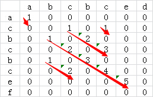
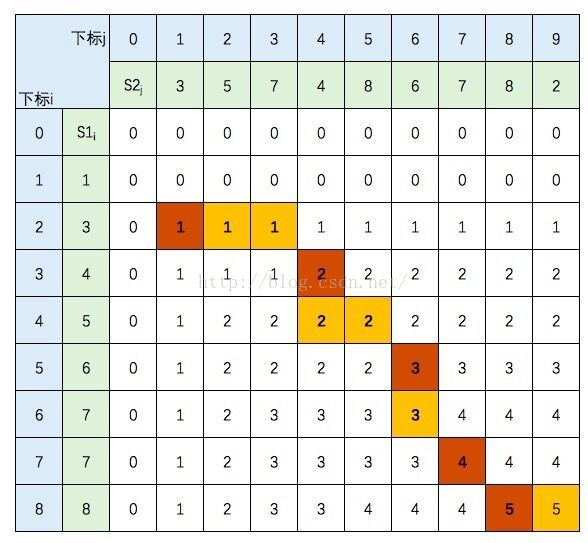
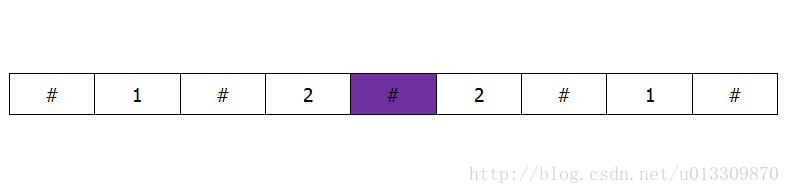

##	最长公共子串

求两个字符串s1、s2（长度分别为m、n）最长公共子串长度

###	矩阵比较

-	将两个字符串分别以行、列组成矩阵M

-	对矩阵中每个元素$M[i, j]$，若对应行、列字符相同

	-	元素置为1，否则置0
		

	-	置元素$M[i,j] = M[i-1, j-1] + 1$，否则置0
		

-	则矩阵中最长的非0斜序列对应子串即为最长公共子串

####	算法特点

-	时间效率$\in \Theta(mn)$
-	输入增强

##	最长公共子序列

求两个序列X、Y的最长公共子序列

> - 子序列：去掉给定序列中部分元素，子序列中元素在原始序列中
	不必相邻
> - 最长公共子序列可能有很多

###	动态规划

-	先使用动态规划确认最长子序列长度，构造动态规划表

	$$C[i,j] = \left \{ \begin{array}{l}
		0 & i=0 或 j=0 \\
		C[i-1, j-1] & i,j > 0 且 X[i] == Y[j] \\
		max\{C[i-1, j], C[i, j-1]\} & i,j > 0 且 X[i] != Y[j] \\
	\end{array} \right.$$

	> - $C[i,j]$：序列X前i个元素子序列、序列Y前j个元素子序列
		最大子序列长度

-	根据动态规划表找出最长公共子序列

	

	-	从动态规划表中首个格子开始，沿着某条**格子路径**达到
		表中最后一个元素
	-	路径中值改变格子对应序列中元素即为最长公共子序列中
		元素

	> - 不同格子路径可能找到不同的最长公共子序列

####	算法特点

-	时间效率
	-	动态规划部分$\in \Theta(|X||Y|)$
	-	生成公共子序列部分$\in Theta(|X|+|Y|)$

-	动态规划

##	最长升/降序序列

寻找长度为N的序列L中最长单调自增子序列

###	最长公共子序列法

-	将原序列升序排序后得到$L^{ * }$
-	原问题转换为求$L, L^{ * }$最长公共子序列

####	算法特点

-	时间效率：$\in \Theta(|L|^2)$

###	动态规划法

-	使用动态规划法求出以$L[i]$**结尾**的最长升序子序列长度，
	得到动态规划表

	$$C[i] = \left \{ \begin{array}{l}
	max\{C[j]\} + 1, j=1,\cdots,i-1, L[j]<L[i] & i \geq 2 \\
	1 & i=1
	\end{array} \right.$$

	> - $C[i]$：以$L[i]$结尾的最长升序子序列长度

-	则动态规划表中值最大者即为最长升序序列长度

####	算法特点

-	时间效率$\in O(|L|^2)$

###	动态规划2

使用线性表记录当前能够找到的“最长上升子序列”

-	若当前元素大于列表最后（大）元素：显然push进线性表
	-	则当前线性表长度就是**当前子串**中最长上升子序列

-	若当前元素不大于列表中最后元素
	-	考虑其后还有元素，可能存在包含其的更长上升序列
	-	使用其替换线性表中**首个大于**其的元素
		-	隐式得到以当前元素为结尾的最长上升子序列：其及
			其之前元素
		-	更新包含其的上升子序列的要求：之后元素大于其
	-	不影响已有最长上升子序列长度，且若之后出现更长上升
		子序列，则线性表被逐渐替换

####	算法

```c
lengthOfLIS(nums[0..n-1]):
	// 动态规划求解最上升子序列
	// 输入：序列nums
	// 输出：最长上升子序列长度
	if n == 0:
		return 0
	LIS = InitVector()
	for num in nums:
		if num > LIS.last()
			LIS.push(num)
		else:
			for idx=0 to LIS.len():
				if num <= LIS[idx]:
					break
			LIS[idx] = num
				// 更新上升子序列中首个大于当前元素的元素
	return LIS.len()
```

###	动态规划+二分

##	最长回文子串

###	中心扩展法

-	遍历串，以当前元素为中心向两边扩展寻找以回文串

-	为能找到偶数长度回文串，可以在串各元素间填充空位

	

	-	填充后元素位置$i = 2 * i + 1$、填充符位置$2 * i$
	-	两端也要填充：否则可能出现`#`为中心回文和端点回文
		等长，但返回`#`中心回文
	-	填充后得到最长回文串肯定是原最长回文串扩展
		-	非`#`中心：原串不存在偶数长度回文串更长，则显然
		-	`#`中心：显然

####	算法

```c
LongestSubParlidrome(nums[0..n-1]):
	// 中心扩展法求解最长回文子串
	// 输入：串nums[0..n-1]
	// 输出：最长回文串
	nnums = padding(nums)
	nn = len(nnums)
	max_shift, center = 0, -1
	for i=0 to nn:
		shift = 1
		while i >= shift and i + shift < nn:
			if nnums[i-shift] != nnums[i+shift]:
				break
			shift += 1

		// 越界、不匹配，均为-1得到正确、有效`shift`
		shift -= 1

		if shift > max_shift:
			max_shift, center = shift, i

	left = (center - max_shift + 1) // 2
	right = (center + max_shift) // 2
	return nums[left : right]
```

####	特点

-	算法效率
	-	时间复杂度$\in O(n^2)$
	-	空间复杂度$\in O(1)$

###	动态规划

###	Manacher算法

-	考虑已经得到的以$i$为中心、半径为$d$回文子串对称性
	-	则$[i-d, i+d+1)$**范围内**中回文对称
	-	即若$i-j, j<d$为半径为$dd$的回文串中心，则$2i - j$
		同样为半径为$dd$的回文串中心
		（$[i-d, i+d-1)$范围内）

-	所以可以利用之前回文串信息减少之后回文串检测

> - Manacher算法同样有中心扩展算法问题，要填充检测偶数长串

####	算法

```c
LongestSubParlidrome(nums[0..n-1]):
	// Manacher算法利用之前回文串信息求解最长回文子串
	// 输入：串nums[0..n-1]
	// 输出：最长回文串
	nnums = padding(nums)
	nn = len(nnums)
	shift_d = [0] * nn
	max_shift, center = 0, 0
	for i=0 to nn:

		// 利用之前信息初始化
		shift = shift_d[i]

		while shift <= i and shift < nn - i:
			if nnums[i+shift] != nnums[i - shift]:
				break
			shift += 1
		shift -= 1

		// 更新可利用信息
		for j=1 to shift:
			shift_d[i+j] = max(
				shift_d[i+j],
				min(shift_d[i-j], i+j-shift))

		if shift > max_shift:
			max_shift, center = shift, i

	left = (center - max_shift + 1) // 2
	right = (center + max_shift) // 2
	return nums[left: right]
```

####	特点

-	算法效率
	-	时间复杂度$\in \Theta(n)$
	-	空间复杂度$\in \Theta(n)$


