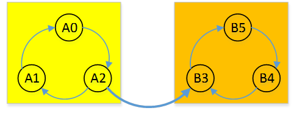

#	图算法

##	总述

-	图的遍历算法：如何一次访问到网络中所有节点
-	最短路线算法：两个城市间最佳路线
-	有向图拓扑排序：课程、预备课程是否有矛盾
-	All-Pairs Shortest-Paths Problem：完全最短路径问题，找到
	每个顶点到其他所有顶点的距离

##	遍历算法

###	Depth-First Search

深度优先查找（DFS）

####	算法

-	从**任意顶点**开始访问图顶点，然后标记为已访问

-	每次迭代时，紧接着处理与当前顶点**邻接的未访问顶点**，
	直到遇到终点，该顶点所有邻接顶点均已访问过

-	在终点上，算法**沿着来路**后退一条边，继续从那里访问未
	访问顶点

-	后退到**起始点**，且起始点也是终点时，算法停止，这样
	起始点所在的连通分量的所有顶点均已访问过

-	若存在未访问顶点，则必须从其中任一顶点开始重复上述

```c
count = 0
	// 全局变量：访问次序（次数）
DFS(G)
	// 对给定图的深度优先查找遍历
	// 输入：图G=<V, E>
	// 输出：图G顶点按照DFS遍历第一次访问到的先后次序，
	//       未访问到标记未0
	for each vertex v in V do
		if v is marked with 0
			dfs(v)
dfs(v)
	// 递归访问所有和v相连接的未访问顶点，赋予count值
	count = count+1
	mark v with count
	for each vertex w in V adjecnt to v do
		if w is marked with 0
			dfs(w)
```

####	特点

-	算法效率非常高效，消耗时间和表示图的数据结构规模成正比
	-	邻接矩阵：遍历时间效率$\in \Theta(|V|^2)$
	-	邻接链表：遍历时间效率$\in \Theta(|V|+|E|)$

-	可以方便地用栈跟踪深度优先查找
	-	首次访问顶点，将顶点入栈
	-	当顶点成为终点时，将其出栈
	-	运行时就是实际上就是栈，所以深度优先可以直接利用递归
		实现

-	*Depth-First Search Foreat*：参见
	*algorithm/data_structure/graph*

-	DFS产生两种节点排列顺序性质不同，有不同应用
	-	入栈（首次访问顶点）次序
	-	出栈（顶点成为终点）次序

####	应用

-	检查图连通性：算法第一次停止后，是否所有顶点已经访问
-	检查图无环性：DFS是否包含回边
-	拓扑排序：见*键值法*
	-	DFS节点出栈逆序就是拓扑排序的一个解（图中无回边，
		即为有向无环图）
	-	DAG中顶点v出栈前，不存在顶点u拥有到v的边，否则存在
		回边，图不是DAG

###	Broad-First Search

广度优先查找（BFS）

####	算法

-	首先访问所有和初始顶点邻接的顶点

-	然后是离它两条边的所有未访问顶点

-	以此类推，直到所有与初始顶点在同一连通分类顶点均已访问

-	若存在未访问顶点，从图其他连通分量任意顶点开始

```c
count = 0
	// 全局变量：访问次序（次数）
BFS(G)
	// 给定图广度优先查找变量
	// 输入：图G=<V, E>
	// 输出：图G的顶点按照被BFS遍历第一次访问到次序，
	//       未访问顶点标记未0
	for each vertax v in V do
		if v is marked with 0
			bfs(v)
bfs(v)
	// 访问所有和v相连接的顶点，赋count值
	count = count+1
	whilte queue is not empty do
		for each vertex w in V adjcent to the front vertex do
			if w is marked with 0
				count = count+1
				mark w with count
				add w to the queue
		remove the front vertex from the queue
```

####	特点

-	算法效率同DFS
	-	邻接矩阵：遍历时间效率$\in \Theta(|V|^2)$
	-	邻接链表：遍历时间效率$\in \Theta(|V|+|E|)$

-	使用队列可以方便地跟踪广度优先查找操作
	-	从遍历初始顶点开始，标记、入队
	-	每次迭代时，算法查找所有和队头顶点邻接未访问，标记
		、入队、将队头顶点出队

-	*Breadth-First Search Forest*：参见
	*algorithm/data_struture/graph*

-	BFS只产生顶点的一种排序，因为队列时FIFO结构，顶点入队、
	出队次序相同

####	应用

-	和DFS一样可以检查图的连通性、无环性，但是无法用于比较
	复杂的应用

-	求给定两个顶点间最短路径：从一顶点开始BFS遍历，访问到
	另一节点结束（难以证明？）

##	有向图强连通分量

###	Kosaraju算法

考虑有向图中强连通分量之间不连通的情况

-	强连通分量之间没有边

	-	在任意连通分量中任意结点开始深度优先遍历

	-	访问完所有结点需要DFS次数就是强连通分量数量，每轮
		DFS访问的点就是强连通分量中的顶点
	
-	强连通分量之间只有单向边

	-	将强连通分量视为**单个结点**，则整个图可以视为一个
		靠连通分量间单向边连接的有向无环图

	-	从最底层强连通分量中任选结点开始进行DFS，则此轮DFS
		只能访问当前连通分量中结点

	-	逆序依次在各强连通分量中选择结点进行DFS，则每轮DFS只
		访问当前连通分量中结点（其下层连通分量已访问）

	-	直至所有结点访问完毕，则得到所有强连通分量，即每轮
		进行DFS访问的结点

	-	以下图为例，从图中连通分量B中任意结点开始进行DFS，
		则经过两轮DFS即能找所有强连通分量

		

由以上分析

-	只需要保证**底层强连通分量进行DFS优先搜索**

-	也即在结点搜索优先级中，底层强连通分量中至少有一个结点
	在其上层连通分量所有结点之前

-	可以利用**原图的反向**的DFS**逆后序排列**得到满足条件
	的结点优先级序列

	

	-	若从反向图中最底层强连通分量某结点开始，则只能遍历
		自身，反向图中其余连通分量位于其所有结点之前

	-	若从反向图中非最底层强连通分量某结点开始，则能依次
		遍历其底层所有强连通分量中结点，且至少该结点位于其余
		连通分量所有结点之前

> - 逆后序排列参见*algorithm/data_structure/graph*

####	算法

-	对原图G每条路径求反，得到反向图$G^R$
-	对反向图$G^R$求解逆后序序列
-	按照逆序序列优先级，对原图G进行DFS，每棵DFS生成树就是
	一个强连通分量

####	特点

-	算法效率
	-	时间效率$\in O(|V| + |E|)$
	-	算法需要对图进行两次DFS，速度较Tanjar算法更慢

###	Tarjan算法

Tarjan算法：基于图深度优先搜索的算法

-	为每个结点维护两个标记，通过此标记确定是否存在回路

	-	`DFN`：深度优先搜索中搜索到次序
	-	`Low`：通过回边能访问到的前驱被搜索到的次序
	> - 还可以维护一个`Flag`，判断结点是否仍在DFS栈中

-	对图进行深度优先搜索

	-	未处理结点入栈，设置其`DFN`、`Low`被搜索到的次序

	-	对已处理结点，考虑深度优先搜索、退栈方式

		-	仍然在栈中，则肯定是栈顶元素前驱，连接边为回边，
			存在**栈顶节点到该前驱结点的回路**

		-	不在栈中，该节点不是祖先结点，连接边为交叉边，
			该结点已经在其他连通分量中出栈

	-	使用栈中前驱结点`Low/DFN`次序更新当前（栈顶）结点，
		并递归更新，即使用**子节点访问先驱次序更新父节点**

-	DFS回溯，栈中每个结点`DFN`、`Low`

	-	若`DFN[u] < Low[u]`：结点`u`和其**前驱**之前有回路，
		即其属于同一个强连通分量

	-	若`DFN[u] ==  Low[u]`：结点`u`和其前驱之间没有通路，
		没有更多结点属于其所属强连通分量，以结点`u`为根子树
		是一个强连通分量

		-	从栈顶元素开始退栈直至结点`u`退栈，退栈的所有
			元素构成强连通分量

-	每个强连通分量为深度优先搜索树中一个子树

$$
Low[v] = \min\{DFN[v], Low[w], DFN[k]\}
$$

> - $w, (w, v) \in E$：顶点v的直接前驱
> - $k, (v, k) \in E$：顶点v的祖先（即栈中结点）

####	算法

```c
S = initStack()
DFN[MAX_VERTAX], Low[MAX_VERTEX]
index = 0
QList = InitList(Queue())

tarjan(u, E):
	// 比较DFS搜索次序、回边到达次序判断强连通分量
	// 输入：结点u，边集合E
	// 输出：强连通分量队列列表
	DFN[u] = Low[u] = ++ index
	S.push(u)
	for each (u, v) in E:
		if (v is not visited):
			tarjan(v)
			Low[u] = min(Low[u], Low[v])
			// 使用v找到的前驱更新u能找到前驱，递归更新
		else if (v in S):
			// 判断边是否为回边
			Low[u] = min(Low[u], DFN[v])
			// Low[u] = min(Low[u], Low[v])
				// 应该也行
	if(DFN[u] == Low[u]):
		Q = QList.next()
		repeat
			v = S.pop()
			Q.push(v)
		until (u == v)
```

####	特点

-	算法效率
	-	时间效率$\in O(|V|+|E|)$

##	关节点

###	类Tarjan算法

-	类似Tarjan算法为每个节点维护`DFN`、`Low`两个次序
	-	对非根结点v，存在其直接后继w有`Low[w] >= DFN[v]`，
		则v为关节点
	-	对根节点，有两棵以上子树则为关节点

####	算法

此算法具体实现和Tarjan算法细节有差异

-	此算法中不需要使用栈保存访问过顶点中是前驱者
	-	连通无向图DFS只会有回边，已访问点必然是前驱结点
-	需要对根结点额外判断是否为关节点

```c
DFN[MAX_VERTAX], Low[MAX_VERTEX]
index = 0
Q = InitQueue()

FindArticul(G):
	// 输入：无向连通图G
	// 输出：关节点队列
	vroot = G.V.pop()
	TarjanArticul(vroot, G)
	for(v in G.V if v not visited)
		// 根节点有两棵及以上子树
		TarjanAricul(vroot, G)
		Q.push(vroot)
		// 根节点也是关节点
	return Q

TarjanArticul(u, G):
	// 比较DFS搜索次序、回边到达次序判断关节点
	// 输入：结点u，无向连通图G
	// 输出：关节点队列
	DFN[u] = Low[u] = ++ index
	for each (u, v) in G.E:
		if (v is not visited):
			tarjan(v)
			Low[u] = min(Low[u], Low[v])
			// 使用v找到的前驱更新u能找到前驱，递归更新
		else:
			Low[u] = min(Low[u], DFN[v])
			// Low[u] = min(Low[u], Low[v])
				// 应该也行
	for(v connected by u)
		if(Low[v] <= DFN[u])
			Q.push(u)
	return Q
```

##	无权路径

###	路径数量

图中顶点i到顶点j之间长度为k的不同路径数量为$A^k[i, j]$

-	A为图的邻接矩阵
-	可以使用数学归纳法证明
-	对无向、有向图均适用

###	Warshall算法

Warshall算法：生成有向图传递闭包

-	构造n+1个n阶布尔矩阵$R^{(k)}, k=0,1,\cdots, n$

	-	$R^{(k)}_{ij}=1$：顶点i、j直接存在中间顶点**编号**
		不大于k的有效路径

	-	$R^{(0)}$：邻接矩阵，顶点直接连接

	-	$R^{(k)}, 0<k<n$：路径中间顶点编号最大为`k`

	-	$R^{(n)}$：传递闭包，允许所有类型路径

	-	后继矩阵相对前趋，允许作为路径上顶点增加，可能包含
		1数量更多

-	考虑$R^{(k)}$通过直接前趋$R^{(k-1)}$计算得到

	-	$R^{(k-1)}$中已有路径在$R^{(k)}$保留

	-	考虑$R^{(k)}$相较于$R^{(k-1)}$新增$r_{ij}=1$

		-	表示顶点i、j之间存在包含k的路径

		-	若k在路径中出现多次，则将删除回路，得到新路径

		-	则存在ik和kj之间路径满足中间顶点编号小于k，即在
			$R^{(k-1)}$中有$r_{ik}=1, r_{kj}=1$

####	算法

-	若元素$r_{ij}$在$R^{(k-1)}$中为1，则在$R^{(k)}$也是1

-	若元素$r_{ij}$在$R^{(k-1)}$中为0，当且仅当存在v使得
	$R^{(k-1)}$中$r_{iv}=1, r_{vj}=1$

```c
Warshall(A[1..n, 1..n])
	// 计算传递闭包的Warshall算法
	// 输入：A[1..n, 1..n]包含n个顶点的有向图的邻接矩阵
	// 输出：A的传递闭包
	R^0 = A
	for i = 1 to n do
		for i = 1 to n do
			for j = 1 to n do
				if R^(k-1)[i, j] == 1 or
					(R^(k-1)[i, k] == 0 and R^(k-1)[k, j] == 0)
					R^k[i, j] = 1
	return R^n
```

####	算法特点

-	算法效率
	-	时间效率$\in \Theta(n^3)$
		-	重新构造最内层循环，可以提高对某些输入的处理速度
		-	将矩阵行视为位串，使用或运算也可以加速
	-	空间效率取决于如何处理布尔矩阵

-	蛮力法：所有点分别作为起点作一次搜索，记录能够访问的顶点
	-	对有向图遍历多次
	-	使用邻接链表表示稀疏图，蛮力法渐进效率好于Warshall算法

##	有权路径

###	Prim算法

Prim算法：求解最小图最小生成树算法

-	每次添加距离当前树距离最近顶点进树
-	不断迭代构造最小生成树

####	算法

-	从图顶点集V中任选单顶点作为序列中初始子树

-	对图中顶点维护两个标记：树中最近顶点、相应距离

	-	一般使用优先队列维护
	-	对所有顶点维护：`NULL`、$\infty$标记和树不直接相连
	-	仅对和和树直接相连顶点维护：每次更新列表

-	以贪婪的方式扩张当前生成树，添加不在树中的最近顶点

-	更新顶点和树距离最近的顶点、相应距离
	
	-	因为树中只新添加一个顶点，考察与新添加顶点直接相连
		顶点即可

-	不断迭代直到所有点都在树中

```c
Prim(G)
	// 构造最小生成树Prim算法
	// 输入：加权连通图G=<V, E>
	// 输出：E_T, 组成G最小生成树的边集合
	V_T = {v_0}
		// 使用任意顶点初始化树顶点集合
	E_T = NULL
		// 初始化生成树边为空集

	for i = 1 to |V|
		if i connect V_T
			D_V[i] = i
			D_D[i] = e(0, i)
		else
			D_V[i] = NULL
			D_D[i] = \infty
		// 初始化节点和树最近节点列表、节点与树距离列表

	for i = 1 to |V|-1 do
		// 重复n-1次，直到树包含所有顶点
		edge = min(D_D)
			// 寻找距离树最近的点
		v = vertex(edge)

		V_T = V_T union {v}
		E_T = E_T union {edge}

		D_V[v] = NULL
		D_D[v] = \infty
		更新和v相连的顶点
			// 更新两个标记列表
	return E_T
```

####	算法特点

-	算法时间效率依赖实现优先队列、存储图数据结构
	-	图权重矩阵、优先队列无序数组$\in \Theta(|V|^2)$
	-	图邻接链表、优先队最小堆$\in O(|V|log|E|)$
		（书上说是$\in O(|E|log|V|)$）
	-	使用Fibonacci Heap实现优先队列能够改善最差效率

-	对树进行扩展时用到的边的集合表示算法生成树

-	穷举查找构造生成树，生成树数量呈指数增长，且构造生成树
	不容易

###	Kruskal算法

Kruskal算法：把最小生成树看作是具有$|V|-1$条边、且边权重最小
的无环子图，通过对子图不断扩展构造最小生成树

####	算法

-	按照权重非递减顺序对图中边排序

-	从空子图开始扫描有序列表，试图把列表中下条边加到当前子图
	中，如果添加边导致回路则跳过

-	不断添加边直到达到$|V|-1$

```c
Kruskal(G)
	// 构造最小生成树的Kruskal算法
	// 输入：G=<V, E>加权连通图
	// 输出：E_T，组成G的最小生成树边集
	reverse_sort([w(e_i)])
		// 按照边权非递减顺序对边集排序
	E_T = NULL
	ecounter = 0
	k = 0
	while ecounter < |V|-1 do
		k += 1
		if E_T union {e_k} 无回路
			// 需要使用高法效算法检查两个顶点是否位于同一棵树
			// 常用算法为并查算法（参见不相交子集）
			E_T = E_T union {e_k}
			ecounter += 1
	return  E_T
```

####	算法特点

-	Kruskal每次迭代都需要检查添加新边是否会导致回路，其实
	效率不一定比Prim算法高

-	Kruskal算法中间阶段会生成一系列无环子图（树）

	-	子图不总是联通的
	-	可以看作是对包含给定图所有顶点、部分边的森林所作的
		连续动作
	-	初始森林由|V|棵普通树构成，包含单独顶点
	-	最终森林为单棵树，包含图中所有顶点
	-	每次迭代从图的边有序列表中取出下条边，找到包含其端点
		的树，若不是同一棵树，则加入边生成一棵更大的树

-	算法效率
	-	如果检查顶点是否位于同一棵树算法高效，则算法运行时间
		取决于排序算法，时间效率$\in O(|E|log|E|)$

###	Dijkstra算法

Dijkstra算法：求解单起点最短路径算法

-	按照从给定起点到图中各顶点的距离，**顺序**求出离起始点
	最近的顶点、相应最短路径

-	第i次迭代前，算法已经确定了i-1条连接起点、离起点前i-1近
	顶点的最短路径

	-	这些构成了给定图的一棵子树$T_i$
	-	可以在同$T_i$顶点邻接的顶点中找到和起点最接近的顶点
		（边权非负）

-	算法只能应用于不含负权重的图

-	算法类似于Prim算法，两个评价标准不同
	-	Dijkstra算法是各条路径长度：有重复边，考虑整个路径
	-	Prim算法是评价各边总和：无重复边，只考虑一条边

####	算法

-	对顶点维护两个标记：起点到该顶点最短路径长度`d`、路径上
	前个顶点`pre_v`

	-	一般使用优先队列维护
	-	对所有顶点维护：$\infty$、`NULL`标记不在树中、不与树
		邻接顶点
	-	仅对生成树中顶点、邻接顶点维护：每次迭代更新列表

-	根据标记选择邻接顶点中和起始点距离`d`最小顶点，添加进树

-	更新顶点标记

	-	因为生成树只新添加一个顶点，只需要考虑与新添加顶点
		直接相连、未在树中顶点
	-	比较与起始点距离是否改变

-	不断迭代直至所有点均在树中


```c
Dijkstra(G, s)
	// 单起点最短路径Dijkstra算法
	// 输入：G=<V, E>非负权重加权连通图，顶点s起始点
	// 输出：对V中每个顶点，从s到v的最短路径长度d_v
	Initialize(Q)
		// 将顶点优先队列初始化为空
	for v in V
		d_v = \infty
		p_v = NULL
		Insert(Q, s, d_s)
			// 初始化有限队列中顶点优先级
	d_s = 0
	Decrease(Q, s, d_s)
		// 更新s优先级为d_s
	V_T = NULL

	for i = 0 to |V|-1 do
		u* = DeleteMin(Q)
			// 删除优先级最小元素
		V_T = V_T \union {u*}
		for v in V-V_T 中与u*邻接顶点 do
			if d_u* + w(u*, u) < d_u
				d_u = d_u* + w(u*, u)
				p_u = u*
				Decrease(Q, u, d_u)
```

####	算法特点

-	算法时间效率同Prim算法

### Floyd算法

Floyd算法：求解完全最短路径问题，有向、无向、加权图均适用
（边距离不为负，否则距离可以任意小）

-	构造n+1个距离矩阵$D^{(k)}, k=0,1,\cdots,n$

	-	$D^{(k)}$中元素$d_{ij}$表示顶点i、j之间由编号小于k的
		顶点作为中间顶点的距离

	-	$D^{(0)}$：初始权重矩阵

	-	$D^{(k)}, 0<i<n$：路径中顶点编号最大为`k`

	-	$D^{(n)}$：目标距离矩阵

	-	后继矩阵相对前趋，允许作为路径上顶点增加，各顶点间
		距离可能缩短

-	考虑$D^{(k)}$通过直接前趋$D^{(k-1)}$计算得到，其中距离
	（路径）分为两类

	-	$d^{(k)}_{ij} = d^{(k-1)}_{ij}$：不包含顶点k作为中间
		节点的路径
	
	-	$d^{(k)}_{ij} = d^{(k-1)}_{ik} + d^{(k-1)}_{kj} < d^{(k-1)}_{ij}$：
		包含顶点k作为中间节点的路径


####	算法

$$
d^{(k)}_{ij} = \min \{ d^{(k-1)}_{ik} + d^{(k-1)}_{kj},
	d^{(k-1)}_{ij}, d^{(k-1)}_{ij} \}
$$

```c
Floyd(W[1..n, 1..n])
	// 计算完全最短路径的Floyd算法
	// 输入：W不包含负距离的距离矩阵
	// 输出：包含最短距离的距离矩阵
	D^0 = W
	for k = 1 to n do
		for i = 1 to n do
			for j = 1 to n do
				D[i, j] = min(D[i, j], D[i, k] + D[k, j])
	return D
```

####	算法特点

-	算法效率
	-	时间效率同Warshall算法为立方级
	-	如上伪码的空间效率为平方级（没有创建n+1距离矩阵）

-	Floyd算法类似于Warshall算法

-	Floyd算法利用最优性原理，即最短路径中子路径也是最短

##	最大流量问题

###	Augmenting-Path Method

####	Shortest-Augmented-Path算法

最短增益路径法（*first-labeled first-scanned algorithm*）

-	对网络中顶点维护两个标记

	-	从源点到被标记顶点能增加流量数
	-	路径中前个顶点名称
		-	`+`：从前向边访问到当前顶点
		-	`-`：从后向边访问到当前顶点

-	对网络的每条边$(i, j)$，初始化流量为$x_{ij}=0$

-	从源点开始同时沿着前向边、后向边进行广度优先搜索

	-	先更新前向边
	-	只有有增益空间边（顶点）才能被访问
	-	更新搜索到顶点标记

-	源点被标记表明得到一条增量路径，沿着标记反向更新边流量

-	若广度优先搜索无法达到源点，表明不存在流量增益路径，当前
	流量值作为最大值返回

```c
ShortestAugmentingPath(G)
	// 最短增量路径算法
	// 输入：流量网络G
	// 输出：最大流量x
	对网络中每条边，设置x[i, j] = 0
	把源点标记为(\infty, -)，加入空队列Q中
		// 使用队列实现广度优先搜索
	while not Empty(Q) do
		i = Front(Q)
		Dequeue(Q)
		for 从i到j的每条边 do
			// 遍历从i出发的边，前向边
			if j未被标记
				r[i, j] = = u[i, j] - x[i, j]
				if r[i, j] > 0
					l[j] = min{l[i], r[i, j]}
					/// 更新从源点到顶点j能增加的流量数
					用l[j], i+标记j
					Enqueue(Q, j)
		for 从j到i的每条边 do
			// 遍历到达i的边，后向边
			if j未被标记
				if x[j, i] > 0
					l[j] = min{l[i], x[j, i]}
					// 更新源点到顶点j能增加的流量数
					用l[j], i-标记j
					Enqueue(Q, j)
		if 汇点被标记
			// 沿着找的增益路径进行增益
			j = n
			while j != 1
				// 反向更新到源点为止
				if 顶点j前个节点为i+
					// 通过前向边访问到顶点j
					x[i, j] = x[i, j] + l[n]
				else
					x[j, i] -= l[n]
				j = i
		去除除源点外所有顶点标记
		重新初始化化队列Q
```

####	算法特点

-	算法正确性可以（联合）最大流-最小割定理证明

-	算法时间效率
	-	可以证明最短增益路径算法用到的增益路径数量不超过
		$|V||E|/2$
	-	对使用邻接列表表示的网络，用广度优先查找找到一条增益
		路径的时间$\int O(|V|+|E|)$
	-	所有算法时间效率$\in O(|V||E|^2)$

-	迭代算法

###	Preflow推进算法

预流：满足容量约束，但是不满足流量守恒约束

-	把过剩流量向汇点处移动，直到网络所有中间顶点都满足流量
	守恒约束为止

####	算法特点

-	算法时间效率
	-	这类算法中较快者最差效率可以接近$O(|V||E|)$

###	Dinitz算法

###	Karzanov算法

###	Malhotra-Kamar-Maheshweari算法

###	Goldberg-Tarjan算法

###	单纯形法

此问题仍然是线性规划问题，可以使用单纯形法等通用解法求解

##	最大匹配（二分图）

###	匈牙利算法

####	算法

-	对U中每个顶点维护一个标记：与其匹配的对偶顶点

-	从V中的一个自由顶点v出发，按**广度优先搜索**找到U中自由
	顶点u，寻找增益路径，搜索过程中

	-	V中顶点：按照广度优先搜索，得到不在匹配M中的边
		-	搜索到U中自由顶点，则停止**得到增益路径**
		-	搜索到U中被标记顶点，则连接上已有匹配
	
	-	U中顶点：直接找到其在V中的对偶顶点，得到在M中边


-	得到一个增益路径，沿着增益路径**回溯**，奇数边加入匹配

-	未找到自由顶点时，则无法得到增益路径

```c
MaximumBipartiteMatching(G)
	// 用类似广度优先算法遍历求二分图的一个最大匹配
	// 输入：二分图G=<V, U, E>
	// 输出：输入图中一个最大基数匹配
	初始边集合M包含某些合法的匹配（例如空集合）
	初始队列Q包含V的所有自由顶点（任意序）
	while not Empty(Q) do
		w = Front(Q)
		Dequeue(Q)
		if w \in V
			for 邻接w的每个顶点u do
				// 二分图性质保证u一定在U中
				if u是自由顶点
					// 增益
					M = M \union (w, u)
						// 首边进匹配
					v = w
					while v已经被标记 do
						// 从增益路径回溯生成匹配
						u = 以v标记的点
						M -= (v, u)
							// 偶数边出匹配
						v = 以u标记的点
						M += (v, u)
							// 奇数边进匹配
					删除所以顶点标记
					用V中所有自由顶点重新初始化Q
					break
						// 增益后，重新搜索
				else
					// u已经匹配
					if (w, u) not \in M and u未标记
						用w标记u
						Enqueue(Q, u)
		else
			// w \in U，此时w必然已经匹配
			用w标记w的对偶v
				// 将已有匹配添加进增益路径中
			Enqueue(Q, v)
	return M
		// 当前匹配已经是最大匹配
```

####	算法特点

-	注意：从自由顶点开始寻求匹配时，无论是否找到增益路径，
	路径中中U中节点标记已经更新，匹配仅在得到增益路径才更新

-	算法时间效率
	-	每次迭代花费时间$\in O(|E|+|V|)$，迭代次数
		$\in O(|V|/2 + 1)$
	-	若每个顶点的信息（自由、匹配、对偶）能在常数时间内
		得到（如存储在数组中）
	-	则算法时间效率$\in O(|V|(|V| + |E|))$

-	算法正确性参见图*graph_undirected*关于增益路径-最大匹配

-	迭代算法

###	霍普克罗夫-卡普算法

####	算法特点

-	对匈牙利算法的改进，把多次迭代在一个阶段完成，然后用一次
	查找把最大数量边添加到匹配中

-	算法时间效率：$\in O(\sqrt {|V|}(|V| + |E|))$

##	稳定婚姻问题

###	婚姻稳定算法

存在自由男士，任选*求婚*、*回应*之一执行，直至不存在自由男士

-	求婚：自由男士m向女士w求婚，w为其优先级最大、之前未拒绝
	过其女士（可以是已匹配）

-	回应：若女士w自由则接受男士m求婚，与之配对；女士w不自由
	则把m同当前配偶匹配，选择其中优先级较高者

####	算法

####	算法特点

-	算法会在$n^2$次迭代内终止：至多每位男士向所有女士求婚

-	*性别倾向*：总是生成*man-optimal*的稳定匹配，优先满足
	男士偏好

	-	在任何稳定婚姻中，总是尽可能把优先级最高的女士分配给
		男性
	-	使用女士进行求婚也只会把性别偏见反向，而不能消除

-	对给定的参与者优先选择集合而言，男士（女士）最优匹配唯一

	-	由性别性别倾向容易证明
	-	所以算法的输出不取决于自由男士（女士）求婚顺序，可以
		使用任何数据结构表示参与者集合而不影响结果

> - 算法最终输出匹配M为稳定婚姻匹配证明参见*graph*

##	分配问题（二分图）

n个任务分配给n个人执行（一人一个），将任务j分配个人i的成本为
$C_{ijd}$，求最小成本分配方案

> - 类似问题：最大权重匹配问题

###	蛮力算法

####	算法

-	生成整数n的全部排列
-	根据成本矩阵计算每个分配方案总成本
-	选择和最小的方案

####	特点

-	算法排列次数为$n!$

###	分支界限法

-	第i层节点下界可取：$lb = c + \sum_{k=i+1}^n min\{c_k\}$

	-	$c$：当前成本
	-	$min\{c_k\}$：成本矩阵第k行最小值

####	算法

####	特点

###	匈牙利算法

####	算法

####	特点

##	Topological Sorting

拓扑排序：按照次序列出有向图的顶点，使得对图中每条边，其
起始顶点总在结束顶点之前

###	删点法

####	算法

-	在有向图中求出源（没有输出边的顶点），然后把删除其和所有
	从它出发的边
-	不断重复，直到不存在源，如果此时图中还有顶点，则图中存在
	环，无解
-	则删除节点顺序即为拓扑排序可行解

```c
TopologicalSort(G):
	// 从有向图中不断删除入度为0的点、入栈，判断有向图G是否
		// 为DAG，并给出拓扑排序栈
	// 输入：有向图G
	// 输出：拓扑排序栈T
	InitStack(S)
	indgree = [v.indegree for v in G]
	for v in G:
		if v.indgree == 0
			S.push(v)
		// 存储0入度结点栈
	count = 0
		// 删除结点计数
	while(!S.empty())
		v = S.pop()
		T.push(v)
		count++
		for(u connected to v)
			if --indgree.u == 0
				S.push(u)
	if count < |G.V|
		// 结点未删除完毕，但无0入度结点
		// G中有回路，报错
		return ERROR
	return T
```

####	特点

-	算法效率
	-	时间效率$\in O(|V|+|E|)$
-	减常数法

###	DFS逆后序遍历

图中**无环**时，由某点出发进行DFS

-	最先退出DFS的为出度为0的点，即拓扑有序序列中最后顶点

-	按照DFS退出先后次序得到序列即为逆向拓扑有序序列

	-	使用逆后序方式存储DFS访问顶点，判断是否有环、出栈
		次序即为正向拓扑有序序列

###	应用

-	判断庞大项目中相互关联任务不矛盾，然后才能合理安排，使得
	项目整体完成时间最短（需要CPM、PERT算法支持）

##	*Cirtical Path*问题

找出使用AOE网表示的工程的中关键路径

-	关键路径由关键活动构成
-	即耗费时间变动对工程整体完成时间有影响的活动

###	拓扑排序求解

-	最早、最晚开始时间检查是否为关键活动
-	建立活动（边）、事件（顶点）发生事时间关系
-	拓扑排序求解事件发生最早、最晚时间

> - 具体参见*algorithm/data_structure/graphdi_specials*

####	算法

```c
TopologicalOrder(G):
	// 从有向图中不断删除入度为0的点、入栈，判断有向图G是否
		// 为DAG，并给出拓扑排序栈
	// 输入：有向图G
	// 输出：拓扑排序栈T、顶点事件最早发生事件ve
	InitStack(S)
	indgree = [v.indegree for v in G]
	ve[0..|G.V|] = 0
	for v in G:
		if v.indgree == 0
			S.push(v)
		// 存储0入度结点栈
	count = 0
		// 删除结点计数
	while(!S.empty())
		v = S.pop()
		T.push(v)
		count++
		for(u connected by v)
			ve[u] = max{ve[u], ve[v] + len(v, u)}
				// 若有更长路径，更新
			if --indgree[u] == 0
				S.push(u)
	if count < |G.V|
		// 结点未删除完毕，但无0入度结点
		// G中有回路，报错
		return ERROR
	return T, ve

CriticalPath(G, T, ve):
	// 逆序求顶点事件最晚发生时间，求出关键活动
	// 输入：有向无环图G，G拓扑排序
	// 输出：关键活动队列Q
	vl[0..|G.V|] = ve
	Q = InitQueue()
	while(!T.empty())
		v = T.pop()
		for (u connect to v)
			vl[u] = min{vl[u], vl[v] - len(u, v)}
	for(v in G.V)
		for (u connected by v)
			ee = ve[v]
			el = vl[u] - len(v)
			if(el == ee)
				Q.push(G.edge(v, u))
	return Q
```

-	以上算法中在生成拓扑排序栈时同时得到各顶点事件最早发生
	时间

-	可以只获取拓扑排序栈，然后处理其获得顶点事件最早发生时间
	，将两个功能分离，只是处理一遍顶点而已

-	也可以使用其他算法获得拓扑排序栈
	-	DFS遍历甚至可以遍历顶点一遍，同时获得顶点事件最早、
		最晚发生时间

####	特点

-	算法效率
	-	时间效率$\in O(|V|+|E|)$

##	哈密顿回路问题

确定给定图中是否在包含一条哈密顿回路

###	回溯算法

####	算法

-	对所有节点维护标记：是否位于当前路径中

-	选择某节点*a*作为哈密顿回路起点顶点，即回溯状态空间树根

-	从根节点开始处理

	-	若节点周围还有未标记节点，选择下个加入路径、标记
	-	若节点周围没有未标记节点，回溯到之前节点重新处理

-	直到所有节点都被标记，且当前节点和根节点相邻

####	特点

##	旅商问题

Traveling Salesman Problem：对相互之间距离已知为正整数的n座
城市，求最短漫游路径，使得在回到出发城市之前，对每个城市只
访问一次

-	即：对权重为正整数的无向完全图寻找最短哈密顿回路

###	蛮力算法

####	算法

-	生成n-1个中间城市的组合得到所有旅行线路
-	计算线路长度，求得最短路径

####	特点

-	算法排序次数为$(n-1)!/2$

####	改进

-	线路成对出现，只是方向相反，可考虑任意两个相邻顶点，只
	考虑包含其某个排序的线路

###	分支界限法

-	第i层下界可取$lb = \sum_{k=i+1}^n d_{k1}$

-	更紧密、也不复杂的下界
	$lb = \lceil \frac {\sum_{k=i+1}^n (d_{k1} + d_{k2})} 2 \rceil$

	-	$d_{k1}, d_{k2}$：城市$i+1$到最近的两个城市距离

	-	最短路径为两个端点共享，至多只能有一个端点能够成为
		该边起点

	-	若要求所有哈密顿回路中必须包括某些边，则在考虑相应
		边端点城市时，使用必须边（若不是节点最短边）替换其中
		次短边

-	只需要生成某对节点有序的路径：可以消去状态空间树中部分
	分支

####	算法

####	特点

##	旅商问题非精确算法

以下均是讨论TSP问题的欧几里得实例，不对称实例等已经证明更难
解决，对精确算法、启发式算法都是如此

###	贪婪算法

####	Nearest-Neighbor算法

-	任意选择城市开始
-	每次访问和当前城市k最接近的城市，直到访问完所有城市
-	回到开始城市

####	Multifregment-Heuristic算法

求给定加权完全图的最小权重边集合，且每个顶点连通度均为2

-	将边按权重升序排列，将要构造的旅途边集合开始时空集合

-	不断尝试将排序列表中下条边加入旅途边集合

	-	边加入不会使得某节点连通度大于2
	-	不会产生长度小于n的回路
	-	否则忽略这条边

-	返回旅途集合

####	算法特点

对属于**欧几里得类型**的旅商问题实例（大部分）

-	此时虽然两个算法的精确性能比无法界定，但是满足
	$\frac {f(s_a)} {f(s^{*})} \leqslant \frac 1 2 (\lceil log_2 n \rceil + 1)$

###	Minimum-Spaning-Tree-Based Algorithm

基于最小生成树的算法

-	哈密顿回路中去掉一条边就能得到一棵生成树$T_h$
-	可以先构造一棵最小生成数$T^{*}$，然后在其基础上构造近似
	最短路径

####	Twice-Around-The-Tree算法

-	对给定实例构造最小生成树$T^{*}$（*Prim, Kruskal*）
-	从任意顶点开始，（利用深度优先遍历）绕树散步一周，记录
	经过顶点
-	扫描顶点列表，消去重复出现顶点（走捷径，直接去新城市），
	除列表尾部重复起点，得到一条哈密顿回路

> - 可能是考虑到最小生成树能够选出部分最短路径？？？

####	特点

对属于**欧几里得类型**的旅商问题

-	绕树两周算法是2近似算法：$2f(s^{*}) > f(s_a)$

	-	$f(s^{*} > w(T_h) \geqslant w(T^{*})$：最优哈密顿
		回路去掉一条边后长度大于等于最小生成树长度
	-	$f(s^{*}) < 2w(T^{*})$：第二次扫描走捷径距离小于绕树
		一周距离
	-	这里限定了特点类型实例，并没有找到对所有旅商问题的
		优先近似算法

###	Christofides算法

同样利用问题与最小生成树的出关系，但更复杂

####	算法

-	对给定实例构造最小生成树$T^{*}$
-	构造包含包含$T^{*}$的欧拉回路
	-	找出最小生成树中所有连通度为奇数的顶点
	-	求出这些顶点的最小权重匹配（匈牙利算法）
	-	将最小权重匹配边加入树中得到多重图欧拉回路
-	使用走捷径方法将欧拉回路转换为哈密顿回路

####	特点

对属于**欧几里得类型**的旅商问题

-	绕最小生成树一周得到的路径是多重图的一条欧拉回路，其中
	多重图为将当前图每条边重复一遍得到

	-	绕树两周算法：直接原始欧拉回路上走捷径
	-	Christofides算法：重新构建更短的欧拉回路，在此基础
		上走捷径

-	Christofides算法是1.5近似算法

	-	实际应用中，Christofides算法近似解明显好于绕树两周
	-	可以对连通度大于2顶点尝试不同访问次序，即将**回路**
		中邻接顶点分别**两两组合**，找到访问其的最佳路径

###	迭代改进算法

Local Search Heuristics：本地查找启发法

-	这类算法从某个初始旅途（随机或简单近似算法生成）开始

-	每次迭代把当前旅途一些边用其他边代替，试图得到和当前旅途
	稍有差别的旅途

	-	若能得到优于当前旅途的新旅途，则替换当前旅途，继续
		寻找
	-	否则，返回当前旅途，停止

####	2选算法

删除旅途中2条非临边，把两条边端点用另一对边重新连接

-	此操作称为*2改变*
-	为保证重连后得到合法哈密顿回路，重连方法只有一种
	
####	3选算法
	
删除3条非临边后重连

-	重连方法有3种
-	事实上可以推广到k选，但是只有3改变被证明有意义

####	Lin-Kernighan算法

变选算法算法的一种

-	可以视为在3选操作后进行一系列2选操作

####	算法特点

-	迭代改进算法求得的近似解效果质量非常好
-	Lin-Kernighan算法是公认的求解高质量近似解的最佳算法

###	Held-Karp Bound

Held-Karp下界

-	将TSP描述为线性规划问题求解（忽略整数约束）得到，计算
	速度快
-	一般和最优旅途长度非常接近，误差不超过1%
-	可使用其代替最短旅途估计近似算法的精确度

###	模拟

-	10000个随机点：坐标、距离取整
-	Comqaq ES40：500MHz的Alpha处理器、2GB内存

|启发式算法|超过Held-Karp下界的%|运行时间|
|-----|-----|-----|
|最近邻居|24.79|0.28|
|多片段|16.42|0.20|
|Christofides|9.81|1.04|
|2选|4.70|1.41|
|3选|2.88|1.50|
|Lin-Kernighan|2.00|2.06|

