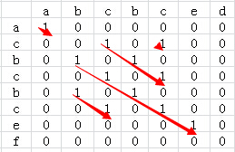

#	查找

##	总述

在给定的集合、多重集（允许多个元素具有相同的值）中找给定值
（查找键，*search key*）

-	顺序搜索
-	折半查找：效率高但应用受限
-	将原集合用另一种形式表示以方便查找

###	评价

没有任何一种查找算法在任何情况下都是最优的

-	有些算法速度快，但是需要较多存储空间
-	有些算法速度快，但是只适合有序数组

查找算法没有稳定性问题，但会发生其他问题

-	如果应用里的数据相对于查找次数频繁变化，查找问题必须结合
	添加、删除一起考虑

-	必须仔细选择数据结构、算法，以便在各种操作的需求间达到
	平衡

##	无序线性表查找

###	顺序查找

####	算法

-	将给定列表中连续元素和给定元素查找键进行比较
	-	直到遇到匹配元素：成功查找
	-	匹配之前遍历完整个列表：失败查找

```c
SequentialSearch(A[0..n-1], K)
	// 顺序查找，使用**查找键作限位器**
	// 输入：n个元素数组A、查找键K
	// 输出：第一个值为K的元素位置，查找失败返回-1
	A[n] = K
	i = 0
	while A[i] != K do
		i = i + 1
	if i < n
		return i
	else
		return -1
```

####	改进

-	将查找键添加找列表末尾，查找一定会成功，循环时将不必每次
	检查是否到列表末尾
-	如果给定数组有序：遇到等于（查找成功）、大于（查找失败）
	查找键元素，算法即可停止

###	二叉查找树

####	算法

-	对数组构建二叉查找树
-	在二叉查找树上进行查找

####	特点

-	算法效率：参见二叉查找树

-	构建二叉查找树（插入）和查找操作基本相同，效率特性也相同

-	减可变规模 + 输入增强

###	预排序查找

对线性表预排序，有序表中查找速度快得多

####	算法

```c
PreorderSearch(A[0..n-1])
	// 对数组预排序然后查找
	// 输入：可排序数组A[0..n-1]
	// 输出：元素在数组中的位置
	对B[(数组元素, 索引)]进行预排序
	使用折半查找寻找二元组
	返回二元组中索引
```

####	特点

-	算法时间效率：取决于排序算法
	-	查找算法在最差情况下总运行时间$\in \Theta(nlogn)$
	-	如果需要在统一列表上进行多次查找，预排序才值得

-	这种**预排序**思想可以用于**众数**、**检验惟一性**等，
	此时算法执行时间都取决于排序算法
	（优于蛮力法$\in Theta(n^2)$

	```c
	PresortElementUniqueness(A[0..n-1])
		// 先对数组排序，求解元素唯一性问题
		// 输入：n个可排序元素构成数[0..n-1]
		// 输出：A中有相等元素，返回true，否则false
		对数组排序
		for i=0 to n-2 do
			if A[i] = A[i+1]
				return false
		return true
	```

	```c
	PresortMode(A[0..n-1])
		// 对数组预排序来计算其模式（众数）
		// 输入：可排序数组A[0..n-1]
		// 输出：数组模式
		对数组A排序
		i = 0
		modefrequency = 0
		while i <= n-1 do
			runlength = 1
			runvalue = A[i]
			while i + runlength <= n-1 and A[i+runlength] == runvalue
				// 相等数值邻接，只需要求出邻接次数最大即可
				runlength = runlength+1
			if runlength > modefrequency
				modefrequency = runlength
				modevalue = runvalue
			i = i+runlength

		return modevalue
	```

-	变治法（输入增强）

##	有序线性表查找

###	折半查找/二分查找

####	算法

对**有序数组**，比较查找K和数组中间元素A[m]完成查找工作

-	如果：A[m] == K，查找结束
-	若：K < A[m]，对数组前半部分执行该操作
-	若：K > A[m]，对数组后半部分执行该操作

> - 折半查找依赖数据结构能够快速找到中间元素，如数组、二叉
	搜索树

```c
BinarySearch(A[0..n-1], K)
	// **非递归**折半查找
	// 输入：升序数组A[0..n-1]、查找键K
	// 输出：数组元素下标K，若存在；否则返回-1
	l = 0
	r = n - 1
	while l <= r do
		m = ceiling((l + r) / 2)
		if K = A[m]
			return m
		elif K < A[m]
			r = m - 1
		else l = m + 1
	return -1
```

####	特点

-	折半查找时间效率
	-	最坏情况下：$\in \Theta(log n)$
	-	平均情况下仅比最差稍好

-	就**依赖键值比较**的查找算法而言，折半查找已经是最优算法
	，但是插值算法、散列法等具有更优平均效率

-	减常因子因子法

###	插值查找

Interpolation Search：查找有序数组，在折半查找的基础上考虑
查找键的值

####	算法

-	假设数组值是线性递增，即*数字值~索引*为一条直线，则根据
	直线方程，可以估计查找键K在A[l..r]所在的位置
	$$
	x = l + \left \lfloor \frac {(K-A[l])(r-l)}
		{A[r] - A[l]} \right \rfloor
	$$

-	若k == A[x]，则算法停止，否则类似折半查找得到规模更小的
	问题

####	特点

-	即使数组值不是线性递增，也不会影响算法正确性，只是每次
	估计查找键位置不够准确，影响算法效率

-	统计考虑
	-	折半插值类似于非参方法，只考虑秩（索引）方向
	-	插值查找类似参数方法，构建了秩（索引）和数组值模型，
		但是线性关系基于假设
	-	如果模型错误可能会比折半查找效率更差，即在数据分布
		分布偏差较大的情况下非参方法好于参数方法

-	所以是否可以考虑取样方法，先取5个点构建模型，然后估计

-	算法效率
	-	对随机列表，算法比较次数小于$log_2log_n+1$
	-	最差情况，比较次数为线性，没有折半查找稳定
	-	Robert Sedgewick的Algorithms中研究表明，对较小文件
		折半查找更好，大文件、比较开销大插值查找更好

-	减可变规模

##	子串匹配

###	蛮力字符串匹配

####	算法

-	将pattern对齐文本前m个字符，从左向右匹配相应字符
	-	m个字符全部匹配，匹配成功，算法停止
	-	遇到不匹配字符则
-	模式右移1位，然后从模式首个字符开始重复以上匹配
-	在n-m位置无法匹配成功，则无足够匹配字符，算法停止

```c
BruteForceStringMatch(T[0..n-1], P[0..m-1])
	// 蛮力字符串匹配
	// 输入：文本T：n个字符的字符数组
	//       模式：m个字符的字符数组
	// 输出：查找成功返回文本第一个匹配子串中第一个字符位置
	for i = 0 to m-m do
		j = 0
		while j < m and P[j] = T[i+j] do
			j = j + 1
			if j = m
				return i
	return -1
```

####	特点

-	最坏情况下，算法比较次数属于$O(nm)$
	-	即在移动模式之前，算法需要做足m次比较
	-	但是一般在自然语言中，算法平均效率比最差好得多
	-	在随机文本中，有线性效率

###	Horspool算法

算法**从右往左**匹配，在**任意位置**匹配不成功时只考虑
**同模式最后字符匹配的文本字符`c`**，确定安全移动距离，在
不会错过匹配子串的情况下移动最长距离

-	如果`c`在模式中出现，则模式移动到其最后`c`至同文本中`c`
	匹配
-	否则移动模式长度m
-	特别的，如果`c`只在模式最后字符出现，则也应该移动m

####	算法

-	对给定长度m的模式及文本中用到的字母表，构造移动表`t`
-	将模式同文本开始对齐
-	重复以下过程直至发了了匹配子串或模式达到了文本字符外
	-	从模式**最后字符开始**，比较模式、文本相应字符
	-	若m个字符匹配，停止
	-	遇到不匹配字符`c`，若为当前文本中和模式最后匹配字符
		对齐的字符，将模式移动`t(c)`个字符

```c
ShiftTable(P[0..m-1])
	// 用Horspool算法、Boyer-Moore算法填充移动表
	// 输入：模式P[0..m-1]、可能出现字符表
	// 输出：以字符表为为索引的数组Table[0..size-1]
	for i=0 to size-1 do
		Table[i] = m
		// 初始化所有字符对应移动距离为m
	for j=0 to m-2 do
		Table[P[j]] = m - 1 - j
		// 对模式中存在的字符重新计算移动距离
	return Table
```

```c
HorspoolMatching(P[0..m-1], T[0..n-1])
	// 实现Horspool字符串匹配算法
	// 输入：模式P[0..m-1]、文本T[0..n-1]
	// 输出：第一个匹配子串最左端字符下标，未匹配返回-1
	Table = ShiftTable(P[0..m-1])
	i = m - 1
	while i <= n-1 do
		k = 0
		while k <= m-1 and P[m-1-k]=T[i-k] do
			k = k+1
		if k == m
			return i-m+1
		else
			i = i+Table[T[i]]
	return -1
```

####	特点

-	算法效率
	-	最差情况下模式为相同字符，效率$\in O(nm)$
	-	对随机文本效率$\in O(n)$

-	输入增强

###	Boyer-Moore算法

-	坏符号移动：模式、文本中相应不匹配字符**确定**的移动
	（不是Horspool中简单根据最后字符确定移动）
-	好后缀移动：模式、文本匹配的后缀**确定**的移动

####	算法

-	对给定长度m的模式及文本用到的字母表，构造坏符号移动表`t`
-	对给定长度m的模式构造后缀移动表
-	将模式与文本开始处对齐
-	重复以下直到找到匹配子串或模式达到文本字符以外
	-	从模式最后字符开始比较模式、文本相应字符
	-	所有m个字符匹配，则停止
	-	若`c`是不匹配字符，移动坏符号表、后缀移动表决定的
		距离较大者

```c
BadSymbolShift(P[0..m-1])
	// 创建坏符号移动表
	// 输入：模式P[0..m-1]
	// 输出：坏符号移动表

```

####	特点

-	算法效率
	-	算法效率最差也是线性的

-	输入增强

###	KMP算法

算法**从左往右**匹配，失败时不回溯指针，利用已经得到的
**部分匹配**结果尽可能将模式滑动一段距离，从模式中间*next*
字符开始比较

$$
next[i] =
\left \{ \begin{array} {l}
	-1 & i=0 \\
	Max\{k|0<k<m-1, 'p_0 \cdots p_{k-1}' == \
		'p_{i-k} \cdots p_{i-1}\}' \
		& 此集合不空 \\
	0 & 其他情况 \\
\end{array} \right.
$$

####	算法

```c
KMPShift(P[0..m-1])
	// 计算KMP算法next值
	// 输入：模式P[0..m-1]
	// 输出：模式中各元素next值数组
	i = -1
		// 表示开始比较文本中下个字符
	j = 0
	next[0] = -1
		// 即如果模式首字符都不匹配，比较文本下个字符
	while i < m
		if i == -1 or P[j] == P[i]
			i += 1
			j += 1
			// 当前字符匹配成功，决定下个字符next值
			next[j] = i
		else
			i = next[i]
			// 若当前字符没有匹配成功，不会立即处理下个字符
			// next值，而是反复迭代、查询已匹配部分next值，
			// 以获得最大匹配前缀
	return next
```

```c
KMPShiftVal(P[0..m-1])
	// 计算KMP算法next值修正版（考虑next值与当前相等）
	// 输入：模式P[0..m-1]
	// 输出：模式中各元素next_val值数组u
	i = -1
		// 表示开始比较文本中下个字符
	j = 0
	next_val[0] = -1
	while i < m do
		if i == -1 or P[j] == P[i]
			i += 1
			j += 1
			if T[j] != T[i]
				next_val[j] = i
			else
				next_val[j] = next_val[i]
				// 考虑了next值相同时，可以再滑动一次
				// 这里会导致next_val值跳跃
		else
			i = next_val[i]
	return next_val
```

```c
KMPMatching(P[0..m-1], T[0..n-1])
	// 实现KMP字符串匹配算法
	// 输入：模式P[0..m-1]、文本T[0..n-1]
	// 输出：第一个匹配子串最左端字符下标，未匹配返回-1
	i = 0
	j = 0
	while i < m and j < n do
		if i == -1 or P[i] == T[j]
			i += 1
			j += 1
		else
			i = next[i]
	if i >= m
		return j - m + 1
	else
		return -1
```

####	特点

-	算法效率
	-	算法时间效率$\in O(m+n)$

-	文本指针不需要回溯，整个匹配过程只需要对文本扫描一次，
	对流程处理十分有效，可以边读边匹配

-	输入增强

##	最长公共子串

求两个字符串s1、s2（长度分别为m、n）最长公共子串长度

###	矩阵比较

-	将两个字符串分别以行、列组成矩阵M

-	对矩阵中每个元素$M[i, j]$，若对应行、列字符相同

	-	元素置为1，否则置0
		

	-	置元素$M[i,j] = M[i-1, j-1] + 1$，否则置0
		

-	则矩阵中最长的非0斜序列对应子串即为最长公共子串

####	算法特点

-	时间效率$\in \Theta(mn)$
-	输入增强

##	最长公共子序列

求两个序列X、Y的最长公共子序列

> - 子序列：去掉给定序列中部分元素，子序列中元素在原始序列中
	不必相邻
> - 最长公共子序列可能有很多

###	动态规划

-	先使用动态规划确认最长子序列长度，构造动态规划表

	$$C[i,j] = \left \{ \begin{array}{l}
		0 & i=0 或 j=0 \\
		C[i-1, j-1] & i,j > 0 且 X[i] == Y[j] \\
		max\{C[i-1, j], C[i, j-1]\} & i,j > 0 且 X[i] != Y[j] \\
	\end{array} \right.$$

	> - $C[i,j]$：序列X前i个元素子序列、序列Y前j个元素子序列
		最大子序列长度

-	根据动态规划表找出最长公共子序列

	

	-	从动态规划表中首个格子开始，沿着某条**格子路径**达到
		表中最后一个元素
	-	路径中值改变格子对应序列中元素即为最长公共子序列中
		元素

	> - 不同格子路径可能找到不同的最长公共子序列

####	算法特点

-	时间效率
	-	动态规划部分$\in \Theta(|X||Y|)$
	-	生成公共子序列部分$\in Theta(|X|+|Y|)$

-	动态规划

##	最长升/降序序列

寻找长度为N的序列L中最长单调自增子序列

###	最长公共子序列法

-	将原序列升序排序后得到$L^{*}$
-	原问题转换为求$L, L^{*}$最长公共子序列

####	算法特点

-	时间效率：$\in \Theta(|L|^2)$

###	动态规划法

-	使用动态规划法求出以$L[i]$**结尾**的最长升序子序列长度，
	得到动态规划表

	$$C[i] = \left \{ \begin{array}{l}
		max\{C[j]\} + 1, j=1,\cdots,i-1, L[j] < L[i] & i \geq 2 \\
		1 & i=1
	\end{array} \right.$$

	> - $C[i]$：以$L[i]$结尾的最长升序子序列长度

-	则动态规划表中值最大者即为最长升序序列长度

####	算法特点

-	时间效率$\in O(|L|^2)$

###	动态规划+二分


