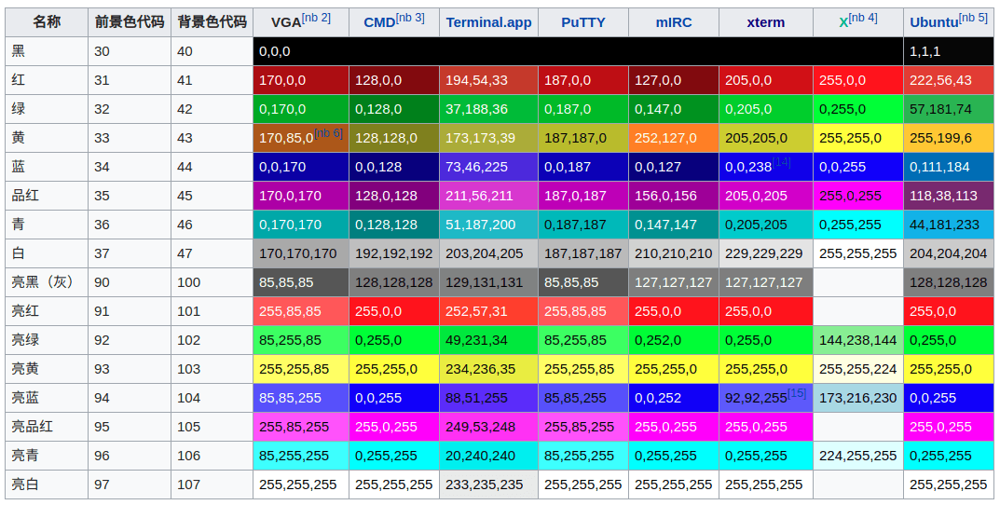
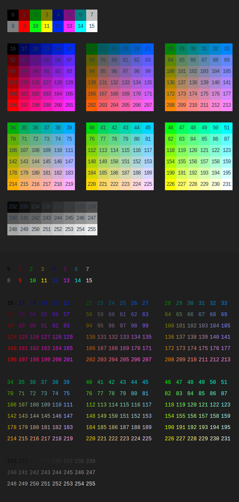

##	*C0*、*C1* 控制字符集

-	*C0*、*C1* 控制字符
	-	*ISO/IEC 2022* 定义的控制字符集
	-	*Unicode* 中控制字符码位兼容 *ISO/IEC 2022*，但
		-	仅对 *U+001C - U+001F*、*U+0009 - U+000D*、*U+0085* 限定语义
		-	其余控制字符语义对 *Unicode* 透明，留给高层协议

	> - <https://zh.wikipedia.org/wiki/C0%E4%B8%8EC1%E6%8E%A7%E5%88%B6%E5%AD%97%E7%AC%A6>

###	*C0* 控制字符集

-	*CO* 控制字符集码位范围：`0x00 - 0x1F`
	-	*ASCII* 中定义控制字符标准
	-	码位限定在 1byte 可以表示，避免终端机需要实现状态机处理多字节控制序列
	-	现只有少数控制字符被使用

-	*C0* 控制字符码位范围之外，还有定义有两个具备控制符特点的字符
	-	`0x7F`（*delete*）
	-	`0x20`（*space*）

###	*C1* 控制字符集

-	*C1* 控制字符集码位范围：`0x80 - 0x9F`
	-	8bits *ISO/IEC 8859 ASCII* 扩展提出后
		-	考虑到可打印字符的最高比特位去掉之后不应变成控制字符
		-	以 *C0* 控制字符集作为低位、最高位置 1，得到 *C1* 控制字符集
	-	*C1* 码位在经常被私有编码方案（*Windows-1252*、*Mac Os Roman*）用于提供额外的可打印字符

-	*ISO/IEC 8859 ASCII* 扩展标准中指定
	-	为兼容 7bits 传输，所有 *C1* 控制字符使用 `ESC` 开头的 7bits 字符序列表示

###	标准 *C* 转义规则

-	非打印（包括控制）字符可以通过其 *ASCII* 码位 16 进制、8 进制表示
	-	`\0[ooo]`：八进制数 `oo` 码位字符
	-	`\x[hh]`：十六进制数 `hh` 码位字符
		-	`\x0a`：同 `\n`
-	针对常用非打印字符，有如下简写方式
	-	`\\`：反斜杠 `\`
	-	`\'`：单引号 `'`
	-	`\"`：双引号 `"`
	-	`\a`：`BEL` *ASCII* 响铃
	-	`\b`：`BS` *ASCII*退格
	-	`\f`：`FF` *ASCII* 进纸
	-	`\n`：`LF`/`NL` *ASCII* 换行，开启新行
	-	`\r`：`CR` *ASCII* 回车，“指针移至行首”
	-	`\t`：`TAB` *ASCII* 制表符
	-	`\v`：`VT` 垂直制表符

##	*ANSI Escape Sequences*

*ANSI*：一种 *In-band Signaling* 的转义序列标准，用于控制终端上 **光标位置、颜色、其他选项**

-	在文本中嵌入的 *ANSI* 转义序列，终端会将 *ANSI* 转义序列解释为相应指令，而不是普通字符
	-	*ANSI* 转义序列使用 *ASCII* 中字符传递所有信息

-	*ANSI* 转义序列有不同长度，但都
	-	以 *ASCII* 字符 `ESC`（`0x1b`） 开头
		-	8 进制表示：`\033`
		-	16 进制表示：`\x1b`
	-	第二字节则是 `0x45 - 0x5F`（*ASCIIi* `@A-Z[\]^_`）范围内的字符

-	标准规定，在 8bits 环境中
	-	*ANSI* 转义序列前两个字节的序列可以合并为 `0x80 - 0x9F` 范围内的单个字节（即 *C1* 控制字符）
	-	但在现代设备上，*C1* 控制字符码位被用于其他目的，一般不被使用
		-	*UTF-8* 编码对 `x80` 字符本就需要 2bytes
		-	*Windows-1252* 编码将 *C1* 控制字符码位挪作他用

> - *C0* 控制字符输出有时也会产生与 *ANSI* 转义序列相近效果，如：`LF`、`ESC E`都有换行效果
> - <https://zh.wikipedia.org/wiki/ANSI%E8%BD%AC%E4%B9%89%E5%BA%8F%E5%88%97>
> - <https://www.gnu.org/software/screen/manual/html_node/Control-Sequences.html>

###	*No-CSI* - 非控制序列

|序列（省略 `ESC`）|对应 *C1*|名称|效果|
|-----|-----|-----|-----|
|`N`|`0x8E`|*SS2 - Single Shift 2*|从替代 *G2* 字符集中选择字符|
|`O`|`0x8F`|*SS3 - Single Shift 3*|从替代 *G3* 字符集中选择字符|
|`P`|`0x90`|*DCS - Device Control String*|控制设备|
|`D`|||仅换行，不重置光标至行首|
|`E`|||换行并充值光标至行首，类似`LF`|
|`H`|||制表，类似`TAB`|
|`M`|||翻转换行，回到上一行|
|`X`|`0x98`|*SOS - Start of String*|引用由 *ST* 终止的一串文本参数|
|`^`|`0x9E`|*PM - Privacy Message*|引用由 *ST* 终止的以穿文本参数|
|`_`|`0x9F`|*APC - Application Program Command*|引用由 *ST* 终止的一串文本参数|
|`c`|-|*RIS - Reset to Initial State*|类似`clear`命令|
|`[`|`0x9B`|*CSI - Control String Sequence*|控制序列导入器，某些终端中也可以使用`0x9D`|
|`\`|`0x9C`|*ST - String Terminator*|终止其他控件得字符串|
|`]`|`0x9D`|*OCS - Operating System Command*|启动操作系统使用的控制字符串|
|`%G`|||选择 *UTF8* 作为字符集|
|`#8`|||*DEC* 屏幕校准测试，使用`E`填充整个终端|

###	*Control Sequence Introducer*

控制序列导入器：`ESC[` + 若干参数字节 + 若干中间字节 + 一个最终字节

-	常见序列只是把参数用作一系列分号分隔的数字，如：`1;2;3`
	-	缺少的数字视为 0
	-	某些序列（*CUU*）把 0 视为 1，以使缺少参数情况下有意义

-	一部分字符定义“私有”，方便终端制造商插入私有序列
	-	参数字节 `<=>?` 的使用：`ESC[?25h`、`ESC[?251` 打开、关闭光标显示
	-	最终字节 `0x70 - 0x7F`

|组成部分|字符范围|ASCII字符|
|-----|-----|-----|
|参数字节|`0x30~0x3F`|`0-9:;<=>?`|
|中间字节|`0x20~0x2F`|` 、!"#$%&'()*+,-./`|
|最终字节|`0x40~0x7E`|`@A-Z[]^_a-z{}~`, \`|

####	光标移动

|序列内容|名称|效果|
|-----|-----|-----|
|`[n]A`/`[n]B`/`[n]C`/`[n]D`|*CU[UDFB] - Cursor Up/Down/Forward/Back*|光标移动`[n]`格，在屏幕边缘则无效|
|`[n]E`/`[n]F`|*Cursor Next Line/Previous Line*|光标移动至下`[n]`行/上`[n]`行开头|
|`[n]G`|*Cursor Horizontal Absolute*|光标移动到第`[n]`列|
|`[n;m]H`|*CUP - Cursor Position*|光标绝对位置|
|`[n;m]f`|*Horizontal Vertical Position*|同 *CUP*|
|`[n]J`|*Erase in Display*|清除屏幕部分区域：0 - 光标至末尾；1 - 开头至光标；2 - 整个屏幕|
|`[n]K`|*Erase in Line*|清除行内部分区域|
|`[n]S`|*Scroll Up*|整页向上滚动 `[n]` 行|
|`[n]T`|*Scroll Down*|整页向下滚动 `[n]` 行|
|`s`|*Save Cursor Position*|保存光标当前位置|
|`u`|*Restore Cursor Position*|恢复光标位置|

####	窗口

|序列内容|名称|效果|
|-----|-----|-----|
|`5i`|-|打开辅助端口，通常用于本地串行打印机|
|`4i`|-|关闭辅助端口，通常用于本地串行打印机|
|`6n`|*Device Status Report*|以 `ESC[n;m]R` 报告光标位置|

####	*Select Graphic Rendition*

-	*SGR* 选择图形再现：`ESC[<n>m`
	-	`n`：样式参数，多个参数用 `;` 分隔，缺省为 0
	-	`m`：结束字节

#####	样式

|设置值|显示效果|取消值|
|-----|-----|-----|
|0|所有属性值重置为默认值，用于取消对后续输出影响||
|1|高亮或粗体|22|
|2|半亮|22|
|4|下划线|24|
|5|闪烁|25|
|7|反显，前景、背景色交换|27|
|8|隐藏，前景、背景色相同，可能不支持|28|
|9|删除线|29|
|53|上划线|55|
|11-19|选择替代字体||

#####	3/4位色

|前景色值|背景色值|颜色|高亮前景色值|高亮背景色值|
|-----|-----|-----|-----|-----|-----|
|30|40|黑色|90|100|
|31|41|红色|91|101|
|32|42|绿色|92|102|
|33|43|黄色|93|103|
|34|44|蓝色|94|104|
|35|45|紫红色|95|105|
|36|46|青蓝色|96|106|
|37|47|白色|97|107|
|38|48|控制使用256位、RGB色|||
|39|49|默认颜色|||

> - 可通过反显 `7` 实现背景色、高亮 `1` 实现多高亮色

#####	8bits 色

-	8bits 色设置格式
	-	`ESC[38;5;37m`：设置256位前景色
	-	`ESC[48;5;37m`：设置256位背景色
-	预定义 8bits 色情况
	-	*0-7*：标准颜色，同 `ESC[30-37m`
	-	*8-15*：高强度颜色，同 `ESC[90-97m`
	-	*16-231*：`16 + 36*r + 6*g + b`（$0 leq r,g,b leq 5$ 得到 6 * 6 * 6 立方）
	-	*232-255*：24阶灰阶

#####	24bits 色

-	24bits 色设置格式
	-	`ESC[38;2;<r>;<g>;<b>m`：选择 *RGB* 前景色
	-	`ESC[48;2;<r>;<g>;<b>m`：选择 *RGB* 辈景色

-	字符内容体系结构有一个不太受支持的替代版本
	-	`ESC[38:2:<Color-Space-ID>:<r>:<g>:<b>:<unused>:<CS tolerance>:<Color-Space: 0="CIELUV";1="CIELAB">m`：选择 *RGB* 前景色
	-	`ESC[48:2:<Color-Space-ID>:<r>:<g>:<b>:<unused>:<CS tolerance>:<Color-Space: 0="CIELUV";1="CIELAB">m`：选择 *RGB* 背景色

> - 支持 `libvte` 的终端上支持 *ISO-8613-3* 的 24bits 前景色、背景色设置，如 *Xterm*、*Konsole*
> - 24bits 色的替代版本是 *ISO/IEC 8613-6* 采用的 *ITU* 的 *T.416* 信息技术

