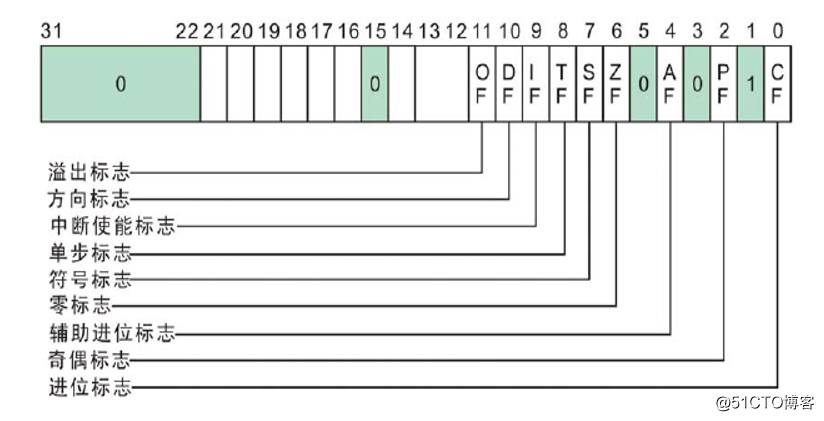

##	数值存储

> - 机器数：数在计算机中二进制表示形式，带符号
> - 真值：考虑表示规则，机器数二进制表示的真实数值

-	大小端
	-	*big-little endian*大小端：高位**byte**在低位**byte**前
		-	更适合人理解
	-	*little-big endian*小大端：低位**byte**在高位**byte**前
		-	更适合计算机计算，大部分计算机架构
		-	方便截断操作

-	符号（有符号数）：大部分（静态）语言使用最高位表示符号
	-	`0`：正数
	-	`1`：负数

	> -	动态语言如 *python* 的整形不对应定长数据类型，存储逻辑和 *cpp/c* 等语言相差较大

###	整形

> - 模：衡量计数系统容量的参数，代表了计数系统能表示、存储的状态数

####	原码、反码、补码

-	*sign and magnitude* 原码：二进制位表示数值本身
	-	需要额外符号位标识正负
-	*ones' complement* 反码：二进制位为真值对计数系统最大值求补
	-	*one*：表示有限位计数系统能表示的最大值，即二进制位全为 `1`
		-	符号位不仅标识正负值，且可作为数值位参与运算
		-	但不是对模求补
			-	存在 `+0/-0` 问题
			-	运算结果和实际结果相差 1
	-	考虑到二进制位全 `1` 性质
		-	正数：反码即为其原码
		-	负数：反码为原码符号位不变，数值位取反（因此被称反码）
-	*twos' complement* 补码：二进制位为真值对计数系统模求补
	-	*two*：表示有限位计数系统容量，即溢出 `1`、二进制位全为 `0`
		-	符号位不仅标识正负值，且可作为数值位参与运算
		-	考虑到是对模求补
			-	`-0` 表最大负值，不存在 `+0/-0` 问题
			-	运算结果和实际结果相同
	-	将有限位计数系统视为加法封闭群
		-	系统中各元素是有序的，为保证加法计算，则最大正值之后必然为最大负值
		-	正、负值可视为是对群元素的人为划分
		-	可以任意值作为划分，但二进制位计算真值复杂
	-	考虑到二进制位全 `0` 性质
		-	正数：补码即为其原码
		-	负数：补码为反码 `+1`（原码也为补码数值位求反后 `+1`）

###	浮点型

> - 遵循 *IEEE 754* 标准的系统必须支持单精度，最好支持双精度，对扩展精度则无要求

||长度|符号位|指数/阶码|尾数|有效位数|指数偏移/偏阶|
|-----|-----|-----|-----|-----|-----|-----|
|单精度|32bits|1bit|8bits|23bits|23bits|127（规格化）/126（非规格化）|
|双精度|64bits|1bit|11bits|52bits|53bits|1023（规格化）/1022（非规格化）|
|扩展精度|80bits|1bit|15bits|64bits|64bits|16383|

$$\begin{align*}
N &= (-1)^F * 2^{E - 127} * (1 + F), & 规格化数 \\
N &= (-1)^F * 2^{-126} * F, & 非规格化数 \\
\end{align*}$$

-	符号位：数值整体正负号
-	指数/阶码：数值小数点位置，也即数值放缩
	-	阶码部分没有单独的符号位，为表示负值，则需要规定指数偏移，将
		阶码减去偏移量得到实际指数值
	-	指数偏移被设置为 $2^{E-1} - 1$ 好处
		-	对称正负取值范围
		-	首位即可判断浮点值和 1 关系
-	尾数：数值精确程度
	-	根据 *IEEE 754*，**规格化值**尾数首位（整数位）必须为 `1`
		-	规格化值的尾数值必然大于 1
		-	单、双精度可以省略对首位的存储，有效位数比尾数长度多 1
		-	扩展精度不区分是否为规格化值
	-	（单、双精度）**非规格化**值首位为 `0`，同样省略
		-	非规格化值允许尾数部分小于 1，扩展浮点数对小值的表示
		-	所以，非规格化值阶数部分必然（规定）全为 `0`
		-	非规格化值指数偏移量比规格化值小 1，可缩小最小规格化值与最大非规格化值间距
-	特殊浮点值
	-	指数值全 `1`、尾数非 0：`NaN`
	-	指数值全 `1`、尾数为 0：正、负无穷

> - 事实上指数底数可以是任意值，但 *IEEE 754* 标准规定底数为 `2`

##	32bits X86 寄存器

-	通用寄存器：兼容 8bits、16bits 架构
	-	`eax`：*Accumulator* 累加器
		-	可作为加法、乘法指令的缺省寄存器
		-	存放函数返回值
	-	`ecx`：*Counter* 计数器
		-	`rep`、`loop` 指令的默认计数器
	-	`edx`：*Data* 数据
		-	存放整数除法产生的余数
	-	`ebx`：基址寄存器
	-	`ebp`：*Base Pointer* 堆栈基指针，指向栈底
	-	`esp`：*Stack Pointer* 堆栈指针，指向栈顶
	-	`esi`、`edi`：*Source Index* 源变址、*Destination Index* 目标变址
		-	字符串操作指令中，`ds:esi` 指向源字符串，`es:edi` 指向目标字符串

-	`eflags` 寄存器：标志位寄存器
	-	`CF` *Carry Flag*：进位标志，无符号数运算结果溢出（最高位产生进位、借位），置 1
	-	`PF` *Parity Flag*：奇偶标志，运算结果中 `1` 数量为偶数，置 1
	-	`AF` *Auxiliary Carry Flag*：辅助进位标志
	-	`ZF` *Zero Flag*：零标志，指令执行结果为 0，置 1
	-	`SF` *Sign Flag*：正负标志位，有符号数执行结果为负，置 1
	-	`OF` *Overflow Flag*：溢出标志，有符号数运算结果溢出，置 1
	-	`DF` *Direction Flag*：方向标志，控制字符串指令方向
		-	`DF=1` 时：`esi`、`edi` 递减，高地址向低地址方向处理字符串
	

