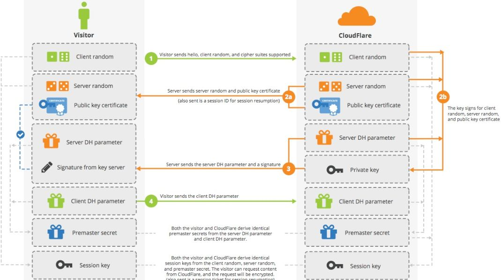

##	*Secure Shell*

-	*SSH* 安全外壳协议：创建在应用层、传输层上的安全协议，为 Shell 提供安全的传输、使用环境
	-	*SSH* 使用标准客户端-服务器模型
		-	标准端口是 22
		-	服务器端需要开启 `sshd` 守护进程接受连接
	-	*SSH* 是目前较为可靠，专为远程登录会话和其他网络服务提供安全性的协议
		-	防止远程管理过程中的信息泄露
		-	可以压缩数据，加快传输速度

> - *openSHH* 是最广泛应用的 *SSH* 实现

###	*SSH* 协议工作过程

-	连接建立：客户端向服务器端发起 *TCP* 连接，三次握手
-	协议协商：双方互发支持的 *SSH* 版本信息，选择较小版本
-	算法协商：双方互发支持的算法列表，确定使用的算法
-	密钥交换：利用协商好的密钥交换算法生成、交换数据加解密密钥
-	用户认证
	-	密码认证：通过前述加密通道传输
	-	公钥认证：需要提前将客户端公钥存储至 `authorized_keys` 文件中
-	服务请求：客户端向服务器端发起请求，请求服务器提供某种应用
	-	客户端发送 `SSH_MSG_CHANNEL_OPEN`，请求与服务器建立会话通道，即 session
	-	服务器端收到消息后，若支持该通道类型，则回复 `SSH_MSG_CHANNEL_OPEN_CONFIRMATION`，建立会话通道
	-	会话通道建立后，客户端可以申请 shell、subsystem 类型的会话，对应 *SSH*、*SFTP* 类型的服务
-	数据传输、连接关闭

##	*Transport Layer Security* / *Secure Sockets Layer*

-	*TLS*/*SSL*：为网络通信提供安全、数据完整性保障的安全协议

> - *SSL* 是 *TSL* 前身，但现在很多场合仍然使用 *SSL* 代指 *TSL*

###	*TLS* 协议工作流程

-	客户端发送 *ClientHello*，包含协议版本、加密算法、*Client Random* 到服务器端
-	服务器端返回 *ServerHello*，包含公钥、证书、*Server Random*
-	客户端使用 *CA* 证书验证服务器返回证书无误后，生成 *Premaster Secret*
	-	*Premaster Secret* 用公钥加密后发送给服务器端
	-	结合 *Client Random*、*Server Random*、*Premaster Secret* 生成对称密钥
-	服务器端用私钥解密得到 *Premaster Secret*
	-	结合 *Client Random*、*Server Random*、*Premaster Secret* 生成对称密钥
	-	用对称密钥加

##	*Certificate*、*Certificate Authority*

-	*CA* 数字证书认证机构：负责发放、管理数字证书的权威机构，承担公钥体系中公钥合法性检验责任的受信任第三方
	-	*CA* 本质就是两对（非对称）密钥，分别负责（私钥）签发用户证书、服务器证书
		-	任何个体都可以作为自签证书的 *CA*，但不权威、不被信任
		-	理论上可以用一对密钥同时签发，但是实操中不灵活、不安全
	-	客户端将信任的 *CA* 的根证书（公钥）存储在本地
		-	根证书是 *CA* 自己的证书，是证书链的开头
		-	根证书没有机构为其签名，都是自签名证书
		-	*CA* 会通过 *intermediate-certificate* 替代根证书签名，保证根证书私钥绝对不可访问

-	证书包含信息
	-	明文信息：现实中，真正 *CA* 需要通过线上、线下渠道验证信息真实性
		-	申请者公钥
		-	申请者组织信息、个人信息
		-	*CA* 信息
		-	有效时间
		-	证书序列号
	-	密文签名
		-	计算上述公开信息摘要
		-	*CA* 私钥加密信息摘要得到密文即为签名

-	证书信任链
	-	客户端得到服务器端返回的证书，读取得到服务器端证书发布机构
	-	客户端查找发布机构证书，非根证书就递归直到获取根证书
	-	回溯解密证书合法性

###	证书工作流程

-	验证流程
	-	客户端 C 向服务器端 S 发送请求，S 返回证书文件
	-	客户端 C 读取证书明文信息
		-	采用相同的摘要函数计算信息摘要
		-	利用 *CA* 公钥解密签名数据，与摘要函数结果对比，一致则可确认证书合法性
	-	客户端 C 验证明文信息是否与预期符合

