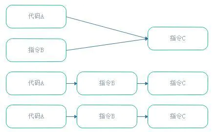
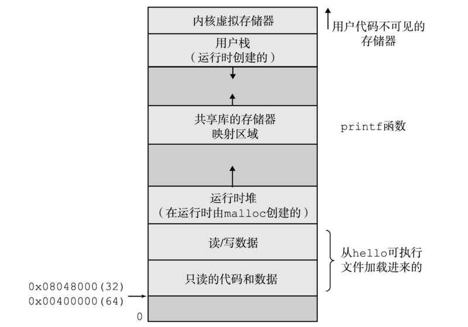
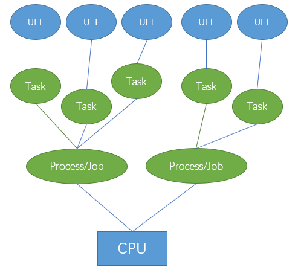
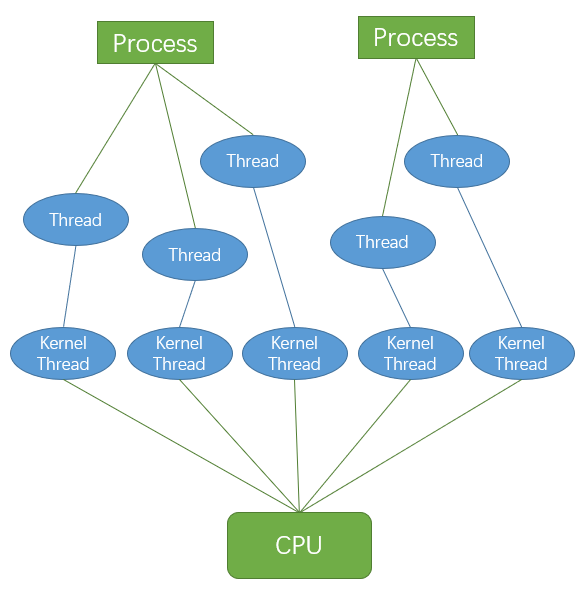
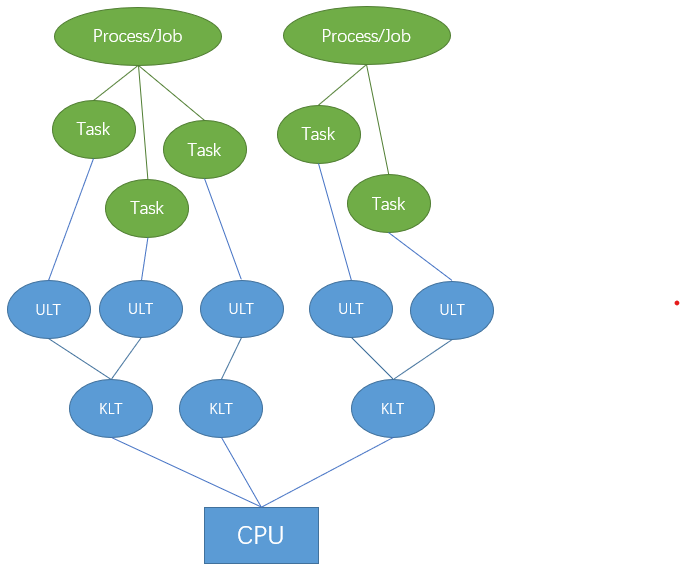

##	并发和并行

> - *Parallel*：并行，**同时做**多件事情，关于执行、实现
> - *Concurrent*：并发，**能够处理**多件事情，关于结构、逻辑

-	并发问题可以使用并行方式解决，也可以串行解决
	-	100并发任务同时运行在4核CPU上，最多可能有4个并发任务
		并行处理，其余只能是串行处理

-	并行角度：硬件技术的**物理限制瓶颈**
	-	单计算核心能力不足，所以需要多核并行运算
	-	进程、线程可认为是实现并行的基本逻辑实体

-	并发角度：程序执行的**逻辑重用需求**
	-	程序要求重用一组逻辑，所以需要将一组指令集打包，重复
		调用该组指令集
	-	子程序、协程可认为是方便重用的基本逻辑实体，因此更
		应是语言内建机制
		-	子程序：无状态保存，同样重入得到同样结果
		-	协程：有保存状态，重入会改变协程状态，结果可能
			不同

-	线程作为任务执行的实体，可以认为是子程序、协程的具体执行
	-	内核线程作为可以独立执行的实体，逻辑上更会被设计为
		完成独立任务，即没有保存状态需求，因此多是子程序的
		具体执行
	-	用户线程则用程序负责调度，二者执行实例均可
	-	某种意义上线程、子程序是对应的执行实体、逻辑实体

##	子程序、协程

-	子程序可以看作时协程的特例
	-	只有一个状态，每次进入时局部状态重置
	-	唯一入口点
-	协程可视为子程序的组成
	-	维护自身状态，所以**逻辑上不独立** ，应该是作为被
		调用对象
	-	对于每次返回部分结果值的协程（也称生成器迭代器），
		可以直接视为类似链表之类的数据结构
		（在某些语言中可以所有数据都是类，从这个角度这也都是
		统一的）

||子程序|协程|
|-----|-----|-----|
|生命周期|后进先出|完全取决于需要|
|入口点|起始处|起始处、`yield`返回出口点|
|返回值|调用结束后返回全部|可每次`yield`返回部分值|

> - 现代指令集通常提供对调用栈的指令支持，便于实现可递归
	调用的子程序，在提供续体的语言环境（如*Scheme*），恰好
	可用此抽象状态表示实现协程

###	*Subroutine*/*Procedure*/*Function*/*Routine*/*Method*

子程序：打包为整体、用于执行特定任务的指令集序列

-	子程序是依赖可重入能力的弱化版本
	-	一旦唤醒，于起始点开始执行
	-	一旦退出，子程序结束
	-	子程序实例只返回一次，两次激活间不保存状态

-	子程序中局部变量在每次**调用/重入**函数时都是相同的
	-	**相同输入得到相同输出**

> - *procedure*：过程，有时特指无返回值、仅有副作用

####	线程安全

线程安全：子程序在多线程环境调用时，能够正确处理多个线程之间
的共享变量，使程序功能能正确完成

-	线程安全函数应该为每个调用其的线程分配专门空间，存储需要
	单独保存的状态

-	*Atomicity*：原子性，操作不会被线程调度机制打断，一旦
	开始就会运行到结束，中间不会有任何线程切换
	-	可以通过*lock*、*synchronized*确保原子性
-	*Visibility*：可见性，某线程修改变量值后，其他线程能够
	立刻感知
	-	一般可以通过`volatile`保证可见性，强制要求被修改值
		从寄存器同步至主存
	-	*lock*、*synchronized*也可以通过限制其他线程访问变量
		的方式保证可见性
-	*Ordering*：有序性/一致性，程序按照代码顺序执行
	-	可以通过`volatile`保证一定的有序性
	-	也可通过*lock*、*synchronized*提供单线程执行环境保证
		有序性

####	Instruction Reorder

指令重排：编译器对无相互依赖的指令重新排序执行

-	`as-if-serial`语义：指令可以为优化而重排序，但是必须保证
	最终执行结果不变
	-	规则：重排序过程不破坏数据依赖关系
	-	只能保证单线程执行结果有效，但不保证多线程并发执行
		的正确性

	

-	`happens-before`原则：保证前后两个操作间不会被重排序，
	-	程序次序规则：线程中每个操作*happens-before*该线程中
		任意后续操作
	-	锁定规则：锁的解锁*happens-before*加锁
	-	volatile变量规则：volatile变量写操作*happens-before*
		其读操作
	-	传递规则：若A *happens-before* B、B *happens-before*
		C，则A *happens-before* C
	-	线程启动规则：线程对象启动*happens-before*线程中每个
		动作
	-	线程中断规则：线程中断方法的调用*happens-before*被
		中断线程代码检测到的中断事件的发生
	-	线程终结规则：线程中所有操作*happens-before*线程的
		终止检测
	-	对象终结规则：对象的初始化*happens-before*其*final*
		方法的开始

> - *happens-before*原则被JVM用于规定（跨线程）操作之间偏序
	关系，若操作之间的关系可以由此原则退出，则两个操作有序

####	*Reentrant*

> - A computer program or routine is described as reentrant
	if it can be safely executed concorrently; that is, the
	routine can be re-entered while it is already running

可重入函数：对于相同（合法）的函数参数，多次重复调用（包括
执行过程中被中断再重入）结果总是可预期的

-	可重入需要满足条件
	-	不在函数内部使用静态或全局数据，所有数据都由函数
		调用者提供
		-	全局变量区
		-	中断向量表
	-	使用本地数据，或制作全局数据的本地拷贝保护全局数据
	-	不返回静态或全局数据
	-	不调用不可重入函数

-	不可重入后果主要体现在信号处理函数这样需要重入情况中，
	若在信号处理函数中使用了不可重入函数，则可能导致程序错误

-	可重入函数总是线程安全的，反之不一定成立
	-	线程安全可以通过“并发不冲突”实现
	-	可重入则要求“并行不冲突”

###	*Coroutine*

协程：为**非抢占式**多任务产生子程序的程序组件，允许执行过程
中挂起、恢复

-	挂起、恢复：协程可以通过`yield`（让步）调用其他协程暂时
	退出，之后可在退出位置恢复执行

	-	从协程角度看，这是调用其他协程而不是退出
	-	但实际是**各协程之间是对称的**，而不像子程序调用
		中主调-被调关系
	-	这即暗含
		-	协程可包含多个入口点
		-	允许在不同入口点暂停、开始执行程序

-	局部状态维护：协程实例保持上次退出时状态

	-	则协程被唤醒时状态可能不同
	-	可能同时有多个给定协程实例

> - 协程将原在子程序外、输入状态管理工作交由自身逻辑维护
> - 原生不支持协程的语言也可以使用循环等构建
> - 经典状态机、对象已经具有协程特性

####	用途

-	协程可以简化异步代码的实现，使得需要使用异步+回调的代码
	可以使用看似同步方式写出
	-	协程本身只涉及**状态保存、过程重入**，和并发/异步无关系
	-	但协程本身蕴含的状态保存使得状态切换几乎无成本，适合
		高并发任务

-	协程在线程中调度完全由用户控制，可以视为用户态轻量级线程
	-	避免陷入**无效内核级别上下文切换**造成的性能损失
	-	较线程在IO密集任务上性能上更好

##	进程、线程

> - 这里仅讨论理论上的异同，不考虑各平台具体实现

-	进程：具有独立功能的程序关于某数据集合的一次运行活动
-	线程/子程序：进程内某特定任务的执行活动
-	协程：推广协作式多任务的子程序

||Process|Thread|Coroutine|
|-----|-----|-----|-----|
|调度、创建、切换、维护|内核（系统）|内核、自身|自身|
|切换开销、速度|大、慢|小、快|无|
|易用性|需要考虑进程退出、僵尸进程|只需要管理进程即可|无需管理|
|资源共享|独立|同进程内线程共享资源|除局部变量外均共享|
|通信|IPC较复杂：环境变量、文件、系统端口|较简单：共享内存|结果调用|
|移植性|差|好|好|
|健壮性|好，进程死亡不影响其他进程|差，线程死亡会导致进程（及线程）死亡|

-	进程、线程、协程可以看作是控制权逐渐从系统已经移交到自身
	的过程

> - 这里的协程强调其在实现方面的资源、调度特点，其与子程序间
	功能差异参加*cs_program/parallel/implementation*
> - 通信：参见*cs_program/parallel/#todo*
> - 移植性：基于进程分支多进程和windows模型有很大冲突，往往
	不能在windows平台上使用

###	*Process*

进程：具有独立功能的程序关于某数据集合的一次运行活动

-	进程是处于运行期的程序和相关资源的总称
	-	程序：代码、指令
	-	运行：对CPU的占用，逐渐发展为线程，标识进程中指令的执行
	-	资源：执行上下文，由进程内线程共享

-	从系统调度方面看
	-	进程是系统进行**资源分配、调度的独立单位**
	-	在系统中有进程控制块（进程描述符）描述进程相关信息，
		系统通过此控制块控制系统相关行为

-	从资源分配方面看
	-	有独立的存储空间（虚拟寻址空间）
		-	独享的用户空间
		-	进程专用的“共享内核空间”
	-	可执行的程序代码

> - 线程可能对系统是可感知的，则进程不定是资源分配的基本
	单位
> - Linux线程实现即类似进程，但不包含独立存储空间

####	调度角度

-	内核跟踪进程运行所需的状态信息（上下文）
	-	主存、虚拟内存内容
	-	寄存器文件值
	-	栈
	-	文件句柄

-	调度：分配CPU执行进程
	-	内核决定CPU控制权在进程间的转移

-	上下文切换：进程状态的记录、恢复、切换
	-	保存当前进程上下文、恢复新进程上下文
	-	通过处理器在进程间切换，实现单个CPU“看似”并发执行
		多个进程
	-	上下文进程间切换开销比较大，但相对比较稳定安全

####	资源角度

> - 独立内存空间/虚拟地址空间：每个进程**“独占的”**使用
	内存、看到一致的存储器



-	用户空间
	-	程序代码、数据：对所有进程，代码从同一固定位置开始，
		直接按照可执行目标文件的内容初始化
	-	（运行时）堆：可在运行时动态扩展、收缩
	-	共享库：共享库代码和数据，如：C标准库、数学库
	-	栈：用于实现函数调用，运行时动态扩展、收缩，位于虚拟
		地址空间顶部

-	内核空间
	-	内核虚拟存储器：内核总是驻留在内存中，为其保留地址
		空间顶部
	-	不允许程序读写区域内容或直接调用内核代码定义的函数

###	*Thread*

线程：进程执行实体，进程中包含指令的执行活动

####	调度角度

> - 线程是CPU调度、分派的基本单位，有时被称为轻量级进程
	（在Linux系统中也是按照轻量级进程实现）

-	线程引入逻辑
	-	进程内部可能存在多个不同task，task需要共享进程数据
	-	同时task操作的数据具有独立性，多个task不需要按照时序
		执行
	-	task间需根据不同策略进行调度，因此产生了线程概念，
		并被引入作为内核调度基本单位

-	线程：比进程更小的、能独立运行的基本单位
	-	线程能/是“独立运行”，但不一定能被内核感知到，也一定由
		内核调度
	-	只能说线程是针对某个task的执行活动

####	资源角度


-	线程运行在进程的上下文中，共享同样代码和全局数据
	-	进程代码段、公有数据
	-	进程打开的文件描述符、信号的处理器
	-	进程当前目录
	-	进程用户ID、进程组ID

-	线程还独享某些个性以实现并发性
	-	线程ID：进程中唯一标识
	-	寄存器组值：线程间并发运行，线程有不同运行线索，
		切换时需要保存当前线程的寄存器集合状态
	-	线程堆栈：独立函数堆栈保证线程内函数调用可以正常
		执行，不受其他线程影响
	-	错误返回码：线程的系统调用错误可能未及时处理，独立
		错误返回码避免其被其他线程修改
	-	线程的信号屏蔽码：线程感兴趣的信号不同，因此信号
		屏蔽码应由自己管理
	-	线程优先级：线程需要像进程被调度，需要有相应的优先级

##	线程实现理论

###	*User-Level Thread*

用户级线程：由用户程序自身负责支持、调度

-	特点
	-	相当于实现自己的线程调度内核，实现线程数据结构、
		创建、销毁、调度维护
	-	线程运行在内核（可感知的）进程内

-	优点
	-	即使系统不支持线程，也可通过库函数支持在系统中实现
		真实的多线程
	-	线程只在用户态，减少内核态到用户态切换开销

-	缺点：线程对系统透明，对系统每个进程只有一个线程，
	系统直接调用进程
	-	当线程进行系统调用而阻塞时，系统会阻塞整个进程
	-	用户空间没有时钟中断机制，若线程长时间不释放CPU，
		会导致阻塞其他线程

###	*Kernel-Level Thread*

内核级线程：系统内核支持的线程，通过内核完成线程切换

-	优点/特点：系统负责线程的创建、销毁、调度、维护
	-	内核通过操纵调度器对线程进行调度，并负责将线程
		的任务映射到各个处理器上
	-	程序可以直接使用系统调用已实现线程，无需实现线程
		调度、对CPU资源抢占使用

-	缺点：内核线程需要内核支持
	-	创建、销毁、调度、维护往往都需要系统调用，代价较高
	-	需要消耗内核资源，不能大量创建

###	线程调度模型

> - `X对Y`是指`X` task对应`Y`内核调度单位

####	N对1模型



N对1模型：线程库有实现用户级线程，内核未实现内核级线程

-	系统只负责调用进程
-	线程对系统透明，由进程自身负责调用

> - 此模型中内核没有实现内核级线程，所以内核调度单位就是进程
S
####	1对1模型



1对1模型：线程库未实现用户级线程，内核实现有内核线程

-	程序（逻辑）层面
	-	创建执行独立task的线程
	-	程序创建的线程直接由内核负责调度

-	内核（实现）层面
	-	每次创建线程都是调用系统调用创建内核级线程
	-	可视为每个“用户创建的线程”同内核级线程绑定，二者一一
		对应

> - 此模型中内核调度单位就是内核级线程
> - 此模型中不存在上述定义的用户级线程，图中*Thread*实际上
	应该就是*Kernel Thread*，仅拆分出来表示是程序创建的线程

####	M对N模型



M对N模型：线程库实现有用户级线程，系统也实现有内核级线程

-	程序（逻辑）层面
	-	创建执行独立task的**用户级线程**
	-	创建可独立被内核调度的**内核级线程**
	-	将若干和用户线程同内核线程相关联，即task组总体由内核
		负责调度，task组内task由程序自身负责调度

-	内核（实现）层面
	-	调用系统调用创建内核级线程
	-	内核线程执行指令中包含用户线程创建、调度指令

-	优点
	-	用户级线程创建、切换、析构等均在用户空间中，依然
		廉价，支持大规模用户线程并发
	-	内核级线程作为用户线程在内核中调度、执行的桥梁，
		降低整个进程被完全阻塞的风险

> - 此模型中内核调度单位为内核级线程、task单位为用户线程，
	二者比例不定
> - 有的说法里面会使用*Light Weighted Process*表示内核级线程

##	通用调度算法

-	耗时相差不大的task队列总是比较好处理，难以调度的task是
	-	耗时相差大
	-	IO任务、计算任务混合

-	内核调度除考虑任务（线程）外，还会考虑进程因素
	-	*Gang Scheduling*：尽量将同进程中线程同时调度，而非
		随机从多个进程中挑选CPU数量线程调度
	-	*Space Sharing*：将CPU划分，各进程仅允许占用部分CPU
		执行并发

-	从任务角度，调度需要考虑
	-	Responsiveness
	-	Schedule Overload
	-	Starvation-Freedom：饥饿避免
	-	Fairness

###	First-In-First-Out

先进先出：按task在队列中的顺序依次调用，执行完task再执行下个
task，仅在task结束后才会切换task

-	优点
	-	最少task切换开销
	-	最大吞吐量（总处理效率）
	-	朴实公平

-	缺点
	-	平均相应时间高

###	Shortest task First/Shortest Remained Time task

最短耗时task优先：有限调度耗时短task

-	优点
	-	平均相应时间短：长耗时task不断推移，必然统计出较短
		平均响应时间

-	缺点
	-	不公平，长耗时task难被调度，容易饥饿
	-	频繁task切换，调度额外开销大

###	Round Robin

时间片轮转：给队列中每个task时间片，时间片结束之后task移至
队列末尾，切换到执行下个task

-	优点
	-	每个task可以得到公平调度
	-	耗时短task即使在耗时长task之后也可以较快得到执行

-	缺点
	-	task切换引起的调度开销大，需要多次切换task上下文
	-	时间片不好设置
		-	时间片足够小则退化为SFJ
		-	时间片足够大则退化为FIFO
	-	需要知道task（剩余）执行时间

###	(Weighted) Max-Min Fairness

（带权重的）最大最小公平：资源按照需求递增的顺序分配，不存在
需求得到资源超过自身需求，未得到满足得到需求等价分享资源

-	具体方案
	-	每轮开始将资源按照权重分配
	-	若需求大于被分配资源则推迟执行，进入下轮
	-	若需求小于被分配资源则执行，并将多余资源继续按照权重
		分配给无法执行资源

###	Multi-level Feedback Queue

多级反馈队列：监控task处理耗时，若task未用尽分配资源则提高
优先级，否则降低其优先级

-	具体方案
	-	task、分片时长具有相对应的不同优先级
		-	分片时长越长优先级越低
		-	高级优先级task可以抢占低优先级task
		-	新task位于高优先级task
	-	同一优先级task使用*Round Robin*
		（事实上仅有最低优先级task使用*Round Robin*算法，
		其他优先级都是FIFO）
		-	时间片用完后task结束则正常退出系统，否则优先级
			下滑一等级
		-	若是主动让出CPU（IO等），则停留在当前优先级或
			提升

-	多核场景
	-	应该为每个CPU分配单独MFQ，同时采用
		*Affinity Scheduling*保证task尽量同一CPU核上执行，
		避免CPU cache频繁失效
	-	若共用MFQ，则容易出现
		-	随CPU增长，对MFQ锁争抢严重
		-	task每次执行位于的CPU不同，CPU Cache需要在不同
			CPU间转移

##	同步问题

###	生产者-消费者问题/缓存绑定问题

> - 生产者生成数据放入缓存，消费者从缓存获取、移除、消费数据
	，问题核心在于保证不让生产者在缓存已满时放入数据、不让
	消费者在缓存为空时读取数据

-	若缓存满：生产者者停止工作
-	若缓存空：消费者停止消费
-	消费者从缓存中取走数据，通知生产者工作
-	生产者向缓存中放入数据，通知消费者消费

> - 不完善的解决方案会造成死锁：生产者、消费者均等待对方唤醒

####	信号量解决方案

> - `mutex`信号量：互斥信号量，确保只有一个生产者、消费者
	操作缓存区，单一消费者、生产者可省略此信号量
> - `fill_count`信号量：已使用缓存区数量
> - `empty_count`信号量：空闲缓存区数量

```c
semaphore mutex = 1
semaphore fill_count = 0
semaphore empty_count = BUFFER_SIZE

producer():
	while true:
		item = produce_item()
		down(empty_count)
		down(mutex)
		put_item_into_buffer(item)
		up(mutex)
		up(fillcount)

consumer():
	while true:
		down(fill_count)
		down(mutex)
		item = remove_item_from_buffer()
		up(mutex)
		up(empty_count)
		consume_item(item)
```

####	状态监控解决方案

```c
item_count = 0
condition full
condition empty

add(item):
	while item_count == BUFFER_SIZE:
		wait(full)

	item_count = item_count + 1
	put_item_into_buffer(item)

	if item_count == 1:
		notify(empty)

remove():
	while item_count == 0:
		wait(empty)

	item_count = item_count - 1
	item = remove_item_from_buffer()

	if item_count == BUFFER_SIZE - 1:
		notify(full)

produer():
	while true:
		item = produce_item()
		add(item)

consumer():
	while true:
		item = remove()
		consume_item(item)
```

-	互斥信号没有保护关键区，监控方法更好

####	其他

-	协调生产者、消费者的关闭

	-	可在在队列中放置特殊的值，消费者读到时终止执行，结束
		消费者线程
	-	有多个消费者时，消费者读取特殊值之后可将特殊值放回
		队列中继续传递，直至关闭所有消费者

###	哲学家就餐问题

> - 哲学家围坐在圆桌旁，只能吃饭**或者**思考，每两个哲学家
	之间只有一根筷子，只有同时拿到左右两根筷子才能正常吃饭

-	实际计算机问题中，筷子视为共享资源

####	服务生

> - 引入服务生判断资源是否能被获取

-	引入服务生，哲学家必须经过其允许才能拿起筷子

-	服务生知道有哪些筷子正在被使用，能够判断是否会死锁

####	资源分级

> - 为资源（筷子）分配偏序关系
> > -	约定所有资源都按此偏序获取、相反顺序释放
> > -	且保证不会有无关资源同时被同一工作获取

-	哲学家只能拿左右侧筷子：不会有无关资源被同一工作获取

-	将筷子按顺序编号：资源分配偏序关系
	-	哲学家只能先拿左右筷子中编号较小者
	-	哲学家需要先放下筷子中编号较大者

> - 最实用的解法：为锁指定常量分级，强制获取顺序的顺序
> - 策略不总是实用的，尤其是所需资源列表事先不知道，可能需要
	先释放已获取资源、获取低编号资源、重新获取资源，效率不高

####	Chandy/Misra解法

> - 标记资源，保留未使用资源、交出已使用资源，初始所以资源
	已使用

-	每根筷子分为干净、脏，最初所有筷子都脏

-	对每对竞争同一筷子的哲学家，新拿筷子给编号较低者

-	当哲学家需要某筷子时
	-	向其竞争对手发送请求
	-	拥有筷子的哲学家收到请求
		-	若筷子干净则保留
		-	否则擦干净交出

-	哲学家吃完东西后，筷子变脏
	-	若有哲学家之前请求过该筷子，擦干净交出

> - 有很大并行性，适合任意大问题

###	读者-写者问题

> - 多线程同时访问共享内存地址，线程写入时其他线程不能读取、
	写入，多个线程可以同时读取

-	一般使用*readers-writer lock*解决问题

####	读者优先

-	若共享内存被读取，其他读者可以立即、同时读取
-	若一直有读者开始读取，则写者会一直被插队、无法修改

####	写者优先

-	如果写者在排队，应该尽快写入共享内存
-	若一直有写者准备写入，则读者会一直被插队、无法读取

####	限定时间

-	共享内存区的锁定权要在限定时间内结束
-	能避免读者、写者一直排队

###	熟睡的理发师问题

> - 理发店只有一名理发师、一张理发时坐的椅子、若干普通椅子
	供顾客等待
> > -	没有顾客时理发师在理发椅子上睡觉，顾客到达后离开、
		或者叫醒理发师
> > -	有顾客时，理发师为别人立法，顾客达到后若有空闲普通
		椅子则坐下休息、否则离开
> > -	理完发后，任选顾客开始理发

-	理发师等待顾客、顾客等待理发师，造成死锁
-	有顾客不按顺序等待，让某些顾客永远不能理发

####	3信标解决

```c
semaphore customer = 0
semaphore barber = 0
semaphore mutex = 1
empty_chairs = BUFFER_SIZE

barber():
	while true:
		if empty_chairs == BUFFER_SIZE:
			sleep()

		down(mutex)
		item = get_customer_from_chairs()
		empty_chairs += 1
		up(mutex)

		down(barber)
		cut_hair(item)
		up(barber)

customer():
	while true:
		down(mutex)
		if empty_chairs > 0:
			empty_chairs -= 1

		else:
			wait() or leave()

		up(mutex)
```

###	三个烟鬼问题

> - 香烟需要：烟草、卷烟纸、火柴，三个烟鬼分别有无限各一种，
	不吸烟协调人会随机安排两个烟鬼各拿出一份材料放在桌上，
	另外一个烟鬼拿到材料卷烟、抽
> > -	桌上空了后，协调人就随机要求烟鬼拿出材料
> > -	烟鬼只会在抽完手中烟后才会卷另一只
> > -	若烟草、卷烟纸在桌上，有火柴的烟鬼在吸烟，直到该烟鬼
		吸完烟拿走桌上材料才会继续

-	问题模拟程序中4种角色，展示信标方法作用有限

