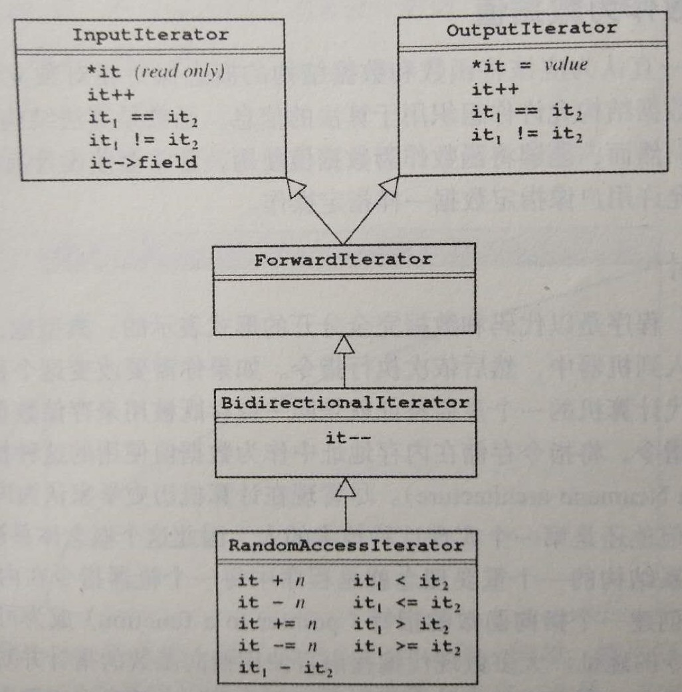

#	类

##	*class*

类：包含值、相应操作集的模板，将相关信息片段组织成复合值，
使得可以整体对其进行操作

###	概念

####	实体

-	*object*：对象，属于一个类的所有值

-	*instance*：实例，单个对象

-	*field*/*instance variable*：域/实例变量，类的分量

-	*method*：应用于类实例的操作

	-	C++中方法的使用和传统函数类似，新名称只是为强调其同
		所属的类紧密联系
	-	传统函数称为*free function*，不被约束于特定类

####	权限

-	`private`：私有，声明在*private section*中的域仅对该类
	本身可见（默认）

-	`public`：公有，声明在*public section*中的域对所有用户
	可见

	-	现代面向对编程不鼓励在类中声明*public*实例变量

-	`protected`：受限，声明在*protected section*中的成员对
	所有子类都可以访问，但用户不能访问

####	类&结构体

C++中：结构类型和类基本上以同样方式实现，类是`struct`的扩展

-	结构体：默认访问权限是`public`，类默认为`private`
-	类：允许高级继承、方法，成员默认`private`
-	对一般成员变量，类和结构体在内存布局上完全一致，如：
	顺序、内存布局

###	消息传递模型

面向对象程序设计中，对象间通过信息发送、请求实现对象间通信，
将传递的这些信息称为消息

```cpp
receiver.name(arguments)
```

-	对象间消息发通常理解为一个对象调用另一个对象的方法
-	*sender*：发送方，初始化方法的对象
-	*receiver*：接收方，消息的目标对象

###	接口实现分离

-	C++中类接口、实现相分离时，类自身定义仅存在与其`.h`文件

-	实现放在`.cpp`中作为独立方法定义，需要以类名作为限定符、
	`::`作为分隔的方式表明自己所属的类

###	类继承

```cpp
class subclass: public superclass{
	...code...
}
```

-	子类`subclass`继承父类`superclass`所有`public`、
	`protected`成员，`private`成员仍然保持私有特性

-	可以继承模板类

	-	子类甚至可以不包含任何代码，仅为简化类型名
		```cpp
		class StringMap: public Map<string, string>{}
			// 创建不包含代码的子类，简化代码
		```

####	子类局限

子类对象是其所属父类的实例，但是有其局限

-	将子类对象赋值给父类对象会导致子类特有实例变量值被丢弃
	（因为父类对象在栈中空间较小）

-	常用解决方法是使用指针，指针变量大小相同
	-	但使用指针会使内存管理变得复杂
	-	为类定义析构函数可以管理内存，但是指针越界时，不能
		保证析构函数会在合适的时间调用

-	最好方法是避免使用类继承，并创建独立的类管理自身堆内存，
	否则
	-	完全禁止拷贝：定义私有拷贝构造函数、重载赋值操作符，
		但这会使得对象难以嵌入大型数据结构
	-	执行深拷贝：用户需要承担内存管理，重载拷贝构造函数、
		重载赋值操作符

####	*Multiple Inheritance*

多重继承：类可以继承自多个父类

-	多重继承在实际编程过程中可能导致程序复杂、模糊不清
	-	多重继承的多个父类可能拥有多个相同方法名、数据域名
-	C++中单继承已经足够复杂，最好避免使用多重继承

####	`final`

`final`：指定**虚函数**不能被派生类覆盖、类不能被继承

-	语法
	-	虚函数：在声明符之后
	-	类：紧跟类名后

	```cpp
	struct A final{}
	struct B{
		virtual void foo();
	}
	struct C: B{
		void foo() final;
	}
	```

####	`override`

`override`：指定派生类虚方法覆盖基类虚方法

-	语法：在成员函数声明之后
	（其他情况下`override`甚至不是关键字）

-	用途：有助于防止代码出现意外继承行为
	-	即不是强制性关键字，是**辅助性、可选**
	-	非虚函数可以通过类型转换调用基类方法，不算覆盖？？？

###	*Iterator*

迭代器：指向集合中一个特定元素，每次可以通过单步递进方式访问
其他元素

-	迭代器使用`*`操作查找其指向的值

####	迭代器层次结构



-	`InputIterator`：允许读值
-	`OutputIterator`：允许给解析的迭代器赋新值
-	`ForwardItertor`：结合`InputIterator`、`OutputIterator`
	，允许读写值
-	`BidirectionIterator`：在`ForwardIterator`基础上允许向后
	迭代，增加`--`操作符
-	`RandomAccessIterator`：在`BidirectionIterator`基础上
	允许向前、向后移动任意元素，包含全部关系符

####	指针作为迭代器

-	指针类型已经实现了`RandomAccesIterator`提供的所有操作符
	，所以可以使用指针作为迭代器

-	很多实现已经将`iterator`作为类中嵌套迭代器的类型，要用
	`typedef`重命名指针类型为`iterator`

	```cpp
	typedef ValueType * iterator;
	```
	-	如：编译器内部利用迭代器，将基于范围`for`展开

> - 编译器内部`iterator`类型指针变量参见
	*cppc/basics/intro*

##	类方法

###	*Constructor*

构造函数：创建对象

-	构造函数名与类名完全一样

-	构造函数无法被子类继承，只能在初始化列表中调用
	-	缺省编译器调用父类默认构造函数
	-	若没有构造函数，则**必须显式在初始化列表中初始化**

####	执行阶段

-	**初始化阶段**：初始化列表

	-	**调用父类构造函数**初始化父类成员变量
		-	缺省调用默认构造函数
		-	若父类没有默认构造函数，必须在初始化列表中显式
			调用构造函数

	-	初始化**类自身**数据域
		-	对一般类型，缺省类似于普通**未赋值初始化**
		-	对类类型成员变量，缺省没有显式初始化则调用默认
			构造函数

-	计算阶段：执行构造函数体
	-	在函数体中执行的都是赋值，不是初始化

####	*Initializer List*

初始化列表：初始化父类、自身数据域

-	位于的构造函数体花括号前、参数列表之后，用`:`和参数列表
	分隔

#####	初始化父类

-	父类名后用括号括起来的参数列表，参数列表必须和父类
	某一构造函数原型相匹配

	```cpp
	Foo(string name, int id):(name, id){};
	```

-	父类数据域后用括号括起的该数据域的初始化值（此方法
	也可以用于初始化类自身数据域）

	```cpp
	Foo(string name, int id): name(name), id(id){};
	```

-	调用父类构造函数
	```cpp
	Derived(string name, int id):Base(name, id){};
	```

#####	初始化自身数据域

-	类类型成员变量最好使用初始化列表初始化，可以避免
	**构造函数初始化阶段调用成员变量默认构造函数**

-	必须放在初始化列表中成员变量
	-	常量成员：常量只能初始化，不能赋值
	-	引用类型：引用必须在定义时初始化，不能重新赋值
	-	没有默认构造函数的类类型

-	成员变量按照其在**类中声明顺序**初始化，而不是在初始化
	列表中的顺序
	-	为避免因成员变量初始化依赖导致的未定义，应该按照成员
		变量声明的顺序初始化

####	*Default Constructor*

默认构造函数：没有参数的构造函数

-	若类没有默认构造函数，编译器会自行定义

####	*Copy Constructor*

```cpp
Foo(const Foo &f){};
```

拷贝构造函数：使用同类实例初始化创建新对象

-	用途
	-	复制对象
	-	**传值调用**时，隐式调用拷贝构造函数构造新对象传参

-	类中没有定义拷贝构造函数时，编译器会自行定义一个
	-	若类中有指针变量、并有动态内存分配，则必须定义拷贝
		构造函数

####	`explicit`

`epxplicit`关键字：声明为`explicit`构造函数不能在隐式转换中
使用

-	用途
	-	希望函数参数只能是给定类型，可以禁止隐式类型转换

###	*Destructor*

析构函数：类的对象消亡时，析构函数被自动调用

-	析构函数可以完成各种清理操作
	-	最重要：释放对象所创建的所有堆内存
	-	关闭对象打开的任何文件
-	析构函数名称：类名前加上`~`
-	析构函数特点
	-	没有返回类型
	-	不能重载
	-	每个类只有一个无参的析构函数

> - 良好设计的C++应用中，每个类都需要堆其对内存负责

###	*Operator Overloading*

操作符重载：扩展标准操作符以适应新的数据类型

-	编译器遇到操作符时，会根据操作符**操作数**的类型确定其
	操作语义

-	重载操作符函数名由关键字`operator`后跟操作符构成
	-	操作符的左右操作数类型、传值方式
	-	操作符返回值
	```cpp
	ostream & operator<<(ostream & os, Point pt);
		// 流对象不能拷贝，必须引用传递
		// 返回依然是流引用
	```

-	有些类型根本没有定义过某些操作符，虽然实际上是扩展该类型
	操作符，但是也成为重载操作符

> - *overload*：重载，使用相同名字的不同版本类方法

####	重载方式

C++提供两种机制用以重载内置操作符使得可以适用于新定义类

-	类方法：在**类中用方法**重载操作符

	```cpp
	// .h
	Class Point{
	Public:
		bool operator==(Point rhs);
		// 类中声明操作符重载方法
	}

	// .c
	bool Point::operator==(Point rhs){
		// 实现中限定为`Point`方法
	}
	```

	-	左操作数为该类型对象（声明、实现省略）
	-	右操作数作为形参传递
	-	编译器把左操作数视为接收者，将右操作数作为形参传递

-	*free function*：**在类外**使用自由函数重载定义操作符

	```cpp
	// .h
	bool operator==(Point pt1, Point pt2);

	// .c
	bool operator==(Point pt1, Point pt2){
	}
	```

	-	二元操作符的两个操作数都作为形参传递
	-	操作符重载自由函数一般需要声明为类的友元函数，使其
		能够访问类的私有实例变量

####	`++`/`--`

重载`++`/`--`时，必须指明是重载前缀还是后缀形式

-	额外传入无意义整形参数说明重载后缀形式
-	常用于枚举类型，方便遍历枚举类型

```cpp
Direction operator++(Direction & dir){
	// 重载前缀形式
	dir = Direction(dir+1);
	return dir;
}

Direction operator++(Direction & dir, int){
	// 重载后缀形式
	// 这也说明，C++中若不需要使用形参值，可以省略形参名，
		// 即使是在函数实现中
	Direction old = dir;
	dir = Direction(dir + 1);
	return old;
}
```

####	`=`

-	赋值操作符被定义为返回其左值，所以重载赋值操作符时注意
	返回值

-	赋值操作符开头往往检查左、右操作数地址是否一样
	-	避免不必要拷贝操作、逻辑错误

####	`()`

-	重载**函数调用操作符**`()`将可以像函数一样调用对象

```cpp
class AddFunction{
Public:
	AddFunction(int k){
		this->k = k;
	}
	int operator(int x){
		return x+k;
	}
private:
	int k;
}
```

> - 重载此方法类称为*function class*（函数类），其实例称为
	*function object/functor*（函数对象、函数子）

###	`const`方法

C++允许在**方法参数表后**增加关键字**const**指定方法，声明
其不改变其对象的状态

-	在接口原型、实现中都应该使用`const`关键字约束

```cpp
// .h
int size() const;

//.cpp
int CharStack::size() const{
	return count;
}
```

###	*Friend*

友元：允许访问类中私有实例变量的元素（不是类方法）

-	友元函数：允许访问类中私有变量的**自由函数**

	```cpp
	friend prototype;
		// 在类定义中声明友元函数
	class Point{
		friend bool operator==(Point p1, Point p2);
	}
	```

-	友元类：允许访问类中私有实例变量的类

	```cpp
	friend class cls_name;
		// 在类中定义中声明友元类
	```

	-	友元类的声明不是双向的，需要两个类都显式声明另一个类
		为友元类，才能相互对方私有变量


###	典型方法

-	*Accessor*/*Getter*：访问器/读取器：获取实例变量值的函数
	-	为方便，读取器的命名通常以`get`为前缀

-	*Mutator*/*Setter*：设值方法/设值器，为特定实例变量
	设置值的方法
	-	为方便，设置器的命名通常以`set`为前缀
	-	将实例变量设为私有就是为了阻止用户不受限制访问变量，
		所以读取器的设置更为常见
	-	事实上，*immutable*设计风格将类设置为完全不可变

##	类内存结构

-	类的方法地址不会存储在实例的内存空间中

###	非虚函数

-	编译时

	-	编译器根据**变量类型**（指针、引用类型）在调用函数
		处写入类方法的地址
	-	编译时即确定执行的函数
	-	可以认为是普通函数，只是默认包含参数`this`指针

-	运行时

	-	访问方法相应内存地址，传入`this`指针调用方法

###	*(Pure)Virtual Method*

> - 虚方法/虚函数：`virtual`修饰的方法，基类中有定义
> - 纯虚方法：没有函数体的虚函数，基类中无定义，实现只能由
	其子类提供

-	派生类中覆盖方法总为虚方法，无论是否有`virtual`关键字
	-	建议后代虚函数加上`virtual`以提升可读性

```cpp
virtual double getpay();
	// `virtual`：普通虚函数
virtual double getPay() = 0;
	// `=0`：纯虚函数，没有函数体
```

-	编译时

	-	编译器根据类的声明创建虚表，每个类维护**一张虚表**
	-	对象被构造时，虚表地址在**实例内存的首个字**中
	-	编译器在调用函数处不直接写入函数地址（因为不确定
		调用的函数）

-	执行时

	-	从对象首读取虚表，在虚表中查询需要执行方法地址
	-	访问相应方法地址，传入`this`指针调用方法
	-	实现多态：*subtyping polymorphism*，同一语句具体调用
		方法动态决定

> - 多态：参见*program/program_design/language_design*
> - *vTable*：虚表，存储一个类中**所有虚函数地址**
> > -	虚表是依次存储当**前类中所有虚方法**，不是继承序列
		中同一个虚方法

####	*Abstract Class*

抽象类：包含**纯虚方法**的类

-	抽象类主要作用

	-	将有关类组织在继承层次结构中

	-	刻画一组子类的操作接口的通用语义，只描述派生类共同
		操作接口，完整实现留给子类

-	抽象类只能作为基类派生新类使用，不能创建抽象类对象

	-	所以抽象类也不能做参数类型、函数返回类型、显式转换
		类型

	-	可以定义指向抽象类的指针、引用，可以指向其派生类，
		进而实现多态

	-	此特性本身就是为了解决**基类生成对象不合理**的问题，
		抽象类就是为了抽象设计目的而建立

	-	实际中，为了**强调**类是抽象类，可以将类的构造函数
		放在`protected`区域

	-	其派生类必须实现基类中所有纯虚函数，才能成为非抽象类
		，否则仍然是抽象类

-	构造/析构函数内不能使用纯虚函数（一般成员方法内可以）

	-	因为派生类构造/析构函数内会调用基类构造/析构函数

	-	纯虚函数没有函数体，不能被调用

###	*Override*

覆盖/重置：在派生类中签名一样的方法会覆盖父类的方法

-	非虚方法：调用方法取决于指针、引用类型
	-	将派生类对象赋给基类指针、引用后，调用方法是基类方法
		，表现父类的行为

-	虚方法：动态检查，调用方法取决于对象实际类型
	-	将派生类对象赋给基类指针、引用后，调用方法是派生类
		方法
	-	即指针（引用）根据指向值决定行为，实现**多态**

##	*Template*

模板：*parameterized class*参数化类，包含*base type*规格说明
的类

-	模板是C++多态的一种实现

-	编译器遇到函数模板调用，会自动生成相应版本函数拷贝
	-	因此模板必须能**实现**，即不能将模板接口、实现分开，
		否则编译器无法生成相应版本函数拷贝
		（当然可以通过`#include`强行将接口、实现分开）
	-	模板不能节省空间

###	模板使用

在函数、类前添加

```cpp
template <typename ValueType>
```

> - `template`关键字：表示此行后整个语法单位是模板模式一部分
> - `ValueType`：类型占位符，生成函数拷贝时被替换为相应类型

####	模板函数

```cpp
template <typename ValueType>
ValueType max(ValueType x, ValueType y){
	return (x > y) ? x: y;
}
```

####	模板类

```cpp
// .h
template <typename T1, typename T2>
class Stack{
	T1 d1;
	T2 d2;
}

template<typename ValueType>
Stack<ValueType>::Stack(){
}
	// 模板实现、接口在同一文件中
```

###	*Template Specialization*

模板特化：指定一个或多个有**具体模板参数**的模板

> - 全特化：给出所有模板参数
> - 偏特化：给出部分模板参数

-	模板实例化时，优先使用模板参数最匹配的模板版本

-	通过特化模板，可以对特定模板参数集合**自定义**当前模板
	-	最好特化模板的接口和普通模板一致

####	类模板特化

类模板可以全特化、偏特化

-	特化的模板参数从模板参数列表中移除
-	在类名后给出完整参数列表

```cpp
template <typename T2>
class Stack<int, T2>{
	...
}
```

####	函数模板特化

函数模板只能全特化

-	若编译器可以通过返回值类型推断模板实参类型，可以省略
	函数后模板参数列表，否则引起歧义报错
-	函数模板“偏特化”可以通过函数模板重载实现

```cpp
template <>
int max(int x, int y){
	...
}
```


