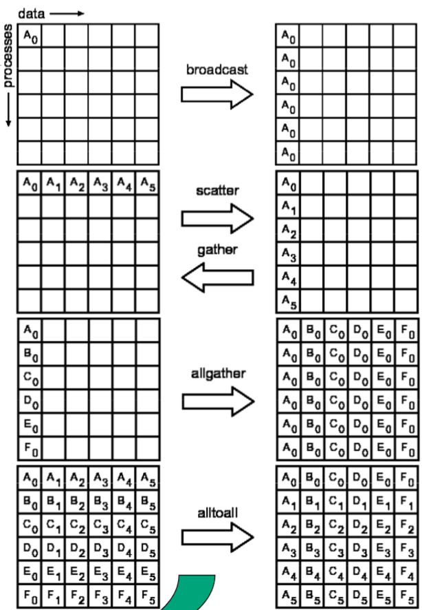
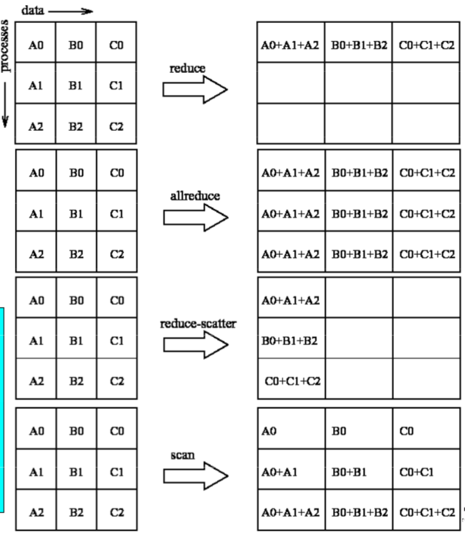

##	总述

*Message Passing Interface*：消息传递函数库的标准规范

-	标准、规范，不是特指其某个具体实现
-	库描述，包括上百个函数调用接口，支持*Fortran*、*CppC*
-	消息传递编程模型，并且是这种编程模型的代表、事实上的标准

###	说明

-	高移植性

	-	在所有主流并行机上得到实现
	-	使用MPI做消息传递的*CppC*、*Fortran*并行程序可以不加
		改变移植

-	常用版本：所有版本遵循MPI标准，MPI程序可以不加修改的运行

	-	*MPICH*：最流行的非专利实现，具有更好的可移植性
	-	*OpenMPI*：*LAMMPI*的下代MPI实现
	-	其他商用版本MPI：*HP-MPI*、*MS-MPI*

###	编译运行

```shell
$ mpicc -o hello hello.c
$ mpirun np 4 hello
	# 指定进程数
```

###	概念

####	通信组

通信子：进程组集合，所有参与并行计算的进程可以组合为一个或
多个通信组

-	MPI通信操作函数中必要参数，用于限定参加通信的进程范围

-	`MPI_COMM_WORLD`：`MPI_Init`后，MPI程序的所有进程形成的
	缺省组

##	MPI接口

-	头文件为`mpi.h`
-	MPI函数均以`MPI_`为前缀，其后第一个字符大写
-	MPI函数返回出错代码或成功代码`MPI_SUCCESS`

###	MPI数据类型

|MPI(C Binding)|C|MPI(Fortran Binding)|Fortran|
|-----|-----|-----|-----|-----|
|MPI_BYTE||MPI_BYTE||
|MPI_CHAR|signed char|MPI_CHARACTER|CHARACTER(1)|
|||MPI_COMPLEX|COMPLEX|
|MPI_DOUBLE|double|MPI_DOUBLE_PRECISION|DOUBLE_PRECISION|
|MPI_FLOAT|float|MPI_REAL|REAL|
|MPI_INT|int|MPI_INTEGER|INTEGER|
|||MPI_LOGICAL|LOGICAL|
|MPI_LONG|long|||
|MPI_LONG_DOUBLE|long double|||
|MPI_PACKED||MPI_PACKED||
|MPI_SHORT|short|||
|MPI_UNSIGNED_CHAR|unsigned char|||
|MPI_UNSIGNED|unsigned int|||
|MPI_UNSIGNED_LONG|unsigned long|||
|MPI_UNSIGNED_SHORT|unsigned short|||

####	用途

-	异构计算：不同系统架构有不同数据表示格式，MPI预定义一些
	基本数据类型，实现过程中以这些基本数据类型为桥梁进行转换

-	派生数据类型：允许消息来自不连续、类型不一致存储区域，如
	数组散元、结构类型等


###	开始结束

####	`MPI_Init`

```c
int MPI_Init(int *argc, char **argv)
```

-	MPI程序的第一个调用（除`MPI_Initialize`）
	-	完成MPI程序的所有初始化工作
	-	启动MPI环境
	-	标志并行代码开始

-	`main`必须带参数运行


####	`MPI_Finalize (void)`

```c
int MPI_Finalize(void)
```

-	MPI程序的最后一个调用
	-	结束MPI程序的运行
	-	必须是MPI程序的最后一条可执行语句，否则程序运行结果
		不可预知
	-	标志并行代码结束，结束除主进程外其他进程

-	串行代码之后仍然可在主进程上运行

###	进程判断

####	`MPI_Common_size`

```c
int MPI_Common_size(MPI_Comm comm, int *size)
```

-	说明：获得进程个数*p*存储于`size`中

-	参数

	-	`comm`：通信组

####	`MPI_Common_rank`

```c
int MPI_Comm_rank(MPI_Comm comm, int *rank)
```

-	说明：获得*0~p-1*间进程rank值，相当于进程ID

####	`MPI_Get_processor_name`

```c
int MPI_Get_processor_name(
	char *processor_name,
	int *namelen
)
```

-	说明：获得进程名称

-	参数

	-	`processor_name`：存储进程名称
	-	`namelen`：存储进程名称长度

###	其他

####	`MPI_Get_count`

```c
init MPI_Get_count(
	MPI_Status status,
	MPI_Datatype datatype,
	int *count
)
```

-	说明：返回实际接收到的消息长度

-	参数

	-	`status`：接收操作返回值
	-	`datatype`：接收缓冲区中元素类型
	-	`count`：**OUT**，接受区元素个数

##	P2P通信

-	一对一通信
-	注意
	-	`MPI_Send/Recv`匹配，避免死锁

###	同步P2P

####	`MPI_Send`

```c
int MPI_Send(
	void *buf,
	int count,
	MPI_Datatype datatype,
	int dest,
	int tag,
	MPI_Comm comm
)
```

-	说明：**阻塞**发送缓冲区中`count`个`datatype`数据类型
	数据至目的进程

-	参数

	-	`buf`：发送缓冲区起始地址
	-	`count`：发送元素个数
	-	`datatype`：发送信息元素类型
	-	`dest`：目标进程rank值
		-	阻塞式消息传递中不允许`source == dest`，即自身
			作为接收者，会导致死锁
	-	`tag`：消息标签
	-	`comm`：通信组
		-	缺省`MPI_COMM_WORLD`
		-	消息传递必须限制在同一个消息组内

####	`MPI_Recv`

```c
int MPI_Recv(
	void *buf,
	int count,
	MPI_Datatype datatype,
	int source,
	int tag,
	MPI_Common comm,
	MPI_Status *status
)
```

-	说明：**阻塞**从发送源进程获取`count`个`datatype`
	数据类型至数据缓冲区`buf`

-	参数

	-	`buf`：**OUT**，接收缓冲区起始地址
		-	必须至少可以容纳`count`个`datatype`类型数据，
			否则溢出、出错

	-	`count`：最多可接收数据个数

	-	`datatype`：接收数据类型，必须同`MPI_Send`匹配

		-	有类型数据：发送、接收两者数据类型相同
		-	无类型数据：使用`MPI_BYTE`数据类型
		-	打包数据通信：使用`MPI_PACKED`

	-	`source`：接收数据源进程rank值
		-	发送进程隐式确定，由进程rank值唯一标识
		-	`MPI_ANY_SOURCE`：接收任意进程来源

	-	`tag`：消息标签
		-	`MPI_ANY_TAG`：匹配任意tag值

	-	`comm`：通信组
		-	缺省`MPI_COMM_WORLD`
		-	消息传递必须限制在同一个消息组内

	-	`status`：**OUT**，包含实际接收到消息的有关信息

		-	`status.MPI_SOURCE`：`MPI_ANY_SOURCE`时，确定
			消息来源
		-	`status.MPI_TAG`：`MPI_ANY_TAG`时，确定消息tag
		-	和`MPI_Get_count`获取接收到的消息长度

####	案例

```c
#include<stdio.h>
#include "mpi.h"

void maini(int argc, char *argv[]){
	int myid, numprocs, source;
	MPI_Status status;
	char message[100];

	MPI_Init(&argc, &argv);
	MPI_Comm_rank(MPI_COMM_WORLD, &myid);
	MPI_Comm_size(MPI_COMM_WORLD, &numprocs);

	if (myid != 0){
		sprintf(message, "Hello! From process %d", myid);
		MPI_Send(message, strlen(message)+1, MPI_CHAR, 0,
			99, MPI_COMM_WORLD);
	}else{
		for (source = 1; source < numproces; source++){
			MPI_Recv(message, 100, MPI_CHAR, source, 99,
				MPI_COMM_WORLD, &status);
			printf("%s\n", message);
		}
	}
	MPI_Finalize()
```

###	异步P2P

####	`MPI_Isend`

```c
int MPI_Isend(
	void *buf,
	int count,
	MPI_Datatype datatype,
	int dest,
	int tag,
	MPI_Comm comm,
	MPI_Request *request
)
```

-	说明：**非阻塞**发送缓冲区中`count`个`datatype`数据类型
	数据至目的进程

-	参数

	-	`request`：**OUT**，非阻塞通信完成对象（句柄、指针）

####	`MPI_Irecv`


```c
int MPI_Recv(
	void *buf,
	int count,
	MPI_Datatype datatype,
	int source,
	int tag,
	MPI_Common comm,
	MPI_Request *request
)
```

-	说明：**非阻塞**从发送源进程获取`count`个`datatype`
	数据类型至数据缓冲区`buf`


##	Collective Communication

集合通信

-	通信空间中所有进程都参与通信操作
-	每个进程都需要调用操作函数
-	多对一或一对多、同步通信

###	数据移动

> - `All-`：结果到所有进程
> - `-v`：variety，被操作的对象、操作更灵活
> > -	通信元素块大小可变
> > -	发送、接收时数据位置可以不连续



####	`MPI_Bcast`

```c
int MPI_Bcast(
	void *buffer,
	int count,
	MPI_Datatype datatype,
	int root,
	MPI_Comm comm
)
```

-	说明：数据广播，一到多

-	参数

	-	`root`：根进程

####	`MPI_Gather`

```c
int MPI_Gather(
	void *sendbuf,
	int sendcnt,
	MPI_Datatype sendtype,
	void *recvbuf,
	int recvcount,
	MPI_Datatype recvtype,
	int root,
	MPI_Comm comm
)
```

-	说明：数据聚合，多到一

-	参数

	-	`sendbuf`：发送缓冲区起始位置
	-	`sendcnt`：发送数据元素个数
	-	`sendtype`：发送数据类型
	-	`recvcount`：接收元素个数
		-	所有进程相同
		-	仅对根进程有效
	-	`recvtype`：接收数据类型
		-	仅对根进程有效
	-	`root`：接收进程rank值
	-	`comm`：通信组

####	`MPI_Gatherv`

```c
int MPI_Gatherv(
	void *sendbuf,
	int sendcnt,
	MPI_Datatype sendtype,
	void *recvbuf,
	int *recvcnts,
	int *displs,
	MPI Datatype recvtype,
	int root,
	MPI_Comm comm
)
```

-	说明：`MPI_Gather`的一般形式

-	参数

	-	`recvcnts`：从各进程分别要接受的元素个数数组
		-	大小等于通信组大小
		-	仅对根进程有效
	-	`displs`：从各进程要接受存放位置相对于接收缓冲区
		起始位置的偏移量
		-	仅对根进程有效

####	`MPI_Allgather`

-	说明：`MPI_Gather`特殊形式

####	`MPI_Allgatherv`

-	说明：`MPI_Allgather`一般形式

####	`MPI_Scatter`

```c
int MPI_Scatter(
	void *sendbuf,
	int sendcnt,
	MPI_Datatype sendtype,
	void *recvbuf,
	int recvbuf,
	MPI_Datatype recvtype,
	int root,
	MPI_Comm comm
)
```

-	说明：数据分散，一对多

####	`MPI_Scatterv`

-	说明：`MPI_Scatter`一般形式

####	`MPI_Alltoall`

-	说明：多对多，全交换置换数据

####	`MPI_Alltoallv`

-	说明：`MPI_Alltoall`一般形式

###	数据聚集



####	`MPI_Reduce`

```c
int MPI_Reduce(
	void *sendbuf,
	void *recvbuf,
	int count,
	MPI_Datatype datatype,
	MPI_Op op,
	int root,
	MPI_Comm comm
_
```

-	说明：数据规约，多对一

####	`MPI_Allreduce`

-	说明：`MPI_Allreduce`特殊形式，结果在所有进程

####	`MPI_Reduce_scatter`

-	说明：结果分散到每个进程

####	`MPI_Scan`

-	说明：前缀操作

###	同步

####	`MPI_Barrier`

-	说明：同步操作


