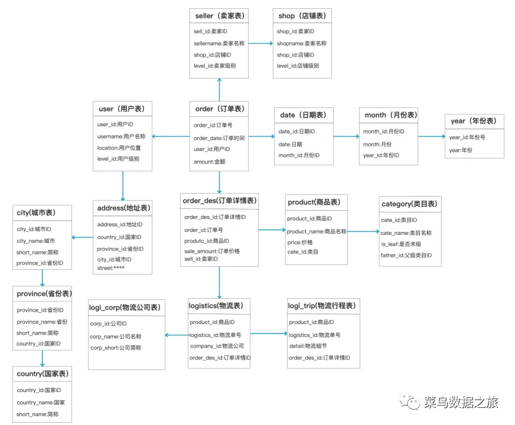
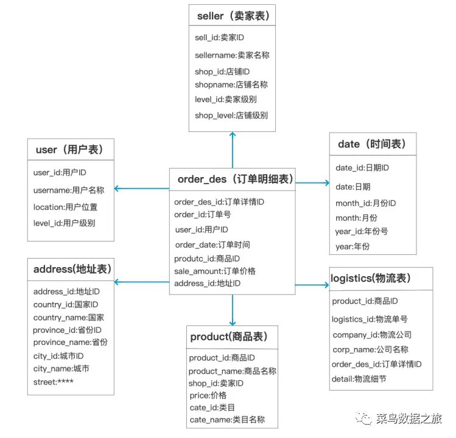
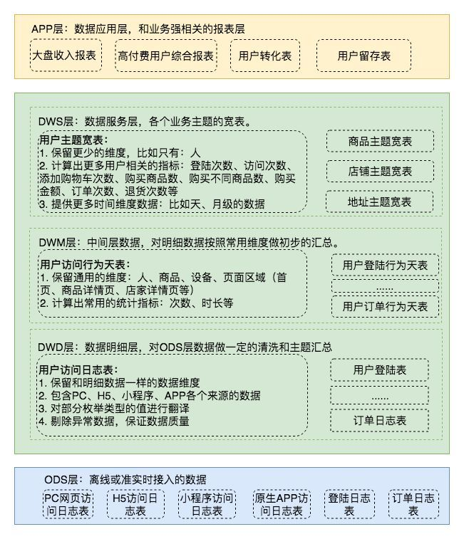

##	数据平台

-	数据存储实体
	-	*Online Transactional Processing* 数据库
		-	关系数据库
		-	非关系数据库
	-	*Online Analysis Processing* 数据库
	-	*Data Warehouse* 数据仓库
	-	*Data Mart* 数据集市

-	数据平台演进
	-	用途：经营分析 -> 数据化精细运营
	-	数据粒度：高汇总 -> 细粒度、明细
	-	时间：T+1 -> 实时
	-	结果：海量、临时需求
		-	面向最终用户、自助式产品
	-	目标
		-	实施：梳理数据来龙去脉，简化数据加工、存储、分析、建模等数据相关工作
		-	管理：管理入口，通过数据管理口径、项目、工程
		-	使用：用户可以一站式获取所需数据、数据应用能力

##	关系型数据库

###	关系数据库范式

-	（关系数据库）*Normal Form* 范式：设计数据库关系模式时的规范（级别），以解决数据冗余、更新异常、插入异常、删除异常等问题
	-	*1NF*：域应为原子性的
		-	即，每列应为不可分割原子数据项，不可为集合、数组、记录等
			-	某个属性有多个值时应拆分为不同属性
	-	*2NF*：*1NF* + 非码属性必须完全依赖（候选）码
		-	即，在 *1NF* 基础上消除非码属性对主码的部分依赖
			-	若非码属性仅依赖主码部分属性，则属性、主码部分属性应抽出作为单独实体
	-	*3NF*：*2NF* + 任何非码属性不依赖其他非码属性
		-	即，在 *2NF* 基础上消除传递依赖
		-	即，关系中不应包含已在其他关系中包含的非主关键字信息
	-	*BCNF*：*3NF* + 任何码属性不依赖码属性子集
		-	修正的 *3NF*，使得数据库冗余程度更小

-	说明
	-	依赖：属性值由其他属性值决定、部分决定
		-	完全依赖：完全决定
		-	部分依赖：部分决定
		-	传递依赖：通过中间属性依赖
	-	（候选）码：若除表中除属性（组）*K* 外所有属性均完全依赖于 *K*，则称 *K* 为（候选）码
		-	表中可有多个码，实际为方便会选择其中一个作为主码
		-	包含在任何码中的属性即为码属性（主属性）
	-	关系数据库中有各种范式间递次规范
		-	实务中，数据库模式满足 *3NF*、*BCNF* 即可

> - <https://www.zhihu.com/question/24696366>

##	数据仓库数据模型

-	经典数据仓库模型
	-	范式模型、*ER* 实体关系模型：遵循关系数据库 *3NF* 范式、用实体管关系描述的数据模型
		-	设计思路自上而下，建模能力要求高
		-	无数据冗余、方便解耦
		-	维护成本高
		
	-	维度模型：从分析决策需求出发、围绕事实维度构建的数据模型
		-	按数据组织类型可细分
			-	星型模型：事实表为中心、维度直接关联至事实表
			-	雪花模型：星形模型基础上，维度表关联其他维度表
			-	星座模型：星形模型基础上，多张事实表共享维度表
		-	相对范式模型缩减了规范化表，降低数据模型复杂度
		
	-	*Data Vault*：围绕 *Hub* 关键核心业务实体、*Link* 关系、*Satellite* 实体属性建立的数据模型

###	维度建模

-	概念
	-	*Fact* 事实：业务中发生的操作性、可度量事件的记录
	-	*Dimension* 维度：与事实相关联、描述环境的记录
		-	维度表需包含单一主键列用于与事实表关联
		-	维度表通常为扁平型、非规范表，包含大量低粒度、可枚举属性
	-	*Granularity* 粒度：数据层级
		-	对事实数据，除最底层事件粒度由数据源确定，上层粒度需人为划分
		-	对维度数据，内蕴层级划分
		-	低粒度数据可以 *ROLLUP* 得到高粒度数据
	-	*Index* 指标：对事实的度量

-	*Slowly Changing Dimensions* 缓慢变化维：随时间缓慢变化的维度
	-	维度属性值不变，即仅新增记录但不修改已有记录
		-	保留原始值
	-	维度属性值可修改
		-	重写，仅保留最新值
		-	增加新纪录，并区分历史、最新状态：全量快照、拉链表
		-	增加新属性用于记录（有限）历史状态

###	数据分层

-	数据分层
	-	清晰数据结构
	-	简化复杂问题：拆解任务
	-	减少重复开发：通过通用中间层减少重复计算
	-	追踪数据血缘
	-	屏蔽数据异常、统一数据口径

-	数据分层结构
	-	*Opertional Data Store* 数据运营层、贴源层：从数据源中 *ETL*
		-	多保持数据源的数据分类方式
			-	业务数据
			-	埋点日志
			-	消息队列
		-	不会进行过多的数据清洗，方便后续数据溯源
	-	*Data Warehouse* 数据仓库层、*Common Data Model* 数据公共层：根据 *ODS* 层数据建立数据模型，具体可以细分
		-	*DW Detail* 数仓细节层：运营层、数仓层之间的隔离层
			-	进行更深入数据清洗、规范
			-	保持 *ODS* 层数据粒度
		-	*DW Middle* 数仓中间层：聚合等加工的中间结果层
			-	方便复用公共指标，减少重复加工
			-	可按需退化粒度、减少维度
		-	*DW Service* 数仓服务层、*Data Market* 数据集市：按主题汇总、分析的服务层
			-	包含数量较少、单张表内容较多宽表
			-	方便后续查询、分析、数据分发
	-	*Application Data Service* 数据应用层：为数据产品、数据分析等线上需求供数
		-	对性能要求较高
		-	更适配业务需求
	-	实务中，5 层的分类较繁琐，可以合并为为 3 层
		-	*ODS* 贴源层：*ETL* 保持数据粒度
		-	*DW* 数仓层：数据加工、建模、分区
		-	*ADS* 应用层

> - 数据仓库分层：<https://dantezhao.gitbooks.io/data-warehouse-in-action/content/di-liu-zhang-ru-he-you-ya-di-she-ji-shu-ju-fen-ceng.html>
> - 数据仓库分层：<https://zhuanlan.zhihu.com/p/439523657>
> - 数据仓库分层：<https://zhuanlan.zhihu.com/p/341591615>
> - 数据仓库分层：<https://juejin.cn/post/6969874734355841031>

###	*FS—LDM* 模型

-	*FS-LDM* 模型：*Teradata* 基于金融行业机构抽象出 10 大主题
	-	当事人：服务或感兴趣的任意对象，包括团体、个人
	-	机构：分支机构、部门、职员信息
	-	产品：提供的产品和服务，包括期限、条件等
	-	协议：因提供产品和服务而与客户建立的契约关系，如账户、借据
	-	事件：与客户间的资金、非资金活动信息
	-	财务：机构内部财务、风险管理信息
	-	地理区域：包括国家、邮编等
	-	渠道：与客户交易、接触的渠道
	-	市场营销：为保持客户留存、拓展客户使用的营销策略、计划、促销等
	-	资产：当事人持有的有形、无形资产信息

##	数据库表设计

###	拉链表

|biz_id		|field1		|t_start		|t_end			|
|-----|-----|-----|-----|
|1			|A1			|2022-06-01		|2023-05-01		|
|2			|B			|2022-05-02		|9999-12-31		|
|1			|A2			|2022-05-02		|9999-12-31		|

-	拉链表：通过维护数据生效时间、失效时间保存数据历史状态、最新状态的表设计
	-	核心字段
		-	生效时间 `t_start`：数据有效期开始时间点
		-	失效时间 `t_end`：数据有效期结束时间点，常有以下设计
			-	`9999-12-31`：当前生效数据
			-	其他取值：数据失效时将 `9999-12-31` 更新为失效时点值，即失效时间比在当前时点前
		-	通过筛选生效时间、失效时间即可确认任意时间数据快照
	-	拉链表数据确认数据更新逻辑
		-	业务系统维护数据记录更新情况（如更新时间戳），拉链表据此新增记录、设置失效时间
		-	拉链表自行比较自身、业务系统数据是否有更新，维护效率依赖于表字段数量，实务中
			-	仅比较部分重要字段
			-	分重要字段设置多张拉链表
	-	说明
		-	拉链表常用于备份、记录缓慢变化维
			-	作为业务系统表的在数仓的快照备份
		-	拉链表仅能达到失效时间粒度的历史状态保存，无法回溯更低粒度历史状态
		-	拉链表随时间同样性能下降，可
			-	在生效时间、失效时间上设置索引
			-	建立两张拉链表分别存储所有记录、最新变化记录

> - 拉链表：<https://dantezhao.gitbooks.io/data-warehouse-in-action/content/di-si-zhang-la-lian-biao.html>

