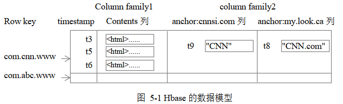
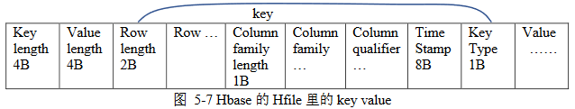

##	HBase简介

HBase是高可靠、高性能、面向列、可伸缩的分布式数据库系统

-	利用HBase技术可以在廉价硬件上搭建大规模非结构化数据管理
	集群

-	HBase借鉴Google Bigtable技术实现的开源软件

	||HBase|Bigtable|
	|-----|-----|-----|
	|存储系统|HDFS|GFS|
	|数据处理|Hadoop MapReduce|MapReduce|
	|协同服务|Zookeeper|Chubby|
	|RDBMS数据导入|Sqoop|-|

-	HBase访问接口
	-	Native Java API：常用、高效的访问方式
	-	HBase Shell：HBase命令行工具，适合用于管理HBase
	-	Thrift Gateway：利用Thrift序列化技术，支持C++、PHP、
		Python多种语言异构系统访问HBase表数据
	-	REST Gateway：支持REST风格的Http API访问HBase
	-	Pig：支持Pig Latin语言操作HBase中数据
		-	最终被转换为MapReduce Job处理HBase表数据
		-	适合做数据统计
	-	Hive：支持用户使用HiveQL访问HBase

-	可以在HBase系统上运行MapReduce作业，实现数据批处理
	

##	HBase数据结构

###	Table

HBase的表格，类似关系型数据库中的表格，但有所不同

####	特殊Table

HBase中有两张特殊的Table

-	`.META.`：记录用户表Region信息，自身可以有多个region
-	`-ROOT-`：记录`.META.`表Region信息的，自身只能有一个
	region

###	Row Key

行键，Table行主键，Table记录按照此排序

###	Column、Column Family

-	Table在水平方向由一个或多个列簇组成
-	一个列簇可以由任意多个Column组成
-	列簇支持动态扩展，无需预先定义列数量、类型
-	所有列均义二进制格式存储，用户需要自行进行类型转换

###	Timestamp

时间戳：每次数据操作对应的时间戳，可视为是数据的版本号

###	Region

Table记录数不断增加而变大后，逐渐分裂出的多个split

-	每个region由`[startkey, endkey)`表示
-	不同region被Master分配给相应RegionServer进行管理（存储）

##	HBase系统架构

###	Client

-	HBase Client使用HBase RPC机制同HMaster、HRegionServer
	进行通信
	-	对于管理类操作，通过RPC机制访问HMaster
	-	对于读写操作，通过RPC机制访问HRegionServer

###	Zookeeper

-	Zookeeper Quorum中记录`-ROOT`表的位置

	-	客户端访问数据之前首先访问zookeeper
	-	然访问`-ROOT-`表
	-	然后访问`.META.`表
	-	最后根据用户数据位置，访问具体数据

-	Zookeeper Quorum中存储有HMaster地址

-	HRegionServer把自己义Ephemeral方式注册到Zookeeper中，
	使得HMaster可以随时感知各个HRegionServer健康状态

-	引入Zookeeper，避免了HMaster单点失败问题

	-	HBase中可以启动多个HMaster
	-	通过Zookeeper的Master Election机制保证总有一个Master
		运行

###	HMaster

HMaster在功能上主要负责Table、Region管理工作

-	管理用户对Table增、删、查、找操作？？？
-	管理HRegionServer负载均衡，调整Region分布
-	在Region分裂后，负责新Region分配
-	在HRegionServer停机后，负责失效HRegionServer上region迁移

###	HRegionServer

HRegionServer负责响应用户I/O请求，向HDFS文件系统写数据，是
HBase中最核心的模块

####	HRegion

HRegionServer内部管理一系列HRegion对象

-	HRegion对象对应Table中一个Region
-	HRegion由多个HStore组成

####	HStore

每个HStore对应Table中一个列簇的存储，是HBase存储核心模块

-	由此可以看出列簇就是一个集中存储单元

	-	因此最好将具备共同IO特性的列放在同一个列簇中，可以
		提高IO效率

-	HStore由两部分构成

	-	MemStore
	-	StoreFile：底层实现是HFile，是对HFile的轻量级包装

#####	MemStore

Sorted memory buffer，用户写入数据首先放入MemStore中，满了
后Flush成一个StoreFile

#####	StoreFile

-	文件数量增长到一定阈值时会触发Compact合并操作，将多个
	StoreFile合并成一个StoreFile

	-	合并过程中会进行版本合并、数据删除
	-	即HBase其实只有增加数据，所有更新、删除操作都是后续
		Compact过程中进行的
	-	这使得用户写操作只要进入内存就可以立即返回，保证
		HBase IO高性能

-	Compact操作会逐步形成越来越大的StoreFile，超过阈值之后
	会触发Split操作

	-	当前Region分裂成2个Region
	-	父Region下线
	-	新分裂出的2个子Region会被HMaster分配到相应的
		HRegionServer上，实现负载均衡

####	HLog

每个**HRegionServer**中都有一个HLog对象，避免因为分布式系统
中节点宕机导致的MemStore中内存数据丢失

-	HLog是实现`WriteAheadLog`的类

-	HLog作用

	-	每次用户写入MemStore时，也会写入一份数据至HLog文件中
	-	HLog定时删除已持久化到StoreFile中的数据

-	HRegion意外终止后，HMaster会通过zookeeper感知到

	-	HMaster首先处理遗留的HLog文件，将其中不同Region的Log
		数据进行拆分，分别放到相应Region目录下
	-	然后将失效Region重新分配
	-	领取到Region的HRegionServer在Load Region过程中，会
		发现有历史HLog需要处理，会Replay HLog中的数据到
		MemStore中，然后flush到StoreFile中，完成数据恢复

##	HBase存储

HBase中所有数据存储在HDFS中

###	HFile

HFile是Hadoop二进制格式文件，实现HBase中*Key-Value*数据存储

-	HFile是不定长的，长度固定的只有：Trailer、FileInfo

####	Trailer

含有指针指向其他数据块起点

####	FileInfo

记录文件的一些元信息，如

-	AVG_KEY_LEN
-	AVG_VALUE_LEN
-	LAST_KEY
-	COMPARATOR
-	MAX_SEQ_ID_KEY

####	Data Index

记录每个Data块起始点

####	Meta Index

记录每个Meta块起始点

####	Data Block

Data Block是HBase IO基本单元

-	为了提高效率，HRegionServer中实现了基于LRU的Block Cache
	机制

-	Data块大小可以在创建Table时通过参数指定
	-	较大的块有利于顺序Scan
	-	较小的块有利于随机查询

-	Data块除了开头的Magic信息外，就是一个个`<key, value>`
	键值对拼接而成

-	Magic内容就是一些随机数字，防止数据损坏

-	每个键值对就是简单的byte array，但是包含很多项，且有固定
	结构
	

	-	开头是两个固定长度的数值，分别表示key、value长度
	-	然后是key部分
		-	固定长度数值表示RowKey长度
		-	RowKey
		-	固定长度数值表示Column Family的长度
		-	Column Family
		-	Qualifier
		-	固定长度数值表示：Timestamp、KeyType（Put/Delete）
	-	Value部分就是二进制数据

###	HLogFile

HBase中Write Ahead Log存储格式，本质上是Hadoop Sequence File

-	Sequence File的Key是HLogKey对象，记录了写入数据的归属信息

	-	table
	-	region
	-	squecence number：起始值为0，或最近一次存入文件系统
		中的squence number
	-	timestamp：写入时间

-	Squence File的Value是KeyValue对象，即对应HFile中KeyValue

e

