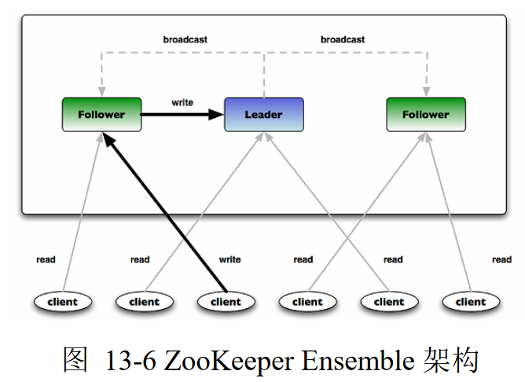
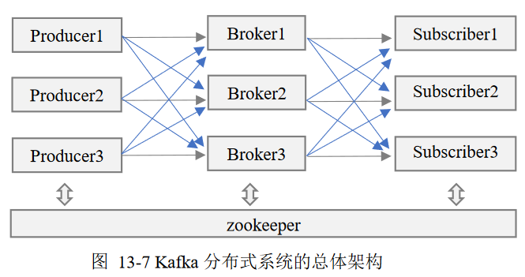

Zookeeper是一个协调软件服务，用于构建可靠的、分布式群组

-	提供群组成员维护、领导人选举、工作流协同、分布式系统同步
	、命名、配置信息维护等服务

-	提供广义的分布式数据结构：锁、队列、屏障、锁存器

-	Zookeeper促进户端间的松耦合，提供最终一致的、类似传统
	文件系统中文件、目录的Znode视图，提供基本操作，如：创建
	、删除、检查Znode是否存在

-	提供事件驱动模型，客户端能观察到Znode的变化

-	Zookeeper运行多个Zookeeper Ensemble以获得高可用性，每个
	服务器上的Ensemble都持有分布式系统内存副本，为客户端读取
	请求提供服务

#	Flume

Flume是分布式日志收集系统，收集日志、事件等数据资源，并集中
存储

##	Flume组件、结构

-	旧版本组件、结构
	

-	新版本组件、结构：每个Flume整体称为Agent
	

	-	两个版本的组件功能、数据流结构都有区别
	-	但是3大组件基本可以一一对应（功能略有差异）

-	Agent是一组独立的JVM守护进程，从客户端、其他Agent接收
	数据、迅速传递给下个目的节点

-	支持多路径流量、多管道接入流量、多管道接出流量、上下文
	路由

###	Source（Agent）

采集数据，是Flume产生数据流的地方

-	运行在数据发生器所在的服务器上，接收数据发生器接受数据，
	将数据以event格式传递给一个或多个Channel

-	支持多种数据接收方式
	-	Avro Source：支持Avro RPC协议，内置支持
	-	Thrift Source：支持Thrift协议
	-	Exec Source：支持Unix标准输出
	-	JMS Source：从JMS（消息、主题）读取数据
	-	Spooling Directory Source：监控指定目录内数据变更
	-	Twitter 1% firehose Source：通过API持续下载Twitter
		数据
	-	Netcat Source：监控端口，将流经端口的每个文本行数据
		作为Event输入
	-	Sequence Generator Source：序列生成器数据源
	-	HTTP Source：基于POST、GET方式数据源，支持JSON、BLOB
		格式

-	收集数据模式
	-	Push Source：外部系统主动将数据推送到Flume中，如
		RPC、syslog
	-	Polling Source：Flume主动从外部系统获取数据，如
		text、exec

###	Channel （Collector）

暂时的存储容器，缓存接收到的event格式的数据，直到被sink消费

-	在source、sink间起桥梁作用

-	Channel基于事务传递Event，保证数据在收发时的一致性

-	Channel可以和任意数量source、sink连接
-	主要Channel类型有

	-	JDBC channel：数据持久化在数据库中，内置支持Derby
	-	File Channel：数据存储在磁盘文件中
	-	Memory Channel：数据存储在内存中
	-	Spillable Meemory Channel：优先存在内存中，内存队列
		满则持久到磁盘中
	-	Custom Channel：自定义Channel实现

###	Sink（Storage Tier）

将从Channel接收数据存储到集中存储器中（HDFS、HBase）

##	Flume Event

Flume事件是内部数据传输最小基本单元、事务处理基本单位

-	由一个装载数据的byte array、可选header构成
	-	数据对Flume是不透明的
	-	header是容纳键值对字符串的无需集合，键在集合内唯一
	-	header可以在上下文路由中使用扩展，如：数据清洗
-	Event将传输数据进行封装

##	Flume架构特性（旧版）

###	Reliablity

Flume提供了3种数据可靠性选项

-	End-to-End：使用磁盘日志、接受端Ack的方式，保证Flume接收
	数据最终到导致目的地

-	Store on Failure：目的地不可用时，将数据保存在本地硬盘，
	但进程如果出问题，可能丢失部分数据（发送后目的地不可用）

-	Best Effort：不做任何QoS保证

###	Scalability

易扩展性

-	Flume三大组件都是可伸缩的
-	Flume对事件的处理不需要带状态，Scalability容易实现

###	Avaliablity

高可用性：Flume引入Zookeeper用于保存配置数据

-	Zookeeper本身可以保证配置数据一致性、高可用
-	在配置数据发生变化时，Zookeeper通知Flume Master节点
	Flume Master节点通过gossip协议同步数据

###	Manageablity

易管理性

-	多个Master，保证可以管理大量节点

###	Extensibility

可开发性：可以基于Java为Flume添加各种新功能

-	实现`Source`子类，自定义数据接入方式
-	实现`Sink`子类，将数据写入特定目标
-	实现`SinkDecorator`子类，对数据进行一定的预处理

##	适合场景

-	高效率的从多个网站服务器收集日志信息存储在HDFS上
-	将从多个服务器获取的数据迅速移交给Hadoop
-	可以收集社交网络站点事件数据，如：facebook、amazon

#	Kafka

分布式、分区的、可复制的Message System（提交日志服务），
得益于特有的设计，Kafka具有高性能、高可扩展的特点

-	完全分布式系统，易于横向扩展、处理极大规模数据
-	同时为发布、订阅提供极高吞吐能力
-	支持多订阅，出现失败状态时，可以自动平衡消费者
-	将消息持久化到磁盘，保证消息系统可靠性，可用于消息
	批量消费应用（ETL系统）、实时应用

##	Kafka组件

###	Topic

话题：特定类型的消息流

-	话题是消息的分类机制
	-	消息产生器向Kafka发布消息必须指定话题

-	Kafka安照Topic维护接收到的消息
	-	话题被划分为一系列分区
	-	Kafka集群为每个Topic维护一个分区日志文件存储消息

> 消息是字节的Payload（有效载荷）

###	Producer 

生产者：向Kafka发布消息的进程

-	生产者需要指定消息分配至哪个分区
	-	采用Round-Robin方式方便均衡负载
	-	根据应用的语义要求，设置专用Partition Function进行
		消息分区

###	Broker

代理：AMQP客户端，保存已经发布消息的服务器进程

>	AMQP：the Advanced Message Queuing Protocal，标准开放
	的应用层消息中间件协议。AMQP定义了通过网络发送的字节流
	的数据格式，兼容性非常好，任何实现AMQP协议的程序可以和
	兼容AMQP协议兼容的其他应用程序交互，容易做到跨语言、
	跨平台。

-	一组代理服务器构成Kafka集群

-	Kafka代理是无状态的，消费者需要自行维护已消费状态信息

	-	因此Kafka无法知晓信息是否已经被消费、应该删除，因此
		代理使用简单的、基于时间的Serice Level Agreement应用
		于保留策略，消息在代理中超过一定时间自动删除

	-	这种设计允许消费者可以重复消费已消费数据
		-	虽然违反队列常见约定
		-	但是实际应用中很多消费者有这种特征

-	消息代理将紧密耦合的系统设计解耦，可以对未及时处理的消息
	进行缓存

	-	提高了吞吐能力
	-	提供了分区、复制、容错支持

-	Kafka代理通过Zookeeper与其他Kafka代理协同
	

	-	系统中新增代理或代理故障失效时，Zookeeper通知生产者
		、消费者
	-	生产者、消费者据此开始同其他代理协同工作

###	Consumer

消费者：向Kafka subscribe话题，以处理Kafka消息的进程

-	消费者可以订阅一个或多个话题，从代理拉取数据，消费已经
	发布的消息

-	消费者获取消息系统一般采用两种模型

	-	Queuing：队列模型，一组消费者从一个服务器读取信息，
		每个消息仅可被其中一个消费者消费

	-	Publish Subscribe：发布订阅模型，消息被广播给所有
		消费者

-	Kafka采用一种抽象方法：消费者组Consumer Group提供对上述
	两种消息系统模型的支持
	

	-	给每个消费者打上属于某个消费者组的标签（这里组只是
		表示同组内消费者只能有一个消费信息）

	-	每个发布到话题的消息分发给消费者组的其中一个消费者

	-	一般情况下每个话题下有多个消费者组，每个组中有多个
		消费者实例，以达到扩展处理能力、容错

	-	极端情况：如果所有消费者实例都隶属于同一个消费者组，
		Kafka工作模式类似于队列模型；所有消费者实例隶属于
		不同的消费者组，Kafka工作模式类似于发布-订阅模型

##	消息分区、存储、分发

###	分区日志

每个分区是**有序的**、**不可更改**、**可在末尾不断追加**的
消息序列

####	分区优势

-	允许Kafka处理超过一台服务器容量的日志规模

-	分区作为并行处理基本单元，允许Kafka进行并行处理

-	通过保证每个分区仅仅**由一个消费者消费**，可以保证同一
	分区内消息消费的有序

	-	由于可以设置很多分区，仍然可以保证在不同消费者之间
		实现负载均衡
	-	分区内外保证消息有序、数据分区处理对大部分实际应用
		已经足够

####	分区管理

每个分区由单独的（一组）服务器处理，负责该分区数据管理、消息
请求，支持多个副本以支持容错

-	每个分区中有一台服务器作为leader、若干服务器作为follower

-	领导者负责分区读、写请求，跟随者以被动的方式领导者数据
	进行复制

-	领导者失败，则追随者之一在Zookeeper协调下成为新领导者

-	为保证负载均衡，每个服务器担任部分分区领导者、其他分区
	追随者

###	存储布局

Kafka存储布局非常简单

####	分区存储

-	话题每个分区对应一个逻辑日志

-	每个日志为相同的大小的一组分段文件

-	生产者发布的消息被代理追加到对应分区最后一个段文件中

-	发布消息数量达到设定值、经过一段时间后，段文件真正写入
	磁盘，然后公开给消费者

####	Offset

分区中每个消息的Sequential ID Number（Offset），唯一标识
分区中消息，并没有明确的消息ID

-	偏移量是增量的但不连续，下个消息ID通过在其偏移量加上
	消息长度得到

-	偏移量标识每个消费者目前处理到某分区消息队列的位置，
	对分区消息队列处理依赖于其（消息通过日志偏移量公开）

-	偏移量由消费者控制，所以消费者可以以任何顺序消费消息

	-	可以回推偏移量重复消费消息
	-	设计消费者仅仅查看分区末尾若干消息，不改变消息，
		其他消费者可以正常的消费

从消息分区机制、消费者基于偏移量消费机制，可以看出Kafka消息
消费机制不会对集群、其他消费者造成影响

##	适合场景

-	Messaging：消息传递，作为传递消息队列（ActiveMQ、
	RabbitMQ等）替代品，提供高吞吐能力、高容错、低延迟

-	Website Activity Tracking：网站活动跟踪，要求系统必须
	快速处理产生消息

-	Metric：度量，把分布式各个应用程序的运营数据集中，进行
	汇总统计

-	Streaming Processing：流数据处理

-	Event Sourcing：事件溯源，把应用程序状态变化以时间顺序
	存储，需要支持大量数据

-	Commit Log：日志提交，作为分布式系统提交日志的外部存储
	服务

#	Storm

Storm是分布式、高容错的实时流数据处理的开源系统

-	Storm为流数据处理设计，具有很高的容错性
-	Storm保证每个消息只能得到一次完整处理，任务失败时会负责
	从消息源重试消息，从而支持可靠的消息处理
-	可以通过实现Storm通讯协议，提供其他语言支持

##	Storm架构

-	主节点的运行Nimbus守护进程
	-	分配代码
	-	布置任务
	-	故障检测

-	工作节点运行Supervisor守护进程
	-	监听、开始、终止工作进程

-	Nimbus、Supervisor都是无状态的（不负责维护客户端两次调用
	之间状态维护）
	-	这使得两者十分健壮
	-	两者之间的协调由Zookeeper完成

-	Storm在ZeorMQ内部传递消息

###	Nimbus

###	Supervisor

###	Worker

##	Storm编程模型

###	Stream

数据流：没有边界的tuple序列

-	这些tuple以分布式的方式，并行的创建、处理

###	Topology

计算拓扑：实时计算应用程序处理逻辑封装成的Topology对象

-	相当于Mapreduce作业，但是MapReduce作业最终会结束、而
	Topology会一直运行直到被杀死
-	Topology由Spout、Bolt组成

####	Spout

消息源：消息tuple生产者

-	消息源可以是可靠的、不可靠的
-	可靠的消息源可在tuple没有被storm成功处理时，可以重新发送
-	不可靠的消息源则在发送tuple之后彻底丢弃

####	Bolt

消息处理者：封装所有的消息处理逻辑

-	Bolt可以做很多事情，包括过滤、聚集
-	Bolt一般数据处理流程
	-	处理一个输入tuple，发送0个、多个tuple
	-	调用ack接口，通知storm子集已经处理过了

####	Task、Executor

Topology每个Spout、Bolt转换为若干个任务在整个集群里执行

-	默认情况下，每个Task对应一个线程Executor，线程用于执行
	task
-	同一个Spout/Bolt里的Task共享一个物理线程

####	Stream Grouping

数据分发策略：定义Spout、Bolt间Tasks的数据分发

-	Shuffle Grouping：洗牌式分组，上游Spout数据流tuples随机
	分发到下游Bolt的Task

-	Fields Grouping：按指定字段进行分组

-	All Grouping：Spout数据tuple分发给所有下Bolt

-	Global Grouping：Spout数据tuple分发给最小id的task

-	Non-Grouping：类似shuffle Grouping，把具有Non-Grouping
	设置Bolt推到其订阅的上游Spout、Bolt

-	Direct Grouping：tuple生产者决定接收tuple下游bolt中的task

-	Local or Shuffle Grouping：如果目标bolt中由一个或多个
	task工作在同一进程中，tuple分配给这些task，否则同洗牌式
	分组

-	Partial Key Grouping：类似Fields Grouping，但是在下游
	Bolt中做负载均衡，提高资源利用率

###	消息处理保证

Storm追踪由每个SpoutTuple产生的Tuple树

-	每个从Spout发出tuple，可能会生成成千上万个tuple
	-	根据血缘关系形成一棵tuple树
	-	当tuple树中所有节点都被成功处理了，才说明tuple被完全
		处理

-	每个Topology都有一个消息超时设置，如果Storm在时间内无法
	检验tuple树是否完全执行，该tuple标记为执行失败，之后重发

重发

