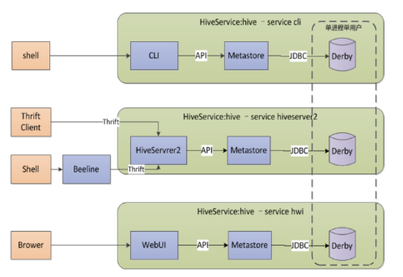
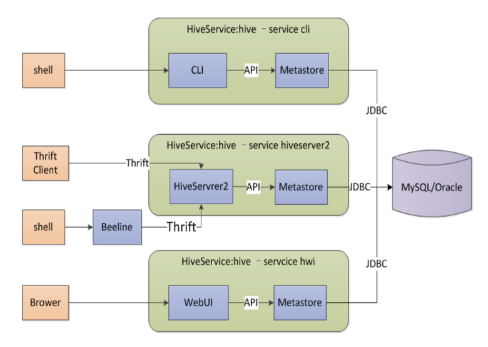
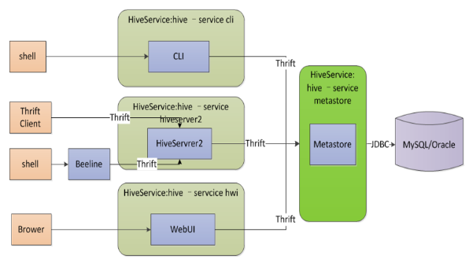

##	Hive简介

Hive是Hadoop平台上的数据仓库，面向结构化数据分析

-	将**结构化**数据文件映射为一张**数据库表**

-	提供完整的SQL查询功能，所用语言称为HiveQL
	-	Hive将HiveQL转换为MapReduce作业，在hadoop平台运行
	-	Hive相当于一个在hadoop平台上的SQL Shell
	-	方便用户使用HiveQL快速实现简单数据分析、统计，而不必
		开发专用MapReduce程序，学习成本低

-	相较于传统关系数据库，Hive具有如下特点

	||Hive|传统关系型数据库|
	|------|------|-------|
	|数据存储|HDFS分布式文件系统|服务器本地文件系统|
	|查询处理|MapReduce计算模型|自行设计的查询处理模型|
	|应用场景|海量数据分析处理|高性能查询，实时性好|
	|数据更新|不支持对具体数据行修改，只能覆盖、追加|支持|
	|事务处理|不支持|支持|
	|索引支持|不支持，一般需要对数据进行全部扫描|支持，多种索引|
	|扩展能力|基于Hadoop平台，存储、计算强大的扩展能力|扩展性较差|
	|数据加载|Writing Time Schema：数据加载时无需进行模式检查，在读取数据时对数据以一定模式进行解释|Reading Time Schema：要求数据必须符合数据库表结构|

###	Hive服务端组件

####	Driver

负责将用户的编写的HiveQL查询语句进行解析、编译、优化、生成
执行计划，然后调用底层MapReduce计算模型执行，包括

-	Compiler：编译器
-	Optimizer：优化器
-	Executor：执行器

####	MetaStore

元信息管理器，对Hive正确运行举足轻重

-	MetaStore实际上就是Thrift服务
	-	MetaStore客户端（hive、spark shell等）和服务端通过
		thrift协议进行通信
	-	客户端通过连接metastore服务，实现对元数据的存取
	-	通过Thrift获取元数据，屏蔽了访问MetaStore Database
		所需的驱动、url、用户名、密码等细节

-	负责存储元数据在关系型数据库（称为MetaStore Database）
	-	元数据包括Hive创建的database、table等元信息
	-	支持的关系型数据库
		-	Derby：Apache旗下Java数据库
		-	MySQL

-	MetaStore服务可以独立运行，可以让多个客户端同时连接、
	甚至安装到远程服务器集群，保持Hive运行的健壮性

#####	Embedded Metastore Server(Database Derby)

内嵌模式：使用内嵌的Derby数据库存储元数据

-	不需要额外起Metastore服务
-	一次只能一个客户端连接，使用做实验，不适合生产环境
-	Derby默认会在调用hive命令所在目录的`metastore_db`文件中
	持久化元数据

#####	Local Metastore Server

本地元存储

-	采用外部数据库，支持
	-	MySQL
	-	Postgres
	-	Orcale
	-	MSSQL

-	数据库独立于hive部署，hive服务使用JDBC访问元数据，多个
	服务可以同时进行

-	本地元存储不需要单独起metastore服务，用的是跟hive在同一
	进程metastore服务

#####	Remote Metastore Server

远程元存储

-	类似于本地元存储，只是需要单独启动metastore服务，和hive
	运行在不同的进程（甚至主机）中

-	需要在每个客户端配置文件配置连接到该metastore服务
	-	hive通过thrift访问metastore

-	此模式可以控制到数据库的连接

####	hiveserver2

基于的Thrift RPC实现

-	远程客户端可以通过hiveserver2执行对hive的查询并返回结果
	-	支持多客户端并发、身份验证

-	可以使用JDBC、ODBC、Thrift连接hiveserver2（Thrift Server
	特性）

-	hiveserver2也能访问元数据，不依赖于metastore服务

###	Hive客户端组件

####	CLI

Command Line Interface

-	允许用户交互式的使用Hive

####	THrift Client/beeline

基于Thrift的JDBC Client

-	包括JDBC/ODBC驱动程序

####	WEB GUI

允许用户通过WEB GUI图形界面访问Hive

-	需要首先启动Hive Web Interface服务

##	Hive查询处理

###	过程

1.	用户提交HQL至Driver
2.	Driver把查询交给Compiler，Compiler使用MetaStore中元信息
	检查、编译
3.	查询经过Optimizer优化交由Executor Engine执行，转换为
	MapReduce作业后调用MapReduce执行
4.	MapReduce存取HDFS，对数据进行处理，查询结果返回Driver

###	数据类型

-	基础数据类型
	-	Integer
	-	Float
	-	Double
	-	String

-	复杂数据类型：通过嵌套表达复杂类型
	-	Map
	-	List
	-	Struct

-	还允许用户自定以类型、函数扩展系统

###	数据存储模型

使用传统数据库：Table、Row、Column、Partition等概念，易于
理解

####	Database

相当于关系型数据库中的Namespace

-	将不同用户数据隔离到不同的数据库、模式中

####	Table

表格

-	逻辑上由存储的数据、描述数据格式的相关元数据组成
	-	表格数据存放在分布式文件系统（HDFS）中
	-	元数据存储在MetaStore服务指定关系型数据库中

-	创建表格、加载数据之前，表格在HDFS中就是一个目录，
	表格分为两种类型
	-	托管表：数据文件存放在Hive数据仓库中，即HDFS中的一个
		目录，是Hive数据文件默认存放路径
	-	外部表：数据文件**可以**存放在其他文件系统中

####	Partition

根据“分区列”的值，对表格数据进行粗略划分的极值

-	存储上：是Hive中表格主目录的子目录，名字即为定义的分区列
	名字

-	逻辑上：分区不是表中的实际字段，是虚拟列
	-	根据虚拟列（可能包含多个实际字段）划分、存储表格数据
	-	同一虚拟列中字段通常应该经常一起被查询，这样在需要
		存取部分数据字段时，可以只扫描部分表

####	Bucket

Table、Partition都是目录级别的数据拆分，指定Bucket的表格，
数据文件将按照规律拆分成多个文件

-	每个桶就是table、partition目录中的文件

-	一般使用Hash函数实现数据分桶，创建表时，需要指定桶数量、
	分桶操作依据的列

-	用户执行Sample查询时，Hive可以使用分桶信息，有效的Prune
	Data，如：对每个目录下单个桶文件进行查询

