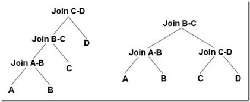

##	查询代价估算

###	代价模型

代价估计模型：基于CPU代价、IO代价

$$\begin{align*}
总代价 &= IO代价 + CPU代价 \\
COST &= P * CPUTimePerPage + W * T
\end{align*}$$

> - $P$：计划访问的页面数
> - $CPUTimePerPage$：读取每个页面的时间花费
> - $T$：访问的元组数，索引扫描应包括索引读取花费
> > -	反映CPU代价，因为访问页面上的元组需要解析元组结构，
		消耗CPU
> - $W$：*selectivity*，选择率/权重因子，表明IO、CPU的相关性

###	*Selectivity*

选择率：在关系R中，满足**条件**`A <cond_op> a`的元组数R和
所有元组数N的比值

-	在CBO中占有重要地位
-	其精确程度直接影响最优计划的选择

####	估计方法

-	*Non-Parametric Method*：非参方法，使用ad-hoc数据结构、
	直方图维护属性值分布

-	*Parametric Method*：参数方法，使用预先估计的分布函数
	逼近真实分布

-	*Curve Fitting*：曲线拟合法，使用多项式函数、最小标准差
	逼近属性值分布

-	*Sampling*：抽样法，从数据库中抽取部分元组，针对样本进行
	查询，收集统计数据
	-	需要足够多样本被测试才能达到足够精度

-	综合法

##	单表扫描算法

##	索引

##	两表联接算法

#todo

###	*Nested Loop*

嵌套循环联接算法：扫描外表，读取记录根据`join`字段上的
**索引**去内表中查询

-	适合场景
	-	外表记录较少（<1w）
	-	内表已经创建索引、性能较好
	-	inner、left outer、left semi、left antisemi join

####	嵌套循环联接算法

-	搜索时扫描整个表、索引

```c
for each row R1 in the outer table:
	for each row R2 in the inner table:
		if R1 join with R2:
			return (R1, R2)
```

> - 外部循环逐行消耗外部输入表，当其数据量很大时可以并行扫描
	内表
> - 内表被外表驱动：内部循环为每个外部行执行，在内表中搜索
	匹配行

####	基于块嵌套循环联接算法

-	每次IO申请以“块”为单位尽量读入多个页面
-	改进获取元组的方式

```c
for each chunk c1 of t1
	if c1 not in memory:
		read chunk c1 to memory
	for each row r1 in chunk c1:
		for each chunk c2 of t2:
			if c2 not in memory:
				read chunk c2 into memory
			for each row r2 in c2:
				if r1 join with r2:
					return(R1, R2)
```

> - 内存循环最后一个块使用后作为下次循环循环使用的第一个块
	可以节省一次IO

####	索引嵌套循环联接算法

-	索引嵌套循环连结：在内表中搜索时使用索引，可以加快联接
	速度
-	临时索引嵌套循环连结：为查询临时生成索引作为查询计划的
	一部分，查询完成后立刻将索引破坏

###	*(Sort)Merge Join*

排序归并联接算法

-	适合场景
	-	联接字段已经排序，如B+树索引
	-	inner、left outer、left semi、left anti semi、
		right outer、right semi、right anti semi join、union
	-	等值、非等值联接，除`!=/<>`

####	算法

-	确保两个关联表都是按照关联字段进行排序
	-	若关联字段已经有排序一致的可用索引，可以利用索引直接
		进行merge join操作
	-	否则先对关联字段进行排序，表过大无法一次载入内存时
		需要分块载入

-	从每个表分别取记录开始匹配（升序）
	-	若符合关联条件，放入结果集
	-	否则丢关联字段较小记录，取对应表中下条记录继续
		匹配，直到整个循环结束
	-	对于多对join，通常需要使用临时表进行操作
		#todo

###	*Hash Join*

哈希联接：利用Hash Match联接

-	HJ处理代价非常高，是服务器内存、CPU头号杀手，需要对数据
	进行分区时，还会造成大量异步磁盘I/O，避免大数据的HJ，
	尽量转化为高效的SMJ、NLJ

	-	表结构设计：冗余字段
	-	索引调整设计
	-	SQL优化
	-	冗余表：静态表存储统计结果

-	类似任何hash算法，内存小、数据偏斜严重时，散列冲突会比较
	严重，此时应该考虑使用NIJ

-	适合场景
	-	两表数据量相差非常大
	-	对CPU消耗明显，需要CPU资源充足
	-	只适合（不）等值查询

####	*In-Memory Hash Join*


#####	*build*阶段

以操作涉及字段为hash key构造hash表

-	从构造输入表中取记录，使用hash函数生成hash值

-	hash值对应hash表中的buckets，若一个hash值对应多个桶，
	则使用链表将联接桶

-	构造输入表处理完毕之后，其中记录都被桶关联

> - build表构建的hash表需要频繁访问，最好能全部加载在内存中
	，因此尽量选择小表，避免使用GHJ

#####	*probe*阶段

-	从探测输入中取记录，使用同样hash函数生成hash值

-	根据hash值，在构造阶段构造的hash表中搜索对应桶

> - 为避免冲突，bucket可能会联接到其他bucket，探测操作
	会搜索整个冲突链上的buckets查找匹配记录

#####	具体操作

以下操作内部实现其实都是hash join，只是对应算符不同而已

-	join操作

	-	使用join字段计算hash值
	-	使用**顶端输入**构造hash表，**底端输入**进行探测
	-	按照联接类型规定的模式输出（不）匹配项
	-	若多个联接使用相同的联接列，这些操作将分组为一个
		哈希组

-	grouby操作、unique操作

	-	使用groupby字段、所有select字段计算hash值
	-	使用输入构造hash表，删除重复项、计算聚合表达式
	-	扫描hash表输出所有项

-	union操作、需要去除重复记录操作

	-	所有select字段计算hash值
	-	第一个输入构建hash表，删除重复项
	-	第二个输入进行探测
		-	若第二个输入没有重复项，直接返回没有匹配的项，
			扫描hash表返回所有项
		-	若第二个输入有重复项，则应该需要继续构建hash表，
			最后统一输出整个hash表

####	*Grace Hash Join*

*grace hash join*：磁盘分块HJ

-	将两表按照相同hash函数分配至不同分片中
	-	在磁盘上为各分片、表建立相应文件
	-	对表输入计算哈希值，根据哈希值写入分片、表对应文件

-	再对不同分片进行普通*in-memory hash join*
	-	若分片依然不能全部加载至内存，可以继续使用
		*grace hash join*

```cpp
grace_hash_join(t1, t2):
	// Grace Hash Join实现
	// 输入：待join表t1、t2
	for row in t1:
		hash_val = hash_func(row)
		N = hash_val % PART_COUNT
		write row to file t1_N

	for row in t2:
		hash_val = hash_func(row)
		N = hash_val % PART_COUNT
		write row to file t2_N

	for i in range(0, PART_COUNT):
		join(t1_i, t2_i)
```

-	分片数量`PART_COUNT`决定磁盘IO效率
	-	分片数量过小：无法起到分治效果，分片仍然需要进行
		*grace hash join*，降低效率
	-	分片数量过大：磁盘是块设备，每次刷盘刷一定数量块才
		高效，频繁刷盘不经济
	-	即分片数量在保证刷盘经济的情况下，越大越好，这需要
		优化器根据表统计信息确定

-	特点
	-	有磁盘I/O代价，会降低效率
	-	适合参与join表非常大，无法同时载入内存中

####	*Hybrid Hash Join*

*hybrid hash join*：GHJ基础上结合IMHJ的改进

-	对build表分片过程中，尽量多把完整分片保留在内存中
-	对probe表分片时，对应分片可以直接进行probe操作

> - *hybrid hash join*有时也被直接视为*grace hash join*，
	不做区分

###	比较

-	资源消耗

	-	HJ：CPU计算、内存（磁盘）中创建临时hash表
	-	SMJ：磁盘I/O（扫描表、索引）
	-	NLJ：磁盘I/O

-	性能

	-	通常情况：HJ > NPJ <> SMJ

		-	全表扫描比索引范围扫描再进行表访问更可取时，SMJ
			优于NPJ？？？
		-	而表特别小、特别大时，全表扫描优于索引范围扫描

	-	但若关联字段已排序，SMJ性能最优

-	首条搜索结果

	-	NPJ能快速返回首条搜索结果
	-	HJ、SMJ返回首条结果较慢

##	多表联接算法

多表联接算法：找到最优连接顺序（执行路径）

-	表联接顺序对于查询结果没有影响，但是对资源消耗、性能影响
	巨大

-	随着需要联接表数目增加，可能的联接排列非常多，基本不能
	对所有可能穷举分析

	-	*left-deep tree*/*linear (processing)tree*：$n!$
	-	*bushy tree*：$\frac {2(n-1)!} {(n-1)!}$
		（包括left-deep tree、right-deep tree）

	

-	事实上查询优化器不会穷尽搜索所有可能联接排列，而是使用
	启发式算法进行搜索

###	*Dynamic Programming*

动态规划算法：依次求解各数量表最优联接顺序，直到求出最终结果

1.	构造第一层关系：每个关系的最优路径就是关系的最优单表扫描
	方式

2.	迭代依次构造之后n-1层关系联接最优解

	-	左深联接树方式：将第k-1层每个关系同第1层关系联接
	-	紧密树联接方式：将第m(m > 2)层每个关系同第k-m层关系
		联接

	

###	*Heuristic Algorithm*

###	*Greedy Algorithm*

贪心算法：认为每次连接表的连接方式都是最优的，即从未联接表中
选择使得下次联接代价最小者

-	多表排序一般为
	-	常量表最前
	-	其他表按可访问元组数量升序排序

-	贪心算法得到的联接方式都是最优的
	-	则每次联接主要求解要联接表对象的最佳访问方式
	-	即每次代价估计的重点在于单表扫描的代价

-	求解结束后，局部最优查询计划生成
	-	得到左深树
	-	最初始表位于最左下端叶子节点处

###	*System R*

*System R*：对动态规划算法的改进

-	保留子树查询最优、次优查询计划，用于上层查询计划生成，
	使得查询计划整体较优

###	*Genetic Algorithm*

遗传算法：模拟自然界生物进化过程，采用人工进化的方式对目标
空间进行搜索

-	本质是高效、并行、全局搜索方法
-	能在搜索过程中自动获取、积累有关搜索空间的知识，并自适应
	的控制搜索过程以求的最佳解

####	思想

-	将问题域中可能解看作是染色体，将其编码为符号串的形式
-	对染色体群体反复进行基于遗传学的操作：选择、交叉、变异
-	根据预定目标适应度函数对每个个体进行评价，不断得到更优
	群体，从中全局并行搜索得到优化群体中最优个体

####	实体

-	*population*：群体，GA的遗传搜索空间
-	*individual*：个体，搜索空间中可能解
-	*chromosome*：染色体，个体特征代表
	-	由若干段基因组成
	-	GA中基本操作对象
-	*gene*：基因
	-	染色体片段
-	*fitness*：适应度，个体对环境的适应程度

####	基本操作

-	*selection*：选择，根据个体适应度在群体中按照一定概率
	选择个体作为父本
	-	适应度大个体被选择概率高
	-	体现了适者生存、优胜劣汰的进化规则

-	*crossover*：交叉，将父本个体按照一定概率随机交换基因
	形成新个体

-	*mutate*：变异，按照一定概率随机改变某个体基因值

####	涉及问题

-	串编码方式
	-	把问题的各种参数用二进串进行编码构成子串
	-	把子串拼接成染色体
	> - 串长度、编码方式对算法收敛影响极大

-	适应度/对象函数确定
	-	一般可以把问题模型函数作为对象函数

-	GA超参设置
	-	群体大小$n$：过小难以求出最优解，过大难收敛，一般取
		$n = 30 ~ 160$
	-	交叉概率$P_c$：太小难以前向搜索，太大容易破坏高适应
		值结构，一般取$P_c = 0.25 ~ 0.75$
	-	变异概率$P_m$：太小难以产生新结构，太大则变为单纯
		随机搜索，一般取$P_m = 0.01 ~ 0.2$

####	算法

1.	随机初始化种群
2.	估初始种群：为种群每个个体计算适应值、排序
3.	若没有达到预定演化数，则继续，否则结束算法
4.	选择父体
	-	杂交：得到新个体
	-	变异：对新个体变异
5.	计算新个体适应值，把适应值排名插入种群，淘汰最后个体
6.	重复3


