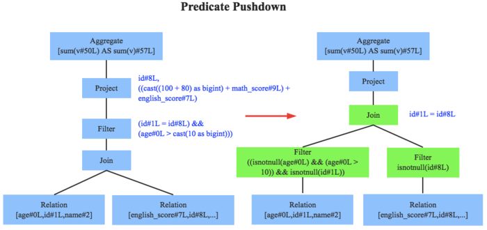
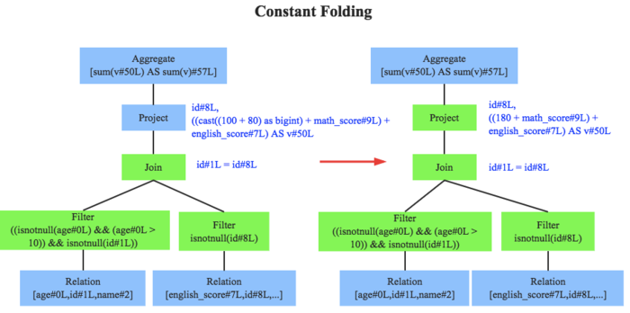
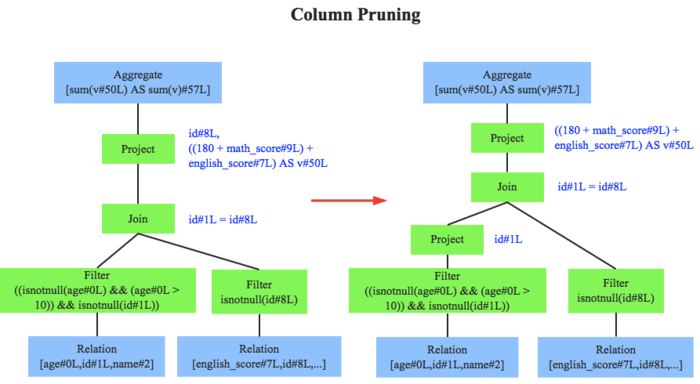

##	查询优化技术

查询优化技术：求解给定查询语句的高效执行计划过程

-	目标：在数据库查询优化引擎生成执行策略的过程中，尽量减小
	查询总开销
-	SQL层面上的局部优化，区别于数据库调优的全局优化

-	广义数据库查询优化
	-	查询重用技术
	-	查询重写规则
	-	查询算法优化技术
	-	并行查询优化技术
	-	分布式查询优化技术

-	狭义数据库查询优化
	-	查询重写规则：代数/逻辑优化，RBO
	-	查询算法优化技术：非代数/物理优化，CBO

###	代数/逻辑优化

代数/逻辑优化：依据关系代数的等价变换做逻辑变换

-	语法级：查询语句层、基于语法进行优化
-	代数级：使用形式逻辑、关系代数原理进行优化
-	语义级：根据完整性约束，对查询语句进行语义理解，推知可
	优化操作

###	非代数/物理优化

非代数/物理优化：根据数据读取、表连接方式、排序等技术对查询
进行优化

-	物理级：物理优化技术，基于代价估计模型，比较得出各执行
	方式中代价最小者
	-	查询算法优化：运用基于代价估算的多表连接算法求解最小
		花费计算

##	查询重用技术

查询重用：尽可能利用先前执行的结果，以节约全过程时间、减少
资源消耗

-	查询结果的重用：分配缓冲块存放SQL语句、最后结果集
-	查询计划的重用：缓存查询语句执行计划、相应语法树结构
-	优势：节约CPU、IO消耗
-	弊端
	-	结果集很大回消耗放大内存资源
	-	同样SQL不同用户获取的结果集可能不完全相同

##	查询重写规则

查询重写：查询语句的等价转换

-	基于关系代数，关系代数的等价变换规则为查询重写提供了理论
	支持
-	查询重写后，查询优化器可能生成多个连接路径，可以从候选者
	中择优

###	目标

-	将查询转换为等价、效率更高的形式
	-	低效率谓词转换为高效率谓词
	-	消除重复条件
-	将查询重写为等价、简单、不受表顺序限制的形式，为
	**物理查询阶段提供更多选择**

###	优化方向

-	过程性查询转换为描述性查询：视图重写
-	复杂查询尽可能转换为多表连接查询：嵌套子查询、外连接、
	嵌套连接等
-	低效率谓词转换为高效率谓词：等价谓词重写
-	利用（不）等式性质简化`where`、`having`、`on`条件

##	查询算法优化技术

#todo

###	*Rule-Based Optimizer*

RBO：基于规则的优化器

-	对AST/LP进行遍历，模式匹配能够满足特定规则的结点，进行
	等价转换，得到等价的另一棵树

	-	剪枝：删除一些无用计算
	-	合并：合并多个计算步骤

-	经验式、启发式的固定*transformation*，手动设置（硬编码）
	在数据库中规则决定SQL执行计划

####	经典优化规则

-	*predicate pushdown*：谓词下推

	

-	*constant folding*：常量累加

	

-	*column pruning*：列值裁剪

	

-	*combine limits*：Limits合并

-	inner join只访问单表：降为semi join

####	特点

-	操作简单、能快速确定连接方式

-	规则虽然有效但不敏感
	-	数据分布发生变化时，RBO是不感知的

-	基于RBO生成的执行计划不能确保是最优的
	-	启发式规则只能排除一些明显不好的存取路径

###	*Cost-Base Optimizer*

CBO：基于成本的优化器

-	根据SQL的执行成本制定、优化查询作业执行计划，生成可能
	的执行计划中代价最小的计划

	-	数据表统计数据
		-	基/势
		-	唯一值数量
		-	空值数量
		-	平均、最大长度
	-	SQL执行路径I/O
	-	网络资源
	-	CPU使用情况

-	以上执行信息获取方式取决于不同平台、数据库

	-	执行SQL前抽样分析数据
	-	每次执行SQL都会记录统计信息

-	特殊概念
	
	-	*cardinality*：集的势，结果集的行数
		-	表示SQL执行成本值
		-	SQL执行返回的结果集包含的行数越多，成本越大

	-	*selectivity*：可选择率，施加指定谓语条件后返回
		结果集的记录数占未施加任何谓语条件的原始结果集记录数
		的比率

		-	值越小，说明可选择性越好
		-	值越大，说明可选择性越差，成本值越大

####	常见优化规则

-	hash-join
	-	选择正确hash建表方
	-	选择正确join类型：广播hash、全洗牌hash
	-	join reorder：调整多路join顺序
		-	尽量减小中间shuffle数据集大小，达到最优输出

####	特点

-	对各种可能情况进行量化比较，可以得到花费最小的情况
-	CBO本身需要耗费一定资源，需要平衡CBO和查询计划优化程度
	-	数据表的数据统计资源耗费
	-	优化查询计划即时资源耗费，如果组合情况比较多则花费
		判断时间较多

##	并行查询优化技术

并行数据库系统中查询优化的目标：寻找具有最小响应时间的查询
执行计划

-	具有最小执行代价的计划不一定具有最快相应时间，需要考虑
	把查询工作分解为可以并行运行的子工作

-	查询能否并行取决于

	-	系统中可用资源
	-	CPU数目
	-	运算中特定代数运算符

-	查询并行可以分为

	-	操作内并行：将同一操作如单表扫描、两表连接、排序操作
		等分解为多个独立子操作

	-	操作间并行：一条SQL查询语句分解为多个子操作

##	分布式查询优化技术

分布式数据库系统：查询策略优化、局部处理优化是查询优化重点

-	查询策略优化：主要是数据传输策略优化

	-	主要考虑因素：数据的通信开销
	-	主要目标：以减少传输次数、数据量

-	局部处理优化：传统单结点数据库的查询优化技术

-	代价估计模型：总代价 = IO代价 + CPU代价 + 通信代价

