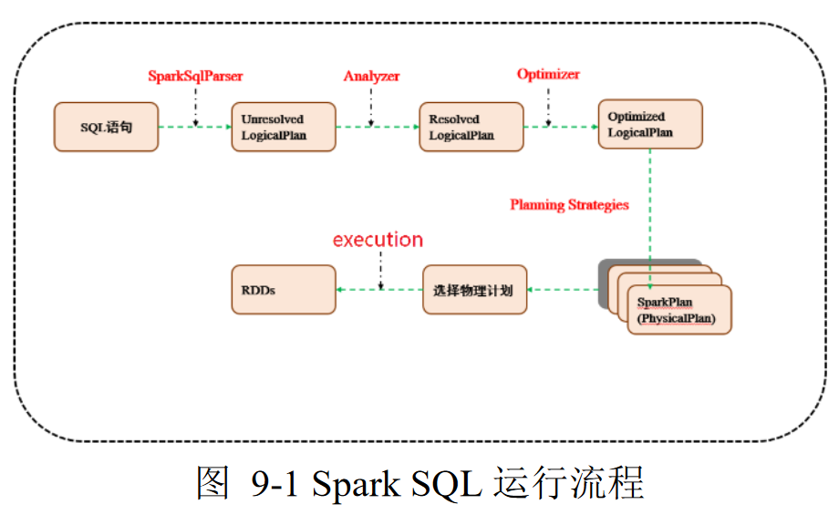
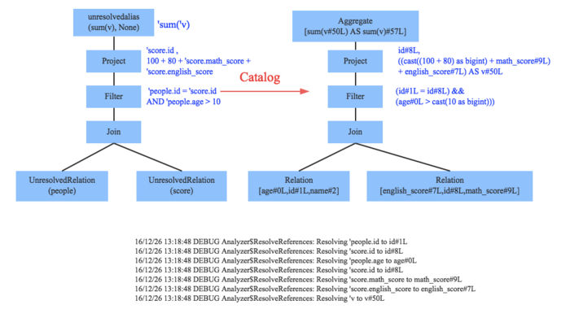
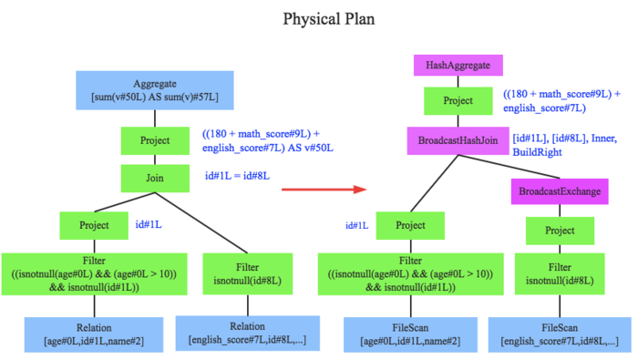
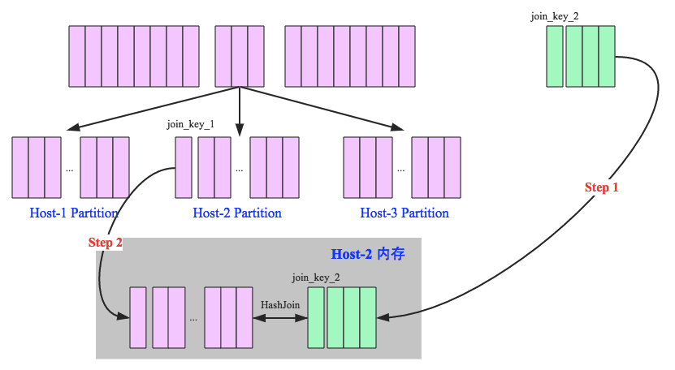
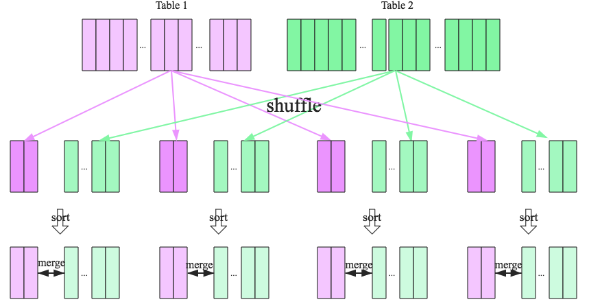

#	Catalyst优化器

##	结构

Catalyst优化器：利用Scala模式匹配和quasiquotes机制构建的
可扩展查询优化器

-	SparkSQL Pipeline的中间核心部分

###	*Parser*模块

Parser模块：将SQL语句切分为token，根据一定语义规则解析为AST

-	Spark1.x使用Scala原生Parser Combinator构建的词法、语法
	分析器

-	Spark2.x使用采用第三方语法解析器工具ANTLR4

	-	ANTLR4根据语法文件`SqlBase.g4`自动解析生成两个Java类
		，将sql语句解析成ParseTree的语法结构

		-	`SqlBaseLexer`：词法解析器
		-	`SqlBaseParser`：语法解析器

	-	随后ParsePlan过程，使用`AstBuilder.scala`将ParseTree
		转换为catalyst表达式逻辑计划*Unresovled Logical Plan*

		-	Unsolved Relation
		-	Unsolved Function
		-	Unsolved Attribute

###	*Analyzer*模块

*Analyzer*模块：使用*Analysis Rules*，借助数据元数据
（*session catalog*、*hive metastore*）将*ULP*解析为
*Logical Plan*

-	ULP虽然具备基本骨架，但是系统对表的字段信息不清楚，需要
	基本元数据信息表达ULP中token

-	遍历整个AST，对树上每个结点进行数据类型绑定、函数绑定，
	得到LP

####	*Schema Catalog*

元数据信息：表的模式信息

-	表的基本定义：表名、列名、数据类型
-	表的数据格式：json、text、parquet、压缩格式
-	表的物理位置

###	*Optimizer*模块

*Optimizer*模块：使用Optimization Rules对*LP*进行合并、列
裁剪、过滤器下推等优化工作，生成等价*Optimized Logical Plan*

-	分为RBO、CBO两种优化策略，是catalyst核心

###	*Spark Planner*

*Spark Planner*模块：将*OLP*转换为spark能够理解的
*Physical Plan*

-	将逻辑上可行的执行计划变为Spark真正可以执行的物理计划
-	物理计划实际上是逻辑计划中耗时最小的算法实现

##	Join

###	Join类型

SparkSQL目前支持三种join算符

-	*shuffle hash join*
-	*broadcast hash join*
-	*sort merge join*

####	*Broadcast Hash Join*

*broadcast hash join*：将小表广播分发到大表所在的结点上，
并行在各节点上进行hash join

-	适合小表很小，可以直接广播的场合
	> - `spark.sql.autoBroadcastJoinThreshold`设置广播小表
		大小上限

-	*broadcast*阶段：将所小表广播分发到大表所在的所有主机
	-	driver分发
	-	p2p分发

-	*hash join*结点：各结点独立并行hash join
	-	小表构建hash表
	-	各结点本地大表试探

####	*Shuffle Hash Join*

*shuffle hash join*：按照join key分区，在每个结点独立并行
进行hash join

-	类似分布式GHJ，不同块位于不同结点

-	*shuffle*阶段：将表按照join key分区，将具有相同join key
	的记录重分布到同一结点

-	*hash jon*阶段：各结点使用本地数据独立并行hash join

####	*Sort Merge Join*

*SMJ*：按照join key分区，在各节点独立并行*SMJ*

-	*shuffle*阶段：将表按照join key分区，将具有相同join key
	的记录重分布到同一结点

-	*sort*阶段：各节点并行对本地数据排序

	-	spark当前shuffle算法使用*sort-based shuffle*算法
	-	理论上shuffle过后各分区数据已经排序完毕，无需再次
		sort，效率很高

-	*merge*阶段：各节点对排序好表数据执行join操作

###	Join Reorder

-	基于CBO的join重排序优化：用统计信息预估的基修正join顺序

-	使用动态规划算法，考虑所有可能组合，选择代价最小的方案

	-	单个join操作成本，join树的成本是所有中间join成本总和
		$$
		cost = weight * cardinality + (1 - weight)*size
		$$

		> - carinality：对应CPU成本
		> - size：对应IO成本

	-	没有任何join条件同时包含左、右子树时，修剪笛卡尔积
		减少搜索范围

##	*Statistics Collection Framework*

CBO依赖统计细节信息优化查询计划

-	CBO自下而上遍历LP，统计信息可以随之传播到上层算子

###	统计信息类型

-	Numeric、Date、Timestamp
	-	Distinct Count
	-	Max
	-	Min
	-	Null Count
	-	Average Length：定长
	-	Max Length：定长

-	String、Binary
	-	Distinct Count
	-	Null Count
	-	Average Length
	-	Max Length

###	统计方式

-	扫描全表：简单、统计信息准确，代价大
-	抽样统计：

###	应用

####	*Filter Selectivity*

过滤选择率：估计应用谓词表达式过滤的选择率

#####	逻辑运算符

-	`AND`：左侧过滤条件选择率、右侧过滤条件选择率之积

	$$
	fs(a AND b) = fs(a) * fs(b)
	$$

-	`OR`：左侧、右侧过滤条件选择率之和，减去其乘积

	$$
	fs(a OR b) = fs(a) + fs(b) - fs(a) * fs(b)
	$$

-	`NOT`：1减去原始过滤条件选择率

	$$
	fs(NOT a) = 1.0 - fs(a)
	$$

#####	比较运算符

-	`=`：等于条件
	-	若常数取值在当前列取值范围之外，则过滤选择率为0
	-	否则根据柱状图、均匀分布得到过滤选择率

-	`<`：小于条件
	-	若常数取值小于当前列最小值，则过滤选择率为0
	-	否则根据柱状图、均匀分数得到过滤选择率

####	*Join Carinality*

联接基：估计联接操作结果的基

-	*inner*：其他基估计值可由inner join计算

	$$
	num(A IJ B) = \frac {num(A) * num(B)}
		{max(distinct(A.k), distinct(B.k))}
	$$

	> - `num(A)`：join操作前表A的有效记录数
	> - `distinct(A.k)`：表A中列k唯一值数量

-	*left-outer*：取inner join、左表中基较大者

	$$
	num(A LOJ B) = max(num(A IJ B), num(A))
	$$

-	*right-outer*：取inner join、右表中基较大者

	$$
	num(A ROJ B) = max(num(A IJ B), num(B))
	$$

-	*full-outer*

	$$
	num(A FOJ B) = num(A ROJ B) + num(A ROJ B) - num(A IJ B)
	$$

