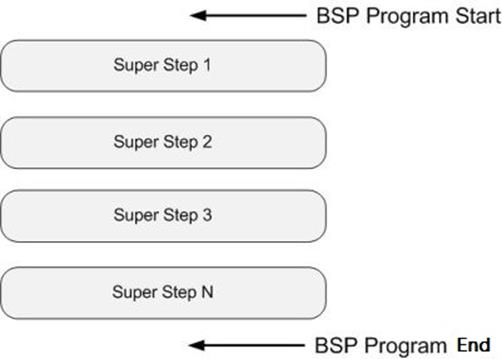
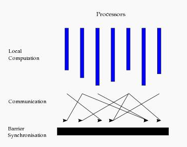
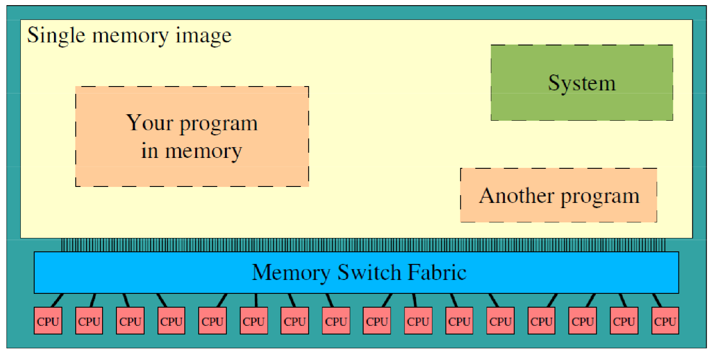
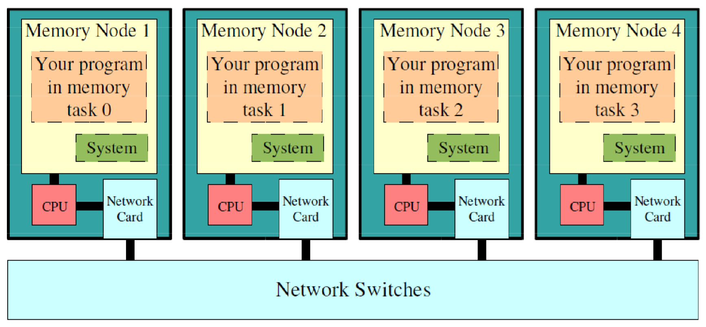
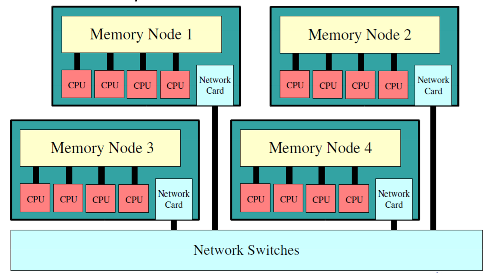

#	并行计算简介

##	并行计算模型

###	PRAM

Parallel Random Access Machine：随机存取并行机器模型，也称
共享存储的SIMD模型，从串行的RAM模型直接发展起来

####	假定

-	容量无限大的共享存储器

-	有限个或无限个功能相同的处理器，具有简单的算术运算和逻辑
	判断功能

-	任何时刻各处理器都可以通过共享存储单元相互交互数据

####	分类

根据处理器对共享存储单元同时读、同时写的限制，PRAM模型可以
分为下面几种

-	PRAM-EREW：Exclusive-Read and Exclusive-Write，不允许同时
	读、写

-	PRAM-CREW：Concurrent-Read and Exclusive-Write，允许同时
	读、不允许同时写

-	PRAM-CRCW：Concurrent-Read and Concurrent-Write，允许
	同时读和同时写，允许同时写是不现实的，进一步约定

	-	CPRAM-CRCW：Common PRAM-CRCN，只允许所有的处理器同时
		写相同的数

	-	PPRAM-CRCW：Priority PRAM-CRCN，只允许最优先的处理器
		先写

	-	APRAM-CRCW：Aribitrary PRAM-CRCN，允许任意处理器
		自由写

	-	SPRAM-CRCW：Sum PRAM-CRCN，往存储器中写的实际内容是
		所有处理器写的数的和

####	优点

-	适合于并行算法的表达、分析和比较

-	使用简单，很多关于并行计算机的底层细节，比如处理器间通信
	、存储系统管理和进程同步都被隐含在模型中
	
-	易于设计算法和稍加修改便可以运行在不同的并行计算机系统上

####	缺点

-	模型中使用了全局、单一共享存储器、局存容量较小

	-	不足以描述分布主存多处理机的性能瓶颈
	-	共享单一存储器的假定，不适合分布存储结构的MIMD机器

-	PRAM模型是同步的

	-	意味着所有的指令都按照锁步的方式操作
	-	耗时长、不能反映现实中很多系统的异步性；

-	假设不现实

	-	模型假设每个处理器可在单位时间访问共享存储器的任一
		单元，要求处理机间通信无延迟、无限带宽和无开销，忽略
		资源竞争和有限带宽
	-	假设处理机有限或无限，对并行任务的增大无开销

###	BSP模型

异步MIMD-DM（Distributed Memory）模型

-	BSP模型支持消息传递系统，块内异步并行，块间显式同步

-	模型基于一个master协调，所有worker同步(lock-step)执行，
	数据从输入的队列中读取 

####	模型描述

模型可以用 `p`/`s`/`g`/`i` 4个参数进行描述

-	`p`：处理器的数目(带有存储器)。

-	`s`：处理器的计算速度。

-	`g`：选路器吞吐率
	-	定义为：time_steps / packet
	-	time_steps：每秒本地完成的局部计算数目
	-	packet：通信网络每秒传送的数据量

-	`i`：全局同步时间开销，Barrier synchronization time

同步和通信的开销都规格化为处理器的指定条数，`p`台处理器同时
传送`h`个字节信息，则`gh`就是通信的开销

####	模型结构

BSP程序同时具有水平和垂直两个方面的结构

-	垂直上：BSP程序由一系列串行的超步(superstep)组成

	

-	从水平上看：在一个超步中，所有的进程并行执行局部计算

-	超步可分为三个阶段

	

	-	本地计算阶段：每个处理器只对存储本地内存中的数据进行
		本地计算
	-	全局通信阶段：对任何非本地数据进行操作
	-	栅栏同步阶段：等待所有通信行为的结束

####	特点

-	模型将计算划分为一个一个的超步(superstep)，有效避免死锁。

-	处理器和路由器分开，强调了计算任务和通信任务的分开，且
	路由器仅仅完成点到点的消息传递，不提供组合、复制和广播等
	功能，掩盖具体的互连网络拓扑、简化了通信协议

-	一般分布存储的MIMD模型的可编程性比较差，但BSP模型中，若
	计算和通信可以合适的平衡（例如g=1），则它在可编程方面
	呈现出主要的优点。

-	采用障碍同步的方式以硬件实现的全局同步是在可控的粗粒度级
	，从而提供了执行紧耦合同步式并行算法的有效方式，而程序员
	并无过分的负担

-	BSP模型起到为软件和硬件之间架起一座类似于冯·诺伊曼机的
	桥梁的作业，因此BSP模型也常叫做桥模型

-	BSP模型上曾直接实现了一些重要的算法（如矩阵乘、并行前序
	运算、FFT和排序等），均避免自动存储管理的额外开销

-	为PRAM模型所设计的算法，都可以采用在每个BSP处理器上模拟
	一些PRAM处理器的方法来实现。

####	不足

-	模型中，在超级步开始发送的消息，即使网络延迟时间比超级步
	长度短，该消息也只能在下一个超级步才能被使用

-	全局障碍同步假定是用特殊的硬件支持的，但很多并行机中可能
	没有相应的硬件

###	LogP模型

分布存储、点到点的多处理机模型

####	模型描述

通信网络由4个主要参数描述

-	`L`：Latency，源处理机与目的处理机进行消息通信所需要的
	等待或延迟时间的上限，表示网络中消息的延迟

-	`O`：Overhead，处理机准备发送或接收每个消息的时间开销
	-	包括操作系统核心开销和网络软件开销
	-	在这段时间里处理不能执行其它操作

-	`G`：Gap，一台处理机连续两次发送或接收消息时的最小时间
	间隔，其倒数即微处理机的通信带宽。

-	`P`：Processor，处理机/存储器模块个数

以处理器周期为时间单位，`L`、`o`、`g`可以表示成处理器周期
整数倍

####	特点

-	抓住了网络与处理机之间的性能瓶颈：带宽
	-	g反映了通信带宽，单位时间内最多有L/g个消息能进行处理机间传送。

-	处理机之间异步工作，并通过处理机间的消息传送来完成同步

-	对多线程技术有一定反映。每个物理处理机可以模拟多个虚拟
	处理机（VP）
	-	某个VP有访问请求时，计算不会终止
	-	VP的个数受限于通信带宽和上下文交换的开销、网络容量
	-	至多有L/g个VP。

-	消息延迟不确定，但延迟不大于L
	-	消息经历的等待时间是不可预测的
	-	但在没有阻塞的情况下，最大不超过L。

-	可以预估算法的实际运行时间。

####	不足

-	对网络中的通信模式描述的不够深入，有些现象未描述、考虑
	-	重发消息可能占满带宽
	-	中间路由器缓存饱和等未加描述

-	主要适用于消息传递算法设计
	-	对于共享存储模式，则简单地认为远地读操作相当于两次
		消息传递
	-	未考虑流水线预取技术、Cache引起的数据不一致性以及
		Cache命中率对计算的影响

-	未考虑多线程技术的上下文开销

-	用点对点消息路由器进行通信，这增加了编程者考虑路由器上
	相关通信操作的负担

####	背景

> - 根据技术发展的趋势，20世纪90年代末和未来的并行计算机发展
	的主流之一是巨量并行机，即MPC（Massively Parallel Computers），
	它由成千个功能强大的处理器/存储器节点，通过具有有限带宽
	和相当大的延迟的互连网络构成。所以我们建立并行计算模型
	应该充分考虑到这个情况，这样基于模型的并行算法才能在现有
	和将来的并行计算机上有效的运行。

> - 根据已有的编程经验，现有的共享存储、消息传递和数据并行
	等编程方式都很流行，但还没有一个公认的和占支配地位的编程方式，
	因此应该寻求一种与上面的编程方式无关的计算模型。而根据
	现有的理论模型，共享存储PRAM模型和互连网络的SIMD模型对
	开发并行算法还不够合适，因为它们既没有包含分布存储的情况，
	也没有考虑通信和同步等实际因素，从而也不能精确的反映运行
	在真实的并行计算机上的算法的行为，所以，1993年D.Culer等人
	在分析了分布式存储计算机特点的基础上，提出了点对点通信
	的多计算机模型，它充分说明了互联网络的性能特性，而不涉
	及到具体的网络结构，也不假定算法一定要用现实的消息传递
	操作进行描述

##	并行算法基本设计策略

###	串改并

发掘和利用现有串行算法中的并行性，直接将串行算法改造为并行
算法

-	最常用的设计思路但并不普适
-	好的串行算法一般无法并行化（数值串行算法可以）

###	全新设计

从问题本身描述出发，不考虑相应的串行算法，设计全新并行算法

###	借用法

找出求解问题和某个已解决问题之间的联系，改造或利用已知算法
应用到求解问题上

##	并行算法常用设计技术

###	划分设计技术

使用划分法把问题求解分成两步：

-	把给定问题划分成p个几乎**等尺寸**的子问题
-	用p台处理器并行求解子问题

###	分治设计技术

-	将复杂问题划分成**较小规模特性相同**的子问题
-	且子问题类型和原问题类型相同
-	通常用递归完成分治算法

###	平衡树设计技术

-	以树的叶结点为输入，中间结点为处理结点
-	由叶向根或由根向叶逐层进行并行处理

###	倍增设计技术

-	递归调用时，所要处理数据之间的距离逐步加倍
-	经过k步后即可完成距离为2^k的所有数据的计算

###	流水线技术

-	将算法路程分成p个前后衔接的任务片段，一个任务片段完成后
	，其后继任务片段可以立即开始
	
-	则可以引入流水线的思想来处理多条数据

##	并行计算机体系架构

###	*Shared Memory*

###	*Distributed Memory*

###	*Hybrid*

##	并行编程模型

|特征|数据并行|共享变量|消息传递|
|-----|-----|-----|-----|
|代表|HPF|OpenMP|MPI、PVM|
|可移植性|SMP、DSM、MPP|SMP、DSM|所有流行并行计算机|
|并行力度|进程级细粒度|线程级细粒度|进程级粗粒度|
|并行操作方式|松散同步|异步|异步|
|数据存储|共享存储|共享存储|分布式存储|
|数据分配方式|半隐式|隐式|显示|
|难度|较简单|简单|难|
|可扩展性|一般|较差|好|

###	数据并行模型

相同操作同时作用于不同数据

###	共享变量模型

用共享变量实现并行进程间通信

###	消息传递模型

驻留在不同节点上的进程通过网络传递消息相互通信，实现进程之间
信息交换、协调步伐、控制执行等

