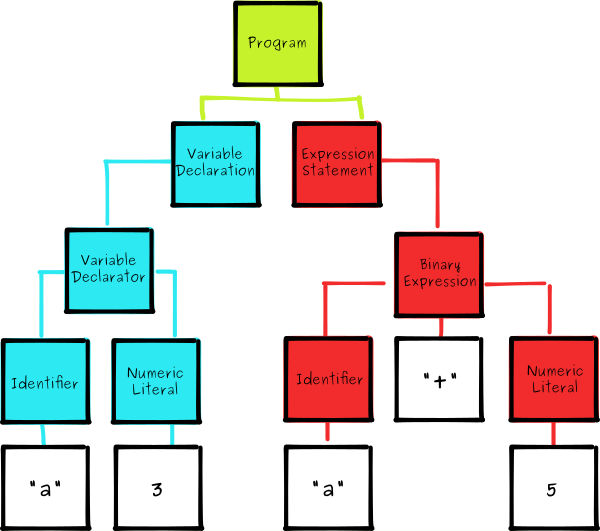

#	解释型语言

##	*Abstarct Syntax Tree*

*AST*：抽象语法树，源代码的抽象语法结构的树状表示形式

-	基本上语言中每种结构都与一种AST对象相对应

	-	不同解释器会有独有的AST格式

-	AST定义了代码的结构，可以通过操纵AST，精准定位到各种语句
	，实现

	-	代码分析、检查：语法、风格、错误提示
	-	代码结构优化：代码格式化、高亮、自动补全
	-	优化变更代码：改变代码结构

