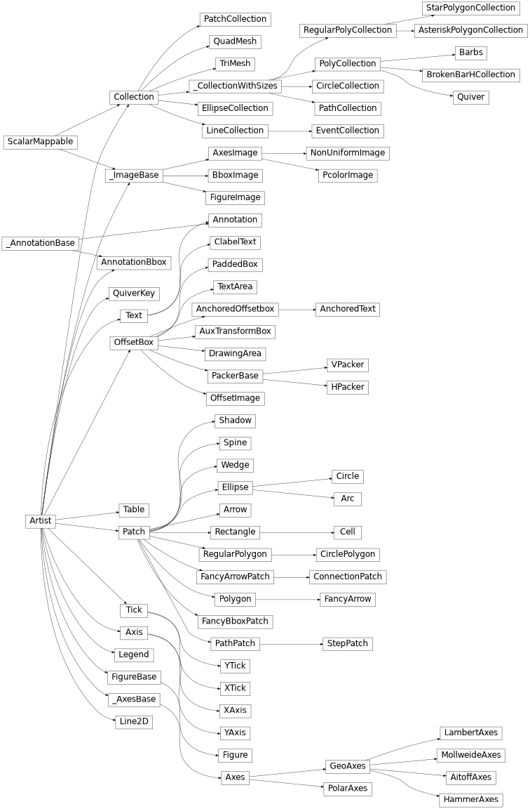
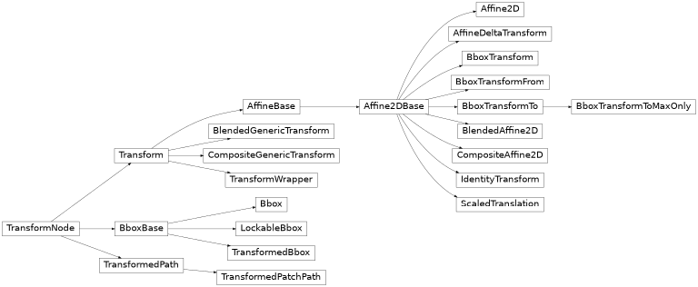

##	*Matplotlib* 基本概念

-	*Matplotlib* 中 *API* 可以分为 3 层
	-	`matplotlib.backend_bases.FigureCanvas`：画布
	-	`matplotlib.backend_basee.Render`：渲染器，在 `FigureCanvas` 上绘图
	-	`matplotlib.artist.Artist`：渲染器高级接口

-	输入数据：所有的绘制图像函数都期望 `np.array`、`np.ma.masked_array` 作为数据输入
	-	其他 `array-like` 最好显式转换为 `np.array` 类型

-	代码风格
	-	显式对象风格：创建绘图对象（也通常使用 `plt` 创建），然后用对象方法绘制图图像
	-	*MATLAB* 风格：使用全局状态、命名空间，利用 `plt` 默认句柄绘制图像

> - *Matplotlib* 用户指南：<https://matplotlib.org/stable/tutorials/>
> - *Matplotlib* 中文文档：<https://www.osgeo.cn/matplotlib/>
> - *Matplotlib* 用户指南 - 中文：<https://www.matplotlib.org.cn/tutorials/>
> - *Matplotlib* 用户指南 - 中文：<https://wizardforcel.gitbooks.io/matplotlib-user-guide/content/>
> - <https://www.matplotlib.org.cn/tutorials/introductory/usage.html>

###	`pyplot`

-	`matplotlib.pyplot`：基于状态的接口
	-	包含模仿 *MATLAB* 的一套样式函数集
		-	可直接使用缺省句柄创建 *MATLAB* 风格代码
	-	`plt` 会维护当前图窗、图像，绘制函数缺省即应用至当前图像

> - `pyplot` *API*：<https://matplotlib.org/stable/api/_as_gen/matplotlib.pyplot.html>

###	*Backend* 后端

-	*Backend*：*Matplotlib* 对不同目标的输出的支持能力
	-	后端分类
		-	用户界面后端（交互式后端）：用于 `pygtk`、`wxpython`、`tkinter`、`qt4` 等用户界面
			-	每执行命令将实时渲染图像
		-	硬拷贝后端（非交互式后端）：用于创建图像文件 `PNG`、`SVG`、`PDF`、`PS`
			-	延迟所有渲染直至手动调用 `.show()` 方法
	-	后端按以下优先级被指定
		-	`matplotlib.use` 函数
		-	`MPLBACKEND` 环境变量
		-	`rcParams["backend"]`
		-	缺省将探测系统支持的 *Agg* 后端（依赖 *Anti-Grain Geometry* C++ 库）
			-	优先考虑交互式后端：*MacOSX*、*QtAgg*、*GTKAgg*、*Gtk3Agg*、*TkAgg*、*WxAgg*
			-	最后考虑非交互式后端 *Agg*

> - *Backend*：<https://matplotlib.org/stable/users/explain/backends.html>

####	*Render*、*Canvas*

-	*Matplotlib* 将后端拆分为渲染器、画布两部分概念，方便定制 *GUI*
	-	渲染器：绘图工具
		-	渲染器自身单独即可作为非交互式后端，直接渲染、生成对应文件
		-	不同渲染器对画布的支持程度不同
			-	*Agg* 渲染器： 支持包括 *MacOS* 在内的多数 *GUI*
			-	*Cairio* 渲染器：支持 *GTK3+* 后端 `GTK3Cairo`
	-	画布：绘图位置，包括各种图形界面

|渲染器|文件类型|描述|
|-----|-----|-----|
|`AGG`|`png`|高质量位图|
|`PDF`|`pdf`|位图|
|`PS`|`ps`、`eps`|矢量图|
|`SVG`|`svg`|矢量图|
|`PGF`|`pgf`、`pdf`|矢量图，基于 `pgf` 包|
|`Cairo`|`png`、`ps`、`pdf`、`svg`|位图、矢量图，基于 `Cairo` 库|

|后端|渲染器|画布|依赖|*IPython*、*Jupyter* 激活魔法|
|-----|-----|-----|-----|-----|
|*QtAgg*|*Agg*|*Qt*|`PyQt`、`PySide`|`%matplotlib qt`|
|*ipympl*|*Agg*|*Jupyter Widget*|`ipympl`|`ipympl`|
|*GTK3Agg*|*Agg*|*GTK3.X*|`PyGObject`、`pycairo`、`cairocffi`|`gtk3`|
|*GTK4Agg*|*Agg*|*GTK4.X*|`PyGObject`、`pycairo`、`cairocffi`|`gtk4`|
|*macosx*|*Agg*|*Cocoa*| |`osx`|
|*TkAgg*|*Agg*|*Tk*|`TkInter`|`tk`|
|*nbAgg*|*Agg*|*Jupyter Classic NB*| |`notebook`|
|*WebAgg*|*Agg*|*Tornado* 服务器| | |
|*GTK3Cairo*|*Cairo*|*GTK3.X*|`PyGObject`、`pycairo`、`cairocffi`| |
|*GTK4Agg*|*Agg*|*GTK4.X*|`PyGObject`、`pycairo`、`cairocffi`| |
|*wxAgg*|*Agg*|*wxWidgets*|`wxPython4`|`wx`|

###	*Artist* 组件



-	*Artist*：表示图像元素的高级组件，每个图像元素都是 *Artist*，渲染时被绘制至画布上
	-	*Primitives* 基本组件：绘制至画布的标准图形对象
		-	`lines.Line2D`
		-	`patches.Rectangle`
		-	`patches.Circle`
		-	`text.Text`
		-	`image.AxesImage`
	-	*Containers* 容器组件：存储基本组件的组件
		-	`Figure`：图窗，整个图像窗口，组织所有 `Axes`
		-	`Axes`：轴域，即坐标轴张成的区域，图像绘制的范围
			-	图窗可包含多个图像，但是图像只能属于一个图窗
		-	`Axis`：数轴，用于设置、定位图像范围、标志
			-	单张图像包含两根数轴

###	图像绘制

-	图像绘制：将 *Artist*（即 `Figure` 及其包含的组件）在窗口画布中绘制
	-	即，组件属性（对象状态）是图像绘制的核心需求
		-	图表均可通过基本组件组合构成
		-	容器组件核心即在组件粒度上维护组件、组合方式，而非图表粒度
	-	而，组件的绘图仅是创建组件、配置组件、组合组件的封装
		-	事实上，可通过少数方法直接操作组件实现绘制，但很繁琐
		-	`Axes` 是存储图表组件的基本容器，也即绘制图表的核心

##	`Artist` 组件

-	`Artist` 类、`artist` 模块具备的所有组件通用的方法、函数
	-	组件实例往往具有 `_<PROP>` 属性
		-	属性值除可直接访问获取外
			-	`Artist.get_<PROP>()`
			-	`artist.getp()`：查看指定对象全部属性
		-	属性置设置方式
			-	组件实例化时传参 `<PROP>`
			-	`Artist.set_<PROP>()`：常与 `get_<PROP>` 对应，入参即其返回值
			-	`Artist.set()`：支持关键字风格设置属性
			-	`artist.setp()`：支持位置参数、关键字参数风格
		-	全局配置
			-	`mpl.rcParams`
			-	样式稿
			-	`matplotlibrc`

> - *Artist API*：<https://matplotlib.org/stable/api/artist_api.html>
> - *Artist* 组件：<https://www.matplotlib.org.cn/tutorials/intermediate/artists.html>
> - *Artist* 组件：<https://matplotlib.org/stable/tutorials/intermediate/artists.html>

###	交互式

|*Interactive* 属性、方法|描述|返回值|说明|
|-----|-----|-----|-----|
|`add_callback(func)`|监听组件属性改变|`int`| |
|`remove_callback(oid)`|移除回调| | |
|`pchanged()`|触发所有注册回调| | |
|`get_cursor_data(event)`|为事件获取指针数据| |子类可覆盖、需确保 `format_cursor_data` 可转换|
|`format_cursor_data(data)`|转换为字符串| |默认实现为 `,` 分隔字符串|
|`contains(mouseevent)`|组件是否包含鼠标事件| | |
|`pick(mouseevent)`|执行选取事件| | |
|`pickable()`|是否可被选取| | |
|`set_picker(picker)`|定义组件选取事件行为|`float`、`callable`| |
|`mouseover`|设置是否可触发鼠标悬停| | |

###	裁切、变换

|*Clipping* 属性、方法|描述|返回值|说明|
|-----|-----|-----|-----|
|`set_clip_on(b)`|设置组件是否允许裁切|`bool D=0`|属性 `_clipon`|
|`set_clip_box(clipbox)`|设置组件 `Bbox` 裁切|`mpl.transform.Bbox`| |
|`set_clip_path(path,transform=None)`|设置组件路径裁切|`Patch`、`TransformedPath`|属性 `_clip_path`|

|*Transform* 方法|描述|返回值|说明|
|-----|-----|-----|-----|
|`set_transform(t)`|设置组件变换|`Transform`|属性 `_transform`|
|`is_transform_set()`|组件是否被显式设置变换|`bool D=0`| |
|`convert_xunits(x)`|转换为 *X* 轴坐标系统| | |
|`convert_yunits(y)`|转换为 *Y* 轴坐标系统| | |
|`have_units()`|坐标轴有设置坐标系统|`bool`| |

###	通用属性设置

|属性、设置方法|描述|返回值|说明|
|-----|-----|-----|-----|
|`update(props)`|更新属性| | |
|`update_from(other)`|从其他组件更新属性| | |
|`properties()`|返回组件属性|`{}`| |
|`set(**kwargs)`|设置属性| | |
|`artist.get(obj[,property])`、`getp()`|打印组件属性| |常用于交互式场合|
|`artist.setp(obj,*args,[file,...])`|设置（多）组件（多）属性| |支持位置、关键字风格|

###	绘制属性

|绘图属性设置|描述|返回值|说明|
|-----|-----|-----|-----|
|`draw(renderer)`|用渲染器绘制| | |
|`set_animated(b)`|用于动画|`bool D=0`|属性 `_animated`|
|`set_alpha(alpha)`|设置透明度|`float D=0`|属性 `_alpha`、部分后端支持|
|`set_snap(b)`|将像素间线对齐至像素|`bool D=0`|属性 `_snap`、*Agg*、*MacOSX* 支持|
|`set_visible(b)`|可见性|`bool D=0`|属性 `_visiable`|
|`set_zorder(level)`|层叠层级|`float D=0`|属性 `zorder`，同类组件默认值相同|
|`set_agg_filter(filter_func)`| |`callable`|属性 `_agg_filter`|
|`set_sketch_params([scale,length, randomness])`| |`bool D=0`| |
|`set_rasterized(rasterized)`|强制将矢量图转换为位图绘制|`bool D=0`|属性 `_rasterized`|
|`set_path_effects(path_effects)`|路径效果|`[patheffects.AbstractPathEffect]`|属性 `_path_effects`|
|`get_window_extent(renderer)`|获取组件绘制边界|`bool D=0`| |
|`get_transformed_clip_path_and_affine()`|分开获取变换、未变换裁切路径|`bool D=0`| |
|`artist.allow_rasterization(draw)`|`draw` 方法装饰器| |设置绘制前、后逻辑|

|其他属性、函数|描述|返回值|说明|
|-----|-----|-----|-----|
|`sticky_edges`|粘性边界范围|`_XYPair`|不可直接赋值，可通过切片在位修改|
|`set_in_layout(in_layout)`|包含进布局计算中|`bool D=0`| |
|`stale`|组件需重绘以匹配其内部状态| | |

-	粘性边界：设置 `Axes` 边界紧贴粘性边界（即，可无效 `margin` 等设置）
	-	组件粘性边界生效说明
		-	各组件可分别设置 `X,Y` 粘性上、下边界，共上、下、左、右 4 条
		-	各方向粘性边界仅在超过对应组件各方向最外侧值才有效
		-	各方向有效粘性边界中，最内侧值被作为最终粘性边界
	-	`Axes` 中此属性不生效
		-	且，需置位 `use_sticky_edges` 启用粘性边界

###	组件、组件元数据

|`Figure`、`Axes` 组件相关方法|描述|返回值|说明|
|-----|-----|-----|-----|
|`remove()`|从 `Fig` 中移除| | |
|`Axes`|组件所属 `Axes`| | |
|`set_figure(fig)`|设置组件所属 `Fig`|`Figure`| |
|`get_children()`|获取子组件|`[]`|无对应属性，但可以在属性结果中看到|
|`find_obj([match,include_self])`|获取匹配的子组件|`[]`| |

|组件元数据|描述|返回值|说明|
|-----|-----|-----|-----|
|`set_gid(gid)`|组 *ID*| |`int D=0`|属性 `_gid`|
|`set_label(s)`|图例标签|`str`|属性 `_label`|
|`set_url(url)`|组件 *URL*|`str`|属性 `_url`|

##	`Figure`

-	`figure.Figure([figsize,dpi,facecolor,...])`：顶级容器组件，包含图窗中所有内容
	-	`Figure` 主要即维护其中包含的 `Axes`，存储在 `Figure.axes` 属性中
		-	不应直接操作 `Figure.axes` 属性以添加、删除
			-	维护有 “当前 `Axes`” 以支持 `pyplot` 状态机
		-	可通过 `add_subplot`、`add_axes`、`delaxes` 等方法设置
			-	会对添加的 `Axes` 做一定变换以适应 `Figure`
		-	可迭代 `axes` 属性定制包含的 `Axes`
	-	`Figure` 维护有 `images`、`lines`、`patches`、`text` 属性
		-	可直接向其中添加基本组件
			-	但此操作默认会修改 `Figure` 的坐标系统为像素坐标
			-	可通过设置基本组件 `transform` 属性控制坐标系统的修改
		-	通过 `Figure` 级别的方法添加组件则可保持比例坐标

> - *Figure API*：<https://matplotlib.org/stable/api/figure_api.html>

###	`Figure` 组件管理

|`Figure` 组件管理|描述|返回值|说明|
|-----|-----|-----|-----|
|`add_artist(artist[,clip])`|添加组件|组件|极少使用，除非需要直接添加组件|
|`add_axes([rect/ax],*[,projection,polar,axes_class,...])`|添加轴域|`Axes`| |
|`delaxes(ax)`|移除轴域| | |
|`gca(*[adjustable,agg_filger,...])`|获取当前 `Axes`|`Axes`| |
|`sca(a)`|设置当前 `Axes` 并返回|`Axes`| |
|`colorbar(mappable[,cax,ax,...])`|添加色带|`ColorBar`|`plt` 中包含对应函数|
|`legend(handles,labels,**kwargs)`|添加图例|`Legend`| |
|`figimage(X[,xo,yo,alpha,norm,...])`|添加未重抽样图像|`image.FigureImage`| |
|`text(x,y,s[,fontdict],*[,...])`|添加文字|`Text`| |
|`findobj([match,include_self])`|寻找组件|`[Artist]`| |
|`clear(keap_observers=False)`、`clf()`|清空图窗| | |

###	`Figure` 布局

####	图窗布局

|`Figure` 图窗布局|描述|返回值|说明|
|-----|-----|-----|-----|
|`subfigures([nrows,ncols,squeeze,...])`|添加子图| | |
|`add_gridspec([nrows,ncols,...])`|添加布局|`GridSpec`| |
|`add_subfigure(subplotspec,*[,...])`|添加子图|`Subfigure`| |
|`add_subplot([rci/nrows,ncols,index/pos/ax],*[,projection,...])`|添加轴域|`Axes`|`plt.subplot`、`plt.subplot2grid`|
|`subplot_mosaic(mosaic,[sharex,sharey,...])`|根据字符图、嵌套列表确定布局|`{<LABEL>:Axes}`|`plt.subplot_mosaic`|
|`subplots([nrows,ncols],*[,sharex,...])`|添加子图|`plt.subplots`|
|`subplots_adjust([left,bottom,...])`|调整子图布局| |`plt.subplots_adjust`，调用后将取消 `contrained_layout`|

####	布局属性

|`Figure` 布局属性|描述|返回值|说明|
|-----|-----|-----|-----|
|`set_tight_layout(tight)`|紧凑布局启用、配置| |属性 `_tight`|
|`tight_layout(*[,pad,h_pad,...])`|调整轴域边距| |属性 `_tight_parameters`|
|`set_constrained_layout([constrained])`|置位、设置紧凑布局| |属性 `_constrained`|
|`set_constrained_layout_pads(* [,w_pad,h_pad,wspace,hspace])`|设置紧凑布局| |属性 `_constrained_layout_pads`|
|`execute_constrained_layout([renderer])`|根据布局确定位置| | |

####	标注、文字

|`Figure` 标注、文字|描述|返回值|说明|
|-----|-----|-----|-----|
|`suptitle(t,*[,x,y,...])`|图窗正中添加标题|`Text`| |
|`supxlabel(t,*[,x,y,...])`|图窗正中添加 *X* 标签|`Text`| |
|`supylabel(t,*[,x,y,...])`|图窗正中添加 *Y* 标签|`Text`| |
|`text(x,y,s[,fontdict,...])`|添加文字|`Text`| |
|`align_labels(axs)`|对齐标签| | |
|`align_xlabels(axs)`|对齐标签| | |
|`align_ylabels(axs)`|对齐标签| | |
|`autofmt_xdate([bottom,rotation,ha,which])`|自动旋转、对齐| | |

###	`Figure` 整体

|`Figure` 属性、方法|描述|返回值|说明|
|-----|-----|-----|-----|
|`set_dpi(val)`|分辨率| |属性 `dpi`|
|`set_edgecolor(color)`|边框颜色| |属性无|
|`set_facecolor(color)`|背景色| |属性无|
|`set_frameon(b)`|背景块可见|`bool D=0`|属性 `frameon`|
|`set_figheight(val[,forward])`|高|`int`|属性无，英寸坐标系|
|`set_figwidth(val[,forward])`|宽|`int`|属性无，英寸坐标系|
|`set_size_inches(w[,h,forward])`|宽、高|`ndarray`|属性无，英寸坐标系|
|`patch`|图窗整体背景|`Rectangle`| |
|`suppressComposite`|禁止图片组合|`bool`| |

####	列表属性

|`Figure` 列表属性|描述|返回值|说明|
|-----|-----|-----|-----|
|`artists`|包含的组件列表| | |
|`axes`|`Axes` 实例列表|包括子图| | |
|`legends`|`Legend` 实例列表| |与 `Axes.legends` 不同|
|`lines`|`Line2D` 实例列表| | |
|`images`|`FigureImage` 实例列表| | |
|`patches`|`Patch` 实例列表| |少见|
|`texts`|`text` 实例列表| | |

-	不建议直接修改 `Figure` 各列表属性，行为较复杂
	-	`Figure` 按照 `children` 属性绘制结果
		-	`children` 按 `patch`、`artists`、布局 `Axes`、其余列表属性顺序组合列表
		-	故，除 `artists` 列表外，直接修改情况下其余列表行为类似
		-	但，考虑到组件绘制先后决定覆盖关系，需配合 `zorder` 才可符合需求
	-	`add_artist()` 等方法包含一定配置逻辑（不同方法配置逻辑有差异）
		-	坐标系统变换：未正确设置组件可能无法正常绘制
		-	数据范围设置：影响视图范围

####	`Figure` *I/O*

|`Figure` 整体方法|描述|返回值|说明|
|-----|-----|-----|-----|
|`draw_artist(a)`|绘制单独组件| | |
|`show(warn=True)`|展示图窗窗口| |使用 *GUI* 后端时|
|`savefig(fname[,dpi,transparent,...])`|保存图窗| | |

##	`Axes`

-	`matplotlib.axes.Axes(fig,rect,[,facecolor,...])`：轴域，容纳、控制图像中大部分组件
	-	`Figure`、`Axes` 一般不直接实例化，而通过布局函数创建
	-	一般的，`Axes` 是绘图的核心容器，常通过帮助方法创建、添加、控制组件
		-	绘图方法将创建相应基础组件，并添加至 `Axes` 相应属性中
		-	`Axes` 有控制包含组件的帮助方法，用于定制包含的组件
	-	不推荐直接操作 `lines`、`patches` 属性
		-	因为 `Axes` 需要为添加组件做前置工作
			-	设置组件 `figure`、`axes` 属性
			-	设置组件 `transform`
			-	检查组件数据，并相应更新 `Axes` 中缩放配置以适应
		-	若必须，可自行创建组件，然后通过 `add_line`、`add_patch` 等帮助方法添加组件

> - *Axes API*：<https://matplotlib.org/stable/api/axes_api.html>

###	绘图

-	绘制方法说明
	-	坐标系统：未特别声明时，均表示为数据坐标系

####	基本图

|`Axes` 线图|描述|返回值|说明|
|-----|-----|-----|-----|
|`plot(([x,]y[,fmt])+,*[,scalex,scaley,...])`|线、标记图|`[line.Line2D]`| |
|`loglog((x,y[,fmt])+,*[,data,...])`|*Log* 坐标轴的线、标记图|`[line.Line2D]`| |
|`semilogx((x,y[,fmt])+,*[,data,...])`|*LogX* 轴的线、标记图|`[line.Line2D]`| |
|`semilogy((x,y[,fmt])+,*[,data,...])`|*LogY* 轴的线、标记图|`[line.Line2D]`| |
|`errorbar(x,y[,yerr,xerr,fmt,...])`|带误差的线、标记图|`container.ErrorbarContainer`| |

|`Axes` 条形图|描述|返回值|说明|
|-----|-----|-----|-----|
|`bar(x,height[,width,bottom],*[,align,...])`|条形图|`container.BarContainer`| |
|`barh(y,width[,height,left],*[,align,...])`|竖直条形图|`container.BarContainer`| |
|`broken_barh(xrange,yrange,*[,data,...])`|水平间断条形图|`collections.BrokenBarHCollection`| |
|`bar_label(container[,label],*[,fmt,...])`|条形图标签|`[text.Text]`| |

|`Axes` 填充图|描述|返回值|说明|
|-----|-----|-----|-----|
|`fill_between(x,y1[,y2,where,...])`|填充 *Y* 方向区域|`collections.PolyCollection`| |
|`fill_betweenx(x,y1[,y2,where,...])`|填充 *X* 方向区域|`collections.PolyCollection`| |
|`stackplot(x,(y)+,*[,labels,colors,...])`|区域堆叠图|`[collection.Collection]`| |
|`fill((x,y[,color])+,*[,data,...])`|填充多边形|`[patches.Polygon]`| |

|`Axes` 其他图|描述|返回值|说明|
|-----|-----|-----|-----|
|`eventplot(positions[,orientation,lineoffsets...])`|栅格图|`[collections.EventCollection]`|平行段|
|`stem([loc,]head,*[,linefmt,markerfmt,...])`|树干图|`container.StemContainer`|竖线|
|`pie(x[,explode,labels,colors,...])`|饼图|`[patches.Wedge],[text.Text]`| |
|`scatter(x,y[,s,c,marker,cmap,...])`|散点图|`collections.PathCollection`| |
|`step((x,y[,fmt])+,*[,where,data,...])`|台阶图|`[line.Line2D]`| |
|`stairs(values[,edges],*[,orientation,...])`|填充的台阶图|`StepPatch`| |

|`Axes` 直线|描述|返回值|说明|
|-----|-----|-----|-----|
|`vlines(x,ymin,ymax[,colors,linestyles,...])`|竖直线|`collections.LineCollection`| |
|`hlines(x,xmin,xmax[,colors,linestyles,...])`|水平线|`collections.LineCollection`| |
|`axhline([y,xmin,xmax,...])`|水平线|`Line2D`|延伸方向为轴域坐标系，下同|
|`axvline([x,ymin,ymax,...])`|竖直线|`Line2D`| |
|`axhspan(ymin,ymax[,xmin,xmax,...])`|水平区域|`Polygon`| |
|`axvspan(xmin,xmax[,ymin,ymax,...])`|竖直区域|`Polygon`| |
|`axline(xy1,xy2,*[,slope,...])`|任意方向直线|`Line2D`| |

> - 基本绘图 1：<https://matplotlib.org/stable/api/axes_api.html#basic>
> - 基本绘图 2：<https://matplotlib.org/stable/api/axes_api.html#spans>

####	统计图

|`Axes` 统计图|描述|返回值|说明|
|-----|-----|-----|-----|
|`boxplot(x[,notch,sym,vert,....])`|箱线图|`{}`| |
|`bxp(bxpstats[,positions,widths,...])`|箱线图|`{}`| |
|`violinplot(dataset[,positions,vert,...])`|小提琴图|`{}`| |
|`violin(vpstats[,positions,vert,...])`|小提琴图|`{}`| |
|`hist(x[,bins,range,density,...])`|直方图|`n,bins,patches`| |
|`hist2d(x,y[,bins,range,density,...])`|2维直方图|`h,xedges,yedges,QuadMesh`| |
|`hexbin(x,y[,C,gridsize,bins,...])`|六边分箱图|`PolyCollection`| |

> - 统计图 1：<https://matplotlib.org/stable/api/axes_api.html#statistics>
> - 统计图 2：<https://matplotlib.org/stable/api/axes_api.html#binned>

####	*2D* 数组

|`Axes` 图像|描述|返回值|说明|
|-----|-----|-----|-----|
|`imshow(X[,cmap,nrom], *[,aspect,...])`|展示为图片|`AxesImage`| |
|`matshow(Z[,...])`|展示为图片|`AxesImage`|`imshow` 的方便封装|
|`spy(Z[,precision,marker,...])`|空缺标记图|`AxesImage`、`Line2D`| |

|`Axes` 等高线图|描述|返回值|说明|
|-----|-----|-----|-----|
|`contour([X,Y,]Z[,levels], *[,data,...])`|等高线图|`contour.QuadContourSet`|
|`contourf([X,Y,]Z[,levels], *[,data,...])`|填充的等高线图|`contour.QuadContourSet`|
|`clabel(CS[,Levels,,...])`|等高线标签|`text.Text`|

|`Axes` 四边|描述|返回值|说明|
|-----|-----|-----|-----|
|`pcolor([X,Y,]C,*[,shading,...])`|四边网络|`Collection`|大数组时较慢|
|`pcolorfast([X,Y,]C,*[,alpha,...])`|四边色块网络|`AxesImage`、`PcolorImage`、`QuadMesh`|快速版本|
|`pcolormesh([X,Y,]C,*[,alpha,...])`|四边色块网络|`QuadMesh`|速度更快|

|`Axes` 三角|描述|返回值|说明|
|-----|-----|-----|-----|
|`triplot(triangles,*[,alpha,...])`|三角网络|`lines,maskers`| |
|`tripcolor(triangles,C,*[,alpha,...])`|三角色块网络|`PolyCollection`| |
|`tricontour(triangles,Z[,levels], *[,alpha,...])`|三角等高线|`TriContourSet`| |
|`tricontourf(triangles,Z[,levels], *[,alpha,...])`|填充的三角等高线|`TriContourSet`| |

-	*Tri* 三角网格绘图
	-	参数 `triangles` 用于确定绘制的三角形，可为
		-	`tri.Triangulation` 实例
		-	`X,Y[,triangles,mask]` 位置参数：隐式调用 `tri.Triangulation` 构造
	-	给定一组顶点无法唯一确定三角网格（与四边网格不同）
		-	需，给定三角网格联结方式，即 `triangles` 参数
		-	或，缺省使用 *Delaunay Triangulation* 确定三角网格

> - 等高线图：<https://matplotlib.org/stable/api/axes_api.html#contours>
> - 四边图：<https://matplotlib.org/stable/api/axes_api.html#d-arrays>
> - 三角图：<https://matplotlib.org/stable/api/axes_api.html#unstructured-triangles>
> - *Delaunay Triangulation*：顶点中没有点严格处于任意三角形外接圆内部的三角剖分
> - *Triangle API*：<https://matplotlib.org/stable/api/tri_api.html>

####	谱、场

|`Axes` 谱绘制|描述|返回值|说明|
|-----|-----|-----|-----|
|`acorr(x,*[,data,...])`|自相关图|`lags,c,LineCollection,Line2D`| |
|`xcorr(x,y[,normed,...])`|互相关图|`lags,c,LineCollection,Line2D`| |
|`angle_spectrum(x[,Fs,Fc,...])`|角谱图|`spectrum,freqs,Line2D`| |
|`magnitude_spectrum(x[,Fs,Fc,...])`|振幅频谱图|`spectrum,freq,Line2D`| |
|`phrase_spectrum(x[,Fs,Fc,...])`|相位谱图|`spectrum,freq,Line2D`| |
|`cohere(x,y[,NFFT,Fs,...])`|相关系数|`Cxy,freqs`| |
|`psd(x[,NFFT,Fs,Fc,...])`|谱密度|`Pxx,freqs,Line2D`| |
|`csd(x,y[,NFFT,Fs,Fc,...])`|跨谱密度|`Pxy,freqs,Line2D`| |
|`specgram(x[,NFFT,Fs,Fc,...])`|时频谱|`Pxx,freqs,t,AxesImage`| |

####	标记图

|`Axes` 标记图|描述|返回值|说明|
|-----|-----|-----|-----|
|`quiver([X,Y],U,V[,C],*[,data,...])`|（场）箭头图|`quiver.Quiver`|`U,V` 表方向|
|`quiverkey(Q,X,Y,U,label[,...])`|箭头图标签|`quiver.Quiver`| |
|`barbs([X,Y],U,V[,C],*[,data,...])`|（风）鱼钩图|`quiver.Barbs`| |
|`streamplot(X,Y,U,V[,density,...])`|气流图|`containers.StreamplotSet`| |

> - 标记：<https://matplotlib.org/stable/api/axes_api.html#vector-fields>

###	文字、注解

|`Axes` 文字|描述|返回值|说明|
|-----|-----|-----|-----|
|`set_title()`|标题| | |
|`text(x,y,s[,fontdict,...])`|文字|`text.Text`| |
|`annotate(text,xy[,xytext,...])`|注解|`text.Annotation`| |
|`table(cellText/cellColours[,cellLoc,...])`|表格|`table.Table`| |
|`arrow(x,y,dx,dy[,...])`|箭头|`patches.FancyArrow`| |

> - 文字、注解：<https://matplotlib.org/stable/api/axes_api.html#text-and-annotations>

####	子图

|`Axes` 子图|描述|返回值|说明|
|-----|-----|-----|-----|
|`inset_axes(bounds,*[,transform,zorder,...])`|嵌入子图|`Axes`| |
|`indicate_inset(bounds[,inset_ax],*[,...])`|指示、连接线|`rectangle_patch,connector_lines`| |
|`indicate_inset_zoom(inset_ax[,...])`|指示、连接线|`rectangle_patch,connector_lines`|同上，但根据子图范围自动选择原图范围|

####	*Legend*

|`Axes` 图例|描述|返回值|说明|
|-----|-----|-----|-----|
|`legend([[handles,]labels],[loc,bbox_toanchor,...])`|添加图例|`Legend`|`plt` 包含对应函数|
|`get_legend()`|获取图例|`Legend`| |
|`get_legend_handles_labels([legend_handler_map])`|获取绘制图例的句柄、标签|`handles,labels`| |

###	轴域设置

|`Axes` 轴域样式|描述|返回值|说明|
|-----|-----|-----|-----|
|`clear()`、`cla()`|清空轴域| | |
|`set_facecolor(b)`|设置前景色|`bool D=0`| |
|`set_frame_on(b)`|绘制轴域背景|`bool D=0`| |
|`set_axis_off()`|展示轴| |无 `get_`|
|`set_axis_on()`|隐藏轴| |无 `get`|
|`patch`|轴域整体背景|`Rectangle`| |
|`grid([visible,which,axis,...])`|网格线| | |
|`set_prop_cycle(cycler/labels,values/label=value1)`|设置样式循环| | |
|`name`|`"rectilinear"`| | |

-	说明
	-	`_x<PROP>()` 方法若无特殊说明有对应 `_y<PROP>()` 版本
	-	`set_<PROP>()` 方法若无特殊说明有对应 `get_<PROP>()` 版本

####	数据、视图范围

|`Axes` 轴、轴域范围|描述|返回值|说明|
|-----|-----|-----|-----|
|`dataLim`|数据绘制限制框|`transform.Bbox`| |
|`viewLim`|图像展示限制框|`transfrom.Bbox`| |
|`update_datalim(xys[,updatex,updatey])`|扩展 `dataLim` 以包含给定点| |属性 `dataLim`|
|`set_xlim([left,right,emit,auto],*[,...])`|*X* 视图范围|`tuple`|属性 `viewLim`|
|`set_xbound([lower,upper])`|*X* 视图范围| |类似 `xlim(auto=True)`，不修改|
|`relim([visible_only])`|重算数据范围| | |
|`autoscale([enable,axis,tight])`|自动调整数据范围| | |
|`autoscale_view([tight,scalex,scaley])`|根据 `dataLim` 调整 `viewLim`| | |
|`set_autoscale_on(b)`|自动设置视图范围|`bool D=0`|复位则需手动调用 `autoscale_view`|
|`set_autoscalex_on(b)`|自动设置视图范围|`bool D=0`|同上|
|`set_xscale(value[,...])`|*X* 轴尺度| | |
|`margins((margins/x,y)[,tight])`|获取、设置外边界|`tuple`|轴域坐标系统|
|`set_xmargins(m)`|*X* 外边界| |无 `get_`|
|`set_aspect(aspect[,adjustable,anchor,share])`|数据、视图比例|`float`、`str`| |
|`set_box_aspect([aspect])`|视图比例|`float`|`get_data_ratio()`|
|`set_adjustable(adjustable[,share])`|数据、或视图自动调整符合比例|`str`| |
|`apply_aspect([position])`|应用数据比例| |绘制 `Axes` 前会自动调用|
|`use_sticky_edges`|自动缩放时是否遵循粘性边界| | |

-	说明
	-	`viewLim`、`dataLim` 区别
		-	`dataLim`：轴域中根据数据绘制图像的范围
		-	`viewLim`：轴域中各轴向的范围，在 `dataLime` 上叠加 *margin* 等因素
	-	数据范围、视图范围说明
		-	`relim()` 适用于以下场合
			-	组件在创建、添加完毕后手动调用 `set_data()` 方法修改其包含数据
		-	`set_xlim(auto=True)`、`set_xbound()` 后
			-	绘制方法会自动更新数据范围、视图范围
			-	但，`add_<ARTIST>` 方法不会自动更新
		-	`autoscale()` 较 `set_xlim` 触发逻辑更底层
			-	即使，`add_<ARTIST>` 方法也会自动更新数据范围、视图范围
		-	综上，最好在最后设置轴域范围，避免奇怪问题

> - 轴范围：<https://matplotlib.org/stable/api/axes_api.html#axis-limits-and-direction>
> - 轴尺度：<https://matplotlib.org/stable/api/axes_api.html#axis-scales>
> - 轴自动范围：<https://matplotlib.org/stable/api/axes_api.html#autoscaling-and-margins>
> - 轴域比例：<https://matplotlib.org/stable/api/axes_api.html#aspect-ratio>

###	轴

|`Axes` 轴|描述|返回值|说明|
|-----|-----|-----|-----|
|`axis([xmin,xmax,ymin,ymax], *[,emit,on,...])`|获取、设置轴属性| | |
|`get_xaxis()`|获取 *X* 轴| |不推荐，建议 `ax.xaxis` 属性|
|`xaxis`|*X* 轴|`XAxis`| |
|`yaxis`|*Y* 轴|`YAxis`| |
|`spines`|各轴轴线|`{str:<Spine>}`| |
|`set_axisbelow(b)`|轴标线在下|`bool D=0`| |
|`invert_xaxis()`|反转 *X* 轴| | |
|`xaxis_inverted()`|*X* 轴是否反转| | |
|`secondary_xaxis(location[,funtions,...])`|次 *X* 轴|`axes._secondary_axes.SecondaryAxis`| |
|`secondary_yaxis(location[,funtions,...])`|次 *Y* 轴|`axes._secondary_axes.SecondaryAxis`| |

> - 轴样式：<https://matplotlib.org/stable/api/axes_api.html#axis-labels-title-and-legend>

####	轴刻度、标签

|`Axes` 轴刻度、标签|描述|返回值|说明|
|-----|-----|-----|-----|
|`set_xlabel(xlabel[,fontdict,labelpad,...])`|*X* 轴标签| | |
|`set_xticks(ticks[,labels],*[,minor,...])`|*X* 轴刻度| | |
|`set_xticklabels(labels,*[,fontdict,...])`|*X* 轴刻度标签| | |
|`get_xmajorticklabels()`|*X* 轴主刻度标签|`[Text]`| |
|`get_xminorticklabels()`|*X* 轴次刻度标签|`[Text]`| |
|`get_xgridlines()`|*X* 轴网格线|`[Line2D]`| |
|`get_xticklines()`|*X* 轴刻度线|`[Line2D]`| |
|`xaxis_date([tz])`|*X* 轴刻度、标签将数据为日期| | |
|`minorticks_off()`|移除次刻度| | |
|`minorticks_on()`|展示次刻度| | |
|`ticklabel_format(*[,axis,style,...])`|刻度标签格式| | |
|`tick_params([axis,...])`|设置刻度样式| | |
|`locator_params([axis,tight,...])`|设置主刻度位置行为| | 

> - 轴刻度：<https://matplotlib.org/stable/api/axes_api.html#ticks-and-tick-labels>

####	共享轴域

|共享轴域|描述|返回值|说明|
|-----|-----|-----|-----|
|`twinx()`|复制重合轴域，共享 *X* 轴|`Axes`| |
|`sharex(other)`|共享 *X* 轴尺度|`Axes`|不可重复共享|
|`get_shared_x_axes()`|共享 *X* 轴的轴域组| | |

> - 复制、共享：<https://matplotlib.org/stable/api/axes_api.html#twinning-and-sharing>

####	轴域位置

|轴域位置|描述|返回值|说明|
|-----|-----|-----|-----|
|`set_anchor(anchor[,share])`|轴域锚点|`(float,float)`、`str`|属性 `_anchor`，英寸坐标系，尤固定比例后|
|`set_axes_locator(anchor[,share])`|轴域定位|`callable`| |
|`set_position(pos[,which])`|轴域位置|`Bbox`|属性 `_position`，图窗坐标系，尤固定比例后|
|`reset_position()`|重置活动位置为原始位置|

> - 轴域位置：<https://matplotlib.org/stable/api/axes_api.html#axes-position>

###	添加组件

|`Axes` 添加组件|描述|返回值|说明|
|-----|-----|-----|-----|
|`add_artist(a)`|添加组件|`Artist`|列表属性 `artists`|
|`add_child_axes(ax)`|添加 `AxesBase`| |`inset_axes` 的低层版本，列表属性 `child_axes`|
|`add_collection(collection[,autolim])`|添加 `Collection`| |列表属性 `collections`|
|`add_container(container)`|添加 `Container`| |列表属性 `containers`|
|`add_image(image)`|添加 `AxesImage`| |列表属性 `images`|
|`add_line(line)`|添加 `Line2D`| |列表属性 `lines`|
|`add_patch(p)`|添加 `Patch`| |列表属性 `patches`|
|`add_table(tab)`|添加 `Table`| |列表属性 `tables`|
|`get_images()`|获取 `images` 列表| | |
|`get_lines()`|获取 `lines` 列表| | |
|`has_data()`|是否添加有组件| | |
|`get_default_bbox_extra_artists()`|用于计算边界框的组件列表| |不包含不可见、`set_in_layout(False)` 组件|

-	`add_artist()` 方法应仅在无专门方法时使用，注意
	-	若有必要，需要手动调用 `update_dataLim` 以更新 `dataLim`
	-	若组件创建时未指定变换，将设置为 `<Axes>.transData`

> - 添加组件：<https://matplotlib.org/stable/api/axes_api.html#adding-artists>

###	绘制

|`Axes` 绘制|描述|返回值|说明|
|-----|-----|-----|-----|
|`draw_artist(a)`|绘制单独组件| | |
|`redraw_in_frame()`|高效重绘| |跳过轴刻度、标签等|
|`get_renderer_cache()`| | | |
|`set_rasterization_zorder(z)`|矢量图栅格化时 `zorder` 上限|`float`|不影响位图|
|`get_window_extent(z)`|轴域框|`BboxBase`|不包含轴、轴标签等|
|`get_tightbbox(renderer[,call_axes_locator,...])`|轴域框|`BboxBase`|包含轴、轴标签等|

###	坐标系统变换

|`Axes` 变换|描述|返回值|说明|
|-----|-----|-----|-----|
|`get_xaxis_transform([which])`|*X* 轴变换| | |
|`get_data_ratio()`|获取视图比例|`float`| |
|`get_xaxis_text1_transform(pad_points)`|*X* 轴标签变换| | |
|`get_xaxis_text2_transform(pad_points)`|*X* 次轴标签变换| | |

##	`Axis`


-	`matplotlib.axis.Axis`：`Axes` 边界的坐标轴
	-	坐标轴是成对的，其包含 `Tick` 也如此
		-	X 轴包括上、下两根
		-	Y 轴包括左、右两根
	-	`Axis` 维护刻度线、刻度标签、网格、坐标轴标签，存储的内容包括
		-	图像尺度变换、缩放、追焦所需的数据、视窗间隔
		-	控制刻度位置、展示的 `Locator`、`Formatter`

###	`Axis` 通用方法

-	说明
	-	`set_<PROP>()` 方法若无特殊说明有对应 `get_<PROP>()` 版本
	-	`_major<PROP>()` 方法若无特殊说明有对应 `_minor<PROP>()` 版本

|`Axis` 方法|描述|返回值|说明|
|-----|-----|-----|-----|
|`clear()`|清空轴| | |
|`get_scale()`|坐标尺度|`str`| |
|`set_major_locator(locator)`|主刻度位置|`ticker.Locator`| |
|`set_major_formater(formatter)`|主刻度格式|`ticker.Formater`、`str`、`callable`| |
|`set_remove_overlapping_locs(val)`|主次刻度重叠时移除次刻度| |属性 `remove_overlapping_locs`|
|`set_label_coords(x,y[,transform])`|标签坐标| |无 `get_`|
|`set_label_position(position)`|标签位置|`str`|
|`set_label_text(label[,fontdict,...])`|标签值| | |
|`get_label()`|获取标签|`Text`| |

####	刻度、刻度标签

|`Axis` 刻度、刻度标签|描述|返回值|说明|
|-----|-----|-----|-----|
|`get_major_ticks([numticks])`|主刻度|`[Tick]`| |
|`get_major_ticklabels()`|主刻度标签|`[]`| |
|`get_major_ticklines()`|主刻度线|`[]`| |
|`get_major_ticklocs()`|主刻度位置|`[]`| |
|`get_offset_text()`| | | |
|`get_tick_padding()`| | | |
|`get_ticklabels()`|刻度标签|`[Text]`| |
|`get_ticklines()`|刻度线|`[Line2D]`|同 `Axes.get_<X>ticklines()`|
|`get_ticklocs()`|刻度位置| |同 `Axes.get_<X>ticklocs()`|
|`get_gridlines()`|网格线|`[Line2D]`|同 `Axes.get_<X>gridlines()`|
|`grid([visible,which,...])`|配置网格线| |同 `Axes.grid()`|
|`set_tick_params([which,reset,...])`|刻度、刻度标签配置| |同 `Axes.tick_params()`|
|`axis_date([tz])`|刻度、刻度标签视数据为日期|`str`、`datetime.tzinfo`|同 `Axes.xaxis_date()`|

####	数据

|`Axis` 数据|描述|返回值|说明|
|-----|-----|-----|-----|
|`set_view_interval(vmin,vmax[,ignore])`|数据范围|`tuple`|供内部使用|
|`set_data_interval(vmin,vmax[,ignore])`|视图范围|`tuple`|供内部使用|
|`set_inverted(inverted)`|逆序|`bool D=0`| |

###	`XAxis` 专属

|`XAxis` 专属|描述|返回值|说明|
|-----|-----|-----|-----|
|`axis_name`|`"x"`| | |
|`get_text_heights(renderer)`|顶、底轴文字所需高度|`float,float`| |
|`set_ticks_position(position)`|刻度位置|`str`| |
|`set_label_position(posiiton)`|刻度标签位置|`str`| |
|`tick_bottom()`|移动刻度、刻度标签至底轴| | |
|`tick_top()`|移动刻度、刻度标签至顶轴| | |

###	`YAxis` 专属

|`YAxis` 专属|描述|返回值|说明|
|-----|-----|-----|-----|
|`axis_name`|`"y"`| | |
|`get_text_widths(renderer)`|左、右轴文字所需高度|`float,float`| |
|`set_ticks_position(position)`|刻度位置|`str`| |
|`set_label_position(posiiton)`|刻度标签位置|`str`| |
|`set_offset_position(position)`| |`str`| |
|`tick_left()`|移动刻度、刻度标签至左轴| | |
|`tick_right()`|移动刻度、刻度标签至右轴| | |

> - *Axis API*：<https://matplotlib.org/stable/api/axis_api.html>

##	`Tick`

-	`matplotlib.axis.Tick`：表示 `Axis` 上刻度虚拟类
	-	`Tick` 是容器组件最底层
		-	维护刻度、网格线、刻度标签
		-	一般不直接控制，而通过 `Axis` 方法控制
	-	有两个子类：`XTick`、`YTick`

|`Tick` 属性、方法|描述|返回值|说明|
|-----|-----|-----|-----|
|`tick1line`|左、上刻度线|`Line2D`| |
|`tick2line`|右、下刻度线|`Line2D`| |
|`gridline`|网格线|`Line2D`| |
|`get_loc()`|返回刻度坐标|`float`|数据坐标系统|
|`set_pad(val)`|刻度标签空白| |有 `get_`|
|`get_pad_pixels()`|刻度标签空白像素数| | |
|`get_tick_padding()`|周瑜外刻度长度| | |
|`get_tickdir()`| | | |
|`get_view_interval()`|刻度所属轴视图范围|`tuple`| |
|`set_label1(s)`|左、下刻度标签|`str`|属性 `label1`|
|`set_label2(s)`|右、上刻度标签|`str`|属性 `label2`|
|`set_url()`| | | |
|`set_position(loc)`|设置刻度位置| |数据坐标系统|

##	图像元素

###	*Legend*

-	`mpl.legend.Legend(parent,handles,labels[,loc,...])` 图例
	-	结构
		-	*Legend Entry*：组成图例的条目，由一对 *Key*、*Label* 组成
		-	*Legend Key*：图例标记，颜色、条纹标记
			-	根据 *handle* 自动生成
		-	*Legend Label*：图例标签，描述 *Key* 含义的文字
		-	*Legend Handle*：创建图例条目的目标组件（即图例中示例）
	-	常用创建方法
		-	`plt.legend()`
		-	`Axes.legend([[handles,]labels],[loc,bbox_toanchor,...])`

```python
h, l = ax.get_legend_handles_labels()
ax.legend(h, l)								# 等价于 `ax.legend()`

z = random.randn(10)
fig, ax = plt.subplots()
red_dot, = ax.plot(z, "ro", markersize=15)
white_cross, = ax.plot(z[:5], "w+", markeredgewidth=3, markersize=15)		# 设置部分点
ax.legend([red_dot, (red_dot, white_cross)], ["Attr A", "Attr A+B"])
```

> - *Legend* 引导：<https://matplotlib.org/stable/tutorials/intermediate/legend_guide.html>
> - *Axes Legend*：<https://matplotlib.org/stable/api/_as_gen/matplotlib.axes.Axes.legend.html>
> - *Legend API*：<https://matplotlib.org/stable/api/legend_api.html>
> - *Legend Handler API*：<https://matplotlib.org/stable/api/legend_handler_api.html>

###	*ColorBar*

-	`mpl.colorbar.ColorBar(ax,mappable[,cmap,....])` 色带：将标量映射至颜色的可视化呈现
	-	核心构成
		-	`mpl.cm.ScalarMappable`：色彩映射关系，决定色带基本内容
	-	常用创建方式
		-	`Figure.colorbar(mappable[,cax,ax,...])`
		-	`plt.colorbar()`

-	`matplotlib.cm.ScalarMappable([norm,cmap])` 映射：映射标量至 *RGBA* 的混合类
	-	即完成：`data -> [0,1] -> color` 流程
	-	核心构成
		-	`mpl.colors.Normlize([vmin,vmax,clip])`：正则化
		-	`mpl.colors.Colormap(name[,N])`：
	-	常用使用方法
		-	`mpl.cm.get_cmap([name,lut])`：获取预定义色带实例

```python
cmap = (mpl.colors.ListedColormap(['red', 'green', 'blue', 'cyan'])
        .with_extremes(over='0.25', under='0.75'))		# 为色带添加扩展

bounds = [1, 2, 4, 7, 8]
norm = mpl.colors.BoundaryNorm(bounds, cmap.N)
fig.colorbar(
    mpl.cm.ScalarMappable(cmap=cmap, norm=norm),
    cax=ax,
    boundaries=[0] + bounds + [13],		# 为色带扩展添加额外切分点
    extend='both',						# 扩展 *ColorBar*
    ticks=bounds,
    spacing='proportional',				# *ColorBar* 中各颜色按比例确定长度
    orientation='horizontal',
    label='Discrete intervals, some other units',
)
```


> - *ColorBar API*：<https://matplotlib.org/stable/api/colorbar_api.html>
> - *ColorBar* 引导：<https://matplotlib.org/stable/tutorials/colors/colorbar_only.html>

###	*Path*

-	`matplotlib.path.Path(vertices[,codes,...])`：绘制由线段、弧线构成的线条骨架
	-	参数说明
		-	编码支持的标准动作包括：移动、线段连接、弧线连接等
		-	`vertices` 顶点、`codes` 编码
			-	二者长度相同：`N*2`、`N*1`
			-	涉及多个顶点的编码中，多个顶点对应设置相应编码
			-	编码缺省为 `MOVETO`、一系列 `LINETO`
	-	使用说明
		-	被用于几乎所有的矢量绘制中
		-	其自身无法被直接绘制，但可通过 `PathPatch`、`PathCollection` 可视化

|动作编码|对应顶点数量|描述|
|-----|-----|-----|
|`STOP`|1|标记整条路径结束，可省略|
|`MOVETO`|1|将画笔移至指定位置|
|`LINETO`|1|从当前位置画直线至指定位置|
|`CURVE3`|2，1 控制、1 目标|根据控制顶点，绘制 2 次 *Bezier* 曲线|
|`CURVE4`|3，2 控制、1 目标|绘制 3 次 *Bezier* 曲线|
|`CLOSEPOLY`|1|画线段至多边形起始，此顶点被忽略|

> - *Path* 引导：<https://matplotlib.org/stable/tutorials/advanced/path_tutorial.html>
> - *Path API*：<https://matplotlib.org/stable/api/path_api.html>

###	*Text*

-	`mpl.text.Text([x,y,text,color,...])`：存储、绘制文字

-	`mpl.text.Annotation(text,xy[,xytext,xycoords,...])`：说明指定点 `xy` 的 `Text`
	-	参数说明
		-	`xy`：待说明点的目标位置
		-	`xytext`：解释文字的位置
	-	常用使用方式
		-	`Axes.annotate(text,xy[,xytext,...])`

> - *Text API*：<https://matplotlib.org/stable/api/text_api.html>
> - `Axes.Annotation`：<https://matplotlib.org/stable/api/_as_gen/matplotlib.axes.Axes.annotate.html>

##	布局

###	网格布局

-	`mpl.gridspec.GridSpec(nrows,ncols[,figure,...])`：指定整体网格布局
	-	其实例支持抽取、切片语法
		-	下标从 `0` 起始
		-	抽取、切片结果即 `SubplotSpec` 实例
	-	此为图窗网格布局相关的低层类，一般无需直接访问
		-	常通过 `subplots`、`subplot_mosaic`、`subfigure` 等高层方法内部调用
		-	或，`Figure.add_gridspec` 创建实例
	-	常用使用方式
		-	`Figure.add_gridspec(nrows,ncols[,...])`

-	`mpl.gridspec.SubplotSpec`：`GridSpec` 中位置（区域）
	-	可用作 `Figure.add_subplot()` 等方法参数，指定布局位置
	-	`.subgridspec(nrows,ncols[,...])` 方法：创建网格内子布局
		-	返回 `GridSpecFromSubplotSpec`

-	`mpl.gridspec.GridSpecFromSubplotSpec(nrows,ncols,subplot_spec[,...])`：布局参数继承自给定 `SubplotSpec` 的 `GridSpec`

> - 轴域排布：<https://matplotlib.org/stable/tutorials/intermediate/arranging_axes.html>
> - *GridSpec API*：<https://matplotlib.org/stable/api/gridspec_api.html>

###	*Tight Layout*、*Constrained Layout* - 自动布局

-	*Tight Layout* 紧凑布局：自动调整 `Axes` 参数以适应图窗区域，避免出框、重叠
	-	紧凑布局仅检查以下组件
		-	刻度标签
		-	坐标轴标签
		-	标题
	-	可在 `Axes` 添加至图窗后激活
		-	`rcParams` 全局配置
			-	`figure.autolayout`：启用紧凑布局
		-	`Figure` 方法
			-	`Figure.set_tight_layout()`：配置、启用
			-	`Figure.tight_layout()`：配置
			-	`plt.tight_layout()`
			-	`GridSpec.tight_layout()`

-	*Constrained Layout* 限制布局：在满足布局逻辑要求情况下，自动调整组件布局至最优
	-	限制布局会自动为以下组件预留空间（同时也可能导致占用过多空间）
		-	`Figure.colorbar`
		-	`Figure.suptitle`
		-	`Axes.legend`（`Figure.legend` 暂不支持）
	-	须在 `Axes` 添加至图窗之前激活配置
		-	`rcParams` 全局配置：父键 `figure.contrained_layout`
			-	`use`：启用限制布局
			-	`wspace`、`haspace`：`Axes` 间水平、竖直空白大小总和，由各 `Axes` 间平分
			-	`w_pad`、`h_pad`：`Axes` 间水平、竖直空白最小值，仅在大于 `wspace` 均分值生效
		-	新建图窗传参
			-	`constrained_layout=True`：启用限制布局
			-	`gridspec_kw={"wspace": <VAL>, "w_pad": <VAL>}`：配置限制布局
		-	`Figure` 方法
			-	`Figure.set_constrained_layout()`：启用、配置
			-	`Figure.set_constrained_layout_pads()`：配置

> - *Tight Layout* 引导：<https://matplotlib.org/stable/tutorials/intermediate/tight_layout_guide.html>
> - *Contrained Layout* 引导：<https://matplotlib.org/stable/tutorials/intermediate/constrainedlayout_guide.html>

###	*Figure* 边距配置

-	`Figure` 中可自定义边距
	-	`rcParams["figure.subplot"]`
		-	`left`、`right`、`bottom`、`top`：图窗坐标系下边距
		-	`wspace`、`hspace`：图窗坐标系下空白
	-	创建 `GridSpec` 时传参
		-	`left`、`right`、`bottom`、`top`
		-	`wspace`、`hspace`
		-	`width_ratios`、`height_ratios`
	-	创建 `Figure` 时传参
		-	`gridspec_kw`：将被传递给 `GridSpec`
	-	`Figure` 方法设置属性
		-	`subplots_adjust([left,right...])`：配置图窗坐标系下边距、字典

-	`Axes` 也可自定义位置
	-	创建组件时传参：`position`
	-	`Axes.set_position(loc[,which])`

###	*Axes* 布局

-	*Margin*：`Axes` 中数据周围边框（即坐标轴范围）
	-	边框大小
		-	`rcParams` 全局设置
			-	`axes.xmargin`：缺省 0.05
			-	`axes.ymargin`：缺省 0.05
		-	`Axes` 方法设置
			-	`Axes.margins`
	-	粘性边框：轴边框始终与图像相接，即边框为 0
		-	`Axes.use_sticky_edges`：轴域启用粘性边框
		-	`Artist.sticky_edges`：粘性边界范围

-	*Autoscaling*：自动设置 `dataLim` 数据范围 、`viewLim` 视图范围
	-	`Axes` 方法设置自动数据范围
		-	`Axes.autoscale()`：自动设置数据范围
		-	`Axes.set_autoscalex_on()`：自动设置 *X* 轴视图范围
	-	`Axes` 方法设置自动视图范围
		-	`Axes.autoscale_veiw()`：根据数据范围自动设置视图范围
			-	数据范围会在线条、色块、图像组件添加时自动更新
			-	但，`mpl.collection.Collection` 添加时需要手动更新

> - `Axes` 布局：<https://matplotlib.org/stable/tutorials/intermediate/autoscale.html>

##	*Transformation*



-	*Matplotlib* 包含用于确定组件在画布位置的变换系统框架
	-	框架核心是由 `TransformNode` 构成的树
		-	树中各节点实际值依赖于其成员
		-	节点成员改变时，节点自动被标记为无效
		-	无效节点被访问时才会重新计算取值，以避免重复计算

-	`mpl.transforms.TransfromNode`：变换树中各类型节点基类
	-	功能基本只涉及无效标记、成员节点维护
	-	子类包括
		-	`Transfrom(shorthand_name])`：执行变换基类
		-	`BboxBase([shorthand_name])`：限制框基类（不可变）
		-	`TransformedPath(path[,transform])`：缓存 `Path` 的非仿射变换副本基类

###	*Transform Framework*

-	`mpl.transforms.Transfrom([shorthand_name])`：执行变换（至显示坐标，即像素点）的基类
	-	非放射变换应直接继承自此类
	-	子类应该重写如下方法、属性
		-	`input_dims`：变换输入维度
		-	`output_dims`：变换输出维度
		-	`transform(values)`：应用变换
		-	`inverted()`：返回逆变换
	-	子类包括
		-	`AffineBase([shorthand_name])`：仿射变换基类
			-	仿射变换应直接继承此类
		-	`BlendedGenericTransform(x_transform,y_transform[,...])`：*X*、*Y* 方向混合变换
		-	`CompositeGenericTransform(a,b[,..])`：复合变换
		-	`TransformWrapper(child)`：变换封装类，用于在变换树在运行时修改节点
	-	常用使用方式
		-	`Axes.transData`：数据坐标系统变换
		-	`Axes.transAxes`：轴域坐标系统变换
		-	变换之间可执行 `+` 运算，表示按顺序执行变换

-	`mpl.transform.Affine2DBase([shorthand_name])`：*2D* 仿射变换基类
	-	*2D* 仿射变换通过 `3*3` 矩阵即可表示
	-	子类包括
		-	`Affine2D([matrix,...])`：可变 *2D* 仿射变换
		-	`ScaledTranslation(xt,yt,scaled_trans[,...])`：尺度放缩变换

-	`mpl.transforms.BboxBase([shorthand_name])`：限制框基类（不可变）
	-	可通过无序（端点）点对表示（顺序可由点位置判断）
	-	子类包括
		-	`Bbox(points[,...])`：可变限制框
		-	`LockableBbox(bbox[,x0,y0,...])`：部分端点锁定的 `Bbox`
		-	`TransformBbox(bbox,transform[,...])`：根据变换自动变换的 `Bbox`

-	`mpl.transforms.TransformedPath(path[,transform])`：缓存 `Path` 的非仿射变换副本
	-	副本随非仿射变换改变而更新
	-	子类包括
		-	`TransformedPatchPath(patch)`：缓存 `Patch` 的非放射变换副本

> - *Coordinator Transform API*：<https://matplotlib.org/stable/api/transformations.html>

###	*Coordinator*
	
-	*Matplotlib* 建立在变换框架上，以便在不同坐标系统间变换
	-	变换：以（自身坐标系统）坐标作为输入，计算显示坐标系中坐标后输出
		-	即，显示坐标系统无变换对象
		-	显示坐标系在大多数场合并不常用
			-	会随着图窗的 *DPI* 变动
			-	会随图窗大小变动（且，*GUI* 后端在创建图窗时，可能会稍微改变图窗尺寸）
	-	组件包含的变换 `Transform` 即确定其对应坐标系统
		-	一般，可在创建组件时通过 `transform` 参数指定组件坐标系

|坐标系|变换对象|描述|
|-----|-----|-----|
|数据坐标系|`Axes.transData`|由 `xlim`、`ylim` 控制，即数据内禀坐标尺度|
|轴域坐标系|`Axes.transAxes`|`(0,0)`、`(1,1)` 表示轴域的左下、右上|
|图窗坐标系|`Figure.transFigure`|`(0,0)`、`(1,1)` 表示图窗的左下、右上|
|子图窗坐标系|`SubFigure.transSubFigure`|`(0,0)`、`(1,1)` 表示子图窗的左下、右上，无子图窗时同 `transFigure`|
|图窗-英寸坐标系|`Figure.dpi_scale_trans`|`(0,0)`、`(w,h)` 表示图窗左下、英寸计右上|
|显示坐标系|`None`、`IdentityTransform`|`(0,0)`、`(w,h)` 表示显式窗口左下、像素计右上|
|坐标轴|`Axes.get_xaxis_transform`、`Axes.get_yaxis_transform`|混合坐标系统，两坐标轴分别使用数据、轴域坐标系|

> - *Coordinator Transform*：<https://matplotlib.org/stable/tutorials/advanced/transforms_tutorial.html>

##	样式

###	全局样式设置

-	*Matplotlib* 全局自定义设置按以下优先级生效
	-	`matplotlib.rcParams`：全局于整个 *Matplotlib* 包、包含所有运行时配置的字典变量
		-	可在运行时直接修改
			-	`mpl.rcParams[<KEY>]=<VAL>`：直接赋值修改
			-	`mpl.rc(<KEY>, <PARAMS>)`：函数调用
			-	`mpl.rc_context({<KEY>:<VAL>})`：调用临时、局部修改
				-	作为装饰器修改单独函数内局部值
				-	返回值也支持上下文管理器协议，修改局部环境
		-	`mpl.rcdefaults` 中存储默认设置
	-	样式稿：配置与绘图样式相关的 `rcParams`（格式同配置文件，其他配置被忽略）
		-	除预定义样式稿外，*Matplotlib* 可识别 `$MPLCONFIGDIR/stylelib/*.mplstyle` 文件
			-	`mpl.style.available`：包含预定义样式名称的列表
			-	对已识别样式稿，可以直接使用样式稿名称指明
			-	否则，需通过样式稿文件完整路径指明
		-	可传递样式稿列表表示组合应用多个样式稿
			-	`mpl.style.use(<STYLE>)`：应用预定义的样式稿
			-	`mpl.style.context(<STYLE>)`：返回上下文管理器，修改局部环境
	-	`matplotlibrc` 配置文件

> - *Matplotlib* 自定义配置：<https://matplotlib.org/stable/tutorials/introductory/customizing.html>

###	*Color*

-	*Matplotlib* 支持多种颜色表示方式

|格式|含义|案例|
|-----|-----|-----|
|`(R,G,B)`、`(R,G,B,A)`|元组表示的 3 通道||
|`#rrggbb`、`#rrggbbaa`|16 进制字符串的 3 通道||
|`#rgb`、`#rgba`|上述的简称||
|`[0,1]`|灰阶百分比||
|`<C>`|单字符表示基本颜色|`b`、`g`、`r`、`c`、`m`、`y`、`k`、`w`|
|`<NAME>`|*X11*、*CSS4* 颜色名|`aquamarine`、`mediumseagreen`|
|`xkcd:<NAME>`|*xckd* 颜色|`xkcd:sky blue`|
|`tab:<NAME>`|*Tableau T10* 调色板颜色|`tab:blue`|
|`C<N>`|默认色彩循环颜色|`C0`、`C1`|

> - *Color* 支持介绍：<https://matplotlib.org/stable/tutorials/colors/colors.html>
> - *Color API*: <https://matplotlib.org/stable/api/colors_api.html>

####	*ColorMap*

|色带类|描述|返回值|说明|
|-----|-----|-----|-----|
|`Colormap(name[,N])`|色带基类| |映射 `[0,1]` 至色彩|
|`ListedColormap(colors[,name,N]`|列表色带| |颜色分段、插值|
|`LinearSegmentedColormap(name,segmentdata[,N,gamma]`|线段色带| |三通道、自定义分段、插值|

-	`mpl.colors.Colormap(name[,N])` 色彩映射基类：将 `[0,1]` 之间浮点值转换为 *RGBA* 的查找表
	-	子类包括
		-	`ListedColormap(colors[,name,N])`
		-	`LinearSegmentedColormap(name,segmentdata[,N,gamma])`
	-	常用使用方式
		-	`mpl.cm.get_cmap([name,lut])`：获取预定义色带实例
		-	`mpl.cm.register_cmap([name,cmap,...])`：注册色带实例

-	`mpl.colors.ListedColormap(colors[,name,N])`：可数个基础颜色分段、插值构建色带
	-	构建方式
		-	均分 `[0,1]` 设置端点，端点即取基础颜色
		-	插值法获取非基础颜色

-	`mpl.colors.LinearSegmentedColormap(name,segmentdata[,N,gamma])`：三通道、分段插值
	-	参数说明
		-	`segmentdata`：`{"red":<ARR>, "green":<ARR>, "blue": <ARR>}` 字典
			-	每个数组应为 `N*3` 数组
			-	每行 `(v, e, s)` 即端点：端点值、上段结尾、下段起始
			-	即，`s[i-1],e[i]` 间按插值法取 `v[i-1],v[i]` 间值
			-	则，首行 `e`、末行 `s` 不生效
	-	常用使用方式
		-	`from_list(name,colors[,N,gamma])`：静态方法，从列表创建

> - *ColorMap* 指引：<https://matplotlib.org/stable/tutorials/colors/colormap-manipulation.html>
> - 预定义的 *ColorMap*：<https://matplotlib.org/stable/tutorials/colors/colormaps.html>
> - [`matplotlib.cm`](https://matplotlib.org/stable/api/cm_api.html)

####	*Normalization*

|正则化类|描述|返回值|说明|
|-----|-----|-----|-----|
|`Normalize([vmin,vmax,clip])`|线性正则化| |正则化基类，将数据映射至 `[0,1]`|
|`LogNorm([vmin,vmax,clip])`|对数正则化| | |
|`CenteredNorm([vcenter,halfrange,clip])`|中心线性正则化| | |
|`SymLogNorm(linthresh[,linscale,...])`|对称对数正则化| | |
|`PowerNorm(gamma[,vmin,max,clip])`|指数正则化| | |
|`BoundaryNorm(boundaries,ncolors,clip,...])`|边界正则化| |分箱边界划分|
|`FuncNorm(functions[,vmin,vmax,clip])`|自定义函数正则化| |须同时给出函数、逆函数|

-	`mpl.colors.Normalize([vmin,vmax,clip])`：正则化（至 `[0,1]`，即归一化）基类
	-	缺省为线性正则化
	-	常用使用方式
		-	配合色带使用，将原始数据按映射至 `[0,1]`

> - 色带归一化：<https://matplotlib.org/stable/tutorials/colors/colormapnorms.html>
> - *Normalize API*：<https://matplotlib.org/stable/api/_as_gen/matplotlib.colors.Normalize.html>

###	样式循环

-	`cycler.Cycler(left[,right,op])`：维护样式迭代逻辑的核心类
	-	其行为类似 `itertools` 中工具的整合
		-	主要用于样式循环，即绘制图像时循环使用的样式
		-	也可，手动迭代用于设置样式
	-	支持迭代、切片、运算
		-	`+`：合并为新 `Cycler` 实例，长度需相同
		-	`*`：笛卡尔积为 `Cycler` 实例
		-	`()`、`iter()`：返回迭代器
		-	切片：生成同迭代结果 `Cycler` 实例
	-	常被用于设置 `Axes` 的样式循环属性
		-	`rcParams["axes.prop_cycle"]`：缺省为 `cycler("color",...)`
		-	`Axes.set_prop_cycle()`
		-	创建 `Axes` 传参：`prop_cycle`

-	`cycler.cycler(*args, **kwargs)`
	-	创建 `Cycler` 实例的工厂方法，支持位置参数、关键字参数
		-	`args`：需为 `Cycler` 实例、或 `<NAME>, <ITER>` 格式
		-	`kwargs`：常传入 `样式类型=可迭代样式值`
			-	传入多组关键字参数即类似多个 `Cycler` 相加
			-	作为关键字实参值的可迭代对象长度应相同

```python
from cycler import cycler

cyl = cycler("c" , "rgb") + cycler("lw", range(1,4))
finite_cyl_iter = cyl()
styles = defaultdict(lambda: next(finite_cyl_iter))		# 配合 `defualtdict` 固化样式选择
for group, label, data in DataSet:
	ax.plot(data, label=label, **styles[group])
```

> - 样式循环：<https://matplotlib.org/stable/tutorials/intermediate/color_cycle.html>
> - *Matplotlib Cycler* 扩展包：<https://matplotlib.org/cycler/>

###	字体

-	字体管理类型
	-	`matplotlib.font_manager.FontManager` 字体管理器：字体管理核心类
		-	导入时，`FontManager` 单例对象创建字体列表、缓存字体 `FontProperties`
		-	`FontManager` 可识别字体包括两部分（存储于 `FontManager.ttflist`）
			-	系统中已安装 *TTF*、*AFM* 字体
			-	`/path/to/matplotlib/mpl-data/fonts/` 中字体文件对应字体
	-	`matplotlib.font_manager.FontProperties` 字体属性管理器：存储、修改字体属性的核心类

-	字体配置：必须在绘图语句执行前执行字体配置
	-	`rcParams["font.<XXXX>"]`
		-	`family`：默认字体族，默认字体族中首个字体将作为默认字体被使用
		-	`sans-serif`、`serif` 等：各字体族包含的字体名称
	-	创建字体组件时传参
		-	`fontproperties`：实参应为 `FontProperties` 实例

```python
ch=mpl.font_manager.FontProperties(fname=/path/to/font.ttf)
ax.set_title(name, fontproperties=ch)

mpl.rcParams['font.<DEFAULT-FONT-FAMILY>'].insert(0, <FONT-NAME>)	# `font-name`为已安装字体名称而不是字体文件名
mpl.font_manager.FontProperties().get_family()						# 查看当前默认font-family
mpl.rcParams['font.sans-serif'].insert(0, font-name)
```

> - 字体管理：<https://matplotlib.org/stable/api/font_manager_api.html>

###	*Path Effect*

-	`mpl.patheffects.AbstractPathEffect([offset])`：路径效果基类
	-	支持所有能用 `matplotlib.path.Path` 渲染的组件
		-	`patches.Patch`
		-	`lines.Line2D`
		-	`collections.Collections`
		-	`text.Text`
	-	其子类应覆盖 `draw_path` 方法，包括
		-	`mpl.patheffects.Normal`
		-	`mpl.patheffects.PathPathEffect`
		-	`mpl.patheffects.SimpleLineShadow`：阴影
		-	`mpl.patheffects.SimplePathShadow`
		-	`mpl.patheffects.Stroke`：描边
		-	`mpl.patheffects.TickedStroke`
	-	常用应用方式
		-	`Artist.set_path_effects([path_effects])`

> - *Path Effect* 引导：<https://matplotlib.org/stable/tutorials/advanced/patheffects_guide.html>
> - *Path Effect API*：<https://matplotlib.org/stable/api/patheffects_api.html>

##	*Matplotlib* 配置

-	*Matplotlib* 配置目录
	-	按以下优先级确定配置目录
		-	`MPLCONFIGDIR` 环境变量
		-	`~/.config/matplotlib/`
	-	`matplotlib.get_configdir` 函数：获取当前配置目录

-	*Matplotlib* 缓存目录
	-	按以下优先级确定缓存目录
		-	`MPLCONFIGDIR` 环境变量：同时设置配置目录、缓存目录
		-	`~/.cache/matplotlib`
	-	`matplotlib.get_cachedir` 函数：换取当前缓存目录

-	*Matplotlib* 配置文件
	-	按以下优先级应用配置文件
		-	`/current/dir/matplotplibrc`
		-	`$MATPLOTLIBRC/matplotlibrc`
		-	`$MPLCONFIGDIR/matplotlib/matplotlibrc`
		-	`/path/to/matlabplot/mpl-data/matplotlibrc`
	-	`matplotlib.matplotlib_fname` 函数：获取当前生效配置文件

> - <https://matplotlib.org/stable/users/faq/troubleshooting_faq.html>

###	配置文件`matplotlibrc`

```python
path.simplify = <BOOL>									# 简化线渲染，提高性能
path.simplify_threshold = <FLOAT>						# 简化程度
agg.path.chunksize = <INT>								# 线顶点数目分块
```

###	部分问题

-	Python2 中文编码问题
	-	Python2 默认字符编码方案是 *ASCII*
	-	需要更改为 *utf-8* 以显示中文
		-	即重载 `sys`，设置默认编码：`reload(sys); sys.setdefaultencoding("utf-8")`

-	字体问题
	-	字体兼容性：*Matplotlib* 只能识别 *TTF* 字体文件，无法识别 *TTC* 文件
	-	字体搜索路径：*Matplotlib* 默认使用 `/path/to/matplotlib/mpl-data/fonts` 中的字体文件
	-	字体缓存问题：`~/.cache/matplotlib/` 下缓冲文件影响对新字体的响应
		-	`matplotlib.get_cachedir` 函数：获取缓冲位置


