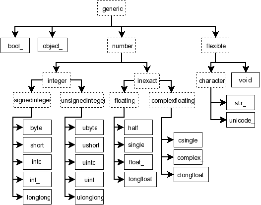

#	*NumPy* 数组对象

##	`np.ndarray`

```python
class ndarray(shape[,dtype,buffer,offset,strides,order])
```

-	`np.ndarray`：*N* 维数组类型，描述相同类型类型项目集合
	-	相同类型项目：同质、内存占用相同、结构（解释）相同
		-	项目结构（解释）由与数组关联的单独数据类型对象指定
		-	可从数组中提取类型为 **数组标量类型** 的 *Python* 对象
	-	`np.ndarray` 在内存连续中存储
		-	并与将`N`个整数映射到块中项的位置的索引方案相结合
		-	可以共享相同数据段，即可以是其他数据区的视图
			- 另一个`ndarray`
			- 实现`buffer`的对象
	-	参数含义
		- `shape`：指定尺寸、项目数量
		- `dtype`（*data-type object*）：指定项目类型
		- `strides`：存储各维度步幅，用于计算连续数据段中偏移

> - *NumPy 1.18* N 维数组 - 中文参考：<https://www.numpy.org.cn/reference/arrays/ndarray.html>
> - *NumPy 1.24 NDArray Reference*：<https://numpy.org/devdocs/reference/arrays.ndarray.html>

###	数组属性、方法

|内存布局属性|描述|
|-----|-----|
|`ndarray.flags`|有关数组内存布局的信息|
|`ndarray.shape`|数组维度（元组）|
|`ndarray.strides`|遍历数组时每个维度中的字节数量（元组）|
|`ndarray.ndim`|数组维数|
|`ndarray.data`|Python缓冲区对象指向数组的数据的开头|
|`ndarray.size`|数组中的元素数|
|`ndarray.itemsize`|数组元素的长度，以字节为单位|
|`ndarray.nbytes`|数组元素消耗的总字节数|
|`ndarray.base`|如果内存来自其他对象，则为基础对象|

|数据解释属性|描述|
|-----|-----|
|`ndarray.dtype`|元素数据类型|
|`ndarray.T`|转置|
|`ndarray.real`|实数部分|
|`ndarray.imag`|虚数部分|
|`ndarray.flat`|数组的一维迭代器|

|数组接口属性|描述|
|-----|-----|
|`__array_interface__`|数组接口python端|
|`__array_struct__`|数组接口C语言端|

|`ctypes` 外部函数接口|描述|
|-----|-----|
|`ndarray.ctypes`|简化数组与 `ctypes` 模块交互的对象|

###	*Broadcast* 广播规则

-	*Broadcasting* 广播规则用于处理不同 `shape` 输入数组间操作
	-	如下 4 条规则用于确定广播
		-	非维数最大者在 `shape` 前用 `1` 补足
		-	输出的 `shape` 中各维度是各输入对应维度最大值
		-	各输入的维度与输出对应维度相同、或为 `1`
		-	输入中维度为 `1` 者，对应的（首个）数据被用于沿该轴的所有计算
			（即对应的 `stride` 为 `0`，*ufunc* 不沿该维度步进）
	-	若上述规则产生有效结果，则输入数组广播兼容

```python
shape(3, 2, 2, 1) + shape(1, 3)
	-> shape(3, 2, 2, 1) + shape(1, 1, 1, 3)
	-> shape(3, 2, 2, 3) + shape(1, 1, 2, 3)
	-> shape(3, 2, 2, 3) + shape(1, 2, 2, 3)
	-> shape(3, 2, 2, 3) + shape(3, 2, 2, 3)
```

##	数组迭代

-	数组迭代方式
	-	*C* 风格逐维度迭代：直接迭代 `np.ndarray`
	-	*C* 风格迭代标量：`np.ndenumerate`、`np.ndindex`、`np.flatiter`
	-	自定义迭代风格：`np.nditer`、`np.nest_iters`

###	`np.nditer`

```python
class np.nditer(
	op,
	flags=None,
	op_flags=None,
	op_dtypes=None,
	order='K',
	casting='safe',
	op_axes=None,
	itershape=None,
	buffersize=0
)
```

-	`np.nditer` 是 *NumPy* 提供的 `np.ndarray` 标准迭代工具
	-	缺省，按默认内存布局迭代数组元素标量
	-	实现有 *Python* 迭代器协议、上下文管理器协议
		-	迭代器协议支持 *Python* 标准迭代
		-	上下文管理器可方便管理对原数组写操作的写回
	-	事实上，`np.nditer` 复位 `external_loop`（即迭代标量）时无法提高效率
		-	`np.nditer` 中迭代元素为 `np.ndarray` 对象
		-	而，复位 `external_loop` 即迭代 `np.ndarray` 标量，无法利用向量化提升效率，与普通迭代无异
	-	`np.nditer` 实例存储当前迭代信息
		-	可通过其方法、属性获取迭代信息
		-	本身即可视为 `np.nditer.value` 的代理
			-	实现序列协议，可通过 `[N]` 获取第 `N` 迭代数组的迭代结果

|`np.nditer` 属性|描述|
|-----|-----|
|`nditer.value`|当前迭代结果|
|`nditer.itersize`|迭代结果大小|
|`nditer.ndim`|迭代结果维数|
|`nditer.shape`|迭代结果形状|
|`nditer.nop`|迭代操作数数量|
|`nditer.iterindex`|迭代顺序索引|
|`nditer.has_index`|是否维护展平坐标|
|`nditer.index`|当前元素展平坐标（需置位 `c_index` 或 `f_index` 标志）|
|`nditer.has_multi_index`|是否维护原始坐标|
|`nditer.multi_index`|当前元素原始坐标（需置位 `multi_index` 标志）|
|`nditer.operands`|迭代操作数（迭代关闭后将无法访问）|
|`nditer.itviews`|操作数迭代视图（需复位 `buffered` 标志）|
|`nditer.finished`|迭代完成标志|
|`nditer.iterationneedapi`|迭代是否要求 *Python API*|

-	说明
	-	`nditer.itviews` 获取数组符合数组实际迭代情况的结构化内存视图 `np.ndarray`
		-	其 `shape` 为广播后，对应实际迭代顺序、迭代结果形状
			-	即，受 `external_loop`、`op_axes`、`order` 参数、标记影响
			-	其中，`external_loop` 置位时：迭代元素为最底层 `np.ndarray`，否则为 1 维数组（迭代标量）
		-	需获取数组整体的迭代情况，故要求 `buffered` 标志复位

|`np.nditer` 方法|描述|
|-----|-----|
|`nditer.iternext()`|检查是否可继续迭代，并消耗迭代器|
|`nditer.copy()`|复制迭代器当前状态|
|`nditer.close()`|写回可写操作数|
|`nditer.debug_print()`|打印信息|
|`nditer.enable_external_loop()`|激活 `external_loop` 行为|
|`nditer.remove_axis(i,/)`|移除迭代器轴|
|`nditer.remove_multi_index()`|抑制 `multi_index` 行为（提高效率）|
|`nditer.reset()`|重置迭代器至初始状态|

> - *NumPy 1.18* 迭代数组 - 中文参考：<https://www.numpy.org.cn/reference/arrays/nditer.html>
> - *NumPy 1.24 Array Iteration* 参考：<https://numpy.org/doc/1.24/reference/arrays.nditer.html>
> - *Numpy 1.24 API* `np.nditer`：<https://numpy.org/doc/1.24/reference/generated/numpy.nditer.html>

####	迭代风格

-	`np.nditer` 支持自定义迭代风格
	-	迭代顺序：设置 `order` 参数
	-	写数组值：置位 `op_flags` 中 `writeonly`、`readwrite` 标志
		-	需手动调用 `nditer.close()`、或通过 `with` 写回
	-	迭代矢量：置位 `flags` 中 `external_loop` 标志
		-	缺省提供尽可能大的内循环块，依赖于
			-	`op_axes`：轴映射关系
			-	`order`：迭代顺序
			-	`buffersize`：缓冲区大小
	-	跟踪索引：置位 `flags` 中 `c_index`、`f_index`、`multi_index` 标志
	-	数据类型
		-	整体复制：置位 `op_dtypes` 中 `copy` 标志
			-	创建数组整体的新数据类型副本，在副本上迭代
		-	局部缓冲：置位 `flags` 中 `buffered` 标志
			-	通过缓冲创建部分数组数据类型副本，可避免数组整体类型转换的内存消耗
			-	`np.ufunc` 等函数也可通过缓冲降低内存开销
		-	写模式下，数据写回前将被转换为原始数据类型
			-	设置 `casting` 控制类型转换限制

-	可类似 `zip` 迭代多个广播兼容的数组
	-	`None` 可作为操作数之一传入，`np.nditer` 将为其置位 `op_flags` 中 `allocate`、`writeonly` 标志

####	参数

-	`flags`：迭代器标志
	-	`buffered`：允许缓冲，从操作数中复制数据块至缓冲区
		-	减少开销、提升性能：增大迭代器提供给循环内部的数据块
		-	操作数为 `None` 时无法复制数据块，置位将报错
	-	`c_index`：维护 *C* 风格顺序索引
	-	`f_index`：维护 *Fortran* 风格顺序索引
	-	`multi_index`：维护原数组（多维）索引
	-	`common_dtype`：将所有操作数转换为公共类型
		-	需设置 `copying` 或 `buffered`
	-	`copy_if_overlap`：迭代器决定是否读操作数覆盖写操作数，还是使用临时副本避免覆盖
	-	`delay_bufalloc`：延迟缓冲区设置直至 `reset()` 函数调用
		-	允许 `allocate` 操作数在其值被复制到缓冲区前初始化
	-	`external_loop`：迭代一维数组而不是零维数组标量
		-	用于在迭代循环内部应用矢量化操作
		-	返回的循环块大小、内容与 `order`、`buffersize`、`op_axes` 等参数、标志有关
	-	`grow_inner`：允许迭代数组大小大于缓冲区大小
		-	`buffered`、`external_loop` 均设置情况下
	-	`ranged`：
	-	`refs_ok`：允许迭代引用类型，如 `object` 数组
	-	`reduce_ok`：允许迭代广播后的 `readwrite` 操作数（也即 `reduction` 操作数）
	-	`zerosize_ok`：允许迭代大小为 0

-	`op_flags`：操作数（`op` 中数组）标志，可为各操作数分别设置
	-	`readonly`：操作数只能被读取
	-	`readwrite`：操作数能被读写
	-	`writeonly`：操作只能被写入
	-	`no_broadcast`：禁止操作数被广播
	-	`contig`：强制操作数数据连续
	-	`aligned`：强制操作数数据对齐
	-	`nbo`：强值操作数数据按原生字节序
	-	`copy`：允许临时只读拷贝
	-	`updateifcopy`：允许临时读写拷贝
	-	`allocate`：允许数组分配若 `op` 中包含 `None`
		-	迭代器为 `None` 分配空间，不会为非空操作数分配空间，即使是广播后赋值空间不足
		-	操作数中 `op` 中 `None` 对应 `op_flags` 缺省为 `["allocate", "writeonly"]`
	-	`no_subtype`：阻止 `allocate` 操作数使用子类型
	-	`arraymask`：表明对应操作数为 mask数组
		-	用于从设置有 `writemasked` 标志的操作数中选择写回部分
	-	`writemasked`：只有 `arraymask` 操作数选择的元素被写回
	-	`overlap_assume_elementwise`：标记操作数只能按照迭代顺序获取
		-	允许在 `copy_if_overlap` 设置的场合，更保守的拷贝

-	`op_dtypes`：操作数需求的数据类型
	-	在循环内对单个值进行数据类型转换效率低
	-	迭代器以缓冲、复制整体进行类型转换提高效率
	-	需要同时设置 `"copy"` 或 `"buffered"`，否则因无法复制、缓冲报错（类型不同时）
		（类型转换不修改原数组值，需要额外空间存储转换后值）

-	`order`：迭代顺序
	-	`C`/`F`：*C* 风格、*Fortran* 风格
	-	`A`：若所有数组均为 *Fortran* 风格则为 *Fortran* 风格，否则为 *C* 风格
	-	`K`：尽量贴近内存布局

	> - `allocate` 操作数的内存布局会兼容此参数设置

-	`casting`：指明在拷贝、缓冲时允许的数据类型转换规则
	（包括读取、写回数组时可能的类型转换）
	-	`no`：不允许任何类型转换
	-	`equiv`：仅允许字节顺序改变
	-	`safe`：仅允许可保证数据精度的类型转换
	-	`same_kind`：只能允许 `safe` 或同类别类型转换
	-	`unsafe`：允许所有类型转换

-	`op_axes`：迭代器维度（即迭代过程中各操作数广播结果）到操作数（`op` 中数组）维度的映射
	-	`list[map_list | None]` 中各元素表示映射关系
		-	各 `map_list` 长度应均为迭代器维数
		-	`map_list` 使用形如 `[-1, 0, 1, -1]` 表示映射关系
			-	`0, 1`：操作数中 0、1 维映射至操作数 1、2 维
			-	`-1`：新增维度，将沿此维度执行广播
		-	`None`：各维度一一映射
	-	迭代过程中各操作数按迭代器维度迭代得到当前迭代结果
		-	操作数各轴迭代顺序取决于映射关系
			-	即，此参数可用于自定义各操作数迭代顺序
		-	映射维度：读、写操作同正常读写
		-	广播维度（`-1` 维度）：写操作时，沿广播维度元素始终被写入相同值
			-	迭代向量非广播维度方向时，当前赋值操作正常、但影响被累积
			-	迭代向量为广播维度方向时，向量最后元素值被赋给向量整体，当前赋值操作无意义

	```python
	arr = np.arange(24).reshape(2,3,4)
	with np.nditer([arr, None], flags=["reduce_ok", "external_loop"],
			op_flags=[["readonly"], ["readwrite", "allocate"]],
			op_axes=[None, [-1, 0, 1]],
			order="F") as it:
		for x, y in it:
			y[...] += x
		# `result == arr[1]`：迭代向量为沿首维、第二操作数沿首维广播，故迭代向量均被赋最后元素值
		result = it.operands[1]
	```

-	`itershape`：迭代器的形状，即各操作数最终广播目标
	-	显然，`itershape` 需与各操作数广播兼容，缺省即为各操作数默认广播结果

-	`buffersize`：设置缓冲区大小
	-	`buffered` 设置的情况下
	-	`0` 表示默认大小

###	`np.nested_iters`

```python
Tuple[np.nditer] = np.nested_iters(
	op,
	axes: list[list],
	flags=None,
	op_flags=None,
	op_dtypes=None,
	order='K'/'C'/'F'/'A',
	casting='safe',
	itershape=None,
	buffersize=0
)

```

-	`np.nested_iters` 返回用于嵌套循环的多个 `np.nditer`
	-	参数说明
		-	`axes`：控制迭代轴的次序（嵌套逻辑）、组合
		-	其他参数同 `np.nditer`
	-	内部 `np.nditer` 会自动因外部 `np.nditer` 迭代而自动变化
		-	实务中，一般仅操作最内部迭代轴即可
	-	各 `np.nditer.itview` 即为 `op[outer_ind,:,:,0]`
		-	`outer_ind` 为外部迭代轴索引
		-	`:,:` 表示当前迭代轴整体切片
		-	内部迭代轴均填充 `0`，即内部迭代轴均从 0 开始

##	*Index*

-	`np.ndarray` 使用 *Python* 标准 `[obj]` 语法索引
	-	索引对象支持
		-	基本索引：`Integer`、`slice`、`Tuple[Integer, slice]`
		-	高级索引：非元组序列、`np.ndarray`、`Tuple[Seq, np.ndarray,...]`
		-	字段访问：`np.ndarray` 为结构化数组时，可使用字符串索引访问数组字段
	-	说明
		-	基本索引返回视图、高级索引返回副本，均不影响扩展算数赋值方法修改原数组
		-	*NumPy* 中（多维）索引作为返回值时，往往为整数高级索引
			-	`np.ndarray`：首维度各分量分别表示各维度的高级索引
			-	`list`、`tuple`：各元素分别为各维度的高级索引

> - *NumPy 1.18* 索引 - 用户指南：<https://www.numpy.org.cn/user/basics/indexing.html>
> - *NumPy 1.18* 索引 - 中文参考：<https://www.numpy.org.cn/reference/arrays/indexing.html>
> - *NumPy 1.24 Index User Guide*：<https://numpy.org/doc/1.24/user/basics.indexing.html>
> - *NumPy 1.24 Index Reference*：<https://numpy.org/doc/1.24/reference/arrays.ndarray.html>

###	基本索引

-	基本索引：索引元组中各元素为依次对各维度索引
	-	`slice[start:stop:step]`：行为基本同原生类型切片
		-	`start`、`stop` 取值范围
			-	可超过维度长 `N`
			-	可取负值，按维度长取正模
			-	根据 `step` 正负情况缺省为头尾、尾头
	-	`Ellipsis`/`...`：选择所有（剩余）维度
		-	`...` 存在的场合，结果总是数组而不是数组标量，即使没有剩余维度
	-	`np.newaxis`/`None`：在所在位置新增长度为 `1` 维度
	-	基本索引生成始终返回原数组视图：基本索引保证位置不会重复出现
		-	基本索引可用于赋值
		-	存在切片引用的数组内存不会被释放

###	高级索引

-	高级索引：**索引元组** 中各元素整体 **广播结果** 为索引取值
	-	整数高级索引 `x[iobj]`：返回结果中各元素为 `zip(*iobj)` 迭代作为索引取值
		-	索引元组 `iobj` 说明
			-	索引元组 `iobj` 长度不足、非元组，即 `x[iobj,...]` 剩余维度全选
			-	索引元组 `iobj` 中各元素 `shape` 需符合广播要求
		-	返回值 `shape` = `np.broadcast_shapes(*iobj)` + `剩余维度`
	-	*Boolean* 索引 `x[bobj]`：选择索引元组中 `True` 处位置对应元素
		-	索引元组 `bobj` 说明
			-	索引元组 `bobj` 需与 `x` 广播兼容
				-	`bobj` 维数较少，即 `x[bobj,...]` 剩余维度全选
				-	且 `bobj.shape == x.shape` 时速度较快
			-	布尔索引等价于 `bobj.nonzero()` 高级索引
		-	返回值 `shape` = `len(bobj.nonzero()[0])` + `剩余索引`
	-	高级索引总是返回原数组副本
		-	结果不保证任何内存布局：高级索引结果内存布局对每个索引操作有优化，不保证特定内存顺序

-	高级索引与基本索引联用：高级索引中包含切片、`Ellipsis`、`np.newaxis`（整数被视为高级索引的一部分参与广播）
	-	高级索引结果 `shape` 由高级索引广播决定，各维度不可分割，故：
		-	高级索引被切片分割：高级索引结果维度整体提前
		-	高级索引相邻：高级索引结果维度填充至该处

###	字段访问

-	`np.ndarray` 为结构化数据类型时，可使用字符串索引访问数组字段
	-	支持字符串列表形式
		-	此时，返回数组视图而不是副本
	-	字段非子数组时
		-	其 `shape` 同原数组
		-	仅包含该字段数据
		-	数据类型为该字段数据类型
	-	字段为子数组时
		-	子数组 `shape` 会同原数组 `shape` 合并
		-	总为 *C* 风格内存布局

##	数据类型

###	`np.ndarray` 标量类型

-	*NumPy* 中定义有 24 种新 *Python* `np.ndarray` 标量（实）类型
	-	类型描述符主要基于 *C* 语言中的数据类型（*CPython* 实现）
        -   数组标量类型直接有如下图继承关系，可用于探测数据类型
    -	数组标量具有和 `np.ndarray` 基本相同的属性和方法
        -	数组标量不可变，故属性不可设置
		-	方法默认行为即内部将数组标量转换为 0 维数组
	-	数组标量类似 0 维数组一样支持索引
		-	`X[()]`：返回副本
		-	`X[...]`：返回 0 维数组
		-	`X[<field-name>]`：返回对应字段的数组标量
	-	定义新的数组标量类型
		-	继承 `np.ndarray` 数组标量类型
		-	通过 *NumPy C-API* 定义新类型



> - `intp`、`uintp` 两指针类型未在上述继承关系图中展示
> - *NumPy 1.23 Array Scalar Reference*：<https://numpy.org/doc/1.24/reference/arrays.scalars.html>
> - *Numpy 1.18* 数组标量 - 参考：<https://www.numpy.org.cn/reference/arrays/scalars.html>

####	类型说明

|`np.ndarray` 整形|兼容 *C* 类型|位长别名（64 位平台）|单字符代码|*Array-Protocol* 类型字符串|
|-----|-----|-----|-----|-----|
|`byte`		|`signed char`			|`int8`				|`b`	|`i1`	|
|`short`	|`short`				|`int16`			|`h`	|`i2`	|
|`intc`		|`int`					|`int32`			|`i`	|`i4`	|
|`int_`		|`long`					|`int64`、`intp`	|`l`	|`i8`	|
|`longlong` |`long long`			|无					|`q`	|无		|
|`ubyte`	|`unsigned char`		|`uint8`			|`B`	|`u1`	|
|`ushort`	|`unsigned short`		|`uint16`			|`H`	|`u2`	|
|`uintc`	|`unsigned int`			|`uint32`			|`I`	|`u4`	|
|`uint`		|`usigned long`			|`uint64`、`uintp`	|`L`	|`u8`	|
|`ulonglong`|`unsigned long long`	|无					|`Q`	|无		|

|`np.ndarray` 浮点|兼容 *C* 类型|定长别名（64 位平台）|单字符代码|*Array-Protocol* 类型字符串|描述|别名|
|-----|-----|-----|-----|-----|-----|------|
|`half`			|无						|`float16`		|`e`	|`f2`	|半精度浮点：1+5+10		| |
|`single`		|`float`				|`float32`		|`f`	|`f4`	|单精度浮点：1+8+23		| |
|`float_`		|`double`				|`float64`		|`d`	|`f8`	|双精度浮点：1+11+52	|`double`|
|`longdouble`	|`long double`			|`float128`		|`g`	|`f16`	|平台定义的扩展精度浮点	|`longfloat`|
|`csingle`		|`float complex`		|`complex64`	|`F`	|`c8`	|两个单精度浮点			|`singlecomplex`|
|`complex_`		|`double complex`		|`complex128`	|`D`	|`c16`	|两个双精度浮点			|`cdouble`、`cfloat`|
|`clongdouble`	|`long duoble complex`	|`complex256`	|`G`	|`c32`	|两个扩展精度浮点		|`clongfloat`、`longcomplex`|

|`np.ndarray` 其他类型|兼容 *C* 类型|定长别名（64 位平台）|单字符代码|*Arrray-Protocol* 类型字符串|描述|别名|
|-----|-----|-----|-----|-----|-----|-----|
|`bool_`		|`bool`	|`bool8`|`?`	|`?`		|字节存储					| |
|`object_`		|无		|无		|`O`	|`O`		|*Python* 对象				| |
|`bytes_`		|无		|无		|`S`、`a`|`S#`、`a#`|不定长 - 字节串（`0` 结尾）|`string_`|
|`str_`			|无		|无		|`U`	|`U#`		|不定长 - *Unicode* 字符串	|`unicode_`|
|`void`			|无		|无		|`V`	|`V#`		|不定长 - 无类型标量		| |
|`datetime64`	|无		|无		|`M`	|`M8`		|64 位整形存储				| |
|`timedelta64`	|无		|无		|`m`	|`m8`		|64 位整形存储				| |


-	数组标量类型说明
	-	所有的数值数组标量类型都均有使用 `<TYPE><LEN>` 位长表示的别名
		-	位长别名取值范围与平台无关
		-	数值标量类型与位长别名对应关系（即其取值范围）取决于 *CPython* 实现（即具体平台）
	-	部分数组标量类型有对应的、本质相同的 *Python* 基础类型，其中部分甚至存在继承关系
		-	*Python3* 中 `int` 位长不再固定，故 `np.int_` 不继承自 `int`（*Python2* 中有继承关系）
		-	类似的，*Python3* 中 `bool` 不允许被继承
	-	数组标量类型注意事项
		-	`ubyte`（`B`）与 `bytes_`（`S`、`a`）均可表示字节串，但前者为纯粹字节串，而后者类似 *C* 中 `0` 结尾字符串

-	数组标量类型字符串代码（映射关系）均存储在 `np.sctypeDict` 中，包括
	-	单字符代码
	-	*Array-protocol* 字符串 `<TYPE><LEN><[UNIT]>`
		-	`TYPE`：首字符指定数据类型
			-	部分与单字符代码兼容，例：`i`、`i4` 均表示 `np.int64`
		-	`LEN`：占用字节数，需要实际类型兼容，注意
			-	即，定长类型只能取给定值，不定义类型可取任意值（`np.sctypeDict` 无法枚举）
			-	`U#` 中长度为字符数
			-	`?`、`O` 后无长度说明
        -   `[UNIT]`：（时间）单位，适用于 `np.datetime64`、`np.timedelta64` 场合
	-	`0-23` 整数值代码：不可用于实例化 `np.dtype` 数据类型类

|`np.ndarray` 标量类型|对应 *Python* 类型|*Python* 类型实例化 `np.dtype` 场合|
|-----|-----|-----|
|`int_`			|`int`					|等效|
|`float_`		|继承自 `float`			|等效|
|`complex_`		|继承自 `complex`		|等效|
|`bytes_`		|继承自 `bytes`			|等效|
|`str_`			|继承自 `str`			|等效|
|`bool_`		|`bool`					|等效|
|`datetime64`	|`datetime.datetime`	|`np.object_`|
|`timedelta64`	|`datetime.timedelta`	|`np.object_`|
|`void`			|*Buffer*				|等效|
|`object_`		|其他 *Python* 类型		|`np.object_`|

###	`np.dtype` 数据类型对象

```python
class dtype(obj[,align,copy])
```

-	`numpy.dtype` 对象（数据类型对象）描述如何解释数组项对应内存块中字节
	-	描述需涵盖数据的以下方面
		-	数据类型
			-	结构化数据
				-	各字段名称
				-	各字段数据类型
				-	字段占用的内存数据块
			-	子数组
				-	形状
				-	数据类型
		-	数据大小
		-	字节序（缺省为 `|` 默认字节序）
			-	*little-endian*：`<`
			-	*big-endian*：`>`

####	指定数据类型对象

-	*NumPy* 函数、方法中即通过 `numpy.dtype` 实例指定数据类型，且可用可转换为 `np.dtype` 实例的其他值代替
	（转换由 `np.dtype` 构造函数完成）
	-	非字符串值
		-	*NumPy* 24 种数组标量类型、泛型类型
			-	泛型类型等效于对应最宽容数组标量类型（不推荐使用）
		-	*Python* 内置类型：等效于相应数组标量类型，注意
			-	`datetime.datetime`、`datetime.timedelta` 类型等效于 `np.object_`，而不是对应数组标量类型
			-	`None` 等效于 `np.float_`
		-	带有 `.dtype` 属性的对象
			-	该属性需返回可转换为 `np.dtype` 实例的内容
	-	（被包含的）字符串、元组格式：`[SHAPE][BYTE_ORDER]AP_TYPE`
		-	`SHPAE`：字段形状
			-	另外，可通过元组格式 `[BYTE_ORDER]AP_TYPE, SHAPE` 指定
			-	注意：不定长类型指定形状前必须给出长度（即使为 `1`）
		-	`BYTE_ORDER`：字节序 `<` 小端、`>` 大端、`|` 默认字节序
		-	`AP_TYPE`：基本类型描述符，`np.sctypeDict.keys()` 中字符串
			-	（数组标量类型）单字符代码
			-	*Array-protocol* 字符串 `<TYPE><LEN>`
			-	位长别名字符串：不支持指定字节序
	-	另外，`np.format_parser(formats,names,titles[,aligned,byteorder])` 也可用于创建数据类型实例

-	除直接传递字符串外，`np.dtype` 接受字符串、列表、字典创建结构化数据类型
	-	非结构化数据类型
		-	`(FLEXIBLE_DTYPE, SIZE)`：不定长类型（此语法无法设置不定长类型形状）
		-	`(DTYPE, SHAPE)`：不定长类型需使用 *Array-protocol* 形式指定长度
	-	`[SHAPE][BYTE_ORDER]<AP>, ...`：`,` 分隔字段的字符串
		-	各字段名为 `f#`
	-	`[(FILED_NAME, DTYPE, SHAPE),...]`：不定长类型需使用 *Array-protocol* 形式指定长度
		-	`FIELD_NAME` 可为 `(META, NAME)` 或字符串，置 `""` 时各字段名为 `f#`
	-	`{"names": ..., "formats": ..., "offsets": ..., "titles": ..., "itemsize": ...}`
		-	`names`、`formats` 必须
	-	`(BASE_DTYPE, NEW_DTYPE)`：解释基数据类型为结构化数据类型
		-	`NEW_DTYPE` 可为上述取值，但注意大小需兼容
		-	甚至，可用于实现 *C* 中 `union` 类型

####	`np.dtype` 属性

|数据类型|描述|
|-----|-----|
|`dtype.type`|用于实例化此数据类型的数组标量类型|
|`dtype.kind`|内置类型字符码|
|`dtype.char`|内置类型字符码|
|`dtype.num`|内置类型唯一编号|
|`dtype.str`|类型标识字符串|

|数据大小|描述|
|-----|-----|
|`dtype.name`|数据类型位宽名称|
|`dtype.itemsize`|元素大小|

|字节序|描述|
|-----|-----|
|`dtype.byteorder`|指示字节顺序|

|结构化类型中子类型信息|描述|
|-----|-----|
|`dtype.fields`|`{字段名:数据类型}` 字典、或 `None`|
|`dtype.names`|字段名列表、或 `None`|

|数组类型中数组信息|描述|
|-----|-----|
|`dtype.subtype`|`(ITEM_DTYPE, SHAPE)`、或 `None`|
|`dtype.shape`|数组形状|

|附加信息|描述|
|-----|-----|
|`dtype.hasobject`|是否包含任何引用计数对象|
|`dtype.flags`|数据类型解释标志|
|`dtype.isbuiltin`|与内置数据类型相关|
|`dtype.isnative`|字节顺序是否为平台原生|
|`dtype.descr`|`__array_interface__` 数据类型说明|
|`dtype.alignment`|数据类型需要对齐的字节（编译器决定）|
|`dtype.base`|基本元素的 `dtype`|
|`dtype.metadata`|用户添加的元信息|

####	`np.dtype` 方法

|方法|描述|
|-----|-----|
|`dtype.newbyteorder([new_order])`|创建不同字节顺序数据类型|
|`dtype.__reduce__()`|*Pickle* 协议实现|
|`dtype.__setstate__()`|*Pickle* 协议实现|
|`dtype.__ge__()` 等|比较协议|

###  时间日期相关

-	`np.datetime64`：*NumPy* 中表示单个时刻的数据类型
	-	使用 64 位整形存储 *POSIX* 时间
        -   可表示 *BC*（公元前）、*AD*（公元后）中精度支持的时间跨度
	-	但，支持设置时间单位（即，每数值增量代表的时间增量）
        -	即，若两个日期时间具有不同单位，可能仍然代表相同时刻
        -	从较大单位转换为较小单位是安全的投射
    -   支持传入初始化的参数，单位根据参数自动推测
        -   *ISO 8601* 日期
        -   日期格式字符串
        -   `NAT` 字符串
        -   整型值：需显式指定单位

-   `np.timedelta64`：*NumPy* 中表示时间增量的数据类型
	-	使用 64 位整形存储时间增量
	-	但，支持设置时间单位（即，每数值增量代表的时间增量）
        -   `Y`、`M` 与下级单位间转换依赖时间点，被特殊处理

-   说明
    -   `np.datetime64`、`np.timedelta64` 联合支持加、减运算
    -   `np.datetime64` 新版本为兼容依然支持解析时区偏移，但是通过转换为 *UTC* 处理

####    接口

|工作日函数|描述|
|-----|-----|
|`np.busdaycalendar(weekmask,holidays)`|返回存储有效工作日对象|
|`np.busday_offset(date,offset[,roll,weekmask,holidays,busdaycal,out])`|工作日offset|
|`np.is_busday(date[,weekmask,holidays,busdaycal,out])`|判断是否是工作日|
|`np.busday_count(begindates,enddates[,weekmask,holidays,busdaycal,out])`|指定天数|

|日期信息|描述|
|-----|-----|
|`np.datetime_as_string(arr[,unit,timezone,...])`|转换为字符串数组|
|`np.datetime_date(dtype,/)`|获取日期、时间类型步长信息|

> - *NumPy 1.18* 时间日期接口：<https://www.numpy.org.cn/reference/routines/datetime.html>
> - *NumPy 1.24 Datetime API*：<https://numpy.org/doc/1.24/reference/routines.datetime.html>

# *NumPy* 常用 *API*

-	*NumPy* 数组输出 `shape` 逻辑
	-	确定输出数组的维数 `ndim`
	-	确定参数数组原维度轴位置、补1轴位置，参数维度轴对齐
	-	修正各维度大小
		-	沿轴操作：保持不变
		-	沿轴采样：采样数目
		-	沿轴 *concatenate*：维度相加
		-	沿轴聚集：删除维度
		-	沿轴切片聚集：删除其余维度

> - 无 `np` 前缀表 *API* 同时存在函数、`np.ndarray` 方法版本
> - *NumPy 1.18* 常用 *API* - 中文参考：<https://www.numpy.org.cn/reference/routines/>
> - *NumPy 1.24 Routines* 参考：<https://numpy.org/doc/1.24/reference/routines.html>

##	创建数组

|函数|描述|
|-----|-----|
|`ndarray.setflags([write,align,uic])`|设置标志|

> - *NumPy 1.18* 数组创建 *API* - 中文参考：<https://www.numpy.org.cn/reference/routines/array-creation.htm>
> - *NumPy 1.24 Array Creation* 参考：<https://numpy.org/doc/1.24/reference/routines.array-creation.html>

###	定值填充

|Routine|Function Version|
|-----|-----|
|`np.empty(shape[,dtype,order])`|无初始化|
|`np.empty_like(prototype[,dtype,order,subok,...])`|shape、类型同`prototype`|
|`np.eye(N[,M,k,dtype,order])`|对角为 1 的2D数组|
|`np.identity(n[,dtype])`|单位矩阵数组|
|`np.ones(shape[,dtype,order])`| |
|`np.ones_like(a[,dtype,order,subok,shape])`| |
|`np.zeros(shape[,dtype,order])`| |
|`np.zeros_like(a[,dtype,order,subok,shape])`| |
|`np.full(shape,fill_value[,dtype,order])`|全 `full_value` 数组|
|`np.full_like(a,fill_value[,dtype,order,...])`| |

###	数值范围

|Routine|Function Version|
|-----|-----|
|`np.arange([start,]stop[,step][,dtpye])`|给定间距跳分|
|`np.linspace(start,stop[,num,endpoint,...])`|给定数量，等差均分|
|`np.geomspace(start,stop[,num,endpoint,base,...])`|给定数量，等比均分|
|`np.logspace(start,stop[,num,endpoint,base,...])`|对数尺度等差均分，同 `np.power(base, np.linspace(start,stop))`|

###	从已有数据

|Routine|Function Version|
|-----|-----|
|`np.array(object[,dtype,copy,order,subok,ndmin])`|创建数组|
|`np.asarray(a[,dtype,order])`|返回 `np.ndarray` 基类|
|`np.asanyarray(a[,dtype,order])`|返回 `np.ndarray` 类、子类|
|`np.ascontiguousarray(a[,dtype])`| |
|`np.asmatrix(data[,dtype])`|创建矩阵|
|`np.copy(a[,order])`| |
|`np.frombuffer(buffer[,dtype,count,offset]`|从缓冲（如字节串）创建|
|`np.fromfunction(function,shape,**kwargs)`|以坐标为参数，从函数创建|
|`np.fromiter(iterable,dtype[,count])`|可迭代对象创建|

##	索引相关

> - *NumPy 1.18* 索引 *API* - 中文参考：<https://www.numpy.org.cn/reference/routines/indexing.html>
> - *NumPy 1.24 Index* 参考：<https://numpy.org/doc/1.24/reference/arrays.indexing.html>

###	创建形状相关索引

####	切片索引

|生成切片索引|描述|返回值|
|-----|-----|-----|
|`np.r_[]`|沿首轴 *concate* 切片、数组、标量|`np.ndarray`|
|`np.c_[]`|沿末轴 *concate* 切片、数组、标量|`np.ndarray`|
|`np.s_[]`|生成（多维）切片，类 `slice()`|`slice`、`tuple[slice]`|
|`np.index_exp[]`|同`s_`，但单个切片时也返回元组|`tuple[slice]`|

-	说明
	-	`np.r_`、`np.c_` 分别为 `np.lib.index_tricks.RClass`、 `np.lib.index_tricks.CClass` 实例
	-	`np.s_`、`np.index_exp` 均为 `np.lib.index_tricks.IndexExpression` 实例
		-	`np.s_` 为初始化时 `maketuple` 复位，`np.index_exp` 初始化时置位

####	网格索引

|生成网格索引|描述|返回值|
|-----|-----|-----|
|`np.ix_(*args)`|以 `args` 为基点创建稀疏（开）网格（仅设置基点、维度）|`tuple[np.ndarray]`|
|`np.meshgrid(*xi,**kwargs)`|以 `xi` 作为基点创建稠密网格（所有网格点高级索引）|`list[np.ndarray]`|
|`np.ogrid[]`|根据切片创建开网格|`list[np.ndarray]`|
|`np.mgrid[]`|根据切片创建稠密网格|`np.ndarray`|
|`np.indices(dimensions[,dtype,sparse])`|以 `dimensions` 作为各维度长创建网格|`np.ndarray`、`tuple`|
|`np.ndindex(*shape)`|迭代 `shape` 各位置坐标|`iterator`|

-	说明
	-	稀疏（开）网格实际上仅为基点设置维度，整体广播即可得到稠密网格
	-	`np.indices` 中 `sparse` 置位即返回稀疏网格（元组）
	-	`np.ndindex` 返回各位置坐标的迭代器，不是整形高级索引

####	特定形状索引

|生成指定位置索引|描述|返回值|
|-----|-----|-----|
|`np.diag_indices(n[,ndim])`|`ndim` 维长为`n` 数组对角索引|`tuple[np.ndarray]`|
|`np.tril_indices(n[,k,m])`|n * m 的下三角索引|`tuple[np.ndarray]`|
|`np.triu_indices(n[,k,m])`|n * m 的上三角索引|`tuple[np.ndarray]`|
|`np.diag_indices_from(arr)`|获取 `arr` 对角索引|`tuple[np.ndarray]`|
|`np.tril_indices_from(arr[,k])`|`arr` 的下三角索引|`tuple[np.ndarray]`|
|`np.triu_indices_from(arr[,k])`|`arr` 的下三角索引|`tuple[np.ndarray]`|
|`np.mask_indices(n,mask_func[,k])`|根据 `mask_func` 获取 n * n 数组索引|

-	说明
	-	`np.mask_indices` 中 `mask_func` 应为类似 `np.triu` 的函数

####	索引展平

|生成展平索引|描述|返回值|
|-----|-----|-----|
|`np.ravel_multi_index(multi_index,dims[,mode,order])`|高级索引 `multi_index` 在 `shape=dims` 展平后的位置|`np.ndarray`|
|`np.unravel_index(indices,shape[,order])`|`ravel_multi_index` 逆向|`tuple[np.ndarray]`|

###	创建值相关索引

|值相关索引|描述|
|-----|-----|
|`np.nonzero(a)`|非 0 元素整形高级索引|
|`np.flatnonzero(a)`|展平非 0 元素|
|`np.where(condition[,x,y])`|真值元素整形高级索引，给出 `x,y` 时按优先级取数|
|`np.argwhere(a)`|真值坐标数组|

-	说明
	-	`np.nonzero`、`np.where` 均可将 *Boolean* 索引转换为整数高级索引
		-	`np.flatnonzero` 是对 `np.nonzero` 的取数封装
		-	`np.argwhere` 结果类似 `zip(*np.where)`，返回坐标数组
		-	`np.where` 还可用于按优先级从两个数组中取数，此时同 `np.choose`

####	次序比较索引

|1 维值相关索引|描述|
|-----|-----|
|`np.argmax(a[,axis,out,keepdims])`|最大值位置（展平后）|
|`np.argmin(a[,axis,out,keepdims])`|最小值位置（展平后）|
|`np.nanargmax(a[,axis,out,keepdims])`|支持 `NaN`|
|`np.nanargmin(a[,axis,out,keepdims])`|支持 `NaN`|
|`np.searchsorted(a,v[,side,sorter])`|1 维有序数组 `a` 中 `v` 应插入位置|

-	说明
	-	`np.searchsorted` 中目标数组应为有序 1 维

###	取值、赋值

|标准类型|描述|返回值|
|-----|-----|-----|
|`ndarray.item(*args)`|取值，返回标准 *python* 标量|
|`ndarray.itemset(*args)`|赋值，最后元素为待赋值|

####	取值

|从数组取值|描述|索引表示|
|-----|-----|-----|
|`take(a,indices[,axis,out,mode])`|按 `indices` 沿给定轴取值（缺省将数组展平）|`a[:,:,ind,...]`|
|`np.take_along_axis(arr,indices,axis)`|将 `arr`、`indices` 广播对齐，沿 `axis` 选取元素|`arr[np.ix_[np.arange,ind,np.arange]]`|
|`compress(condition,a[,axis,out])`|按 `condition` 沿给定轴 `axis` 选取超平面（缺省将数组展平）|`a[:,:,cond,...]`|
|`np.extract(condition,arr)`|在展平数组上选取元素|`np.ravel(arr)[cond]`|

-	以上函数用于弥补部分场合下 `[]` 索引取值表现力不足问题
	-	`take`、`np.take_along_axis`：适合针对给定轴取数场合
		-	`np.take_along_axis` 依广播对齐数组、索引后沿给定轴取值（单个元素）
			-	要求数组、索引除取值维外广播兼容
			-	行为类似沿指定轴的挑选、重排
			-	`indices` 一般可为 `np.argsort`、`np.argpartition` 等函数返回值
		-	`take` 沿给定轴从数组中取值（超平面）
			-	`axis` 非空时，同仅设置单轴的整形高级索引取数、`indices` 仅指定维非空的 `np.take_along_axis`
			-	即，`np.take(a,ind,N)` 等价于 `a[:,:,ind,...]`（`ind` 位于第 `N` 维）
	-	`np.compress`、`extract`：适合仅给出部分 *Boolean* 高级索引场合
		-	其中 `condition` 可小于维长
			-	`np.compress` 中 `condition` 需为 1 维
			-	`np.extract` 中 `condition` 被自动展平
		-	`np.extract` 等价于 `np.compress(np.ravel(condition), np.ravel(arr))`

|从数组列表取值|描述|
|-----|-----|
|`choose(a,choices[,out,mode])`|根据 `a` 选择 `choices` 中对应数组中对应位置值填充|
|`np.select(condlist,choicelist[,default])`|`condlist` 中首个真值对应的 `choicelist` 数组填充对应位置|

-	说明
	-	`np.choose` 等价于 `np.take_along_axis` 中沿首轴取值
		-	`choices` 可为数组，其首维被展开作为候选数组列表
		-	`a`、`choices` 中数组需广播兼容，返回值形状即广播结果
	-	`np.select` 即根据 *Boolean* 数组列表位置取值
		-	各位置 `condlist` 首个真值出现的位序值构建 `a`，则等价于 `np.choose(a,choicelist)`（不考虑缺省值）

```python
np.choose(a,choices) == np.array([choices[a[I]][I] for I in np.ndindex(a.shape)])
```

####	形态取值

|对角形态|描述|
|-----|-----|
|`diagonal(a[,offset,axis1,axis2])`|抽取 1 维、2 维对角阵|
|`np.diag(v[,k])`|从 2 维 `v` 抽取对角、或根据 1 维 `v` 创建对角阵|
|`np.diagflat(v[,k])`|构造对角阵（`v` 被展平）|
|`np.tri(N[,M,k,dtype])`|对角线及以下为1、其余为0矩阵|
|`np.tril(m[,k])`|下三角|
|`np.triu(m[,k])`|上三角|
|`np.vander(x[,N,increasing])`|Vandermonde矩阵|

-	说明
	-	`np.tri`、`np.tril`、`np.triu` 保持数组形状
	-	`np.diag`、`diagonal` 返回降维对角数组
		-	`diagonal` 是 `np.diag` 的高维数组推广，支持最高 2 维面对角

|滑动窗口|描述|
|-----|-----|
|`np.lib.stride_tricks.sliding_window_view(x,window_shape[,axis,...])`|滑动窗口数组|
|`np.lib.stride_tricks.as_strided(x[,shape,strides,...])`|创建指定形状、步幅的视图|

####	赋值、插入

|赋值、插入|描述|
|-----|-----|
|`put(a,ind,v[,mode])`|根据展平整形索引 `ind` 设置 `arr` 中值|
|`np.put_along_axis(arr,indices,values,axis)`|将 `arr`、`indices` 广播对齐，沿 `axis` 替换值|
|`np.place(arr,mask,vals)`|根据 *Boolean* 索引 `mask` 设置 `arr` 指定元素|
|`np.copyto(dst,src[,casting,where])`|根据 `where` 设置 `dst` 对应位置元素|
|`np.putmask(a,mask,values)`|同 `copyto`|
|`np.fill_diagonal(a,val[,wrap])`|填充主对角|
|`ndarray.fill(value)`|标量填充整个数组|

-	说明
	-	`np.place`、`put`、`np.put_along_axis` 中替换值少于待修改值时将被循环使用
	-	`np.place`、`np.copyto`、`np.putmask` 根据 *Boolean* 索引指定待修改元素

###	排序

|排序|描述|
|-----|-----|
|`np.sort_complex(a)`|先实、后虚排序|
|`sort(a[,axis,kind,order,])`|在位排序|
|`argsort(a[,axis,kind,order])`|间接排序（即返回各位置索引）|
|`np.msort(a)`|沿首轴排序，返回副本|
|`np.lexsort(keys[,axis])`|沿 `axis` 方向多键（靠后优先级较高）间接排序|
|`partition(a,kth[,axis,kind,order])`|按次序划分，区间保序、区内未定义|
|`argpartition(a,kth[,axis,kind,order])`|间接次序划分（即返回各位置索引）|

-	说明
	-	`partition` 按第 `kth` 大元素划分数组，划分结果中
		-	第 `kth` 元素位于排序数组中对应位置
		-	各划分间保序、划分内未定义，即小于 `kth` 元素均在其前
    -   `np.lexsort` 进行多键排序，`keys` 中位序越靠后优先级越高
        -   `keys` 可接受 `np.ndarray`，首维被展平视为多键
        -   即，排序结果以 `np.argsort(keys[-1])` 为基础（`keys[-1]` 排序轴方向无相同值则完全相同）

### 迭代

|数组迭代|描述|
|-----|-----|
|`np.nditer(op[,flags,op_flags,...])`|高效迭代器|
|`np.nested_iters(op,axes[,flags,op_flags,...])`|在多组轴上嵌套创建 `np.nditer` 迭代器|
|`np.lib.Arrayterator(var[,buf_size])`|适合大数组的缓冲迭代|
|`np.ndindex(*shape)`|迭代坐标|
|`np.ndenumerate(arr)`|`ndarray` 版本 `enumerate`|
|`ndarray.flat`|返回`np.flatiter`迭代器|

-	说明
	-	`np.ndenumerate`、`np.ndindex`、`np.flatiter` 均为 *C* 风格迭代标量（即展平迭代）
	-	`np.nditer` 可自定义迭代风格，缺省行为同 `np.flatiter` 迭代标量
	-	`np.nested_iters` 返回用于嵌套循环的多个 `np.nditer`
		-	可用于控制迭代轴的次序、组合
		-	内部 `np.nditer` 会自动因外部 `np.nditer` 迭代而自动变化
			-	实务中，一般仅操作最内部迭代轴即可
		-	各 `np.nditer.itview` 即为 `op[outer_ind,:,:,0]`
			-	`outer_ind` 为外部迭代轴索引
			-	`:,:` 表示当前迭代轴整体切片
			-	内部迭代轴均填充 `0`，即内部迭代轴均从 0 开始

##	数组操作

|数组|描述|
|-----|-----|
|`np.shape(a)`|获取形状|
|`np.size(a)`|获取大小|
|`lib.stride_tricks.as_strided(x[,shape,...])`|利用给定shape、stride在`x`上创建视图|

> - *NumPy 1.18* 数组操作 - 中文参考：<https://www.numpy.org.cn/reference/routines/array-manipulation.html>
> - *NumPy 1.24 Array Manipulation* 参考：<https://numpy.org/doc/1.24/reference/routines.array-manipulation.html>

###	仅形状变化

|形状变化|描述|
|-----|-----|
|`reshape(a,newshape[,order])`|修改形状|
|`ndarray.ravel(a[,order])`|展平视图|
|`ndarray.flatten([order])`|展平副本|
|`squeeze(a[,axis])`|删除大小为 1 维度|
|`np.atleast_1d(*arys)`|prepend 维度至至少 1|
|`np.atleast_2d(*arys)`|prepend 维度至至少 2|
|`np.atleatt_3d(*arys)`|prepend 维度至至少 3|
|`np.expand_dims(a,axis)`|在指定位置插入新轴|

###	顺序变化

|轴操作|描述|
|-----|-----|
|`transpose(a[,axes])`|调整轴顺序，缺省逆序即转置|
|`np.moveaxis(a,source,destination)`|移动数组轴到新位置|
|`np.rollaxis(a,axis[,start])`|将指定后向插入至指定位置（缺省0）|
|`swapaxes(a,axis1,axis2)`|交换轴|
|`np.flip(m[,axis])`|沿轴反向，缺省所有轴|
|`np.fliplr(m)`|左右反向（即沿第 2 轴反向）|
|`np.flipud(m)`|上下反向（即沿第 1 轴反向）|
|`np.rot90(m[,k,axes])`|在 `axes` 确定平面中逆时针旋转 `k` 次 90 度|
|`np.roll(a,shift[,axis])`|沿轴循环平移|

###	显式广播

|广播|描述|
|-----|-----|
|`np.broadcast(*arys)`|广播、打包，返回元组迭代器，类似`zip`|
|`np.broadcast_to(array,shape[,subok])`|广播为指定形状|
|`np.boradcast_arrays(*args,**kwargs)`|输入的广播结果列表|

###	增删元素

|增删|描述|
|-----|-----|
|`resize(a,new_shape)`|**在位** 修改形状、内存占用、`0` 补足|
|`np.delete(arr,obj[,axis])`|删除 `obj` 指定部分，缺省按展平数组删除|
|`np.insert(arr,obj,values[,axis])`|插入，缺省按展平数组插入|
|`np.append(arr,values[,axis])`|添加，缺省 `arr`、`values` 展平再添加|
|`np.tile(A,reps)`|最低维重复扩展|
|`repeat(a,repeats[,axis])`|逐元素重复（始终返回 1 维）|
|`np.pad(array,pad_width[,model])`|四周填充 0|
|`np.trim_zeros(filt[,trim])`|修剪前导、尾随 0，仅支持 1 维|

-   说明
    -   `resize` 会修改底层内存占用，要求数组拥有底层数据

###	组合数组

|Routine|Function Version|
|-----|-----|
|`np.concatenate((a1,a2,...)[,axis,out])`|沿现有轴连接数组|
|`np.stack(arrays[,axis,out])`|创建给定（新）轴堆叠数组|
|`np.vstack(tup)`|沿第 1（竖直）轴堆叠|
|`np.hstack(tup)`|沿第 2（水平）轴堆叠|
|`np.dstack(tup)`|沿第 3 轴堆叠|
|`np.row_stack(tup)`|沿第 1（竖直）轴堆叠|
|`np.column_stack(tup)`|沿第 2（水平）轴堆叠|
|`np.block(arrays)`|按照 `arrays` 中给定数组块、位置组装|

###	拆分数组

|Routine|Function Version|
|-----|-----|
|`np.split(ary,indices_or_sections[,axis])`|沿轴拆分成视图|
|`np.array_split(ary,indices_or_sections[,axis])`|同 `split`，但可处理不整除拆分|
|`np.vsplit(ary,indices_or_sections)`|沿第 1（竖直）轴拆分|
|`np.hsplit(ary,indices_or_sections)`|沿第 2（水平）轴拆分|
|`np.dsplit(ary,indices_or_sections)`|沿第 3 轴拆分|

###	转换类型

|转换类型|描述|
|-----|-----|
|`np.ascalar(a)`|将大小为1的数组转换为等效标量|
|`np.asarray(a[,dtype,order])`|转换为数组|
|`np.asanyarray(a[,dtype,order])`|转换为数组，数组子类不变|
|`np.asmatrix(data[,dtype])`|转换为矩阵数组|
|`np.asfarray(data[,dtype])`|转换为浮点类型数组|
|`np.asarray_chkfinite(a[,dtype,order])`|检查 `NaN`、`inf`|
|`np.asfortranarray(a[,dtype])`|转换为 *Fortran-contiguous* 风格内存布局|
|`np.ascontiguousarray(a[,dtype])`|转换为 *C-contiguous* 风格内存布局|
|`np.require(a[,dtype,requirements])`|创建满足要求`ndarray.flags`数组|
|`ndarray.astype(dtype[,order,casting,...])`|无|转换为指定类型|

-   说明
    -   对数组的形态变换会导致内存布局不为任何风格内存布局
        -   即，NumPy 中数组不是仅有C、Fortran风格内存布局

##	数学、统计

|其他函数|描述|
|-----|-----|
|`np.heaviside(x1,x2,/[,out,where,casting,...])`|阶跃函数|
|`np.gcd(x,/[,out,where,casting,order,...])`|最大公约数|
|`np.lcm(x,/[,out,where,casting,order,...])`|最小公倍数|

-   说明
    -   数学函数大部分为 *uFunc*
	-	除 `np.emath` 模块中函数外，函数一般不会更改数据类型，及入参、返回值数据类型相同
    -	`out` 参数可用于节省内存，如：`G=A*B+C`
        -	等价于：`t1=A*B; G=t1+C; del t1;`
        -	可利用 `out` 节省中间过程内存：`G=A*B; np.add(G,C,G)`

> - *NumPy 1.18* 数学函数 - 中文参考：<https://www.numpy.org.cn/reference/routines/math.html>
> - *NumPy 1.24 Math* 参考：<https://numpy.org/doc/1.24/reference/routines.math.html>
> - *NumPy 1.18* 自动域数学 - 接口：<https://www.numpy.org.cn/reference/routines/emath.html>
> - *NumPy 1.24 Math with Automatic Domain API* ：<https://numpy.org/doc/stable/reference/routines.emath.html>
> - *NumPy 1.18* 统计 - 中文参考：<https://www.numpy.org.cn/reference/routines/statistics.html>
> - *NumPy 1.18* 统计 - 中文参考：<https://www.numpy.org.cn/reference/routines/statistics.html>
> - *NumPy 1.24 Statistics* 参考：<https://numpy.org/doc/1.24/reference/routines.statistics.html>
> - *NumPy 1.18* 位运算 - 中文参考：<https://www.numpy.org.cn/reference/routines/bitwise.html>
> - *NumPy 1.24 Bit-Twiddling* 参考：<https://numpy.org/doc/1.24/reference/routines.bitwise.html>
> - *NumPy 1.18* 逻辑运算 - 中文参考：<https://www.numpy.org.cn/reference/routines/logic.html>
> - *NumPy 1.24 Logic* 参考：<https://numpy.org/devdocs/reference/routines.logic.html>

###	初等运算

> - *NumPy 1.18* 数学函数 - 中文参考：<https://www.numpy.org.cn/reference/routines/math.html>
> - *NumPy 1.24 Math* 参考：<https://numpy.org/doc/1.24/reference/routines.math.html>

####    四则运算

|四则运算|描述
|-----|-----|
|`np.add(x1,x2,/[out,where,casting,order,...])`|加|
|`np.subtract(x1,x2,/[,out,where,casting,...])`|减|
|`np.multiply(x1,x2,/[,out,where,casting,...])`|乘|
|`np.divide(x1,x2,/[,out,where,casting,...])`|除|
|`np.true_devide(x1,x2,/[,out,where,casting,...])`|除|
|`np.floor_devide(x1,x2,/[,out,where,casting,...])`|地板除|
|`np.remainder(x1,x2,/[,out,where,casting,...])`|求余/取模|
|`np.mod(x1,x2,/[,out,where,casting,order,...])`|求余/取模|
|`np.fmod(x1,x2,/[,out,where,casting,order,...])`|求余/取模|
|`np.divmod(x1,x2,/[,out1,out2],/[out,...])`| |
|`np.reciprocal(x,/[,out,where,casting,order,...])`|倒数|
|`np.sqrt(x,/[,out,where,casting,order,...])`|非负平方根|
|`np.square(x,/[,out,where,casting,order,...])`| |
|`np.cbrt(x,/[,out,where,casting,order,...])`|立方根|

####    符号、标志

|符号、标志|描述|
|-----|-----|
|`np.negative(x,/[,out,where,casting,order,...])`|负值|
|`np.positive(x,/[,out,where,casting,order,...])`|正值|
|`np.absolute(x,/[,out,where,casting,order,...])`|绝对值|
|`np.abs(x,/[,out,where,casting,order,...])`|绝对值|
|`np.fabs(x,/[,out,where,casting,order,...])`|绝对值，不可用于复数|
|`np.sign(x,/[,out,where,casting,order,...])`|正、负、零标志|
|`np.signbit(x,/[,out,where,casting,order,...])`|*signbit* 是否设置，即 `<0`|
|`np.copysign(x1,x2,/[,out,where,casting,order,...])`|根据 `x1` 设置`x2` 的 *signbit*|

####    指数、对数

|指数、对数|描述|
|-----|-----|
|`np.power(x1,x2,/[,out,where,casting,order,...])`|$x1^{x2}$|
|`np.float_power(x1,x2,/[,out,where,casting,...])`|$x1^{x2}$|
|`np.expm1(x,/[,out,where,casting,order,...])`|计算`exp(x)-1`|
|`np.exp(x,/[,out,where,casting,order,...])`| |
|`np.exp2(x,/[,out,where,casting,order,...])`| |
|`np.log(x,/[,out,where,casting,order,...])`| |
|`np.log2(x,/[,out,where,casting,order,...])`| |
|`np.log10(x,/[,out,where,casting,order,...])`| |
|`np.log1p(x,/[,out,where,casting,order,...])`|计算`ln(x+1)`|
|`np.logaddexp(x1,x2,/[,out,where,casting,...])`|`ln(x1+x2)`|
|`np.logaddexp2(x1,x2,/[,out,where,casting,...])`|`log_2 (x1+x2)`|

####    裁剪、取整

|裁剪|描述|
|-----|-----|
|`clip(a,a_min,a_max[,out])`|裁剪|

|浮点取整|描述|
|-----|-----|
|`np.floor(x,/,out,*,where,...)`|向下取整|
|`np.ceil(x,/,out,*,where,...)`|向上取整|
|`np.trunc(x,/,out,*,where,...)`|截断|
|`np.rint(x,/[,out,where,casting,order,...])`|就近取整|
|`np.around(a[,decimals,out])`|舍入取整|
|`np.round(a[,decimals,out])`|舍入取整|
|`np.round_(a[,decimals,out])`|舍入取整|
|`np.fix(x[,out])`|向零点取整|
|`np.modf(x[,out1,out2],/[,out,where],...)`|拆分整数、小数部分|

-	说明
    -   `np.fix` 不是*ufunc*，但行为类似

####    复数

|复数关系|描述|
|-----|-----|
|`np.angle(z[,deg])`|角度|
|`real(val)`|实部|
|`imag(val)`|虚部|
|`conjugate(x,/[,out,where,casting,order,...])`|复共轭|
|`conj(x,/[,out,where,casting,order,...])`|复共轭|

###	三角函数

|Routine|Function Version|
|-----|-----|
|`np.sin(x,/[,out,where,casting,order,...])`| |
|`np.cos(x,/[,out,where,casting,order,...])`| |
|`np.tan(x,/[,out,where,casting,order,...])`| |
|`np.arcsin(x,/[,out,where,casting,order,...])`| |
|`np.arccos(x,/[,out,where,casting,order,...])`| |
|`np.arctan(x,/[,out,where,casting,order,...])`| |
|`np.arctan2(x1,x2,/[,out,where,casting,order,...])`|考虑象限下，`arctan(x1/x2)`|
|`np.hypot(x1,x2,/[,out,where,casting,order,...])`|计算斜边|
|`np.sinh(x,/[,out,where,casting,order,...])`|双曲正弦|
|`np.cosh(x,/[,out,where,casting,order,...])`| |
|`np.tanh(x,/[,out,where,casting,order,...])`| |
|`np.arcsinh(x,/[,out,where,casting,order,...])`| |
|`np.arccosh(x,/[,out,where,casting,order,...])`| |
|`np.arctanh(x,/[,out,where,casting,order,...])`| |
|`np.deg2rad(x,/[,out,where,casting,order,...])`|角度转换为弧度|
|`np.rad2deg/degrees(x,/[,out,where,casting,order,...])`|弧度转换为角度|
|`np.unwrap(p[,discont,axis=-1,*,period)`|以 `period` 为步长平滑 `p`|

###    浮点存储

|浮点存储逻辑|描述|
|-----|-----|
|`np.nextafter(x1,x2,/[,out,where,casting,order,...])`|`x1` 朝向 `x2` 的下个浮点数，即变动最小精度|
|`np.spacing(x,/[,out,where,casting,order,...])`|`x` 和最近浮点数距离，即取值的最小精度|
|`np.ldexp(x1,x2,/[,out,where,casting,...])`|计算`x1*2**x2`，即根据假书、指数还原浮点|
|`np.frexp(x[,out1,out2],/[,out,where],...)`|返回浮点的假数、指数|

###	基本统计

> - *NumPy 1.18* 统计 - 中文参考：<https://www.numpy.org.cn/reference/routines/statistics.html>
> - *NumPy 1.24 Statistics* 参考：<https://numpy.org/doc/1.24/reference/routines.statistics.html>

####	计数

|计数|描述|
|-----|-----|
|`np.count_nonzero(a[,axis])`|非零值数|
|`np.bincount(x[,weight,minlength])`|非负整数计数（极值范围内都被考虑）|

####	顺序统计

|顺序统计|描述|
|-----|-----|
|`min(a[,axis,out,keepdims,initial,where])`| |
|`np.amin(a[,axis,out,keepdims,initial,where])`| |
|`np.nanmin(a[,axis,out,keepdims,initial,where])`|允许 `NaN`|
|`max(a[,axis,out,keepdims,initial,where])`| |
|`np.amax(a[,axis,out,keepdims,initial,where])`| |
|`np.nanmax(a[,axis,out,keepdims,initial,where])`|允许 `NaN`|
|`ptp(a[,axis,out,keepdims])`|极差|
|`np.percentile(a,q[,axis,out,...])`|`q`取值`[0-100]`|
|`np.nanpercentile(a,q[,axis,out,...])`| |
|`np.quantile(a,q[,axis,out,overwrite_input,...])`|`q`取值`[0,1]`|
|`np.nanquantile(a,q[,axis,out,...])`| |

####	均值、方差

|均值、方差|描述|
|-----|-----|
|`mean(a[,axis,dtype,out,keepdims])`|算术均值|
|`np.average(a[,axis,weights,returned])`|加权均值|
|`np.nanmean(a[,axis,dtype,out,keepdims])`|允许 `NaN`|
|`np.median(a[,axis,out,overwrite_input,keepdims])`|中位数|
|`np.nanmedian(a[,axis,out,overwrite_input,...])`| |
|`np.std(a[,axis,dtype,out,ddof,keepdims])`|标准差|
|`np.nanstd(a[,axis,dtype,out,ddof,keepdims])`| |
|`np.var(a[,axis,dtype,out,ddof,keepdims])`|方差|
|`np.nanvar(a[,axis,dtype,out,ddof,keepdims])`| |

####	累计

|序列计算|描述|
|-----|-----|
|`np.sum(a[,axis,dtype,out,keepdims,...])`|加和|
|`np.nansum(a[,axis,dtype,out,keepdims,...])`|加和，允许 `NaN`|
|`np.cumsum(a[,axis,dtype,out,keepdims,...])`|累加|
|`np.nancumsum(a[,axis,dtype,out,keepdims,...])`|累加，允许 `NaN`|
|`prod(a[,axis,dtype,out,keepdims,...])`|乘积|
|`np.nanprod(a[,axis,dtype,out,keepdims,...])`|乘积，允许 `NaN`|
|`np.cumprod(a[,axis,dtype,out,keepdims,...])`|累乘（同 `np.multiply.accumulate`）|
|`np.nancumprod(a[,axis,dtype,out,keepdims,...])`|累乘，允许 `NaN`|
|`np.diff(a[,n,axis,prepend,append,...])`|1 阶差分（保持类型不变，注意溢出）|
|`np.ediff1d(ary[,to_end,to_begin]`|沿展平顺序 1 阶差分|

-   说明
    -   以上函数不是 *uFunc*，部分可用相近 *uFunc* 的方法替代

####	相关系数

|相关系数|描述|
|-----|-----|
|`np.corrcoef(x[,y,rowvar,bias,ddof])`|*Pearson* 积差相关系数|
|`np.correlate(a,v[,mode])`|卷积|
|`np.cov(m[,y,rowvar,bias,ddof,fweights,...])`|协方差|

###	卷积、积分

|卷积、积分|描述|
|-----|-----|
|`np.convolve(a,v[,mode])`|离散、线性卷积|
|`np.cross(a,b[,axisa,axisb,axisc,axis])`|向量叉积|
|`np.trapz(y[,x,dx,axis])`|梯形法则定积分|
|`np.gradient(f,*varargs,**kwargs)`|梯度|

###	直方图

|直方图|描述|
|-----|-----|
|`np.histogram(a[,bins,range,normed,weights,...])`|直方图|
|`np.histogram2d(x,y[,bins,range,normed,...])`|2D 直方图|
|`np.histogramdd(sample[,bins,range,normed,...])`|多维直方图|
|`np.histogram_bin_edges(a[,bins,range,weights])`|直方图边界|
|`np.digitize(x,bins[,right])`|直方图分箱结果|

###  逻辑运算

|数组整体逻辑|描述|
|-----|-----|
|`all(a[,axis,out,keepdims])`|给定轴方向所有元素为真|
|`any(a[,axis,out,keepdims])`|给定轴方向存在元素为真|

> - *NumPy 1.18* 逻辑运算 - 中文参考：<https://www.numpy.org.cn/reference/routines/logic.html>
> - *NumPy 1.24 Logic* 参考：<https://numpy.org/devdocs/reference/routines.logic.html>

####	比较

|*ufunc* 比较|描述|
|-----|-----|
|`np.equal(x1,x2,/[,out,where,casting,...])`|`==`|
|`np.not_equal(x1,x2,/[,out,where,casting,...])`|`!=`|
|`np.greater(x1,x2,/[,out,where,casting,...])`|`>`|
|`np.greater_equal(x1,x2,/[,out,where,casting,...])`|`>=`|
|`np.less(x1,x2,/[,out,where,casting,...])`|`<`|
|`np.less_equal(x1,x2,/[,out,where,casting,...])`|`<=`|

|非 *ufunc* 比较|
|-----|-----|
|`np.isclose(a,b[,rtol,atol,equal_nan])`|逐元素容忍度范围内相等|
|`np.allclose(a,b[,rtol,atol,equal_nan])`|`all(isclose())`|
|`np.array_equal(a1,a2[,equal_nan])`|数组整体|
|`np.array_equiv(a1,a2)`|广播后相等|

-	数值比较说明
	-	`np.equal` 适合整形比较，浮点应使用 `np.isclose`
	-	`np.array_equal(a1,a2)` 要求 `a1`、`a2` 完全相同，而 `np.array_equiv` 仅要求广播后相同即可

####	逻辑与、或

|逻辑运算|描述|
|-----|-----|
|`np.logical_and(x1,x2,/[,out,where,casting,...])`|`&`|
|`np.logical_or(x1,x2,/[,out,where,casting,...])`|`|`|
|`np.logical_xor(x1,x2,/[,out,where,casting,...])`|`^`
|`np.logical_not(x1,x2,/[,out,where,casting,...])`|`~`|

-	逻辑运算符说明
	-	`&`、`|`、`~`：逐元素逻辑运算
		-	优先级高于比较运算符
		-	仅支持 `np.integer`，不支持 `np.inexact`
		-	短路求值、返回运算结果
	-	`and`、`or`、`not`：整个数组的逻辑运算
		-	对数组应用会因未指定 `all`、`any` 报错

####	数据值、数据类型

|数据值测试|描述|
|-----|-----|
|`np.isfinite(x,/[,out,where,casting,order,...])`|逐元素是否有限|
|`np.isinf(x,/[,out,where,casting,order,...])`| |
|`np.isnan(x,/[,out,where,casting,order,...])`| |
|`np.isnat(x,/[,out,where,casting,order,...])`|逐元素是否`NaT`|
|`np.isneginf(x,/[,out])`| |
|`np.isposinf(x,/[,out])`| |

|数据类型测试|描述|
|-----|-----|
|`np.isscalar(x)`| |
|`np.isreal(x)`| |
|`np.isrealobj(x)`|实数类型或实数值|
|`np.iscomplex(x)`| |
|`np.iscomplexobj(x)`|复数类型或复数值|
|`np.isfortran(a)`|*Fortran contiguous*|

-	说明
	-	`np.isneginf`、`np.isposinf` 行为类似*ufunc*，但不是

####	逻辑选择

|逻辑选择|描述|
|-----|-----|
|`np.maximum(x1,x2,/[,out,where,casting,...])`|逐元素选择较大者|
|`np.minimum(x1,x2,/[,out,where,casting,...])`|逐元素选择较小者|
|`np.fmax(x1,x2,/[,out,where,casting,...])`|逐元素选择较大者，支持 `NaN`|
|`np.fmin(x1,x2,/[,out,where,casting,...])`|逐元素选择较小者，支持 `NaN`|

-	说明
	-	`max()` 寻找最大值效率比 `np.maximum.reduce()` 低，`min()` 类似

###	*Bit-Twiddling*

|位操作|描述|
|-----|-----|
|`np.bitwise_and(x1,x2,/[,out,where,...])`|按位与|
|`np.bitwise_or(x1,x2,/[,out,where,...])`|按位或|
|`np.bitwise_xor(x1,x2,/[,out,where,...])`|按位异或|
|`np.invert(x,/[,out,where,casting,...])`|按位非|
|`np.left_shift(x1,x2,/[,out,where,casting...])`|左移位|
|`np.right_shift(x1,x2,/[,out,where,casting...])`|右移位|
|`np.packbits(a[,axis,bitorder])`|按位打包布尔标志：输出 `uint8`、`0` 补足|
|`np.upackbits(a[,axis,bitorder])`|按位解包|

> - *NumPy 1.18* 位运算 - 中文参考：<https://www.numpy.org.cn/reference/routines/bitwise.html>
> - *NumPy 1.24 Bit-Twiddling* 参考：<https://numpy.org/doc/1.24/reference/routines.bitwise.html>

###	集合操作

|集合操作|描述|
|-----|-----|
|`np.unique(ar[,return_index,return_inverse,...])`|因子化（获取唯一元素）|
|`np.intersect1d(ar1,ar2[,assume_unique,...])`|交集|
|`np.setdiff1d(ar1,ar2[,assume_unique])`|集合差|
|`np.setxor1d(ar1,ar2[,assume_unqiue])`|集合异或|
|`np.union1d(ar1,ar2)`|集合并|
|`np.in1d(ar1,ar2[,assume_unique,invert])`|1 维 `ar1` 中元素是否存在 `ar2`|
|`np.isin(element,test_elemtents[,...])`|是否存在|

> - *NumPy 1.18* 集合操作：<https://www.numpy.org.cn/reference/routines/bitwise.html>
> - *NumPy 1.24 Bitwise Routines*：<https://numpy.org/doc/1.24/reference/routines.bitwise.html>

##	科学计算

|函数|描述|
|-----|-----|
|`np.i0(X)`|第1类修改的Bessel函数，0阶|
|`np.einsum(subscripts,*operands[,out,dtype,...])`|*Einstein* 求和约定|
|`np.einsum_path(subscripts,*operands[,optimize])`|考虑中间数组情况下评估计算表达式最小代价|

-	*Einstein* 求和约定：简化求和式中的求和符号

	```python
	a = np.arange(0,15).reshape(3,5)
	b = np.arange(1,16).reshape(3,5)
	# Transpose
	np.einsum("ij->ji", a)
	# Sum all
	np.einsum("ij->", a)
	# Sum along given axis
	np.einsum("ij->i", a)
	np.einsum("ij->j", a)
	# Multiply
	np.einsum("ij,ij->",a,b)
	# Inner product
	np.einsum("ik,jk->",a,b)
	```

###	线代 `np.linalg`

-	NumPy的线代基于 *BLAS* 、*LAPACK*提供高效的标准底层实现
	-	依赖库可以是 *NumPy* 提供的 *C* 版本子集
	-	也可是针对特定平台优化的库（更好）
		-	*OpenBLAS*
		-	*MKL*
		-	*ATLAS*

> - *NumPy 1.18* 线代：<https://www.numpy.org.cn/reference/routines/linalg.html>
> - *NumPy 1.24 Linear Algebra Routines*：<https://numpy.org/1.24/reference/routines.linalg.html>

####	矩阵运算

|矩阵、向量乘积|描述|
|-----|-----|
|`np.dot(a,b[,out])`|`a` 最后轴与 `b` 倒数第二轴的点积，形状应满足线代要求|
|`linalg.multi_dot(arrays)`|自动选择最快的计算顺序计算内积|
|`np.vdot(a,b)`|向量点积，多维将被展平|
|`np.tensordot(a,b[,axes])`|沿指定轴计算张量积|
|`linalg.matrix_power(a,n)`|方阵幂|
|`np.inner(a,b[,out])`|`a` 最后轴与 `b` 最后轴的点积|
|`np.outer(a,b[,out])`|向量外积，多维将被展平|
|`np.matmul(x1,x2,/[,out,casting,order,...])`|矩阵乘积|
|`np.kron(a,b)`|*Kronecker* 积（矩阵外积，分块）|

-	说明
	-	`np.tensordot` 张量积即类似普通内积，但可通过 `axes` 指定轴
		-	`axes=0`：*Kronecker* 积
		-	`axes > 0` 为整形时，`a` 末尾维度、`b` 开头维度对齐做内积
		-	`axes` 为 2 元组时，指定 `a`、`b` 执行内积轴

####	矩阵求解

|矩阵分解|描述|
|-----|-----|
|`linalg.svd(a[,full_matrices,compute_uv,hermitian])`|奇异值分解|
|`linalg.cholesky(a)`|*Cholesky* 分解|
|`linalg.qr(a[,mode])`|*QR* 分解|

|矩阵特征值|描述|
|-----|-----|
|`linalg.eig(a)`|特征值、特征向量（右乘）|
|`linalg.eigvals(a)`|特征值|
|`linalg.eigh(a[,UPLO])`|*Hermitian*（共轭对称）或实对称矩阵特征值、特征向量|
|`linalg.eigvalsh(a[,UPLO])`|*Hermitian*（共轭对称）或实对称矩阵特征值|

|矩阵范数等标量值|描述|
|-----|-----|
|`np.trace(a[,offset,axis1,axis2,dtype,out])`|迹|
|`linalg.det(a)`|行列式|
|`linalg.slogdet(a)`|行列式的符号、自然对数|
|`linalg.norm(x[,ord,axis,keepdims])`|矩阵、向量范数|
|`linalg.matrix_rank(M[,tol,hermitian])`|使用 *SVD* 方法计算矩阵秩|
|`linalg.cond(x[,p])`|矩阵 *p* 范数的条件数|

|方程求解、逆矩阵|描述|
|-----|-----|
|`linalg.lstsq(a,b[,rcond])`|最小二乘解|
|`linalg.solve(a,b)`|线程方程组求解|
|`linalg.tensorsolve(a,b[,axes])`|张量方程组求解|
|`linalg.inv(a)`|矩阵逆|
|`linalg.pinv(a[,rcond,hermitian])`|Moore-Penrose伪逆|
|`linalg.tensorrinv(a[,ind])`|张量逆|

###	（快速）傅里叶变换 `np.fft`

> - *NumPy 1.18* 傅里叶变换：<https://www.numpy.org.cn/reference/routines/fft.html>
> - *NumPy 1.24 FFT Routines*：<https://numpy.org/1.24/reference/routines.fft.html>

####	*Standard FFTs*

|标准傅里叶变换|描述|
|-----|-----|
|`fft.fft(a[,n,axis,norm])`|1维离散傅里叶变换|
|`fft.fft2(a[,n,axes,norm])`|2维离散 *FFT*|
|`fft.fftn(a[,n,axes,norm])`|N维离散 *FFT*|
|`fft.ifft(a[,n,axis,norm])`|1维离散逆 *FFT*|
|`fft.ifft2(a[,n,axes,norm])`|2维离散逆 *FFT*|
|`fft.ifftn(a[,n,axes,norm])`|N维离散逆 *FFT*|

####	*Real FFTs*

|实傅里叶变换|描述|
|-----|-----|
|`fft.rfft(a[,n,axis,norm])`|1维离散傅里叶变换|
|`fft.rfft2(a[,n,axes,norm])`|2维离散 *FFT*|
|`fft.rfftn(a[,n,axes,norm])`|N维离散 *FFT*|
|`fft.irfft(a[,n,axis,norm])`|1维逆离散 *FFT*|
|`fft.irfft2(a[,n,axes,norm])`|2维离散逆 *FFT*|
|`fft.irfftn(a[,n,axes,norm])`|N维离散逆 *FFT*|

####	*Hermitian FFTs*

|*Hermitian* 傅里叶变换|描述|
|-----|-----|
|`fft.hfft(a[,n,axis,norm])`|Hermitian对称（实谱）的信号的 *FFT*|
|`fft.ihfft(a[,n,axis,norm])`|Hermitian对称（实谱）的信号的逆 *FFT*|

####	帮助函数

|帮助函数|描述|
|-----|-----|
|`fft.fftfreq(n[,d])`|离散FFT样本频率|
|`fft.rfftfreq(n[,d])`| |
|`fft.fftshift(x[,axes])`|平移0频成分到频谱中间|
|`fft.ifftshift(x[,axes])`| |

##	*IO*、转入、转出

|输入、输出|描述|
|-----|-----|
|`np.DataSource([destpath])`|通用数据源文件：`file`、`http`、`ftp` 等|
|`np.memmap(filename[,dtype,rmode,...])`|创建磁盘内存映射|
|`ndarray.tolist()`|嵌套列表|
|`ndarray.tobytes([order])`、`tostring`|内存内容字节串|

> - *NumPy 1.18* 输入、输出 *API* - 中文参考：<https://www.numpy.org.cn/reference/routines/io.html>
> - *NumPy 1.24 IO* 参考：<https://numpy.org/doc/1.24/reference/routines.io.html>

###	二进制

|二进制输入、输出|描述|
|-----|-----|
|`np.load(file[,mmap_mode,allow_pickle,...])`|`.npy`、`.npz`、`pickle` 文件、单个数组|
|`np.save(file,arr[,allow_pickle,fix_imports])`|`.npy` 文件、单个数组|
|`np.savez(file,*args,**kwds)`|非压缩的 `.npz` 文件、多个数组|
|`np.savez_compressed(file,*args,**kwds)`|压缩的 `.npz`、多个数组|
|`ndarray.dump(file)`|*pickle* 文件|
|`ndarray.dumps()`|*pickle* 序列化字节|

###	文本

|文本输入、输出|描述|
|-----|-----|
|`ndarray.savetxt(fname,X[,fmt,delimiter,newline,...])`|分割符串|二维以下数组|文件|
|`np.loadtxt(fname[,dtype,comments,delimiter,...])`|分割符串|
|`np.genfromtxt(fname[,dtype,comments,...])`|从文本文件分割符串|
|`np.fromregex(file,regexp,dtype[,encoding])`|以正则表达式从文本解析|
|`np.fromstring(string[,dtype,count,sep])`|从字符串、字节串创建 1 维|
|`ndarray.tofile(fid[,sep,format])`|文本、内存二进制（置 `sep=""`）文件存储|
|`np.fromfile(file[,dtype,count,sep,offset])`|从文本、内存二进制（置 `sep=""`）构造 1 维|

-	说明
	-	`tofile`、`fromfile`
		-	通过 `sep` 参数同时支持二进制、文本输入、输出
			-	置 `sep=""`：以二进字节串为目标，类 `frombuffer`
			-	否则，`sep` 视为字符串分隔符
		-	数组输入、输出时被展平

###	字符串打印

|字符串打印|描述|
|-----|-----|
|`np.array2string(a[,max_line_width,precision,...])`|`__str__`|
|`np.array_repr(arr[,max_line_width,precision,...])`|`__repr__`|
|`np.array_str(arr[,max_line_width,precision,...])`|`__str__`|
|`np.binary_repr(num[,width])`|二进制字符串|
|`np.base_repr(number[,base,padding])`|给定基数字符串|
|`np.format_float_positional(x[,precision,...])`|标量格式化、位置计数|
|`np.format_float_scientific(x[,precision,...])`|标量格式化、科学计数|
|`np.get_printoptions()`|获取打印选项|
|`np.set_printoptions([precision,threshold,...])`|设置打印选项|
|`np.set_string_function(f[,repr])`|设置打印所用函数|
|`np.printoptions(*args,**kwargs)`|打印选项上下文管理器|

##	杂项

###	数据类型信息

|数据类型转换|描述|
|-----|-----|
|`np.can_cast(from_,to[,casting])`|是否可根据转换规则转换类型|
|`np.promote_types (type1,type2)`|最小可转换数据类型|
|`np.min_scalar_type(a)`|可保存标量值得最小数据类型|
|`np.result_type(*array_and_dtypes)`|应用类型提升规则|
|`np.common_type(*arrays)`|通用标量类型|
|`np.obj2sctype(rep[,default])`|获取对象数据类型|

|数据类型检查|描述|
|-----|-----|
|`np.issctype(rep)`|是否可代表标量数据类型|
|`np.issubdtype(arg1,arg2)`|层次关系|
|`np.issubsctype(arg1,arg2)`|继承关系|
|`np.issubclass_(arg1,arg2)`|继承关系|
|`find_common_type(array_types,scalar_types)`|按标准强制转换规则确定数据类型|

|获取类型信息|描述|
|-----|-----|
|`np.iinfo(int_type)`|整数类型的取值范围等信息|
|`np.finfo(float_type)`|浮点类型的取值范围等信息|
|`np.MachAr([float_conv,int_conv])`|诊断机器参数|
|`np.typename(char)`|对给定数据类型字符代码的说明|
|`np.sctype2char(sctype)`|获取数组标量类型字符串表示|
|`np.mintypecode(typecharsp[,typeset,default])`|类型可安全转换的最小类型的字符串表示|
|`np.maximum_sctype(t)`|与输入类型相同精度最高数组标量类型|

> - *NumPy 1.18* 数据类型信息：<https://www.numpy.org.cn/reference/routines/dtype.html>
> - *NumPy 1.24 Data Type Routines*：<https://numpy.org/1.24/reference/routines.dtype.html>

### 存储

|设置类型属性|描述|
|-----|-----|
|`ndarray.view([dtype,type])`|视图投影（创建指定数据类型视图）|
|`ndarray.getfield(dtype[,offset])`|设置数据类型为指定类型|
|`ndarray.byteswap([inplace])`|反转字节序|
|`np.setbuffsize(size)`|设置 *ufunc* 缓冲区（逐线程、单位元素数量）|

-	说明
	-	`ndarray.view` 可用于返回任意 `np.ndarray`、其子类视图

###	函数应用

|Function|Desc|
|-----|-----|
|`np.apply_along_axis(func1d,axis,arr,*args,...)`|沿给定轴应用函数|
|`np.apply_over_axes(func,a,axes)`|依次沿给定轴应用函数 `func(a,axis)`|
|`np.frompyfunc(func,nin,nout[,identity])`|创建 *ufunc*，指定输入、输出数量|
|`np.vectorize(pyfunc[,otypes,doc,excluded,cache,signature])`|创建 *ufunc*，较`frompyfunc`提供更多特性|
|`np.piecewise(x,condlist,funclist,*args,**kw)`|按照`condlist`中索引，对应应用`funclist`中函数|

-	说明
	-	`np.apply_over_axes` 行为类似对 `axes` 中轴 `axis`，依次执行 `res=func(a, axis)`
		-	`res` 被用于下次执行 `func` 输入
		-	`func` 应该保证输出结果 `res` 维数不变、减少 1（此时被插入新轴）

> - *NumPy 1.18* 应用函数：<https://www.numpy.org.cn/reference/routines/functional.html>
> - *NumPy 1.24 Functional Programming Routines*：<https://numpy.org/1.24/reference/routines.functional.html>

#	标准数组子类

> - *NumPy 1.18* 子类化数组 - 指南：<https://www.numpy.org.cn/user/basics/subclassing.html>
> - *NumPy 1.24 Subclassing ndarray User Guide*：<https://numpy.org/doc/1.24/user/basics.subclassing.html>
> - *NumPy 1.18* 标准数组子类：<https://www.numpy.org.cn/reference/arrays/classes.html>
> - *NumPy 1.24 Standard Array Subclasses*：<https://numpy.org/devdocs/reference/arrays.classes.html>

##	特殊属性、方法

|钩子方法、属性|描述|
|-----|-----|
|`__array_ufunc__(ufunc,method,*inputs,**kwargs)`|覆盖默认 *ufunc* 行为|
|`__array_function__(func,types,args,kwargs)`| |
|`__array_finalize__(obj)`|内部分配数组时被被调用|
|`__array_array_prepare__(array[,context])`|*ufunc* 开头在最高优先级输入数组上调用此方法|
|`__array_wrap__(array[,context])`|*ufunc* 结尾在最高优先级输入数组上调用此方法|
|`__array__([dtype])`|具有此方法的数组作为 *ufunc* 写入目标时，结果不会写入此方法返回对象|
|`__array_priority__`|类优先级|

##	`np.matrix`

|矩阵数组|描述|
|-----|-----|
|`np.matrix(data[,dtype,copy])`|矩阵类|
|`np.mat(data[,dtype])`、`asmatrix`|创建矩阵|
|`np.bmat(obj[,ldict,gdict])`|从字符串、嵌套序列、数组构建矩阵|

|矩阵类新增属性|描述|
|-----|-----|
|`matrix.T`|转置|
|`matrix.H`|复数共轭|
|`matrix.I`|逆矩阵|
|`matrix.A`|返回 `ndarray`|

-	`np.matrix` 为继承自标准数组的矩阵子类
	-	矩阵类重写（覆盖）的行为
		-	初始化：支持从字符串创建矩阵对象
		-	乘法：矩阵乘法
		-	幂次：矩阵幂次
		-	属性
			-	维数始终为 2，包括 `matrix.ravel()`、数据抽取
			-	默认 `__array_priority__` 为 `10.0`

> - `numpy.matlib` 模块中包含 `numpy` 命名空间下所有函数，返回 `np.matrix` 对象
> - *NumPy 1.18* 矩阵库：<https://www.numpy.org.cn/reference/routines/matlib.html>
> - *NumPy 1.24 Matrix Library API*：<https://numpy.org/doc/1.24/reference/routines.matlib.html>

##	`np.chararray`

|字符数组|描述|
|-----|-----|
|`char.chararray(shape[,itemsize,unicode,...])`|字符串数组类|
|`char.array(obj[,itemsize,copy,...])`|创建字符串数组|
|`char.asarray(obj[,itemsize,...])`|转换为字符串数组，必要时复制数据|

-	`np.charrarray` 即 `np.string_`、`np.unicode_` 类型的增强型数组
	-	`np.char` 类方法均基于 *Python* 标准库方法，注意
		-	其 `+`、`*`、`%` 根据 `str` 类方法行为重写
		-	比较方法执行前会删除结尾空白字符

> - `np.char` 即 `np.core.char.defcharray`，为 `np.string_`、`np.unicode_` 类型数组提供向量化字符串操作
> - *NumPy 1.18* 字符串操作接口：<https://www.numpy.org.cn/reference/routines/char.html>
> - *NumPy 1.24 String Operations API*：<https://numpy.org/doc/1.24/reference/routines.char.html>

###	字符串操作

|字符串操作函数|描述|
|-----|-----|
|`char.add(x1,x2)`| |
|`char.multiply(a,i)`| |
|`char.mod(a,values)`|`%`格式化（`str.__mod__`为`%`调用方法）|
|`char.capialize(a)`|首字符大写|
|`char.title(a)`|单词首字符大写|
|`char.center(a,width[,fillchar])`|`a`居中、`fillchar`填充字符串|
|`char.ljust(a,width(,fillchar))`|`a`靠左|
|`char.rjust(a,width(,fillchar))`|`a`靠左|
|`char.zfill(a,width)`|`0`填充左侧|
|`char.char.decode(a[,encoding,errors])`| |
|`char.char.encode(a[,encoding,errors])`| |
|`char.char.expandtabs(a[,tabsize])`|替换tab为空格|
|`char.join(sep, seq)`| |
|`char.lower(a)`| |
|`char.upper(a)`| |
|`char.swapcase(a)`| |
|`char.strip(a[,chars])`| |
|`char.lstrip(a[,chars])`| |
|`char.rstrip(a[,chars])`| |
|`char.partition(a,sep)`|从左至右切分一次，返回三元组|
|`char.rpartition(a,sep)`|从右至左切分一次|
|`char.split(a[,sep,maxsplit])`|从左至右切分`maxsplit`次，返回列表|
|`char.rsplit(a[,sep,maxsplit])`| |
|`char.splitlines(a[,keepends])`|切分行，即`\n`为切分点|
|`char.replace(a,old,new[,count])`| |

###	Camparison

|字符串比较函数|描述|
|-----|-----|
|`char.equal(x1,x2)`| |
|`char.greater(x1,x2)`| |
|`char.less(x1,x2)`| |
|`char.not_equal(x1,x2)`| |
|`char.greater_equal(x1,x2)`| |
|`char.less_equal(x1,x2)`| |
|`char.compare_chararrays(a,b,com_op,rstrip)`|`com_op`指定比较方法|

###	字符串信息

|字符串信息函数|描述|
|-----|-----|
|`char.count(a,sub[,start,end])`|统计不重叠`sub`出现次数|
|`char.startwith(a,prefix[,start,end])`| |
|`char.endswith(a,suffix[,start,end])`| |
|`char.find(a,sub[,start,end])`|返回首个`sub`位置，不存在返回`-1`|
|`char.rfind(a,sub[,start,end])`|从右至左`find`|
|`char.index(a,sub[,start,end])`|同`find`，不存在`ValueError`|
|`char.rindex(a,sub[,start,end])`|从右至左`index`|
|`char.isalpha(a)`| |
|`char.iaalnum(a)`| |
|`char.isdecimal(a)`| |
|`char.isdigit(a)`| |
|`char.islower(a)`| |
|`char.isnumeric(a)`| |
|`char.isspace(a)`| |
|`char.istitle(a)`|是否各单词首字符大写|
|`char.isupper(a)`| |
|`char.str_len(a)`| |

##	`np.recarray`

|记录数组|描述|
|-----|-----|
|`rec.array(obj[,dtype,shape,...])`|构造记录数组|
|`rec.fromarrays(arrayList[,dtype,...])`| |
|`rec.fromrecords(recList[,dtype,...])`| |
|`rec.fromstring(datastring[,dtype,...])`| |
|`rec.fromfile(fd[,dtype,shape,...])`| |

-	`np.recarray` 为继承自标准数组的记录子类
	-	允许将结构化数组的字段作为属性访问

> - `np.recarray` 即 `np.core.rec.recarray`
> - *NumPy 1.18* 创建记录数组：<https://www.numpy.org.cn/reference/routines/array-creation.html>
> - *NumPy 1.24 Record Array Creation API*：<https://numpy.org/devdocs/reference/routines.array-creation.html>

##	`np.ma.MaskedArray`

|掩码数组|描述|
|-----|-----|
|`ma.MaskedArray([data,mask,dtype,copy,...])`、`ma.masked_array`|掩码数组类|

-	`np.ma.MaskedArray` 掩码数组（`np.ndarray` + 掩码）即 `np.ma` 模块核心
	-	确保计算中不使用被掩码条目

|掩码数组属性|描述|
|-----|-----|
|`MaskedArray.data`|基础数据|
|`MaskedArray.mask`|掩码|
|`MaskedArray.hardmask`|硬掩码标志，只读，需通过方法修改|
|`MaskedArray.recordmask`|记录全遮蔽标志|
|`MaksedArray.fill_value`|填充值，缺省 `999999`|

|`np.ma` 特殊常量|描述|
|-----|-----|
|`ma.MaskType`|`np.bool_` 别名|
|`ma.masked`|特殊常量，赋此值时表遮蔽元素|
|`ma.nomask`|`np.bool_` 类 `False`|

-	说明
	-	遮蔽控制：硬掩码标志置位时，直接赋新值、`ma.nomask` 将无声失败
		-	修改 `MaskedArray.mask` 属性控制整体、单个元素遮蔽状态
		-	可通过赋 `ma.masked` 值控制单个元素遮蔽
		-	对掩码值赋新值将直接解除遮蔽
	-	索引、切片结果类似 `np.ndarray`
		-	切片、结构化数组单个条目时，总是返回掩码数组
		-	索引获取单个元素（结构化中字段）时，返回标量、`ma.masked`
	-	掩码数组支持算术、比较操作，类似 `np.ndarray`
		-	其中遮蔽条目运算前后应相同（但不保证）
		-	`np` 中标准 *ufunc* 将遮蔽掩码数组中掩码值、定义域外值
		-	`np.ma` 模块附带有大多数 *ufunc* 特定实现，被掩码值、定义域外值被遮蔽

> - `np.ma.MaskedArray` 即 `np.ma.core.MaskedArray`
> - *NumPy 1.18* 掩码数组说明：<https://www.numpy.org.cn/reference/arrays/maskedarray.html>
> - *NumPy 1.24 Masked Array Reference*：<https://numpy.org/devdocs/reference/maskedarray.html>
> - *NumPy 1.18* 掩码数组接口：<https://www.numpy.org.cn/reference/routines/ma.html>
> - *NumPy 1.24 Masked Array API*：<https://numpy.org/devdocs/reference/routines.ma.html>

###	创建掩码数组

|创建掩码数组|描述|
|-----|-----|
|`ma.masked_array(data[,mask,dtype,...])`|`MaskedArray` 别名|
|`ma.array(data[,dtype,copy,order,mask,...])`|创建掩码数组|
|`ma.frombuffer(buffer[,dtype,count,offset])`|从缓冲区创建|
|`ma.fromfunction(function,shape,dtype)`|根据坐标创建|
|`ma.fromflex(fxarray)`|从有 `_data`、`_mask` 字段的结构化 `fxarray` 中创建|
|`copy(a[,order])`| |

|*Ones and Zeros*|描述|
|-----|-----|
|`ma.empty(shape[,dtype,order])`|特定形状掩码数组|
|`ma.empty_like(prototype[,dtype,order,subok,...])`|形状、类型同 `prototype` 空掩码数组|
|`ma.ones(shape[,dtype,order])`|全 1|
|`ma.zeros(shape[,dtype,order])`|全 0|
|`ma.masked_all(shape[,dtype])`|特定形状全遮蔽|
|`ma.masked_all_like(arr)`|类似形状、类型全遮蔽|

###	掩码操作

|掩码操作|描述|
|-----|-----|
|`ma.getmask(a)`|返回掩码、或`ma.nomask`、`ma.masked`|
|`ma.getmaskarray(arr)`|返回掩码、或完整`False`数组|
|`ma.make_mask(m[,copy,shrink,dtype])`|从数组创建掩码|
|`ma.make_mask_none(newshape[,dtype])`|创建给定形状掩码|
|`ma.make_mask_descr(ndtype)`|为给定类型的创建掩码类型|
|`ma.mask_rowcols(a[,axis])`|遮蔽包含遮蔽元素的`axis`方向分量|
|`ma.mask_rows(a[,axis])`|缺省为`0`的`mask_rowcols()`|
|`ma.mask_cols(a[,axis])`|缺省为`1`的`mask_rowcols()`|
|`ma.mask_mask_or(m1,m2[,copy,shrink])`|掩码或|
|`harden_mask(a)`|置位硬掩码|
|`soften_mask(a)`|复位硬掩码|
|`MaskedArray.shrink_mask()`|尽可能缩小掩码|
|`MaskedArray.share_mask()`|复制掩码，并设置`sharedmask=False`|

|设置掩码|描述|
|-----|-----|
|`ma.masked_equal(x,value[,copy])`| |
|`ma.masked_greater(x,value[,copy])`| |
|`ma.masked_greater_equal(x,value[,copy])`| |
|`ma.masked_inside(x,v1,v2[,copy])`| |
|`ma.masked_outside(x,v1,v2[,copy])`| |
|`ma.masked_invalid(x[,copy])`| |
|`ma.masked_less(x,value[,copy])`| |
|`ma.masked_less_equal(x,value[,copy])`| |
|`ma.masked_not_equal(x,value[,copy])`| |
|`ma.masked_values(x,value[,rtol,atol,...])`| |
|`ma.masked_object(x,value[,copy,shrink])`|类`masked_values`，适合值类型为`object`时|
|`ma.masked_where(condition,a[,copy])`|按`condition`遮蔽指定值|

###	索引操作

|索引操作|描述|
|-----|-----|
|`nonzero(a)`|未屏蔽、非0元素索引|
|`ma.mr_[]`|沿首轴连接切片、数组、标量，类似 `np.r_[]`|
|`ma.flatnotmasked_contiguous(a)`|展平后未遮蔽切片|
|`ma.flatnotmasked_edges(a)`|展平后首个、末个未遮蔽位置|
|`ma.notmasked_contiguous(a[,axis])`|沿给定轴，未遮蔽切片|
|`ma.notmasked_edges(a[,axis])`|沿给定轴，首个、末个未遮蔽位置|
|`ma.clump_masked(a)`|展平后遮蔽切片|
|`ma.clump_unmasked(a)`|展位后未遮蔽切片|

-	说明
	-	`ma.mr_[]` 类似 `np.r_[]`，但 `np.r_[]` 返回结果掩码被置为 `False`，而 `ma.mr_[]` 同时也操作掩码

###	值操作

|值操作|描述|
|-----|-----|
|`MaskedArray.getdata(a[,subok])`|获取数据|
|`ma.fix_invalid(a[,mask,copy,fill_value])`|替换 `a` 中无效值，并遮蔽|
|`ma.common_fill_value(a,b)`|若 `a,b` 填充值相同则返回，否则返回 `None`|
|`ma.default_fill_value(obj)`|默认填充值|
|`ma.maximum_fill_value(obj)`|对象类型决定的最大值|
|`ma.minimum_fill_value(obj)`| |
|`ma.sef_fill_value(a,fill_value)`| |
|`ma.allequal(a,b[,fill_value])`|若 `a,b` 元素均相等，则使用 `fill_value` 填充|
|`MaskedArray.get_fill_value()`|获取填充值|

|数组检查|描述|
|-----|-----|
|`all(a[,axis,out,keepdims])`|全遮蔽时返回 `ma.masked`|
|`any(a[,axis,out,keepdims])`|存在遮蔽时返回 `ma.masked`|
|`count(arr,[axis,keepdims])`|沿给定轴统计未被遮罩元素数量|
|`count_masked(arr,[axis])`|沿给定轴统计被遮罩元素数量|
|`nonzero(a)`|非 0、未屏蔽元素索引|
|`is_masked(x)`|是否包含遮蔽元素|
|`ma.is_mask(m)`|是否为标准掩码数组|

##	`np.memmap`

|Method|Desc|
|-----|-----|
|`np.memmap(filename[,dtype,mode,shape])`|内存映射数组类|
|`memmap.flush()`|flush 内存数据至磁盘|

-	`np.memmap` 即内存映射文件数组
	-	使用内存映射文件作为数组数据缓冲区
	-	文件（落盘后）即 `np.fromfile` 支持的二进制文件

#	*NumPy* 扩展

##	*Universal Functions*

-	`np.ufunc`：在数组上逐元素执行核心运算生成数组输出
	-	可视为是接受固定数量输入、产生固定数量输出的函数的向量化包装
        -	支持广播：允许输入数组
		-	类型映射
        -	可在标量、向量（广义 *ufunc*）上执行操作
    -	*NumPy* 中的 *ufunc* 是 `np.ufunc` 实例
        -	许多内建的 *ufunc*（超过 60 种）是通过 *C* 编译实现
        -	可通过 `np.frompyfunc` 工厂方法自定义 *ufunc* 实例

-	说明
	-	部分函数可能是 *ufunc* 的封装
		-	`np.linalg.det` 与 `np.linalg._umath_linalg.det`
	-	广义 *ufunc* 在向量上循环执行操作的 *ufunc*，输入数组的维度可分为
		-	核心维度：执行基本操作所在的维度，缺省即输入数组的最后维度
		-	循环维度：核心维度外的剩余维度
	-	*ufunc* 可利用 *Internal Buffers* 内部缓冲
		-	用于数据非对齐、数据交换、数据类型转换场合
		-	缓冲区大小缺省为 `10,000` 元素
	-	`np.ndarray` 子类可通过 `__array_ufunc__` 方法覆盖 *ufunc* 默认行为

> - *NumPy 1.18* 通函数介绍：<https://www.numpy.org.cn/reference/ufuncs.html>
> - *NumPy 1.24 Universal Functions*：<https://numpy.org/doc/1.24/reference/ufuncs.html>
> - *NumPy 1.24 Universal Functions - User Guide*：<https://numpy.org/doc/1.24/user/basics.ufuncs.html>
> - *NumPy 1.2 C-API Generalized UFuncs*：<https://numpy.org/doc/1.24/reference/c-api/generalized-ufuncs.html>

###	*UFunc* 原型

```python
def np.ufunc.__callable__(
	*x,
	out: None | np.ndarray | Tuple[np.ndarray],
	where: bool | Array[bool],
	axes: list[int],
	axis: int,
	keepdims: bool,
	casting: str["same_kind", ...],
	order: str["K" | "C" | "F" | "A"],
	dtype: None | np.dtype, 
	subok: bool,
	signature: np.dtype | Tuple[np.dtype] | str,
	extobj: None | List,
)
```

-	所有 *ufunc* 均接受可选的关键字参数
	-	`out`：存储计算结果
		-	`out` 参数可用于减少中间计算结果内存消耗
		-	输入、输出存在内存重叠时操作与无重叠相同，由 *NumPy* 使用启发式算法判断是否需要拷贝额外副本
	-	`where`：执行计算标记
		-	参数与入参共同广播以确定运算位置
		-	此参数不适用于广义 *ufunc*（对子数组做操作）
	-	`keepdims`：保持形状标志
	-	`casting`：类型转换规则
	-	`order`：输出数组内存布局
	-	`dtype`：输出数组数据类型
	-	`subok`：允许数组子类型标志
	-	`axes`：广义 *ufunc* 核心维度
		-	对应 `ufunc.signature` 属性
		-	主要用于传递给封装的 *C* 函数，用于检查输入数组维度是否符合条件
    -   `axis`：输入数组核心维度相同、单轴、输出为标量时，替代 `axes` 的简化写法
		-	如：`axes=[(1,), (1,), ()]` 可用 `axis=1` 替代
	-	`signature`：输入、输出数据类型签名
		-	对应 `ufunc.types` 属性
		-	主要用于传递给封装的 *C* 函数，用于确定应使用的内部循环实现
		-	若输入数组数据类型不位于 `ufunc.types` 中，则需要执行类型转换
	-	`extobj`：缓冲区、错误模式、错误回调函数
		-	缺省从各线程字典中获取

###	*ufunc* 属性、方法

|*ufunc* 属性|描述|
|-----|-----|
|`ufunc.nin`|输入数量|
|`ufunc.nout`|输出数量|
|`ufunc.nargs`|参数数量|
|`ufunc.ntypes`|类型数量|
|`ufunc.identity`|标志值|
|`ufunc.signature`|广义 *ufunc* 执行操作所在的核心元素的定义|
|`ufunc.types`|支持的输入、输出数据类型对列表|

-	说明
	-	`ufunc.signature` 描述（定义）广义 *ufunc* 行为模式（标量 *ufunc* 属性被置空）
		-	格式：`(M,N),(N,Q)->()`
			-	元组表示输入（输出）数组、元组中元素表示核心维度
			-	相同字母表示对应维度长度需相同
			-	`()` 表示标量
		-	输入数组形状即 `循环维度 + signature中输出维度`
		-	对应 `np.ufunc` 实例调用时 `axes` 参数（不是 `signature` 参数）
			-	`axes` 参数指定的核心维度、输出维度应符合 `ufunc.signature` 属性
	-	`ufuncs.types` 描述（定义） *ufuncs* 支持的输入类型、输出类型对
		-	其中，数据类型对使用 `<CODE><CODE>...-><CODE>` 表示（`CODE` 为单字符代码）
		-	对应 `np.ufunc` 实例调用时 `signature` 参数
			-	封装的 *C* 函数中，对不同数据类型应有不同内部循环实现
			-	`signature` 参数传递字符串应位于其中，用于确定内部循环实现

|*ufunc* 方法|描述|
|-----|-----|
|`ufunc.reduce(a[,axis,dtype,out,...])`|沿轴对前次结果、当前元素应用 *ufunc*，仅保留最终结果|
|`ufunc.accumulate(array[,axis,dtype,out])`|沿轴对前次结果、当前元素应用 *ufunc*，保留过程中结果|
|`ufunc.reduceat(a,indice[,axis,dtype,out])`|在单轴指定切片上执行 `reduce`|
|`ufunc.outer(A,B,**kwargs)`|在分属 `A,B` 的元素对上应用 *ufunc*|
|`ufunc.at(a,indices[,b])`|在 `indices` 处在位无缓冲执行操作|

-	说明
	-	所有 *ufunc* 都有 `4 + 1` 方法，其中
        -   `reduce`、`accumulate`、`reduceat`、`outer` 只在 2 输入、1 输出的标量 *ufunc* 上有意义，否则 `raise ValueError`
        -   `ufunc.at` 支持高级索引
			-	考虑到无缓冲特性，计算会在高级索引中的重复元素上被执行
    -   参数说明
        -   `dtype` 参数用于确保计算过程中数据类型精度可满足要求

## `np.ctypeslib`

> - *NumPy 1.18* 外部函数接口 - 中文参考：<https://www.numpy.org.cn/reference/routines/ctypeslib.html>
> - *NumPy 1.24 Foreign Function Interface* - 参考：<https://numpy.org/doc/1.24/reference/routines.ctypeslib.html>

##	`np.random`


> - *NumPy 1.18* 随机抽样 - 中文参考：<https://www.numpy.org.cn/reference/routines/random.html>
> - *NumPy 1.24 Random*：<https://numpy.org/1.24/reference/random/index.html>


