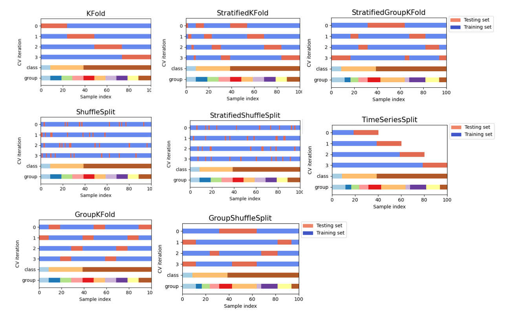

##	*API* 参考

|模块|模块描述|
|-----|-----|
|`sklearn.base`|基类、实用程序函数|
|`sklearn.cluster`|无监督聚类|
|`sklearn.compose`|用于使用 *Transformer*|
|`sklearn.covariance`|协方差估计器|
|`sklearn.cross_decomposition`|交叉分解|
|`sklearn.decomposition`|矩阵分解|
|`sklearn.discriminant_analysis`|判别分析|
|`sklearn.gaussian_process`|高斯过程|
|`sklearn.linear_model`|（广义）线性模型|
|`sklearn.kernel_ridge`|内核岭回归|
|`sklearn.svm`|支持向量机|
|`sklearn.tree`|决策树|
|`sklearn.naive_bayes`|朴素贝叶斯|
|`sklearn.neighbors`|最近邻|
|`sklearn.neural_network`|神经网络|
|`sklearn.semi_supervised`|半监督学习|
|`sklearn.isotonic`|保序回归|
|`sklearn.manifold`|流形学习|
|`sklearn.mixture`|高斯混合模型|
|`sklearn.ensemble`|集成方法|
|`sklearn.pipeline`|管道|
|`sklearn.preprocessing`|预处理|
|`sklearn.metrics`|指标|
|`sklearn.feature_extraction`|特征提取|
|`sklearn.feature_selection`|特征选择|
|`sklearn.model_selection`|模型选择|
|`sklearn.random_projection`|随机投影|
|`sklearn.calibration`|预测概率校准|
|`sklearn.multiclass`| |
|`sklearn.multiouput`| |
|`sklearn.utils`|实用工具|
|`sklearn.impute`|插补|
|`sklearn.inspector`|检查|
|`sklearn.kernel_approximation`|内核近似|

> - *Scikit-Learn 1.2.0 API* 参考：<https://scikit-learn.org/1.2/modules/classes.html>
> - *Scikit-Learn 1.2.0* 指南：<https://scikit-learn.org/1.2/user_guide.html>
> - *Scikit-Learn 0.23 API* 中文参考：<https://scikit-learn.org.cn/lists/3.html>
> - *Scikit-Learn 0.23* 中文指南：<https://scikit-learn.org.cn/lists/2.html>

##	基础模块

###	`sklearn.base`

|估计器基类、*Mixin* 类|描述|核心方法、属性|
|-----|-----|-----|
|`base.BaseEstimator`|估计器基类|`set_params`、`get_params`|
|`base.ClassifierMixin`|分类器 *Mixin*|`score`（准确度）|
|`base.RegressorMixin`|回归估计器 *Mixin*|`score`（决定系数）|
|`base.ClusterMixin`|聚类估计器 *Mixin*|`fit_predict`（拟合并预测）|
|`base.BiclusterMixin`|双簇估计器 *Mixin*|`biclusters_`、`get_indices`、`get_shape`、`get_submatrix`|
|`base.DensityMixin`|密度估计器 *Mixin*|`score`（模型得分）|

|数据处理 *Mixin* 类|描述|核心方法、属性|
|-----|-----|-----|
|`base.TransformerMixin`|转换器 *Mixin*|`fit_transform`（拟合并转换）|
|`feature_selection.SelectorMixin`|支持掩码、特征选择转换器 *Mixin*|`fit_transform`、`get_support`、`inverse_transform`、`transform`|
|`base.ClassNamePrefixFeaturesOutMixin`|类前缀特征名 *Mixin*|`get_feature_names_out`（转换后特征名）|
|`base.OneToOneFeatureMixin`|1对1特征名 *Mixin*|`get_feature_names_out`（转换后特征名）|
|`base.OutlierMixin`|异常值检测 *Mixin*|`fit_predict`|

|函数|描述|
|-----|-----|
|`base.clone(estimator,*[,safe])`|克隆估计器|
|`base.is_classifier(estimator)`|是否为分类器|
|`base.is_regressor(estimator)`|是否为回归器|
|`config_context(**new_config)`|全局配置的上下文管理器|
|`get_config()`|获取当前配置|
|`set_config()`|设置全局配置|
|`show_versions()`|打印版本信息|

###	估计器特征函数

|估计器类通用属性、方法|含义|依赖类、方法|
|-----|-----|-----|
|`get_params(deep)`|获取参数|`BaseEstimator`|
|`set_params(**params)`|设置参数|`BaseEstimator`|
|`score(X,y,sample_weight)`|准确度、决定系数、模型得分|`ClassifierMixin`、`RegressorMixin`、`DensityMixin`|
|`fit_predict(X,y)`|拟合并预测|`ClusterMixin`|
|`get_indices(i)`|类簇索引|`BiclusterMixin`|
|`get_shape(i)`|类簇形状|`BiclusterMixin`|
|`get_submatrix(i,data)`|类簇数据|`BiclusterMixin`|
|`biclusters_`|各类簇行、列索引|`BiclusterMixin`|
|`fit_transform(X,y)`|拟合并转换|`TransformMixin`|
|`fit(X,y)`|拟合模型|`ClusterMixin.fit_predict`、`TransformMixin.fit_transform`、`OutlierMixin.fit_predict`|
|`predict(X)`|预测|`ClassfierMixin`、`RegressorMixin`|
|`transform(X)`|转换|`TransformerMixin.fit_transform`|
|`get_feature_names_out()`|获取转换后特征名|`ClassNamePrefixFeatureOutMixin`、`OneToOneFeatureMixin`|

##	线性估计

###	`sklearn.linear_model`

> - *Scikit-Learn 0.24* 线性模型指南 - 中文：<https://scikit-learn.org.cn/view/4.html>
> - *Scikit-Learn 1.2.0* 线性模型指南：<https://scikit-learn.org/1.2/modules/linear_model.html#linear-model>

####	线性分类

|线性分类 *Estimator*|描述|
|-----|-----|
|`linear_model.LogisticRegression(*,penalty,...)`|逻辑回归|
|`linear_model.LogisticRegressionCV(*,Cs,cv,refit,...)`|交叉验证逻辑回归|
|`linear_model.RidgeClassifier(alpha,*,...)`|岭回归分类器|
|`linear_model.RidgeClassifierCV(alpha,*,...)`|交叉验证岭回归分类器|
|`linear_model.SGDClassifier(loss,*,panelty,...)`|*SGD* 训练分类器|
|`linear_model.Perceptron(*,penalty,alpha,...)`|感知机|
|`linear_model.PasssiveAggressiveClassifier(*,...)`|被动攻击算法|

-   说明
    -   `SGD` 是拟合线性模型的通用方法，适合大样本数量场合
        -   损失函数置为 `"log"` 拟合逻辑回归
        -   损失函数置为 `"hinge"` 拟合线性支持向量机
    -   `Perceptron` 感知机只使用错误样本更新模型，训练速度快

####	线性回归

|线性回归 *Estimator*|描述|
|-----|-----|
|`linear_model.LinearRegression(*,...)`|线性回归|
|`linear_model.Ridge(alpha,*,fit_intercept,...)`|岭回归|
|`linear_model.RidgeCV(alphas,*,fit_intercept,...)`|交叉验证岭回归|
|`linear_model.SGDRegressor(loss,*,penalty,...)`|随机梯度下降回归|

-	说明
	-	`Ridge` 通过提高偏差降低多重共线性带来的估计方差

####	特征选择线性回归

|带特征选择的回归 *Estimator*|描述|
|-----|-----|
|`linear_model.Lasso(alpha)`|*Lasso*|
|`linear_model.LassoCV(alpha)`|交叉验证 *Lasso*|
|`linear_model.Lars()`|最小角回归|
|`linear_model.LassoLars(alpha)`|最小角回归 *Lasso*|
|`linear_model.LassoLarsCV(alpha)`|交叉验证最小角回归 *Lasso*|
|`linear_model.LassoLarsIC(alpha)`|信息量最小角回归 *Lasso*|
|`linear_model.ElasticNet(alpha, l1_ratio)`|弹性网|
|`linear_model.ElasticNetCV(alpha, l1_ratio)`|交叉验证弹性网|
|`linear_model.OrthogonalMatcingPursuit()`|正交匹配追踪|
|`linear_model.OrthogonalMatcingPursuitCV()`|交叉验证正交匹配追踪|

|工具函数|描述|
|-----|-----|
|`linear_model.lars_path(X,y,*,eps,....)`|*Lars* 算法 *Lars*、*Lasso* 路径|
|`linear_model.lars_path_gram(X,y,*,Xy,Gram,....)`|统计模式下 *Lars* 路径|
|`linear_model.enet_path(X,y,*,l1_ratio,....)`|坐标下降算法下弹性网路径|
|`linear_model.lasso_path(X,y,*,eps,....)`|坐标下降算法下 *Lasso* 路径|
|`linear_model.orthogonal_mp(X,y,*,....)`|正交匹配追踪|
|`linear_model.orthogonal_mp_gram(Gram,Xy,*,....)`|伽马正交匹配追踪|
|`linear_model.ridge_regression(X,y,alpha,*,....)`|正规方程法求教岭回归|

|多任务特征选择的回归 *Estimator*|描述|
|-----|-----|
|`linear_model.MultiTaskLasso(alpha)`|多任务 *Lasso*|
|`linear_model.MultiTaskLassoCV(alpha)`|多任务 *Lasso*|
|`linear_model.MultiTaskElasticNet(alpha, l1_ratio)`|多任务弹性网|
|`linear_model.MultiTaskElasticNetCV(alpha, l1_ratio)`|多任务弹性网|

-	说明
	-	`MultiTask` 特征选择估计指同一组特征被用于拟合多个任务（模型）
		-	即，因变量为二维矩阵
		-	用于强约束多任务中有效特征相同，即确保相同特征训练过程中被选中
		-	可视为线性模型中的归纳、迁移，即多模型共享相同学习经验
	-	`MultiTask` 通过系数 $l_{21}$ 范数确保系数整体在多模型中被同时选中
		-	此时，单个模型中稀疏性让位于多任务整体特征选择

####	异常值稳健回归

|异常值稳健回归器|描述|
|-----|-----|
|`linear_model.RANSACRegressor()`|随机抽样一致算法|
|`linear_model.TheilSenRegressor()`|广义中值估计器|
|`linear_model.HuberRegressor()`|*Huber* 回归|

-   说明
    -   `RANSAC` 从随机样本子集开始，不断迭代通过样本残差区分有效点、离群点，训练最终模型
    -   `TheilSen` 是基于空间中值的非参估计器，对数据基本分布无假设
    -   `Huber` 根据样本点绝对误差区分有效点、离群点，赋予离群点（残差超过阈值）较小权重

####	贝叶斯回归

|贝叶斯回归 *Estimator*|描述|
|-----|-----|
|`linear_model.BayesianRidge()`|贝叶斯岭回归|
|`linear_model.ARDRegression()`|主动相关决策理论回归|

####	广义线性回归

|广义线性回归 *Estimator*|描述|
|-----|-----|
|`linear_model.PoissonRegressor(*,alpha,...)`|泊松分布广义线性模型|
|`linear_model.TweedieRegressor(*,power,...)`|*Tweedie* 分布广义线性模型|
|`linear_model.GammaRegressor(*,power,...)`|*Gamma* 分布广义线性模型|

###	`sklearn.svm`

|估计器|描述|
|-----|-----|
|`svm.LinearSVC(penalty,loss,dual,tol,C,...)`|线性支持向量分类|
|`svm.LinearSVR(*,epsilon,tol,C,loss,...)`|线性支持向量回归|
|`svm.NuSVC(*,nu,kernel,degree,gamma,...)`|*Nu* 支持向量分类|
|`svm.NuSVR(*,nu,kernel,degree,gamma,...)`|*Nu* 支持向量回归|
|`svm.SVC(*,C,kernel,degree,gamma,...)`|*C* 支持向量分类|
|`svm.SVR(*,kernel,degree,gamma,coef0,...)`|*Epsilon* 支持向量回归|
|`svm.OneClassSVM(*,kernel,degree,gamma,...)`|无监督异常值检测|
|`svm.l1_min_c(X,y,*,loss,fit_intercept,...)`|*C* 最低界限|

###	`sklearn.discriminant_analysis`

|类、*Mixin*|描述|
|-----|-----|
|`LinearDiscriminantAnalysis()`|线性判别分析|
|`QuadraticDiscriminantAnalysis()`|二次判别分析|

###	`sklearn.isotonic`

|类|描述|
|-----|-----|
|`isotonic.IsotonicRegression(*,y_min,...)`|保序回归|
|`isotonic.check_increasing(x,y)`|检查单调相关性|
|`isotonic.isotonic_regression(y,*,...)`| |

###	`sklearn.kernel_ridge`

|类|描述|
|-----|-----|
|`kernel_ridge.KernelRdige(alpha,kernel,*,...)`|内核岭回归| | |

###	`sklearn.naive_bayes`

|估计器|描述|
|-----|-----|
|`navie_bayes.BernoulliNB(*,alpha,...)`|多元伯努利|
|`navie_bayes.CategoricalNB(*,alpha,...)`|分类|
|`navie_bayes.ComplementNB(*,alpha,...)`|补体贝叶斯|
|`navie_bayes.GaussianNB(*,priors,...)`|高斯朴素贝叶斯|
|`navie_bayes.MultinominalNB(*,alpha,...)`|多项分布|

##	非线性估计

###	`sklearn.tree`

|估计器|描述|
|-----|-----|
|`tree.DecisionTreeClassifier(*,criterion,splitter,max_depth,min_samples_split,...)`|决策树分类|
|`tree.DecisionTreeRegreesor(*,criterion,...)`|决策树回归|
|`tree.ExtraTreeClassifier(*,criterion,...)`|极端树分类|
|`tree.ExtraTreeRegressor(*,criterion,...)`|极端树回归|

|工具函数|描述|
|-----|-----|
|`tree.export_graphviz(decision_tree,...)`|*DOT* 格式导出决策树|
|`tree.export_text(decision_tree,...)`|文本格式决策树|
|`tree.plot_tree(decision_tree,...)`|绘制决策树|

> - *Scikit-Learn 0.24* 决策树指南 - 中文：<https://scikit-learn.org.cn/view/89.html>
> - *Scikit-Learn 1.2.0* 决策树指南：<https://scikit-learn.org/1.2/modules/tree.html#tree>
> - *Scikit-Learn 1.2.0 API - Tree* ：<https://scikit-learn.org/1.2/modules/classes.html#module-sklearn.tree>

####    `sklearn.tree._tree.Tree`

|`sklearn.tree._tree.Tree` 属性|描述|*Shape*|
|-----|-----|-----|
|`Tree.node_count`|节点数量| |
|`child_left`|节点左儿子编号（叶子取常量 `-1`）|`(node_count,)`|
|`child_right`|节点右儿子编号（叶子取常量 `-1`）|`(node_count,)`|
|`feature`|节点分裂所用特征（叶子取常量 `-2`）|`(node_count,)`|
|`threshold`|节点分裂阈值|`(node_count,)`|
|`impurity`|节点分裂指标值（熵取 `lg2`）|`(node_count,)`|
|`value`|（实际训练时）节点各类样本（加权）数量|`(node_count, n_output, max_n_classes)`|

-   `sklearn.tree._tree.Tree`：通过数组存储、组织节点信息，存储决策树的树结构
    -   常作为 `DecisionTree.tree_` 属性

-   说明
    -   `values` 存储实际训练时各节点中各类样本的加权数量
        -   对普通决策树，训练集即实际训练所用样本
        -   在随机森林等自举场合，各树训练所用样本为训练集子集，即训练集整体实际决策路径与树存储结果有差异

> - *Scikit-Learn 1.2.0 Tree Structure* ：<https://scikit-learn.org/1.2/auto_examples/tree/plot_unveil_tree_structure.html>

###	`sklearn.neural_networks`

|神经网络|描述|
|-----|-----|
|`neural_network.BernoulliRBM(n_components,...)`|伯努利限制玻尔兹曼机|
|`neural_network.MLPClassifier(...)`|多层感知机分类器|
|`neural_network.MLPRegressor(...)`|多层感知机回归器|

##	集成工具

###	`sklearn.ensemble`

|集成 *Estimator*|描述|
|-----|-----|
|`ensemble.IsolationForest(*,n_estimators,...)`|独立森林|

> - *Scikit-Learn 0.24* 集成算法指南 - 中文：<https://scikit-learn.org.cn/view/90.html>
> - *Scikit-Learn 1.2.0* 集成算法指南：<https://scikit-learn.org/1.2/modules/ensemble.html#ensemble>

####	平均集成

|平均集成 *Estimator*|描述|
|-----|-----|
|`ensemble.BaggingClassifier(base_estimator,n_estimator,*,...)`|*Bagging* 分类器|
|`ensemble.BaggingRegressor(base_estimator,*,...)`|*Bagging* 回归器|
|`ensemble.RandomForestClassifier(n_estimator,*,max_depth,min_samples_split,...)`|随机森林分类器|
|`ensemble.RandomForestRegressor(n_estimator,*,,...)`|随机森林回归器|
|`ensemble.ExtraTreesClassifier(n_estimator,*,...)`|极端随机树分类器|
|`ensemble.ExtraTressRegressor(n_estimators,*,...)`|极端随机树回归器|
|`ensemble.RandomTreesEmbedding(n_estimators,*,max_depth,...)`|随机决策树嵌入 *Transformer*|

-	说明
	-	`Bagging` 通过在原始训练集的随机子集上训练引入随机性
		-	集成即可降低单个估计器方差
		-	可降低过拟合，对复杂模型效果更好
	-	`RandomForest` 为随机抽取特征、有放回抽样、最佳分割点
	-	`ExtraTree` 为随机抽取特征、有放回抽样、最佳随机分割点
		-	略微增加偏差、降低方差
    -   `RandomTreesEmbedding` 利用树、叶子节点编码原始特征做高维、稀疏嵌入
        -   转换为 *One-hot* 编码，每棵树视为新特征、每个叶子视为特征中取值
        -   其中树是 **无监督、随机** 构建的
        -   当然，可使用 `RandomForestClassifier` 等做有监督嵌入

####	提升集成

|提升集成 *Estimator*|描述|
|-----|-----|
|`ensemble.AdaBoostClassifier(...)`|*AdaBoost* 分类器|
|`ensemble.AdaBoostRegressor(base_estimator,*,...)`|*AdaBoost* 回归器|
|`ensemble.GradientBoostingClassifier(...)`|梯度提升分类器|
|`ensemble.GradientBossingRegressor(...)`|梯度提升回归器|
|`ensemble.HistGradientBoostingRegressor(...)`|基于直方图的梯度提升分类树|
|`ensemble.HistGradientBoostingClassifier(...)`|基于直方图的梯度提升分类树|

-   说明
    -   `HistGradientBoosting` 即基于 *LightGBM* 的梯度提升树
        -   内置缺失值支持
        -   通过直方图预分箱减少节点待分裂点数量

####    投票、堆叠

|集成 *Estimator*|描述|
|-----|-----|
|`ensemble.VotingClassifer(estimators,*,voting,weights,...)`|软投票分类器|
|`ensemble.VotingRegression(estimators,*,weights,...)`|预测投票回归器|
|`ensemble.StackingClassfier(estimators,final_estimator,*,...)`|带最终分类器的 *Stacking*|
|`ensemble.StackingRegression(estimators,finale_estimator,*,...)`|带最终回归器的 *Stacking*|

-   说明
    -   `Voting` 使用平均数（回归）、众数（分类）得到最终决策结果
    -   `Stacking` 并行堆叠多个估计器，输入相同数据并将输出作为最终估计器的输入
        -   组合估计器以减少偏差，但实际应用中效果基本同基本层最佳预测器
        -   可将 `final_estimator` 参数置为其他堆叠估计器实现多个堆叠层

###	`sklearn.pipeline`

|管道 *Estimator*、函数|描述|
|-----|-----|
|`pipeline.Pipeline(steps,*,memory,verbose)`|管道|
|`pipeline.FeatureUnion(transformer_list,*,...)`|特征聚合|
|`pipeline.make_pipeline(*steps,**kwargs)`|创建管道|
|`pipeline.make_union(*transformers,**kwargs)`|创建特征聚合|

-   说明
    -   `Pipeline` 将多个估计器串联
        -   管道中除最后环节外均需为 *Transformer*（即实现 `transform` 方法）
        -   管道最后环节决定管道角色
    -   `FeatureUnion` 并联多个转换器对象结果

> - *Scikit-Learn 0.24* 管道复合指南 - 中文：<https://scikit-learn.org.cn/view/118.html>
> - *Scikit-Learn 1.2.0* 管道复合指南：<https://scikit-learn.org/1.2/modules/compose.html>

###	`sklearn.compose`

|转换器类、函数|描述|
|-----|-----|
|`compose.TransformedTargetRegressor(regressor,*,transformer,...)`|转换回归目标、创建回归器|
|`compose.ColumnTransformer(transformers,*,...])`|按列应用的 *Transformer*|
|`compose.make_column_selector(pattern,*,dtype_include,dtype_exclude)`|配合 `ColumnTransformer` 选择列|
|`compose.make_column_transformer(*transformers,**kwargs)`|创建按列应用的转换器|

-   说明
    -   `TransformeredTargetRegressor`：在变换后的回归目标上创建回归器
        -   可改变回归目标分布，优化拟合效果
    -   `ColumnTransformer`：为各列异构数据分别指定转换器

> - *Scikit-Learn 0.24* 管道复合指南 - 中文：<https://scikit-learn.org.cn/view/118.html>
> - *Scikit-Learn 1.2.0* 管道复合指南：<https://scikit-learn.org/1.2/modules/compose.html>

###	`sklearn.multiclass`

|多分类策略类|描述|
|-----|-----|
|`multiclass.OneVsRestClassifier(estimator,*,...)`|*1vsR* 策略|
|`multiclass.OneVsOneClassifier(estimator,*,...)`|*1vs1* 多策略|
|`multiclass.OutputCodeClassifier(estimator,*,...)`|输出代码策略|

###	`sklearn.multioutput`

|多输出类|描述|
|-----|-----|
|`multioutput.ClassifierChain(base_estimator,*,...)`|多分类器链|
|`multioutput.RegressorChain(base_estimator,*,...)`|多回归器链|
|`multioutput.MultiOutputClassifier(estimators,*,...)`|多目标分类|
|`multioutput.MultiOutputRegressor(estimators,*,...)`|多目标回归|

##	无、半监督学习

###	`sklearn.cluster`

|基类、*Mixin* |描述|
|-----|-----|
|`cluster.AffinityPropagation(*[,damping,...])`|近邻传播聚类|
|`cluster.AgglomerativeClustering(...)`|聚集聚类|
|`cluster.Birch(*[,threshold,...])`|*Birch* 聚类|
|`cluster.DBSCAN([eps,*,min_samples,metrics,...])`|*DBSCAN* 聚类|
|`cluster.FeatureAgglomeration([n_cluster,...])`| |
|`cluster.KMeans([n_cluster,init,n_init,...])`|*K-* 均值聚类|
|`cluster.MiniBatchKMeans([n_cluster,init,...])`|小批次 *K-* 均值聚类|
|`cluster.MeanShift(*[,bandwidth,seed,...])`|均值漂移聚类|
|`cluster.OPTICS(*[,min_samples,max_eps,...])`| |
|`cluster.SpectralClustering([n_clusters,...])`| |
|`cluster.SpectralBiclustering([n_clusters,...])`| |
|`cluster.SpectralCoclustering([n_clusters,...])`| |

|函数|描述|
|-----|-----|
|`cluster.affinity_propagation(S,*,...)`|近邻传播聚类|
|`cluster.cluster_optics_dbscan(*,...)`| |
|`cluster.cluster_optics_xi(*,...])`| |
|`cluster.compute_optics_graph(X,*,...)`| |
|`cluster.dbscan(X[,eps,min_samples,...)`| |
|`cluster.estimate_bandwidth(X,*,quantile,...)`| |
|`cluster.k_means(X,n_clusters,*,...)`| |
|`cluster.mean_shift(X,*,bandwidth,seeds,...)`| |
|`cluster.spectral_clustering(affinity,*,...)`| |
|`cluster.ward_tree(X,*,connectivity,...)`| |

> - 聚类方法：<https://scikit-learn.org/stable/modules/clustering.html>
> - 聚类方法 - 中文：<https://scikit-learn.org.cn/view/108.html>

###	`sklearn.neighbors`

|近邻估计|描述|
|-----|-----|
|`neighbors.BallTree(X[,leaf_size,metric])`|球树|
|`neighbors.DistanceMetric()`| |
|`neighbors.KDTree(X[,leaf_size,metric])`|*KDTree*|
|`neighbors.KernelDensity(*,bandwidth,...)`|核密度分析|
|`neighbors.KNeighborsClassifier(n_neighbors,...)`|*K* 近邻分类|
|`neighbors.KNeighborsRegressor(n_neighbors,...)`|*K* 近邻回归|
|`neighbors.KNeighborsTransformer(*,mode,...)`|*K* 近邻加权图|
|`neighbors.LocalOutlierFactor(n_neighbors,...)`|局部离群因子的无监督离群检测|
|`neighbors.RadiusNeighborsClassifier(radius,...)`|半径近邻分类|
|`neighbors.RadiusNeighborsRegressor(radius,...)`|半径近邻回归|
|`neighbors.RadiusNeighborsTransformer(*,...)`|半径近邻加权图|
|`neighbors.NearestCentroid(metric,...)`|质心分类器|
|`neighbors.NearestNeighbors(*,n_neighbors,...)`|最近邻|
|`neighbors.NeighborshoodComponentsAnalysis(...)`|领域成分分析|
|`neighbors.kneighbors_graph(X,n_neighbors,*,...)`|*K* 近邻加权图|
|`neighbors.radius_neighbors_graph(X,radius,*,...)`|半径近邻加权图|

###	`sklearn.gaussian_process`

|类|描述|
|-----|-----|
|`gaussian_process.GaussianProcessClassifier(...)`|高斯过程分类|
|`gaussian_process.GaussianProcessRegressor(...)`|高斯过程回归|

|核类、属性|描述|
|-----|-----|
|`gaussian_process.kernels.Kernel`|核基类|
|`gaussian_process.kernels.Hyperparameter`|核超参规范（命名元组）|
|`gaussian_process.kernels.kernels.CompoundKernel(Kernel)`|复合核|
|`gaussian_process.kernels.ConstantKernel(...)`|常量核|
|`gaussian_process.kernels.DotProduct(...)`|点积核|
|`gaussian_process.kernels.ExpSineSquared(...)`|周期核|
|`gaussian_process.kernels.Exponentiation(...)`|幂运算核|
|`gaussian_process.kernels.Matern(...)`|主核|
|`gaussian_process.kernels.PariwiseKernel(...)`|`sklearn.metrics.pairwise` 核包装|
|`guassian_process.kenrels.RBF(length_scale,...)`|径向基核|
|`guassian_process.kenrels.RationalQuasdratic(...)`|有理平方核|
|`guassian_process.kenrels.Sum(k1,k2)`|加和核|
|`guassian_process.kenrels.ProductKernel(k1,k2)`|乘积核|
|`guassian_process.kenrels.WhiteKernel(...)`| |

###	`sklearn.mixture`

|类|描述|
|-----|-----|
|`mixture.GaussianMixture([n_components,...])`|高斯混合模型|
|`mixture.BayesGaussianMixture(*,...)`|高斯混合的变分贝叶斯估计|

###	`sklearn.manifold`

|工具函数|描述|
|-----|-----|
|`manifold.Isomap(*,n_neighbors,...)`|等值图嵌入|
|`manifold.LocallyLinearEmbedding(*,...)`|局部线性嵌入|
|`manifold.MDS(n_components,metric,n_init,...)`|多维缩放|
|`manifold.SpectralEmbedding(n_components,...)`|频谱嵌入（非线性降维）|
|`manifold.TSNE(n_components,perplexity,...)`|*t* 分布随机邻接嵌入|
|`manifold.locally_linear_embedding(X,*,n_components,...)`|局部线性嵌入|
|`manifold.smacof(dissimilarities,*,...)`|*SMACOF* 算法计算多维缩放|
|`manifold.spectral_embedding(adjacency,*,...)`|投影至拉普拉斯算子首个特征向量|
|`manifold.trustworthiness(X,X_embedded,*,...)`|本地结构保留程度|

###	`sklearn.semi_supervised`

|类|描述|
|-----|-----|
|`semi_supervised.LabelPropagation(kernel,...)`|标签传播分类|
|`semi_supervised.LabelSpreading(kernel,...)`| |

## 模型选择、评估

###	`sklearn.metrics`

|工具函数|描述|
|-----|-----|
|`metrics.check_scoring(estimator[,scoring,...])`| |
|`metrics.get_scorer()`| |
|`metrics.make_scorer(score_func,*,greater_is_better,...)`|封装指标函数为评分器|
|`metrics.auc(x,y)`|根据 *TPR*、*FPR* 计算 *AUC*|

-   说明
    -   `sklearn.metrics` 模块中提供可用于测定真实值、预测值之间预测误差的指标函数
        -   `_score` 结尾函数：值越大越好
        -   `_error`、`_loss` 结尾函数：值越小越好
    -   交叉验证中可通过 `scroing` 参数指定模型评估指标（标量、`list`、`dict`）
        -   预定义评估指标：可通过字符串方式指定，对应 `sklearn.metrics` 模块中相应指标函数
        -   `metrics.make_scorer` 封装指标：`sklearn.metrics` 中预定义指标函数、自定义指标函数
            -   `metrics.fbeta_score`：需额外指定 `beta` 参数
        -   自定义指标评估对象 `<SCORING_FUNC>(estimator,X,y)`

> - *Scikit-Learn 0.24* 指标、评分中文指南：<http://scikit-learn.org.cn/view/93.html>
> - *Scikit-Learn 1.2.0* 指标、评分指南：<https://scikit-learn.org/1.2/modules/model_evaluation.html>

####    回归指标

|回归指标函数|描述|
|-----|-----|
|`metrics.r2_score(y_true,y_pred,*,...)`|$R^2$ 决定系数|
|`metrics.explained_variance_score(y_true,...)`|方差回归得分解释|
|`metrics.max_error(y_true,y_pred)`|最大误差|
|`metrics.mean_absolute_error(y_true,y_pred,*,...)`|平均绝对误差|
|`metrics.mean_squared_erro(y_true,y_pred,*,...)`|均方误差|
|`metrics.mean_squared_log_error(y_true,y_pred,*,...)`|均方对数误差|
|`metrics.median_absolute_error(y_true,y_pred,*,...)`|中值绝对误差|
|`metrics.mean_possion_deviance(y_true,y_pred,*,...)`|平均泊松偏差|
|`metrics.mean_gamma_deviance(y_true,y_pred,*,...)`|平均伽马偏差|
|`metrics.mean_tweedie_deviance(y_true,y_pred,*,...)`|平均 *Tweedie* 偏差|

####    分类指标

|仅二分类指标|描述|
|-----|-----|
|`metrics.roc_curve(y_true,y_score,*,...)`|*ROC* 曲线|
|`metrics.precision_recall_curve(y_true,...)`|不同概率阈值精度、召回对|
|`metrics.det_curve(y_true,y_score,...)`|不同概率阈值下错误率|
|`metrics.class_likelihood_rations(y_true,y_pred,*,...)`| |

|适合多分类指标|描述|
|-----|-----|
|`metrics.balanced_accuracy_score(y_true,...)`|平衡准确率|
|`metrics.top_k_accuracy_score(y_true,y_score,*,...)`|（多分类）*TopK* （包含真实类）准确率|
|`metrics.confussion_matrix(y_true,y_pred,*,...)`|混淆矩阵|
|`metrics.cohen_kappa_score(y1,y2,*,...)`|科恩卡帕系数|
|`metrics.roc_auc_score(y_true,y_score,*,...)`|*ROC*、*AUC*|
|`metrics.mathews_corrcoef(y_true,y_pred,*,...)`|马修斯相关系数|
|`metrics.hinge_loss(y_true,pred_decision,*,...)`|*Hinge* 损失|

|适合多标签指标|描述|
|-----|-----|
|`metrics.accuracy_score(y_true,y_pred,*,...)`|准确率|
|`metrics.precision_score(y_true,y_pred,*,...)`|精度|
|`metrics.precision_recall_fscore_support(...)`|精度、召回、*F1* 分数、支持度|
|`metrics.recall_score(y_true,y_pred,*,...)`|召回率|
|`metrics.f1_score(y_true,y_pred,*,...)`|*F1* 分数|
|`metrics.fbeta_score(y_true,y_pred,*,beta)`|*F-beta* 分数|
|`metrics.classification_report(y_true,y_pred,*,...)`|主要分类指标文本报告|
|`metrics.multilabel_confusion_matrix(y_true,...)`|多类别混淆矩阵|
|`metrics.hamming_loss(y_tree,y_pred,*,...)`|*Hamming* 损失|
|`metrics.jaccard_score(y_true,y_pred,*,...)`|*Jaccard* 距离|
|`metrics.log_loss(y_true,y_pred,*,eps,...)`|对数损失|
|`metrics.zero_one_loss(y_true,y_pred,*,...)`|*0-1* 损失|
|`metrics.brier_score_loss(y_true,y_prob,*,...)`|*Brier* 分数|

|仅适合多标签、不适合多分类指标|描述|
|-----|-----|
|`metrics.average_precision_score(y_true,...)`|平均精度|

|其他函数|描述|
|-----|-----|

-   说明
    -   部分指标最初为二分类设计，延申至多分类场合时视为为各类别 *1vsR* 问题，即需通过 `average` 参数指定指标平均方式
        -   `macro`：指标简单平均，各类别权重相同
            -   效率高
            -   易高估低频类别（效果往往不好）重要性
        -   `weighted`：指标按各类别频率加权平均
        -   `micro`：修改指标计算逻辑，使得各类别对指标贡献相同
            -   如：各类指标分子、分母独立加和，之后再计算结果
            -   适合多标签场景
        -   `samples`：逐样本计算标签预测指标，最后按样本加权
            -   仅适合多标签场景

####    多标签排名指标

|多标签排名指标|描述|
|-----|-----|
|`metrics.coverage_error(y_true,y_score,*,...)`|覆盖误差测量|
|`metrics.label_ranking_average_precision_score(...)`|基于排名的平均精度|
|`metrics.label_ranking_loss(y_true,y_score,*,...)`|排名损失|
|`metrics.dcg_score(y_true,y_score,*,k,...)`|累计折现增益|
|`metrics.ndcg_score(y_true,y_score,*,k,...)`|归一化折现累积增益|

####    聚类指标

|聚类指标|描述|
|-----|-----|
|`metrics.mutual_info_score(labels_true,...)`|互信息|
|`metrics.normalized_mutual_info_score(labels_true,...)`|标准化互信息|
|`metrics.adjusted_mutual_info_score(...)`|调整的互信息|
|`metrics.homogenetiy_score(labels_true,...)`|同质性|
|`metrics.completeness_score(label_true,...)`|完整性|
|`metrics.v_measure_score(labels_true,label_pred,*,beta)`|*V-measure* 分数|
|`metrics.homogeneity_completeness_v_measures(...)`|同质性、完整性、*V-measure* 分数|
|`metrics.adjusted_rand_score(labels_true,...)`|调整的兰德指数|
|`metrics.calinski_harabasz_score(X,labels)`|*Calinski*、*Harabasz* 得分|
|`metrics.davies_bouldin_score(X,labels)`|*Davies-Bouldin* 分数|
|`metrics.cluster.contigency_matrix(...)`|列联表|
|`metrics.fowlkes_mallows_score(labels_ture,...)`| |
|`metrics.silhouette_score(X,labels,*,...)`|平均轮廓系数|
|`metrics.silhouette_sample(X,labels,*,...)`|各样本轮廓系数|

|双聚类指标|描述|
|-----|-----|
|`metrics.consensus_score(a,b,*,similarity)`|相似性|

> - *Scikit-Learn 0.24* 聚类指标中文指南：<https://scikit-learn.org.cn/view/108.html#2.3.10.%20%E8%81%9A%E7%B1%BB%E6%80%A7%E8%83%BD%E5%BA%A6%E9%87%8F>
> - *Scikit-Learn 1.2.0* 聚类指标指南：<https://scikit-learn.org/1.2/modules/clustering.html#clustering-evaluation>
> - *Scikit-Learn 0.24* 双聚类指标中文指南：<https://scikit-learn.org.cn/view/109.html#2.4.3.%20Biclustering%20%E8%AF%84%E4%BB%B7>
> - *Scikit-Learn 1.2.0* 双聚类指标指南：<https://scikit-learn.org/1.2/modules/biclustering.html#biclustering-evaluation>

####    成对指标

|成对指标|描述|
|-----|-----|
|`metrics.pairwise_distances(X[,Y,metrics,...])`|距离矩阵|
|`metrics.pairwise_distances_argmin(X,Y,*,...])`|*1-N* 最小距离|
|`metrics.pairwise_distances_argmin_min(X,Y,*,...])`|*1-N* 最小距离|
|`metrics.pairwise_distances_chunked(X[,Y,...])`|通过可选缩减逐块生成距离矩阵|
|`metrics.pairwise.distance_metrics()`|有效距离指标键值对|
|`metrics.pairwise.consine_similarity(X[,Y,...])`|余弦相似度|
|`metrics.pairwise.consine_distances(X[,Y,...])`|余弦距离|
|`metrics.pairwise.euclidean_metrics(X[,Y,...])`|欧式距离|
|`metrics.pairwise.nan_euclidean_distances(X[,Y,...])`|可处理缺失值的欧氏距离|
|`metrics.pairwise.haversine_metrics(X[,Y,...])`|*Haversine* 距离|
|`metrics.pairwise.manhattan_distances(X[,Y,...])`|曼哈顿距离|
|`metrics.pairwise.paired_distances(X,Y,*,...)`|成对计算距离|
|`metrics.pairwise.paired_euclidean_distances(X,Y)`|成对欧式距离|
|`metrics.pairwise.paired_manhattan_distances(X,Y)`|成对曼哈顿距离|
|`metrics.pairwise.paired_consine_distances(X,Y)`|成对余弦距离|
|`metrics.pairwise.kernel_metrics()`|有效核指标键值对|
|`metrics.pairwise.pairwise_kernels(X[,Y,...])`|成对计算内核|
|`metrics.pairwise.laplacian_kernel(X[,Y,...])`|拉普拉斯核|
|`metrics.pairwise.linear_kernel(X[,Y,...])`|线性核|
|`metrics.pairwise.polynomial_kernel(X[,Y,...])`|多项式核|
|`metrics.pairwise.rbf_kernel(X[,Y,...])`|径向基核|
|`metrics.pairwise.sigmoid_kernel(X[,Y,...])`|*S* 型核|
|`metrics.pairwise.chi2_kernel(X,Y,gamma)`|卡方核|
|`metrics.pairwise.additive_chi2_kernel(X,Y)`|加性卡方核|

> - *Scikit-Learn 0.24* 成对指标中文指南：<https://scikit-learn.org.cn/view/128.html>
> - *Scikit-Learn 1.2.0* 成对指标指南：<https://scikit-learn.org/1.2/modules/metrics.html#metrics>

####    指标绘图

|绘图函数|描述|
|-----|-----|
|`metrics.ConfusionMatrixDisplay(...)`|混淆矩阵可视化|
|`metrics.PrecisionRecallDisplay(...)`|精度、召回可视化|
|`metrics.RocCurveDisplay(...)`|*ROC* 曲线可视化|
|`metrics.plot_confusion_matrix(estimiator,X,...)`|绘制混淆矩阵|
|`metrics.plot_precision_recall_curve(...)`|精度、召回曲线|
|`metrics.plot_roc_curve(estimator,X,y,*,...)`|*ROC* 曲线|

###	`sklearn.model_selection`

|模型选择辅助函数|描述|
|-----|-----|
|`model_selection.check_cv(cv,y,classifier)`|构建检查验证器|
|`model_selection.train_test_split(*arrays,...)`|随机拆分训练、测试集|
|`model_selection.learning_curve(estimator,X,...)`|学习曲线|
|`model_selection.validation_curve(estimiator,...)`|验证曲线|

-   模型训练流程说明
    -   数据集切分、作用
        -   训练集：训练模型、测试模型超参、测试模型选择
        -   验证集：评估模型超参数、评估模型选择
        -   测试集：评估模型最终效果
    -   交叉验证：通过重采样的方式迭代使用数据集的不同部分训练、验证模型
        -   即，通过一定方式拆分数据为训练集、验证集，循环使用数据
        -   则，交叉验证可
            -   训练多个模型：提供多个输出作为后续输入
            -   得到多组评估指标：每个模型独立评估，降低数据划分随机因素影响
            -   提高训练数据量（核心）：确定最优模型、超参后，在所有数据训练最终模型
        -   交叉验证仅实现：所有数据训练最终模型时，各交叉验证中对应配置、多个模型效果可用于评价最终模型效果
            -   单纯的模型选择、超参调优通过简单划分验证集即可实现
            -   事实上，简单划分验证集调参、全部数据训练最终模型也可达到提高训练数据量效果
            -   故，交叉验证实质仅是通过多次划分数据、训练多个模型，以降低随机性影响

> - <https://towardsdatascience.com/5-reasons-why-you-should-use-cross-validation-in-your-data-science-project-8163311a1e79>

####    交叉验证

|交叉验证迭代器方法|描述|
|-----|-----|
|`BaseCrossValidator.split(X,y,groups)`|迭代生成训练集、验证集索引|
|`BaseCrossValidator.get_n_splits(X,y,groups)`|数据集切分次数|

|交叉验证迭代器|描述|
|-----|-----|
|`model_selection.KFold([n_splits,*,shuffle,random_state])`|*K* 折交叉验证|
|`model_selection.LeaveOneOut()`|留一交叉验证|
|`model_selection.LeavePOut(p)`|留 *p* 交叉验证|
|`model_selection.ShuffleSplit([n_splits,*,test_size,...])`|随机分组交叉验证|
|`model_selection.GroupKFold([n_splits])`|组 *K* 折交叉验证|
|`model_selection.LeaveOneGroupOut()`|留一组交叉验证|
|`model_selection.LeavePGroupOut(n_groups)`|留 *p* 组交叉验证|
|`model_selection.GroupShuffleSplit(...)`|随机分组交叉验证|
|`model_selection.StratifiedShuffleSplit([n_splits,...])`|分层随机分组交叉验证|
|`model_selection.StratifiedKFold(n_splits,*,...)`|分层 *K* 折交叉验证|
|`model_selection.RepeatedKFold(*,n_splits,...)`|重复 *K* 折交叉验证|
|`model_selection.RepeatedStratifiedKFold(*,n_splits,...)`|重复分层 *K* 折交叉验证|
|`model_selection.PredefinedSplit(test_fold)`|预定义的拆分交叉验证|
|`model_selection.TimeSeriesSplit(n_splits,*,...)`|时间序列交叉验证|

-   说明
    -   `KFold`、`Leave`、`Shuffle`、`Stratified`、`Group`
        -   `KFold`：无重复的按比例拆分
        -   `Leave`：无重复（留置整体无重复）的按数量拆分
        -   `Shuffle`：有重复的按比例拆分
        -   `Stratified`：按标签分层拆分
        -   `Group`：以额外组标签作为最小单元拆分
    -   `RepeatedKFold`：重复执行 *K* 折，每轮生成不同分组
        -   其 `split` 方法会展平轮次直接迭代出全部分组
        -   即，用于需要保证数据拆分的前提下，提升采样次数
    -   `TimeSeriesSplit`：切分 $2K-1$ 段，逐次以前 $K,K+1,2K-2$ 段作为训练集、第 $K+1,K+2,...,2K-1$ 段作为测试集

|交叉验证辅助函数|描述|
|-----|-----|
|`model_selection.cross_validate(estimator,X,y,*,scoring,cv,...)`|交叉验证多指标评估|
|`model_selection.cross_val_score(estimator,X,y,*,scoring,cv,...)`|交叉验证得分|
|`model_selection.cross_val_predict(estimator,X,y,*,...)`|交叉验证预测|
|`model_selection.permutation_test_score(...)`|全排列交叉验证得分|

-   说明
    -   `cross_val_score`：快速执行交叉验证、获取模型平均得分
        -   可通过参数配置
            -   评估指标 `scoring`
            -   交叉验证（数据集拆分）方式 `cv`：可传入自定义返回训练集、验证集索引的迭代器
    -   `cross_validate`：允许评估多个指标，并通过字典方式评估结果
        -   评估指标项包括
            -   缺省为拟合时间、预测时间、测试得分
            -   测试得分项可自定义、细化为多项
    -   `cross_val_predict`：获取交叉验证中单个模型单独得分
        -   交叉验证中单个模型得分不常用，少数应用场合包括
            -   单个模型得分输出被用于后续模型输入
            -   不同模型预测值的可视化输出

> - *Scikit-Learn 0.24* 交叉验证中文指南：<https://scikit-learn.org.cn/view/6.html>
> - *Scikit-Learn 1.2.0* 交叉验证指南：<https://scikit-learn.org/1.2/modules/cross_validation.html>

####    超参搜索

|超参优化器|描述|
|-----|-----|
|`model_selection.GridSearchCV(estimator,param_grid,*,scoring,...)`|（穷举）网格搜索|
|`model_selection.RandomizedSearchCV(estimator,param_distributions,*,scoring,...)`|（按指定分布）随机搜索|
|`model_selection.HalvingGridSearchCV(estimator,param_grid,*,resource,...)`|
|`model_selection.HalvingRanddomSearchCV(estimator,param_distributions,*,resource,...)`|
|`model_selection.ParameterGrid(param_grid)`|参数网格（笛卡尔积）|
|`model_selection.ParameterSampler(param_distributions,n_iter,*,...)`|参数随机采样|

-   说明
    -   `BaseSearchCV` 实现有 *estimiator*、*transformer* 等类的典型方法
        -   估计器：`fit`、`predict`、`predict_log_proba`、`prodict_proba`、`score`
        -   转换器：`transform`、`inverse_transform`
    -   `Halving` 即 *Successive Halving*，通过折半资源提高参数搜索效率
        -   需要显式 `from sklearn.experimental import enable_halving_search_cv` 启用实验特性
    -   参数搜索技巧
        -   可通过 `scoring` 参数指定模型评价（多）指标
        -   可使用 `__` 语法搜索 `PipeLine`、`VotingClassfier`、`ColumnTransformer` 等中复合、嵌套估计器参数

-   参数搜索的的替代方法
    -   `linear_model.LogisticRegressionCV` 等交叉验证模型可在拟合过程中进行交叉验证，效率同非交叉验证版本模型
        -   交叉验证线性模型中即使 `refit` 复位，考虑到模型参数可加，会使用均值作为最优超参、参数
            -   此时超参、参数不对应，即无法通过设置超参训练得到对应参数
            -   如：直接应用 `lrcv.C_` 训练 `LogisticRegression` 无法得到 `lrcv.coef_`
    -   `linear_model.LassoLarsIC` 根据信息理论可直接计算 *AIC*、*BIC* 最优超参
    -   `emsemble.RandomForestClassifier` 等 *Bagging* 模型可直接使用袋外误差估计泛化误差，而无需额外划分验证集

> - *Scikit-Learn 0.24* 超参设置中文指南：<http://scikit-learn.org.cn/view/99.html>
> - *Scikit-Learn 1.2.0* 超参设置指南：<https://scikit-learn.org/1.2/modules/grid_search.html>

###	`sklearn.clibration`

|基类、*Mixin* 类、函数|描述|
|-----|-----|
|`calibration.CalibratedClassifierCV`|保序回归、逻辑回归概率校准|
|`calibration.calibration_curve(y_true,y_prob,*)`|计算校准曲线真实、预测概率|

###	`sklearn.inspection`

|函数|描述|
|-----|-----|
|`inspection.partial_dependence(estimator,X,...)`| |
|`inspection.permutation_importance(estimator,X,...)`|特征置换重要性|
|`inspection.PartialDependenceDisplay(...)`| |
|`inspection.plot_partial_dependence(...)`| |

###	`sklearn.dummy`

|估计器类|描述|
|-----|-----|
|`dummy.DummyClassifier(*,strategy,...)`|简单规则分类器|
|`dummy.DummyRegressor(*,strategy,...)`|简单规则回归器|

##	数据处理、变换

###	`sklearn.preprocessing`

|预处理 *Transformer* 类|描述|
|-----|-----|
|`preprocessing.KernelCenter()`|内核矩阵居中|
|`preprocessing.FunctionTransformer(func,...)`|从可调用对象调用转换器|

|预处理函数|描述|
|-----|-----|
|`preprocessing.add_dummy_feature(X[,value])`|哑变量|

> - *Scikit-Learn 0.24 API* 中文：<https://scikit-learn.org.cn/view/123.html>
> - *Scikit-Learn 1.2.0 API*：<https://scikit-learn.org/1.2/modules/preprocessing.html>

####	缩放、标准化

|预处理 *Transformer* 类|描述|
|-----|-----|
|`preprocessing.StandardScaler(*,copy,...)`|标准化 *Transformer*|
|`preprocessing.MinMaxScaler([feature_range,copy])`|极值缩放|
|`preprocessing.MaxAbsScaler(*,copy,...)`|绝对值缩放|
|`preprocessing.RobustScaler(*,...)`|异常值稳健缩放|

|预处理函数|描述|
|-----|-----|
|`preprocessing.scale(X,*,axis,with_mean,...)`|标准化（0 均值、单位方差）|
|`preprocessing.minmax_scale(X[*,axis,copy])`|极值缩放|
|`preprocessing.maxabs_scale(X[*,axis,copy])`|绝对值缩放|
|`preprocessing.robust_scale(X,*,axis,...)`|异常值稳健缩放|

#####	非线性变换

|预处理 *Transformer* 类|描述|
|-----|-----|
|`preprocessing.QuantileTransformer(*,...)`|分位数变换|
|`preprocessing.PowerTransformer(method,...)`|幂变换|

|预处理函数|描述|
|-----|-----|
|`preprocessing.quantile_transform(X[*,axis,copy])`|分位数变换|
|`preprocessing.power_transform(X[,method,...])`|幂变换|

#####	归一化

|预处理 *Transformer* 类|描述|
|-----|-----|
|`preprocessing.Normalizer([norm,copy])`|（向量）正则化（单位化）缩放|

|预处理函数|描述|
|-----|-----|
|`preprocessing.normalize(X[,norm,axis,copy])`|（向量）正则化（单位化）缩放|

####	特征编码

|预处理 *Transformer* 类|描述|
|-----|-----|
|`preprocessing.OrdinalEncoder(*,...)`|顺序编码|
|`preprocessing.LabelEncoder()`|标签编码（标签为数值型则不改变原值）|
|`preprocessing.OneHotEncoder(*,categories,sparse,dtype...)`|*one-hot* 编码（`fit` 样本）|
|`preprocessing.LabelBinarizer(*,neg_label,...)`|单标签二值化编码（`fit` 特征）|
|`preprocessing.MultiLabelBinarizer(*,...)`|多标签二值化编码|

|预处理函数|描述|
|-----|-----|
|`preprocessing.label_binarize(X,*,threshold,copy)`|标签布尔阈值|

-	说明
	-	`OneHotEncoder` 与 `LabelBinarizer` 类似，都是 `0-1` 二值化
		-	`OneHotEncoder` 拟合形如 `sample * feature` 的二维样本数据
		-	`LabelBinarizer` 拟合形如 `label_enum` 的枚举标签数据
		-	`MultiLabelBinarizer` 拟合形如 `[sample_labels,...]` 的枚举标签数据，行为类似 `OneHotEncoder`，但不要求数据对齐

####	离散化

|预处理 *Transformer* 类|描述|
|-----|-----|
|`preprocessing.KBinsDiscretizer(n_bins,...)`|离散化|
|`preprocessing.Binarier(*,threshold,copy)`|二值化|

|预处理函数|描述|
|-----|-----|
|`preprocessing.binarize(X,*,threshold,copy)`|布尔阈值|

####	多项式特征

|预处理 *Transformer* 类|描述|
|-----|-----|
|`preprocessing.PolynomialFeatures(degree,...)`|多项式交互特征|

###	`sklearn.feature_selection`

|特征选择 *Transformer* 类|描述|
|-----|-----|
|`feature_selection.VarianceThreshold(threshold)`|方差特征选择|

> - *Scikit-Learn 0.24* 中文指南：<https://scikit-learn.org.cn/view/101.html>
> - *Scikit-Learn 1.2.0* 指南：<https://scikit-learn.org/1.2/modules/feature_selection.html#feature-selection>

####	单变量特征选择

|特征选择 *Transformer* 类|描述|
|-----|-----|
|`feature_selection.GenericUnivariateSelect(score_func,*,mode,param)`|通用可配置策略特征选择|
|`feature_selection.SelectKBest(score_func,*,k)`|按数量选择特征|
|`feature_selection.SelectPercentile(score_func,*,k)`|按比例选择特征|
|`feature_selection.SelectFpr(score_func,*,alpha)`|根据 *Fpr* 的 *p-value* 选择特征|
|`feature_selection.SelectFdr(score_func,*,alpha)`|根据 *Fdr* 的 *p-value* 选择特征|
|`feature_selection.SelectFwe(score_func,*,alpha)`|根据 *Fwe* 的 *p-value* 选择特征|

|特征指标函数|描述|
|-----|-----|
|`feature_selection.chi2(X,y)`|卡方统计量|
|`feature_selection.f_classif(X,y)`|*ANOVA F* 统计量|
|`feature_selection.f_regression(X,y,*,...)`|变量线性回归测试|
|`feature_selection.mutual_info_classif(X,y,*,...)`|（离散）互信息|
|`feature_selection.muutal_info_regression(X,y,*,...)`|（连续）互信息|

-	说明
	-	`GenericUnivariateSelect` 通过配置 `score_func`、`mode`、`param` 参数即可实现预定义的 5 种特征选择器功能
    -   此处 `Fpr`、`Fdr`、`Fwe` 是指统计中多重假设检验的各种错误概率（将原假设视为负样本，则类似混淆矩阵中指标含义）
        -   *False Positive Rate*：假正率，即原假设为真而被错误拒绝概率，即 *p-value*
        -   *False Discovery Rate*：误报率，即拒绝原假设中原假设为真的概率
        -   *Family-wise Error Rate*：总体错误率，即至少出现错误拒绝原假设的概率
        -   其中，*Fdr*、*Fwe* 是多重检验场合对 *p-value* 的修正

> - *Wiki FPR*：<https://en.wikipedia.org/wiki/False_positive_rate>
> - *Wiki FDR*：<https://en.wikipedia.org/wiki/False_discovery_rate>
> - *Wiki FWE*：<https://en.wikipedia.org/wiki/Family-wise_error_rate>
> - 多重假设检验：<https://www.cnblogs.com/minks/p/4715336.html>

####	估计器特征选择

|特征选择 *Transfromer* 类|描述|
|-----|-----|
|`feature_selection.RFE(estimator,*,step,...)`|根据特征重要性递归特征选择|
|`feature_selection.RFECV(estimator,*,step,...)`|根据特征重要性交叉验证递归选择|
|`feature_selection.SelectFromModel(estimator,*,threshold,...)`|根据特征重要度选择| 

-	说明
	-  估计器 `coef_`、`feature_importances_` 属性被用于衡量特征重要性，由此确认每轮迭代剔除特征
	-	`RFE`、`REFCV` 中 `fit` 递归逐步剔除不重要特征
	-	`SelectFromeModel` 中 `fit` 则根据根据阈值、特征数量剔除
		-	但，也可结合 $l_1$ 范数惩罚线性模型选择特征：`Lasso`、`LogisticRegression`、`LinearSVC`
			-	 此时 `threshold` 参数可不设置，而由估计器做特征选择

###	`sklearn.decomposition`

|类、*Mixin*|描述|
|-----|-----|
|`decomposition.FastICA(n_components,*,...)`|*FastICA*|
|`decomposition.LatentDirichletAllocation(...)`|隐狄利克雷分配|
|`decomposition.NMF(n_components,init,*,...)`|*LSA*|

|函数|描述|
|-----|-----|
|`decomposition.fastic(X[,n_components,...])`| |
|`decomposition.non_negative_factorization(X)`| |

> - *Scikit-Learn 0.24* 矩阵分解指南 - 中文：<https://scikit-learn.org.cn/view/110.html>
> - *Scikit-Learn 1.2.0* 矩阵分解指南：<https://scikit-learn.org/1.2/modules/decomposition.html#decompositions>

####	主成分分析、因子分析

|矩阵分解 *Transformer* 类|描述|
|-----|-----|
|`decomposition.PCA(n_components,*,...)`|主成分分析|
|`decomposition.IncrementalPCA(n_components,*,...)`|增量主成分分析|
|`decomposition.KernelPCA(n_components,*,...)`|内核主成分分析|
|`decomposition.SparsePCA(n_components,*,...)`|稀疏主成分分析|
|`decomposition.MiniBatchSparsePCA(...)`|小批量稀疏主成分分析|
|`decomposition.FactorAnalysis(n_components,*,...)`|因子分析|

-	说明
	-	可设置 `PCA` 中 `svd_solver="randomized"`，启用随机化 *SVD* 分解，在仅需保留少量特征向量时可在保证精度情况下提高效率
		-	但此时 `inverse_transform` 方法不再是 `transform` 精确逆变换
	-	`IncrementcalPCA` 以小批量方式处理数据，无须将数据全部读入内存
	-	`SpasePCA` 是 `PCA` 变体，通过 $l_1$ 惩罚项获取稀疏系数

####	截断奇异值分解

|矩阵分解 *Transformer* 类|描述|
|-----|-----|
|`TruncatedSVD`|截断的 *SVD* 分解|

-	说明
	-	`TruncatedSVD` 只计算部分特征值，可恢复类似训练集的低秩版本
	-	`TruncatedSVD` 类似 `PCA`，但对特征值位置要求不严格

####	词典学习

|矩阵分解 *Transformer* 类|描述|
|-----|-----|
|`decomposition.DictionaryLearning(n_components,*,alpha,...)`|字典学习|
|`decomposition.MiniBatchDictionaryLearning(n_compoents,*,alpha,...)`|小批量字典学习|
|`decomposition.SparseCoder(dictionary,*,transform_algorithm,...)`|带预计算词典的稀疏编码|

|词典学习函数|描述|
|-----|-----|
|`decomposition.dict_learning(X[,...])`| |
|`decomposition.dict_learning_online(X[,...])`| |
|`decomposition.sparse_encode(X, dictionary,*)`| |

-	说明
	-	`DictionaryLearning` 即直接求解类似特征向量的 “字典向量”
		-	即，期望通过少的向量尽可能重构原始数据
		-	目标函数中通过 $l_1$ 惩罚以获取系数系数
	-	`SparseCoder` 通过初始化的预计算词典变换数据，其 `fit` 方法无实际内容

###	`sklearn.feature_extraction`

|类、*Mixin*|描述|
|-----|-----|
|`feature_extraction.DictVectorize(...)`|特征向量化|
|`feature_extraction.FeatureHasher(...)`|特征哈希化|

> - *Scikit-Learn 0.24* 特征提取指南 - 中文：<https://scikit-learn.org.cn/view/122.html>
> - *Scikit-Learn 1.2.0* 特征提取指南：<https://scikit-learn.org/1.2/modules/feature_extraction.html#feature-extraction>

####	图像特征

|图像特征提取 *Transformer*|描述|
|-----|-----|
|`feature_extraction.image.extract_patches_2d(...)`| |
|`feature_extraction.image.grid_to_graph(n_x,n_y)`| |
|`feature_extraction.image.img_to_graph(img,...)`| |
|`feature_extraction.image.reconstruct_from_patches_2d(...)`| |
|`feature_extraction.image.PatchExtractor(...)`| |

####	文本特征

|文字特征提取 *Transformer*|描述|
|-----|-----|
|`feature_extraction.text.CountVectorizer(...)`| |
|`feature_extraction.text.HashVectorizer(...)`| |
|`feature_extraction.text.TfidTransformer(...)`| |
|`feature_extraction.text.TfidVectorizer(...)`| |

###	`sklearn.random_projection`

|类|描述|
|-----|-----|
|`random_projection.GaussianRandomProjection(...)`|高斯随机投影|
|`random_projection.SparseRandomProjection(..)`|稀疏随机投影|
|`random_projection.johnson_lindenstrauss_min_dim(...)`| |

##	数据工具

###	`sklearn.datesets`

|数据加载器|描述|
|-----|-----|
|`datasets.clear_data_home([datahome])`|删除数据缓存|
|`datasets.get_data_home([data_home])`|获取数据缓存路径|
|`datasets.fetch_20newsgroups(*,data_home,...)`|加载 20 条新闻组数据|
|`datasets.fetch_20newsgroups_vectorized(*,data_home,...)`|加载 20 条新闻组数据并向量化|
|`datasets.fetch_california_housing(*,...)`|加载加州住房数据集|
|`datasets.fetch_covtype(*,data_home,...)`| |
|`datasets.fetch_kddcup99(*,subset,...)`| |
|`datasets.fetch_lfw_pairs(*,subset,...)`| |
|`datasets.fetch_lfw_people(*,data_home,...)`| |
|`datasets.fetch_olivetti_faces(*,...)`| |
|`datasets.fetch_openml([name,version,...])`| |
|`datasets.fetch_rcv1(*,data_home,subset,...])`| |
|`datasets.fetch_species_distributions(*,...)`| |
|`datasets.load_boston(*,return_X_y)`| |
|`datasets.load_breast_cancer(*,return_X_y)`| |
|`datasets.load_diabetes(*,return_X_y,...)`| |
|`datasets.load_digits(*,n_class,...)`| |
|`datasets.load_iris(*,return_X_y,as_frame)`| |
|`datasets.load_linerud(*,return_X_y,as_frame)`| |
|`datasets.load_wine(*,return_X_y,as_frame)`| |
|`datasets.load_files(container_path,*,...)`| |
|`datasets.load_svmlight_file(F,*,...)`|加载 *svmlight* 格式数据|
|`datasets.load_svmlight_files(files,*,...)`|从多个 *svmlight* 文件中加载数据|
|`datasets.dump_svmlight_file(X,y,f,*,...)`|以 *svmlight* 格式转储数据集|
|`datasets.load_sample_image(image_name)`| |
|`datasets.load_sample_images()`| |

|数据生成器|描述|
|-----|-----|
|`datasets.make_classification(n_samples,...)`|分类问题数据|
|`datasets.make_regression(n_samples,...)`|回归问题数据|
|`datasets.make_multilabel_classification(...)`|多标签分类数据|
|`datasets.make_blobs(n_samples,n_features,*,...)`|各向同性高斯分布|
|`datasets.make_gaussian_quantiles(*,mean,...)`|各向同性高斯分布，分位数标注|
|`datasets.make_checkerboard(shape,n_clusters,*,...)`|棋盘格结构数组|
|`datasets.make_circles(n_samples,shuffle,...)`|圆环|
|`datasets.make_moons(n_samples,shuffle,...)`|交错半环|
|`datasets.make_s_curve(n_samples,noise,...)`|*S* 曲线数据|
|`datasets.make_s_swiss_roll(n_samples,noise,...)`|瑞士卷数据|
|`datasets.make_friedman1(n_samples,...)`| |
|`datasets.make_friedman2(n_samples,...)`| |
|`datasets.make_friedman3(n_samples,...)`| |
|`datasets.make_hastie_10_2(n_samples,...)`| |
|`datasets.make_make_biclusters(shape,n_clusters,*,...)`| |
|`datasets.make_low_rank_matrix(n_samples,...)`|钟形奇异值低秩矩阵|
|`datasets.make_spd_matrix(dim,...)`|对称正定矩阵|
|`datasets.make_sparse_spd_matrix(dim,...)`|稀疏对称正定矩阵|
|`datasets.make_sparse_uncorrelated(dim,...)`|稀疏不相关回归数据|
|`datasets.make_sparse_coded_signal(n_sample,...)`| |

###	`sklearn.covariance`

|基类、*Mixin*|描述|
|-----|-----|
|`covariance.EmpiricalCovariance(*[,...])`|最大似然协方差估计|
|`covariance.EllipticEnvelope(*[,...])`| |
|`covariance.GraphicalLasso([alpha,mode,...])`|带 $l_1$ 惩罚估计器的稀疏逆协方差估计|
|`covariance.GraphicalLassoCV(*,alpha,...)`|交叉验证带 $l_1$ 惩罚的的稀疏逆协方差估计|
|`covariance.LedoitWolf(*,store_precision,...)`|*Ledoit-Wolf* 估计器|
|`covariance.MinCovDet(*,store_precision,...)`|协方差稳健估计器|
|`covariance.OAS(*,store_precision,...)`|*Oracle* 近似收缩估计|
|`covariance.StrunkCovariance(X,*,...)`|收缩协方差估计|

|函数|描述|
|-----|-----|
|`covariance.empirical_covariance(X,*,...)`|最大似然协方差估计|
|`covariance.graphical_lasso(emp_cov,alpha,*,...)`|$l_1$ 惩罚协方差估计|
|`covariance.ledoit_wolf(emp_cov,alpha,*,...)`|*Ledoit-Wolf* 协方差估计|
|`covariance.oas(X,*,assume_centered,...)`|*Oracle* 近似收缩估计|
|`covariance.shrunk_covariance(emp_cov,...)`|对角线收缩的协方差估计|

###	`sklearn.cross_decomposition`

|类、*Mixin*|描述|
|-----|-----|
|`cross_decomposition.CCA(n_components,*,...)`|*CCA* 典型相关分析|
|`cross_decomposition.PLSCanonical(...)`| |
|`cross_decomposition.PLSRegression(...)`|偏最小二乘回归|
|`cross_decomposition.PLSSVD(n_components,*,...)`|偏最小二乘 *SVD*|

###	`sklearn.impute`

|类|描述|
|-----|-----|
|`impute.SimpleInputer(*,missing_values,...)`| |
|`impute.IterativeImputer(estimator,*,...)`|根据其他特征插补|
|`impute.MissingIndicator(*,missing_values,...)`|根据其他特征插补|
|`impute.KNNImputer(*,missing_values,...)`|K近邻插补|

###	`sklearn.utils`

|工具函数|描述|
|-----|-----|
|`utils.arrayfuncs.min_pos()`|获取最小正值|
|`utils.as_float_array(X,*,copy,...)`|转换为浮点数组|
|`utils.assert_all_finite(X,*,allow_nan)`| |
|`utils.Bunch(**kwargs)`|容器对象将键公开为属性|
|`utils.check_random_state(seed)`| |
|`utils.estimator_checks.check_estimator(estimator)`|检查估计器是否符合要求|
|`utils.estimator_checks.parametrize_with_checks(...)`|参数估计检查（*Pytest* 特定装饰器）|
|`utils.estimator_html_repr(estimator)`|估计器网页表示|
|`utils.extmath.safe_sparse_dot(a,b,*,...)`|稀疏矩阵点积|
|`utils.extmath.randomized_range_finder(A,*,...)`|正交矩阵|
|`utils.extmath.randomized_svd(M,n_components,*,...)`|随机 *SVD*|
|`utils.extmath.fast_logdet(A)`|对称 `log(det(A))`|
|`utils.extmath.density(w,**kwargs)`|稀疏向量密度|
|`utils.extmath.weighted_mode(a,w,*,axis)`|加权模态数组|
|`utils.get_even_slices(n,n_packs,*,n_samples)`| |
|`utils.graph.single_source_shortest_path_length(...)`|最短路径|
|`utils.graph_shortest_path.graph_shortest_path(...)`|最短路径搜索|
|`utils.indexable(*iterables)`| |
|`utils.metaestimators.if_delegate_has_method(...)`| |
|`utils.multiclass.type_of_target(y)`|目标指示数据类型|
|`utils.multiclass.is_multilabel(y)`|是否为多标签格式|
|`utils.multiclass.unique_labels(*ys)`|提取唯一标签有序数组|
|`utils.murmurhash3_32()`| |
|`utils.resample(*arrays,**options)`|重采样|
|`utils._safe_indexing(X,indices,*,axis)`|返回索引|
|`utils.safe_mask(X,mask)`|遮罩|
|`utils.safe_sqr(X,*,copy)`| |
|`utils.shuffle(*arrays,**options)`|混淆|
|`utils.sparsefuncs.mean_variance_axis(X,axis)`|沿轴均值、方差|
|`utils.sparsefuncs.incr_mean_variance_axis(X,...)`|沿轴增量均值、方差|
|`utils.sparsefuncs.inplace_column_scale(X,scale)`|在位列缩放|
|`utils.sparsefuncs.inplace_row_scale(x,scale)`|在位行缩放|
|`utils.sparsefuncs.inplace_swap_row(X,m,n)`|在位交换行|
|`utils.sparsefuncs.inplace_swap_column(X,m,n)`|在位交换行|
|`utils.sparsefuncs.inplace_csr_column_scale(X,scale)`|在位列缩放|
|`utils.sparsefuncs_fast.inplace_csr_row_normalize_l1()`|$l_1$ 范数在位正则化|
|`utils.sparsefuncs_fast.inplace_csr_row_normalize_l2()`|$l_2$ 范数在位正则化|
|`utils.random.sample_without_replacement()`|无替换采样|
|`utils.validation.check_is_fitted(estimator)`| |
|`utils.validation.check_memory(memory)`| |
|`utils.validation.check_symmetric(arra,*,...)`| |
|`utils.validation.column_or_1d(y,*,warn)`|展平|
|`utils.validation.has_fit_parameter(...)`| |
|`utils.all_estimators([type_filter])`| |
|`utils.parallel_backend(backend,[njobs,...])`|修改并行后端|
|`utils.register_parallel_backend(name,factory)`|注册并行后端|
|`utils.deprecated()`|装饰器，标记为不可用|

####    输入检测

|工具函数|描述|
|-----|-----|
|`utils.check_X_y(X,y[,accept_sparse,...)`|标准估算器输入验证|
|`utils.check_array(array[,accept_sparse,...])`|数组输入验证|
|`utils.check_scalar(x,name,target_type,*,...)`|标量验证|
|`utils.check_consistent_length(*arrays)`|检验数组第一维度是否一致|
|`utils.class_weight.compute_class_weight(class_weight,*,classes,y)`|估计类别权重|
|`utils.class_weight.compute_sample_weight(class_weight,y,*[,indices])`|估计样本权重|

