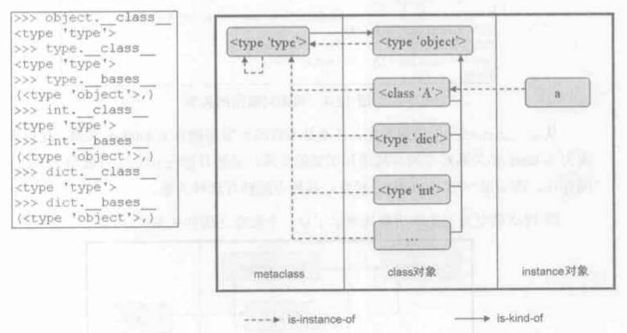
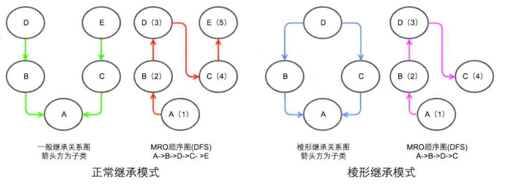
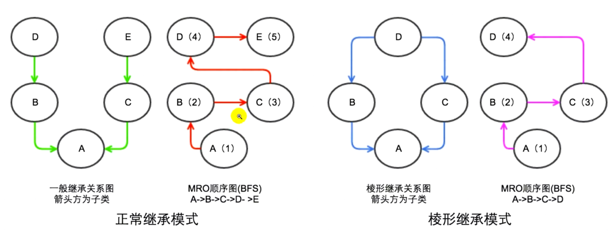

#	类关系

##	*Custom Classes*



-	Python 中的类机制
	-	对象之间存在两种关系
		-	*is-kind-of* 类继承关系
		-	*is-instance-of* 类实例化关系
	-	任何对象有类型，可通过 `__class__` 属性获取
		-	实例对象的类型为类对象
		-	类对象的类型为元类对象，一般即为 `type`（对应 CPython 中 `PyType_Type`）
	-	任何类都与 `object` 类存在继承关系
		-	没有指定基类的类型默认基类为 `object`（对应 CPython 中 `PyBaseObject_Type`）
			-	`int`（`PyInt_Type`）基类为空
			-	`type` 基类为空
			-	`bool`（`PyBool_Type`）基类为 `PyInt_Type`
		-	事实上， `PyType_Type`、`PyBaseObject_Type` 是分别独立定义的 `PyTypeObject` 结构体

-	用户定义类：通过类定义（元类）创建
	-	类对象作为工厂，可被调用以创建类实例
	-	类通过字典对象 `__dict__` 实现独立命名空间，存储独立属性
		-	类属性赋值、删除仅更新类自身字典，不会更新基类字典
	-	类中函数属性是为实例定义（为类定义的函数属性在元类中）
		-	函数均为描述器
		-	描述器仅在作为对象类型属性时才被触发描述器协议
		-	对象自身命名空间中属性会被直接返回

	```python
	class Meta(type):
		def __getattribute__(self, attr):
			print("--Meta--", attr)
			return super().attr

	class D(metaclass=Meta):
		def __getattribute__(self, attr):
			print("--Class--", attr)
			return super().attr

	type(1).__hash__(1) == hash(1)
	type(int).__hash__(int) == hash(int)
	```

-	CPython 实现：Python 2.2 前内置类、用户定义类不同
	-	之前，内置类型不可继承
		-	内置类型没有寻找属性的机制
	-	之后，`PyTypeObject` 中新增 `tp_dict` 字段
		-	`tp_dict` 指向字典对象，运行时动态构建
		-	是内置类向用户定义类靠拢的关键

###	类型转换

-	`obj.__repr__(self)`：输出对象的“官方”字符串表示
	-	普通方法
		-	`self`：当前类实例
		-	返回值：字符串对象
	-	典型实现
		-	输出结果应类似有效的 Python 表达式，可以用于重建具有相同取值的对象（适当环境下）
		-	否则，也应返回形如 `<...some useful description...>` 的字符串
	-	说明
		-	常用于调试，确保内容丰富、信息无歧义很重要
	-	钩子函数：`repr()`
		-	即交互环境下直接 “执行” 变量的结果

-	`obj.__str__(self)`：生成对象“非正式”、格式良好的字符串表示
	-	普通方法
		-	`self`：当前类实例
		-	返回值：字符串对象
	-	说明
		-	返回较方便、准确的描述信息
		-	`__str__` 方法默认实现即调用 `__repr__`
		-	`format`、`print` 函数会隐式调用对象 `__str__` 方法，此时若 `__str__` 返回非字符串会 `raise TypeError`
	-	钩子函数：`str`

-	`obj.__bytes__(self)`：生成对象的字节串表示
	-	普通函数
		-	返回值：字节串对象
	-	钩子函数：`bytes`

-	`obj.__format__(self, format_spec)`：生成对象的 “格式化” 字符串表示
	-	普通方法
		-	`fomrat_spec`：包含所需格式选项描述的字符串
			-	参数解读由实现 `__format__` 的类型决定
			-	大多数类将格式化委托给内置类型、或使用相似格式化语法
		-	返回值：格式化后的字符串
	-	钩子函数：`format`

-	`object.__bool__(self)`：返回 `True`、`False` 实现真值检测
	-	普通方法
		-	返回值：布尔值
	-	默认实现
		-	未定义：调用 `__len__` 返回非 0 值时对象逻辑为真
		-	`__len__`、`__bool__` 均未定义：所有实例逻辑为真
	-	钩子函数：`bool()`

```python
class Pair:
	def __init__(self, x, y):
		self.x = x
		self.y = y

	def __repr__(self):
		# 返回实例代码表示形式
		# 通常用于重新构造实例
		return "Pair({0.x!r}, {0.y!r})".format(self)
			# 格式化代码`!r`指明输出使用`__repr__`而不是默认
				# 的`__str___`
			# 格式化代码`0.x`表示第一个参数`x`属性

	def __str__(self):
		return "({0.x!s}, {0.y!s})".format(self)
			# 格式化代码`!s`指明使用默认`__str__`

	def __format__(self):
		if self.x == 0:
			return self.y
		elif self.y == 0:
			return self.x
		return "{0.x!r}, {0.y!r}".format(self)
```

###	内部信息

-	`__dict__`：对象底层字典，存储对象属性
	-	说明
		-	`__dict__` 只包括当前实例属性
		-	在大部分情况下，属性赋值会自动更新 `__dict__`，相应的更新 `__dict__` 即更新对象属性
			-	但类使用了 `cls.__slots__`、`@property` 等描述器技术时，不能简单视为 `__dict__` 键值对
			-	若非清楚所有细节，尽量使用 `setattr` 函数，由 Python 控制其更新
	-	钩子函数：`vars`、`dir`（部分）
		-	`vars` 是真正对应的钩子函数，返回键值对
		-	`dir` 执行过程中会访问 `__dict__`、`__class__`，而且只返回键

-	`__class__`：对象所属类型
	-	说明
		-	实例（狭义）返回类、类返回元类
	-	钩子函数：`type`

-	`__objclass__`：被 `inspect` 模块解读为指定实例所在的类
	-	用途
		-	合适的设置以帮助动态类属性的运行时检查
		-	对于可调用对象：指明第一个位置参数应为特定类型的实例、子类
			-	描述器类：`instance`参数

##	类-实例：实例化

-	（类）实例：通过调用类对象创建
	-	类实例通过字典对象 `__dict__` 实现独立命名空间，存储独立属性
		-	实例属性赋值、删除会更新实例自身字典，不会更新对应类字典
		-	可通过自定义 `__getattribute__`、`__getattr__`、`__setattr__`、`__delattr__` 等方法重载默认行为

###	类实例化机制

-	调用类时，按以下顺序执行方法
	-	`cls.__new__()`：（类方法）创建类实例
	-	`inst.__init__()`：（实例方法）初始化类实例
		-	`__new__` 返回的新实例的 `__init__` 方法将被调用
		-	（用户定义）`__new__` 返回实例不一定为所属的类实例，则调用的 `__init__` 随之不一定是期望方法
	-	返回 `__new__` 返回的类实例

####	`__new__`

-	`type.__new__(cls[,...])`：创建、返回 `cls` 类新实例
	-	静态方法，但作为特例无需要显式声明为静态方法
		-	`cls`：待实例化类（当前类）
		-	其余参数：传递给类构造器表达式的参数
		-	返回值：`cls` 类新实例
	-	目标
		-	允许不可变类型的子类（如：`int`、`str`、`tuple`）定制实例创建过程
		-	在自定义元类中重载以便定制类创建过程
	-	典型实现
		-	附带参数调用 `super().__new__(cls[,...])` 超类方法创建类实例
		-	然后根据需要修改新创建实例再返回
	-	说明
		-	`__new__()` 返回值就是类构造器的返回值
		-	`__new__()` 返回 `cls` 实例，则实例 `__init__()` 方法被调用，否则不被执行
		-	原生有两个 `__new__` 函数，二者C实现不同
			-	`type.__new__`：元类继承，用于创建类对象
			-	`object.__new__`：其他类继承，用于创建实例

####	`__init__`

-	`obj.__init__(self[,...])`：初始化类实例
	-	普通方法
		-	`self`：当前类实例
		-	其余参数：类构造器表达式参数
		-	返回值：`None`，否则`raise TypeError`
	-	典型实现
		-	派生类 `__init__` 应该显式调用基类自定义 `__init__` （若有）保证基类部分正确初始化
	-	说明
		-	在实例创建后、返回调用者前，新创建实例此方法被调用

####	`__del__`

-	`obj.__del__(self)`：实例销毁时（引用计数变为 0）被调用
	-	普通方法，也被称为终结器、析构器（不恰当）
		-	`self`：当前类实例
	-	典型实现
		-	派生类 `__del__` 应该显式调用基类自定义 `__del__` （若有）保证基类部分正确清除
		-	对象重生：`__del__` 可以（但不推荐）通过创建实例的新引用推迟其销毁
			-	但重生的对象销毁时 `__del__` 是否被再次调用取决于具体实现
	-	说明
		-	解释器退出时不会确保为仍然存在的对象调用 `__del__` 方法
		-	调用 `__del__` 时周边状况不确定，执行期间异常将被忽略，改为打印警告到 `sys.stderr`
	-	“钩子”：`del`
		-	`del x` 不直接调用 `x.__del__()`，仅将 `x` 的引用计数减一
		-	`x.__del__()` 仅在 `x` 引用计数为 0 时被调用

> - CPython：实例销毁时只调用一次，重生对象不调用 `__del__`

##	类-类：继承

-	类继承：从父类中派生子类
	-	子类会获得基类的所有方法

###	定义子类创建

####	`__init_subclass__`

-	`cls.__init_subclass__(cls,/,**kwargs)`：自定义子类
	-	类方法，但作为特例无需要显式声明为类方法
		-	`cls`：当前类子类
		-	参数（若定义）：接收类创建时的关键字参数
			-	调用父类此方法时记得剔除部分
			-	`metaclass` 元类参数会被其他类型机制消耗，不会被传递给 `__init_subclass__`
	-	说明
		-	派生类继承父类时，基类的 `__init_subclass__` 被调用
		-	类似类装饰器，但是作用于未来子类，而类装饰器仅仅影响被装饰类
	-	默认实现：无行为、只有一个参数 `cls`（带参调用时将引发错误）
	-	用途
		-	修改子类行为

```python
class Philosopher:
	def __init_subclass__(self, default_name, **kwargs):
		super().__init_subclass__(**kwrags)
		cls.default_name = default_name

class AstraliaPhilosopher(Philosopher, default_name="Bruce"):
	pass
```

###	抽象类

-	抽象类
	-	抽象类无法直接实例化，用于通过类继承
		-	保证子类实现特定方法
		-	确保实现为特定类型、实现特定接口，方便执行类型检查
	-	Python 中通过指定元类方式创建抽象类
		-	创建抽象类的元类：`abc.ABCMate`
		-	使用 `abc.ABCMeta` 作为元类的工具类：`abc.ABC`
		-	抽象方法装饰器：`abc.abstractmethod`（配合其他装饰器时，应位于最内层）
	-	`abc.ABCMeta` 创建的抽象类包含 `register(cls)` 方法，可将 `cls` 注册为抽象类子类，但只能作为类型检查用
		-	`cls` 及其子类会被内建函数 `issubclass()` 识别为对应抽象基类子类
		-	抽象类不会出现在 `cls` 的 *MRO* 列表中
		-	抽象类实现的方法亦不可调用（包括通过 `super()`）

```python
from abc import ABCMeta, abstractmethod
class IStream(metaclas=ABCMeta):
	@abstractmethod
	def read(self, maxbytes=-1):
		pass
```

> - <https://python3-cookbook.readthedocs.io/zh_CN/latest/c08/p12_define_interface_or_abstract_base_class.html>
> - <https://docs.python.org/zh-cn/3.9/library/abc.html>
> - 类型检查方便，但是不应过度使用，以利用动态语言的灵活性，避免代码复杂化

###	*Mixin* 类

-	*Mixin* 混入类：包装一些方法包装，扩展其他类功能的类
	-	*Mixin* 用于扩展其他类的功能，而这些类往往又没有继承关系
		-	一般不直接实例化，毫无意义
		-	利用多继承混入其他类以扩展类功能
	-	*Mixin* 没有自己的状态信息
		-	不定义 `__init__` 方法
		-	无实例属性，因此 *Mixin* 中往往会定义 `__slots__ = ()`

> - *Mixin* 机制也可以通过类装饰器方式的实现
> - *Mixin* 的更多讨论参见*cs_program/program_design/inheritation*

###	*Method Reselution Order*




-	*MRO* 方法解析顺序：决定了多继承存在时，解释器查找、解析属性的方式（顺序）
	-	*DFS* 深度优先查找：Python2.1 及之后版本经典类适用
	-	*BFS* 广度优先查找：Python2.2 新式类适用
	-	*C3* 线性化算法：Python2.3 及之后新式类适用

> - 可以通过类 `__mro__`、`mro()` 属性查看当前类访问

####	*C3* 线性化算法

-	*C3* 线性化算法
	-	核心思想：在 *DFS* 基础上，移除搜索路径上的坏节点
		-	好节点：节点 `N` 是好节点，当且仅当搜索路径中 `N` 之后节点不继承自 `N`
	-	*C3* 线性化算法解决了的 *DFS* 不满足本地优先级、单调性的问题
		-	本地优先级：根据声明的父类顺序解析
		-	单调性：若在类 `C` 的解析顺序中，`A` 在 `B` 之前，则在 `C` 的所有子类中也必须的满足此顺序

-	*C3* 线性化算法的计算过程
	-	记 $C_1 C_2 \cdots C_N$ 为包含 $N$ 个类的列表
		-	头：$head(C_1 C_2 \cdots C_N) = C_1$
		-	尾：$tail(C_1 C_2 \cdots C_N) = C_2 \cdots C_N$
		-	链接操作：$C_1 + (C_2 C_3 \cdots C_N) = C_1 C_2 \cdots C_N$
	-	若 $C$ 继承自父类 $B_1 B_2 \cdots B_N$，则 $C$ 方法解析列表按如下公式确定

		$$
		L[C(B_1 \cdots B_N)] = C + merge(L[B_1], \cdots, L[B_N], B_1, \cdots, B_N)
		$$

		其中 `merge` 方法说明如下：
		-	`merge` 参数中首个列表记为 $K$
		-	令 $h=head(K)$，若 $h$ 未出现在其他列表 `tail` 中
			-	将 $h$ 加入 $C$ 的线性化列表中
			-	将 $h$ 从所有列表、`merge` 中移除
			-	重复此步骤
		-	否则，置 $K$ 为 `merge` 中下个列表，重复上步骤
			-	若 `merge` 所有类被移除，创建类成成功
			-	若无法找到满足条件 $h$，无法创建合法类

> - <https://www.cnblogs.com/panlq/p/13168195.html>

###	`super`

```python
class super:
	super()
		# 等同于：`super(__class__, <first_argument>)`
		# `<first_argument>`常常就是`self`
	super(type)
		# 返回：未绑定super对象，需要`__get__`绑定
	super(type, obj)
		# 返回：已绑定super对象，要求`isinstance(obj,type)`
	super(type, type2)
		# 返回：已绑定super对象，要求`issubclass(type2, type)`
		# 此时调用方法返回是函数，不是绑定方法，不会默认传入
			# `type2`作为首个参数

	def __get__(self, obj, type=None):
		

def super(cls, inst/subcls):
    mro = inst.__class__.mro()
	mro = subcls.mro()
    return mro[mro.index(cls) + 1]
```

-	`super([type,[object-or-type]])`：
	-	参数
		-	`type`：在 *MRO* 列表中定位类搜索起点（不包括）
		-	`object-or-type`：提供 *MRO* 列表
			-	类：直接传递 *MRO* 列表
			-	实例：传递所属类的 *MRO* 列表
		-	返回值：代理对象，可将方法调用委托给 `type` 的父类、兄弟类（取决于 *MRO*）
			-	类似于返回MRO列表中某个类的实例，取决于访问的属性
	-	功能：依次遍历 *MRO* 列表（指定位置开始）中类，查找指定属性
		-	可在创建 `super` 实例时指定搜索起始点，跳过对部分类搜索
		-	若需继承链中该方法都被链式调用，需 *MRO* 列表中每个类中的方法都通过 `super()` 调用
		-	`super` 功能依赖其作为描述器的实现
			-	即依赖 `super` 类的 `__getattribute__`、`__get__` 方法
			-	则仅通过 `.` 属性访问的方式才能（通过描述器机制）正确获取目标属性
	-	用途
		-	单继承中，`super` 可用于引用父类而不必指定名称，便于维护
		-	在动态执行环境中支持多重继承带来的“菱形图”
			-	避免硬编码父类名称导致多次调用
	-	注意
		-	两个参数的形式明确的 `super` 可在类外使用
		-	零个参数的形式需要编译器填入必要细节，仅适用于类定义内部
		-	`super` 访问的属性路线不够明确，继承链中最好保证
			-	同名方法参数调用兼容，比如：相同参数个数、名称
			-	最顶层类提供方法实现，确保在 *MRO* 查找链上可找到方法

> - `super()` 第二个参数一般为 `self`，即在调用链中始终由当前实例提供 `mro` 列表
> - <https://docs.python.org/zh-cn/3.9/library/functions.html#super>

###	自定义实例、子类检查
#TODO

-	`obj.__instancecheck__(self, instance)`：判断 `instance` 是否为 `self` 实例
	-	元类普通方法（`abc.ABCMeta` 中即实现此方法）
		-	`self`：类
		-	`instance`：待判断实例
		-	返回：布尔值
	-	钩子函数：`isintance(instance, class)`

-	`obj.__subclasscheck__(self, subclass)`：判断 `subclass` 是否为 `self` 子类、间接子类
	-	元类普通方法（`abc.ABCMeta` 中即实现此方法）
		-	`self`：类
		-	`subclass`：待判断类
		-	返回：布尔值
	-	典型实现
		-	`abc.ABCMeta` 中此方法调用 `__subclasshook__`
	-	内置钩子函数：`issubclass(subclass, class)`

> - `abc.ABCMeta` 即实现此 2 方法，使得 `abc.ABC` 可作为“虚拟基类”添加到任何类（包括内置类型）中
> - *PEP 3119*：此功能引入是帮助添加抽象类。故以元类普通方法作为实现方式，而不是作为类方法；另，应是避免对低层对象增加预定义槽位，大规模修改代码。

##	元类-类：实例化

-	元类：类的类型
	-	元类实例化即得到类
	-	用途
		-	枚举
		-	日志
		-	接口检查
		-	自动委托
		-	自动特征属性创建、代理、框架
		-	自动资源锁定、同步

-	`type` 对象即 Python 中默认元类
	-	类默认均由 `type` 对象实例化，元类均由 `type` 对象派生
		-	类体在新的命名空间 `namespace` 中执行
		-	类名被局部绑定至元类执行结果 `type(name, bases, namespace)`
	-	可通过在类定义中传入 `metaclass` 参数、继承包含此参数类指定元类
		-	类继承同样继承父类元类参数：即缺省使用第一基类的元类
		-	其他类定义过程中的其他关键字参数会在以下元类操作中进行传递

-	CPython 实现
	-	基类在由 `PyTypeObject.tp_base` 指定
		-	若未指定 `tp_base`，将其指定默认基类 `PyBaseObject_Type`，即 `<type object>`
	-	元类中储存类的静态元信息：类该如何创建
		-	所有类公用的元信息：类对象的创建策略
	-	类的局部命名空间存放类的动态元信息：类属性表 `tp_dict`
	-	对于 `PyIntObject`、`PyDictObject` 等对象，所有元信息均保存在类型对象中

###	类定义执行

-	类定义执行步骤
	-	解析 *MRO* 条目
		-	调用 `__mro_entries__` 方法解析原基类
		-	以返回结果替代原基类
	-	确定适当元类：按如下优先级确定元类
		-	显式指定元类
		-	基类最衍生元类
		-	缺省元类 `type`
	-	准备类命名空间
		-	缺省将创建空有序映射，可用 `meta.__prepare__` 覆盖
		-	命名空间将被传递给 `meta.__new__`
	-	执行类主体：类似执行 `exec(body, globals(), namespace)`
		-	`exec` 与调用关键区别在于，定义在函数内部时
			-	词法作用域允许类主体、方法引用来自当前、外部作用域名称
			-	但，内部方法仍然无法看到在类作用域层次上名称，需要通过 `__class__`、方法首个参数访问
	-	创建类对象
		-	通过 `meta(name, bases, namespace, **kwds)` 创建类对象
		-	零参形式的 `super()` 将利用 `__class__` 引用类对象
			-	`__class__` 是编译器创建的隐式闭包
			-	这允许 `super` 可通过词法作用域确定正在定义的类
		-	`type.__new__` 还将执行以下动作
			-	收集类命名空间中资料描述器并设置
			-	调用直接父类的 `__init_subclass__`
			-	接受的命名空间将被复制至新字典中，作为类 `__dict__` 属性

####	`__prepare__`

-	`meta.__prepare__(cls, name, bases, **kwds)`：确定合适的元类之后，准备类命名空间
	-	类方法，应使用 `@classmethod` 装饰
		-	`name`：类名
		-	`bases`：类定义中基类元组
		-	`kwds`：类定义中的关键字参数
		-	返回值：（命名空间）映射对象
	-	默认实现
		-	若元类无 `__prepare__` 属性，类命名空间将被初始化为空 `ordered mapping`
	-	说明
		-	在执行类主体前被调用，用于创建类命名空间
		-	方法返回的命名空间字典会被传递给 `__new__`，并子厚

#	类功能

##	类属性访问

###	`.` 查找链

-	属性获取 `.`：按以下优先级顺序尝试根据属性名获取属性
	-	资料描述器 `__get__` 方法返回值
	-	对象 `__dict__` 中键对应值
	-	非资料描述器 `__get__` 方法返回值
	-	对象类型按 *MRO* 查找 `__dict__` 中键对应值
		-	默认的，至此也未查找到属性时，将 `raise Attribute`
	-	对象类型 `__getattr__` 方法（若存在）返回值
		-	仅在前述逻辑中 `raise AttributeError` 才被调用

-	`.`、`getattr`、`.__getattribute__` （默认）执行逻辑不完全相同（字节码可看出)，但最终获取对象属性的核心逻辑相同
	-	三种方法区别
		-	`.` 是最常用、最快方式，核心即 `LOAD_ATTR`
		-	`getattr` 稍慢，应是 `CALL_FUNCTION` 中包含 `LOAD_ATTR` 核心逻辑
		-	`.__getattribute__` 最慢，`LOAD_ATTR` 后再 `CALL_FUNCTION`
	-	重载 `__getattribute__` 应会修改类型的 `tp_getattro` 域，进而影响三种属性获取方式
	-	部分钩子函数会跳过重载的对应特殊方法

```python
class Meta(type):
	def __getattribute__(*args):
		print("Metaclass getattribute invoked")
		return type.__getattribute__(*args)

class C(object, metaclass=Meta):
	def __len__(self):
		return 10
	def __getattribute__(*args):
		print("Class getattribute invoked")
		return object.__geattribute__(*args)

if __name__ == "__main__":
	c = C()
	c.__len__()
		# 通过实例显式调用
		# 输出`Class getattribute invoked\n10"
	type(c).__len__(c)
		# 通过类型显式调用
		# 输出`Metaclass getattribute invoked\n10"
	len(c)
		# 隐式查找
		# 输出`10`
```

> - 未重载情况下，实例获取属性关键应均为 `_PyObject_GenericGetAttrWithDict` 函数，类获取属性则为 `type_getattro`

####	CPython 属性访问实现

-	`LOAD_ATTR`：获取属性值字节码：CPython 中函数调用逻辑顺序
	-	`PyObject_GetAttr` 函数
		-	其中依次尝试调用 `tp->getattro`、`tp->getattr`
	-	实例默认（未重载时）：`PyObject_GenericGetAttr` 函数
		-	`PyBaseObject_Type->getattro` 被置为 `PyObject_GenericGetAttr`
		-	`PyBaseObject_Type->getattr` 被置为 `0`，即不再推荐使用
		-	类创建时会从 `PyBaseObject_Type` 继承此设置
	-	元类默认（未重载时）：`type_getattro` 函数
		-	`PyType_Type->getattro` 被置为 `type_getattro`
			-	整体类似 `_PyObject_GenericGetAttrWithDict`
			-	不同之处：会触发类自身命名空间中的描述器的描述器协议
		-	`PyType_Type->getattr` 被置为 `0`，即不再推荐使用
		-	元类创建时会从 `PyType_Type` 继承此设置
	-	`_PyObject_GenericGetAttrWithDict`：直接被 `PyObject_GenericGetAttr` 调用、返回
		-	此中即决定大部分 `.` 查找链优先级

-	`STORE_ATTR`：属性赋值字节码

> - 可通过 `dis.dis` 函数查看字节码
> - 每个 `PyTypeObject`（即类） 中定义了两个与访问属性相关的操作域 `tp_getattro`、`tp_getattr`，后者不推荐使用
> - 以上函数定义位于 `python/ceval.c`、`object/object.c`、`object/typeobject.c` 中

```c
// 字节码解释
case TARGET(LOAD_ATTR):{
	...
	PyObject *res = PyObject_GetAttr(owner, name);
	...
}
// 依次尝试调用 `tp_getattro`、`tp_getattr`（不推荐）
PyObject * PyObject_GetAttr(PyObject *v, PyObject *name){
	...
	if (tp->tp_getattro != NULL)
		return (*tp->tp_getattro)(v, name);
	if (tp->tp_getattr != NULL){
		...
		return (*tp->tp_getattr)(v, (char *)name_str);
		...
	}
	...
}
// `PyBaseObject_Type` 定义
PyTypeObject PyBaseObject_Type = {
	...
	0,								// tp_getattr
	0,								// tp_setattr
	...
	PyObject_GenericGetAttr			// tp_getattro
	PyObject_GenericSetAttr			// tp_setattro
	...
}
PyObject * PyObject_GenericGetAttr(PyObject *obj, PyObject *name){
	return _PyObject_GenericGetAttrWithDict(obj, name, NULL, 0);
}
PyObject * _PyObject_GenericGetAttrWithDict(PyObject *obj, PyObject *name,
											PyObject *dict, int suppress){
	PyTypeObject *tp = Py_TYPE(obj);				// 存储对象 type
	PyObject *descr = NULL;
	...
	descr = _PyType_Lookup(tp, name);				// 在对象 type 中寻找属性
	if (descr != NULL) {
		...
        f = Py_TYPE(descr)->tp_descr_get;
        if (f != NULL && PyDescr_IsData(descr)) {	// 属性存在且为数据描述器，则直接获取
            res = f(descr, obj, (PyObject *)Py_TYPE(obj));
			...
			goto done;
        }
    }
	if (dict == NULL){								// `dict` 默认将被尝试置为对象 `__dict__` 域
		dictoffset = tp->tp_dictoffset;
		if(dictoffset != 0){
			...
			dictptr = (PyObject **)((char *) obj + dictoffset);
			dict = *dictptr;
		}
	}
	if (dict != NULL){								// 在 `dict` （缺省即对象 `__dict__`） 中查找属性
		...
		res = PyDict_GetItemWithError(dict, name);
		...
		goto done;
	}
	if(f != NULL){									// 获取非数据描述器
		...
		res = f(descr, obj, (PyObject *)Py_TYPE(obj));
		...
		goto done;
	}
	if (descr != NULL){								// 直接使用对象 type 中属性值作为查找结果
		res = descr;
		...
		goto done;
	}
	...
}
```

> - <https://github.com/python/cpython/blob/3.9/Objects/typeobject.c>

###	属性访问控制

-	Python 没有属性访问控制：不依赖语言特性封装数据，而是遵循一定属性、方法命名规约达到访问控制效果
	-	普通属性：公有属性
	-	前后均 `__` 属性：特殊属性
		-	内置属性均为此格式，表示完成特定任务
	-	仅开头 `__` 属性：“私有” 属性
		-	*Name Mangling*：属性名称在类定义后被修改
			-	目前实现：是在属性名称前添加类名标记 `_<CLS>`
			-	事实上，可通过修改后属性名在类外访问私有属性
			-	注意：同时以 `__` 结尾属性名称不会被修改
		-	目的：隐藏私有属性，避免类外（包括子类）直接访问
			-	子类无法覆盖父类私有属性，因为无法定义除相同名称属性
	-	单`_`开头属性：仅在类内部使用的属性
		-	仅是 *PEP 8* 中约定代码规范，Python 解释器未作特殊处理
		-	注意：模块导入时，`*` 不会导入模块私有属性，除非模块配置 `__all__` 属性
			-	可认为模块导入遵循 `_` 规范

> - <https://juejin.cn/post/6955354672794173471>

###	特殊方法查找

-	特殊方法：Python 类中具有特殊名称的方法，这些方法可由特定语法触发执行特定操作
	-	触发的特殊方法的语法包括
		-	操作符：Python 实现操作符重载的方式
		-	钩子函数：钩子函数可能在调用特定特殊方法基础上进行额外处理，如
			-	尝试调用备用实现：`iter`、`reversed`
			-	修改方法返回值：`dir`
	-	一般若未定义特定方法，尝试执行操作将 `raise AttributeError`、`raise TypeError`
		-	但 `__hash__`、`__iter__`、`__reversed__`、`__contains__` 等方法即使未定义，对应钩子函数会尝试调用可能的备用方法完成操作
		-	将特殊方法设为 `None` 表示对应操作不可用，此时即使对应的 `hash`、`iter`、`reversed`、`in` 等钩子函数调用操作也不会尝试调用备用方法
			-	但，即使实现为 `raise TypeError`，也被认为操作可用

-	通过钩子隐式访问特殊方法于一般方法访问不同
	-	跳过实例属性，绕过类（赋给实例）、元类（赋给类）的 `__getattribute__` 方法
		-	为解释器内部速度优化提供了显著空间，但牺牲了处理特殊元属性时的灵活性
		-	也，特殊方法须设置在类对象上以保证能由解释器发起调用
	-	另，很多特殊方法被所有对象实现
		-	则类能访问到两种特殊方法属性
			-	元类的特殊方法属性
			-	元类实例化类时，存储在类属性域中的特殊属性方法
		-	即，为类调用特殊方法时，应从元类的获取、以类作为参数

> - 钩子函数是 CPython 实现的一部分，为效率会跳过部分逻辑（参考前述属性查找链）
> - <https://docs.python.org/zh-cn/3.9/reference/datamodel.html#special-method-names>

###	类属性访问机制

####	`__getattribute__`

```python
def __getattribute__(self, key):
	"Emulate type_getattro() in Objects/typeobject.c"
	v = object.__getattribute__(self, key)
	if hasattr(v, "__get__"):
		return v.__get__(None, self)
	return v
```

-	`obj.__getattribute__(self, name)`：访问对象属性时无条件被调用
	-	普通方法
		-	`name`：待访问属性
		-	返回值：属性值、或 `raise AttributeError`
	-	默认实现：均继承自 `object` 的 `object.__getattribute__`
		-	描述器机制的执行者，负责调用描述器协议
			-	普通函数：为类中函数绑定实例
			-	类方法：为类中函数绑定类
			-	静态方法：不绑定
	-	典型实现
		-	为避免方法中无限递归，实现中总应该调用具有相同名称基类方法访问所需要的属性
	-	说明
		-	通过特定语法、内置函数隐式调用的方式查找特殊方法时仍可能被跳过
	-	钩子
		-	`.` 运算符：首先调用 `__getattribute__`，若触发 `AttributeError`，调用 `__getattr__`
			-	注意：`a.__getattribute__("key")` 包含两次 `__getattribute__` 调用
		-	`getattr()`：基本同 `.` 运算符，除可捕获异常，设置默认返回值
		-	`hasattr()`：内部调用 `getattr`，根据 `raise Exception` 判断属性是否存在
			-	可通过在 `@property.getter` 中 `raise AttributeError` 使得属性看起来不存在
			-	内部有更多 *boilerplate* 相较于 `getattr` 更慢
			-	则按照字面意思使用不需要考虑过多

> - `__getattribute__` 仅对继承自 `object` 的新式类实例可用

####	`__getattr__`、`__setattr__`、`__delattr__`

-	`obj.__getattr__(self, name)`：默认属性访问引发 `AttributeError` 而失败时调用
	-	普通方法
		-	`name`：待访问属性
		-	返回值：计算后的属性值、或 `raise AttributeError`
	-	说明：如果属性通过正常机制找到，`__getattr__` 不会被调用
		-	此为在 `__getattr__`、`__setattr__` 之间故意设置的不对称性
			-	提高效率
			-	赋予 `__getattr__` 更高自由度，能够访问实例的其他属性
		-	异常时调用 `__getattr__` 是 `.` 运算符（属性访问）中逻辑，作为 `__getattribute__`、`__get__` 的兜底
			-	默认的，调用 `__getattribute__` 时，`name` 不是实例属性、或是类关系树中属性将 `raise AttributeError`
			-	自定义 `__get__` 方法中，可手动 `raise AttributeError`
	-	典型实现
		-	`object` 默认无此方法
		-	无需在实例属性字典中插入值，即可模拟对其的控制
	-	钩子：`.`


-	`obj.__setattr__(self, name, value)`：属性被尝试赋值时被调用
	-	普通方法
		-	`name`：属性名
		-	`value`：属性值
		-	返回值：`None`
	-	默认实现：均继承自 `object` 的 `object.__setattr__`，为属性赋值
		-	将属性键值对保存至对象字典
	-	典型实现
		-	若 `__setattr__` 要赋值给实例属性，应调用同名的基类方法
	-	钩子函数
		-	`.` 运算符赋值
		-	`setattr()`

-	`obj.__delattr__(self, name)`：删除实例属性时被调用
	-	普通方法
		-	`name`：属性名
		-	返回值：`None`
	-	默认实现：均继承自 `object` 的 `object.__delattr__`，删除实例属性
		-	从对象字典中删除属性键值对
	-	典型实现
		-	方法仅应在 `del obj.name` 对对象有意义时才被实现
	-	钩子
		-	`del` 关键字
		-	`delattr`

####	`__dir__`

-	`obj.__dir__(self)`：返回实例中 “可访问” 名称的字符串列表
	-	普通方法
		-	返回值：序列
	-	默认实现：均继承自 `object` 的 `object.__dir__`，返回实例、类、祖先类所有属性
	-	说明
		-	交互式解释器就是在 `__dir__`、`dir` 返回列表中进行查询进行补全
	-	钩子函数：`dir()`
		-	`dir()` 获取 `__dir__` 返回序列，转换为列表、排序
		-	`dir()` 会剔除 `__dir__` 返回值中部分值
		-	若 `__dir__` 返回值不可迭代，报错

###	模块属性访问

-	可通过以下方式自定义模块属性访问
	-	模块层次 `__getattr__` 函数
		-	参数：属性名
		-	返回值：计算后结果、或 `raise AttributeError`
		-	触发条件：若正常查找 `__getattribute__` 无法在模块中找到某个属性，则调用 `__getattr__` 在模块 `__dict__` 中查找
	-	模块层次 `__dir__` 函数
		-	参数：不接受参数
		-	返回值：模块中可访问名称的字符串列表
		-	说明
			-	此函数会影响模块中标准 `dir()` 结果
	-	模块 `__class__` 属性设置为 `types.ModuleType` 的子类（自定义）可更细致的自定义模块行为
		-	即类似普通类通过特殊方法自定义属性设置、查找
	-	说明
		-	设置模块 `__getattr__`、`__class__` 只影响使用属性访问语法进行查找，以下方式直接访问模块全局变量不受影响
			-	模块内代码
			-	对模块全局字典引用

```python
import sys
import types import ModuleType

class VersboseModule(ModuleType):
	def __repr__(self):
		return f"verbose {self.__name__}"
	def __setattr__(self, attr, value):
		print(f"settting {attr}")
		super().__setattr__(attr, value)

sys.modules[__name__].__class__ = VerboseModule
```

##	描述器

-	描述器：具有 “绑定行为” 的对象的属性
	-	描述器类：定义其中任意一个方法（描述器协议）的类被称为描述器类，其实例即为描述器
		-	`obj.__set__(self, instance, name, value)`：重载属性赋值
		-	`obj.__get__(self, instance, owner)`：重载属性访问
		-	`obj.__delete__(self, instance)`
	-	所有对描述器属性的访问会被 `__get__`、`__set__`、`__delete__` 方法捕获、重载
	-	描述符作为实例属性将不会触发描述器协议
		-	实例的仅在访问定义在类中属性才能触发描述器协议
		-	类总是可以触发描述器协议，无论描述器定义在自身命名空间、元类

> - 描述器协议的触发由 `_PyObject_GenericGetAttrWithDict`（实例）、`type_getattro`（类） 两个函数决定

-	使用说明
	-	描述器应作为类属性，仅为每个类初始化一次，为类所有实例共享
		-	若要描述器行为随实例改变，应该将私有数据存储在各实例中
		-	若存储在描述器中，可能会因描述器对实例引用，影响垃圾回收

-	CPython 实现：描述器是封装 *slot* 的 `PyObject`
	-	CPython 中有多种描述器，以键值对的方式存储在 `tp_dict` 中
		-	`PyWrapperDescrObject`：对应 `PyTypeObject` 的操作
		-	`PyMethodDescrObject`
		-	`PyMemberDescrObject`
		-	`PyGetSetDescrObject`

> - <https://realpython.com/python-descriptors/>

###	描述器协议（相关方法）

```python
class Descriptor:
	def __set_name__(self, owner, name):
		self.name = name

	def __get__(self, instance, owner=None):
		if instance is None:
			return self
		else:
			return instance.__dict__[self.name]

	def __set__(self, instance, value):
		if instance is None:
			pass
		else:
			if not instance(value, int):
				raise TypeError("expect an int")
			# 操作实例底层 `__dict__`
			instance.__dict__[self.name] = value

	def __delete__(self, instance):
		if instance is None:
			pass
		else:
			# 操作实例底层`__dict__`
			del instance.__dict__[self.name]
```

-	`obj.__get__(self, instance, owner=None)`：访问描述器属性时调用，重载实例属性访问
	-	普通实例方法
		-	`instance`：被用于访问属性的类实例（通过类获取描述器属性则为 `None`）
		-	`owner`：（描述器）所有者类
		-	返回值：计算后属性值、或 `raise AttributeError`
	-	典型实现
		-	获取所有者类属性、或实例属性
		-	若描述器未定义 `__get__`，则访问属性会返回描述器实例对象自身，除非实例字典 `__dict__` 中有同名属性
		-	若仅仅只是从底层实例字典中获取属性值，`__get__` 方法不用实现

-	`obj.__set__(self, instance, value)`：为对象的 “描述器属性” 赋值时调用，重载属性赋值
	-	普通实例方法
		-	`instance`：被用于获取、赋值属性的类实例
		-	返回值：
	-	典型实现实现
		-	操作实例 `instance.__dict__` 存储值，模拟普通实例属性设置

-	`obj.__delete__(self, instance)`：“删除” 对象描述器属性时调用，重载属性删除
	-	普通实例方法
		-	`instance`：被用于获取、赋值属性的类实例
	-	具体实现应取决于`__set__`实现

-	`ojb.__set_name__(self, owner, name)`：描述器初始化时自动（`type` 构造器中）调用
	-	普通实例方法
		-	`owner`：描述器所有者类
		-	`name`：描述器对应变量名（即类中描述器对应属性名）
	-	说明
		-	`__set_name__` 会作为 `type` 构造器的一部分被隐式调用，即在类定义中设置描述器时无需手动调用
		-	在类创建后额外添加描述器时，需要显式带参调用

###	CPython 实现原理

-	描述器的实现依赖于 `__getattribute__` 方法（CPython 中实际上即对象 `tp_getattro` 域）
	-	 可以通过重写类的 `__getattribute__` 方法改变、关闭描述器行为
	-	类、实例继承的 `tp_getattro` 域不同，分别来自 `PyType_Type`、`PyBaseObject_Type`（参考前述属性查找链）
		-	类访问描述器时，描述器协议总被触发，即使描述器定义在类自身命名空间中
		-	实例仅在访问类命名空间中描述器时，才会触发描述器协议

-	描述器调用：描述器 `x` 定义在类 `A` 中、`a = A()`
	-	直接调用：`x.__get__(a)`
	-	实例绑定：`a.x` 转换为 `type(a).__dict__['x'].__get__(a)`
	-	类绑定：`A.x` 转换为 `A.__dict__['x'].__get__(None,A)`
	-	超绑定：`super(A, obj).x` 转换为 `B.__dict__['x'].__get__(obj, obj.__class__)`，其中 `B` 是 `obj.__class__.__mro__` 中 `A` 的直接后继

###	描述器访问优先级

-	访问对象属性时，描述器的访问优先级取决于描述器类中定义的方法
	-	描述器分类
		-	资料描述器：定义了 `__set__`、`__delete__` 方法
			-	只读资料描述器：`__set__` 中 `raise AttributeError` 得到
		-	非资料描述器：只定义了 `__get__` 方法
	-	访问优先级：资料描述器 > 实例字典属性 > 非资料描述器
		-	实例属性会重载非资料描述器
		-	实例属性和资料描述器同名时，优先访问描述器，否则优先访问属性

###	特殊描述器类

-	`super` 类中定义有 `__get__`方法，则其实例也为描述器

-	`@property` 装饰器被实现为资料描述器

####	`@property`

-	`@property` 装饰器：简化具有 “绑定行为” 属性的实现
	-	用途
		-	为类设置有处理逻辑的属性，即将方法包装为描述器
			-	类型检查
			-	合法性验证
	-	说明
		-	`property` 属性为数据描述器，故实例无法重载、覆盖
		-	子类属性会覆盖基类同名描述器，但处理逻辑在描述器中，所以只能整体被覆盖
		-	但可通过硬编码方式 `@<BASE>.<METHOD>.setter` 覆盖部分处理逻辑（需要知道基类名称）
		-	过度使用`@property`时会降低代码可读性、效率，使用显式的 `get`、`set` 方法兼容性更好
	-	使用方式
		-	`@property[.getter]` 装饰 *getter-like* 方法作为属性获取逻辑
		-	`@<METHOD>.setter`、`@<METHOD>.deleter` 装饰属性设置、删除逻辑
		-	将已有获取、设置、删除逻辑（函数）直接作为参数传递给 `property`  得到描述器属性
	-	典型实现
		-	实例相关的数据应存储在在实例、或描述器命名空间 `__dict__` 中，以实现实例绑定行为逻辑独立（或者无需为实例分别存储数据）
		-	初始化时，不应该直接设置底层数据属性，会绕过 `setter` 的参数检查

```python
class Property(object):
	"Emulate PyProperty_Type() in Objects/descrobject.c"

	def __init__(self, fget=None, fset=None, fdel=None, doc=None):
		self.fget = fget
		self.fset = fset
		self.fdel = fdel
		if doc is None and fget is not None:
			doc = fget.__doc__
		self.__doc__ = doc

	def __get__(self, obj, objtype=None):
		if obj is None:
			return self
		if self.fget is None:
			raise AttributeError("unreadable attribute")
		return self.fget(obj)

	def __set__(self, obj, value):
		if self.fset is None:
			raise AttributeError("can't set attribute")
		self.fset(obj, value)

	def __delete__(self, obj):
		if self.fdel is None:
			raise AttributeError("can't delete attribute")
		self.fdel(obj)

	def getter(self, fget):
		return type(self)(fget, self.fset, self.fdel, self.__doc__)
		# 返回描述器，可省略

	def setter(self, fset):
		return type(self)(self.fget, fset, self.fdel, self.__doc__)
		# 返回更新`fset`的描述器，同名所以覆盖前者

	def deleter(self, fdel):
		return type(self)(self.fget, self.fset, fdel, self.__doc__)
```

> - <https://python3-cookbook.readthedocs.io/zh_CN/latest/c08/p06_create_managed_attributes.html>

####	`wrapper` 类

-	`wrapper_descripter`：`<slot wrapper>`，封装 C 实现的函数
	-	等价于 CPython3 中函数
	-	调用 `__get__` 绑定后得到 `<method-wrapper>`
	-	`object` 的方法全是 `<slot wrapper>`

-	`method-wrapper`：`<method-wrapper>`，封装 C 实现的绑定方法
	-	等价于 CPython3 中绑定方法

####	`function` 描述器类

```python
class function:
	function(code, globals[, name[, argdefs[, closure]]])

	def __call__(self, /, *args, **kwargs):
		# 作为一个函数调用自身

	# Python 模拟实现
	def __get__(self, instance, owner, /):
		if obj is None:
			return self
		# 返回绑定 `owner` 类型实例 `instance` 的方法
		return types.MethodType(self, instance)
		
```

-	`function` 类即非资料描述器类（其中定义有 `__get__()` 方法）
	-	即函数（函数类实例）为非资料描述器，则类实例可以覆盖、重载类函数属性
	-	通过 `__dict__` 获取类属性（未被重载）与直接 `.` 访问结果不同
	-	则适当实现的 `__get__` 即可实现
		-	通过类访问函数属性时，直接返回原函数，同直接引用函数（可在类定义外给类赋属性验证）
		-	通过类实例访问时返回转换后方法

> - 考虑到 `__getattribute__` 方法将重载对描述器的访问

```python
class method:
	method(function, instance)

	def __call__(self, /, *args, **kwargs):
		# 作为函数调用自身

	def __get__(self, instance, owner, /):
		# 返回自身
```

-	事实上，`method` 方法类也是描述器类
	-	其 `__get__` 被实现为返回方法自身
		-	即作为类属性被访问与直接引用无区别

-	CPython 实现细节
	-	Python3.6 开始，单纯调用类 `function` 属性有优化
		-	实际执行中会跳过 `method` 对象的构建，而是直接将函数、`self` 入栈
		-	仅在作为右值时真正创建 `method` 对象并返回
	-	Python3.9 开始，`method` 临时对象空间将被立即回收（配合类 `function` 属性调用优化）
		-	在 Python3.8 前，为减少内存分配耗时，`method` 临时对象空间不会被立即回收，而是加入空闲链表中

####	`staticmethod`、`classmethod`

-	类似的 `staticmethod`、`classmethod` 类也是非资料描述器类
	-	即静态方法、类方法为非资料描述器，则类实例可以覆盖、重载相应类属性
	-	通过 `__dict__` 获取类属性（未被重载）与直接 `.` 访问结果不同
	-	则适当实现的 `__get__` 即可实现
		-	静态方法：不自动传入第一个参数
		-	类方法：默认传递类作为第一个参数
		-	描述器用途就是避免默认传入实例为第一个参数的行为

-	Python 模拟 `staticmethod`、`classmethod` 类如下

	```python
	class classmethod:
		def __init__(self, method):
			self.method = method
		def __get__(self, obj, cls):
			return lambda *args, **kw: self.method(cls,*args,**kw)

	class staticmethod:
		def __init__(self, callable):
			self.f = callable
		def __get__(self, obj, cls=None):
			return self.f
		@property
		def __func__(self):
			return self.f
	```

###	`__slots__` 与描述器

-	`__slots__`：显式声明类的数据成员，禁止实例 `__dict__`、`__weakref__` 的自动创建
	-	用途
		-	节省空间：实例的属性以更紧凑格式（指针数组）存储（而不是字典）
		-	加速属性访问：属性查找无需 Hash
		-	限制实例添加自定义属性（不应作为目的）
	-	取值：可迭代对象（成员为字符串）、字符串（作为唯一属性）
		-	字符串序列（常用）：元素为实例将使用的变量名
		-	`dict`：`dict().keys()` 作为属性名，`dict().values()` 作为属性说明字符串
		-	迭代器将被消耗

> - 事实上，`__slots__` 中声明属性可重复，但是除浪费空间外无其他作用
> - CPython 内部存在 *slot* 概念，可视为 `PyTypeObject` 中（静态）定义操作，而存储在 `tp_dict` 中、包装其的 `PyObject` 即被成为描述器

####	`__slots__` 说明

-	`__dict__`、`__weakref__` 说明
	-	创建有 `__slots__` 将阻止每个实例创建 `__dict__`、`__weakref__` 的默认行为，除非
		-	在 `__slots__` 中显式声明
		-	在父类中可用
	-	实例无 `__dict__` 属性，则无法创建自定义（`__slots__` 未包含）属性
		-	一般的，应只在需要创建大量实例的类上定义 `__slots__` 以节省空间
		-	不应将 `__slots__` 作为防止实例添加自定义属性的封装工具
		-	Python 很多特性依赖字典实现，定义 `__slots__` 类可能不支持某些特性
	-	实例无 `__weakref__` 属性，则不支持对实例的弱引用

-	`__slots__` 在继承中行为
	-	需从除 `object` 类外开始的单继承链中始终显式定义 `__slots__`
		-	父类有、子类无
			-	子类继承父类 `__slots__` 属性、恢复实例自动创建 `__dict__` 能力
			-	子类实例：`__slots__` 中属性、`__dict__`
		-	父类无、子类有
			-	子类继承父类自动创建 `__dict__` 能力、包含自身 `__slots__` 属性
			-	子类实例：`__slots__` 中属性、`__dict__`
		-	父类有、子类有
			-	子类 `__slots__` 覆盖父类 `__slots__`
			-	子类实例：子类、父类 `__slots__` 中属性
	-	父、子类 `__slots__` 中同名属性被覆盖，而预分配空间被浪费
		-	被覆盖属性无法获取，即使通过 `super`
		-	故，子类 `__slots__` 只应包含额外属性名
	-	不支持多继承中多个父类包含非空 `__slots__`，否则 `raise TypeError`

> - <https://blog.csdn.net/weixin_39253570/article/details/113894981>

-	其他说明事项
	-	非空的 `__slots__` 不适用于派生自 “可变长度” 内置类型（如 `int`、`bytes`、`tuple`）的类
	-	`__class__` 赋值仅在两个类具有相同 `__slots__` 值时才有用
	-	未赋值 `__slots__` 中属性被访问 `raise AttributeError`，但可被 `dir` 获取

####	`__slots__` 实现

-	`__slots__` 实现方式：空间预留 + 描述器
	-	`__slots__` 中属性元信息作为类成员存储在类中
		-	内存位置：相对实例的偏移
		-	类型：指明该属性类型，对 `__slots__` 属性即 `T_OBJECT_EX`
	-	根据 `member` 中存储的信息，创建执行访问操作的描述器对象
		-	描述器对象存储在类的 `tp_dict` 中
		-	此描述器对象 `__get__`、`__set__` 方法为 Python 内部实现，即根据实例各自存储的指针
	-	实例占用的内存中，`__slots__` 中每项都分配有指针长度的内存（类似指针数组，单位 8bytes）
		-	定义有 `__slots__` 类实例内存占用更大，以存储各 `__slots__` 属性
		-	描述器对象的 `__get__` 方法将可直接根据偏移量获取属性指针

> - <https://www.cnblogs.com/adinosaur/p/7414782.html>
> - <https://www.jianshu.com/p/ef1797577f71>

####	示例

-	纯 Python 利用 `__metaclass__` 模拟 `__slots__`

	```python
	class Member(object):
		'Descriptor implementing slot lookup'
		def __init__(self, i):
			self.i = i
		def __get__(self, obj, type=None):
			return obj._slotvalues[self.i]
		def __set__(self, obj, value):
			obj._slotvalues[self.i] = value

	class Type(type):
		'Metaclass that detects and implements _slots_'
		def __new__(self, name, bases, namespace):
			slots = namespace.get('_slots_')
			if slots:
				for i, slot in enumerate(slots):
					namespace[slot] = Member(i)
				original_init = namespace.get('__init__')                
				def __init__(self, *args, **kwds):
					'Create _slotvalues list and call the original __init__'                
					self._slotvalues = [None] * len(slots)
					if original_init is not None:
						original_init(self, *args, **kwds)
				namespace['__init__'] = __init__
			return type.__new__(self, name, bases, namespace)

	class Object(object):
		__metaclass__ = Type

	class A(Object):
		_slots_ = 'x', 'y'
	```

> - <https://code.activestate.com/recipes/532903-how-__slots__-are-implemented/>

-	`__slots__` 使用实例：大量创建实例时节省空间

	```python
	class Date:
		__slots__ = ["year", "month", "day"]
		def __init__(self, year, month, day):
			self.year = year
			self.month = month
			self.day = day
	```

###	描述器示例

```python
class Integer:
	# 描述器类
	def __init__(self, name):
		self.name = name

	def __get__(self, instance, cls):
		# 描述器的每个方法会接受一个操作实例`instance`
		if instance is None:
			# 描述器只能定义为类属性，在这里处理直接使用类
				# 访问描述器类的逻辑
			return self
		else:
			return instance.__dict__(self.name)

	def __set__(self, instance, value):
		if not instance(value, int):
			rasie TypeError("expect an int")
		instance.__dict__[self.name] = value
			# 描述器方法会操作实例底层`__dict__`属性

	def __delete__(self, instance):
		del instance.__dict__[self.name]

class Point:
	x = Integer("x")
	y = Integer("y")
		# 需要将描述器的实例作为类属性放在类的定义中使用

	def __init__(self, x, y):
		self.x = x
		self.y = y

def test():
	p = Point(2, 3)
	print(p.x)
		# 调用`Point.x.__get__(p, Point)`
	print(Point.x)
		# 调用`Point.x.__get__(None, Point)`
	p.y = 5
		# 调用`Point.y.__set__(p, 5)`
```

##	类特殊功能

###	比较

####	*Rich Comparison Methods*

```python
def object.__lt__(self, other):
	pass
def object.__le__(self, other):
	pass
def object.__eq__(self, other):
	pass
def object.__ne__(self, other):
	pass
def object.__gt__(self, other):
	pass
def object.__ge__(self, other):
	pass
```

-	富比较方法
	-	类的逻辑比较运算时被调用
		-	`other`：带比较对象
		-	返回值：成功比较返回布尔值，若指定方法没有相应实现，返回 `NotImplemented`
	-	说明
		-	默认情况下，`__ne__` 会委托给 `__eq__`，并将结果取反，除非结果为 `NotImplemented`
		-	比较运算符之间没有其他隐含、委托关系，如 `x < y or x == y` 不意味 `x <= y`
		-	以上方法没有对调参数版本，以下情况被委托给右操作数的反射方法
			-	右操作数为左操作数子类（不考虑虚拟子类）
			-	左操作数未实现对应方法
		-	反射方法
			-	`__lt__`、`__gt__`互为反射
			-	`__le__`、`__ge__`互为反射
			-	`__eq__`、`__ne__`各为自身反射
	-	典型实现
		-	可以利用 `functools.total_ordering()` 装饰器简化实现全序，即仅实现部分方法，剩余方法被委托
	-	钩子
		-	`x < y`：调用 `x.__lt__(y)`
		-	`x <= y`：调用 `x.__le__(y)`
		-	`x == y`：调用 `x.__eq__(y)`
		-	`x != y`：调用 `x.__ne__(y)`

> - 比较运算默认实现参见*cs_python/py3ref/expressions*

####	`__hash__`

-	`object.__hash__(self)`：计算对象 hash 值返回
	-	普通函数
		-	返回值：整数
	-	说明
		-	相等的对象（即使类型不同）**理应** 具有相同 Hash 值
		-	包含可变对象的类不应实现 `__hash__`
		-	未定义 `__hash__` 类的实例将不可被用作 Hash 集类型的项
	-	典型实现
		-	把参与比较的对象的全部组件打包为元组，对元组做 Hash 运算
	-	默认实现
		-	`set`、`frozenset`、`dict` 此 3 类型通过 Hash 实现（Hash 集类型），成员的操作需调用相应 `__hash__`
		-	`str`、`bytes` 对象 `__hash__` 会使用随机值加盐，相同值在不同进程间结果不同（防范 *DoS* 攻击）
		-	用户自定义类默认带有 `__hash__` 方法，保证与除自身外对象不等
		-	`float`、`integer`、`decimal.Decimal` 等数字类型 Hash 运算是基于为任意有理数定义的统一数学函数
	-	钩子函数：`hash()`
		-	`hash()` 会从对象自定义的 `__hash__()` 方法返回值中截断为 `Py_ssize_t` 大小
			-	具体截断查看`sys.hash_info.width`：64bits 编译平台通常为 8bytes、32bits 为 4bytes
		-	若对象 `__hash__()` 需要在不同位大小的平台上互操作，需要检查支持的平台位宽

> - <https://docs.python.org/zh-cn/3/library/stdtypes.html#hashing-of-numeric-types>
> - 改变 Hash 值会影响集合迭代次序，当然 Python 也不保证次序不会改变

####	`__hash__` 与 `__eq__`

-	`__hash__` 与 `__eq__`：`__hash__` 绝大部分应用场景是比较是否相等，即与 `__eq__` 密切相关
	-	类未定义 `__eq__` 时
		-	也不应该定义 `__hash__`：单独 Hash 结果无法保证比较结果
	-	类重载 `__eq__` 方法
		-	默认其 `__hash__` 被隐式设为 `None`
		-	否则可设置 `__hash__ = <ParentClass>.__hash__` 显式保留来自父类 `__hash__` 实现
	-	类实现 `__eq__`

###	可调用对象

####	`__call__`

```python
def object.__call__(self[,args...]):
	pass
```

-	`object.__call__(self[,args,...])`：允许对象类似函数被调用
	-	普通方法
		-	`self`：实例自身
		-	`args`：对象被调用时传递的参数
	-	说明
		-	若定义此方法，`x(arg1, arg2, ...)` 等价于 `type(x).__call__(x, arg1, args2, ...)`

-	Python 中 *callable*：对象对应的 *class 对象* 实现有 `__call__` 操作
	-	即，Python 内部 `PyTypeObject` 中 `tp_call` 域非空
	-	而，调用也即执行对象对应 *class 对象* 的 `tp_call` 操作

> - 包括函数、类对象也是通过 `tp_call` 域实现可调用

###	容器类型

-	容器通常指序列、映射
	-	区别
		-	序列中键应为整形值、切片对象
	-	映射除容器一般方法外，还建议实现 `keys`、`values`、`items`、`get`、`clear`、`setdefault`、`pop`、`popitem`、`copy`、`update`
		-	`collections.abc.MutebleMapping` 抽象类可帮助从 `__getitem__`、`__setitem__`、`__delitem__`、`keys` 实现以上方法
	-	序列除容器一般方法外，还建议实现 `append`、`count`、`index`、`extend`、`insert`、`pop`、`remove`、`reverse`、`sort`
		-	`collections.abc.MutableSequence` 抽象类可帮助实现以上方法

####	序列协议

-	`obj.__len__(self)`：计算、返回实例长度
	-	普通函数
		-	返回值：非负整形
	-	说明
		-	若对象未定义 `__bool__`，以 `__len__` 是否返回非 0 作为布尔运算结果
	-	钩子函数：`len()`

> - CPython：长度最大为 `sys.maxsize`，否则某些特征可能会 `raise OverflowError`

-	`obj.__length_hist__(self)`：返回对象长度**估计值**
	-	普通函数
		-	返回值：非负整形、`NotImplemented`（视为 `__length_hint__` 不存在）
	-	说明
		-	存粹为优化性能，不要求正确无误
	-	钩子函数
		-	`operator.length_hint(obj, default=0)`：会首先尝试返回实际长度

-	`obj.__getitem__(self, key)`：实现根据索引取值
	-	普通函数
		-	序列 `key`：整数、切片对象
			-	`key` 类型不正确将 `raise TypeError`
			-	`key` 在实例有效范围外将 `raise IndexError`
		-	映射`key`：可 Hash 对象
			-	`key` 不存在将 `raise KeyError`
		-	返回值：`self[key]`
	-	钩子：`[]`（也会触发 `__class_getitem__`）
	-	说明
		-	迭代类时，`__class_getitem__` 将被调用

-	`obj.__setitem__(self, key, value)`：实现根据索引赋值
	-	普通函数
		-	`key`：同 `__getitem__`
		-	`value`：待赋值
	-	钩子：`[]=`

-	`obj.__delitem(self, key)`：实现删除索引对应项
	-	普通函数：参数同 `__getitem__`

-	`obj.__missing__(self, key)`：`__getitem__` 无法找到映射中键时调用

####	迭代器协议

-	`obj.__iter__(self)`：返回迭代器对象
	-	说明
		-	仅负责创建迭代器对象，不负责产生、返回迭代器元素
		-	容器对象需实现此方法以支持迭代（也可提供额外方法提供不同迭代类型迭代器）
		-	迭代器自身也需实现此方法（返回自身），以配合 `for...in...` 语句
	-	典型实现
		-	对映射，应迭代返回容器中键
	-	钩子函数：`iter()`

> - CPython 实现：此方法即对应对象中 `tp_iter` 域
> - 可迭代对象：实现 `__iter__` 方法的对象

-	`obj.__next__(self)`：返回迭代器中下一项
	-	说明
		-	若没有项可以返回，则 `raise StopIteration`
		-	引发 `raise StopIteration` 后，后续调用必须一直引发同样的异常，否则此行为特性无法正常使用
	-	钩子函数：`next()`

> - CPython 实现：此方法即对应对象类型结构体中 `tp_iternext` 域
> - 迭代器对象：同时实现 `__next__` 方法的可迭代对象

####	`__reversed__`

-	`obj.__reversed__(self)`：为容器类创建逆向迭代器
	-	钩子函数：`reversed()`
		-	若未实现 `__reversed__`，`reversed` 函数将回退到使用序列协议 `__len__`、`__getitem__`
		-	支持序列协议的对象应该仅在能够提供比 `reversed` 更高效实现时才提供 `__reversed__` 方法

####	`__contains__`

-	`obj.__contains__(self, item)`：成员检测
	-	普通函数
		-	返回值：若 `item` 是成员则返回 `True`、否则返回 `False`
	-	钩子：`in`、`not in`
		-	若 `__contains__` 未实现，`in` 依次尝试容器逐个迭代、检测实现
			-	通过 `__iter__` 进行迭代
			-	使用 `__getitem__` 旧式序列迭代协议
	-	典型实现
		-	对映射，成员检测对象应为映射键

###	数字运算

####	二进制算数运算

-	对象作为左操作数，二进制算数运算将触发相应下列方法（若实现）
	-	不应支持的运算应保持未定义状态
	-	不受支持参数类型应返回 `NotImplemented`

|方法名|钩子|说明|
|-----|-----|-----|
|`__add__(self,other)`|`+`||
|`__sub__(self,other)`|`-`||
|`__mul__(self,other)`|`*`||
|`__matmul__(self,other)`|`@`|无内置类型实现|
|`__truediv__(self,other)`|`/`||
|`__floordiv__(self,other)`|`//`||
|`__mod__(self,other)`|`%`||
|`__divmod__(self,other)`|`divmod()`||
|`__pow__(self,other[,modulo=1])`|`pow()`、`**`|若需支持三元版本 `pow`，应实现可选三参数|
|`__lshift__(self,other)`|`<<`||
|`__rshift__(self,other)`|`>>`||
|`__and__(self,other)`|`&`||
|`__xor__(self,other)`|`^`||
|`__or__(self,other)`|`|`||

####	反射二进制算术运算

-	反射二进制算术运算：实例作为作为相应运算的右操作数
	-	仅在左操作数不支持相应运算、且两操作数类型不同时被调用
	-	但，若右操作数类型为左操作数类型子类，且子类提供如下反射方法
		-	右操作数反射方法优先于左操作数非反射方法被调用
		-	此即，允许子类覆盖祖先类运算符

|方法名|钩子|说明|
|-----|-----|-----|
|`__radd__(self,other)`|`+`||
|`__rsub__(self,other)`|`-`||
|`__rmul__(self,other)`|`*`||
|`__rmatmul__(self,other)`|`@`|无内置类型实现|
|`__rtruediv__(self,other)`|`/`||
|`__rfloordiv__(self,other)`|`//`||
|`__rmod__(self,other)`|`%`||
|`__rdivmod__(self,other)`|`divmod()`||
|`__rpow__(self,other[,modulo=1])`|`pow()`、`**`|三元版本 `pow` 不支持调用，转换规则复杂|
|`__rlshift__(self,other)`|`<<`||
|`__rrshift__(self,other)`|`>>`||
|`__rand__(self,other)`|`&`||
|`__rxor__(self,other)`|`^`||
|`__ror__(self,other)`|`|`||

####	扩展算数赋值

-	扩展算术赋值：尝试对自身进行操作（修改`self`）、返回结果（不一定为`self`）
	-	若方法未定义，相应扩展算数赋值将回退到普通方法中
	-	某些情况下，扩展赋值可导致未预期错误

|方法名|钩子|说明|
|-----|-----|-----|
|`__iadd__(self,other)`|`+=`||
|`__isub__(self,other)`|`-=`||
|`__imul__(self,other)`|`*=`||
|`__imatmul__(self,other)`|`@=`|无内置类型实现|
|`__itruediv__(self,other)`|`/=`||
|`__ifloordiv__(self,other)`|`//=`||
|`__imod__(self,other)`|`%=`||
|`__ipow__(self,other[,modulo=1])`|`**=`||
|`__ilshift__(self,other)`|`<<=`||
|`__irshift__(self,other)`|`>>=`||
|`__iand__(self,other)`|`&=`||
|`__ixor__(self,other)`|`^=`||
|`__ior__(self,other)`|`|=`||

####	一元算术运算

|方法名|钩子|说明|
|-----|-----|-----|
|`__neg__(self)`|`-`||
|`__pos__(self)`|`+`||
|`__abs__(self)`|`abs()`||
|`__invert__(self)`|`~`||

####	数值转换

|方法名|钩子|说明|
|-----|-----|-----|
|`__complex__(self)`|`complex()`|`complex()` 尝试回退至 `__index__`|
|`__int__(self)`|`int()`|`int()` 将依次尝试回退至 `__index__`、`__trunc__`|
|`__flaot(self)`|`float()`|`float()` 尝试回退至 `__index__`|
|`__index__(self)`|`operator.index()`||
|`__round__(self)`|`round()`||
|`__trunc__(self)`|`math.trunc()`||
|`__floor__(self)`|`math.floor()`||
|`__ceil__(self)`|`math.ceil()`||

-	说明
	-	`__index__` 存在即表明对象属于整数类型，必须返回整数
		-	为保证以一致性，同时也应该定义 `__int__()`，两者返回相同值
		-	需无损将对象转换为整数对象场合被调用
			-	作为索引、切片参数
			-	作为 `bin()`、`hex()`、`oct()` 函数参数

###	上下文管理器协议

-	上下文管理器：定义了在执行 `with` 语句时要建立的运行时上下文的对象
	-	上下文管理器处理进入、退出运行时所需上下文以执行代码块
		-	通常使用`with`语句调用
		-	也可以直接调用协议中方法
	-	典型用法
		-	保存、恢复各种全局状态
		-	锁、解锁资源：避免死锁
		-	关闭打开的文件：自动控制资源释放
	-	典型实现
		-	可利用 `contextlib.contextmanager` 装饰器将生成器函数转换为产生上下文管理器的生产函数

-	`obj.__enter__(self)`：进入与对象、关联对象的运行时上下文
	-	普通函数
		-	返回值：对象自身、或与上下文关联的其他对象
			-	返回值会被绑定到 `as` 子句中指定的目标
	-	典型实现
		-	文件对象会从 `__enter__` 返回自身，以允许 `open()` 用作 `with` 语句中上下文表达式
		-	`decimal.localcontext()` 会返回活动实数的副本，避免 `with` 语句体对原值的修改

-	`obj.__exit__(self, exc_type, exc_value, traceback)`：销毁、退出关联到此对象的运行时上下文
	-	普通函数
		-	实参由 `with` 语句体设置，若无异常正常退出，则全为 `None`
		-	`exc_type`：异常类型
		-	`exc_value`：值
		-	`traceback`：回溯信息
		-	返回值：布尔值，表示是否屏蔽异常并继续执行 `with` 之后语句
			-	此方法执行期间的异常将取代 `with` 语句体中发生的任何异常
			-	不应显式重新引发引发（避免误判 `__exit__` 方法失效），应返回 `False` 表示不屏蔽异常
	-	说明
		-	`with` 语句块结束，`__exit__` 方法总触发进行清理，即使 `with` 语句块中出现异常

> - CPython 实现：Python 对象类型结构没有这些方法的槽位

###	泛型

-	`cls.__class_getitem__(cls,key)`：按 `key` 指定的类型，返回表示泛型类的专门化对象
	-	类方法（或元类普通方法），但作为特例无需要显式声明为类方法
		-	`cls`：类自身
		-	`key`：类型
		-	返回值：表示泛型类的 `types.GenericAlias`
	-	说明
		-	对象 `obj` 的 `[]` 按以下顺序尝试
			-	`type(obj).__getitem__`
			-	若 `obj` 为类，`obj.__class_getitem__`（即类方法、元类普通方法均可）
		-	又，元类 `type` 中未定义 `__getitem__`
	-	钩子：`[]`（会先尝试触发 `__getitem__`）
	-	典型实现
		-	`__class_getitem__` 允许标准库中泛型类的运行时参数化，方便应用类型标注
		-	`types.Generic` 类实现有 `__class_getitem__` 方法，也可继承此类获取泛型模拟
		-	`__class_getitem__` 的自定义实现可能无法被第三方库识别


