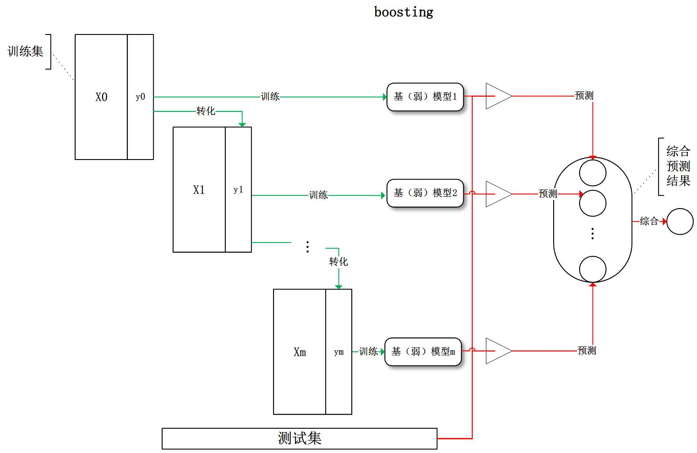

#	Boosting

##	Boosting概述

提升方法：将弱可学习算法**提升**为强可学习算法的组合元算法

-	可以从根本上减小偏差、方差
-	涉及栈泛化，
#todo

##	AdaBoost

通过改变训练样本权重，学习多个分类器，并将分类器进行线性
组合，提高分类性能

-	对离群点、奇异点敏感
-	对过拟合不敏感

###	Boosting实现

> - 改变训练数据权值或概率分布：提高分类错误样本权值、降低
	分类正确样本权值
> - 弱分类器组合：加权多数表决，即加大分类误差率小的弱分类器
	权值，使其在表决中起更大作用；减小分类误差率大的弱分类器
	权值，使其在表决中起更小作用

###	步骤

> - 输入：训练数据集$T=\{(x_1, y_1), \cdots, (x_N, y_N)\}$，
	弱分类器算法$G(x)$
> > -	$x_i \in \mathcal{X \subset R^n}$
> > -	$y_i \in \mathcal{Y} = \{-1, +1 \}$
> - 输出：最终分类器$G(x)$

-	初始化训练数据权值分布：
	$D_1=(w_{11}, \cdots, w_{1N}), w_{1i}=\frac 1 N$

-	对$m=1,2,\cdots,M$（即训练M个弱分类器）

	-	使用具有**权值分布**$D_m$的训练数据学习，得到基本
		分类器

		$$
		G_m(x):\mathcal{X} \rightarrow \{-1, +1\}
		$$

	-	计算$G_m(x)$在训练数据集上的**分类误差率**
		$$\begin{align*}
		e_m & = P(G_m(x_i)) \neq y_i) \\
			& = \sum_{i=1}^N w_{mi}I(G_m(x_i) \neq y_i) \\
			& = \sum_{G_m(x_i) \neq y_i} w_{mi}
		\end{align*}$$

	-	计算$G_m(x)$组合为最终分类器时权重
		$$
		\alpha = \frac 1 2 log \frac {1-e_m} {e_m}
		$$

		> - $\alpha_m$表示就简单分类器$G_m(x)$在最终分类器中
			的重要性，随$e_m$减小而增加
			（弱分类器保证$e_m \leq 1/2$）

	-	更新训练集权值分布
		$$\begin{align*}
		D_{m+1} & = (w_{m+1,1}, \cdots, w_{m+1,N}) \\
		w_{m+1,i} & = \frac {w_{mi}} {Z_m}
			exp(-\alpha y_i G_m(x_i)) = \left \{
			\begin{array}{l}
				\frac {w_mi} {Z_m} e^{-\alpha_m},
					& G_m(x_i) = y_i \\
				\frac {w_mi} {Z_m} e^{\alpha_m},
					& G_m(x_i) \neq y_i \\
			\end{array} \right. \\
		Z_m & = \sum_{i=1}^N w_{mi} exp(-\alpha_m y_i G_m(x_i))
		\end{align*}$$

		> - $Z_m$：规范化因子，是第m轮调整后的权值之和，其
			使得$D_{m+1}$成为概率分布
		> - 误分类样本权值相当于被放大
			$e^{2\alpha_m} = \frac {e_m} {1 - e_m}$倍

-	构建基本分类器线性组合
	$$
	f(x) = \sum_{m=1}^M \alpha_m G_m(x)
	$$
	得到最终分类器
	$$
	G(x) = sign(f(x)) = sign(\sum_{m=1}^M \alpha_m G_m(x))
	$$

	> - 这里$\alpha_m$没有规范化，和不为1，规范化没有必要
	> - $f(x)$符号决定分类预测结果，绝对值大小表示分类确信度

> - AdaBoost中分类器学习和之后的分类误差率“无关”，基分类器
	学习算法中的loss不是分类误差率，可以是其他loss，只是需要
	考虑训练数据的权值分布
> > -	**按权值分布有放回的抽样**，在抽样集上进行训练
> > -	各样本loss按权重加权，类似分类误差率中加权

###	训练误差边界

AdaBoost算法最终分类器的训练误差边界为

$$
\frac 1 N \sum_{i=1}^N I(G(x_i) \neq y_i) \leq
	\frac 1 N \sum_i exp(-y_if(x_i)) = \prod_m Z_m
$$

-	$G(x_i) \neq y_i$时，$y_if(x_i)<0$，所以
	$exp(-y_i f(x_i)) \geq 1$，则不等式部分可证

-	$$\begin{align*}
	\frac 1 N \sum_i exp(-y_i f(x_i))
		& = \frac 1 N \sum_i exp(-\sum_{m=1}^M
			\alpha_m y_i G_m(x_i)) \\
		& = \sum_i (w_{1,i} \prod_{m=1}^M
			exp(-\alpha_m y_i G_m(x_i))) \\
		& = \sum_i (Z_1 w_{2,i} \prod_{m=2}^M
			exp(-\alpha_m y_i G_m(x_i))) \\
		& = \prod_{m=1}^M Z_i \sum_i w_{M+1,i} \\
		& = \prod_{m=1}^M Z_i
	\end{align*}$$

> - AdaBoost训练误差边界性质的关键：权重调整与基本分类器权重
	调整**共系数**（形式不完全一样）
> - 这也是AdaBoost权重调整设计的依据，方便给出误差上界

####	二分类训练误差边界

$$
\prod_{m=1}^M Z_m = \prod_{m=1}^M (2\sqrt{e_m(1-e_m)})
	= \prod_{m=1}^M \sqrt{(1-4\gamma_m^2)}
	\leq exp(-2\sum_{m=1}^M \gamma_m^2)
$$

> - $\gamma_m = \frac 1 2 - e_m$

-	$$\begin{align*}
	Z_m & = \sum_{i=1}^N w_{m,i} exp(-\alpha y_i G_m(x_i)) \\
		& = \sum_{y_i = G_m(x_i)} w_{m,i}e^{-\alpha_m} +
			\sum_{y_i \neq G_m(x_i)} w_{m,i}e^{\alpha_m} \\
		& = (1-e_m)e^{-\alpha_m} + e_m e^{\alpha_m} \\
		& = 2\sqrt{e_m(1-e_m)} \\
		& = \sqrt{1-4\gamma^2}
	\end{align*}$$

-	由$\forall x \in [0, 0.5], e^{-x} > \sqrt{1-2x}$可得，
	$\sqrt{1-4\gamma_m^2} \leq exp(-2\gamma_m^2)$

> - 二分类AdaBoost误差边界性质的关键：$\alpha$的取值，也是
	前向分步算法（损失函数）要求
> - 若存$\gamma > 0$，对所有m有$\gamma_m \geq \gamma$，则
	$$
	\frac 1 N \sum_{i=1}^N I(G(x_i) \neq y_i) \neq
		exp(-2M\gamma^2)
	$$
	即AdaBoost的训练误差是**指数下降**的
> - 分类器下界$\gamma$可以未知，AdaBoost能适应弱分类器各自
	训练误差率，所以称为*adptive*

##	*Forward Stagewise Algorithm*

前向分步算法：从前往后，每步只学习**加法模型**中一个基函数
极其系数，逐步逼近优化目标函数，简化优化复杂度

###	*Additional Model*

-	加法模型：将模型**视为**多个基模型加和而来

	$$
	f(x) = \sum_{m=1}^M \beta_m b(x;\theta_m)
	$$

	> - $b(x;\theta_m)$：基函数
	> - $\theta_m$：基函数的参数
	> - $\beta_m$：基函数的系数

-	策略：在给定训练数据、损失函数$L(y,f(x))$的条件下，学习
	加法模型$f(x)$成为经验风险极小化问题

	$$
	\arg\min_{\beta_m, \theta_m} \sum_{i=1}^N
		L(y_i, \sum_{m=1}^M \beta_m b(x_i;\theta_m))
	$$

-	改进策略：同时求解所有参数$\beta, theta$比较麻烦，尝试
	每步求解一个基函数参数极其系数，即每步优化

	$$
	\arg\min_{\beta, \theta} \sum_{i=1}^N
		L(y_i, \hat f_m(x_i) + \beta b(x_i;\theta))
	$$

	> - $\hat f_m$：前m轮基函数预测值加和

###	步骤

> - 输入：训练数据集$T={(x_1,y_1), \cdots, (x_N,y_N)}$，损失
	函数$L(y,f(x))$，基函数集$\{b(x;\theta)\}$
> - 输出：加法模型$f(x)$

-	初始化$f_0(x)=0$

-	对$m=1,2,\cdots,M$，加法模型中M个基函数

	-	极小化损失函数得到参数$\beta_m, \theta_m$
		$$
		(\beta_m, \theta_m) = \arg\min_{\beta, \theta}
			\sum_{i=1}^N L(y_i, f_{m-1}(x_1) +
			\beta b(x_i; \theta))
		$$

	-	更新
		$$
		f_m(x) = f_{m-1}(x) + \beta_m b(x;y_M)
		$$

-	得到加法模型
	$$
	f(x) = f_M(x) = \sum_{i=1}^M \beta_m b(x;\theta_m)
	$$

###	AdaBoost&前向分步算法

AdaBoost（基分类器loss使用分类误差率）是前向分步算法的特例，
是由基本分类器组成的加法模型，损失函数是指数函数

-	基函数为基本分类器时加法模型等价于AdaBoost的最终分类器
	$f(x) = \sum_{m=1}^M \alpha_m G_m(x)$

-	前向分步算法的损失函数为指数函数$L(y,f(x))=exp(-yf(x))$
	时，学习的具体操作等价于AdaBoost算法具体操作

	-	假设经过m-1轮迭代，前向分步算法已经得到

		$$\begin{align*}
		f_{m-1}(x) & = f_{m-2}(x) + \alpha_{m-1}G_{m-1}(x) \\
			& = \alpha_1G_1(x) + \cdots +
			\alpha_{m-1}G_{m-1}(x)
		\end{align*}$$

	-	经过第m迭代得到$\alpha_m, G_m(x), f_m(x)$，其中

		$$\begin{align*}
		(\alpha_m, G_m(x)) & = \arg\min_{\alpha, G}
				\sum_{i=1}^N exp(-y_i(f_{m-1}(x_i) +
				\alpha G(x_i))) \\
			& = \arg\min_{\alpha, G} \sum_{i=1}^N \bar w_{m,i}
				exp(-y_i \alpha G(x_i))
		\end{align*}$$

		> - $\bar w_{m,i}=exp(-y_i f_{m-1}(x_i))$：不依赖
			$\alpha, G$

	-	$\forall \alpha > 0$，使得损失最小应该有
		（提出$\alpha$）

		$$\begin{align*}
		G_m^{*}(x) & = \arg\min_G \sum_{i=1}^N \bar w_{m,i}
				exp(-y_i f_{m-1}(x-i)) \\
			& = \arg\min_G \sum_{i=1}^N \bar w_{m,i}
				I(y_i \neq G(x_i))
		\end{align*}$$

		此分类器$G_m^{*}$即为使得第m轮加权训练误差最小分类器
		，即AdaBoost算法的基本分类器

	-	又根据

		$$\begin{align*}
		\sum_{i=1}^N \bar w_{m,i} exp(-y_i \alpha G(x_i)) & =
			\sum_{y_i = G_m(x_i)} \bar w_{m,i} e^{-\alpha} +
			\sum_{y_i \neq G_m(x_i)} \bar w_{m,i} e^\alpha \\
		& = (e^\alpha - e^{-\alpha}) \sum_{i=1}^N (\bar w_{m,i}
			I(y_i \neq G(x_i))) + e^{-\alpha}
			\sum_{i=1}^N \bar w_{m,i}
		\end{align*}$$

		带入$G_m^{*}$，对$\alpha$求导置0，求得极小值为

		$$\begin{align*}
		\alpha_m^{*} & = \frac 1 2 log \frac {1-e_m} {e_m} \\
		e_m & = \frac {\sum_{i=1}^N (\bar w_{m,i}
				I(y_i \neq G_m(x_i)))}
			{\sum_{i=1}^N \bar w_{m,i}} \\
		& = \frac {\sum_{i=1}^N (\bar w_{m,i}
				I(y_i \neq G_m(x_i)))} {Z_m} \\
		& = \sum_{i=1}^N w_{m,i} I(y_i \neq G_m(x_i))
		\end{align*}$$

		> - $w_{m,i}, Z_M$同AdaBoost中

		即为AdaBoost中$\alpha_m$

	-	对权值更新有

		$$
		\bar w_{m+1,i} = \bar w_{m,i} exp(-y_i \alpha_m G_m(x))
		$$

		与AdaBoost权值更新只相差规范化因子$Z_M$

##	*Gredient Boost*

梯度提升：前向分步算法中学习每个基学习器时

-	利用损失函数的负梯度在当前模型的值

	$$
	-\left [ \frac {\partial L(y, f(x_i))}
		{\partial f(x_i)} \right ]_{f(x) = f_{m-1}(x)}
	$$

	作为提升树算法中残差近似值，拟合回归树

-	类似最速下降法

###	步骤

> - 输入：训练数据集$T=\{(x_1, y_1), \cdots, (x_N, y_N)\}$，
	损失函数$L(y, f(x))$
> > -	$x_i \in \mathcal{X \subset R^n}$
> > -	$y_i \in \mathcal{Y} = \{-1, +1 \}$
> - 输出：回归树$\hat f(x)$

-	初始化模型
	$$
	f_0(x) = \arg\min_\theta \sum_{i=1}^N L(y_i, \theta)
	$$

-	对$m=1,2,\cdots,M$（即训练M个若分类器）

	-	计算伪残差
		$$
		r_{m,i} = -[\frac {\partial L(y_i,f(x_i))} 
			{\partial f(x_i)}]_{f(x)=f_{m-1}(x)}
		$$

	-	基于${(x_i, r_{m,i})}$生成基学习器$h_m(x)$

	-	计算最优系数
		$$
		\gamma = \arg\min_\gamma \sum_{i=1}^N
			L(y_i, f_{m-1} + \gamma h_m(x_i))
		$$

	-	更新模型
		$$
		f_m(x) = f_{m-1}(x) + \gamma_m h_m (x)
		$$

-	得到最终模型

	$$
	\hat f(x) = f_M(x) = \sum_{m=1}^M \gamma_m h_m(x)
	$$

##	 *Boosting Tree*/*GBDT*

提升树/梯度提升树：以决策树为基函数的提升方法

-	可以表示为决策树的加法模型

	$$
	f_M(x) = \sum_{m=1}^M T(x;\Theta_m)
	$$

	> - $T(x; \Theta_m)$：决策树
	> - $\Theta_m$：决策树参数
	> - $M$：树的个数

