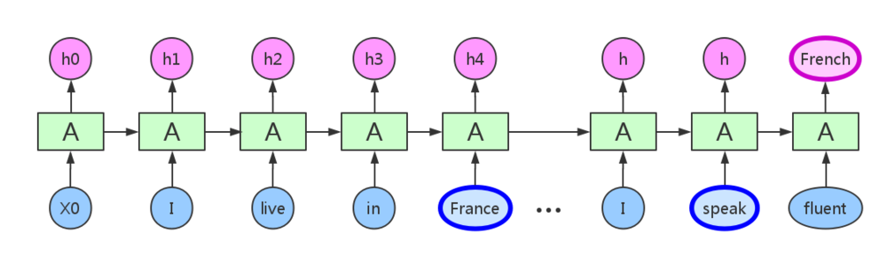
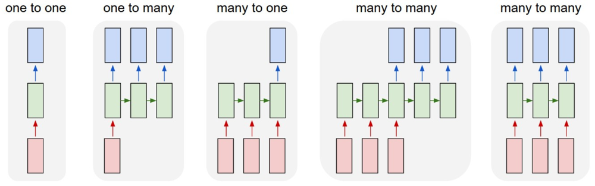
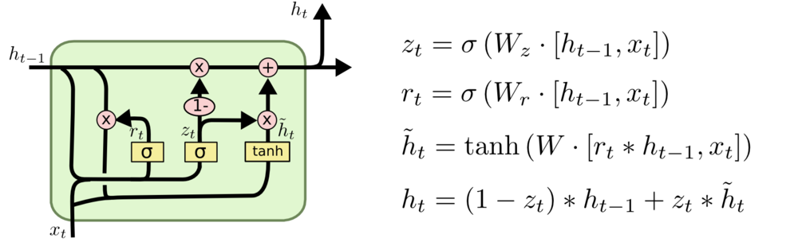

#	Recurrent Neural Network

##	标准RNN

RNN：处理序列数据（序列中前后数据有关联）神经网络

> - 左侧为折叠的神经网络，右侧为展开后的网络
> - *h*为**循环隐层**，其中神经元之间有权连接，随序列输入，
	上一期隐层会影响下一期
> - *o*输出、*y*实际值
> - *L*损失函数：随着时间累加

###	结构

####	权值连接

-	循环隐层内神经元之间也建立权连接，即**循环**

	-	基础神经网络只在层与层之间建立权值连接是RNN同普通DNN
		最大不同之处

-	循环隐层中神经元只会和其**本身**建立权值连接

	-	即不受上期其他神经元（同层、非同层）影响
	-	循环隐层中神经元$t$期状态$h^{(t)}$由当期输入、
		$h^{(t-1)}$共同决定

####	逻辑结构

RNN网络实际结构是线性、折叠的，逻辑结构则是展开的结构，考虑
RNN性质应该在展开的逻辑结构中考虑

-	序列输入
	-	实际结构：依次输入
	-	逻辑结构：里是整体作为一次输入、才是一个样本，损失、
		反向传播都应该以完整序列为间隔

-	权值共享
	-	实际结构：不同期的权值实际是同一组
	-	逻辑结构：称为**权值共享**

-	重复模块链
	-	实际结构：同一个模块
	-	逻辑结构：不同期模块之间信息流动形成链式形式

####	信息传递

RNN循环层中信息只能由上一期直接传递给下一期

-	输入、输出相关信息间隔较近时，普通RNN可以胜任

	

-	当间隔很长，RNN理论上虽然能够处理，但由于梯度消失问题，
	实际上不行，需要LSTM网络

	

###	*Forward Propogation*

-	$h^{(t)} = \sigma(z^{(t)}) = \sigma(Ux^{(t)} + Wh^{(t-1)} +b )$
	> - $\sigma$：RNN激活函数，一般为$tanh$
	> - $b$：循环隐层偏置

-	$o^{(t)} = Vh^{(t)} + c$
	> - $c$：输出层偏置

-	$\hat{y}^{(t)} = \sigma(o^{(t)})$
	> - $\sigma$：RNN激活函数，分类时一般时$softmax$

###	*Back-Propogation Through Time*

*BPTT*：训练RNN的常用方法

> - 本质仍然是BP算法，但是RNN处理序列数据，损失随期数累加，
	即计算梯度时使用最终损失$L = \sum_{t=1}^\tau L^{(t)}$

> - 对循环层中参数，梯度沿着期数反向传播，第t期反向传播时，
	需要逐级求导

-	序列整体作为一次输入，进行一次反向传播
-	理论上可以漂亮的解决序列数据的训练，但是和DNN一样有梯度
	消失的问题，尤其是序列很长时，所以一般不能直接应用

####	非循环层

-	$\frac{\partial L}{\partial c}$
	$$\begin{align*}
	\frac{\partial L}{\partial c} & = \sum_{t=1}^{\tau}
		\frac{\partial L^{(t)}}{\partial c}
	& = \sum_{t=1}^{\tau}\frac{\partial L^{(t)}}
		{\partial o^{(t)}} \frac{\partial o^{(t)}}{\partial c}
	& = \sum_{t=1}^{\tau}\hat{y}^{(t)} - y^{(t)}
	\end{align*}$$

	> - $L^{(t)} = \frac 1 2 (\hat{y}^{(t)} - y^{(t)})^2$：
		使用平方损失

-	$\frac{\partial L}{\partial V}$

	$$\begin{align*}
	\frac{\partial L}{\partial V} & = \sum_{t=1}^{\tau}
		\frac{\partial L^{(t)}}{\partial V}
	& = \sum_{t=1}^{\tau} \frac{\partial L^{(t)}}
		{\partial o^{(t)}} \frac{\partial o^{(t)}}{\partial V}
	& = \sum_{t=1}^{\tau}(\hat{y}^{(t)} - y^{(t)})
		(h^{(t)})^T
	\end{align*}$$

####	循环层

> - 为方便定义：
	$\delta^{(t)} = \frac {\partial L} {\partial h^{(t)}}$

-	$\delta^{(t)}$
	$$\begin{align*}
	\delta^{(t)} & = \frac {\partial L} {\partial h^{(t)}} \\
		& = \frac{\partial L}{\partial o^{(t)}}
			\frac{\partial o^{(t)}}{\partial h^{(t)}} +
			\frac{\partial L}{\partial h^{(t+1)}}
			\frac{\partial h^{(t+1)}}{\partial h^{(t)}}
		& = V^T(\hat{y}^{(t)} - y^{(t)}) +
			W^T\delta^{(t+1)}diag(1-h^{(t+1)})^2)
	\end{align*}$$

	> - $\frac{\partial h^{(t+1)}}{\partial h^{(t)}} = diag(1-h^{(t+1)})^2)$
		：$tanh(x)$梯度性质
	> - $h^{(t)}(t<\tau)$梯度：被后一期影响（反向传播），需递推

-	$\delta^{(\tau)}$

	$$\begin{align*}
	\delta^{(\tau)} & = \frac{\partial L}{\partial o^{(\tau)}}
		\frac{\partial o^{(\tau)}}{\partial h^{(\tau)}}
	& = V^T(\hat{y}^{(\tau)} - y^{(\tau)})
	\end{align*}$$

	> - $\tau$期后没有其他序列，可以直接求出

-	$\frac{\partial L}{\partial W}$

	$$\begin{align*}
	\frac{\partial L}{\partial W} & = \sum_{t=1}^{\tau}
		\frac{\partial L}{\partial h^{(t)}}
		\frac{\partial h^{(t)}}{\partial W}
	& = \sum_{t=1}^{\tau}diag(1-(h^{(t)})^2)
		\delta^{(t)}(h^{(t-1)})^T
	\end{align*}$$

	> - 需要由$\sigma^{(t)}$累加得到

-	$\frac{\partial L}{\partial b}$

	$$\begin{align*}
	\frac{\partial L}{\partial b} & = \sum_{t=1}^{\tau}
		\frac{\partial L}{\partial h^{(t)}}
		\frac{\partial h^{(t)}}{\partial b}
	& = \sum_{t=1}^{\tau} diag(1-(h^{(t)})^2)\delta^{(t)}
	\end{align*}$$

-	$\frac{\partial L}{\partial U}$
	$$\begin{align*}
	\frac{\partial L}{\partial U} & = \sum_{t=1}^{\tau}
		\frac{\partial L}{\partial h^{(t)}}
		\frac{\partial h^{(t)}}{\partial U}
	& = \sum_{t=1}^{\tau}diag(1-(h^{(t)})^2)
		\delta^{(t)}(x^{(t)})^T
	\end{align*}$$

###	其他结构

> - 普通的DNN：固定大小输入得到固定输出
> - 单个输入、序列输出：输入图片，得到描述文字序列
> - 序列输入、单个输出：情感分析
> - 异步序列输入、输出：机器翻译
> - 同步序列输入、输出：视频帧分类

####	*Encoder-Decoder*模型

*Seq2Seq*模型：允许输入、输出序列不等长*N vs M*
（应该就是异步序列输入、输出模型）

-	编码

	-	将最后的隐状态赋给中间状态
	-	对最后隐状态作变换作为中间状态
	-	对所有隐状态作变换得到中间状态

-	解码：将中间状态转化为输出

> - 标准RNN网络要求输入、输出序列长度相同

####	*Gated Feedback RNN*

-	Gated Feedback RNN中隐层会对下期其他隐层产生影响

###	应用场景

-	训练样本输入是连续的序列,且序列的长短不一
	-	基于时间的序列
	-	一段段连续的语音
	-	一段段连续的手写文字

-	比较难直接的拆分成一个个独立的样本来通过DNN/CNN进行训练

####	非序列RNN

即使输入、输入没有设计向量序列，RNN仍然可以使用序列方式处理

####	字符级别语言模型

##	*Long Short Term Memory*

*LSTM*：通过刻意设计、默认可以学习长期依赖信息的RNN网络

> - 每个重复的模块称为细胞

###	结构

相较于标准RNN中简单的细胞结构，LSTM中细胞结构经过特殊设计

####	*Cell State*

细胞状态：LSTM中最重要的核心思想

-	随着时间流动，承载之前所有状态信息，代表长期记忆
-	类似于传送带，直接在整个链上运行，只有少量**线性交互**
-	信息其上流派很容易保持不变
-	通过“三个门”保护、控制

####	Gates

-	tanh处理$h_{t-1}, x_t$、$C_{t-1}$得到备选输入、输出流

-	sigmoid处理$h_{t-1}, x_t$，得到介于$0-1$之间控制向量，
	与输入、输出流做*point wise*点乘确定最终遗忘、输入、输出

	-	*1*：完全保留
	-	*0*：完全舍弃

-	多个LSTM细胞可以组成*block*，其中细胞**门权值共享**

	-	block中各个细胞状态还是不同的
	-	这个是真权值共享，类似CNN中的卷积核
	-	减少参数个数，效率更高

#####	*Forget Gate*

遗忘门：决定要从细胞状态中舍弃的信息

> - $C_{t-1}$：第$t$期更新前细胞状态
> - $h_{t-1}$：第$t-1$期细胞状态输出
> - $x_t$：第$t$期输入
> - $f_t$：决定保留/遗忘的信息

#####	*Input Gate*

输入门：决定向细胞状态中保留的信息

> - $\tilde{C}_t$：第$t$期更新备选内容
> - $i_t$：决定需要更新的信息
> - $C_t$：第$t$期更新完成后细胞状态

#####	*Ouput Gate*

输出门：决定从细胞状态中输出的信息

> - $o_t$：决定需要输出的信息
> - $h_t$：第$t$期输出信息

###	变体结构

####	*Vanilla LSTM*

> - *Peephole Connection*：细胞状态也作为3个门中sigmoid的
	输入，影响控制向量的生成

####	*Coupled Input and Forget Gate*

> - $1-f_i$代替$i_t$，结合遗忘门、输入门

####	*Gated Recurrent Unit*

> - $h_{t-1}$：原细胞状态、隐层状态合并

> - $r_t$：*reset gate*输出，重置上期状态$h_{t-1}$再作为更新
	门输入

> - $\tilde{h}_t$：第$t$期更新备选信息

> - $z_t$：*update gate*输出，当期状态$h_t$中$h_{t-1}$、
	$\tilde{h}_t$占比（遗忘、更新的结合）

####	结构比较

在Vanilla LSTM基础上的8个变体在TIMIT语音识别、手写字符识别、
复调音乐建模三个应用中比较

> - *No Input Gate*：NIG，没有输入门
> - *No Forget Gate*：NFG，没有遗忘门
> - *No Output Gate*：NOG，没有输出门
> - *No Input Acitivation Function*：NIAF，输入门没有tanh
	激活
> - *No Output Activation Function*：NOAF，输出门没有tanh
	激活
> - *No Peepholes*：NP，普通LSTM
> - *Coupled Input and Forget Gate*：CIFG，遗忘、输出门结合
> - *Full Gate Recurrence*：FGR，所有门之间有回路

-	Vanilla LSTM效果均良好，其他变体没有性能提升

-	细胞结构

	-	遗忘门、输入门是最重要的部分
		-	遗忘门对LSTM性能影响十分关键
		-	输出门对限制无约束细胞状态输出必要
	-	CIFG、NP简化结构，单对结果没有太大影响

-	超参

	-	学习率、隐层数量是LSTM主要调节参数
		-	两者之间没有相互影响，可以独立调参
		-	学习率可以可以使用小网络结构独立校准
	-	动量因子影响不大
	-	高斯噪声的引入有损性能、增加训练时间

