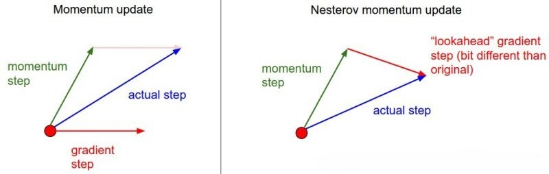

#	Data Science总述

##	范畴

###	Statistic

-	传统统计（frequentist and Bayesian）是数学分支，概率论
	和优化的交集
	-	分析方法：验证式分析
	-	理论依据：模型驱动，严格的数理支撑
	-	分析对象：样本为分析对象，基于概率论推断总体
	-	统计建模：假设输入、输出变量的关系（一般为线性），
		并验证假设

-	是其他大部分的理论基础

###	Machine Learning

-	机器学习是能够从经验中自动学习的算法
	-	分析方法：归纳式、探索式分析
	-	理论依据：数据驱动，从数据中中学习知识，
	-	分析对象：对样本要求低，样本往往不具有随机样本的特征
	-	机器学习建模：不假设，通过对高维空间的搜索，找到数据
		隐藏规律的恰当概括

-	机器学习目前在实践中最重要的应用就是预测结果

###	Data Mining

-	从现有的信息中提取数据的**pattern**、**model**，即精选
	最重要的（可理解的、有价值的）信息

	-	核心目的在于找到**数据变量之间的关系**
	-	**不是证明假说的方法，而是构建假说的方法**
	-	**大数据**的发展，传统的数据分析方式无法处理大量
		“不相关”数据

-	联系
	-	本质上看起来像是ML、AI的基础
	-	会使用大量机器学习算法，但是特定的环境、目的和ML不同

-	常用技术
	-	cluster analysis：揭示数据内在结构
	-	classification：数据预测
	-	regression/decision trees：模型图形化展示
	-	neural networks

-	建模一般策略：类似机器学习
	-	将数据视为高维空间中的点，在高维空间中找到分类面、
		回归面

###	Artificial Intelligence

-	研究如何创造智能agent，并不一定涉及学习、归纳，既可以研究
	让电脑像智能agent一样行为，也可以是设计更好的捕鼠夹

-	但是大部分情况下，**智能**需要从过去的经验中进行归纳，
	所以AI中很大一部分是ML

##	模型评估

###	评估方向

####	模型误差

-	训练误差：最小MSE原则下的训练误差一般偏低，不能作为模型
	预测误差的出估计

-	测试误差；在“模拟”新样本上的预测误差，可以作为模型预测
	误差的出估计
	-	是模型泛化能力的度量

-	训练误差、测试误差的关系
	-	训练MSE随模型复杂度增加单调下降
	-	测试MSE随模型复杂度增加呈U型
		-	偏差降低程度大于方差增加程度，测试MSE降低
		-	偏差降低程度小于方差增加程度，测试MSE增大
	-	训练MSE小但测试MSE大表明模型过拟合，使测试MSE最小
		的模型为理想模型

####	模型复杂度

-	简单模型：低方差高偏差
-	复杂模型：低偏差高方差

兼顾偏差和方差，通过不同建模策略，找到恰当的模型，其复杂度
不太大且误差在可接受的水平

####	过拟合

过拟合表现

-	远离真实关系，模型在来自同系统中其他尚未观测的数据集上
	预测误差大
-	高方差：模型紧跟特定数据点，受其影响较大，预测结果不稳定

#####	解决方法

-	减少特征数量（模型选择）：最优子集回归
-	正则化：岭回归、LASSO、Elastic Net
-	Dropout：每次训练部分神经元
-	提前终止模型训练

###	分类预测模型

####	混淆矩阵

-	对比实际类别值、预测类别值，编制混淆矩阵
-	基于混淆矩阵，计算各类错判率、总错判率（总错判率会
	受到数据不平衡性的影响）

|真实情况\预测结果|正例|反例|
|------|------|------|
|正例|TP（真正例）|FN（假反例）|
|反例|FP（假正例）|TN（真反例）|

####	ROC曲线

Recevier Operating Characteristic Curve

1.	将预测概率降序排序
2.	取分位点上概率值（即依次取不同的阈值）作为判断1/0的阈值
3.	计算FPR、TPR，绘制ROC曲线，计算ROC曲线下的面积AUC

$$
TPR = \frac {TP} {TP+FN} \\
FPR = \frac {FP} {FP+TN}
$$

-	TPR越高越好，FPR越低越好，但是这两个指标相互制约，两者
	同时增加、减小
	-	模型倾向于将样本**判定为**为正例，则TP、FP同时增加、
		TPR、FPR同时变大
	-	即模型取不同阈值，会产生正相关的TPR、FPR的点列

-	ROC曲线即以FPR为横坐标、TPR为正坐标绘制曲线
	-	FPR接近1时，TPR也接近1，这是不可避免的
	-	而FPR接近0时，TPR越大越好
	-	所以模型ROC曲线下方面积越大，模型判断正确效果越好

-	AUC值：ROC曲线下方面积，越大越好
	-	=1：完美预测，存在一个阈值可以让模型TPR为1，FPR为0
	-	0.5~1：优于随机预测，至少存在某个阈值，模型TPR>FPR
	-	=0.5：同随机预测，无价值
	-	0~0.5：差于随机预测，但是可以反向取预测值

####	F1值

$$
查准率P = \frac {TP} {TP+FP} \\
查全率（覆盖率）R = \frac {TP} {TP+FN} \\
\frac {1} {F_{1}} = \frac {1} {2}
	\left( \frac {1} {P} + \frac {1} {R} \right) \\
\Rightarrow F_{1} = \frac {2 * P * R} {P + R}
	= \frac {2 * TP} {样例总数 + TP - TN}
$$
	
F1越大越好

###	回归预测模型

####	均方误差（偏差）

$$
MSE = \frac {1} {n} \sum_{i=1}^{n} (y_{i} - \hat{y_{i}})^{2}
$$

基于最小化MSE原则

$$
\begin{align*}
E(Y - \hat{Y}) &= E[f(x) + \epsilon - \hat{f}(X)]^{2} \\
	&= E([f(X) - \hat{f}(X)])^{2} + Var(\epsilon) \\
	&= E_{\tau}[\hat{y}_{0} - E_{\tau}(\hat{y})]^{2} +
		[E_{\tau}(\hat{y}_{0}) - f(x_{0})]^{2} +
		Var(\epsilon) \\
	&= Var_{\tau}(\hat{y}_{0})+ Bias^{2}(\hat{y}_{0}) + Var(\epsilon)\\
\end{align*}
$$

####	$R^2k$

$$
R^2 \\
Adjusted R^2 = 1 - \frac {RSS/(n-d-1)} {TSS/(n-1)}
$$

####	AIC

$$
AIC = -2log(L(\theta, x)) + 2d \\
	= \frac {1} {n\hat{\sigma}^2}(RSS + 2d\hat{\sigma}^2)
$$

####	BIC

$$
BIC = \frac {1} {n} (RSS + log(n)d\hat{\sigma}^2)
$$

####	$C_p$

$$
CP = \frac {1} {n} (RSS + 2d\hat{\sigma}^2)
$$

##	核函数

-	支持向量机通过非线性变量$\phi(x)$，将输入空间映射到高维
	特征空间，特征空间维数可能非常高。
-	如果支持向量机之后求解只需要用到内积运算，而在低维空间
	存在某个函数$K(X, X^{'})$（核函数），恰好等于高维空间内积
	$$
	K(X, X^{'})=<\phi(X), \phi(X^{'})>
	$$
-	那么支持向量机就不用计算复杂的非线性变换，可以直接由
	$K(X, X^{'})$得到内积，简化计算

###	Uniform Kernel

$$
K(d) = \frac 1 2 * I(|d|<1)
$$

###	Triangle Kernel

$$
K(d) = (1-|d|) * I(|d|<1)
$$

###	Epanechnikov Kernel

$$
K(d) = \frac 3 4 (1-d^2) * I(|d|<1)
$$

###	Quartic Kernel

$$
K(d) = \frac {15} {16} (1-d^2)^2 * I(|d|<1)
$$

###	Triweight Kernel

$$
K(d) = \frac {35} {32} (1-d^2)^3 * I(|d|<1)
$$

###	Gauss Kernel

$$
K(d) = \frac 1 {\sqrt{2\pi}} exp(- \frac {d^2} 2) * I(|d|<1)
$$

###	Cosine Kernel

$$
K(d) = \frac \pi 4 cos(\frac \pi 2) * I(|d|<1)
$$

##	Heterogeneity

###	数值型

####	方差

回归树中输出变量取值异质性测度

$$
R(t) = \frac 1 {N - 1} \sum_{i=1}^N (y_i(t) - \bar{y}(t)^2) \\
\delta R(t) = R(t) - (\frac {N_r} N R(t_r) + \frac {N_l} N (R(t_l))
$$

###	分类型

####	GINI系数

分类树中输出变量取值异质性测度

$$
G(t) = 1 - \sum_{j=1}^k p^2(j|t) \\
\Delta G(t) = G(t) - (\frac {N_r} N G(t_r) + \frac {N_l} N G(t_l))
$$

-	异质性最小时Gini系数为0
-	异质性最大时Gini系数为$1 - \frac 1 k$

####	信息熵

-	熵：则是在概率分布上对随机变量X的不确定性/混乱程度的度量
-	信息熵：信息消除不确定性的度量

$$
\begin{align*}
Ent(U) & = \sum_i P(u_i) log_2 \frac 1 {P(u_i)} \\
	& = - \sum_i P(u_i) log_2 P(u_i) \\
\end{align*}
$$

其中

-	$u_i$为随机变量各个取值，$P(u_i)$对应概率
	-	若有事件i发生概率$p_i=0$，此时约定$p_ilog(p_i)$为0

-	信息熵为0，$\exists j, P(u_j)=1$，无不确定性，随机变量
	只能取一个值

-	若$\forall j, P(u_j)=1/k$，信息熵最大为$log_2 k$，随机
	变量在任意取值概率相等，不确定性最大

#####	后验熵

-	后验熵为

	$$
	\begin{align*}
	Ent(U|v_j) & = \sum_i(P(u_i|v_j) log_2 \frac 1 {P(u_i|v_j)} \\
		& = - \sum_i P(u_i|v_j) log_2 P(u_i|v_j) \\
	\end{align*}
	$$

-	后验熵期望为

	$$
	\begin{align*}
	Ent(U|V) & = \sum_j P(v_j) sum_i P(u_i|v_j)
		log_2 \frac 1 {P(u_i|v_j)} \\
		& = \sum_j P(v_j)(-\sum_i P(u_i|v_j) log_2 P(u_i|v_j))
	\end{align*}
	$$

-	信息增益

	$$
	Gains(U|V) = Ent(U) - Ent(U|V)
	$$

#####	熵的性质

-	若X、Y相互独立
	$$
	H(X, Y) = H(X) + H(Y)
	$$

-	一般的
	$$
	H(X, Y) = H(X) + H(Y|X) \\
	H(X, Y) = H(Y) + H(X|Y) \\
	H(X|Y) \leqslant H(x) \\
	H(X, Y) \leqslant H(X) + H(Y) \\
	$$

####	误分率

$$
1 - \hat p_{m, k(m)} = \frac 1 {n_m}
	\sum_{x_i \in R_m} I(y_i \neq k(m))
$$

####	KLP统计量

####	卡方统计量


##	抽样技术

###	Hold Out

旁置法：将样本集随机划分为训练集、测试集

-	适合样本量较大的场合

###	Leave One Out

留一法：对n个观测的样本集，每次选择一个观测作为测试样本集，
剩余n-1个观测值作为训练样本集，重复n次计算模型误差

-	可以看作是N折交叉验证的特例

###	N折交叉验证

旁置法的扩展，将数据分成N份，每次将其中一份作为测试样本集，
其余N-1份作为训练样本集

-	解决了留一法计算成本高的问题：重复次数少
-	克服了旁置法中测试样本选取随机性的问题：每个样本都能作为
	测试样本
-	典型的“袋外验证”：袋内数据（训练样本）、袋外数据（测试
	样本）分开


###	Bootstrap

重抽样自举：对样本量为n的样本集S，做k次有放回的重复抽样，
得到k个样本容量仍然未n的随机样本$S_i(i=1,2,...,k)$，称为自举
样本（模拟多组独立样本）

###	Boosting

####	AdaBoost

对加权样本做有放回的随机抽样，获得训练样本集

1.	对S做有放回的随机抽样，获得容量为n的随机样本$S_1$，建立
	模型$T_1$，计算样本i模型误差e(i)
	-	e(i)>0.5：模型无价值，差于随机分类，终止建模
	-	e(i)=0：模型完美，终止建模

2.	调整S中各个观测值权重，对$T_1$预测正确的观测给与较低权重
	，错误预测权重不变
	-	正确分类的样本权：$w_j(i+1) = w_j(i) * \beta(i)
		\beta(i) = e(i) / (1 - e(i))$
	-	错误分类样本权：$w_j(i+1) = w_j(i)$
	-	调整$w_j(i+1)$使权重和为1

3.	根据权重对S做放回随机抽样得到$S_2$，建立模型$T_2$，权重
	越大的观测进入$S_2$的可能性越高

4.	重复k次得到k个自举样本$S_1, S_2, ..., S_k$，以及K个预测
	模型$T_1, T_2, ..., T_k$

#####	缺点

-	对离群点、奇异点敏感

#####	优点

-	对过拟合不敏感

####	Grediant Boost


##	参数估计

###	全局估计

$$
\Theta = \Theta - \alpha \Delta_\Theta J(\Theta)
$$

同时考虑所有**待估参数**、**样本**

-	传统统计中的应用场合较多
	-	适合样本量小、待估参数少

-	理论指导若可行，可一步**更新（计算）**完成
	-	矩估计：最小二乘估计
	-	极大似然估计

-	无法一步更新完成者也可能需要迭代
	-	样本量较少场合

###	Changing Direction

每次更新**一个或几个**待估参数 

-	一般用在机器学习算法中比较多
	-	适合待估参数较少，待估参数较多可能更新速度慢
	-	往往需要多次迭代更新参数

-	特性：某些算法
	-	良好的并行特性：能够同时更新多个参数
		-	Alternating Direction Method of Multipliers
	-	采用贪心策略的算法：可能无法得到最优解
		-	前向回归
		-	深度学习：网络层次太深，有些算法采用*固化*部分
			网络结构，估计剩余部分
	-	能够平衡全局、局部：得到较好的解
		-	LARS

###	Mini-Batch

$$
\Theta = \Theta - \alpha \Delta_\Theta J(\Theta; x[i:i+n], y[i:i+n])
$$

每次使用部分样本更新参数（极小化优化函数）

####	特点

-	适合样本量较大时使用，无法使用样本整体进行估计

-	开始阶段收敛速度快，之后受限于每次只使用一个batch的样本
	更新参数
	-	结果可能不稳定，往往很难得到最优解
	-	因此往往需要对样本更新多次epoch

-	一定程度上能避免局部最优（随机batch能够越过）

-	batch-size为1时就是Stochastic Gradient Descent，但是SGD
	速度太慢，一般不采用

####	应用

-	深度学习：往往样本量大，无法直接估计

####	缺陷

-	选择适当学习率$\alpha$困难，太小学习率收敛速率缓慢，学习
	率过大则会造成较大波动

	-	可以采用模拟退火算法，在训练过程中调整学习率大小，即
		达到一定迭代次数、损失函数小于阈值时，减小学习速率

-	依然容易陷入局部极小值

###	Momemntum

$$
v_t = \gamma v_{t-1} + \alpha \Delta_\Theta J(\Theta) \\
\Theta = \Theta - v_t
$$

借用物理中动量概念，模拟物体运动时惯性，即在使用batch计算的
梯度更新时，一定程度上保持之前更新的方向

-	可以在一定程度上保持稳定性，学习速度更快
-	能够越过部分局部最优解

####	Nesterov Momentum

$$
v_t = \gamma v_{t-1} +
	\alpha \Delta_\Theta J(\Theta - \gamma v_{t-1}) \\
\Theta = \Theta - v_t
$$

在动量基础上，不仅考虑使用动量修正最终方向，还考虑**再次**
对当前位置使用动量进行修正



###	Adagrad

$$
j^{(t)}_i = \Delta_\Theta^{(t)} J(\Theta)[i] \\
\Theta^{(t+1)}_i = \Theta^{t+1}_i - \frac \alpha
	{\sqrt {G^{(t)}_{ii} + \epsilon}} j^{(t)}_i
$$

-	$j^{(t)}_i$：对t轮梯度第i个分量
-	$G$：对角阵，对角线元素$G_{ii}$为对应参数累计平方和
-	$\epsilon$：fuss factor，避免分母为0

在训练中自动对不同参数学习率**分别**进行调整

-	对于出现频率较低的参数使用较大$\alpha$进行更新，出现频率
	较高采用较小$\alpha$更新

-	缺点是在训练后期，分母中梯度平方累加很大，梯度接近0，
	训练提前结束（收敛速度慢，触发阈值）

####	RMSprop

```md
E[j^2]^{(t+1)} = \alphaE[j^2] + (1-\alpha)[{j^2}^{(t)}]
```

使用$E$替换Adagrad中的$G$，避免学习速率下降太快

####	Adam

$$
m^{(t)} = \beta_1 m^{t-1} + (1-\beta_1)j^{(t)} \\
v^{(t)} = \beta_2 v^{t-1} + (1-\beta_2)j^{(t)} \\
\hat_{m^{(t)}} = \frac {m^{(t)}} {1-\beta^{(t)}_1} \\
\hat_{v^{(t)}} = \frac {v^{(t)}} {1-\beta^{(t)}_2} \\
\Theta^{(t+1)} = \Theta^{(t)} - \frac \alpha
	{\sqrt{\hat_{v^{(t)}} + \epsilong}} \hat_{m^{(t)}
$$

利用梯度的一阶矩$m^{(t)}$、二阶矩$v^{(t)}$动态调整每个参数
学习率

-	经过偏执矫正后，每次迭代学习率都有确定范围，参数比较平稳

####	Adadelta

##	距离

$dist(x,y)$：不一定是空间距离，应该认为是两个对象x、y之间的
相似程度

-	距离和相似度是互补的
-	可以根据处理问题的情况，自定义距离

###	单点距离

####	欧几里得距离

####	切比雪夫距离

####	闵科夫斯基距离

####	曼哈顿距离

####	Consine Similarity

余弦相似度

###	组间距离

####	Single Linkage

####	Average Linkage

####	Complete Linkage

##	激活函数

###	指数类

####	Sigmoid

将实数映射到(0, 1)区间

-	用途
	-	隐层神经元输出
	-	二分类输出

-	缺点
	-	激活函数计算量大，BP算法求误差梯度时，求导涉及除法
	-	误差反向传播时容易出现梯度消失
	-	函数收敛缓慢

$$
sigmoid(x) = \frac 1 {1+e{-x}}
$$

####	Hard_Sigmoid

计算速度比sigmoid激活函数快

$$
hard_signmoid(x) =
\left \{ \begin {array} {c}
	0 & x < -2.5 \\
	1 & x > 2.5 \\
	0.2*x + 0.5 -2.5 <= x <= 2.5 \\
\end {array} \right.
$$

####	Softmax

主要用于多分类神经网络输出

-	使用指数
	-	拉开数值之间差距，大者更大，小者更小
	-	保证激活函数可导

-	Softmax回归参数冗余

$$
softmax(x_i) = \frac {e_{x_i}} {\sum_{k=1}^K e^{x_k}}
$$

####	Softplus

$$
softplus(x) = log(exp(x)+1)
$$

####	Tanh

双曲正切函数

$$
\begin{align}
tanh(x) & = \frac {sinhx} {coshx} \\
	& = \frac {e^x - e^{-x}} {e^x + e^{-x}} \\
\end{align}
$$


###	线性指数类

####	Elu

线性指数

$$
elu(x, \alpha) =
\left \{ \begin{array} {c}
	x & x > 0 \\
	\alpha (e^x - 1) & x \leqslant 0 \\
\end{array} \right.
$$

####	Selu

可伸缩指数线性激活：可以两个连续层之间保留输入均值、方差

-	正确初始化权重：`lecun_normal`初始化
-	输入数量足够大：`AlphaDropout`
-	选择合适的$\alpha, scale$值

$$
selu(x) = scale * elu(x, \alpha)
$$

###	线性类

####	Softsign

$$
softsign(x) = \frac x {abs(x) + 1)}
$$

####	ReLU

修正线性单元：Rectfied Linear Units

$$
relu(x, max_value) =
\left \{ \begin{array} {c}
0 & x=<0 \\
x & 0 < x < max_value \\
max_value x> >= max_value \\
\end {array} \right.

####	LeakyReLU

带泄露的修正线性：Leaky ReLU

$$
relu(x, /alpha, max_value) =
\left \{ \begin {array} {c}
\alpha x & x=<0 \\
x & 0 < x < max_value \\
max_value x> >= max_value \\
\end {array} \right.

####	PReLU

参数化的修正线性：Parametric ReLU

-	参数$\alpha$是自学习参数（数组）
	-	需要给出权重初始化方法（正则化方法、约束）

$$
prelu(x) =
\left \{ \begin {array} {c}
\alpha x & x < 0 \\
x & x> 0
\end {array} \right.

####	ThreshholdReLU

带阈值的修正线性

$$
threshhold_relu(x, theta)=
\left \{ \begin{array} {c}
x & x > theta \\
0 & otherwise
\begin{array} {c} \right.
$$

####	linear

线性激活函数：不做任何改变

###	梯度消失

激活函数导数太小（$<1），压缩**误差**变化


