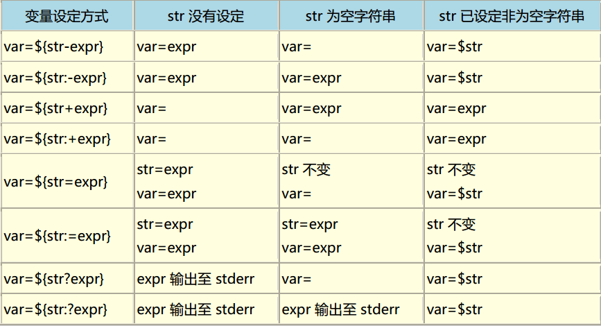

##	模式匹配

-	模式匹配基本规则
	-	普通字符匹配自身
	-	特殊字符用 `\` 转义匹配其字面值，此时需用引号扩起

###	特殊匹配字符

-	`*`：匹配任意数量任意字符（包括零个字符、空字符）
	-	用于文件名扩展时，若 Bash `globstar` 选项打开
		-	`**` 匹配零层或多层子目录、所有文件
		-	`**/` 匹配零层或多层子目录、当前文件夹下文件

-	`?`：匹配任意单个字符（不包括空字符）
	-	可连用表示匹配多个字符

-	`[...]`：匹配括号中候选字符
	-	`[<start>-<end>]`：匹配连续的范围内字符
		-	允许字母范围、数字范围：`[a-c]`、`[0-9]`、`[a-c0-4]`
		-	字符排序由 `LC_COLLATE`、`LC_ALL` 决定
	-	`[^...]`、`[!...]`：匹配不在候选字符中的字符
	-	`[[:<class>::]]`：表示字符类，扩展为某类字符中一个
		-	`[[:alnum:]]`：任意英文字母、数字
		-	`[[:alpha:]]`：任意英文字母
		-	`[[:lower:]]`：小写英文字母
		-	`[[:upper:]]`：小写英文字母
		-	`[[:digit:]]`：`0-9` 间任意数字
		-	`[[:xdigit:]]`：16 进制字符
		-	`[[:graph:]]`：`A-Z`、`a-z`、`0-9`、标点
		-	`[[:punct:]]`：标点符号
		-	`[[:blank]]`：空格、*Tab*
		-	`[[:space:]]`：空格、*Tab*、*LF*、*VT*、*FF*、*CR*
		-	`[[:cntrl:]]`：*ASCII* 码中不可打印字符
		-	`[[:print:]]`：*ASCII* 码中 `32-127` 可打印字符
	-	候选字符特例
		-	`[`：可直接放在方括号内
		-	`-`：只能放在方括号内部的开头、结尾

-	量词语法：需要 Bash `extglob` 选项打开
	-	`?(<ptn>[|<ptn>])`：匹配 0 个、1 个 `ptn`
	-	`*(<ptn>[|<ptn>])`：匹配 0 个、多个 `ptn`
	-	`+(<ptn>[|<ptn>])`：匹配 1 个、多个 `ptn`
	-	`@(<ptn>[|<ptn>])`：匹配 1 个 `ptn`
	-	`!(<ptn>[|<ptn>])`：匹配 `ptn` 外内容

##	Shell 扩展

-	扩展由 Bash 负责
	-	模式扩展可认为是原始正则，简单但不够灵活
	-	Bash 先进行扩展，再执行命令，扩展结果与待执行命令无关
	-	Bash 允许通过 `$ set -o noglob` 关闭模式扩展功能

-	各扩展执行优先级
	-	花括号扩展
	-	*Tilde* 扩展
	-	Shell 参数、变量扩展
	-	算术扩展
	-	命令扩展（替换）
	-	分词
	-	文件名扩展
	-	进程扩展（替换）：在花括号扩展执行后，与上述 5 类扩展同时执行
	-	标记移除：所有未被括起的、不由 Shell 扩展产生的 `\`、`"`、`'` 字面值被移除

-	扩展执行场合
	-	`"` 括起的字符串中，只有 Shell 参数扩展、命令替换、算术扩展会被执行
	-	分词（扩展）不对字符串字面值应用

> - <https://runebook.dev/zh-CN/docs/bash/shell-expansions>
> - <https://wangdoc.com/bash/expansion.html>

###	`~` *Tilde* 扩展

-	`~` 波浪线：自动扩展为用户主目录
	-	`~<user-name>`：扩展为指定用户的主目录
		-	用户不存在则原样返回

-	`~+`：一般的扩展为 `$PWD`
	-	`~+<N>`：`N` 为数字时，扩展为目录堆栈栈顶开始第 `N` 号目录

-	`~-`：扩展为 `$OLDPWD`
	-	`~-<N>`：`N` 为数字时，扩展为目录堆栈栈底开始第 `N` 号目录

###	文件名扩展 （*Globbing*）

> - 文件名扩展一般要求参数不被引号括起

-	文件名扩展：需 Shell `noglob` 选项未被设置
	-	分词后，若词未被括起，Bash 扫描单词查找特殊匹配字符
	-	按照模式匹配规则将其替换为按字典序排序的文件名列表

-	相关 Bash 设置
	-	`nullglob`：不存在匹配文件则单词被移除，否则保持单词不变
	-	`nocaseglob`：匹配时不考虑大小写
	-	`dotglob`：`.` 开头文件（隐藏文件）无需用 `.*` 显式指定
		-	.`、`..` 仍需手动手动指定

-	`$GLOBIGNORE`：文件名扩展结果中匹配其中模式的将被移除
	-	`nocaseglob` 被设置时，匹配时不考虑大小写
	-	`GLOBINGNORE` 有非空值时
		-	`.`、`..` 总是被忽略
		-	需要将 `.*` 添加至其中，否则相当于 `dotglob` 被设置

###	`{}` 花括号扩展

-	`{...}`：代表分别扩展为大括号中的所有值（与剩余部分组合）
	-	格式说明
		-	各值间用 `,` 分隔，`,` 前后不能有空格，否则扩展失效，被认为是空格分隔的参数
		-	`,` 前可置空，表示扩展项为空
		-	`,`、`{` 可用 `\` 转义视为普通字符
	-	注意事项
		-	`{}` 可以嵌套
		-	`{}` 可以和其他模式扩展联用，且总是先行扩展

-	`{<start>..<end>..<step>}`：扩展为连续序列
	-	包含首尾字符
	-	支持逆序：`{c..a}`
	-	若连续序列无法识别，则扩展失效并原样返回

###	`$` 参数扩展

-	`${<param>}`：参数扩展的基本形式
	-	`param`：参数、数组引用
	-	`{}` 可选，但以下情况必须
		-	`param` 为多位数字的位置参数
		-	后跟不应被解释为名称的字符时

-	`${!<param>}`：首个字符是 `!` 且 `param` 不是 *nameref*，将引入一层间接扩展
	-	先将 `${param}` 扩展为其值，然后将其值作为参数再次扩展
	-	`${param}` 值可进行 *Tilde* 扩展、参数扩展、命令替换、算术扩展
	-	若 `param` 是 *nameref*，将扩展为 `param` 指向的变量名

	> - `$$<var-name>` 无法起到相同效果（`$$` 被解释为 Shell PID）

> - <https://runebook.dev/en/docs/bash/shell-parameter-expansion>

####	变量名扩展

-	`${!<prefix>*}`、`${!<prefix>@}`：扩展为以 `prefix` 开头的 **变量名**
	-	变量名之间以 `IFS` 首个字符分隔
	-	`${!<prefix>@}` 即使被 `"` 括起也会被分词，结果为各单词分别为括起

-	`${!<arr>[*]}`、`${!<arr>[@]}`：扩展为数组的已设置的键列表
	-	`arr` 非数组时
		-	`arr` 已声明：返回 0
		-	`arr` 未声明：返回空
	-	`${!<arr>[@]}` 即使被 `"` 括起也会被分词，结果为各单词分别为括起

####	子序列

-	`${<param>:<offset>[:<len>]}`：子序列扩展，从第 `offset`（包括）开始 `len` 个元素
	-	`param` 为 `<arr>[@]`、`<arr>[*]` 时，按元素抽取
	-	`param` 为字符串时，按字符抽取（即使其中包含 `$IFS`）
	-	特别的，`param`  为 `@` 时，表示抽取位置参数

-	抽取规则
	-	下标 `offset`：支持算术表达式
		-	起始一般的为 0，除非 `param` 为 `@`
		-	可用 `0-<len>`/` -<len>` 表示负起始（避免和默认值语法冲突）
	-	长度 `len`：支持算术表达式
		-	可为负值，但不能超过 `offset`（子序列长度小于 0 报错）

-	考虑 `file=/dir1/dir2/dir3/file.txt.bak`

	|命令|解释|结果|
	|------|------|------|
	|`${file:0:5}`|提取首个字符开始的5个字符|`/dir1`|
	|`${file:5:5}`|提取第5个字符开始的5个字符|`/dir2`|
	|`${file:5}`|提取第5个字符开始至末尾|`/dir2...`|
	|`${file:0-5}`|反向计算下标|`t.bak`|
	|`${file: -5:0-1}`|反向计算下标|`t.ba`|
	|`${file:5:0-2}`|提取第5个字符开始至`-2`下标处|`/dir2.../t.b`|

####	序列长度

-	`${#<param>}`：扩展为序列长度
	-	`param` 为字符串时，扩展为字符串长度
	-	`param` 为 `<arr>[@]`、`<arr>[*]` 时，扩建为数组 `arr` 长度
	-	特别的，`param` 为 `@`、`*` 时，扩展为位置参数数量

####	默认值

```shell
$ file=/dir1/dir2/dir3/file.txt.bak
$ null=
```

-	默认值设置
	-	`-`：变量未声明则返回默认值，否则返回其值
	-	`+`：变量已声明则返回默认值，否则返回其值（即空字符串）
	-	`=`：变量未声明则返回默认值、并设置变量值为默认值，否则仅返回其值
	-	`?`：变量未声明将默认值输出至 `stderr`，中断脚本执行
		-	缺省将输出 `parameter null or not set`
	-	`:`：以上命令中空值被视为未声明

	

	|命令|解释|示例|结果|
	|-----|-----|-----|-----|
	|`${<var-name>-<default>}`|变量**未设置**返回默认值|`${invalid-file.txt.bak}`|`file.txt.bak`|
	|`${<var-name>:-<default>}`|变量**未设置、空值**返回默认值|`${null-file.txt.bak}`|`file.txt.bak`|
	|`${<var-name>+<default>}`|变量**设置**返回默认值|`${file-file.txt.bak}`|`fil.txt.bak`|
	|`${<var-name>:+<default>}`|变量**非空**返回默认值|`${file-file.txt.bak}`|`file.txt.bak`|
	|`${<var-name>=<default>}`|变量**未设置**，返回默认值、并设置变量为默认值|`${invalid=file.txt.bak}`|`file.txt.bak`|
	|`${<var-name>:=<default>}`|变量**未设置、空值**返回默认值、并设置变量为默认值|`${null=file.txt.bak}`|`file.txt.bak`|
	|`{$<var-name>?<default>}`|变量**未设置**输出默认值至 `stderr`|`{invalid?file.txt.bak}`|`file.txt.bak`输出至stderr|
	|`{$<var-name>:?<default>}`|变量**未设置、空值**输出默认值至 `stderr`|`{$null:?file.txt.bak}`|`file.txt.bak`输出至stderr|

####	模式匹配

-	模式匹配剔除：`${<param>%<ptn>}`
	-	匹配剔除模式
		-	`#`：从左侧开始最短剔除 `ptn`
		-	`##`：从左侧开始最长（贪婪）剔除 `ptn`
		-	`%`：从右侧开始最短剔除 `ptn`
		-	`%%`：从右侧开始最长（贪婪）剔除 `ptn`
	-	`param` 为 `<arr>[@]`、`<arr>[*]` 时，依次对数组各元素匹配剔除
		-	特别的 `param` 为 `@`、`*` 时，对位置参数匹配剔除
	-	说明
		-	不改变原变量值
		-	仅在 `ptn` 中包含（模式扩展）通配符时，最短、最长匹配才有区别

	|命令|解释|结果|
	|------|------|------|
	|`${file#*/}`|去除首个`/`及其左边|`dir2/dir3/file.txt.bak`|
	|`${file##*/}`|仅保留最后`/`右边|`file.txt.bak`|
	|`${file#*.}`|去除首个`.`及其左边|`txt.bak`|
	|`${file##*.}`|仅保留最后`.`右边|`bak`|
	|`${file%/*}`|去除最后`/`及其右边|`/dir1/dir2/dir3`|
	|`${file%%*/}`|去除首个`/`及其右边|空值|
	|`${file%*.}`|去除最后`.`及其右边|`/dir1/dir2/dir3/file.txt`|
	|`${file%%*.}`|去除首个`.`及其右边|`/dir1/dir2/dir3/file.txt`|

-	模式匹配替换：`${<param>/<from-ptn>/<to-ptn>}`
	-	匹配替换模式（`to-ptn` 为空时即删除）
		-	`/<from-ptn>/<to-ptn>`：替换首个 `from-ptn` 为 `to-ptn`
		-	`//<from-ptn>/<to-ptn>`：替换全部 `from-ptn` 为 `to-ptn`
		-	`/#<from-ptn>/<to-ptn>`：`from-ptn` 必须在开头
		-	`/%<from-ptn>/<to-ptn>`：`from-ptn` 必须在结尾
	-	`param` 为 `<arr>[@]`、`<arr>[*]` 时，依次对数组各元素匹配替换
		-	特别的 `param` 为 `@`、`*` 时，对位置参数匹配替换

	|命令|解释|结果|
	|-----|-----|-----|
	|`${file/dir/path}`|替换首个`dir`为`path`|`/path1/dir2/dir3/file.txt.bak`|
	|`${file/dir/path}`|替换全部`dir`为`path`|`/path1/path2/path3/file.txt.bak`|

-	模式匹配大小写转换：`${<param>^<char>}`
	-	大小写转换模式
		-	`^<char>`：首个 `char` 被转换为大写
		-	`^^<char>`：全部 `char` 被转换为大写 
		-	`,<char>`：首个 `char` 被转换为小写
		-	`,,<char>`：全部 `char` 被转换为小写 
	-	`char` 缺省即为 `?`，匹配所有字符
	-	`param` 为 `<arr>[@]`、`<arr>[*]` 时，依次对数组各元素匹配转换
		-	特别的 `param` 为 `@`、`*` 时，对位置参数匹配转换

####	操作符扩展

-	`${<param>@<op>}`：根据 `op`（单字符）执行不同的替换
	-	各字符含义
		-	`U`：转换为大写
		-	`L`：转换为小写
		-	`u`：首字母转换为大写
		-	`Q`：扩展为可作为输入的、引号括起的字符串
		-	`E`：扩展为有 `\` 转义的参数值，类似 `$'...'`
		-	`P`：将参数值视为 *提示符控制序列* 进行扩展
		-	`A`：扩展为参数的声明语句、或 `declare` 命令字符串，并且参数被重新创建
		-	`K`：
		-	`a`：扩展为参数属性
	-	`param` 为 `<arr>[@]`、`<arr>[*]` 时，依次对数组各元素扩展
		-	特别的 `param` 为 `@`、`*` 时，对位置参数扩展

###	`$` 命令扩展（替换）

-	`$(<cmd>)`、<code>`<cmd>`</code>：使用命令的标准输出替换命令本身
	-	Bash 在子 Shell 环境中执行 `cmd` 并将命令替换为命令的标准输出
		-	删除尾随换行符
		-	若输出结果没有被 `"` 括起，则扩展结果会被分词，其中嵌入换行符会被删除
	-	命令扩展可以嵌套

-	格式说明
	-	`$(<cmd>)` 中 `cmd` 所有字符组成命令
	-	<code>`<cmd>`</code> 为旧式命令扩展格式
		-	`cmd` 中 `\` 保留字面值，仅用于转义
			-	`$`：保留字面值
			-	<code>`</code>：命令扩展嵌套

> - 可以理解命令的执行结果都存储在一个匿名变量中，可以在其之前加上`$`获取其结果

###	`$(())` 算术扩展

-	`$(( <expr> ))`：扩展为算术表达式 `expr` 结果
	-	`expr` 被当作 `"` 内表达式处理
	-	算术扩展可嵌套
	-	表达式参数扩展、命令替换、引号删除，结果再被计算
		-	算术扩展中参数扩展的 `$` 可被省略
	-	多个表达式时返回最后表达式结果

###	`<()` 进程扩展（替换）

-	`<(<cmd>)`、`>(<cmd>)`：扩展为引用进程 `cmd` 输入、输出的文件名
	-	`<(<cmd>)`：视为临时文件，其内容为 `cmd` 的标准输出
	-	`>(<cmd>)`：视为临时文件，其内容将为作为 `cmd` 的标准输入
	-	进程替换支持嵌套

	```sh
	$ cat <(ls)
	$ ls > >(cat)
	```

-	格式说明
	-	`<`、`>` 与扩展之间不能出现空格，否则将被解释为重定向

> - 此扩展要求系统支持 `FIFO`、或具名文件 `/dev/fd` 方法

###	`$IFS` 分词

-	分词：Bash 将 `$IFS` 中每个字符视为定界符，并将其作为字段终止符拆分为单词
	-	对未被 `"` 括起的如下扩展结果完成后应用
		-	参数扩展
		-	命令替换
		-	算术扩展
	-	字符串字面值不会被执行分词
		-	不能通过自定义 `$IFS` 得到字面值分词结果
		-	`for` 迭代、数组定义语法中，空格是字面值创建列表的唯一方法
	-	扩展之后未被引号括起的空字符串将被移除
		-	另，被括起的空字符串作为其它字符串一部分（即与其他非空字符串邻接）时，同样被移除（如：`-d""` 中 `""` 将被移除）

-	`IFS` *Internal Field Separator*：内部字段分隔符，作为分词扩展定界符
	-	`$IFS` 缺省为 ` \t\n`（*IFS空白符*）
	-	任何不在开头、结尾的 `$IFS` 字符序列用于分隔单词
		-	`$IFS` 置为空时，不分词
	-	`$IFS` 中包含任何 *IFS空白字符*
		-	扩展结果开头、结尾处 ` \t\n` 序列被忽略
		-	连续的 *IFS空白符* 序列被压缩视为至多一个定界符

> - <https://runebook.dev/en/docs/bash/word-splitting>
> - <https://zhuanlan.zhihu.com/p/36513249>

