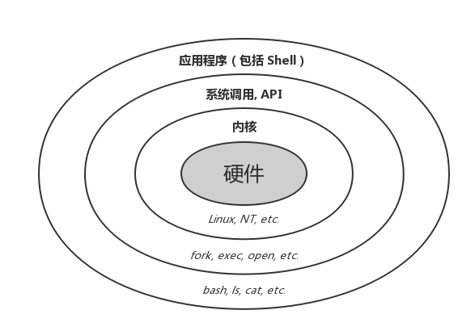

##	*Terminal*

-	*Termianl* 终端：计算机领域的终端是指用于 **与计算机进行交互的输入输出设备**，本身不提供运算处理功能
	-	大部分情况下，终端将用户的字符以外键盘输入转为控制序列
	-	但接收到 `<C-C>` 等特殊组合键时，发送特殊信号

-	*Console* 控制台：和计算机一体的特殊终端，用于管理主机，比普通终端权限更高
	-	一台主机一般只有一个控制台，但可以连接多个普通终端
	-	Console、Terminal随着PC普及已经基本时同义词

###	*TTY*

-	*TTY*：原含义即为直电传打字机 *TeletypePrinter*、*TeletypeWriter*：键盘输入指令、纸带打印信号
	-	*UNIX* 为支持电传打字机设计了名为 *tty* 的子系统
	-	之后 *tty* 名称被保留成为终端的统称（虽然终端设备不局限于 *tty*）

-	类 *UNIX* 系统中
	-	具体终端硬件设备抽象为操作系统内部 `/dev/tty*` 设备文件
	-	`/dev/tty[1-6]` 即对应 6 个虚拟控制台

-	另外，早期计算机上 *Serial Port* 最大用途就是连接终端设备
	-	所以会把行端口上设备同样抽象为 *tty* 设备
	-	`/dev/ttyS*` 对应串口设备

> - [Linux TTY/PTS概述](https://segmentfault.com/a/1190000009082089)
> - *Linux* 系统中，`<C-A—[F1-F6]>` 可以切换终端
> -	可通过 `$ stty -a` 查看当前终端设置

###	分类

-	*Character/Text Terminal*：字符终端，只能接受、显示文本信息的终端
	-	*Dumb Terminal*：哑终端
	-	*Intelligent Terminal*：智能终端，相较于哑终端
		-	理解转义序列
		-	定位光标、显示位置

-	*Graphical Terminal*：图形终端，可以显示图形、图像
	-	现在专门图形终端已经少见，基本被 **全功能显示器** 取代

###	*Terminal Emulator*

终端模拟器：默认传统终端行为的程序，用于与传统的、不兼容图形接口命令行程序（如：*GNU* 工具集）交互

-	对 *CLI* 程序，终端模拟器假装为传统终端设备
-	对现代图形接口，终端模拟器假装为 *GUI* 程序
	-	捕获键盘输入
	-	将输入发送给 *CLI* 程序（*bash*）
	-	得到命令行程序输出结果
	-	调用图形接口（如：*X11*），将输出结果渲染至显示器

> - *tty[1-6]* 也是终端模拟器，只是不运行在图形界面中、由内核直接提供，也称虚拟控制台

###	*Shell* 和 *Terminal*

-	*Shell* 更多指提供和内核交互入口的软件，提供
	-	命令提示符 *Prompt*
	-	行编辑、输入历史、自动补全（但是也有些终端自己实现
		此功能）

-	*Terminal* 更多指 *IO* 端口硬件，提供
	-	上、下翻页查看内容
	-	终端中复制、粘贴功能

##	*Shell*

*Shell*：提供 **用户界面** 的程序，接受用户输入命令和内核沟通

-	*Shell* 向用户提供操作系统入口
	-	避免普通用户随意操作导致系统崩溃
	-	虽然Shell会调用其他应用程序，其他应用程序再调用系统调用，而不是直接与内核交互

-	*Command-Line Interface*：命令行 *Shell*，通常不支持鼠标，通过键盘输入指令
	-	*sh*：*Bourne Shell*
	-	*bash*：*Bourne-Again Shell*
	-	*zhs*：*Z Shell*
	-	*fish*：*Friendly Interactive Shell*
	-	*cmd.exe*：这个应该看作是 *Shell*，而不是 *Terminal*
		-	可与内核进行交互
		-	接受键盘输入是其宿主的功能（即宿主作为隐式 *Terminal Emulator*）
	-	*PowerShell*

-	*GUI*：*Graphic User Interface* 图形 *Shell*
	-	*Windows* 下的 *explorer.exe*

