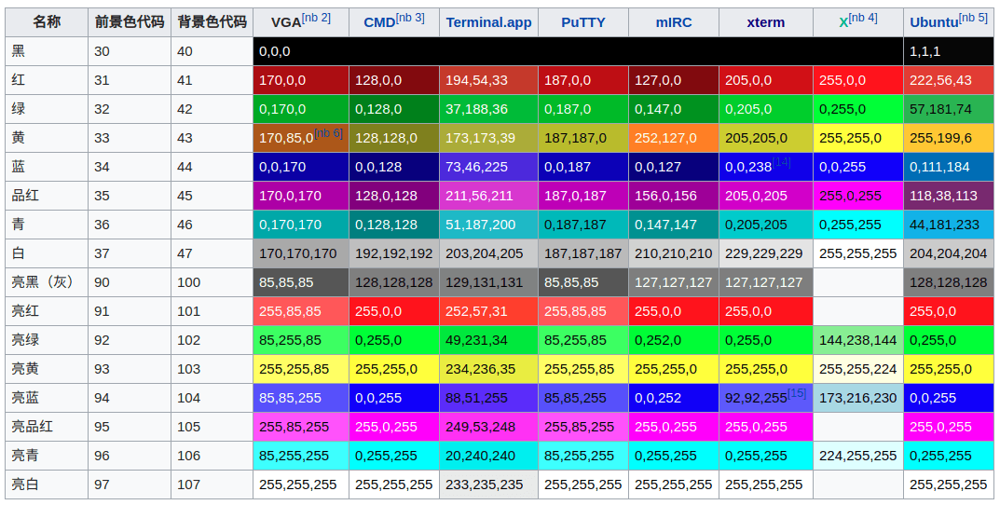
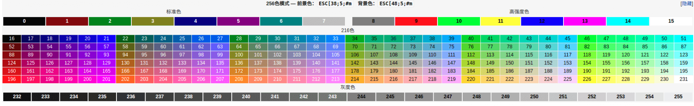

##	*Terminal*

终端：计算机领域的终端是指用于**与计算机进行交互的输入输出
设备**，本身不提供运算处理功能

-	大部分情况下终端将用户的字符以外键盘输入转为控制序列，
	但是终端接受到`<C-C>`等特殊组合键时，发送特殊信号

> -	可通过`$ stty -a`查看当前终端设置

###	早期终端

连接到计算上的带输入、输出功能的外设

-	普通终端：终端机（实体），如：
	-	电传打字机：键盘输入指令、纸带打印信号

-	*Console*：控制台，和计算机一体的特殊终端，用于管理主机，
	比普通终端权限更高
	-	一台主机一般只有一个控制台，但可以连接多个普通终端
	-	Console、Terminal随着PC普及已经基本时同义词

####	*TTY*

*TTY*：*teletype*电传打字机

-	UNIX为支持电传打字机设计了**名为tty的子系统**，后面tty
	名称被保留成为终端的统称（虽然终端设备不局限于tty）

-	具体终端硬件设备抽象为操作系统内部`/dev/tty*`设备文件
	-	`/dev/tty1..6`即对应6个虚拟控制台

-	早计算机上*Serial Port*最大用途就是连接终端设备，所以
	Unix会把**串行端口上设备同样抽象为tty设备**
	-	`/dev/ttyS*`对应串口设备

> - [Linux TTY/PTS概述](https://segmentfault.com/a/1190000009082089)

###	分类

-	*Character/Text Terminal*：字符终端，只能接受、显示文本
	信息的终端
	-	*Dumb Terminal*：哑终端
	-	*Intelligent Terminal*：智能终端，相较于哑终端
		-	理解转义序列
		-	定位光标、显示位置

-	*Graphical Terminal*：图形终端，可以显示图形、图像
	-	现在专门图形终端已经少见，基本被**全功能显示器**取代

###	Terminal Emulator

终端模拟器：默认传统终端行为的程序，用于与传统的、不兼容图形
接口命令行程序（如：GNU工具集）交互

-	对CLI程序，终端模拟器假装为传统终端设备

-	对现代图形接口，终端模拟器假装为GUI程序

	-	捕获键盘输入
	-	将输入发送给CLI程序（bash）
	-	得到命令行程序输出结果
	-	调用图形接口（如：X11），将输出结果渲染至显示器

> - Linux系统中，`<C-A—F1..6>`组合键切换出的的全屏终端界面
	也是终端模拟器，只是不运行在图形界面中、由内核直接提供，
	也称虚拟控制台

###	Shell和Terminal

-	Shell更多指提供和内核交互入口的软件，提供
	-	命令提示符Prompt
	-	行编辑、输入历史、自动补全（但是也有些终端自己实现
		此功能）

-	Terminal更多指IO端口硬件，提供
	-	上、下翻页查看内容
	-	终端中复制、粘贴功能

##	ANSI转义序列

ANSI转义序列：*In-band singaling escaping squence*标准，用于
控制终端上光标位置、颜色及其他选项

-	ANSI使用ASCII中字符传递所有信息
	-	所有转义序列都以`ESC`字符开头
		-	8进制OCT：`\033`
		-	16进制HEX：`\x1b`

-	文本中嵌入的ANSI转义序列会被终端解释为相应指令而不是普通
	字符

> - `C0`控制字符输出有时也会产生与ANSI转义序列相近效果，如：
	`LF \n(\x0a)`字符和`ESC E \x1bE`都有换行效果
> - 以下仅列举部分常用ANSI转义序列，详见
	<https://www.gnu.org/software/screen/manual/html_node/Control-Sequences.html>

###	No-CSI

|指令原语|效果|
|-----|-----|
|`c`|类似`clear`命令|
|`D`|仅换行，不重置光标至行首|
|`E`|换行并充值光标至行首，类似`LF`|
|`H`|制表，类似`TAB`|
|`M`|翻转换行，回到上一行|
|`[`|等价于`C1`控制字符中`CSI`，某些终端中也可以使用`\x9d`|
|`%G`|选择UTF8作为字符集|
|`#8`|DEC屏幕校准测试，使用`E`填充整个终端|

###	Control Sequence Introducer

控制序列导入器：`ESC[` + 若干参数字节 + 若干中间字节 + 一个最终字节

|组成部分|字符范围|ASCII字符|
|-----|-----|-----|
|参数字节|`0x30~0x3F`|`0-9:;<=>?`|
|中间字节|`0x20~0x2F`|` 、!"#$%&'()*+,-./`|
|最终字节|`0x40~0x7E`|`@A-Z[]^_a-z{}~`, \`|

####	光标移动

|序列内容|名称|效果|
|`[n]A`/`[n]B`/`[n]C`/`[n]D`|Cursor Up/Down/Forward/Back|光标移动`[n]`格，在屏幕边缘则无效|
|`[n]E`/`[n]F`|Cursor Next Line/Previous Line|光标移动至下`[n]`行/上`[n]`行开头|
|`[n]G`|Cursor Horizontal Absolute|光标移动到第`[n]`列|

####	SGR参数`m`

-	`\x1b<PARAM>m`中多组参数字符用`;`分割

#####	样式

|设置值|显示效果|取消值|
|-----|-----|-----|
|0|所有属性值重置为默认值，用于取消对后续输出影响||
|1|高亮|22|
|2|半亮|22|
|4|下划线|24|
|5|闪烁|25|
|7|反显，前景、背景色交换|27|
|8|隐藏，前景、背景色相同，可能不支持|28|
|9|删除线|29|
|53|上划线|55|

#####	3/4位色

|前景色值|背景色值|颜色|高亮前景色值|高亮背景色值|
|-----|-----|-----|-----|-----|-----|
|30|40|黑色|90|100|
|31|41|红色|91|101|
|32|42|绿色|92|102|
|33|43|黄色|93|103|
|34|44|蓝色|94|104|
|35|45|紫红色|95|105|
|36|46|青蓝色|96|106|
|37|47|白色|97|107|
|38|48|控制使用256位、RGB色|||

#####	256位色

-	`\x1b[38;5;37m`：设置256位前景色
-	`\x1b[48;5;37m`：设置256位背景色

#####	24位色（RGB色）

-	`\x1b[38;2;<r>;<g>;<b>m`：选择RGB前景色
-	`\x1b[48;2;<r>;<g>;<b>m`：选择RGB辈景色

> - 支持`libvte`的终端上支持，如*Xterm*、*Konsole*

##	*Shell*

Shell：提供**用户界面**的程序，接受用户输入命令和内核沟通

-	Shell向用户提供操作系统入口
	-	避免普通用户随意操作导致系统崩溃
	-	虽然Shell会调用其他应用程序，其他应用程序再调用系统
		调用，而不是直接与内核交互

-	*CLI*：*Command-Line Interface*命令行Shell：通常不支持
	鼠标，通过键盘输入指令

	-	*sh*：*Bourne Shell*
	-	*bash*：*Bourne-Again Shell*
	-	*zhs*：*Z Shell*
	-	*fish*：*Friendly Interactive Shell*
	-	*cmd.exe*：这个应该看作是Shell，而不是terminal，考虑
		其和内核进行交互，其可以接受键盘输入应该是其宿主的
		功能（即宿主作为隐式terminal emulator）
	-	*PowerShell*

-	*GUI*：*Graphic User Interface*图形Shell
	-	Windows下的*explorer.exe*

