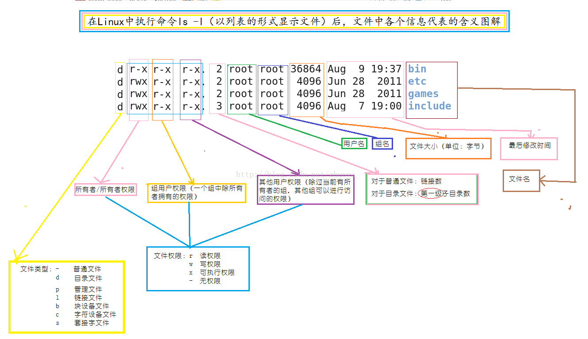

##	文件系统状态

###	`du`、`df`

> - <https://www.junmajinlong.com/linux/du_df>

##	目录、文件操作

###	`pwd`

`pwd`：显示当前工作目录绝对路径

###	`cd`

`cd`：更改工作目录路径

-	缺省回到用户目录
-	`-`：回到上个目录

###	`ls`

```shell
$ ls [params] expr
```

列出当前工作目录目录、文件信息

####	参数

-	`-a`：列出所有文件，包括隐藏文件
-	`-l`：文件详细信息
	-	详细信息格式、含义参见`config_file`
-	`-t`：按最后修改时间排序
-	`-S`：按文件大小排序
-	`-r`：反向排序
-	`-h`：显示文件大小时增加可读性
-	`-F`：添加描述符到条目后
	-	`@`：符号链接
	-	`*`：文件
	-	`/`：目录
-	`-i`：显示索引节点

####	输出结果



-	文件权限：包括10个字符

	-	第1字符：文件类型
		-	`-`；普通文件
		-	`d`：目录
		-	`l`：link，符号链接
		-	`s`：socket
		-	`b`：block，块设备
		-	`c`：charactor，字符设备（流）
		-	`p`：FIFO Pipe
	-	第2-4字符：owner，文件属主权限
	-	第5-7字符：group，同组用户权限
	-	第8-10字符：other，其他用户权限
		-	权限分别为`r`读、`w`写、`x`执行
		-	相应位置为`-`表示没有此权限
	-	执行位还可能是其他特殊字符
		-	user`s`：文件set-user-id、执行权限同时被置位
		-	group`s`：文件set-group-id、执行权限同时被置位
		-	user`S`：文件set-user-id被置位，执行权限未置位
		-	group`S`：文件set-group-id被置位，执行权限未置位
		-	other`t`：文件sticky bit、执行权限均被置位
		-	other`T`：文件sticky bit被置位、执行权限未置位

	> - 关于权限具体含义，参见`linux/kernel/file_system`
	> - 权限设置，参见`linux/shell/cmd_fds`

-	文件数量

	-	一般文件：硬链接数目
	-	目录：目录中第一级子目录个数

-	文件属主名

-	文件属主默认用户组名

-	文件大小（Byte）

-	最后修改时间

-	文件名

###	`dirs`

显示目录列表

###	`touch`

创建空文件或更改文件时间

###	`mkdir`

创建目录

###	`rmdir`

删除空目录

###	`cp`

复制文件和目录

###	`mv`

移动、重命名文件、目录

###	`rm`

删除文件、目录

> - 删除目录link时，注意末尾不要带`/`，否则被认为是目录，
	此时`rm -r <target>`会删除源目录中文件

###	`file`

查询文件的文件类型

###	`du`

显示目录、文件磁盘占用量（文件系统数据库情况）

####	参数

-	`-a`/`--all`：显示**所有后代**各文件、文件夹大小
	-	否则默认为显示**所有后代**文件夹大小
-	`-c`/`--total`：额外显示总和
-	`-s`/`--summarize`：仅显示总和
-	`--max-depth=[num]`：显示文件夹的深度
-	`-S`/`--separate-dirs`：文件夹大小不包括子文件夹大小

-	`-b`/`--bytes`：以byte为单位
-	`-k`/`--kilobytes`：以KB为单位
-	`-m`/`--megabytes`：以MB为单位
-	`-h`：human-readable，提升可读性
-	`-H`/`--si`：同`-h`，但是单位换算以1000为进制

-	`-x`/`--one-file-system`：以最初处理的文件系统为准，忽略
	其他遇到的文件系统
-	`-L=`/`--dereference=`：显示选项中指定的符号链接的源文件
	大小
-	`-D`/`--dereference-args`：显示指定符号链接的源文件大小
-	`-X=`/`--exclude-from=[file]`：从文件中读取指定的目录、
	文件
-	`--exclude=[dir/file]`：掠过指定目录、文件
-	`-l`/`--count-links`：重复计算hard-link

###	`wc`

统计文件行数、单词数、字节数、字符数

	-	`-l, -w, -c`
###	`tree`

树状图逐级列出目录内容

###	`cksum`

显示文件CRC校验值、字节统计

###	`mk5sum`

显示、检查MD5（128bit）校验和

###	`sum`

为文件输出校验和及块计数

###	`dirname`

输出给出参数字符串中的目录名（不包括尾部`/`）
，如果参数中不带`/`输出`.`表示当前目录

###	`basename`

输出给出参数字符串中的文件、**目录**名

###	`ln`

创建链接文件

###	`stat`

显示文件、文件系统状态

##	文件、目录权限、属性

###	`chown`

更改文件、目录的用户所有者、组群所有者

###	`chgrp`

更改文件、目录所属组

###	`umask`

显示、设置文件、目录创建默认权限掩码

###	`getfacl`

显示文件、目录ACL

###	`setfacl`

设置文件、目录ACL

###	`chacl`

更改文件、目录ACL

###	`lsattr`

查看文件、目录属性

###	`chattr`

更改文件、目录属性

###	`umask`

查看/设置权限掩码，默认`0000`

```shell
$ umask
	# 数字形式返回当前权限掩码
$ umask -S
	# 符号形式返回当前权限掩码
$ umask 0003
	# 设置权限掩码为`0003`
```

> - 权限掩码参见*linux/kernel/permissions*

###	`chmod`

关于文件、目录权限参见`config_files###文件描述`

-	普通用户只能修改user权限位
-	root用户可以修改任意用户、任意文件权限

####	参数

-	`-R`：对整个目录、子文件（目录）同时修改权限

####	操作

```shell
$ chmod [ugoa][+-=][rwxst] file
$ chmod xxxx file
```

-	`ugoa`：分别表示user、group、other、all权限位
-	`+-=`：表示增加、减少、设置权限
-	`rwxst`：表示5不同的权限
	-	`S`、`T`不是一种权限，只是一种特殊的状态
	-	设置状态时`s`时，是根据相应的`x`是否有确定`s`/`S`
	-	设置状态`t`同理

-	`xxxx`：每个8进制数表示一组权限，对应二进制表示相应权限
	是否置位
	-	第1个数字：set-user-id、set-group-id、sticky bit
	-	后面3个数字分别表示user、group、other权限
	-	第1个数字位0时可以省略（常见）

####	示例

```md
$ chmod u+s file1
$ chmod 7777 file1
```

##	磁盘

###	`df`

文件系统信息

###	`fdisk`

查看系统分区

###	`mkfs`

格式化分区

###	`fsck`

检查修复文件系统

###	`mount`

查看已挂载的文件系统、挂载分区

###	`umount`

卸载指定设备

###	`free`

查看系统内存、虚拟内存占用


