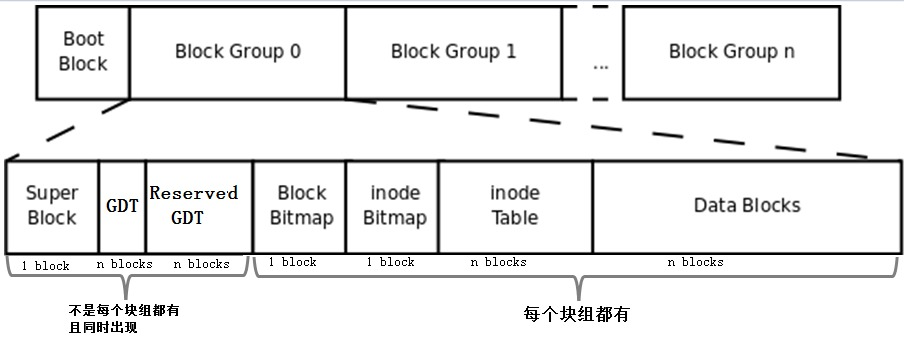
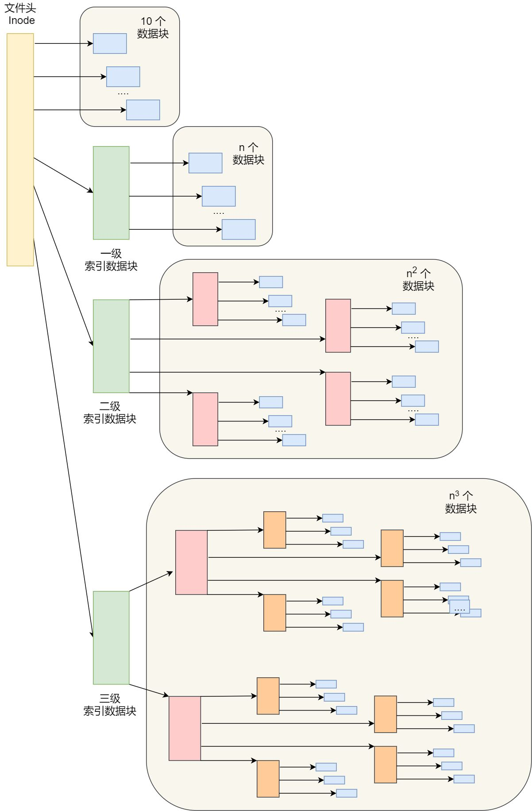
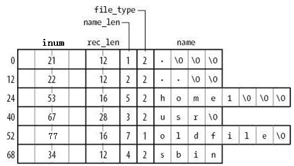
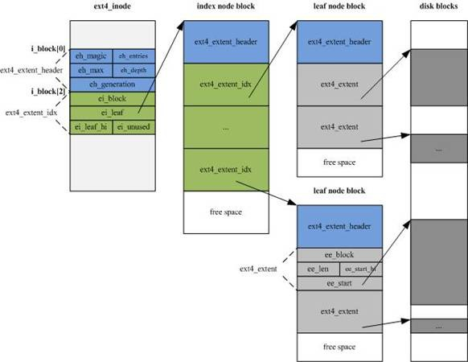

##	*Ext* 文件系统

###	*Ext* 文件系统结构

> - `dumpe2fs` 命令可以获取 *Ext* 类文件系统信息
> - <https://www.junmajinlong.com/linux/ext_filesystem/>

##	*Index Node*

*Index Node*/*Inode* 索引节点：记录文件的元信息

-	文件元信息
	-	文件大小
	-	访问权限
	-	创建时间
	-	修改时间
	-	数据块位置

-	*Inode* 是文件的唯一标识，和文件一一对应
	-	存储在磁盘中，占用磁盘空间，大小为 126B 整数倍
	-	通常会把索引节点加载到内存中，加速文件的访问

> - *Inode* 并未存储 *Inode* 号、文件名，而是存储在文件所在目录的数据块中

###	*Inode* 号

-	*Inode* 号在同一文件系统内部唯一，可以、且被用于确定、定位 *Inode*
	-	创建文件系统时，每个块组中起始 *Inode* 号、*Inode Table* 起始地址确定
		-	*Inode* 号按分配比率（间隔字节数）预分配
		-	若系统中大文件较多，*Inode* 分配比率应较大，避免 *Inode Table* 占用过大空间
	-	根据 *Inode* 号、*Inode* 结构大小计算偏移即可查确定

-	*Ext* 预留部分 *Inode* 作特殊用途
	-	`0`：不存在，用于标识已删除文件
	-	`1`：虚拟文件系统，如：`/proc`、`/sys`
	-	`2`：根目录
	-	`3`：*ACL* 索引
	-	`4`：*ACL* 数据
	-	`5`：*boot loader*
	-	`6`：未删除的目录
	-	`7`：*Reserved GDT*
	-	`8`：日志
	-	`11`：首个非预留 *Inode* 号，通常是 *lost+found* 目录

> - *Inode* 大小默认值在 `/etc/mke2fs.conf` 文件中指定
> - `ls -i` 可查看文件 *Inode* 号
> - `find` 可以使用 `-inum` 参数寻找指定 *Inode* 号文件

####	*Inode* 寻址

> - *Ext2/3* 中 *Inode* 寻址混合直接查找、多级索引

-	*Inode* 中包含 15 个指针 `i_block[0..14]`，分为 4 级
	-	`i_block[0..11]`：直接寻址指针，直接指向数据块
	-	`i_block[12]`：一级间接寻址指针，指向存储指针的块
	-	`i_block[13]`：二级间接寻址指针
	-	`i_block[14]`：三级间接寻址指针

-	根据文件大小选择不同的寻址方法
	-	文件小于 12block 时，直接用直接寻址指针
	-	文件较大时则利用更高级别的间接寻址指针，多级索引
	-	*Ext2/3* 对超大文件存取效率低下，需要核对指针过多

	

###	*Inode* 内容

####	*Hard Link*

-	硬链接：指向 *Inode*（文件） 的 **目录项**
	-	此处文件、硬链接说明
		-	文件：*Inode*、相应数据块
		-	硬链接：**目录文件中目录项**
	-	硬链接是目录项
		-	同一个文件的多个硬链接应是仅文件名不同的目录项
		-	*Ext* 文件系统中 *Inode* 号、文件名均在存储在目录项中即完美支持硬链接

-	硬链接创建、删除
	-	创建硬链接会增加文件的硬链接数
		-	不能跨分区创建硬链接：不同分区 *Inode* 号会重复
		-	不能手动对目录文件创建硬链接：防止路径混乱，文件系统已经为目录创建硬链接
			-	`.`：当前目录硬链接
			-	`..`：上级目录硬链接
		-	目录的硬链接数 = 2 + 一级子目录数
			-	父目录中目录项
			-	自身 `.` 目录项
			-	子目录中 `..` 目录项
	-	删除文件实质上就是删除硬链接，文件的硬链接数量归 0 时才被真正删除

	> - `ls -l` 中第二行即为文件的硬链接数（包含文件自身）

> - `/` 根目录是自引用的（唯一），即 `..` 也指向自身

####	*Symbolic Link*

-	符号链接 / 软链接：通过文件名的链接文件的 **文件**
	-	符号链接是文件
		-	文件内容可认为是指向的目标路径，这也决定温文件大小
		-	符号链接文件本身也可以有多个硬链接、符号链接
	-	一般不占用数据块，*Inode* 记录即可描述完成
		-	只有符号链接指向的目标路径过长（大于 60B）时才会分配数据块
	-	符号链接权限不重要，取决于最终目标文件

> - `readlink` 可以查看符号链接之

####	设备文件、*FIFO*、*Socket*

-	设备文件、*FIFO*、*Socket*
	-	没有大小，不占用数据块，在 *Inode* 记录中即可描述完成
		-	主设备号：标识设备类型
		-	次设备号：标识同种设备类型的不同编号

##	*Block Group*

*Block Group* 块组：逻辑上对块分组，提高查询效率

-	块组划分是文件系统创建的一部分
	-	一个磁盘分区包含多个块组
	-	块组是逻辑层面的划分，不会类似分区在磁盘上标记、划分

-	每个块组包含多个元数据区、数据区
	-	元数据区：存储 *Bmap*、*Inode Table*、*Imap* 等数据
	-	数据区：存储文件数据

-	块组特点
	-	块组大小（包含块数）= 块 *bit* 数，即单个 *block* （作为）*Bmap* 能标记的块数量
		-	此大小包含元数据区（也需要 *Bmap* 标记是否被占用）
	-	块组设置的 *Inode* 数量、*Inode Table* 由系统决定

###	分区级 *Block*

> - 以下这些块不会出现在所有块组中，存储文件系统级别信息

####	*Boot Block*

-	*Boot Block* / *Boot Sector*：存放有 *boot loader* 的块
	-	特点
		-	位于分区的首个块
		-	占用 1024B
		-	只有装有系统的主分区、逻辑分区才有 *Boot Block*
	-	*Boot Block* 在不同分区时称为
		-	主分区装有操作系统时：*Volume Boot Records*
		-	逻辑分区装有操作系统时：*Extended Boot Records*

-	*MBR* 会引导 *VBR*/*EBR*，开机启动时，首先加载 *MBR* 上 *boot loader*
	-	单操作系统时，直接定位到所在分区的 *Boot Block*，加载此处的 *boot loader*
	-	多操作系统时，加载 *MBR* 中 *boot loader* 后列出操作系统菜单，指向各分区的 *boot block*

	

	> - 通过 *MBR* 管理启动菜单方式已经被 *Grub* 取代

####	*Super Block*

-	*Super Block*：存储文件系统信息、属性元数据
	-	存储的信息包括
		-	块组的 *block* 数量、*Inode* 号数量
		-	文件系统本身的空闲 *block* 数量、*Inode* 数量
		-	文件系统本身的属性信息：时间戳、是否正常、自检时间
	-	（首个）超级块的位置取决于块大小
		-	块大小为 1KB 时，引导块正好占用 1 个 *block*，则超级块号为 1
		-	块大小大于 1KB 时，超级块和引导块均位于 0 号块

-	超级块对文件系统至关重要
	-	超级块丢失和损坏必然导致文件系统损坏
	-	*Ext2* 只在 0、1 和 3、5、7 的幂次块组中保存超级块信息
		-	但文件系统只使用首个块组的超级块信息获取文件系统属性，除非损坏或丢失

		> - 有些旧式文件系统将超级块备份至每个块组

> - `df` 命令读取文件系统的超级块，统计速度快

####	*Group Descriptor Table*

-	*GDT* 块组描述符表：存储块组的信息、属性元数据
	-	*Ext* 每个块组使用 32B 描述，被称为块组描述符，所有块组描述符组成 *GBT*
		-	*GDT* 和超级块同时出现在某些块组中
		-	默认也只会读取 0 号块组的中 *GDT*

-	*Reserved GDT*：保留作为 *GDT* 使用的块（扩容之后块组增加）
	-	和 *GDT*、超级块同时出现，同时修改

> - *GDT*、*Reserved GDT*、超级块在某些块组同时出现，能提升维护效率

###	块组级 *Block*

####	*Block Bitmap*

*Block Bitmap*/*Bmap* 块位图：标记各块空闲状态

-	*Bmap* 只优化写效率
	-	向磁盘写数据时才需要寻找空闲块，读数据时按照索引读取即可
	-	*Bamp* 查询速度足够快，则向磁盘写数据效率极大取决于磁盘的随机读写效率

####	*Inode Table*

-	*Inode Table*：物理上将多个 *Inode* 合并存储在块中
	-	*Inode* 大小一般小于块大小，合并存储能节约存储空间

####	*Inode Bitmap*

*Inode Bitmap*/*Imap* 位图：标记各 *Inode* 号占用状态

###	*Data Blocks*

-	*Data Blocks*：直接存储数据的块
	-	数据占用的块由文件对应 *Inode* 记录中块指针找到
	-	不同类型文件在数据块中存储的内容不同
		-	常规文件：存储文件数据
		-	目录：存储目录下文件、一级子目录
		-	符号链接：目标路径名较短则直接存储在 *Inode* 中，否则分配数据块保存

####	目录文件数据块

-	目录文件数据块存储多条目录项，每条目录项包含目录下
	-	文件 *Inode* 号
	-	目录项长度 `rec_len`
	-	文件名长度 `name_len`
	-	文件类型
		-	`0`：未知
		-	`1`：普通文件
		-	`2`：目录
		-	`3`：*character devicev
		-	`4`：*block device*
		-	`5`：命名管道
		-	`6`：*socket*
		-	`7`：符号链接
	-	文件名：文件名、一级子目录名、`.`、`..`

##	*Directory Entry*

*Directory Entry*/*Dentry* 目录项（缓存）：存放内存中的缩略版磁盘文件系统目录树结构

-	*Dentry* 中需要记录
	-	文件名称
	-	*Inode* 指针：与文件名建立映射关系
	-	与其他目录项的层级关联关系
		-	包括：父目录、子目录链表
		-	多个目录项通过指针关联起来就形成目录结构

-	*Dentry* 是由内核维护，缓存在内存中
	-	内核会把读过的文件用 *Dentry* 缓存在内存中，提高文件系统效率

-	*Inode*、*Dentry* 是一对多的关系
	-	即一个文件可以有多个别字
	-	硬链接实现就是多个 *Dentry* 中的 *Inode* 指向同一个文件

##	文件系统挂载

-	*Mount* 挂载：将文件系统关联到路径

-	文件系统必须要挂载在一定路径下才能被使用
	-	文件系统体现在系统中即目录，即其文件系统的入口目录（根目录）
	-	而入口目录无名、无显式 *Inode* 号
		-	*Ext* 中文件名、*Inode* 号存储在父目录中，入口目录是文件系统最底层目录，不存在父目录
		-	入口目录无名，所以挂载在任何目录下都是合理的
		-	入口目录被预留 *Inode* 号为 2，可直接寻址

-	挂载方式
	-	`/` 根目录下挂载根文件系统，在系统启动之初即挂载
	-	其余文件系统则挂载在根文件系统的目录之下

###	挂载逻辑

-	挂载实现逻辑 
	-	新建 *Inode*，将其寻址指针指向待挂载文件系统
	-	将挂载点目录 *Inode* 标记为不可用
	-	修改挂载点目录在其父目录目录项至新建 *Inode*
		-	挂载期间原目录会被遮蔽
		-	挂载点仍然是所在文件系统的文件，但是其数据不在

-	同步挂载信息
	-	挂载完成后，将挂载记录、相关信息写入 `/proc/self/{mounts, mountstats, mountinfo}`
	-	同步 `/proc/self/mounts` 同步至 `/etc/mtab`（若有必要）

##	文件操作

###	文件读取

> - `/` 文件系统在系统启动时即挂载，此时已经读取超级块、*GDT* 等文件系统块

-	同文件系统内 `/` 开头绝对地址
	-	根据 *GDT* 确定各块组 *Inode Table* 块号
	-	在 *Inode Table* 中查找 `/` 目录文件 *Inode*
		-	`/` *Inode* 号已知为预留 *Inode* 号 2，可直接在 *Inode Table* 中定位
	-	获取 `/` 数据块，并读取其中目录项
	-	在目录项中查找目标记录，获取文件 *Inode* 号
	-	如上重复，直到找到目标文件 *Inode*，根据 `i_block` 寻址指针读取数据块

-	相对地址
	-	按照所处目录的目录项获取 *Inode* 号，同绝对地址即可

-	跨文件系统地址
	-	类似同文件系统
	-	但挂载点目录会指向目标文件系统入口目录，再同绝对地址即可

###	文件删除

-	删除普通文件
	-	同读取找到文件 *Inode*、数据块
		-	将文件 *Inode* 硬链接数量减一
		-	若硬链接数量归 0，执行删除，否则不变
	-	将 *Inode* 中寻址指针删除
		-	此时即无法找到文件数据
	-	在 *Imap* 中标记文件 *Inode* 号为未使用
	-	删除文件所属目录的目录项
		-	实务中会将目录项 *Inode* 号标记为 0，避免产生空洞
		-	此时文件即不可见
	-	将 *Bmap* 中文件数据块块号标记为未使用
		-	此时即释放文件占用空间，若此时有其他进程持有数据块的指针，则文件系统不会立即释放该空间
		-	*Ext* 系统中此步骤会导致删除大文件效率低

-	删除目录文件
	-	若目录非空，则尝试递归删除其中文件、子目录
	-	若目录为空，类似普通文件删除目录

###	文件移动、重命名

-	同目录文件重命名：修改文件所属目录的目录项中文件名

-	同文件系统下移动：增、删目录项
	-	文件移动不修改 *Inode*、*Inode* 号等

-	不同文件系统下移动：先复制、再删除

> - 命名冲突时，覆盖会删除冲突文件，并修改相应目录项至新文件
> - 因此，*Ext* 无法用同名子目录覆盖父目录，在尝试删除父目录时即失败

###	文件存储、复制

-	文件存储
	-	读取 *GDT*，寻找空闲块组
	-	根据块组 *Imap* 为文件分配未使用 *Inode* 号
	-	在 *Inode Table* 中完善 *Inode* 中文件元数据
	-	在所属目录中添加目录项
	-	将数据写入数据块
		-	*Ext2/3* 中每次调用 *block* 分配器为数据分配 1 个数据块，直至写入完毕
		-	*Ext4* 中允许一次分配多个数据块
	-	在 *Inode Table* 中更新 *Inode* 寻址指针

-	文件复制同文件存储

##	*Ext2/3/4* 迭代

-	*Ext* 文件系统特点
	-	在创建时即划分好，方便使用时分配
		-	不支持动态划分、分配
		-	格式化超大磁盘时较慢

###	*Ext3* 日志功能

-	*Ext2* 中只有两个区：元数据区、数据区
	-	从数据块中写入数据的中断中恢复检查一致性需要大量时间，甚至失败

-	*Ext3* 增加日志区
	-	在向数据块中写入数据前会在日志区标记
	-	则根据日志区的标记即可判断操作完成情况，提高一致性确认效率

###	*Ext4* 段分配

-	*Ext2/3* 中
	-	*Bmap* 标记、分配块能提高效率，但扫描 *Bmap* 效率仍很低
	-	多级索引寻址效率低

-	*Ext4* 中使用 *extent* 管理数据块
	-	*extent* 尽可能包含物理上连续的块
	-	*Inode* 中使用 4 个 *extent* 片段流替代多级索引指针
		-	每个 *extent* 片段流设定起始块号、块数量
		-	*extent* 指向的块保存数据或索引指针
	-	支持调用一次 *block* 分配器分配多个块，并标记对应 *Bmap*

	

-	*Ext* 删除数据
	-	会依次释放 *Bmap* 位、更新目录结构、释放 *Inode* 空间

