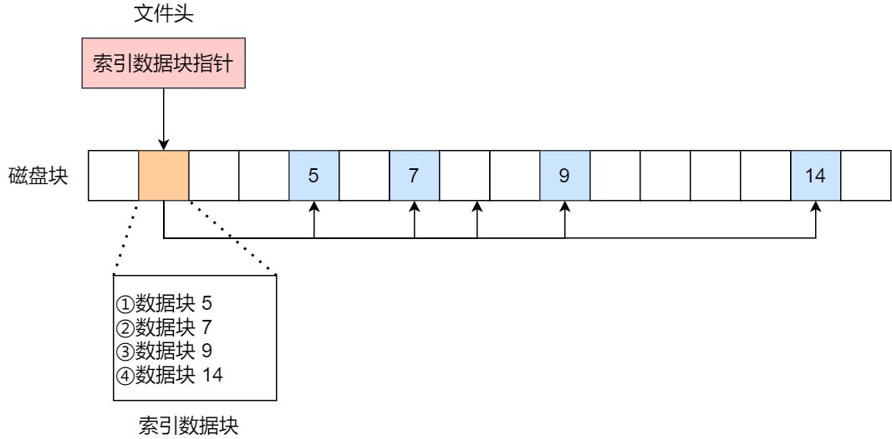
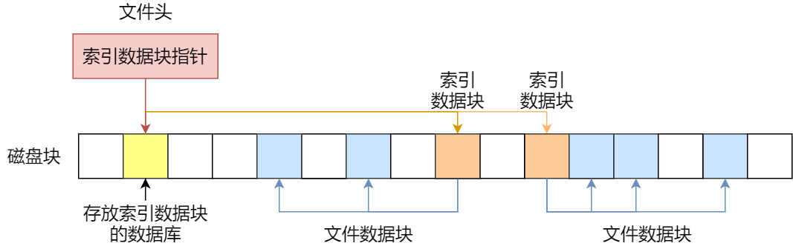
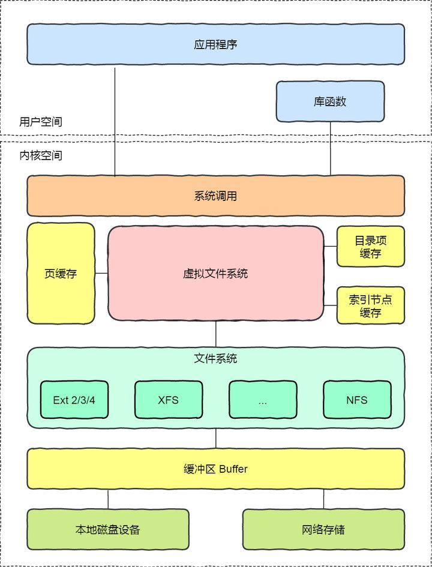

##	文件系统

###	磁盘存储

-	*Sector* 扇区：扇区概念来源于机械硬盘，指磁盘上各磁道上的扇环
	-	物理扇区：磁盘读写的最小单位
		-	早期硬盘多为 512B 大小，新式硬盘多为 4096B 或更高以提高数据记录密度
	-	逻辑扇区：硬盘可以接受读写指令的最小操作单元
		-	为兼容性而设计，硬盘内部将物理扇区逻辑上划分多个 512B 扇区片段提供给文件系统
		-	实际读写时由硬盘固件负责逻辑扇区、物理扇区间转换，对文件系统透明

-	*Logical Block Address* （逻辑）块/簇：多个扇区组成的操作系统最小读写单位
	-	常见的块大小为 4KB，一般为扇区 $2^N$ 倍
	-	特点
		-	提高了读写效率
		-	减少文件碎片
		-	造成一定空间浪费

-	分区：从磁盘上划分出了的连续的扇区
	-	分区格式化：对分区范围内扇区使用进行规划
		-	引导分区设置
		-	扇区分组为块、编号
	-	分区对齐：将逻辑块对齐到磁盘物理扇区
		-	分区格式化是按照逻辑扇区划分，若分区中存储起始位置没有对齐至物理扇区边缘，则分区中块也无法对齐到物理扇区边缘
			-	分区未对齐更多是因为引导区占用扇区数不是物理扇区整数倍，导致之后存储区域无法对齐
			-	则分区一般是将分区起始位置对齐到物理扇区整数倍处即可
		-	分区未对齐时，操作系统每次读、写会多读、写一个物理扇区，降低磁盘性能
		-	4K 对齐：多数磁盘物理扇区大小为 4K，实际对齐需检查物理扇区大小

		
		

> - 固态存储同样有扇区概念，但还有页等概念，更加复杂

-	磁盘存储区域
	-	超级块：存储文件系统的详细信息，文件系统挂载时载入内存
		-	块数量
		-	块大小
		-	空闲块
	-	索引节点区：存储索引节点，文件被访问时载入内存
	-	数据块区：存储文件、目录数据

###	文件

-	*Linux* 系统中：一切皆文件
	-	普通的文件
	-	目录（不是目录项）
		-	同样用 *Inode* 唯一标识
		-	其中存储的内容是子目录、文件
	-	块设备
	-	管道
	-	*Socket*

####	文件读写

-	操作系统会跟踪进程打开的所有文件，即为每个进程维护一个打开文件表
	-	文件表中每项代表文件描述符（`open` 函数返回）
		-	即文件描述符是打开文件的标识
	-	文件表中维护打开文件状态、信息
		-	文件指针：系统跟踪上次读写位置作为当前文件位置指针，对某进程唯一
		-	文件打开计数器：跟踪文件打开、关闭数量，仅计数为 0 时关闭文件，删除条目
		-	文件磁盘位置：避免磁盘交互
		-	访问权限（访问模式）：方便操作系统允许、拒绝 *I/O* 请求

-	文件系统屏蔽了用户字节操作和磁盘数据块操作之间差异
	-	用户读取 1byte 数据时，文件系统获取所在块，返回所需部分
	-	用户写入 1byte 数据时，文件系统获取应写入的块，修改后写回

####	文件在磁盘中的存储

-	连续空间存储方式：文件存储在磁盘连续的物理空间中
	-	需预先知道待存储的文件大小：*Inode* 中需包含文件起始块位置、长度
	-	特点
		-	读写效率高
		-	磁盘空间碎片化
		-	文件长度不易扩展

-	非连续空间存放方式：链表方式
	-	隐式链表：文件头中包含首块、尾块位置，各数据块中包含指向下个数据块的指针
		-	无法直接访问数据块：只能通过指针顺序访问
		-	稳定性差：任何指针丢失、损坏都会导致文件数据损坏
	-	显式链表：将链接各数据块的指针显式存储在链接表（*File Allocation Table*）中（改进隐式链表问题）

		

		-	链接表为每个磁盘设置一张，其中每项表示一个数据块，内容为下个数据块指针
		-	链接表可存放在内存中以提高检索速度，但会占用内存空间，也因此不适合大磁盘
		-	长期使用会使文件资料逐渐分散
	-	特点
		-	可消除磁盘碎片
		-	文件长度可动态扩展
		-	存储指针的有额外空间开销

-	索引存储方式：为每个文件创建索引数据块，存储指向文件数据块的指针列表

	

	-	文件头中需包含指向索引数据块的指针
	-	特点
		-	文件创建、增大、缩小方便
		-	无磁盘碎片问题
		-	支持顺序读写、随机读写
		-	存储索引有额外空间开销
		-	文件系统效率与查找策略高度相关

	-	大文件支持扩展
		-	链式索引块：链表链接索引

			

		-	多级索引块：索引索引索引

			

###	文件系统

文件系统：操作系统用于明确存储设备或分区上文件的方法和数据结构

-	文件系统即在存储设备上组织文件（持久数据）的子系统
	-	基本数据单位是文件，对文件的组织方式的不同即形成不同的文件系统
	-	存储设备：磁盘、光盘、网络存储、虚拟数据
		-	存储设备可以包含多个文件系统

-	*Virtual File System* 虚拟文件系统：包含一组所有文件系统都支持的数据结构和标准接口
	-	作为提供给用户的统一接口

	

> - 操作系统中负责管理、存储文件信息的软件称为文件管理系统，简称文件系统

####	文件系统分类

-	磁盘文件系统：数据存储在磁盘中
	-	*EXT2*
		-	*Linux* 的正宗文件系统，早期常用
		-	支持 *undelete*，误删文件可恢复，但是操作比较麻烦
	-	*EXT3*
		-	由 *EXT2* 发展而来
		-	支持大文件
		-	不支持反删除，*Redhat*、*Fedora* 推荐
	-	*ReiserFS*
		-	支持大文件
		-	支持反删除，操作简单

-	内存文件系统：数据存储在内存中
	-	如：`/proc`、`/sys` 等文件系统
	-	读写此类文件实际上是读写内核中相关数据

-	网络文件系统：访问其他计算机主机数据的文件系统
	-	*NFS*
	-	*SMB*

|FileSystem|File Size Limit|Filesystem Size Limit|
|-----|-----|-----|
|ext2/ext3 with 1KB blocksize|16448MB|2048GB|
|ext2/ext3 with 2KB blocksize|256GB|8192GB|
|ext2/ext3 with 4KB blocksize|2048GB|8192GB|
|ext2/ext3 with 8KB blocksize|65568GB|32TB|
|ReiserFS3.5|2GB|16TB|
|ReiserFS3.6|1EB|16TB|
|XFS|8EB|8EB|
|JFS with 512B blocksize|8EB|512TB|
|JFS with 4KB blocksize|8EB|4PB|
|NFSv2(client side)|2GB|8EB|
|NFSv3(client side)|8EB|8EB|

> - 文件系统要先挂在在某个目录上才能正常使用，*Linux* 会把文件系统挂载到根目录

##	*File Allocation Table*

-	*FAT* 文件分配表：采用 *FAT* 显式链表组织文件的文件系统
	-	简单，几乎所有的个人操作系统均支持，适合移动介质的文件系统
	-	*FAT12*：12bits 寻址长度
	-	*FAT16*：16bits 寻址长度
	-	*FAT32*：目前只使用了其中 28bits 寻址长度
		-	按 4KB 块计算，*FAT32* 最大容量为 1TB
		-	*FAT32* 起始扇区中记录有扇区总数，此限制 *FAT32* 最大容量 2TB
		-	*FAT32* 最大支持 4GB 大小文件

-	*Extended File Allocation Table*
	-	优点
		-	允许更大分区容量、更大文件、更大逻辑块大小
		-	采用空余空间寻址，空间分配、删除性能得以改进
	-	缺点
		-	兼容性不如 *FAT32*：旧设备、*UEFI* 不支持

> - <https://zh.wikipedia.org/wiki/%E6%AA%94%E6%A1%88%E9%85%8D%E7%BD%AE%E8%A1%A8>
> - <https://zhuanlan.zhihu.com/p/121807427>
> - <https://zh.wikipedia.org/wiki/ExFAT>

##	权限设计

-	`r`：读文件
-	`w`：修改、删除文件
-	`x`：可以执行文件
-	`s`：强制位权限（固化用户/组权限）
	-	`set-user-id`：user执行权限位出现
	-	`set-group-id`：group执行权限位出现
-	`t`：粘滞位权限（在swap中停留）

###	权限判断规则

-	linux中权限是根据`user-id`、`group-id`判断用户和资源
	关系，然后选择相应的类型用户（user、group、other）权限组
	判断是否有相应权限

-	需要注意的是，访问资源实际上不是用户，而是用户开启的
	**进程**，所以这里涉及了4中不同的**用户标识**

	-	`real-user-id`：UID，用户id

	-	`real-group-id`：GID，用户默认组id

	-	`effective-user-id`：是针对进程（可执行文件）而言，
		指内核真正用于判断进程权限的**user-id**

	-	`effective-group-id`：同`effective-user-id`，内核
		判断真正判断进程权限的**group-id**

-	一般情况下`effective-user-id`就是`read-user-id`，即启动
	进程用户的UID，所以一般来说用户创建的进程的对资源访问
	权限就是就是自身权限

###	可执行文件权限

-	`r`：读文件
-	`w`：写文件
-	`x`：执行文件

####	`s`权限

当可执行文件具有`set-user-id`权限时

-	其他用户执行该文件启动的进程的`effective-user-id`不再是
	`real-user-id`，即和执行用户的UID不再一致，而是用户属主
	的UID

-	内核根据进程`effective-user-id`判断进程权限，进程的权限
	实际上同属主的权限，而不是执行用户权限

-	这样用户就在执行这种可执行文件，暂时拥有该可执行文件属主
	执行该可执行文件权限，否则可能由于进程访问其他资源原因
	无法正常执行

-	可看作是将属主的部分权限（在该文件上涉及到的权限）
	**固化**在文件上

`set-group-id`类似的可以看作是将属主默认组权限固化在文件上

####	`t`权限

-	文件被执行时，文本段会被加载到swap中，程序结束后仍然
	保留在swap中

-	下次执行文件时，文本段直接从swap中加载，因为swap为连续
	block，加载速度会提高

###	目录权限说明

linux中目录是一种特殊的文件，其包含目录下所有文件（包括
子目录）的文件名、i-node号

-	`r`：列出目录下所有文件

-	`w`：增加、删除、重命名目录下的文件

-	`x`：可以是（搜索）路径的一部分

	-	即必须对要访问的文件中路径中所有目录都有执行权限
	-	可以将目录执行权限看作是**过境证明**

-	`s`：好像没啥用

-	`t`：用户只能增加、删除、重命名目录下**属于**自己文件

	-	对`w`权限补充，否则用户拥有目录`w`权限则可以操作目录
		下所有文件
	-	`/home`目录权限就是1777，设置有粘滞位权限

###	权限掩码

文件/目录默认权限 = 现有权限（`0777`）**减去**权限掩码

> - 权限掩码设置参见*linux/shell/cmd_fs*、
	*linux/shell/config_file*、

