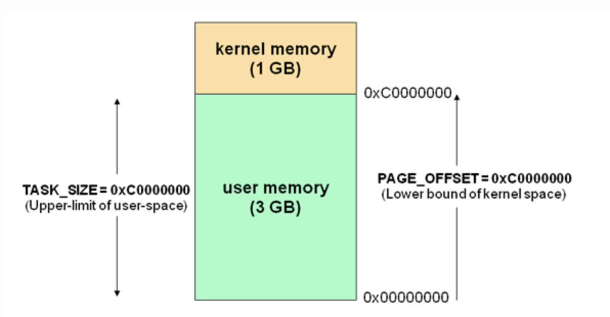

##	Linux进程、线程

###	进程发展

-	Linux2.2内核
	-	进程通过系统调用`fork()`创建，新进程是原进程子进程
	-	不存在真正意义上的线程
	-	只默认允许4096个进程/线程同时运行

-	Linux2.4内核
	-	运行系统运行中动态调整进程数上限，进程数仅受制于物理
		内存大小，最大16000

-	Linux2.6内核
	-	进程调度重新编写，引入slab分配器动态生成
		`task_struct`
	-	最大进程数量提升至10亿
	-	线程框架重写
		-	引入`tgid`、线程组、线程各自的本地存储区
		-	得以支持NPTL线程库

###	线程/轻量级进程

-	Linux未真正实现、区分线程，在内核层面是特殊进程，是
	“真正的轻量级进程”
	-	“线程”和“进程”共享
		-	相同调度策略，处于同一调度层次
		-	相同数据结构进程标识符，位于相同进程标识符空间
	-	“线程”与“进程”的区别在于
		-	线程没有独立的存储空间

-	多线程即创建多个进程并分配相应的进程描述符
	`task_struct`、指定其共享某些资源
	-	创建线程不会复制某些内存空间，较进程创建快
	-	在专门线程支持系统多线程中，系统会创建包含指向所有
		线程的进程描述符，各线程再描述独占资源

-	尽管Linux支持轻量级进程，但不能说其支持核心级线程
	-	则不可能在Linux上实现完全意义上的POSIX线程机制
	-	所以Linux线程库只能尽可能实现POSIX绝大部分语义，尽量
		逼近功能

-	线程在进程内共享某些资源
	-	打开的文件
	-	文件系统信息
	-	地址空间
	-	信号处理函数

> - 这里讨论的线程都是内核线程，即内核可感知、调度线程，不
	包括程序自建线程

####	内核守护线程

||*kthreads*|*pthreads*|
|-----|-----|-----|
|资源|无用户空间|共享完整虚拟寻址空间|
|状态|只工作在内核态|可在内核态、用户态之间切换|
|目的|维护内核正常工作|用户分配任务|

内核守护线程：内核为维护正常运行创建、仅工作在内核态线程

-	按作用可以分类
	-	周期性间隔运行，检测特定资源的使用，在用量超出或低于
		阈值时采取行动
	-	启动后一直等待，直到系统调用请求执行某特定操作

-	执行以下任务
	-	周期性将dirty内存页与页来源块设备同步：`bpflush`线程
	-	将不频繁使用的内存写入交换区：`kswapd`线程
	-	管理延时动作：`kthreadd`线程接手内核守护线程创建
	-	实现文件系统的事务日志

-	内核守护线程只能工作在内核态
	-	没有用户空间，和内核共用一张内核页表
	-	只能使用大于`PAGE_OFFSET`部分的虚拟寻址空间，即进程
		描述符中`current->mm`始终为空
		
	> - 对4G主存的X86_32机器，只能使用最后1G，而普通pthreads
		可以使用完整虚拟寻址空间

> - 内核守护线程名往往为`k`开头、`d`结尾

####	特殊内核守护线程

> - Linux内核启动的最后阶段，系统会创建两个内核线程

-	`init`：运行文件系统上一系列init脚本，并启动shell
	进程
	-	是所有用户进程的祖先，pid为1

-	`kthreadd`：内核启动完成之后接手内核守护线程的创建
	-	内核正常工作时永不退出，是死循环，pid为2
	-	载入内核模块时即需要调用其创建新内核守护线程


###	进程状态

```c
// <kernel/include/linux/sched.h>
#define TASK_RUNNING 0
#define TASK_INTERRUPTIBLE 1
#define TASK_UNINTERRUPTIBLE 2
#define __TASK_STOPPED 4
#define __TASK_TRACED 8
#define EXIT_ZOMBIE 16
#define TASK_DEAD 64
```


> - 状态虽然有很多种，但总是`TASK_RUNNING -> 非`，
	即使进程在`TASK_INTERRUPTIBLE`状态被kill，也需要先唤醒
	进入`TASK_RUNNING`状态再响应kill信号进入`TASK_DEAD`

-	`TASK_RUNNING`：可执行，正在执行或在运行队列中等待执行
	-	同一时刻可能有多个进程处于可执行态，位于运行队列中
		等待进程调度器调度

-	`TASK_INTERRUPTIBLE`：正在阻塞，等待某些条件达成
	-	条件达成后内核会把进程状态设置为运行
	-	此状态进程也会因为接收到信号而提前唤醒准备运行

	> - 系统中大部分进程都此状态

-	`TASK_UNINTERRUPTILBE`：不响应异步信号，即使接收到信号
	也不会被唤醒或准备投入运行
	-	不可中断是指进程不响应异步信号，而不是指CPU不响应
		中断
	-	内核某些处理流程是不可被打断的，如：内核和硬件设备
		交互被打断会导致设备进入不可控状态，因此需要此状态

-	`__TASK_TRACED`：被其他进程跟踪
	-	开发中进程停留在断点状态就是此状态，如：通过`ptrace`
		对调试程序进行跟踪
	-	此状态进程只能等待调试进程通过`ptrace`系统调用执行
		`PTRACE_CONT`、`PTRACE_DETACH`等操作才能恢复到
		`TASK_RUNNING`状态

-	`__TASK_STOPPED`：停止执行，没有也不能投入运行
	-	通常发生在接收到`SIGSTOP`、`SIGSTP`、`SIGTTIN`、
		`SIGTTOU`等信号
	-	向此状态进程发送`SIGCONT`信号可以让其恢复到
		`TASK_RUNNING`状态

-	`TASK_DEAD`：退出状态，即将被销毁

-	`EXIT_ZOMBIE/TASK_ZOMBIE`：进程已结束但`task_struct`未
	注销
	-	进程退出过程中处于`TASK_DEAD`状态，进程占有的资源将
		被回收，但父进程可能会关心进程的信息，所以
		`task_struct`未被销毁

###	内核态、用户态

-	系统设计角度：为不同的操作赋予不同的执行等级，与系统相关
	的特别关键的操作必须有最高特权程序来完成
	-	运行于用户态：进程可执行操作、可访问资源受到限制
	-	运行于内核态：进程可执行任何操作、使用资源无限制

-	内存使用角度（虚拟寻址空间，X86_32位系统，最大4GB主存）
	-	内核空间：最高的1G，所有进程共享
		-	包含系统堆栈：2页面，即8K内存，低地址中存放
			`task_struct`值
		-	进程运行于内核空间时使用系统堆栈、处于内核态
	-	用户空间：剩余3G
		-	包含用户堆栈
		-	进程运行于用户空间时使用用户堆栈、处于用户态

	

-	内核态的逻辑
	-	进程功能和内核密切相关，进程需要进入内核态才能实现
		功能
	-	应用程序在内核空间运行、内核运行于进程上下文、陷入
		内核空间，这种交互方式是程序基本行为方式

-	用户态进入内核态的方式
	-	系统调用，如：`printf`函数中就是调用`write`函数
	-	软中断，如：系统发生异常
	-	硬件中断，通常是外部设备的中断

	

-	进程或者CPU在任何指定时间点上活动必然为
	-	运行于用户空间，执行用户进程
	-	运行于内核空间，处于进程上下文，代表某特定进程执行
	-	运行于内核空间，处于中断上下文，与任何进程无关，处理
		特点中断

##	Linux进程数据结构

###	`task_struct`

```c
// <kernel/include/linux/sched.h>
struct task_struct{
	volatile long state;	// -1：不可运行，0：可运行，>0：已中断
	int lock_depth;			// 锁深度
	unsigned int policy;	// 调度策略：FIFO，RR，CFS
	pid_t pid;				// 线程ID
	pid_t tgid;				// 线程组ID，2.6内核中引入
	struct task_struct *parent;	// 父进程
	struct list_head children;	// 子进程
	struct list_head sibling;	// 兄弟进程
	struct task_struct *group_leader;
	struct list_head thread_group;
}
```


-	内核使用任务队列（双向循环链表）维护进程（描述符）

-	`task_struct`：进程描述符，包含进程的所有信息，包括
	-	进程状态
	-	打开的文件
	-	挂起信号
	-	父子进程

####	ID

-	`pid`：字面意思为*process id*，但逻辑上为线程ID
-	`tgid`：字面意思为*thread group id*，但逻辑上为
	进程ID

```c
// <kernel/timer.c>
asmlinkage long sys_getpid(void){
	return current->tgid;
}
asmlinakge long sys_gettid(void){
	return current->pid;
}
```

####	线程关系

```c
// <kernel/fork.c>
copy_process{
	// some code
	p->tgid = p->pid;

	// 创建线程时
	if (clone_flags & CLONE_THREAD)
		// 从父进程获取`tgid`，归属同一线程组
		p->tgid = current->tgid;

	// some code
	// 初始化`group_leader`、`thread_group`
	p->group_leader = p;
	INIT_LIST_HEAD(&p->thread_group);

	// some code

	// 创建线程时
	if (clone_flags & CLONE_THREAD){
		// `group_leader`设置为父进程`group_leader`
		// 即保证`group_leader`指向首个线程`task_struct`
		p->group_leader = current->group_leader;
		// 通过`thread_group`字段挂到首个线程的`thread_group`队列中
		list_add_tail_rcu(&p->thread_group, &p->group_leader->thread_group);

	// some code
	}

	if(likely(p->pid)){
		// some code
		// 仅首个线程才会通过`tasks`字段挂入`init_task`队列中
		if(thread_group_leader(p)){
			//...
			list_add_tail_rcu(&p->tasks, &init_task, tasks);
		}
	}
}
```

####	线程组退出

```c
// <kernel/exit.c>
NORET_TYPE void do_group_exit(int exit_code){
	BUG_ON(exit_code & 0x80);

	// `current->signal`由线程组中所有线程共享
	// 若调用此方法线程`SIGNAL_GROUP_EXIT`标志已被设置，说明
		// 其他线程已经执行过此方法，已通知线程组中所有线程
		// 退出，则可以直接执行`do_exit`
	if(current->signal->flags & SIGNAL_GROUP_EXIT)
		exit_code = current->signal->group_exit_code;

	// 否则通知线程组中所有线程退出
	else if(!thread_gropu_empty(current)){
		struct signal_struct * const sig = current->signal;
		struct sighand_struct * const sighand = current->sighand;
		spin_lock_irq(&sighand->siglock);

		// another thread got here before we took the lock
		if(sig->flags & SIGNAL_GROUP_EXIT)
			exit_code = sig->group_exit_code;
		else{
			sig->group_exit_code = exit_code;
			zap_other_threads(current);
		}
		spin_unlock_irq(&sighand->sigloc);
	}

	do_exit(exit_code);
}

// <kernel/signal.c>
void zap_other_threads(struct task_struct *p){
	struct task_struct *t;

	// 设置`SIGNAL_GROUP_EXTI`标志
	p->signal->flags = SIGNAL_GROUP_EXIT;
	p->signal->group_stop_count = 0;

	if(thread_group_empty(p))
		return;

	for (t=next_thread(p); t != p; t=next_thread(t)){
		// don't bohter with already dead threads
		if (t->exit_state)
			continue;

		// 为每个线程设置`SIGKILL`信号
		sigaddset(&t->pending.signal, SIGKILL);
		signal_wake_up(t, 1);
	}
}

// <include/linux/sched.h>
static inline struct task_struct *next_thread(const struct task_struct *p){
	return list_entry(rcu_dereference(p->thread_group.next),
		struct task_struct, thread_group);
}
```

###	*Slab*分配器


-	slab分配器把不同对象类型划分为不同高速缓存组，如：
	`task_struct`、`inode`分别存放
	-	高速缓存又会被划分为slab
	-	slab由一个或多个物理上连续的页组成

-	申请数据结构时
	-	先从半满的*slabs_partial*中申请
	-	若没有半满，就从空的*slabs_empty*中申请，直至填满
		所有
	-	最后申请新的空slab

-	slab分配器策略优点
	-	减少频繁的内存申请和内存释放的内存碎片
	-	由于缓存，分配和释放迅速

###	`thread_info`

```c
// <asm/thread_info.h>
struct thread_info{
	struct task_struct *task;
	struct exec_domain *exec_domain;
	usigned long flags;
	__u32 cpu;
	int preempt_count;
	mm_segment_t addr_limit;
	struct restart_block restart_block;
}
```

-	内核中对进程操作都需要获得进程描述符`task_struct`指针，
	所以获取速度非常重要
	-	寄存器富余的体系会拿出专门的寄存器存放当前
		`task_struct`的指针
	-	寄存器不富余的体系只能在栈尾创建`thread_info`结构，
		通过计算间接查找

##	进程创建

> - 继承于Unix，Linux进程创建使用两个函数分别完成，其他如Win
	可能都是通过一个方法完成

-	`fork`函数：拷贝当前进程创建子进程
	-	子进程、父进程区别仅在于PID、PPID和少量资源

-	`exec`函数（族）：载入可执行文件至地址空间开始运行

```c
SYSCALL_DEFINE0(fork){
	return do_fork(SIGCHLD, 0, 0, NULL, NULL);
}
SYSCALL_DEFINE0(vfork){
	return _do_fork(CLONE_VFORK | CLONE_VM | SIGCHLD,
		0, 0, NULL, NULL, 0);
}
long do_fork(unsigned long clone_flags,
		unsigned long stack_start,
		unsigned long stack_size,
		int __user *parent_tidptr,
		int __user *child_tidptr){
	return _do_fork(clone_flags, stack_start, stack_size,
		parent_tidptr, child_tidptr, 0);
}
long _do_fork(unsigned long clone_flags,
		unsigned long stack_start,
		unsigned long stack_size,
		int __user *parent_tidptr,
		int __user *child_tidptr,
		unsigned long tls){
	// some code
	p = copy_process(clone_flags, stack_start, stack_size,
		child_tidptr, NULL, trace, tls);
	// some code
}
```

-	`fork`、`vfork`最终都是通过调用`_do_fork`实现，仅传参
	不一致
	-	首个参数为`clone_flags`，最终被`copy_process`用于
		真正的拷贝执行

-	通过系统调用`clone()`创建线程

	-	同创建进程系统调用`fork()`、`vfork()`一样，最终调用
		`do_fork`方法，但传递和进程创建时不同的flag，指明
		需要共享的资源

		```c
		CLONE_VM | CLONE_FS | CLONE_FILES | CLONE_SIGNAND
		```

###	`fork`

`fork()`：子进程是父进程的完整副本，复制了父进程的资源，
包括内存内容、`task_struct`

-	子进程拷贝父进程的数据段、代码段
	-	同一变量的虚拟地址相同（物理地址不同）

-	利用*copy-on-write*优化效率
	-	内核创建子进程时不复制父进程的地址空间，而是只读共享
		父进程空间数据
	-	只有子进程需要写数据时才会拷贝到子进程

> - 页表：存放给从逻辑页号到物理页帧/块号地址的映射

####	Unix傻瓜式进程创建

-	内核原样复制父进程整个地址空间，并分配给子进程，效率低
	-	为子进程页表分配页帧
	-	为子进程页分配页帧
	-	初始化子进程页表
	-	把父进程页复制到子进程相应页中

-	大部分情况下复制父进程页无意义
	-	子进程会载入新的程序开始运行
	-	丢弃所继承的地址空间

####	*Copy-on-Write*

*copy-on-write*思想简单：父进程、子进程共享页帧

-	共享页帧不能被修改，父进程、子进程试图写共享页帧时产生
	`page_fault`异常中断

-	CPU执行异常处理函数`do_wp_page()`解决此异常
	-	对导致异常中断的页帧取消共享操作
	-	为写进程复制新的物理页帧，使父、子进程各自拥有内容
		相同的物理页帧
	-	原页帧仍然为写保护：其他进程试图写入时，内核检查进程
		是否是页帧的唯一属主，如果是则将页帧标记为对此进程
		可写

-	异常处理函数返回时，CPU重新执行导致异常的写入操作指令

> - *copy-on-write*：多个呼叫者同时要求相同资源时，会共同
	取得相同指针指向相同资源，直到某个呼叫者尝试修改资源时，
	系统才给出*private copy*，避免被修改资源被直接察觉，此
	过程对其他呼叫者*transparent*

###	`vfork`

`vfork()`：子进程直接共享父进程的虚拟地址空间、物理空间

-	`vfork`被设计用以启动新程序
	-	内核不创建子进程的虚拟寻址空间结构
	-	进程创建后应立即执行`exec`族系统调用加载新程序，替换
		当前进程

	> - `exec`不创建新进程，仅用新程序替换当前进程正文、
		数据、堆、栈

-	在子进程调用`exec`函数族、`_exit()`、`exit()`前，子进程
	在父进程的地址空间中运行
	-	二者共享数据段，子进程可能破坏父进程数据结构、栈
	-	父进程地址空间被占用，因此内核会保证父进程被阻塞，
		即`vfork`会保证子进程先运行

-	应确保一旦调用`vfork`后
	-	子进程不应使用`return`返回调用处，否则父进程又会
		`vfork`子进程
	-	子进程不应依赖父进程进一步动作，否则会导致死锁
	-	子进程需避免改变全局数据
	-	若子进程改变了父进程数据结构就不能调用`exit`函数

###	`clone`

`clone`：可有选择地继承父进程资源

```c
int clone(int (fn)(void), void * child_stack, int flags, void * args);
```

-	`clone`通过众多参数有选择地创建进程
	-	创建LWP/线程
	-	创建兄弟进程
	-	类似`vfork`创建和父进程共享虚拟寻址空间

-	参数说明
	-	`fn`：函数指针
	-	`child_stack`：为子进程分配的系统堆栈空间
	-	`flags`：描述需要从父进程继承的资源，如下
	-	`args`：传给子进程的参数

####	Flags

```c
#define CSIGNAL		0x000000ff		// signal mask to be setn at exit
#define CLONE_VM	0x00000100		// set if VM shared between process
#define CLONE_FS	0x00000200		// set if fs info shared between processes
#define CLONE_FILES	0x00000400		// set if open files shared between processes
#define CLONE_SIGHAND	0x00000800	// set if signal handlers and blocked signals shared
#define CLONE_PTRACE	0x00002000	// set if we want to let tracing continue on the child too
#define CLONE_VFORK		0x00004000	// set if the parent wants the child to wake it up on mm_release
#define CLONE_PARENT	0x00008000	// set if we want to have the same parent as the cloner
#define CLONE_THREAD	0x00010000	// same thread group?
#define CLONE_NEWS		0x00020000	// new namespace group?
#define CLONE_SYSVSEM	0x00040000	// share system V SEM_UNDO semantics
#define CLONE_SETTLS	0x00080000	// create a new TLS for the child
#define CLONE_PARENT_SETTID		0x00100000	// set the TID in the parent
#define CLONE_CHILD_CLEARTID	0x00200000	// clear TID in the child
#define CLONE_DETEACHED			0x00400000	// unused
#define CLONE_UNTRACED			0x00800000	// set if the tracing process can't force `CLONE_PTRACE` on this clone
#define CLONE_CHILD_SETTID		0x01000000	// set the TID in the child
#define CLONE_STOPPED	0x02000000	// start in stopped state
#define CLONE_NEWUTS	0x04000000	// new utsname group
#define CLONE_NEWIPC	0x08000000	// new ipcs
#define CLONE_NEWUSER	0x10000000	// new user namespace
#define CLONE_NEWPID	0x20000000	// new pid namespace
#define CLONE_NEWNET	0x40000000	// new network namespace
#define CLONE_IO		0x80000000	// clone into context
```

##	线程库

-	POSIX标准要求：线程不仅仅是共享资源即可，其需要被视为
	整体
	-	查看进程列表时，一组`task_struct`需要被展示为列表中
		一个节点
	-	发送给进程信号，将被一组`task_struct`共享，并被其中
		任意一个线程处理
	-	发送给线程信号，将只被对应`task_struct`接收、处理
	-	进程被停止、继续时，一组`task_struct`状态发生改变
	-	进程收到致命信号`SIGSEGV`，一组`task_struct`全部退出

###	LinuxThread线程库

LinuxThread线程库：Linux2.6内核前，pthread线程库对应实现

-	特点
	-	采用1对1线程模型
	-	通过轻量级进程模拟线程
	-	线程调用由内核完成，其他线程操作同步、取消等由核外
		线程库完成
	-	仅通过管理线程实现POSIX以上5点要求中最后一点

####	管理线程

管理线程：为每个进程构造、负责处理线程相关管理工作

-	管理线程是主线程的首个子线程
	-	进程首次调用`pthread_create`创建线程时会创建、启动
		管理线程

-	管理线程负责创建、销毁除主线程外线程，成为LinuxThread
	的性能瓶颈
	-	从pipe接收命令创建线程
	-	子线程退出时将收到`SIGUSER1`信号（`clone`时指定），
		若不是正常退出，则杀死所有子线程并自杀
	-	主循环中不断检查父进程ID，若为1说明原父线程退出并
		被托管给init线程，则杀死所有子进程并自杀

-	通过LWP模拟线程存在的问题
	-	LWP不共享进程ID
	-	某些缺省信号难以做到对所有线程有效，如：`SIGSTOP`、
		`SIGCONT`无法将整个进程挂起
	-	线程最大数量收到系统总进程数限制
	-	管理线程是性能瓶颈，一旦死亡需要用户手动清理线程、
		无人处理线程创建请求
	-	同步效率低，通过复杂的信号处理机制进行同步
	-	与POSIX兼容性差

###	Naive POSIX Thread Library

*NPTL*：Linux2.6内核重写线程框架的基础上引入的pthread线程库

-	本质上还是利用LWP实现线程的1对1线程模型，但结合新的线程
	框架实现了POSIX的全部5点要求
	-	线程组`tgid`引入体现`task_struct`代表进程还是线程
	-	`task_struct`维护两套*signal_pending*
		-	线程组共享*signal_pending*：存放`kill`发送信号，
			任意线程可以处理其中信号
		-	线程独有*signal_pending*：存放`pthread_kill`发送
			信号，只能由线程自身处理
	-	收到致命信号时，内核会将处理动作施加到线程组/进程中

-	但也存在一些问题
	-	`kill`未展示的LWP会杀死整个进程

> - RedHat开发，性能远高于LinuxThreads，需要内核支持

###	Next Generation Posix Threads for Linux

NGPT：基于*GNU Portable Threads*项目的实现多对多线程模型

> - IBM开发，性能介于LinuxThread、NPTL间，2003年终止开发

