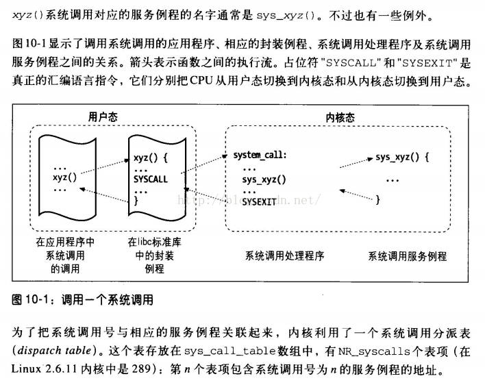

##	Kernel

内核：提供硬件抽象层、磁盘及文件系统控制、多任务等功能的系统
软件

-	内核是操作系统的核心、基础，决定系统的性能、稳定性
	-	内核单独不是完整的操作系统

-	内核为应用程序提供对硬件访问
	-	应用程序对硬件访受限
		-	内核决定程序何时、对何种硬件操作多长时间
	-	内核提供硬件抽象的方法隐藏对硬件操作的复杂
		-	为应用程序和硬件提供简洁、统一的接口
		-	简化程序设计

###	内核功能

-	进程管理：实现了多个进程在CPU上的抽象
	-	负责创建、销毁进程，处理它们和外部输入、输出
	-	处理进程之间通讯
		-	信号
		-	管道
		-	通讯原语
	-	调度器控制进程如何共享CPU

-	内存管理：内存是主要资源，对其管理策略对性能影响非常重要
	-	为所有进程在有限资源上建立虚拟寻址空间
	-	内核不同部分与内存管理子系统通过函数调用交互，实现
		`malloc`、`free`等功能

-	文件管理：Linux很大程度上基于文件系统概念，几乎任何东西
	都可以视为是文件
	-	在非结构化硬件上建立了结构化文件系统
	-	支持多个文件系统，即物理介质上的不同数据组织方式

-	驱动管理
	-	除CPU、内存和极少的硬件实体外，基本设备控制操作都由
		特定的、需寻址的设备相关代码（设备驱动）进行
	-	内核中必须嵌入系统中出现每个外设驱动

-	网络管理
	-	网络必须由系统管理
		-	大部分网络操作不是特定于某个进程：进入系统的报文
			是异步事件
		-	系统在进程接手报文前收集、识别、分发，在程序和
			网络接口间递送数据报文，根据程序的网络活动控制
			程序执行
	-	路由、地址解析也在内核中实现

##	System Call

系统调用：操作系统提供的实现系统功能的子程序、访问硬件资源
的唯一入口

-	系统调用是用户空间进程访问内核、硬件设备的唯一手段
	-	用户空间进程不能直接访问内核、调用内核函数
	-	对计算机硬件资源的必须经过操作系统控制
		-	计算机系统硬件资源有限，多个进程都需要访问资源

-	系统调用与硬件体系结构紧密相关
	-	在用户空间进程和硬件设备之间添加中间层，是二者沟通的
		桥梁
	-	是设备驱动程序中定义的函数最终被调用的一种方式



###	系统调用意义

-	用户程序通过系统调用使用硬件，简化开发、移植性
	-	分离了用户程序和内核的开发
		-	用户程序忽略API具体实现，仅借助其开发应用
		-	内核忽略API被调用，只需关心系统调用API实现
	-	为用户空间提供了统一硬件抽象接口，用户程序可以方便在
		具有相同系统调用不同平台之间迁移

-	系统调用保证了系统稳定和安全
	-	内核可以基于权限和其他规则对需要进行的访问进行
		裁决
	-	避免程序不正确的使用硬件设备、窃取其他进程资源、
		危害系统安全

-	保证进程可以正常运行在虚拟寻址空间中
	-	程序可以随意访问硬件、内核而对此没有足够了解，
		则难以实现多任务、虚拟内存
	-	无法实现良好的稳定性、安全性

###	通知内核

> - 大部分情况下，程序通过API而不是直接调用系统调用
> - POSIX标准是Unix世界最流行的API接口规范，其中API和系统
	调用之间有直接关系，但也不是一一对应

####	系统调用表

系统调用表`sys_call_table`：其中元素是系统调用服务例程的
起始地址

```c
// arch/x86/entry/syscall_64.c
asmlinkage const sys_call_ptr sys_call_table[__NR_syscall_max+1] ={
	[0 ... __NR_syscall_max] = &sys_ni_syscall,
#include <asm/syscalls_64.h>
};
```

> - `...`是GCC*Designated Initializers*插件功能，此插件允许
	无序初始化元素值

-	`sys_call_table`是长为`__NR_syscall_max+1`的数组

-	`__NR_syscall_max`是给定系统架构所允许的最大系统调用
	数目

	```c
	// include/generated/asm-offsets.h
	#define __NR_syscall_max 547
	```

	-	此数值必然和`arch/x86/entry/syscalls/syscall_64.tbl`
		中最大系统调用数值相同

-	`sys_call_ptr`是指向系统调用表指针类型

	```c
	typedef void (*sys_call_ptr_t)(void);
	```

-	`sys_ni_syscall`是返回错误的函数

	```c
	asmlinkage long sys_ni_syscall(void){
		return -ENOSYS;
	}
	```

	-	未在`<asm/syscalls_64.h>`定义系统调用号将会对应此
		响应函数，返回`ENOSYS`专属错误

-	`<asm/syscalls_64.h>`由脚本
	`arch/x86/entry/syscalls/syscalltbl.sh`从
	`arch/x86/entry/syscalls/syscall_64.tbl`中生成

	```c
	// <asm/syscalls_64.h>
	__SYS_COMMON(0, sys_read, sys_read)
	__SYS_COMMON(0, sys_write, sys_write)

	// <arch/x86/entry/syscall_64.c>
	#define __SYSCALL_COMMON(nr, sym, compat) __SYSCALL_64(nr, sym, compat)
	#define __SYSCALL_64(nr, sym, compat) [nr] = sym
	```

####	系统调用号

```c
/* fs/xattr.c */
#define __NR_setxattr 5
__SYSCALL(__NR_setxattr, sys_setxattr)
#define __NR_lsetxattr 6
__SYSYCALL(__NR_lsetxattr, sys_lsetattr)
#define __NR_fsetxattr 7
__SYSYCALL(__NR_fsetxattr, sys_fsetattr)
```

系统调用号`_NR_XXX`：系统调用唯一标识

-	系统调用号一旦分配不能有任何变更，否则编译好的程序会崩溃
	-	系统调用号定义在`include/asm/unisted.h`中

-	用户空间进程通过系统调用号指明需要执行的系统调用
	-	系统调用号就是系统调用在`sys_call_table`中的偏移
	-	根据系统调用号在`sys_call_table`中找到对应表项内容，
		即可找到系统调用响应函数`sys_NAME`的入口地址

-	所有系统调用陷入内核的方式相同，所以必须把系统调用号一并
	传给内核
	-	X86机器上，系统调用号通过`eax`寄存器传递给内核
		-	陷入内核态，用户空间进程已经把系统调用对应系统
			调用号放入`eax`中
		-	系统调用一旦运行，就可以从`eax`中得到数据

####	陷入指令

-	系统调用通过陷入指令进入内核态
	-	然后内核根据存储在寄存器中的系统调用号在系统调用表
		中找到相应例程函数的入口地址
	-	根据入口地址调用例程函数

-	陷入指令是特殊指令，且依赖于机器架构，在X86机器中指令为
	`int 0x80`
	-	不应直接使用陷入指令
	-	应实现系统调用库函数，以系统调用号为参数，执行陷入
		指令陷入内核态，并执行系统调用例程函数，即
		`__syscall[N]`系列宏

####	`__syscall[N]`

`_syscall[N]`：方便用户程序访问系统调用的一系列宏

```c
// linux/include/asm/unistd.h
__syscall0(type, name)
__syscall1(type, name, type1, args1)
__syscall2(type, name, type1, arg1, type2, arg2)
// 0-6共7个宏
__syscall6(type, name, type1, arg1, type2, arg2, type3, arg3, type4, arg4, type5, arg5, type6, arg6)
```

```c
#define _syscall2(type, name, type1, arg1, type2, arg2) \
type name(type1, arg1, type2, arg2) \
{ \
long _res; \
__asm__ volatile ("int $0x80" \
: "=a" (_res) \
: "0" (__NR##name), "b" ((long)(arg1)), "c" ((long)(arg2))); \
// some code
__syscall_return(type, __res)
}
```

-	7个宏分别可以适用于参数个数为0-6的系统调用
	（超过6个参数的系统调用罕见）

-	`__syscall[N]`宏根据系统调用名创建`name`同名函数，通过
	该函数即可访问系统调用

> - 大部分情况下用户程序都是通过库函数访问系统调用，调用
	`__syscall[N]`系列宏通常由库函数完成
> - Linux2.6.19内核之后弃用

####	`syscall`

`syscall`：通过系统调用号相应参数访问系统调用

```
int syscall(int number, ...);

#include <unistd.h>
#include <sys/syscall.h>
#include <sys/types.h>

int main(int argc, char *argv){
	pid_t tid;
	// `SYS_[NAME]`是系统调用号常量
	tid = syscall(SYS_getpid);
}
```

####	System Call Service Routine

系统调用服务例程/响应函数：系统调用的实际处理逻辑

-	一般以`sys_`开头，后跟系统调用名
	-	`fork()`的响应函数是`sys_fork()`
	-	`exit()`的响应函数是`sys_exit()`

-	系统调用可以看作是系统调用服务例程在内核中注册的
	名，内核通过系统调用名寻找对应服务例程

	```c
	// arch/x86/entry/syscalls/syscall_64.tbl
	0		common		read		sys_read
	1		common		write		sys_write
	2		common		open		sys_open
	```

###	参数传递

####	参数传递

-	除系统调用号外参数输入同样存放在寄存器中
	-	X86机器上，`ebx`、`ecx`、`edx`、`esi`、`edi`按照顺序
		存放前5个参数
	-	需要6个以上参数情况不多，此时应该用单独的寄存器存放
		指向所有参数在用户空间地址的指针

####	参数验证

-	系统调用需要检查参数是否合法有效、正确
	-	文件IO相关系统调用需要检查文件描述符是否有效
	-	进程相关函数需要检查PID是否有效

-	用户指针检查，内核必须保证
	-	指针指向的内存区域属于用户空间：不能哄骗内核读取
		内核空间数据
	-	指针指向的内存区域在进程地址空间：不能哄骗内核读取
		其他进程数据
	-	进程不能绕过内存访问限制：内存读、写应被正确标记

###	访问系统调用

####	系统调用初始化

-	系统调用初始化就是对陷入指令的初始化，在X86机器上就是
	初始化`INT 0x80`指令

-	系统启动时	
	-	汇编子程序`setup_idt()`准备256项的idt表
	-	由`start_kernel()`、`trap_init()`调用的C宏定义
		`set_system_gate(0x80, &system_call)`设置`0x80`号
		软中断服务程序为`system_call`
	-	`system_call`就是所有系统调用总入口

####	系统调用上下文

-	内核在执行系统调用时处于进程上下文
	-	`current`指针指向当前任务，即引发系统调用的进程

-	在进程上下文中，内可以休眠、被抢占
	-	能够休眠：系统调用可以使用内核提供的绝大部分功能，
		方便内核编程
	-	能被抢占：新进程可以使用相同的系统调用
		-	保证系统调用可重入

-	系统调用返回时，控制权依然在`system_call()`中，其会负责
	切换到用户空间并让用户进程继续执行

###	系统调用返回值

####	`errno`错误码

-	系统调用将错误码放入名为`errno`的全局变量中
	-	为防止和正常返回值混淆，系统调用不直接返回错误码
	-	`errno`值只在函数发生错误时设置，若函数不发生错误，
		`errno`值无定义，并不置为0
		-	`0`值通常表示成功
		-	负值表示系统调用失败
			-	错误值对应错误消息定义在`error.h`中
			-	可以通过`perror()`库函数翻译误码
	-	处理`errno`前最好将其存入其他变量中，因为在错误处理
		过程中`errno`值可能会被改变

-	系统调用具有明确的操作

####	`ret_from_sys_call`

-	以`ret_from_sys_call`为入口的汇编程序段在Linux进程管理中
	起到重要作用
	-	系统调用结束前、大部分中断服务返回前，都会跳转至此处
		入口地址
	-	还处理中断嵌套、CPU调度、信号等

-	给用户空间进程的返回值同样通过寄存器传递
	-	X86机器上，存放在`eax`寄存器中

##	Linux系统调用、派生函数

###	进程管理

####	进程控制

-	`fork`：创建新进程
-	`clone`：按照指定条件创建子进程
-	`execve`：运行可执行文件
-	`exit`：终止进程
-	`_exit`：立即终止当前进程
-	`getdtablesize`：进程能打开的最大文件数
-	`getpgid`：获取指定进程组标识号
-	`setpgid`：设置指定进程组标识号
-	`getpgrp`：获取当前进程组标识号
-	`setpgrp`：设置当前进程组标识号
-	`getpid`：获取进程标识号
-	`getppid`：获取父进程标识号
-	`getpriority`：获取调度优先级
-	`setpriority`：设置调度优先级
-	`modify_ldt`：读写进程本地描述符
-	`nanosleep`：使指定进程睡眠
-	`nice`：改变分时进程的优先级
-	`pause`：挂起进程，等待信号
-	`personality`：设置进程运行域
-	`prctl`：对进程进行特定操作
-	`ptrace`：进程跟踪
-	`sched_get_priority_max`：取得静态优先级上限
-	`sched_get_priority_min`：取得静态优先级下限
-	`sched_getparam`：取得进程调度参数
-	`sched_getscheduler`：取得指定进程的调度策略
-	`sched_rr_get_interval`：取得按RR算法实调度的实时进程
	时间片
-	`sched_setparam`：设置进程调度参数
-	`sched_setscheduler`：设置进程调度策略和参数
-	`sched_yield`：进程主动出让处理器，并添加到调度队列队尾
-	`vfork`：创建执行新程序的子进程
-	`wait`/`wait3`：等待子进程终止
-	`watipid`/`wait4`：等待指定子进程终止
-	`capget`：获取进程权限
-	`capset`：设置进程权限
-	`getsid`：获取会晤标识号
-	`setsid`：设置会晤标识号

####	进程间通信

-	`ipc`：进程间通信控制总控制调用

####	信号

-	`sigaction`：设置对指定信号的处理方法
-	`sigprocmask`：根据参数对信号集中的号执行阻塞、解除
	阻塞等操作
-	`sigpending`：为指定被阻塞信号设置队列
-	`sigsuspend`：挂起进程等待特定信号
-	`signal`
-	`kill`：向进程、进程组发信号
-	`sigvec`：为兼容BSD设置的信号处理函数，作用类似
	`sigaction`
-	`ssetmask`：ANSI C的信号处理函数，作用类似`sigaction`

####	消息

-	`msgctl`：消息控制操作
-	`msgget`：获取消息队列
-	`msgsnd`：发消息
-	`msgrcv`：取消息

####	管道

-	`pipe`：创建管道

####	信号量

-	`semctl`：信号量控制
-	`semget`：获取一组信号量
-	`semop`：信号量操作

###	内存管理

####	内存管理

-	`brk`/`sbrk`：改变数据段空间分配
-	`mlock`：内存页面加锁
-	`munlock`：内存页面解锁
-	`mlockall`：进程所有内存页面加锁
-	`munlockall`：进程所有内存页面解锁
-	`mmap`：映射虚拟内存页
-	`munmap`：去除内存映射页
-	`mremap`：重新映射虚拟内存地址
-	`msync`：将映射内存中数据写回磁盘
-	`mprotect`：设置内存映像保护
-	`getpagesize`：获取页面大小
-	`sync`：将内存缓冲区数据写回磁盘
-	`cacheflush`：将指定缓冲区中内容写回磁盘

####	共享内存

-	`shmctl`：控制共享内存
-	`shmget`：获取共享内存
-	`shmat`：连接共享内存
-	`shmdt`：卸载共享内存

###	文件管理

####	文件读写

-	`tcntl`：文件控制
-	`open`：打开文件
-	`creat`：创建新文件
-	`close`	：关闭文件描述字
-	`read`：读文件
-	`write`：写文件
-	`readv`：从文件读入数据到缓存区
-	`writev`：将缓冲区数据写入文件
-	`pread`：随机读文件
-	`pwrite`：随机写文件
-	`lseek`：移动文件指针
-	`_llseek`：64位地址空间中移动文件指针
-	`dup`：复制已打开的文件描述字
-	`dup2`：按指定条件复制文件描述字
-	`flock`：文件加/解锁
-	`poll`：IO多路切换
-	`truncat`/`ftruncate`：截断文件
-	`vumask`：设置文件权限掩码
-	`fsync`：将内存中文件数据写入磁盘

####	文件系统操作

-	`access`：确定文件可存取性
-	`chdir`/`fchdir`：改变当前工作目录
-	`chmod`/`fchmod`：改变文件模式
-	`chown`/`fchown`/`lchown`：改变文件属主、用户组
-	`chroot`：改变根目录
-	`stat`/`lstat`/`fstat`：获取文件状态信息
-	`statfs`/`fstatfs`：获取文件系统信息
-	`ustat`：读取文件系统信息
-	`mount`：安装文件系统
-	`umount`：卸载文件系统
-	`readdir`：读取目录项
-	`getdents`：读取目录项
-	`mkdir`：创建目录
-	`mknod`：创建索引节点
-	`rmdir`：删除目录
-	`rename`：文件改名
-	`link`：创建链接
-	`symlink`：创建符号链接
-	`unlink`：删除链接
-	`readlink`：读取符合链接值
-	`utime`/`utimes`：改变文件的访问修改时间
-	`quotactl`：控制磁盘配额

###	驱动管理

####	系统控制

-	`ioctl`：IO总控制函数
-	`_sysctl`：读写系统参数
-	`acct`：启用或禁用进程记账
-	`getrlimit`：获取系统资源上限
-	`setrlimit`：设置系统资源上限
-	`getrusage`：获取系统资源使用情况
-	`uselib`：选择要使用的二进制库
-	`ioperm`：设置端口IO权限
-	`iopl`：改变进程IO权限级别
-	`outb`：低级端口操作
-	`reboot`：重启
-	`swapon`：开启交换文件和设备
-	`swapoff`：关闭交换文件和设备
-	`bdflush`：控制bdflush守护进程
-	`sysfs`：获取核心支持的文件系统类型
-	`sysinfo`：获取系统信息
-	`adjtimex`：调整系统时钟
-	`getitimer`：获取计时器值
-	`setitimer`：设置计时器值
-	`gettimeofday`：获取时间、时区
-	`settimeofday`：设置时间、时区
-	`stime`：设置系统日期和时间
-	`time`：获取系统时间
-	`times`：获取进程运行时间
-	`uname`：获取当前unix系统名称、版本、主机信息
-	`vhangup`：挂起当前终端
-	`nfsservctl`：控制NFS守护进程
-	`vm86`：进入模拟8086模式
-	`create_module`：创建可载入模块项
-	`delete_module`：删除可载入模块项
-	`init_module`：初始化模块
-	`query_module`：查询模型信息

###	网络管理

####	网络管理

-	`getdomainname`：获取域名
-	`setdomainname`：设置域名
-	`gethostid`：获取主机标识号
-	`sethostid`：设置主机标识号
-	`gethostname`：获取主机名称
-	`sethostname`：设置主机名称

####	Socket控制

-	`socketcall`：socket系统调用
-	`socket`：建立socket
-	`bind`：绑定socket到端口
-	`connect`：连接远程主机
-	`accept`：响应socket连接请求
-	`send`/`sendmsg`：通过socket发送信息
-	`sendto`：发送UDP信息
-	`recv`/`recvmsg`：通过socket接收信息
-	`recvfrom`：接收UDP信息
-	`listen`：监听socket端口
-	`select`：对多路同步IO进行轮询
-	`shutdown`：关闭socket上连接
-	`getsockname`：获取本地socket名称
-	`getpeername`：获取通信对方socket名称
-	`getsockopt`：获取端口设置
-	`setsockopt`：设置端口参数
-	`sendfile`：在文件端口间传输数据
-	`socketpair`：创建一对已连接的无名socket

###	用户管理

-	`getuid`：获取用户标识号
-	`setuid`：设置用户标识号
-	`getgid`：获取组标识号
-	`setgid`：设置组标识号
-	`getegid`：获取有效组标识号
-	`setegid`：设置有效组标识号
-	`geteuid`：获取有效用户标识号
-	`seteuid`：设置有效用户标识号
-	`setregid`：分别设置真实、有效的组标识号
-	`setreuid`：分别设置真实、有效的用户标识号
-	`getresgid`：分别获取真实、有效、保存过的组标识号
-	`setresgid`：分别设置真实、有效、保存过的组标识号
-	`getresuid`：分别获取真实、有效、保存过的用户标识号
-	`setresuid`：分别设置真实、有效、保存过的用户标识号
-	`setfsgid`：设置文件系统检查时使用的组标识号
-	`setfsuid`：设置文件系统检查时使用的用户标识号
-	`getgroups`：获取候补组标志清单
-	`setgroups`：设置候补组标志清单

####	通知内核

-	一般系统调用都是通过软件中断向内核发请求，实现内核提供的
	某些服务
	-	128号异常处理程序就是系统调用处理程序`system_call()`

-	用户空间进程不能直接执行内核代码，需要通过中断通知内核
	需要执行系统调用，希望系统切换到内核态，让内核可以代表
	应用程序执行系统调用

-	通知内核机制是靠软件中断实现，X86机器上软中断由int产生
	-	用户程序为系统调用设置参数，其中一个参数是系统调用
		编号
	-	程序执行“系统调用”指令，该指令会导致异常
	-	保存程序状态
	-	处理器切换到内核态并跳转到新地址，并开始执行异常处理
		程序，即系统调用处理程序
	-	将控制权返还给用户程序

-	`arch/i386/kernel/head.s`
-	`init/main.c`
-	`arhc/i386/kernel/traps.c`
-	`include/asm/system.h`

####	参数传递

-	`_syscalN()`用于系统调用的格式转换和参数传递
	-	参数数量为`N`的系统调用由`_syscallN()`负责
	-	`N`取值为`0-5`之间的整数

-	启动`INT 0x80`后，规定返回值送eax寄存器

	> - 定义于`include/asm/unistd.h`，用于系统调用的格式转换
		和参数传递

