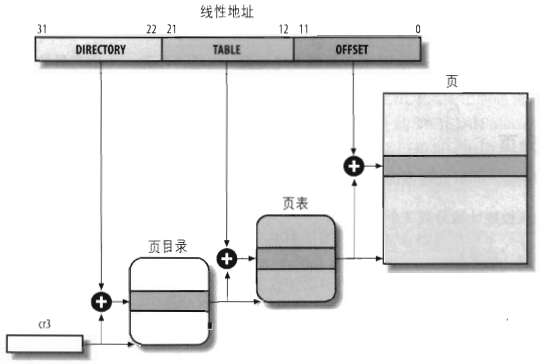

##	地址

-	三类地址
	-	*Physical Address* 物理地址：*CPU* 总线地址，对应 *CPU* 地址引脚发送到内存总线的电信号
		-	无符号整数，长度取决于平台
		-	用于内存芯片级内存单元寻址
		-	大部分对应设备主存，也被映射至显存、*BIOS* 等其他存储器
	-	*Linear Address*、*Virtual Address* 线性地址：逻辑地址与物理地址变换中间层
		-	无符号整数，长度取决于平台
		-	在包含虚拟存储器（虚拟寻址空间）机器上，线性地址在 *MMU* 中被转换物理地址
	-	*Logical Address* 逻辑地址、相对地址：机器语言指令中，用于指定操作数、指令的地址
		-	线性地址 = 段内偏移量 + 段基地址
			-	*Segment Selector* 段选择符：决定段基地址
			-	*Offset* （段内）偏移量
		-	将逻辑地址划分配至不同线性地址空间

###	*(Paged) Memmory Management Unit*

-	*PMMU*、*MMU* （分页）内存管理单元：负责处理 *CPU* 内存访问请求
	-	功能
		-	虚拟内存管理：转换逻辑地址、线性地址、物理地址
		-	内存保护
		-	*CPU* 高速缓存控制
	-	当无 *RAM* 与线性地址页关联时，*MMU* 将禁止对虚拟地址页的访问
		-	并抛出 *Page Fault* 缺页中断
		-	之后由内核分配物理内存帧、创建关联 *PTE*
	-	优势
		-	*MMU* 分配虚拟寻址可避免非法内存访问
		-	将不连续的物理块映射为连续线性地址，避免内存碎片化

-	*MMU* 通过以下机制将虚拟页号转换为物理页号，结合页偏移量即得到完整物理地址
	-	*Translation Lookaside Buffer* 转译旁观缓冲器：相联的高速缓存
	-	*Page Table* 分页表，其中数据项即为 *Page Table Entry*
	-	*TLB*、*PTE* 中包含信息包括
		-	*Dirt Bit* 脏位：写入状态
		-	*Accessed Bit* 访问位：最后使用时间，以便 *LRU* 实现
		-	权限位：可读、写页的进程状态
		-	页是否应被告诉缓冲

-	*MMU* 相关硬件电路
	-	*Segment Unit* 分段单元：将逻辑地址转换为线性地址
	-	*Paging Unit* 分页单元：将线性地址转换为物理地址
	-	*Memory Arbiter* 内存仲裁器：对多核心并发访问内存进行排序（内存读写只能串行）
		-	位于总线和每个 *RAM* 芯片间
		-	单处理器系统中也包含类似的 *DMA* 控制器

##	硬件分段

-	80x86 架构鼓励程序员将程序按逻辑分段
	-	分段、分页均可划分进程物理地址空间，功能冗余
		-	分段：给不同进程划分不同线性地址空间
		-	分页：将相同线性地址空间映射至不同物理地址空间

-	*Read Mode* 实模式：`物理地址 = 段基址 << 4 + 段内偏移`
	-	不区分代码、数据，容易因非法内存访问造成问题
	-	Intel 早期 x86 模型采用，当时段基址寄存器位 16、地址位（总线数目） 20
		-	为访问 64kb 以上内存，需对内存分段

-	*Protected Mode* 保护模式：
	-	地址保护：线性地址转换为物理地址对进程透明
	-	边界保护：段寄存器存储段索引而不是段基址，在 *GDT* 中查找段描述符

###	*Segment Selector*

-	*Segment Selector* 段选择符 16bits：指示段描述符位置
	-	*Index* 索引号 13bits：放在 *GDT*、*LDT* 的相应段描述符入口
		-	`index * 8 + gdtr` 即段描述符地址
		-	则 *GDT* 最大能容纳 $2^{13}$ 项段描述符
	-	*Table Indicator* *TI* 标志 1bit：指明段描述符位置
		-	`0`：位于 *GDT* 中
		-	`1`：位于 *LDT* 中
	-	*RPL* 请求者特权等级 2bits
		-	在代码段（对应 `cs` 寄存器）中表示 *CPU* 当前的特权等级 *Current Privilege Level*
			-	`0 - 3` 优先级降低：*Linux* 仅使用 0、3，称为内核态、用户态
			-	*CPU* 特权阶级改变时，需同步更新段寄存器值

-	段寄存器：存放段选择符，方便快速寻找
	-	只有 6 个段寄存器，可通过和内存交互数据将段寄存器用于不同目的
		-	`cs`：代码段寄存器
		-	`ss`：栈段寄存器
		-	`ds`：数据段寄存器
		-	`es`、`fs`、`gs`：可指向任意数据段
	-	*CPL* 改变时，部分段寄存器需要相应的更新

###	*Segment Descriptor*

-	*Segment Descriptor* 段描述符：8B 描述段特征，存放在 *GDT*、或 *LDT* 中，包含 8 个字段
	-	`Base` 32bits：段首字节线性地址
	-	`G` 20bits：粒度标志
		-	`0`：段以字节为单位
		-	否则：段以 4KB 位单位
	-	`Limit`：段中最后内存单元偏移量，决定段长度
		-	`G` 置 0 时，段大小为 1B 至 1MB
		-	否则，段大小在位 4KB 至 4GB
	-	`S`：系统标志
		-	`0`：系统段，存储诸如 `LDT` 关键数据结构
		-	否则，普通代码段、数据段
	-	`Type` 4bits：段类型特征、存取权限
	-	`Description Priviliege Level` 描述符特权级 2bits：限制对段的存取，访问段要求的最低 *CPU* 特权等级
	-	`P`：*Segment Present* 标志
		-	`0`：段当前不在主存中
		-	`1`：*Linux* 总是设置为 1，因为从不把整个段交换至磁盘
	-	`D`、`B`：根据为代码段、数据段含义不同
		-	若段偏移量地址为 32bits 长，则置为 1
		-	若段偏移量地址为 16bits 长，则清 0
	-	`AVL` 标志：操作系统使用，但被 *Linux* 忽略

	

-	*Linux* 中广泛采用的段描述符类型
	-	代码段描述符
		-	位于 *GDT*、*LDT* 中
		-	`S` 位置 1
	-	数据段描述符
		-	位于 *GDT*、*LDT* 中
		-	`S` 位置 1
	-	*TSSD* 任务状态段描述符：保存寄存器内容
		-	只能位于 *GDT* 中
		-	`S` 位置 0
		-	`Type` 位根据是否运行置 11、9
	-	*LDTD* 局部描述符表描述符：包含 *LDT* 的段
		-	只能位于 *GDT* 中
		-	`S` 位置 0
		-	`Type` 位置 2

####	*Global/Local Description Table*

-	*GDT* 全局描述符表、*LDT* 局部描述符表：存放段描述符
	-	通常只定义一个 *GDT*
		-	`gdtr` 寄存器：存放 *GDT* 在主存中地址、大小
	-	若进程需要创建 *GDT* 之外的段，可以创建自有 *LDT*
		-	`ldtr` 寄存器：存放当前正在使用 *LDT* 在主存中地址、大小

####	访问段描述符

-	段描述符（线性）地址 = *GDT* 基址 + 8 * 段选择符高 13bits

-	快速访问：80x86 处理器提供与 6 个段寄存器对应的寄存器、非编程的、8B 大小的寄存器
	-	段选择符装载段寄存器时，对应非编程寄存器装载对应的段描述符
		-	此后，针对该段的逻辑地址转换为线性地址无需访问内存，可加速

> - 非编程的：不可被程序员设置

###	*Segmentation Unit*

##	*Linux* 中分段

-	*Linux* 仅在 80x86 架构下使用分段，更倾向使用分页
	-	所有进程使用相同段寄存器时，内存管理更简单，可共用相同线性地址
	-	诸如 *RISC* 架构对分段支持有限

	> - *Linux 2.6* 仅在 80x86 架构下使用分段

###	代码段、数据段

|段|Base|G|Limit|S|Type|DPL|D/B|P|
|-----|-----|-----|-----|-----|-----|-----|-----|-----|
|用户代码段|`0x00000000`|`1`|`0xfffff`|`1`|`10`|`3`|`1`|`1`|
|用户数据段|`0x00000000`|`1`|`0xfffff`|`1`|`2`|`3`|`1`|`1`|
|内核代码段|`0x00000000`|`1`|`0xfffff`|`1`|`10`|`0`|`1`|`1`|
|内核数据段|`0x00000000`|`1`|`0xfffff`|`1`|`2`|`0`|`1`|`1`|

-	所有用户态进程、内核态进程分别使用一对相同的段对指令、数据寻址
	-	用户态进程
		-	用户代码段
		-	用户数据段
	-	内核态进程
		-	内核代码段
		-	内核数据段
	-	相应段选择符由宏 `__USER_CS`、`__USER_DS`、`__KERNEL_CS`、`__KERNEL_DS` 分别定义

-	说明
	-	页大小为 4KB 时，逻辑地址范围为 $2^{32} - 1$，则所有进程可使用相同逻辑地址
	-	又所有段起始地址为 `0x0000000`，则逻辑地址（中偏移量）与线性地址一致
	-	所有进程使用相同的段，则保存时无需保存段选择符，寄存器中载入相应的宏即可

###	*Linux GDT*、常见段

-	每个 *CPU* 对应一个 *GDT* 副本，存放在 `cpu_gdt_table` 数组中
	-	所有 *GDT* 地址、大小存放在 `cpu_gdt_descr` 数组中
		-	用于初始化 `gdtr` 寄存器
	-	除少数情况下外，各处理器副本中存放相同表项，除
		-	各副本中 *TSSD* 不同
		-	部分表项依赖 *CPU* 正在执行的进程：*LDTD*、*TLSD*
		-	处理器可能临时修改副本中某项

-	*GDT* 中描述符指向（`Base` 字段）的有效段（上图为例）
	-	用户态、内核态的代码段、数据段：4 个
	-	*TSS* 任务状态段：1 个，各处理器上 *GDT* 中描述符不同
	-	缺省 *LDTD* 局部描述符表
		-	通常为所有进程共享
	-	*Thread-Local Storage* 局部线程存储段：3 个
		-	允许多线程应用使用最多 3 个局部于线程的数据段
		-	通过系统调用 `set_thread_area()`、`get_thread_area()` 为正在执行的进程创建、撤销 *TLS* 段
	-	*AMP* 高级电源管理相关段：3 个
		-	当 *Linux APM* 驱动调用 *BIOS* 函数时，由 *BIOS* 函数使用的代码段、数据段
	-	*PnP* 支持即插即用功能 *BIOS* 服务程序相关段：5 个
	-	*Double Fault TSS* 段
		-	被内核用于处理“双重错误”的特殊

-	每个 *GDT* 包含 14 个空、未使用、保留项
	-	首项段描述符总为 0，保证空段描述符逻辑地址无效，触发异常
	-	未使用项是为保证经常一同被访问的描述符能同处于同一 32B 硬件高速缓存行中

###	*Linux LDT*

-	缺省 *LDT* 存放在 `default_ldt` 数组中，供大多数进程共享
	-	内核仅使用其 5 项中 2 项
		-	*iBCS* 执行文件的调用门
		-	*Solaris/x86* 可执行文件的调用们
	-	大部分情况下用户态进程不使用 *LDT*

-	可通过 `modify_ldt()` 系统调用创建自定义 *LDT*
	-	*CPU* 执行拥有自定义 *LDT* 进程时，*GDT* 副本中 *LDT* 表项被修改
		-	当前进程 *LDT* 地址、大小存放在 `ldtr` 控制寄存器中
	-	用户态进程同样可使用 `modify_ldt()` 分配新段，但新段对内核透明
	-	适用场合
		-	*Wine*，执行面向段的程序

> - 调用门：80x86 处理器提供，用于在调用预定义函数时改变 *CPU* 特权级

##	硬件分页

-	*Page* 页：线性地址分成的固定长度的组
	-	页内连续的线性地址被映射为连续的物理地址
		-	内核仅需指定页物理地址和其存取权限，而无需指定页包含的所有线性地址的存取权限
		-	页既指一组线性地址，也指包含在地址中的数据
	-	*Page Frame* 页框（物理页）：*RAM* 中固定长度存储区域，长度与页一致，存储页内容
	-	*Page Table* 页表：将线性地址映射到物理地址的数据结构
		-	存放在主存中，在启用分页单元前需由内核进行适当初始化

-	*Paging Unit* 分页单元：将线性地址转换为物理地址
	-	比较请求的访问类型、线性地址的访问权限
		-	若内存访问无效，产生缺页异常

###	常规分页

-	80x86 平台相关架构背景
	-	Intel 80386 架构开始支持分页，分页单元处理 4KB 大小的页
	-	常规分页：32bits 系统、32bits 地址引脚、4KB 页

-	分页单元转换线性地址为物理地址时，32bits 虚拟地址可分为 3 个域
	-	*Directory* 目录域 10bits：指定页目录表中目录项
		-	4KB 大小页中即存储 4B 目录表项 1K 个
	-	*Table* 页表 10bits：指定页表中页表项
		-	4KB 大小页中即存储 4B 页表项 1K 个
	-	*Offset* 偏移量 12bits：页框内相对位置
		-	12bits 长度即对应 4KB 页大小

> - 线性地址各段均表示偏移，表项字段以表项为单位偏移，偏移字段以字节为单位偏移，（页）基址存存储在表项中

-	线性地址转换分两步完成，分别基于 *Page Directory*、*Page Table* 做转换
	-	*Page Directory* 页目录表：其中目录项指向页表
	-	*Page Table* 页表：其中页表项指向页所在页框的物理地址
	-	二级转换模式可减少进页表所需的 *RAM* 数量
		-	进程并不使用所有页表范围内所有地址
		-	活动进程分配有页目录表，页表仅在进程实际需要时才分配
	-	`cr3` 寄存器存放进程目录页表的物理地址

####	表项结构

-	页目录项、页表项 32bits 结构相同
	-	`Present` 标志：表项是否位于主存中
		-	置 0 时页不位于主存中，剩余位由系统自定义功能
		-	若执行地址转换所需的目录项、页表项中 `Present` 标志清 0，分页单元将把线性地址存放在 `cr2` 寄存器中，并产生缺页异常
	-	页框物理地址高位 20bits
		-	页框为 4KB，则其物理地址最低 12bits 总为 0，无需存储
	-	`Accessed` 标志：分页单元对页框寻址时设置
		-	页被交换出去时，标志交由操作系统使用
	-	`Dirty` 标志：对页框进行写操作时设置
		-	只应用于页表项
		-	页被交换出去时，标志交由操作系统使用
	-	`Read/Write` 标志：页、页表的存取权限
		-	置 0 时，页、页表只读
		-	置 1 时，页、页表可读写
	-	`User/Supervisor` 标志：访问页、页表所需特权等级
		-	置 0 时，只有 *CPL* 小于 3 时，才能对页、页表寻址，对 *Linux* 即要求内核态
		-	置 1 时，总能对页、页表寻址
	-	`PCD`、`PWT` 标志：控制高速告诉缓存处理页、页表的方式
	-	`Page Size` 标志：置 1 时，页目录项指向 2MB、或 4MB 的扩展分页页框
		-	只应用于页目录项
	-	`Global` 标志：防止常用页从 *TLB* 告诉缓存换出
		-	只应用于页表项
		-	仅在 `cr4` 寄存器的 `PGE` 标志置位时才起作用

###	*Extended Paging*

-	扩展分页：允许页框大小为 4MB
	-	扩展分页用于将大段连续线性地址转换成相应物理地址
	-	此时无需中间页表进行地址转换，节省内存、保留 *TLB* 项

-	此时，分页单元将 32bits 线性地址分为 2 部分
	-	*Directory* 目录域 10bits：指定页目录表中目录项
	-	*Offset* 偏移量 22bits：页框内相对位置

> - 从 Pentium 模型开始，80x86 架构引入扩展分页
> - 扩展分页可理解为将缩短线性地址分级，页大小取决于线性地址分级方式

###	*Physical Address Extension*

-	80x86 平台相关架构背景
	-	Intel *CPU* 地址引脚数从 32 增加到 36，满足大于 4GB 内存寻址的需求，相应的需要引入新分页机制
	-	*PAE* 机制于 Pentium Pro 开始引入
		-	置位 `cr4` 寄存器中 `PAE` 标志激活 *PAE*
	-	*Page Size Extension* 机制于 Pentium III 开始引入，*Linux* 未采用

-	*PAE* 物理地址扩展分页机制对原常规分页机制的改变
	-	目录项、页表项由 32bits 变为 64bits，则 4KB 页中包含 512 表项
		-	物理地址变为 24bits，对应 $2^{24}$ 页框
		-	页表项共需要 36bits 存储地址、标志位，向上取整 64bits
	-	*Page Directory Pointer Table* 页目录指针表：由 4 个 64 位表项组成
		-	页表新（最高）级别
		-	`cr3` 寄存器中存储 27bits *PDPT* 基地址字段
		-	寻址 4GB 以上时，则需修改 `cr3` 寄存器值、或修改 *PDPT* 内容
	-	32bits 地址解释
		-	`cr3` 寄存器：指向一个 *PDPT*
		-	`31-30`：指定 *PDPT* 中一个
		-	`29-21`：指定页目录表中页目录项
		-	`20-12`：指定页表中页表项
			-	4KB 中仅包含 512 表项，仅需 9bits 即可寻址
			-	相应的扩展分页时，19bits 决定大尺寸页大小为 2MB
		-	`11-0`：4KB 页框中偏移
	-	页目录项中 `Page Size` 标志置位时，大尺寸页大小为 2MB

-	*PAE* 分页机制特点
	-	未扩大进程线性地址空间
	-	线性地址仍为 32bits，会出现同一线性地址映射不同 *RAM* 区
	-	只有内核内修改进程页表，用户态进程无法使用大于 4GB 的物理地址空间

###	64bits 平台分页

|平台|页大小|寻址位数|分页级别数|线性地址分级|
|-----|-----|-----|-----|-----|
|*alpha*|8KB|43|3|10+10+10+13|
|*ia64*|4KB|39|3|9+9+9+12|
|*ppc64*|4KB|41|3|10+10+9+12|
|*sh64*|4KB|41|3|10+10+9+12|
|*x86_64*|4KB|48|4|9+9+9+9+12|

-	为降低各级页目录、页表中表项数量，64bits 处理器均使用 3 级或以上的分页级别

###	*Hardware Cache*

-	硬件高速缓存：基于局部性原理设计，用硬件存放最近、最常使用的代码、数据
	-	以脉冲突发模式在慢速 *DRAM*、高速 *SRAM* 间传送行实现高速缓存
	-	大部分高速缓存 是 *N-way Set Associative*：主存中任意行可以放在高速缓存 N 行中任意行中，极端情况下
		-	*Direct Mapped* 可直接映射的：主存中某行总是存放在高速缓存中相同位置
		-	*Fully Associative* 充分关联的：主存中任意行可以放在高速缓存中任意位置

> - *Line* 行：几十个连续字节

####	硬件实现

-	高速缓存单元位于分页单元、主存之间
	-	*cache hit* 高速缓存命中时，高速缓存根据存取类型进行不同操作
		-	读操作：控制器从高速缓存中选择数据送至 *CPU* 寄存器，节省时间
		-	*Write-through* 通写：控制器同时写 *RAM*、高速缓存
		-	*Write-back* 回写：只更新高速缓存，之后再写回 *RAM*
			-	*CPU* 执行要求刷新高速缓存表项的指令
			-	`FLUSH` 硬件信号产生
	-	*cache miss* 高速缓存未命中时，高速缓存行写回内存中
		-	若有必要，将正确行从 *RAM* 中读入高速缓存中

-	多处理器中每个处理器有单独的硬件高速缓存
	-	*Hardware Cache Memory* 高速缓存内存：存放真正行
	-	*Cache Controller* 高速缓存控制器：存放表项数组，每个表项对应内存中行
		-	表项包含标签、描述缓存行状态标志，区分行映射的内存单元
	-	各处理器高速缓存间需要额外硬件电路保持内容同步
		-	*Cache Snooping* 高速缓存侦听：本地硬件高速缓存更新之后，需要检查、更新其他硬件高速缓存

-	80x86 平台相关架构背景
	-	`cr0` 寄存器中
		-	`CD` 标志位控制高速缓存功能启用
		-	`NW` 标志位控制通写、回写策略
	-	多级高速缓存：*L1-Cache*、*L2-Cache*、*L3-Cache* 等在容量、速度之间有差异的分级高速缓存硬件
	-	Pentium 架构允许操作系统将不同高速缓存管理策略与页框关联，每个表项包含标志
		-	`Page Cache Disablt`：禁用高速缓存
		-	`Page Write-Through`：写数据时采用通写策略
		-	*Linux* 总是复位两个标志，即所有页框启用高速缓冲、总是采取回写策略

> - *Locality Principle* 局部性原理：最近、最常用的相邻地址结构在最近的将来又被用到的可性能极大

###	*Translation Lookaside Buffer*

-	*TLB* 转换后援缓冲器：存储线性地址、由虚拟地址计算的物理地址映射
	-	多处理系统中，每个 *CPU* 有自己的 *TLB*
		-	*TLB* 表项不必同步，因为线性地址可以映射至多个物理地址
	-	`cr3` 寄存器修改时，硬件自动失效本地 *TLB* 表项，因为新的页表被启用

##	*Linux* 中分页

-	*Linux* 采用了同时适合 32bits、64bits 平台的分页模型
	-	从 2.6.11 版本开始，采用 4 级分页模型（支持 x86_64 平台对线性地址的划分）
		-	*Page Global Directory*：页全局目录
		-	*Page Upper Directory*：页上级目录
		-	*Page Middle Directory*：页中间目录
		-	*Page Table*：页表
	-	*Linux* 通过以下宏设置各级页表偏移量，控制各级页表生效、映射区域大小
		-	`PAGE_SHIFT`、`PAGE_SIZE`、`PAGE_MASK`
		-	`PMD_SHIFT`、`PMD_SIZE`、`PMB_MASK`
		-	`PUD_SHIFT`、`PUD_SIZE`、`PUB_MASK`
		-	`PGDIR_SHIFT`、`PGDIR_SIZE`、`PGDIR_MASK`

-	每个进程有 **独立的** 页表
	-	进程切换时，*Linux* 将 `cr3` 寄存器内容保存在前一个进程描述符中，并载入要执行进程描述符中的 `cr3` 值

###	物理内存布局

-	内核尝试从 *BIOS* 处获取内存映射表，否则按照保守的缺省设置构建
	-	内核将下列页框标记为保留，不能被动态分配、交换至磁盘
		-	不可用物理地址范围内页框（初始化阶段由内核标记）
		-	含有内核代码、已初始化数据结构的页框
	-	内核可能无法见到 *BIOS* 报告的所有物理内存，如：内存大小超过内核寻址上限
	-	内核物理地址问询逻辑
		-	内核问询 *BIOS* 获取物理内存大小
		-	内核执行 `machine_specific_memory_setup()` 函数，建立物理地址映射
			-	可根据 *BIOS* 提供的物理地址映射表构建
			-	若无法从 *BIOS* 获取映射表，按保守的缺省设置构建
		-	内核执行 `set_memory()` 函数，分析物理内存区域并初始化变量描述内存布局

-	物理内存布局情况
	-	首个 MB 地址，即页框 `0x0 - 0x100` 被内核跳过，避免内核装入不连续页框中
		-	页框 0 由 *BIOS* 使用，存放 *POST* 期间检查到的系统硬件配置
		-	物理地址 `0x000a 0000 - 0xffff ffff` 留给 * BIOS* 例程
		-	首个 MB 中其他页框可能被特定计算机模型保留、或空闲
	-	可供内核使用物理内存
	-	*BIOS*、硬件信息相关物理内存：之后可能被释放
		-	*POST* 阶段 *BIOS* 写入的硬件设备信息
		-	硬件设备 *ROM* 芯片内存映射

###	进程页表

-	进程线性地址空间分两部分
	-	`0x0000 0000 - 0xbfff ffff`：内核态、用户态进程均可寻址
		-	此部分对应页全局目录前 768 项（*PAE* 启用时对应前 3 项）
			-	具体数量、内容依赖进程
		-	内核态进程需要访问用户态线性地址空间才会产生此区间线性地址
	-	`0xc000 0000 - 0xffff ffff`：内核态进程才可寻址
		-	此部分对应页全局目录后 256 项（*PAE* 启用时对应最后项）
			-	数量、内容应相同，均为主内核页全局目录相应表项
		-	宏 `PAGE_OFFSET` 值即为 `0xc000 0000`，表示内核态线性地址偏移量

###	内核页表

-	*Master Kernel Page Global Directory* 主内核页全局目录：内核维持、供自己使用的页表
	-	系统初始化后，主内核页全局目的最高目录项作为普通进程页全局目录的参考模型
	-	内核对主内核页全局目录的修改能传递到进程实际使用的也全局目录中

-	内核页表初始化分为两个阶段
	-	内核创建有限地址空间（临时内核页表），向 *RAM* 装入内核、初始化核心数据结构
		-	内核代码段、数据段
		-	初始化页表
		-	存放动态数据结构的 128KB 空间
	-	内核充分利用剩余 *RAM* 建立分页表

> - 内核页表可能将线性地址映射至任意物理地址，所以需要建立对全部物理地址（不超过范围）的映射，即不会按照内核地址、用户地址空间比例映射部分物理地址

####	临时内核页表

-	临时内核页表：用于内核初始化阶段
	-	目标：允许实模式下、保护模式下均能对 *RAM* 前 8MB 寻址
		-	内核装入内存后，*CPU* 仍运行于实模式，分页功能未启用
		-	需可通过移位映射得到物理地址
	-	假设内核段、临时页表、128KB 内存范围能容纳于前 8MB
	-	内核需要创建两组页表映射，保证如下线性地址对物理地址 `0x0000 0000 - 0x007f ffff` 的映射
		-	`0x0000 0000 - 0x007f ffff`：用户态地址
		-	`0xc000 0000 - 0xc07f ffff`：内核态地址

-	临时页全局目录：存放在 `swapper_pg_dir` 变量中
	-	`swapper_pg_dir` 变量共 1024 项（32bits 系统最大值）
		-	映射前 8MB 内核地址空间仅需初始化 2 项
		-	实际会同时将用户空间前 8MB 也映射至物理内存前 8MB
	-	临时也全局在内核编译过程中静态初始化
		-	将除 `0`、`1`、`0x300`、`0x301` 外项置 0
		-	将 `0`、`1` 项置为 `pg0` 的物理地址，`1`、`0x301` 项置 `pg0` 后的页框物理地址
			-	`Present`、`Read/Write`、`User/Supervisor` 标志置位
			-	`Accessed`、`Dirty`、`PCD`、`PWD`、`Page Size` 标志复位
	-	说明
		-	`swapper_pg_dir` 位于内核初始化数据段处
		-	`pg0` 变量紧接在内核未初始化数据段之后

-	临时页表：从 `pg0` 变量处开始存放
	-	在 `startup_32()` 汇编语言函数中初始化
	-	`startup_32()` 函数同时启用分页单元
		-	设置 `cr0` 寄存器中 `PG` 标志
		-	向 `cr3` 寄存器中装入 `swapper_pg_dir` 物理地址

####	最终内核页表

-	最终内核页表
	-	内核页表提供的最终映射需把 `0xc000 0000` 开始的线性地址转换为 0 开始的物理地址
	-	宏 `__pa` 将 `PAGE_OFFSET` 开始的线性地址转换为相应物理地址，宏 `__va` 反之

-	*RAM* 小于 896MB 时最终内核页表：此时可将全部物理内存映射至内存地址空间
	-	主内核页全局目录：依然存放在 `swapper_pg_dir` 变量中，由 `paging_init()` 函数初始化
		-	调用 `pagetable_init()` 适当建立页表项
		-	向 `cr3` 寄存器写入 `swapper_pg_dir` 物理地址
		-	根据 *CPU* 支持、内核编译情况置位 `cr4` 寄存器中 `PAE` 标志位
		-	调用 `__flush_tlb_all()` 无效 *TLB* 缓存
		-	从第 `0x301` 项（即 `0xc000 0000` 地址开始）开始初始化 224 项内核目录项
			-	清除 `User/Supervisor` 标志位
	-	页表
		-	临时页表对物理内存前 8MB 的恒等映射由 `zap_low_mappings()` 函数清除

> - 线性地址最高 128MB 被用于非连续内存分配、固定映射

-	*RAM* 大小在 896MB 与 4096MB 之间的最终内核页表：类似 *RAM* 小于 896MB 情况
	-	内核仅将 896MB 的 *RAM* 窗口映射到内核线性地址空间
	-	需通过动态重映射实现对 *RAM* 其余部分的寻址

-	*RAM* 大于 4096MB 时最终内核页表：使用 3 级分页模型
	-	页全局目录
		-	前三项与用户线性地址空间对应，内核用空页地址初始化
		-	第四项用真实页中间目录地址初始化
	-	页中间目录：通过调用 `alloc_bootmem_low_pages()` 分配
		-	前 448 中间目录项用 *RAM* 前 896MB 物理地址填充
	-	之后，页全局目录第 4 项拷贝至第 1 项，作为线性地址空间前 896MB 对低物理内存的映射
		-	*SMP* 系统初始化中，此映射必须
		-	映射不再必要时，可以调用 `zap_low_mapping()` 函数清除

###	固定映射的线性地址

-	*Fix-mapped Linear Address* 固定映射的线性地址
	-	每个固定映射的线性地址都映射一个 **物理内存的页框**
		-	对应物理地址可以以任意方式建立
		-	而第 4GB 前 896MB 线性地址映射是线性映射：物理地址 = 线性地址 - `PAGE_OFFSET`
	-	内核使用固定映射的线性地址替代值不改变的指针变量
		-	引用立即常量地址比间接引用指针变量减少内存访问次数（避免了多级页目录）
		-	引用常量线性地址无需对值进行检查
	-	固定映射的线性地址由定义在 `enum fixed_addresses` 枚举类型中整形索引表示
		-	`fix_to_virt()` 函数计算给定索引对应的常量固定映射线性地址
		-	`set_fixmap()`、`set_fixmap_nocache()` 将物理地址、固定映射的线性地址相关联
			-	将固定映射的线性地址的对应页表项初始化为指定物理地址
		-	`clear_fixmap()` 撤销固定映射的线性地址、物理地址之间的联结

###	*64bits Linux*

-	64bits Linux 使用 48bits 寻址，高 16 位取值同第 47 位（全 0 或全 1）
	-	最多管理 256T 地址空间
	-	*User Space* 寻址范围：`0x0000 0000 0000 0000 - 0x0000 7FFF FFFF FFFF`
	-	*Kernel Space* 寻址范围：`0xFFFF 8000 0000 0000 - 0xFFFF FFFF FFFF FFFF`

###	硬件高速缓存、*TLB* 寻址

-	硬件高速缓存
	-	硬件高速缓存通过高速缓存行寻址
		-	`L1_CACHE_BYTES` 宏产生以字节为单位的高速缓存行大小
	-	内核通过以下策略优化高速缓存命中率
		-	数据结构中最常用字段放在数据结构中低偏移部分，使其内处于高速缓存同一行中
		-	内核为大量数据结构分配空间时，试图将其放在都放在内存中，以便所有高速缓存行按同一方式使用

