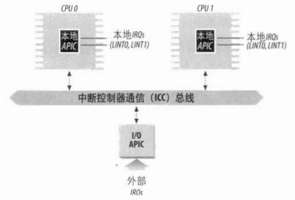
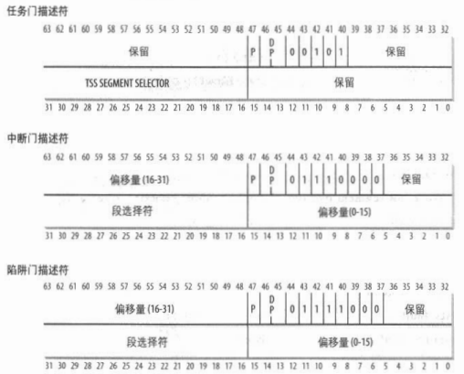
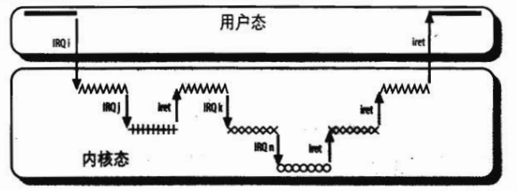
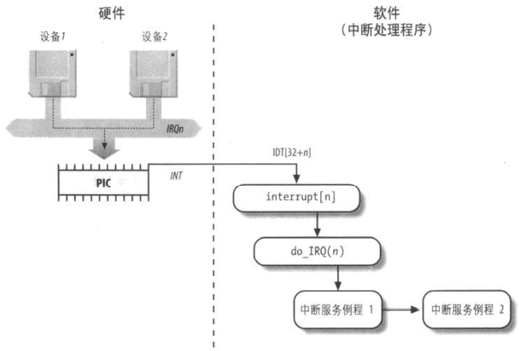
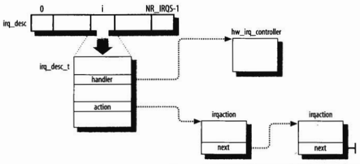

##	*Interrupt*

-	中断：改变处理器执行指令顺序的事件
	-	中断事件与 *CPU* 内、外部硬件电路产生电信号相对应
		-	同步中断：指令执行时，由 *CPU* 控制单元产生
		-	异步中断：其他硬件设备按照 *CPU* 时间信号随机产生
	-	中断信号的作用：提供一种特殊方式，使处理器运行正常控制流之外的代码
	-	中断信号到达时，*CPU* 切换到执行中断（异常）处理程序，因此需
		-	须在内核态堆栈上保存程序计数器当前值（即 `eip`、`cs` 寄存器）
		-	将与中断信号类型相关的地址放入程序计数器

> - Intel 处理器将同步中断称为异常、异步中断称为中断，下沿用 Intel 文档分类，并另用“中断信号”统称

-	中断（异常）处理程序是一种内核控制路径
	-	中断（异常）处理程序比进程“轻”
		-	中断上下文少
		-	建立、终止中断处理耗时短
	-	中断（异常）处理是内核执行的最敏感任务之一，需要满足
		-	中断（异常）要能尽快处理完
			-	关键而紧集部分，内核立即执行
			-	可推迟部分，内核随后执行
		-	中断（异常）处理程序须能嵌套执行
			-	应尽可能允许中断处理嵌套，提高工作效率
			-	最终内核控制路径终止时，内核需要能恢复被中断进程的执行、切换到另外进程
		-	内核代码中可设置中断被禁止的临界区
			-	临界区范围应被限制，内核大部分时间应以开中断方式运行

###	同步中断（异常）

-	*Sychronous Interrupt* 同步中断、*Exception* 异常：指令执行后由 *CPU* 控制单元产生
	-	*Processor-detected exception* 处理器探测异常：*CPU* 执行指令时，探测到反常条件产生的异常
		-	*Fault* 故障：通常可以纠正，纠正后程序可继续
			-	`eip` 寄存器中：为引起故障的指令地址
			-	异常处理程序终止后，故障指令被重新执行，程序继续
		-	*Trap* 陷阱：陷阱指令执行后立即报告，内将控制权返回给程序后即可继续执行
			-	`eip` 寄存器中：随后要执行的指令地址
			-	主要用途为调试程序，此时中断信号被用于通知调试程序特殊指令已执行
		-	*Abort* 异常中止：发生严重错误，处理程序只能强制终止受影响程序
			-	控制单元出现问题，无法在 `eip` 寄存器中保存引起异常的指令的位置
			-	用于报告严重错误
	-	*Programmed Exception* 编程异常、*Software Interrupt* 软中断
		-	触发条件
			-	`int`、`int3` 指令
			-	`into` 检查溢出、`bound` 检查地址越界指令检查结果为假
		-	控制单元把编程异常视为陷阱处理
		-	用途
			-	执行系统调用
			-	向调试程序报告特定事件

> - 同步：只有在指令后 *CPU* 才会发出中断

###	异步中断

-	*Asynchronous Interrupt* 异步中断、中断：其他硬件设备按照 *CPU* 时钟信号随机产生
	-	*Markable Interrupt* 可屏蔽中断：可以处于屏蔽的、非屏蔽的两种状态
		-	处于屏蔽状态时将被控制单元忽略
		-	*I/O* 设备发出的所有中断请求都产生可屏蔽中断
	-	*NonMaskable Interrupt* 非屏蔽中断
		-	非屏蔽中断总是由 *CPU* 辨认
		-	只有危急事件（如硬件故障）才引起非屏蔽中断

> - 其他设备：间隔定时器、*I/O* 设备等

####	*Interrupt ReQuest*、*PIC*

-	*IRQ* 线：每个能发出中断请求的硬件设备控制器都具有 *IRQ* 线，可能有多根
	-	*IRQ* 线从 0 开始顺序编号，可表示为 `IRQn`
	-	所有 *IRQ* 输出线与 *PIC* 输入引脚相连

-	*Programmable Interrupt Controller* 可编程中断控制器
	-	*PIC* 循环执行下列动作
		-	监视 *IRQ* 线，检查产生的信号（多个信号则选择引脚编号较小者）
		-	将信号转换为对应向量，存放在 *PIC* 的 *I/O* 端口，允许 *CPU* 通过总线读取
		-	将信号发送至 *CPU* 的 `INTR` 引脚，产生中断
		-	等待，直至 *CPU* 将中断信号写入 *PIC* 的 *I/O* 端口进行确认，此时清 `INTR` 线
	-	可对 *PIC* 编程从而禁止、激活指定 *IRQ* 线
		-	禁止的中断不会丢失，激活之后 *PIC* 会从新发送至 *CPU*
		-	允许中断处理程序依次处理同类型 *IRQ*

-	传统 *PIC* 由两片 8259A 风格的外部芯片级联
	-	每个芯片处理 8 个 *IRQ* 输入线
	-	主芯片 `INT` 输出线直连处理器 `INTR` 引脚
	-	从芯片 `INT` 输出线连接至主芯片 `IRQ2` 引脚，即 *IRQ* 线限制 15

>  - `eflags` 寄存器 `IF` 复位时，*PIC* 发布的每个可屏蔽中断被暂时忽略，这与禁止、激活*IRQ* 线不同

####	*I/O Advanced PIC*



-	*I/O Advanced PIC*：起路由作用，发挥 *SMP* 体系结构并行性
	-	*I/O APIC* 结构
		-	24 条 *IRQ* 线
		-	24 项的 *Interrupt Redirection Table*
		-	可编程寄存器
		-	通过 *APIC* 总线发送、接收 *APIC* 信息的信息单元
	-	*IRT* 将外部 *IRQ* 信号转换为消息，通过 *APIC* 总线发送给本地 *APIC* 单元
		-	其中中每项可以被单独编程以指明
			-	中断向量
			-	优先级
			-	目标处理器
			-	选择处理器的方式

-	与 *I/O APIC* 对应的，80x86 处理每个 *CPU* 有本地 *APIC*
	-	本地 *APIC* 结构
		-	32bits 可编程寄存器，包括
			-	*Task Priority Register* 任务优先级寄存器
			-	仲裁优先级寄存器
			-	*Interrupt Command Register* 中断指令寄存器
		-	内部时钟
		-	本地定时设备
		-	为本地 *APIC* 中断保留的两条额外 *IRQ* 线： `LINT0`、`LINT`
	-	*APIC* 总线将 *I/O APIC* 连接到本地 *APIC*

-	外部中断请求分发方式
	-	静态分发：*IRQ* 信号传递给 *IRT* 表项中列出的本地 *APIC*
		-	即中断立刻传给特定一个、一组、所有 *CPU*
	-	动态分发：*IRQ* 信号传递给执行最低优先级进程的 *CPU* 的本地 *APIC*
		-	需要内核每次进程切换时修改 *TPR* 值，否则性能可能达不到最优
		-	若多个 *CPU* 共享最低优先级，通过仲裁技术轮转分发

-	多 *APIC* 系统允许 *CPU* 产生 *InterProcess Interrupt* 处理器间中断
	-	*IPI* 发送方式
		-	*CPU* 在本地 *APIC* 的 *ICR* 中存放中断向量、目标本地 *APIC* 标识符
		-	通过 *APIC* 总线向目标本地 *APIC* 发送中断
	-	*IPI* 是 *SMP* 体系结构重要部分，被 *Linux* 用于在 *CPU* 间交换信息

> - Pentium III 开始引入 *I/O APIC*

###	向量

|向量范围|用途|
|-----|-----|
|`0-19`|非屏蔽中断、异常|
|`20-31`|Intel 保留|
|`32-127`|外部中断 *IRQ*|
|`128`|用于系统调用的可编程异常|
|`129-238`|外部中断 *IRQ*|
|`239`|本地 *APIC* 时钟中断|
|`240`|本地 *APIC* 高温中断|
|`241-250`|*Linux* 预留|
|`251-253`|处理器间中断|
|`254`|本地 *APIC* 错误中断（本地 *APIC* 检测到错误条件时产生）|
|`255`|本地 *APIC* 伪中断（*CPU* 屏蔽某个中断时产生）|

-	中断、异常向量：中断、异常由 `0-255` 间的整数标识，在 Intel 平台中称为向量
	-	非屏蔽中断的向量、异常的向量固定
	-	可屏蔽中断的向量可通过对 *PIC* 编程改变

####	异常向量

-	80x86 架构中设置大约 20 种异常
	-	向量 `0-19` 的异常如下表
	-	向量 `20-31` 被 Intel 保留作未来开发

|向量|异常|异常处理程序|信号|类型|产生原因|
|-----|-----|-----|-----|-----|-----|
|0|*Divide Error*|`divide_error()`|`SIGFPE`|故障|0 除整数|
|1|*Debug*|`debug()`|`SIGTRAP`|陷阱、故障|`eflags` 寄存器 `TF` 标志置位、指令或操作码地址落在活动 `debug` 寄存器范围内|
|2|*NMI*|`nmi()`|*None*|未使用|为非屏蔽中断保留|
|3|*Breakpoint*|`int3()`|`SIGTRAP`|陷阱|`int3` 指令引起|
|4|*Overflow*|`overflow()`|`SIGSEGV`|陷阱|`eflags` 寄存器中 `OF` 标志置位时，`into` 指令执行|
|5|*Bounds Check*|`bounds()`|`SIGSEGV`|故障|对无效地址范围操作数，`bound` 指令被执行|
|6|*Invalid Opcode*|`invalid_op()`|`SIGILL`|故障|*CPU* 检测到无效操作码|
|7|*Device not Available*|`device_not_available()`|*None*|故障|`cr0` 寄存器 `TS` 标置位，`ESCAPE`、`MMX`、`XMM` 指令被执行|
|8|*Double Fault*|`doublefault_fn()`|*None*|异常终止|处理器无法串行处理两个异常|
|9|*Coprocessor Segment Overrun*|`coprocessor_segment_overrun()`|`SIGFPE`|异常终止|外部数学协处理器引起|
|10|*Invalid TSS*|`invalid_tss()`|`SIGSEGV`|故障|试图切换至有无效 *TSS* 进程|
|11|*Segment not Present*|`segment_not_present()`|`SIGBUS`|故障|引用不存在内存段|
|12|*Stack Exception*|`stack_segment()`|`SIGBUS`|故障|指令超过栈段界限、`ss` 标识段不存在|
|13|*General Protection*|`general_protection()`|`SIGSEVG`|故障|违反保护模式下保护规则|
|14|*Page Fault*|`page_fault()`|`SIGSEGV`|故障|页不在内存、页表项为空、违反分页保护机制|
|15|Intel Reserved|*None*|*None*||Intel 保留|
|16|*Floatting Point Error*|`coprocessor_error()`|`SIGFPE`|故障|浮点单元通知错误|
|17|*Alignment Check*|`alignment_check()`|`SIGSEGV`|故障|操作数地址未对齐|
|18|*Machine Check*|`machine_check()`|*None*|异常终止|机器检查机制检测到 *CPU* 错误或总线错误|
|19|*SIMD Floating Point*|`simd_coprocessor_error()`|`SIGFPE`|故障|*SSE* 或 *SSE* 单元通知浮点操作错误|

####	*IRQn* 向量

-	可给物理 *IRQ* 线分配 `32-328` 范围内的任意向量
	-	但 `128` 向量被 *Linux* 保留用于实现系统调用
	-	Intel 平台下，与 *IRQn* 关联的向量缺省为 `n+32`

##	*Interrupt Descriptor Table*

-	*IDT* 中断描述符表：存储中断向量、异常向量的处理程序的入口地址的系统表
	-	`idtr` 寄存器指定 *IDT* 线性基址、最大长度
	-	每个 8B 表项对对应中断、异常，最多 256 项（2048B）
		-	各描述符表项（门）结构不同，但均包含 `DPL` 字段
		-	需设置合适的 `DPL` 字段，防止用户态进程通过 `int` 指令模拟非法中断、异常

> - `int` 指令取值可为 `0-255` 中任意值，即允许用户态进程发送任意中断信号

###	中断描述符（硬件）



-	Intel 硬件提供包含三种类型（结构不同）中断描述符
	-	*Interrupt Gate* 中断门：处理中断
		-	包含字段
			-	段选择符
			-	中断或异常处理程序的段内偏移量
		-	控制权转移到适当段时，处理器清 `IF` 标志，关闭将来可能发生的可屏蔽中断
	-	*Trap Gate* 陷阱门：处理异常
		-	类似中断门，但控制权传递后不修改 `IF` 标志
	-	*Task Gate* 任务门
		-	存放的中断信号发生时，需取代当前进程的进程的 *TSS* 段选择符

> - *Double Fault* 表示内核错误，是唯一由任务门处理的异常

###	中断处理硬件处理

-	`cs`、`eip` 寄存器包含下条指令地址，执行前控制单元会检查上一条指令是否发生中断、异常，若有
	-	确定中断或异常关联的向量 `i`（0~255）
	-	读 `idtr` 寄存器指向的 `IDT` 表的第 `i` 项（假定包含一个中断门或陷阱门）
	-	从 `gdtr` 获得 `GDT` 的基地址，在 `GDT` 中查找 `IDT` 表第 `i` 项中选择符标识的段描述符
		-	该描述符指定中断或异常处理程序所在段的基地址
	-	确信中断是由授权的中断发生源发出
		-	若 `CPL` < `GDT` 中段描述符中 `RPL`，则产生 *General Protection* 异常，即中断处理程序特权不应低于引起中断程序特权
		-	对编程异常，还需比较 `CPL` 与 `IDT` 中的门描述符 `DPL`，大于则产生 *General Protection* 异常，避免用户程序访问特殊的陷阱门或中断门
	-	检查是否发生特权级的变化，若 `CPL` 不等于当前段描述符的 `DPL`，*CPU* 须使用与新特权级相关的栈
		-	读 `tr` 寄存器，访问运行进程的 `TSS` 段
		-	将 `TSS` 中新特权级相关的栈段、栈指针装载 `ss`、`esp` 寄存器
		-	新的栈中保存 `ss`、`esp` 以前的值
	-	如果产生故障，用引起异常的指令的地址装载 `cs` 和 `eip` 寄存器
	-	将 `eflags`、`cs` 及 `eip` 的内容保存到栈中
	-	如果异常产生了一个硬件出错码，保存到栈中
	-	用 `IDT` 表中第 `i` 项门描述符的段选择符和偏移量字段装载 `cs` 和 `eip` 寄存器
		-	此为中断或异常处理程序的第一条指令的逻辑地址

-	中断或异常处理完后，处理程序必产生 `iret` 指令，控制权交给被中断的进程，迫使控制单元
	-	用保存在栈中的值装载 `cs`、`eip` 或 `eflags` 寄存器
		-	如果一个硬件码被压入栈，并在 `eip` 上方，执行 `iret` 前弹出
	-	检查处理程序的 `CPL` 是否等于 `cs` 中低两位，如果是，则 `iret` 终止；否则，转入下一步
	-	返回到与就特权级相关的栈，用栈中内容装载 `ss` 和 `esp` 寄存器。
	-	检查 `ds`、`es`、`fs` 及 `gs` 段寄存器的内容，清除 `DPL` < `CPL` 的寄存器，避免恶意访问

##	*Linux IDT*

###	*Linux IDT* 初始化

-	计算机运行于实模式时，*IDT* 即被初始化并被 *BIOS* 例程使用
	-	内核启用中断前，需装载 *IDT* 地址至 `idtr`、初始化表项
	-	数据结构
		-	`idt_table` 数组：存放 *IDT*，包含 256 表项
		-	`idt_descr` 变量 6B：存储 *IDT* 大小、地址
			-	只有内核使用 `idtr` 指令初始化 `idtr` 寄存器时才使用此变量
	-	内核初始化过程中，汇编函数 `setup_idt()` 用指向 `ignore_int()` 的同一中断门填充所有表项
		-	`ignore_int()` 可视为空处理程序，仅调用 `printk()` 打印系统消息
		-	`ignore_int()` 不应执行，若执行
			-	硬件问题
			-	内核问题

-	*Linux* 接管后，*IDT* 二次初始化
	-	用有意义的异常、中断处理程序替换空处理程序
		-	`trap_init()` 函数将异常处理函数（表项、门）插入 `IDT`，通过以下函数（对应 5 种门）
			-	`set_trap_gate()`
			-	`set_intr_gate()`
			-	`set_system_gate()`
			-	`set_system_intr_gate()`
			-	`set_task_gate()`
	-	初始化完成后
		-	对每个异常，*IDT* 有专门的陷阱门、系统门
		-	对每个 *PIC* 确认的 *IRQ*，*IDT* 包含专门的中断门

###	*Linux* 中断描述符

-	*Linux* 系统按照访问特权（`DPL` 字段取值）细分
	-	*Interrupt Gate* 中断门：负责激活所有 *Linux* 中断处理程序
		-	`DPL` 字段置 0，限制在内核态可访问的 Intel 中断门
	-	*System Interrupt Gate* 系统中断门：激活与向量 3 相关的异常处理程序
		-	`DPL` 字段置 3，能被用户态进程访问的 Intel 中断门
		-	即用户态可使用指令 `int3`
	-	*Trap Gate* 陷阱门：负责激活大部分 *Linux* 异常处理程序
		-	`DPL` 字段置 0，限制在内核态可访问的 Intel 陷阱门
	-	*System Gate* 系统门：激活与向量 4、5、128 相关的异常处理程序
		-	`DPL` 字段置 3，能被用户态进程访问的 Intel 陷阱门
		-	即用户态可使用指令 `into`、`bound`、`int $0x80`
	-	*Task Gate* 任务门：激活 *Double Fault* 异常处理程序
		-	`DPL` 字段置 0，限制在内核态可访问的 Intel 任务门

> - 即只将中断、陷阱门（Intel 架构分类）描述符 `DPL` 字段置 3，避免用户通过 `int` 指令模拟非法中断、异常

##	中断、异常处理程序的嵌套执行



-	内核控制路径可以任意嵌套
	-	原因、优势
		-	提高 *PIC*、设备控制器的吞吐量
		-	方便实现没有优先级的中断模型，无需预定义中断优先级，简化内核代码
	-	为保证内核控制路径可以任意嵌套，**中断处理程序永不阻塞**
		-	即中断处理程序运行期间不能发生进程切换
		-	但，异常处理程序可阻塞，可随进程切换转移到其他处理器上执行
	-	中断处理程序则可以任意嵌套，与异常相关的内核控制路径最多嵌套两次
		-	中断处理程序可以抢占中断处理程序、异常处理程序
			-	中断发生随机
		-	异常处理程序不抢占中断处理程序，因为
			-	缺页异常是唯一会在内核态触发的异常，但从不进一步引起异常
			-	中断处理程序从不执行会导致缺页的操作

> - 每个中断、异常都会引起内核控制路径，即代表当前进程在内核态执行单独的指令序列
> - 多处理器系统上，内核控制路径可以并发执行
> - 假定内核无 Bug，异常大部分在用户态触发，即总是由编程错误、调试程序触发

##	异常处理

-	内核需为每种异常提供专门的异常处理程序
	-	*CPU* 控制单元在执行异常处理程序前会产生硬件出错码，压入内核态堆栈
	-	通常会将 *Unix* 信号发送到引起异常的进程

-	异常处理方式、目标
	-	一般的，内核向引起异常的进程发送信号，进程通过必要步骤恢复、终止运行
	-	但以下两种情况，*Linux* 利用异常管理硬件资源
		-	*Device not Available* 异常（与 `cr0` 寄存器 `TS` 标志）：用于将新值装入浮点寄存器
		-	*Page Fault* 异常：用于推迟给进程分配新页框，直至不能推迟

###	*Double Fault*

-	*Double Fault* 异常表示内核有严重非法操作，通过任务门完成处理
	-	此时，异常处理程序无法确认 `esp` 寄存器中值是否正确，需要使用其他数据
	-	处理逻辑
		-	*CPU* 取出 *IDT* 第 8 项中任务门描述符，描述符指向 *GDT* 中某项 *TSSD*
		-	*CPU* 用 *TSS* 段相关值装载 `eip`、`esp` 寄存器
		-	*CPU* 在私有栈上执行 `doublefault_fn()` 异常处理函数

###	异常处理流程

-	异常处理标准结构
	-	在内核堆栈中保存大多数寄存器内容：汇编语言实现
		-	寄存器内容用于给处理异常函数提供信息
	-	用 C 函数处理异常：C 函数名总为 `do_` 前缀加上处理程序名
	-	通过 `ret_from_exception()` 从异常处理程序退出

-	为异常处理程序保存寄存器中值（即 `error_code` 片段行为）

	```ass
	<handler_name>:
		pushl $0			// 仅在控制单元未自动将硬件出错代码压栈时包含，在栈中垫空值
		pushl $do_<handler_name>
		jmp error_code		// 此汇编片段对所有异常处理程序相同，除 *Device not Available*
	```

	-	将 C 函数可能用到的寄存器压栈
	-	产生 `cld` 指令清 `eflags` 方向标志 `DF`
		-	确保调用字符串指令时自动增加 `edi`、`esi` 寄存器值
	-	拷贝栈中位于 `esp+36` 处硬件出错码至 `edx` 中，并该位置值置 -1
	-	将栈中位于 `esp+32` 处 `do_<handler_name>()` 函数地址装入 `edi` 寄存器，并将 `es` 值写该位置
	-	拷贝栈顶至 `eax`
		-	其中地址为第一步保存的最后一个寄存器的值
	-	将用户数据段选择符载入 `ds`、`es` 寄存器
	-	调用 `edi` 中的 C 函数
		-	函数从 `eax`、`edx` 中接收参数

-	进入、离开异常处理程序（此处指 C 函数）
	-	大部分函数处理方式

		```c
		current->thread.error_code = error_code;
		current->thread.trap_no = vector;
		force_sig(sig_number, current);
		```

		-	将硬件出错码、异常向量保存在进程描述符指向的线程描述符中
		-	根据异常类型向当前（触发异常）进程发送适当信号（参见异常向量表）
	-	异常处理程序总是检查异常是否发生在内核态，是否由系统调用的无效参数异常引起
		-	出现在内核态的其他任何异常均由内核 Bug 引起
		-	此时异常处理程序认为内核失常
			-	调用 `die()` 函数，在控制台打印所有寄存器内容
			-	调用 `do_exit()` 终止当前进程
	-	异常处理 C 函数终止时，执行 `jmp` 指令跳转到 `ret_from_exception()`

-	异常处理程序终止后，进程即关注信号
	-	信号可由用户进程自己的信号处理程序（若存在）处理
	-	否则交由内核处理，此时内核一般会杀死进程

> - 对大部分异常：内核给引起异常的进程发送 *Unix* 信号即可，直到进程接收到信号才采取行动，异常处理速度快

##	中断处理

> - 中断出现无规律，可能在无关进程运行时出现，所以给当前运行进程发送信号无意义
> - 中断处理程序代表当前进程运行，但 *I/O* 设备产生的中断不引用当前进程的数据结构

-	按中断类型分类处理
	-	*I/O* 中断
		-	中断处理程序需查询设备确认操作过程
	-	时钟中断：本地 *APIC* 时钟、外部时钟产生中断
		-	大部分按 *I/O* 中断处理
	-	处理器中断：多处理器系统中 *CPU* 间发出中断

-	内核必须在启用中断前确认 *IRQ* 号、*I/O* 间对应关系
	-	实务中在初始化设备驱动程序时建立对应关系
	-	大部分 *IRQ* 动态分配（赋予中断处理对多设备的灵活性），仅少部分 *IRQ* 线为兼容特定架构静态分配给特定设备
		-	设置硬件跳接器
		-	安装设备时执行程序，用户或自动选择可用 *IRQ* 线
		-	系统初始化时执行硬件协议，动态选择 *IRQ* 线

###	*I/O* 中断处理

-	中断处理程序应尽快处理完毕，不应包括所有操作，耗时长、非重要操作应推后
	-	中断处理程序运行时，相应 *IRQ* 线上信号被暂时忽略
	-	中断处理程序代表当前进行执行，其代表的进程必须总处于 *TASK_RUNNING* 状态，否则出现系统僵死
	-	中断处理程序不能执行阻塞过程

-	*Linux* 将需紧随中断执行的操作分类
	-	*Critical* 紧集的：在禁止可屏蔽中断情况下，在一个中断处理程序内立刻执行
		-	对 *PIC* 应答
		-	对 *PIC*、设备控制器重编程
		-	修改由设备、处理器同时访问的数据结构
	-	*Noncritical* 非紧急的：在开中断情况下，由中断处理程序立即执行
		-	修改只有处理器才会访问的数据结构
	-	*Noncritical Deferrable* 非紧急可延迟的：由独立的函数执行，可以延迟较长时间间隔而不影响内核
		-	将缓冲区内容拷贝到进程地址空间



-	所有 *I/O* 中断处理程序均执行以下基本操作
	-	在内核态堆栈中保存 *IRQ* 值、寄存器内容
	-	向正在给 *IRQ* 线服务的 *PIC* 发送应答，允许 *PIC* 进一步发出中断
	-	执行共享 *IRQ* 所有设备的 *ISR*
	-	跳转至 `ret_from_intr()` 地址后终止

###	*IRQ* 数据结构



```c
struct irq_desc_t{
	<handler> handler;		// 指向 `hw_irq_controller` 描述符
	<data> handler_data;	// 指向 *PIC* 方法
	struct irqaction * action;		// 指向 *IRQ* 的 `irqaction` 描述符链表首个元素
	<flags> status;			// 描述 *IRQ* 线状态的一组标志
	int depth;				// *IRQ* 线禁止深度，0 则表示激活
	int irq_count;			// *IRQ* 线中断计数器
	int irqs_unhandled;		// *IRQ* 线无法处理中断计数器
	<spin_lock> lock;		// 用于串行访问 *IRQ* 描述符、*PIC* 的自旋锁
}
struct irq_desc_t[NR_IRQS] irq_desc;
struct hw_interrupt_type{
	char * typename;
	<func> startup;
	<func> shutdown;
	<func> enable;
	<func> disable;
	<func> ack;			// 应答所接收的 *IRQ*
	<func> end;			// *IRQ* 中断的处理程序终止时调用
	<func> set_affinity;		// 声明 *IRQ* 与 *CPU* 亲和力，即交由特定 *CPU* 处理
}
struct irqaction{
	<func> handler;		// 指向 *I/O* 设备中断服务例程
	<flags> flags;		// 描述 *IRQ*、*I/O* 设备关系
	<flags> mask;
	char * name;		// *I/O* 设备名
	int dev_id;			// *I/O* 设备私有字段，一般标识设备、或指向设备驱动程序的数据
	struct irqaction * next;	// `irqaction` 描述符链表下个元素
	int irq;			// *IRQ* 线
	<desc> dir;			// 指向与 *IRQn* 相关的 `/proc/irq/n` 目录描述符
}
struct irq_cpustat_t{
	<flags> __softirq_pending;		// 挂起的软中断
	int idle_timestamp;				// *CPU* 空闲时间
	int __nmi_count;				// *NMI* 中断计数器
	int apic_timer_irqs;			// 本地 *APIC* 时钟中断计数器
}
struct irq_cpustat_t[NR_CPUS] irq_stat;
```

-	意外中断：内核未处理的中断，即与不存在对应 *ISR*
	-	内核检查丁 *IRQ* 线接收的意外中断数量，过多时将禁用该 *IRQ* 线

-	*IRQ* 数据结构
	-	`irq_desc` 数组：包含所有中断向量描述符的数组
	-	`irq_desc_t` 描述符：每个中断向量对应的描述符
		-	`depth` 字段、`status` 字段 `IRQ_DISABLED` 标志表示 *IRQ* 线是否被禁用
			-	`disable_irq()`、`disable_irq_nosync()` 函数：增加 `depth` 值
			-	`enable_irq()` 函数：减少 `depth` 值
			-	`depth` 值从 0 增加时，为 `status` 置位 `IRQ_DISABLED` 标志
			-	`depth` 置减少至 0 时，为 `status` 复位 `IRQ_DISABLED` 标志
	-	`hw_interrupt_type` 描述符：*PIC* 设备抽象数据结构
		-	抽象对不同的 *PIC* 的支持，方便程序编写
		-	结构中包含 *PIC* 的名称、对 *IRQ* 线操作的函数指针
	-	`irqaction` 描述符：标识一个特定硬件、特定中断
		-	同一 `irqaction` 链表中元素即对应共享同一 *IRQ* 的硬件设备
	-	`irq_cpustat_t` 描述符：包含计数器、*CPU* 状态标志
	-	`irq_stat` 数组：包含所有 `irq_cpustat_t` 的数组
		-	长度 `NR_CPUS`，元素类型 `irq_cpustat_t`

-	*IRQ* 流程、函数
	-	`init_IRQ()` 函数：系统初始化期间调用
		-	将每个 *IRQ* 描述符中 `status` 字段置 `IRQ_DISABLED`
		-	将 `setup_idt()` 建立的中断门替换为 `interrupt[i]` 来更新 `IDT`

###	*IRQ* 分发

-	*IRQ* 分发流程、函数
	-	`setup_IO_APIC_irqs()`：初始化 *I/O APIC* 芯片
		-	填充 *IRT* 表项
	-	`setup_local_APIC()`：初始化本地 *APIC* 芯片，所有 *CPU* 执行
		-	将 *TPR* 初始化为固定值，即所有 *CPU* 处理任意类型 *IRQ* 信号
	-	`set_ioapic_affinity_irq()`：修改 *I/O APIC* 中断重定向表项，为中断信号指定 *CPU*
		-	参数：*IRQ* 向量、*CPU* 位图掩码

-	内核以轮转的方式在将来自硬件的 *IRQ* 信号在所有 *CPU* 之间分发
	-	所有 *CPU* 中 *TPR* 值相同，利用本地 *APIC* 仲裁机制实现 *IRQ* 轮转分发
	-	此外，`kirqd` 内核线程周期性执行 `do_irq_balance()` 函数，平衡 *IRQ* 负载

> - *Linux* 遵循 *SMP*，应保证所有 *CPU* 服务于 *I/O* 中断的执行时间片几乎相同
> - 可修改 `/proc/irq/n/smp_affinity` 文件修改 *CPU* 位图掩码

###	中断请求（内核）栈

-	内核使用进程关联的内核栈（`thread_union` 中除 `thread_info` 部分）存放内核控制路径相关数据
	-	若 `thread_union` 结构大小为 8KB ，当前进程的内核栈用于所有类型异常、中断、可延迟函数的内核控制路径
	-	若 `thread_union` 结构大小为 4KB，内核使用三种类型的内核栈
		-	异常栈：处理异常（包括系统调用），包含在 `thread_union` 中
			-	对系统的每个进程，内核使用不同的异常栈
		-	硬中断请求栈：处理中断
			-	每个 *CPU* 有硬中断请求栈，每个栈占用单独页框
		-	软中断请求栈：处理可延迟的函数（软中断或 *tasklet*）
			-	每个 *CPU* 有软中断请求栈，每个栈占用单独页框

-	数据结构
	-	`hardirq_ctx` 数组：存放所有硬中断请求
		-	元素为 `irq_ctx` 联合体
	-	`softirq_ctx` 数组：存放所有软中断请求
		-	元素为 `irq_ctx` 联合体
	-	`irq_ctx` 类型联合体：存放中断请求，结构类似与进程关联的异常栈 `thread_union`
		-	占用单独页框
		-	页框底 `thread_info`，栈占用其余内存空间，向低地址方向增长

###	为中断处理程序保存寄存器值

```assemble
// arch/i386/kernel/entry.S
pushl $n-256				// `interrupt[n]` 中存储的汇编指令地址
jmp common_interrrupt
common_interrupt:			// `common_interrupt` 标签内容
	SAVE_ALL				// 保存中断处理程序可能使用的寄存器
	movl %esp, %eax
	call do_IRQ
	jmp ret_from_intr
```

-	类似其他上下文切换，切换至中断处理程序同样需要汇编代码保存、恢复寄存器

-	数据结构
	-	`interrupt` 数组：其中第 `n` 项存储 *IRQn* 中断处理程序的地址
		-	长度 `NR_IRQS`，存储中断处理程序地址之后被复制至 `IDT` 相应中断门中
		-	在 `arch/i386/kernel/entry.S` 中用汇编语言建立

-	流程、函数
	-	`interrupt[n]` 中存储如下汇编指令地址
		-	将 `n-256` 压入栈，
		-	跳转至 `common_interrupt` 标签处
	-	`common_interrupt` 标签内容
		-	执行 `SAVE_ALL` 宏
			-	保存中断处理程序可能会使用的所有 *CPU* 寄存器
			-	`eflags`、`cs`、`eip`、`ss`、`esp` 寄存器由控制单元自动保存
			-	将用户数据段选择符载入 `ds`、`es` 寄存器
		-	栈顶地址装入 `eax` 后，调用 `do_IRQ()` 函数
		-	跳转至 `ret_from_intr` 函数

> - 内核用负数 `中断号 - 256` 表示所有中断，用正数表示系统调用
> - `NR_IRQS` 在旧式 8259A 芯片时为 16，新式 *I/O APIC* 时为 224（另外 32 向量留给 *CPU*）

###	`do_IRQ()`

```c
__attribute__ ((regparm(3))) unsigned int do_IRQ(struct pt_regs * regs);
```

-	`do_IRQ()` 函数执行与中断相关的所有中断服务例程
	-	执行 `irq_enter()` 宏，递增中断处理嵌套数量
	-	若 `thread_union` 结构大小为的 4KB，检查是否需切换至硬中断请求栈
		-	若下二者存储地址相同，说明内核已经在使用硬中断请求栈（即中断处理嵌套），无需切换
			-	`current_thread_info()` 获取与内核栈关联的 `thread_info` 地址
			-	`hardirq_ctx[smp_processor_id()]` 获取与本地 *CPU* 相关 `thread_info` 地址
		-	切换内核栈
			-	保存进程描述符至本地 *CPU* 的 `[irq_ctx].thread_info.task`（即关联当前进程和硬中断请求栈）
			-	将 `esp` 值存入 `[irq_ctx].thread_info.previous_esp`
			-	将本地 *CPU* 硬中断请求栈顶（即 `hard_ctx[smp_processor_id()]+4096`）装入 `esp`，原 `esp` 值存入 `ebx`
	-	调用 `__do_IRQ()`
	-	将 `ebx` 寄存器值拷贝回 `esp`，转回之前的异常栈、软中断请求栈
	-	执行 `irq_exit()` 宏，递减中断处理嵌套数量
	-	转向 `ret_from_intr()` 函数

> - `regparm` 表示函数从 `eax` 寄存器中获取参数 `regs`

-	`__do_IRQ()` 从 `eax` 获取 *IRQ* 号、`edx` 获取指向 `pt_regs` 的指针作为参数
	-	获取 *IRQ* 自旋锁，控制多 *CPU* 的并发访问
	-	调用 *PIC* 对象 `ack()` 方法
		-	不同 *PIC* 完成 `ack()` 有差异，但可认为在中断处理程序结束前，本地 *APIC* 不接受同类型中断
		-	8259A 时，`ack()` 应答中断，并禁用 *IRQ* 线
		-	*IO APIC* 时，应答中断取决于中断类型，可能在 `end()` 方法中应答
	-	设置 *IRQ* 描述符中标志：置位 `IRQ_PENDING`、复位 `IRQ_WAITING` 和 `IRQ_REPLAY`
	-	以下三种情况时，`__do_IRQ()` 不真正处理中断
		-	`IRQ_DISABLED` 置位：*IRQ* 线被禁止，*CPU* 也可能执行 `__do_IRQ()`
		-	`IRQ_INPROGRESS` 置位：*Linux* 会尝试将当前中断推迟到正在处理前一个同类中断的 *CPU* 上执行
			-	简化内核结构，中断服务例程不必可重入
			-	提高系统效率，利用前次中断处理的硬件高速缓存
		-	`irc_desc[irq].action` 为空：中断没有相关的中断服务例程
			-	一般仅在内核正在探测硬件设备时发生
	-	否则，`__do_IRQ()` 置位 `IRQ_INPROGRESS`，开始循环
		-	复位 `IRQ_PENDING`，释放 *IRQ* 描述符自旋锁
			-	即在在执行中断服务例程前即已激活本地中断
		-	调用 `handle_IRQ_event()` 执行中断服务例程
			-	其中即遍历 `irq_desc[irq].action` 中断服务例程描述符链表
		-	获得 *IRQ* 描述符自旋锁，检查 `IRQ_PENDING` 标志，置位则继续循环
			-	置位则表明有从其他 *CPU* 推迟来的同类中断待处理
	-	调用 *PIC* 对象 `end()` 方法
	-	释放 *IRQ* 自旋锁

-	丢失的中断：若在 *CPU* 应答中断前，*IRQ* 线被其他 *CPU* 屏蔽，则 *CPU* 会因 `IRQ_DISABLED` 标志而不执行中断服务例程，即中断丢失
	-	解决方法：`enable_irq()` 函数通过 `IRQ_PENDING` 检查是否丢失中断，会强迫本地 *APIC* 产生自我中断

###	*Interrupt Service Routine*

> - *ISR* 中断服务例程：处理特定设备中断的操作

-	`handle_IRQ_event()`：遍历指定 *ISR* 链表
	-	若 `SA_INTERRUPT` 复位，用 `sti` 指令激活本地中断
	-	遍历调用 `irqaction` 链表中 `handler`，直到找到合适适合处理当前中断的中断服务例程
	-	用 `cli` 指令禁止本地中断
	-	返回中断服务例程结果取反
		-	即若存在中断对应中断服务例程返回 0，否则返回 1

-	`irqaction.handler()`：中断服务例程函数
	-	参数
		-	`irq`：*IRQ* 号，允许 *ISR* 处理多条 *IRQ* 线
		-	`dev_id`：设备标识符，允许 *ISR* 处理多类设备
		-	`regs`：指向内核栈的 `pt_regs` 结构的指针，允许 *ISR* 访问上下文
	-	成功处理返回 1，否则返回 0

###	*IRQ* （动态）分配

-	*IRQ* 线动态分配：激活准备利用 *IRQ* 线设备前，其驱动程序
	-	`request_irq()`：建立新 `irqaction` 描述符并初始化
		-	其中参数传递标志位确定设备对 *IRQ* 线要求
			-	`SA_SHIRQ`：允许共享 *IRQ* 线
			-	`SA_INTERRUPT`：关中断方式执行中断服务程序
	-	`setup_irq()`：将描述符插入合适的 *IRQ* 链表
		-	若 `setup_irq()` 返回出错码，表明 *IRQ* 被设备（多为“旧设备”）使用且不允许共享
	-	`free_irq()`：从 *IRQ* 链表中删除描述符（设备操作结束后调用）

-	*IRQ* 线动态分配赋予 *I/O* 中断处理程序灵活性以给多个设备提供服务
	-	*IRQ* 线可由设备共享、时分（仅在需要时才申请使用）
	-	但中断向量不能指示所有问题：*PCI* 总线体系中，设备可以共享 *IRQ* 线

###	处理器间中断处理

-	*IPI* 处理器间中断是作为信号直接放在连接所有 *CPU* 的本地 *APIC* 总线（新架构中即系统总线）上
	-	`CALL_FUNCTION_VECTOR` 向量 `0xfb`：向所有（除自身） *CPU* 发送，强制 *CPU* 运行传递的函数
		-	中断处理程序：`call_function_interrupt()`
	-	`RESCHEDULE_VECTOR` 向量 `0xfc`：中断返回后，所有重新调度自动进行
		-	中断处理程序：`reschedule_interrupt()`
	-	`INVALIDATE_TLB_VECTOR` 向量 `0xfd`：向所有（除自身） *CPU* 发送，强制 *TLB* 无效
		-	中断处理程序：`invalidate_interrupt()`

-	处理间中断处理程序汇编代码由 `BUILD_INTERRUPT` 宏产生
	-	保存寄存器
	-	向栈中压入 `中断向量 - 256`
	-	调用 C 函数 `smp_汇编代码名`
		-	应答本地 *APIC* 上的处理器间中断
		-	执行中断触发的特定操作

-	处理器间中断产生
	-	`send_IPI_all()`：发送 *IPI* 到所有 *CPU*
	-	`send_IPI_allbutself()`：发送 *IPI* 到除自己外的所有 *CPU*
	-	`send_IPI_self()`：发送 *IPI* 到自己
	-	`send_IPI_mask()`：发送 *IPI* 到掩码指定的 *CPU*

##	*Softirq*、*Tasklet*

-	中断处理程序特点
	-	中断处理程序的几个中断服务例程之间串行执行
	-	中断处理程序结束前禁止相同中断

-	可延迟函数
	-	可延迟函数可在开中断的情况下执行，有助于内核保持较短的响应时间
	-	*Softirq* 软中断：也常表示全体可延迟函数
		-	编译时静态分配
		-	可以并发运行在多个 *CPU* 上，即使是同一类型中断，因此软中断
			-	必须是可重入函数
			-	必须明确使用自旋锁保护数据结构
	-	*Tasklets*：建立在软中断之上
		-	运行时动态初始化、分配
		-	相同类型 *tasklet*  总是被串行执行，不同类型可在多个 *CPU* 并行执行，因此 *tasklet* 函数
			-	不必是可重入函数
			-	简化了设备驱动开发工作


-	一般的，可对可延迟函数执行 4 种操作
	-	*intialization* 初始化：定义新可执行函数
		-	通常在内核初始化、加载模块时进行
	-	*activation* 激活：标记可延迟函数为 “挂起”，即在下一轮调度中执行
		-	可在任何时候进行，即使正在处理中断
	-	*masking* 屏蔽：屏蔽可延迟函数，即使被激活也不执行
	-	*execution* 执行：执行可延迟函数、同类型的其他所有挂起的可延迟函数
		-	在特定时间进行
		-	激活、执行无理由的被捆绑，即激活、执行总在同一 *CPU* 上执行
			-	可延迟函数执行会延迟，激活的内核线程访问数据结构即使可能被重复使用也被刷出高速缓存
			-	将函数绑定在 *CPU* 上执行容易导致负载不均衡

###	软中断

```c
softirq_action[32] softirq_vec;
struct softirq_action{
	<func> action;			// 指向软中断函数
	<data> data;			// 需要的通用数据结构
}
struct thread_info{
	// ...
	int preempt_count;		// 跟踪内核抢占、内核控制路径嵌套
	// ...
}
```

-	数据结构
	-	`softirq_vec` 数组：存储软中断主要信息
		-	长 32，即只允许有限个中断，*Linux 2.6* 中仅使用前 6 个
		-	软中断函数从按序执行，即位序靠前优先级更高
	-	`softirq_action`
	-	`thread_info.preempt_count`：根据内核抢占、内核控制路径嵌套，包含三个不同计数器和一个标志
		-	`0-7` 位：抢占计数器，记录显式禁用本地 *CPU* 内核抢占的次数
			-	为 0 时表示允许内核抢占
		-	`8-15` 位：中断计数器，表示可延迟函数被禁用程度
			-	为 0 时表示可延迟函数处于激活状态
		-	`16-27` 位：硬中断计数器，本地 *CPU* 上中断处理程序嵌套数
			-	`irq_enter()`、`irq_exit()` 递增、递减其值
		-	`28` 位：`PREEMPT_ACTIVE` 标志
	-	`irq_cpustat_t.__softirq_pending` 中的存储的 *CPU* 的 32 位掩码
		-	内核使用宏 `local_softirq_pending()` 获取本地 *CPU* 软中段位掩码

-	函数、流程
	-	宏 `in_interrupt()`：检查 `current_thread_info()->preempt_count` 字段中硬中断计数器、软中断计数器
		-	任意非 0 即返回非零值
		-	若内核不使用多内核栈，宏只需检查当前进程 `thread_info.preempt_count`
		-	否则，宏还需检查本地 *CPU* 的 `irq_ctx` 联合体中 `thread_info.preempt_count` 字段
	-	宏 `local_softirq_pending()`：选择本地 *CPu* 的软中断位掩码

###	软中断处理

-	`open_softirq()` 函数处理软中断初始化
	-	参数：软中断下标、软中断函数指针、软中断函数所需数据结构指针
	-	仅初始化 `softirq_vec` 数组中适当元素

-	`raise_softirq()` 函数：激活软中断
	-	参数：软中断下标 `nr`
	-	执行 `local_irq_save()` 宏保存 `eflags` 中 `IF` 标志状态值，禁用本地 *CPU* 上中断
	-	将软中断标记为挂起
		-	即设置本地 *CPU* 中软中断掩码与下标 `nr` 相关位
	-	检查 `in_interrupt()` 结果
		-	若为 0，则在需要时调用 `wakeup_softirqd()` 唤醒本地 *CPU* `ksoftirqd` 内核线程
		-	否则，则表明在中断上下文中调用 `raise_softirq()`、或当前禁用软中断
	-	执行 `local_irq_restore()` 宏，恢复 `IF` 标志值


-	在内核代码固定点上周期性检查活动的、挂起的软中断
	-	内核调用 `local_bh_enable()` 函数激活本地 *CPU* 软中断时
	-	`do_IRQ()` 函数完成 *I/O* 中断的处理、调用 `irq_exit()` 宏时
	-	`smp_apic_timer_interrupt()` 函数处理本地定时器中时
	-	*CPU* 处理完被 `CALL_FUNCTION_VECTOR` 处理器间中断触发的函数时
	-	特殊的 `ksoftirqd/n` 内核线程被唤醒时

####	`do_softirq()`

-	`do_softirq()`
	-	检查 `in_interrupt()` 结果
		-	若为 1，则表明在中断上下文中调用 `do_softirq()`、或当前禁用软中断，函数返回
	-	执行 `local_irq_save()` 宏保存 `eflags` 中 `IF` 标志状态值，禁用本地 *CPU* 上中断
	-	若 `thread_union` 结构大小为 4KB，则类似 `do_IRQ()` 尝试切换到软中段请求栈的 `softirq_ctx`
	-	调用 `__do_softirq()`
	-	若成功切换至软中断请求栈，则将保存的栈指针恢复回k `esp` 寄存器中
	-	执行 `local_irq_restore()` 宏，恢复 `IF` 标志值，并返回

-	`__do_softirq()`：读取本地 *CPU* 软中断掩码，并执行与每个设置位相关的可延迟函数
	-	初始化循环计数器为 0
	-	将本地 *CPU* （被 `local_softirq_pending()` 选择的）软中断位掩码复制到局部变量 `pending` 中
	-	调用 `local_bh_disable()` 增加软中断计数器值
		-	即在执行可中断函数前禁用其
		-	避免因开中断执行导致 `do_IRQ()` 触发另一个 `__do_softirq()` 执行
	-	清除本地 *CPU* 软中断位图，以便激活新软中断
	-	执行 `local_irq_enable()` 激活本地中断
	-	根据局部变量 `pending` 各位的设置，执行对应的软中断处理函数
	-	执行 `local _irq_disable()` 禁用本地中断
	-	将本地 *CPU* （被 `local_softirq_pending()` 选择的）软中断位掩码复制到局部变量 `pending` 中，递减循环计数器
		-	若 `pending` 非 0（即有激活的软中断）、且循环计数器为正值，跳转回清除软中断位图
		-	否则，若有更多挂起软中断，调用 `wakeup_softirqd()` 唤醒内核线程处理
	-	软中断计数器减 1，允许重新激活可延迟函数

####	`ksoftirqd/n` 内核线程

-	`ksoftirqd/n` 内核线程（`n` 为 *CPU* 编号）
	-	每个 `ksoftirq/n` 内核线程运行如下 `ksoftirqd()` 函数

		```c
		for(;;){
			set_current_state(TASK_INTERRUPTABLE);
			schedule();
			while(local_softirq_pending(){
				preempt_disable();
				do_softirq();
				preempt_enable();
				cond_resched();
			}
		}
		```
	-	`ksoftirqd/n` 帮助平衡 `do_softirq()` 永不、总是检查处理软中断
		-	不检查新挂起软中断时，软中断等待时间过长
		-	总是检查、处理软中断时，`do_softirq()` 耗时长，影响用户程序执行
		-	`ksoftirqd/n` 内核线程优先级较低，用户程序可以运行，且在 *CPU* 空闲时，挂起的软中断可以迅速恢复执行

> - `eflgas` 寄存器中 `IF` 标志，只是本地关中断还是开中断

###	*Tasklet*

-	*tasklet*：*I/O* 驱动程序实现可延迟函数的首选方法
	-	*tasklet* 建立在 `HI_SOFTIRQ`、`TASKLET_SOFTIRQ` 两个软中断上
		-	两个软中断仅执行顺序有差异，`do_softirq()` 先执行 `HI_SOFTIRQ` 的 *tasklet*
		-	多个 *tasklet* 可与同一个软中断相关联，每个 *tasklet* 执行各自函数

```c
struct tasklet_head[NR_CPUS] tasklet_vec;		// tasklet 数组
struct tasklet_head[NR_CPUS] tasklet_hi_vec;	// 高优先级 tasklet 数组
struct tasklet_struct{
	struct tasklet_struct* next;
	<state> state;
	int count;
	<func> func;
	<data> data;
}
```

-	数据结构
	-	`tasklet_vec` 数组：存放（普通优先级）*tasklet*
		-	长度为 `NR_CPUS`，元素为 `tasklet_head` 类型
	-	`tasklet_hi_vec` 数组：存放高优先级 *tasklet*
	-	`tasklet_head`
		-	包含指向 `struct tasklet_struct` 链表的指针
	-	`struct tasklet_struct`：*tasklet* 描述符
		-	`state` 包含两个标志
			-	`TASKLET_STATE_SCHED`：*tasklet* 被挂起（曾被调度执行），即 *tasklet* 描述符已被插入两数组的链表之一中
			-	`TASKLET_STATE_RUN`：*tasklet* 正在被执行，单处理器系统不应使用此标志，无检查必要

-	函数、流程
	-	`tasklet_init()` 初始化 `tasklet_struct` 数据结构
	-	`tasklet_disalbe_nosync()`、`tasklet_disable()` 禁止 *tasklet*
		-	增加 *tasklet* 描述符 `count` 字段
	-	`tasklet_enable()` 激活 *tasklet*
		-	除非 *tasklet* 重新激活自身，否则每次激活至多触发一次执行
	-	`tasklet_schedule()`、`tasklet_hi_schedule()` 调度 *tasklet*：设置 *tasklet* 并插入相应描述符链表
	-	`tasklet_hi_action()`、`tasklet_action()`：执行 *tasklet*
		-	*tasklet* 每次激活至多触发 *tasklet* 函数的一次执行

##	工作队列

-	工作队列
	-	激活内核函数，并由 *worker thread*（特殊内核线程）执行
	-	工作队列中函数类似可延迟函数，但
		-	工作队列运行在进程上下文中
		-	工作队列中函数由内核线程执行，不需要访问用户态地址空间
	-	工作队列函数可以阻塞
		-	可以让工作者线程睡眠，迁移至其他 *CPU* 上执行

> - 中断上下文中不能发生进程切换

```c
struct cpu_workqueue_struct[NP_CPUS] workqueue_struct;
struct cpu_workqueue_struct{
	<lock> lock;			// 自旋锁
	int remove_sequence;	// `flush_workqueue()` 使用的序列号
	int insert_sequence;
	list_head* worklist;	// 挂起链表头节点
	more_work;				// 等待队列，存储等待工作的、睡眠的工作者线程
	work_done;				// 等待队列，存储等待工作队列刷新、睡眠的进程
	wq;						// 指向 `workqueue_struct`
	thread;					// 指向工作者线程的
	run_depth;
}
struct work_struct{
	<bool> pending;
	<pointer> entry;
	<func> func;
	<data> data;
	<pointer> wq_data;
	int timer;
}
```

-	数据结构
	-	`workqueue_struct` 数组：包含工作队列主要信息
		-	长为 `NR_CPUS`，元素类型为 `cpu_workqueue_struct`
	-	`cpu_workqueue_struct` 描述符：各 *CPU* 对应的工作队列的数据结构
		-	`worklist`：双向链表头，指向工作队列中所有挂起函数
	-	`work_struct`：挂起函数描述符

-	流程、函数
	-	`create_workqueue()`：创建新工作队列 `workqueue_struct`
		-	参数：作为工作者线程名的字符串
		-	创建 *CPU* 数量个工作者线程
	-	`create_singlethread_workqueue()`：类似，但只创建一个工作者线程
	-	`destroy_workqueue()`：撤销工作队列
		-	参数：`workqueue_struct` 指针
	-	`queue_work()`：将函数插入工作队列
		-	参数：`workqueue_struct` 指针、`work_struct` 指针
	-	`queue_delayed_work()`：类似 `queue_work()`，但确保执行前等待时间尽量短
		-	参数：多以系统滴答数表示时间延迟的参数
		-	依靠 `work_struct.timer` 字段将 `work_struct` 描述符插入时间推迟
	-	`cancel_delayed_work()`：删除被调度过的工作队列函数
	-	`work_thread()`：每个工作者线程在函数内部不断执行循环操作
		-	工作者线程大部分时间睡眠并等待工作插入队列
		-	工作者线程被唤醒则调用 `run_workqueue()` 函数
	-	`run_workqueue()`：从工作者线程的工作队列链表中删除所有 `work_struct`，并执行相应挂起函数
	-	`flush_workqueue()`：阻塞调用进程直到工作队列中所有挂起函数结束
		-	参数：`workqueue_struct` 指针
		-	不等待调用 `flush_workqueue()` 之后新加入工作队列的挂起函数，通过 `remove_sequence`、`insert_sequence` 字段识别

###	预定义工作队列

-	内核引入 `events` 预定义工作队列，供所有内核开发使用
	-	降低频繁创建工作线程的开销，尤其是其中函数较少被调用时
	-	`events` 是包括不同内核层函数、*I/O* 驱动程序的标准工作队列
		-	工作队列 `workqueue_struct` 描述符名 `keventd_wq`
		-	内核提供类似标准工作队列函数（函数名 `queue` 替换为 `schedule`）直接操作 `events`
	-	不应使其中函数长时阻塞
		-	工作队列链表中函数在每个 *CPU* 上串行执行，长延迟对其他用户产生不良影响

> - 除 `events` 队列外，*Linux 2.6* 中还有其他专用的工作队列

##	从中断、异常返回

-	`thread_info.flags` 中包含的与中断、异常返回相关的标志
	-	`TIF_SYSCALL_TRACE`：正在跟踪系统调用
	-	`TIF_NOTIFY_RESUME`
	-	`TIF_SIGPENDING`
	-	`TIF_NEED_RESCHED`
	-	`TIF_SINGLESTEP`
	-	`TIF_IRET`
	-	`TIF_SYSCALL_AUDIT`
	-	`TIF_POLLING_NRFLAG`
	-	`TIF_MEMDIE`


	
