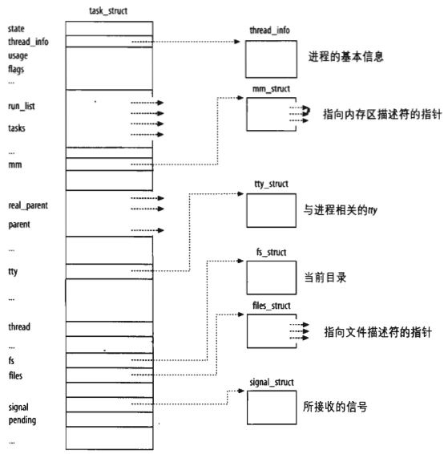
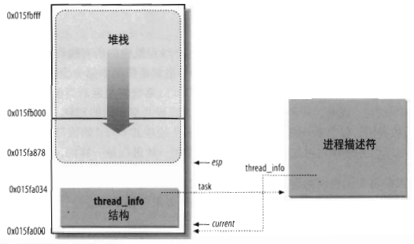
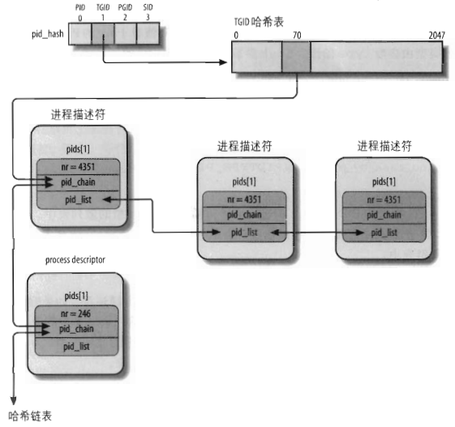
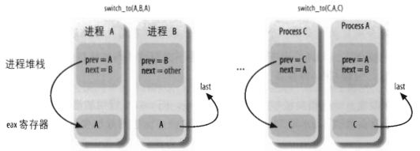

##	进程

-	*Process* 进程：程序执行时的一个实例
	-	可视为：充分描述进程执行程度的数据结构的汇集
	-	内核观点：进程的目的就是担当分配系统资源（*CPU* 时间、内存等）的实体
	-	每个进程只有一个父进程，创建时与父进程几乎相同
		-	接受父进程地址空间的（逻辑）拷贝
		-	从进程创建系统调用的下条指令开始执行与父进程相同的代码
		-	但父、子进程有各自独立的数据拷贝（栈、堆）

-	*Linux* 使用 *Lightweight Process* 提供多线程支持
	-	*LWP* 间可共享一些资源
		-	地址空间
		-	打开的文件
	-	将线程与 *LWP* 关联即可实现多线程程序
		-	进程资源共享
		-	内核独立调度线程
	-	线程组：实现了多线程应用的一组轻量级进程
		-	`getpid()`、`kill()`、`_exit()` 等系统调用，对线程组整体起作用

> - *pthread* 即 *POSIX threads* 即为兼容 *POSIX* 的线程库，只包含接口定义（定义在 `pthread.h` 中），具体实现有 *Linux Threads*、*Native Posix Thread Library*、*Next Generation Posix Threading Package*

##	进程描述符



-	*Process Descriptor* 进程描述符：标识能 **独立调度** 的每个执行上下文
	-	轻量级进程有独立的进程描述符
		-	（轻量级）进程与进程描述符间严格对应
		-	内核通常通过进程描述符指针引用（轻量级）进程
	-	所有进程描述符均为 `struct task_struct`/`task_t` 类型
		-	其字段包含与进程相关的所有信息的数据结构

###	进程状态

-	`task_struct.state` 进程状态：进程所处状态，状态间互斥
	-	`TASK_RUNNING` 可运行：在执行或准备执行
	-	`TASK_INTERRUPTIBLE` 可中断的等待状态：被挂起（睡眠）直至某个条件为真
		-	硬件中断
		-	释放进程等待的系统资源
		-	传递信号
	-	`TASK_UNINTERRUPTIBLE` 不可中断的等待状态：类似可中断的等待状态，但传递信号不能改变其状态
	-	`TASK_STOPPED` 暂停状态：执行被暂停
		-	进程收到以下信号时进入暂停状态
			-	`SIGSTOP`
			-	`SIGTSTP`
			-	`SIGTTIN`
			-	`SIGTTOU`
	-	`TASK_TRACED` 跟踪状态：进程执行由调试程序暂停
		-	进程被其他进程监控时，任何信号都可将进程置于 `TASK_TREACED` 状态
	-	`EXIT_ZOMBIE` 僵死状态：进程执行被终止
		-	但父进程没有发布 `wait4()`、`waitpid()` 系统调用返回有关死亡进程的信息，此时内核不能丢弃进程描述符中数据，父进程可能还需要
	-	`EXIT_DEAD` 僵死撤销状态：最终状态
		-	父进程刚发出 `wait4()`、`waitpid()` 系统调用，进程将由内核删除
		-	为防止其他线程在同一进程上执行 `wait()` 类系统调用，将进程由僵死状态设置为此状态

###	（获取）进程标识（唯一性）

> - 进程、进程描述符严格一一对应，内核对进程的引用大部分通过进程描述符地址完成

-	`task_struct.pid` 进程标识符 *PID*：标识（轻量级）进程
	-	内核通过 `pidmap-array` 位图管理 *PID* 分配
		-	*PID* 编号递增、循环（有可设置上限）使用
		-	位图存储在单独页中，始终不释放

-	`task_struct.tgid` 线程组标识符：标识线程组
	-	线程组中所有线程取值相同，即线程组中首个轻量级进程的 *PID*
		-	遵寻 *POSIX* 标准，多线程程序中所有线程 *PID* 相同
	-	`getpid()` 系统调用即返回当前进程 `tgid` 值

> - 最大 *PID* 缺省为 `32767 = PID_MAX_DEFAULT - 1`，位于 `/proc/sys/kernel/pid_max` 中，64bits 体系中最大可为 4194303

####	（进程）内核栈

> - 内核将进程描述符存放在动态内存（内核地址空间）中



-	`thread_union` 为每个进程关联的单独为进程分配的存储区域
	-	通常为连续 2 页框，8KB
		-	`thread_info` 线程描述符，52B 大小
		-	内核态进程堆栈，和普通 80x86 系统一样，起始于高地址，最大 8140B
			-	仅供内核控制路径使用，无需很大空间
	-	编译时可设置 `thread_union` 使用单个页框
		-	此时内核态进程堆栈仅用于处理异常（包括系统调用）
		-	需要采用额外的（与 *CPU* 关联的）内核栈处理中断
			-	避免中断、异常深度嵌套导致的栈溢出
	-	内核使用 `alloc_thread_info`、`free_thread_info` 宏分配、释放 `thread_union`

-	`thread_info` 与内核堆栈紧密结合使得内核通过检查栈即可获取地址
	-	`thread_info` 结构基地址：屏蔽 `esp` 寄存器中地址的低 13 位获得对应的
		-	屏蔽位数取决连续的存储区域大小
		-	实务中由 `current_thread_info()` 函数完成
	-	进程描述符地址：根据 `task` 字段在 `thread_info` 结构中偏移量计算
		-	实务中通过 `current` 宏完成

	> - `esp` 寄存器：*CPU* 栈指针，存放栈顶单元地址
	> - 早期 *Linux* 通过引入全局静态变量 `current` 标识正在运行进程的描述符，多处理器系统上，`current` 需定义为数组

###	内核栈

-	若 `thread_union` 结构大小为 8KB
	-	当前进程的内核栈用于所有类型的内核控制路径
		-	异常
		-	中断
		-	可延迟的函数
	-	若 `thread_union` 结构大小为 4KB，内核使用三种类型的内核栈
		-	异常栈：处理系统调用，包含在 `thread_union` 中
			-	对系统的每个进程，内核使用不同的异常栈
		-	硬中断请求栈：处理中断
			-	每个 *CPU* 有硬中断请求栈，每个栈占用单独页框
		-	软中断请求栈：处理可延迟的函数
			-	每个 *CPU* 有软中断请求栈，每个栈占用单独页框

-	硬中断请求栈、软中断请求栈类似进程异常栈
	-	`hardirq_ctx` 数组：存放所有硬中断请求
	-	`softirq_ctx` 数组：存放所有软中断请求
	-	每个数组元素都是跨越单独页框的 `irq_ctx` 类型的联合体
	-	每个栈也关联 `thread_info` 结构位于页底，栈使用剩余空间
		-	但 `thread_info` 结构关联 *CPU* 而不是进程


###	进程链表（关系）

-	进程链表：通过 `task_struct.tasks` 字段维护链
	-	`list_head` 类型（双向链表）
		-	其 `prev`、`next` 字段分别指向前、后 `task_struct.tasks`
		-	实务中首尾相联，构成循环双向链表
	-	进程链表头为 `init_task`，即 0 进程的进程描述符

> - 通过 `list_entry()` 宏，从方便的从作为成员的 `list_head` 字段的地址倒推所有者节点地址

####	进程状态链表

-	*TASK_RUNNING* 状态进程链表：`task_struct.run_list` 用于维护可以运行进程双向链
	-	`task_struct.prio`：进程优先级，取值 `0-139`，据此进程被组织为 140 个队列
		-	每个 *CPU* 有独立运行队列集
	-	`prio_array_t` 结构：组织 140 个进程队列
		-	其中字段
			-	`int nr_active`：进程描述符数量
			-	`unsigned[5] bitmap`：优先权位图，指示各进程链表不为空
			-	`struct list_head[140]  queue`：140 个优先权队列头节点
		-	`task_struct.array` 即指向所属的 `prio_array_t` 结构

-	*TASK_STOPPED*、*EXIT_ZOMBIE*、*EXIT_DEAD* 状态进程：对其访问比较简单，不分组
	-	通过 *PID*、父子进程链表访问即可

-	等待队列：由双向链表链接的一组睡眠进程，某条件为真时被唤醒
	-	等待队列头为 `wait_queue_head_t` 类型
		-	`spinlock_t lock` 自旋锁：避免中断处理程序、内核函数对队列的同时访问双向链表
		-	`list_head` 链接进程
	-	等待队列成员为 `wait_queue_t` 类型，代表睡眠进程
		-	`unsigned flags`：睡眠进程类型
			-	`1`：互斥进程，由内核有选择的唤醒一个
			-	`0`：非互斥进程，事件发生时所有进程被唤醒
		-	`wait_queue_func_t func`：唤醒进程方式
		-	`struct task_struct * task`
		-	`struct list_head task_list`
	-	内核可通过多个宏唤醒等待队列中进程，将其状态置为 `TASK_RUNNING`
		-	所有宏都考虑到处于 `TASK_INTERRUPTIBLE` 状态睡眠进程；宏命不包含 `interruptible` 者会同时唤醒 `TASK_UNINTERRUPTIBLE` 状态睡眠进程
		-	所有宏唤醒有请求状态的非互斥进程；宏命包含 `nr` 者唤醒给定数互斥进程，否则唤醒 1 个

	> - 同一等待队列同时包含互斥、非互斥进程非常罕见

####	进程关系链表链表

-	进程间亲属关系
	-	`real_parent`：指向创建当前进程的进程描述符
		-	若进程不再存在，则指向进程 1 `init` 的进程描述符（如运行后台进程后退出 Shell）
	-	`parent`：指向当前父进程
		-	子进程终止时需向父进程发信号
		-	通常与 `real_parent` 一致，但也可不同（如进程被 `ptrace()` 系统调用监控）
	-	`children`：指向包含创建的子进程链表头
	-	`sibling.prev`：指向兄弟进程链表的前一个元素
	-	`sibling.next`：指向兄弟进程链表的后一个元素

-	进程间非亲属关系
	-	`group_leader`：指向所在进程组的领头进程的进程描述符
	-	`signal->pgrp`：所在进程组的领头进程的 *PID*
	-	`tgid`：所在线程组的领头进程的 *PID*
	-	`signal->session`：所在登录会话领头进程度的 *PID*
	-	`ptrace_children`：指向被调试程序跟踪的当前进程子进程的链表头
	-	`ptrace_list`

####	`pid_hash` 表及链表

-	利用散列表将 *PID* 导出对应进程描述符指针
	-	`pid_hash` 数组维护 4 种不同类型 *PID* 对应的 4 个散列表
		-	`PIDTYPE_PID` 映射 `pid` 字段
		-	`PIDTYPE_TGID` 映射 `tgid` 字段
		-	`PIDTYPE_PGID` 映射 `pgrp` 字段
		-	`PIDTYPE_SID` 映射 `session` 字段
	-	散列表节点为 `hlist_head` 类型，成员结构
		-	`int nr`：被映射 *PID* 字段值
		-	`struct list_head * pid_chain`：被映射 *PID* 字段值相同的（轻量级）进程双向链表链，链接同 *PID*
		-	`struct hlist_node * pid_list`：仅映射结果相同的进程双向链表链，链接同 *PID* 映射
	-	散列表长度依赖于 *RAM* 容量
		-	`pid_hashfn()` 宏用于映射 *PID*
		-	一般总是小于最大 *PID* 取值，避免浪费存储空间

	

###	进程资源限制

-	`task_struct.signal->rlim` 数组存储进程的资源限制
	-	每个数组元素对应一种资源
		-	可用宏确定各类型资源在数组中位置
	-	数组元素类型为 `struct rlimit`：存储当前值、最大值

##	进程切换

###	*Hardware Context*

-	硬件上下文：进程回复执行前必须装入寄存器的一组数据
	-	*CPU* 寄存器由所有进程共享
		-	内核须确保进程恢复执行前，寄存器装入了挂起进程时的值
	-	进程可执行上下文的子集，分两块存放
		-	*Task State Segment* 任务状态段，使用 `tss_struct` 结构描述
			-	存储 *CPU* 上当前进程特权级
			-	无需为未在运行进程保留 *TSS*
		-	内核态堆栈

####	*Task Status Segment*

-	*Linux 2.6* 后尽管不使用硬件切换上下文，但强制为每个 *CPU* 创建 *TSS* 段
	-	*CPU* 切换到内核态时，可从 *TSS* 中获取内核态堆栈地址
	-	用户态进程尝试访问 *I/O* 端口时，*CPU* 访问存放在 *TSS* 中的许可权位图确权

-	`init_tss` 数组为每个 *CPU* 存放 `tss_struct` 结构描述 *TSS*
	-	进程切换时，内核更新 *TSS* 中字段以便 *CPU* 可以安全检索需要的信息
	-	进程切换时，被替换进程硬件上下文保存在进程描述符 `task_struct.thread` 字段中
		-	默认 80x86 分段设计中硬件上下文保存在 *TSS* 中，但 *Linux* 仅为每个 *CPU* 使用 *TSS*，而不是每个进程
		-	存储的字段包括大部分 *CPU* 寄存器，除 `eax`、`ebx` 等存储在内核堆栈中的通用寄存器

-	每个 *TSS* 有 8B 任务状态段描述符 *TSSD* 存放在 *GDT* 中（参见段描述符部分）
	-	*TSSD* 中各字段含义
		-	`Base` 字段指向 `init_tss` 数组中相应 `tss_struct` 结构元素
		-	`Limit` 字段置 `0xeb`：*TSS* 段长 236B
		-	`G` 字段清 0
		-	`Type` 字段置 9、11，取决于进程运行状态
			-	第二个有效位为 `Busy` 位，*Linux* 设计中每个 *CPU* 仅一个 *TSS* 段，总置位
		-	`DPL` 字段置 0，不允许用户访问
	-	另外，`tr` 寄存器存储有 *TSSD* 选择符、*TSSD* 中 `Base`、`Limit` 字段，处理器可直接对 *TSS* 寻址

	> - `Base`、`Limit` 确定的线性地址空间是内核数据段线性地址空间的子集

###	进程切换

-	上下文切换
	-	早期 *Linux* 利用 80x86 体系结构的硬件支持，通过 `far jmp` 指令跳转到切换进的进程 *TSS* 描述符的选择符来执行进程切换
	-	*Linux 2.6* 之后使用软件执行进程切换
		-	`mov` 指令逐步执行切换，可较好控制装入数据的合法性，方便检查 `ds`、`es` 段寄存器
		-	与 `far jmp` 指令跳转方法用时相近

-	本质上，进程切换分为两步
	-	切换页全局目录以安装新的地址空间
	-	切换内核态堆栈、硬件上下文



-	`switch_to(prev, next, last)` 宏执行进程切换
	-	参数含义
		-	`prev`：被替换进程描述符地址
		-	`next`：新进程描述符地址
		-	`last`：为 `next` 存储 `prev`
	-	说明
		-	切换至 `next` 进程后，`next` 进程内核堆栈中 `prev`、`next` 变量保留是之前被切换出的值，此次切换的 `prev` 进程无法被引用
		-	实际上，宏会将 `prev` 值存入 `eax` 寄存器中，待 `next` 进程恢复执行后写入 `last` 中

##	创建进程

-	传统 *Unix* 系统中，子进程复制父进程拥有的资源
	-	效率低，子进程需要拷贝父进程整个地址空间
	-	但实际上，子进程几乎不必读、修改父进程的所有资源，经常立即调用 `execve()` 并清除从父进程拷贝的地址空间

-	现代 *Unix* 内核通过以下机制解决传统 *Unix* 系统进程创建低效的问题
	-	写时复制：允许父子进程读相同物理页，仅当需要写物理页时，内核才拷贝页内容至新页框并分配
	-	轻量级进程：允许父子进程共享进程在内核的数据结构
		-	页表
		-	打开文件表
		-	信号处理
	-	`vfork()` 系统调用：其创建子进程能共享父进程的内存地址空间

###	`clone()`、`fork()`、`vfork()`

```c
 # include <sched.h>
int clone(int (*fn)(void *), void *stack, int flags, void *args,...,
		/* pid_t *parent_tid, void *tls, pid_t *child_tid */);
```

-	`clone()` 函数负责创建轻量级进程
	-	参数
		-	`fn`：由新进程执行的函数的指针，函数返回时，子进程终止
		-	`stack`：子进程应使用的将用户态堆栈指针
			-	将赋给子进程 `esp` 寄存器
			-	调用进程应总是为子进程分配新堆栈
		-	`flags`：各种标志位
			-	低字节指定子进程结束时发送给父进程的信号代码，常为 `SIGCHLD`
			-	剩余 3B 用于 clone 标志
		-	`arg`：传递给 `fn()` 的参数
		-	`tls`：*TLS* 结构地址
			-	仅在 `CLONE_SETTLS` 标志置位才有意义
		-	`parent_tid`：存储子进程 *PID* 的父进程内存空间变量
			-	仅在 `CLONE_PARENT_SETTID` 置位有意义
		-	`child_tid`：存储子进程 *PID* 至子进程内存空间变量
			-	仅在 `CLONE_CHILD_SETTID` 置位有意义
	-	`clone()` 是 *glibc* 库对 `clone` 系统调用的封装函数，负责
		-	建立轻量级进程堆栈
		-	隐藏 `clone` 系统调用
	-	`clone()` 创建的新进程执行 `fn` 逻辑
		-	函数指针 `fn` 被存放在其返回地址处（位于子进程堆栈中）
		-	`arg` 指针紧接着存储在 `fn` 之后
		-	`clone()` 函数结束后，*CPU* 从堆栈取出返回地址，开始执行 `fn`

	> - 实现 `clone` 系统调用的 `sys_clone()` 服务例程没有 `fn`、`arg` 参数

-	`fork()` 函数通过 `clone()` 实现，其中 `clone()`
	-	`flags` 参数指定为 `SIGCHLD` 信号、所有 clone 标志清零
	-	`stack` 参数置为父进程当前堆栈指针
		-	父、子进程暂时共享用户态堆栈
		-	由于写时复制机制，父、子进程试图改变栈时，将触发堆栈拷贝

-	`vfork()` 函数亦通过 `clone()` 实现
	-	`flags` 参数指定为 `SIGCHLD` 信号、`CLONE_VM`、`CLONE_VFORK`
	-	`stack` 参数置为父进程当前堆栈指针

#TODO

> - <https://man7.org/linux/man-pages/man2/clone.2.html>

####	`do_fork()`、`copy_process()`

-	`do_fork()` 函数：负责处理 `clone()`、`fork()`、`vfork()` 等函数
	-	参数
		-	`clone_flags`：同 `clone()` 中 `flags`
		-	`stack_start()`：同 `clone()` 中 `stack`
		-	`regs`：指向通用寄存器 **值** 的指针
			-	通用寄存器的值是从用户态切换到内核态时被保存到内核态堆栈中
		-	`stack_size`：未使用，总置 0
		-	`parent_tidptr`：同 `clone()` 中 `parent_tid`
		-	`child_tidptr`：同 `clone()` 中 `child_tid`
	-	`do_fork()` 结束后，可运行的子进程已经创建，但未实际运行
		-	在之后进程切换中，调度程序将继续完善子进程
			-	将子进程 `task_struct.thread` 字段装入寄存器
				-	`thread.esp` 装入 `esp` 寄存器
				-	函数 `ret_from_fork()` 地址装入 `eip` 寄存器
		-	`clone()` 等函数调用结束时，新进程开始执行
			-	系统调用返回值放在 `eax` 寄存器中
				-	给子进程返回 0
				-	给父进程返回子进程 *PID*

-	`copy_process()` 函数：被 `do_fork()` 调用以创建进程描述符、子进程执行所需的其他数据结构
	-	参数同 `do_fork()`，外加子进程 *PID*

###	*Kernel Thread*

-	内核线程
	-	通常在后台调度，用于执行重要的、周期性执行的任务
		-	刷新操盘高速缓存
		-	交换页框
		-	维护网络连接
	-	只运行在内核态，只使用大于 `PAGE_OFFSET` 的线性地址空间

####	创建内核线程

-	`kernel_thread()`：创建新的内核线程
	-	参数
		-	`fn`：要执行的内核函数的地址
		-	`arg`：要传递给函数的参数
		-	`flags`：一组 clone 标志
	-	函数本质即调用 `do_fork(flags|CLONE_VM|CLONE_UNTRACED, 0, pregs, 0, NULL, NULL)`
		-	`CLONE_VM` 避免复制调用进程的页表：内核态进程不会访问用户态地址空间
		-	`CLONE_UNTRACED` 保证不会有进程跟踪新内核进程
		-	`pregs` 表示内核栈地址
			-	`kernel_thread()` 在其中储存寄存器值
			-	`copy_thread()` 函数从中获取为新内核线程初始化寄存器的值
				-	`ebx` 设置为 `fn`
				-	`edx` 设置为 `arg`
	-	内核线程执行 `fn(arg)` 完毕后，用其返回值执行系统调用 `_exit()`

####	进程 0

-	进程 0、*idle* 进程、*swapper* 进程：*Linux* 初始化阶段从从无到有创建的内核线程
	-	唯一使用静态分配的数据结构的进程
	-	`start_kernel()` 函数初始化内核所需的所有数据结构、激活中断、创建进程 1
		-	`INIT_TASK` 宏初始化存放在 `init_task` 变量中进程描述符
		-	`INIT_THREAD_INFO` 初始化 `init_thread_union` 中的 `thread_info` 描述符、内核堆栈
		-	进程描述符的指向的表分别由对应的宏初始化
			-	`init_mm`：`INIT_MM`
			-	`init_fs`：`INIT_FS`：
			-	`init_files`：`INIT_FILES`
			-	`init_signals`：`INIT_SIGNALS`
			-	`init_sighand`：`INIT_SIGHAND`
		-	主内核页全局目录存放在 `swapper_pg_dir` 中
	-	创建 *init* 进程后，进程 0 执行 `cpu_idle()` 函数
		-	函数本质上是在开中断情况下，重复执行 `hlt` 指令
		-	当没有其他进程处于 `TASK_RUNNING` 状态时，调度程序选择进程 0
	-	每个 *CPU* 都有独立进程 0
		-	开机后后，*BIOS* 启动某个 *CPU* 并禁用其余 *CPU*
		-	*CPU 0* 上的进程 0 初始化内核数据结构，激活其他 *CPU*，通过 `copy_process()` 创建其他进程 0，并设置新的进程 0 *PID* 为 0
		-	将 *CPU* 索引赋给各个进程 0 的 `thread_info` 描述符的 `cpu` 字段

-	进程 1、*init* 进程由 `kernel_thread(init, null, CLONE_FS|CLONE_SIGHAND)` 创建
	-	*PID* 为 1
	-	与进程 0 共享所有内核数据结构
	-	执行 `init()`，依次完成内核初始化
		-	`init()` 调用 `execve()` 系统调用载入可执行程序 `init`
		-	之后进程 1 变为普通进程，且拥有独立的内核数据结构
	-	进程 1 一直存活，创建、监控在内核外执行地所有进程的活动

##	撤销进程

-	进程终止时，需通知内核以便内核释放进程所拥有的资源
	-	内存
	-	打开文件
	-	信号量

-	内核可以强迫线程组整体死亡
	-	进程接收到无法处理、忽视的信号
	-	内核代表进程运行时，在内核态产生不可恢复的 *CPU* 异常

####	进程终止

-	*Linux 2.6* 中有两个终止用户态应用的系统调用
	-	`exit_group` 系统调用：终止整个线程组
		-	`do_group_exit()` 即实现此系统调用的主要内核函数
		-	C 库函数 `exit()` 应调用此系统调用
	-	`exit` 系统调用：终止某进程，忽略所属线程组中的其他进程
		-	`do_exit()` 即实现此此系统调用的主要内核函数
		-	`pthread_exit()` 等线程库函数应调用此系统调用

-	`do_group_exit()` 函数杀死属于 `current` 线程组的所有进程
	-	接受进程终止代号作为参数
		-	正常结束：`exit_group()` 指定值
		-	异常结束：内核提供的错误代号

-	`do_exit()`：处理所有进程的终止，从内核数据结构中删除对终止进程的大部分引用
	-	接受进程终止代号作为参数

> - `exit()` 函数可显式插入，而 C 编译器总是将 `exit()` 函数插入 `main()` 函数最后语句之后

####	进程删除

-	进程僵死状态：进程已死，但其进程描述符一直保存直到父进程得到通知
	-	*Unix* 允许进程查询内核获取父进程 *PID*、获取子进程执行状态
		-	子进程终止后，终止代号反应任务完成情况
		-	只有父进程发出与被终止进程相关的 `wait` 类系统调用后，才允许丢弃进程描述符字段中数据
	-	所有孤儿进程将成为 *init* 进程子进程，以避免过多僵死进程
		-	由 *init* 进程通过 `wait` 类系统调用检查

-	`release_task()` 函数：从僵死进程描述符中分离出数据结构，并处理僵死进程
	-	父进程无需接受来自子进程信号
		-	调用 `do_exit()` 函数
		-	由进程调度程序回收进程内存
	-	子进程已经给父进程发送信号
		-	执行 `wait4`、`waitpid` 系统调用
		-	自身负责回收进程描述符占用的系统空间

> - 孤儿进程：父进程在子进程结束前结束的进程


