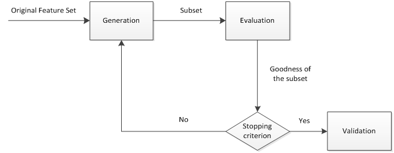

#	通用技术

##	抽样技术

###	*Hold Out*

旁置法：将样本集随机划分为训练集、测试集

-	适合样本量较大的场合

###	*N-fold Cross Validation*

N折交叉验证：旁置法的扩展，将数据分成N份，每次将其中一份作为
测试样本集，其余N-1份作为训练样本集

-	解决了留一法计算成本高的问题：重复次数少
-	克服了旁置法中测试样本选取随机性的问题：每个样本都能作为
	测试样本
-	典型的“袋外验证”：袋内数据（训练样本）、袋外数据（测试
	样本）分开

###	*Leave-One-Out Cross Validation*

留一法：对n个观测的样本集，每次选择一个观测作为测试样本集，
剩余n-1个观测值作为训练样本集，重复n次计算模型误差

-	可以看作是N折交叉验证的特例

###	Bootstrap

重抽样自举：对样本量为n的样本集S，做k次有放回的重复抽样，
得到k个样本容量仍然未n的随机样本$S_i(i=1,2,...,k)$，称为自举
样本（模拟多组独立样本）

##	*Feature Engineering*

特征工程：利用数据领域相关知识，创建能使机器学习算法达到最佳
性能的特征的过程

-	即人为设计输入变量，把原始数据转换为可以很好描述数据、
	建立在其上的模型性能接近最优的特征

-	特征工程重要性，特征越好
	-	模型选择灵活性越高：较好特征在简单模型上也能有较好
		效果，允许选择简单模型
	-	模型构建越简单：较好特征即使在超参不是最优时效果也
		不错，不需要花时间寻找最优参数
	-	模型性能越好

	> - 数据、特征决定了机器学习的上限，模型、算法只是逼近
		上限

###	*Feature Selection*

特征选择：从特征集合中选择**最具统计意义**的特征子集，达到
降维效果

####	*Filter*

筛选器：描述自变量、目标变量的关联，通过分析特征子集内部特点
衡量优劣，选择排名考虑特征

-	侧重于筛选单个特征
-	优点
	-	效率高
	-	对过拟合问题稳健性较好
-	缺点
	-	未考虑特征之间相关性，倾向选择冗余特征、忽略特征联合
		能力
-	评价函数
	-	Pearson相关系数
	-	Gini指数
	-	IG信息增益/互信息
	-	卡方统计量
	-	距离指标

####	*Wrapper*

封装器：利用特定分类器，用选取的特征子集对样本集进行分类，
以分类精度作为衡量特征子集优劣的标准，选择最好的特征子集

-	侧重于选择特征子集
-	优点
	-	考虑了特征之间的关联性
-	缺点
	-	观测数据较少时容易过拟合
	-	计算效率随特征数量增加迅速下降
-	典例
	-	前向变量选择
	-	后向变量选择
	-	最优子集选择

####	*Embeded*

集成方法：由学习器自身自动选择特征

-	优点：兼具筛选器、封装器的优点
-	缺点：需要明确**好的选择**
-	典例
	-	$\mathcal{L}$范数正则化：Lasso、Ridge
	-	决策树算法：决策树自上而下选择分裂特征就是特征选择
	-	神经网络

####	特征选择组件

-	*generation procedure*：产生过程，搜索特征子集
-	*evaluation function*：评价函数，评价特征子集优劣
-	*stopping criterion*：停止准则，与评价函数相关的阈值，
	评价函数达到与阈值后可以停止搜索
-	*validation procedure*：验证过程，在验证数据集上验证选择
	特征子集的有效性

###	*Feature Construction*

特征构建：从原始数据中人工构建新特征

-	方法
	-	组合属性
	-	切分属性：如将时间戳分割为日期、上下午
-	主观要求高
	-	对问题实际意义有研究
	-	对数据敏感
	-	分析能力强

####	数值型

-	幅度调整：提高SGD收敛速度
	-	归一化
	-	标准化
-	log数据域变化
-	统计值
-	数据离散化：连续值分段
	-	等距切分：各类分布不均
	-	分位数切分：各类分布均匀，但异质性不均

####	分类型

-	*one-hot*编码：赋予各特征等权
-	hash技巧：针对文本类别数据，统计文本词表、倾向
-	多分类转二分类：输入变量类别合并，超类
	-	*twoing*策略：使两个超类差异足够大的合并点（分割点）
	-	*ordering*策略：对有序类型，只有两个连续基类才能合并

####	时间戳

-	视为连续型：持续时间、间隔时间
-	视为离散值：一年中某些时间段

####	文本型

词袋模型

-	将文本数据映射为稀疏向量
-	针对有序语句，将单词两两相连
-	TF-IDF统计量：反映词对在文档中重要程度

####	统计型

-	分位线
-	比例
-	次序

####	组合特征

-	特征拼接：GBDT生成特征组合路径

###	*Feature Extraction*

特征提取：将原始特征转换为具有物理、统计学意义特征，实现降维

-	目的
	-	信号表示：抽取后特征尽可能丢失较少信息
	-	信号分类：抽取后特征尽可能提高分类准确率
-	典例
	-	PCA：主成分分析
	-	ICA：独立成分分析
	-	LDA：线性判别分析
