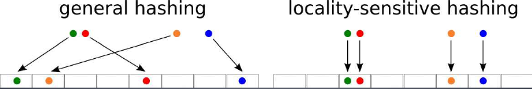

#	Hashing

##	*Hash Function*

> - *hash*：散列/哈希，将任意类型值转换为关键码值
> - *hash function*：哈希/散列函数，从任何数据中创建小的数字
	“指纹”的方法
> - *hash value*：哈希值，哈希函数产生关键码值
> - *collision*：冲突，不同两个数据得到相同哈希值

-	哈希函数应该尽可能使得哈希值均匀分布在目标空间中
	-	降维：将高维数据映射到低维空间
	-	数据应该低维空间中尽量均匀分布

###	数据相关性

-	*Data Independent Hashing*：数据无关哈希，无监督，哈希
	函数基于某种概率理论

	-	对原始的特征空间作均匀划分
	-	对分布不均、有趋向性的数据集时，可能会导致高密度区域
		hash桶臃肿，降低索引效率

-	*Data Dependent Hashing*：数据依赖哈希，有监督，通过学习
	数据集的分布从而给出较好划分的hash函数
	
	-	得到针对数据密度动态划分的hash索引
	-	破坏了传统LSH的数据无关性，索引不具备普适性

###	应用

-	查找数据结构：*cs_algorithm/data_structure/hash_table*
	-	哈希表
-	信息安全方向：*cs_algorithm/specification/info_security*
	-	文件检验
	-	数字签名
	-	鉴权协议

##	基本哈希函数

-	以下简单哈希函数主要考虑运算的数学性质
	-	计算简单
	-	适合简单应用：构建哈希表、查找
	-	考虑

-	复杂哈希函数参见*cs_algorithm/specification/#todo*

	-	查表哈希
		-	*CRC*系列算法：本身不是查表，但查表是其最快实现
		-	*Zobrist Hashing*

	-	混合哈希：利用以上各种方式
		-	*MD5*
		-	*Tiger*

###	单输入哈希

-	直接寻址法：取关键字、或其某个线性函数值
	$hash(key) = (a * key + b) mod prime$

	> - $prime$：一般为质数，以使哈希值尽量均匀分布，常用
		的如：$2^32-5$

-	数字分析法：寻找、利用数据规律构造冲突几率较小者
	-	如：生日信息前2、3位大体相同，冲突概率较大，优先舍去

-	平方取中法：取关键字平方后中间几位

-	折叠法：将关键字分割为位数相同部分，取其叠加和

-	随机数法：以关键字作为随机数种子生成随机值
	-	适合关键字长度不同场合

> - 常用于之前hash结果再次映射为更小范围的最终hash值

###	序列输入

####	加法哈希

加法哈希：将输入元素相加得到哈希值

-	标准加法hashing

	```python
	AddingHash(input):
		hash = 0
		for ele in input:
			hash += ele
		hash = hash  % prime
	```
	> - `prime`：任意质数，常用`2^32 - 5`

	-	最终哈希结果`\in [0, prime-1]`

####	位运算哈希

位运算哈希：利用位运算（移位、异或等）充分混合输入元素

-	标准旋转hashing

	```python
	RotationHash(input):
		hash = 0
		for ele in input:
			hash = (hash << 4) ^ (hash >> 28) ^ ele
		return hash % prime
	```

-	变形1

	```python
	hash = (hash<< 5) ^ (hash >> 27) ^ ele
	```

-	变形2

	```python
	hash += ele
	hash ^= (hash << 10)
	hash ^= (hash >> 6)
	```

-	变形3

	```python
	if (ele & 1) == 0:
		hash ^= (hash << 7) ^ ele ^ (hash >> 3)
	else:
		hash ^= ~((hash << 11) ^ ele ^ (hash >> 5))
	```

-	变形4

	```python
	hash += (hash << 5) + ele
	```

-	变形5

	```python
	hash = ele + (hash << 6) + (hash >> 16) - hash
	```

-	变形6

	```python
	hash ^= (hash << 5) + ele + (hash >> 2)
	```

####	乘法哈希

乘法哈希：利用乘法的不相关性

-	平方取头尾随机数生成法：效果不好

-	Bernstein算法

	```python
	Bernstein(input):
		hash = 0
		for ele in input:
			hash = 33 * hash + ele
		return hash
	```

	> - 其他常用乘数：31、131、1313、13131、131313

-	32位FNV算法

	```python
	M_SHIFT =
	M_MASK =
	FNVHash(input):
		hash = 2166136261;
		for ele in input:
			hash = (hash * 16777619) ^ ele
		return (hash ^ (hash >> M_SHIFT)) & M_MASK
	```

-	改进的FNV算法

	```python
	FNVHash_2(input):
		hash = 2166136261;
		for ele in input:
			hash = (hash ^ ele) * 16777619
		hash += hash << 13
		hash ^= hash >> 7
		hash += hash << 3
		hash ^= hash >> 17
		hash += hash << 5
		return hash
	```

-	乘数不固定

	```python
	RSHash(input):
		hash = 0
		a, b = 378551, 63689
		for ele in input:
			hash = hash * a + ele
			a *= b
		return hash & 0x7FFFFFFF
	```

> - 除法也类似乘法具有不相关性，但太慢

##	*Universal Hashing*

全域哈希：
#todo

###	*Perfect Hashing*

##	*Locality Sensitive Hashing*

*LSH*：局部敏感哈希

> - $(r_1,r_2,P_1,P_2)-sensitive$hash函数族$H$需满足如下条件
	$$\begin{align*}
	Pr_{H}[h(v) = h(q)] \geq P_1, & \forall q \in
		B(v, r_1) \\
	Pr_{H}[h(v) = h(q)] \geq P_2, & \forall q \notin
		B(v, r_2) \\
	\end{align*}$$
> > -	$h \in H$
> > -	$r_1 < r_2, P_1 > P_2$：函数族有效的条件
> > -	强调比例时会表示为$r_1 = R, r_2 = cR$

-	此时**相似目标（距离小）有更大概率发生冲突**

###	LSH查找

####	思想



-	相似目标更有可能映射到相同hash桶中
	-	则只需要在目标所属的hash桶中进行比较、查找即可
	-	无需和全集数据比较，大大缩小查找空间

-	可视为降维方法
	-	将高维空间数据映射到1维空间，寻找可能近邻的数据点
	-	缩小范围后再进行精确比较

####	概率放大

期望放大局部敏感哈希函数族$Pr_1, Pr_2$之间差距

-	增加哈希值长度（级联哈希函数中基本哈希函数数量）$k$
	-	每个哈希函数独立选择，则对每个级联哈希函数$g_i$
		$Pr[g_i(v) = g_i(q)] \geq P_1^k$
	-	虽然增加哈希键位长会减小目标和近邻碰撞的概率，但同时
		也更大成都上减少了和非近邻碰撞的概率、减少搜索空间

-	增加级联哈希函数数量（哈希表数量）$L$
	-	$L$个哈希表中候选项包含真实近邻概率**至少**为
		$1 - (1 - P_1^k)^L$
	-	增加哈希表数量能有效增加候选集包含近邻可能性
	-	但同时也会增大搜索空间

####	搜索近似最近邻

-	使用$L$个级联哈希函数分别处理待搜索目标
-	在$L$个哈希表分别寻找落入相同哈希桶个体作为候选项
-	在所有候选项中线性搜索近邻

###	基于汉明距离

-	基于汉明距离空间
	-	要求数据为二进制表示
	-	其他距离需要嵌入汉明距离空间才能使用

-	欧几里得距离没有直接嵌入汉明空间的方法
	-	一般假设欧几里得距离和曼哈顿距离差别不大
	-	直接使用对曼哈顿距离保距嵌入方式

####	哈希函数族

考虑哈希函数族$H$

-	其中函数为$\{0, 1\}^d$到$\{0, 1\}$的映射：随机返回
	特定比特位上的值

-	从$H$中随机的选择哈希函数$h_i$

-	则$Pr[h(v) = h(q)]$等于$v, q$相比特数比例，则
	-	$Pr_1 = 1 - \frac R d$
	-	$Pr_2 = 1 - \frac {cR} d$

-	$Pr_1 > Pr_2$，即此哈希函数族是局部敏感的

###	基于Jaccard系数

-	用Jaccard系数代表集合间相似距离
-	要求各数据向量元素仅包含0、1，表示集合是否包含该元素

####	*Min-hashing*函数族

-	考虑$M * N$矩阵A，元素为0、1
	-	M：全集元素数量
	-	N：需要比较的集合数量

-	对矩阵A进行**行随机重排**$\pi$，定义**最小hash函数族**

	$$h_{\pi}(C) = min \pi(C)$$

	> - $C$：列，表示带比较集合
	> - $min \pi(C)$：$\pi$重排矩阵中列C首个1所在行数

####	碰撞概率

$$\begin{align*}
Pr(h_{\pi}(C_1)  = h_{\pi}(C_2)) & = \frac a {a + b} \\
& = Jaccard_d(C_1, C_2)
\end{align*}$$

> - $a$：列$C_1, C_2$取值均为1的行数
> - $b$：列$C_1, C_2$中仅有一者取值为1的行数

-	即不同列（集合）*Minhashing*相等概率等于二者Jaccard系数

####	实现

数据量过大时，对行随机重排仍然非常耗时，考虑使用hash函数模拟
行随机重排

-	每个hash函数对应一次随机重排
	-	常用hash函数为线性变换然后对总行数取模
	-	原行号经过hash函数映射即为新行号

-	为减少遍历数据次数，考虑使用迭代方法求解

	```c
	for i from 0 to N-1:
		for j from 0 to M-1:
			if D[i][j] == 1:
				for k from 1 to K:
					DD[k][j] = max(h_i(i), DD[k][j])
	```

	> - $D$：原始数据特征矩阵
	> - $DD$：minHash签名矩阵
	> - $N$：特征数量，原始特征矩阵行数
	> - $M$：集合数量，原始特征矩阵列数
	> - $k$：模拟的随机重排次数，minHash签名矩阵行数
	> - $h_i,i=1,...,k$：K个模拟随机重排的hash函数，如
		$h(x) = 2x + 7 mod N$

	-	初始化minHash签名矩阵所有值为$\infty$
	-	遍历$N$个特征、$M$个集合
		-	查看每个对应元素是否为1
		-	若元素为1，则分别使用K个hash函数计算模拟重排后
			对应的行数
		-	若计算出行数小于当前minHash签名矩阵相应hash函数
			、集合对应行数，更新
	-	遍历一遍原始数据之后即得到所有模拟重排的签名矩阵

###	*Exact Euclidean LSH*

*E2LSH*：欧式局部LSH

-	*LSH Based-on P-stable Distribution*
	-	使用内积将向量随机映射到hash值
	-	*p-stable*分布性质将欧式距离同hash值相联系，实现
		局部敏感

-	特点
	-	基于概率模型生成索引编码结果不稳定
	-	随编码位数$k$增加的，准确率提升缓慢
	-	级联哈希函数数量$L$较多时，需要大量存储空间，不适合
		大规模数据索引

####	哈希函数族

构造hash函数族

$$
h_{a, b}(v) = \lfloor \frac {av + b} r \rfloor
$$

> - $v$：n维特征向量
> - $a = (X_1,X_2,\cdots,X_n)$：其中分量为独立同p-stable
	分布的随机变量
> - $b \in [0, r]$：均匀分布随机变量

####	碰撞概率

考虑$\|v_1 - v_2\|_p = c$的两个样本碰撞概率

-	显然，仅在$|av_1 - av_2| \leq r$时，才存在合适的$b$
	使得$h_{a,b}(v_1) = h_{a,b}(v_2)$，即两个样本碰撞，
	不失一般性可设$av_1 \leq av_2$

	-	此$r$即代表局部敏感的**局部范围**

-	若$(k-1)r \leq av_1 \leq av_2 < kr$，即两个样本与$a$内积
	在同一分段内

	-	易得满足条件的$b \in [0,kr-av_2) \cup [kr-av_1, r]$
	
	-	即随机变量$b$取值合适的概率为
		$1 - \frac {av_2 - av_1} r$

-	若$(k-1)r \leq av_1 \leq kr \leq av_2$，即两个样本$a$在
	相邻分段内

	-	易得满足条件的$b \in [kr-av_1, (k+1)r-av_2)$

	-	即随机变量$b$取值合适的概率同样为
		$1 - \frac {av_2 - av_1} r$

-	考虑$av_2 - av_1$分布为$cX$，则两样本碰撞概率为

	$$\begin{align*}
	p(c)  & = Pr_{a,b}(h_{a,b}(v_1) = h_{a,b}(v_2)) \\
	& = \int_0^r \frac 1 c f_p(\frac t c)(1 - \frac t r)dt
	\end{align*}$$

	> - $c = \|v_1 - v_2\|_p$：特征向量之间$L_p$范数距离
	> - $t = a(v_1 - v_2)$
	> - $f$：p稳定分布的概率密度函数

	-	$p=1$柯西分布

		$$
		p(c) = 2 \frac {tan^{-1}(r/c)} \pi - \frac 1
			{\pi(r/c)} ln(1 + (r/c)^2)
		$$

	-	$p=2$正太分布

		$$
		p(c) = 1 - 2norm(-r/c) - \frac 2 {\sqrt{2\pi} r/c}
			(1 - e^{-(r^2/2c^2)})
		$$

####	性质、实现

#####	限制近邻碰撞概率

-	$r$最优值取决于数据集、查询点
	-	根据文献，建议$r = 4$

-	若要求近邻$v \in B(q,R)$以不小于$1-\sigma$概率碰撞，则有

	$$\begin{align*}
	1 - (1 - p(R)^k)^L & \geq 1 - \sigma \\
	\rrightarrow L & \geq \frac {log \sigma}
		{log(1 - p(R)^k)}
	\end{align*}$$

	则可取

	$$
	L = \lceil \frac {log \sigma} {log(1-p(R)^k)} \rceil
	$$

-	$k$最优值是使得$T_g + T_c$最小者
	-	$T_g = O(dkL)$：建表时间复杂度
	-	$T_c = O(d |collisions|)$：精确搜索时间复杂度
	-	$T_g$、$T_c$随着$k$增大而增大、减小

> - 具体实现参考<https://www.mit.edu/~andoni/LSH/manual.pdf>

#####	限制搜索空间

-	哈希表数量$L$较多时，所有碰撞样本数量可能非常大，考虑
	只选择$3L$个样本点

-	此时每个哈希键位长$k$、哈希表数量$L$保证以下条件，则算法
	正确

	-	若存在$v^{ * }$距离待检索点$q$距离小于$r_1$，则存在
		$g_j(v^{ * }) = g_j(q)$

	-	与$q$距离大于$r_2$、可能和$q$碰撞的点的数量小于$3L$

		$$
		\sum_{j=1}^L |(P-B(q,r_2)) \cap g_j^{-1}(g_j(q))|
			< 3L
		$$

-	可以证明，$k, L$取以下值时，以上两个条件以常数概率成立
	（此性质是局部敏感函数性质，不要求是E2LSH）

	$$\begin{align*}
	k & = log_{1/p_2} n\\
	L & = n^{\rho} \\
	\rho & = \frac {ln 1/p_1} {ln 1/p_2}
	\end{align*}$$

	$\rho$对算法效率起决定性作用，且有以下定理

	> - 距离尺度$D$下，若$H$为$(R,cR,p_1,p_2)$敏感哈希函数族
		，则存在适合*(R,c)-NN*的算法，其空间复杂度为
		$O(dn + n^{1+\rho})$、查询时间为$O(n^{\rho})$倍距离
		计算、哈希函数计算为$O(n^{\rho} log_{1/p_2}n)$，
		其中$\rho = \frac {ln 1/p_1} {ln 1/p_2}$

	-	$r$足够大、充分远离0时，$\rho$对其不是很敏感
	-	$p_1, p_2$随$r$增大而增大，而$k = log_{1/p_2} n$也
		随之增大，所以$r$不能取过大值

> - 具体实现参见论文

####	*Scalable LSH*

*Scalable LSH*：可扩展的LSH

-	对动态变化的数据集，固定hash编码方法的局部敏感hash方法
	对数据**动态支持性有限**，无法很好的适应数据集动态变化

	-	受限于初始数据集分布特性，无法持续保证有效性
	-	虽然在原理上支持数据集动态变化，但若数据集大小发生
		较大变化，则其相应hash参数（如hash编码长度）等需要
		随之调整，需要从新索引整个数据库

-	在$E^2LSH$基础上通过**动态增强哈希键长**，增强哈希函数
	区分能力，实现可扩展LSH

