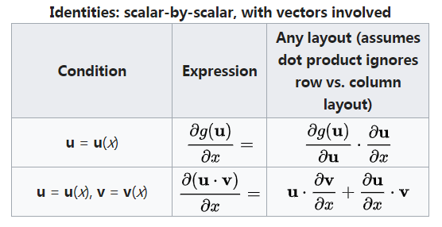
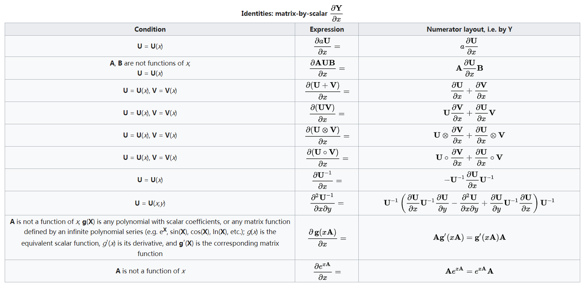
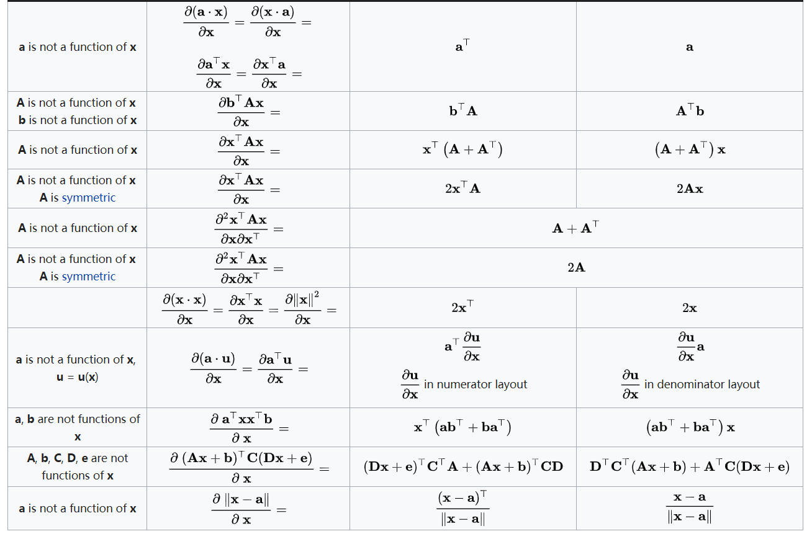
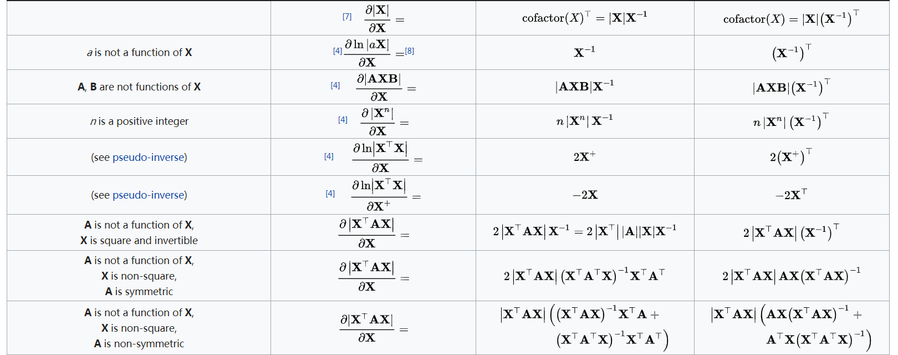
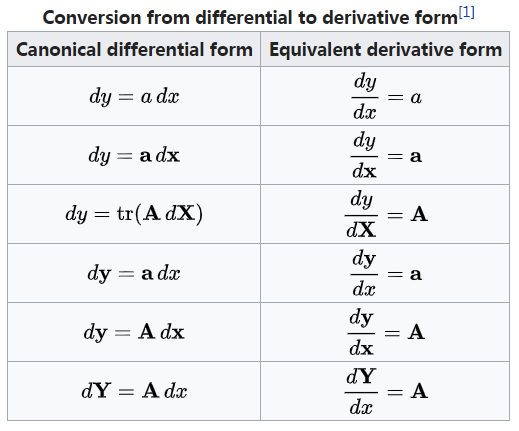

#	矩阵、线性方程组

##	矩阵分解

###	矩阵LU分解

LU分解是高斯消元法的副产品

-	高斯消元结果有：$A=LU$
	-	L为消元过程中的行系数和对角线全为1的下三角矩阵
		（负系数在矩阵中为正值）
	-	U为消元结果上三角矩阵

-	则解方程组$Ax=b$等价于$LUx=b$
	-	先求解$Ly=b$
	-	再求解$Ux=x$

####	特点

-	得到矩阵LU分解后，对任意向量b，可使用**已有**LU分解求解
-	LU分解实际上不需要额外存储空间，矩阵L、U可以合并存储
-	高斯消去法的商业实现也是以这种分解法为基础

###	*Singular Value Decomposition*

> - *SVD*：奇异值分解，若存在分解使得$M=U\SigmaV^{ * }$，
	其中
> > -	$U$：$m * m$阶酉矩阵
> > -	$\Sigma$：半正定$m * n$阶对角矩阵
> > -	$V^{ * }$：其共轭转置是$n * n$阶酉矩阵

-	特征分解在任意矩阵上推广
-	$U$的列组成对$M$正交的“输入”或“分析”基向量，其为$MM^{*}$
	的基向量
-	$V$的列组成对$M$正交的“输出”基向量，其为$M^{*}M$的特征
	向量
-	$\Sigma$对角线元素为$M^{*}M$、$M^M{*}$的奇异值
	-	可视为在输入输出间进行标量的放缩控制
	-	同$U$、$V$的列向量相对应

> - 酉矩阵/幺正矩阵：n个列向量是U空间标准正交基的n阶复方阵，
	是正交矩阵往复数域上的推广

####	低阶近似

-	对$m * n$阶原始矩阵$M$
	-	设其秩为$K \leq min(m, n)$，奇异值为
		$d_1 \geq d_2 \geq \cdots \geq d_K > 0$
	-	不失一般性可以设其均值为0

-	根据*Eckart and Young*的结果

	$$
	\forall r \leq k, \sum_{k=1}^r d_k u_k v_k^T =
		\arg\min_{\bar M \in M(r)} \| M - \bar M \|_F^2
	$$

	> — $u_k, v_k$：$U, V$的第$k$列向量
	> - $\|M\|_F$：矩阵的Frobenius范数

##	矩阵常用公式

###	*Sherman-Morrison*公式

> - 设A是n阶可逆矩阵，$u, v$均为n为向量，若
	$1 + v^T A^{-1} u \neq 0$，则扰动后矩阵$A + u v^T$可逆
	$$
	(A + u v^T)^{-1} = A^{-1} - \frac {A^{-1} u v^T A^{-1}}
		{1 + v^T A^{-1} u}
	$$

##	线性方程组

###	求解

####	Gaussian Elimination

高斯消元法思想为：把n个方程联立线性方程组变换为等价方程组，
新方程组系数矩阵为上三角矩阵

-	上三角矩阵可以方便的递推求解

-	通过初等变换可以将系数矩阵A变换为上三角矩阵$A^{'}$，而
	不影响方程的解

##	行列式

###	几何意义

设点列$q_i(x_i, y_i)$

####	三点

$$
\begin{vmatrix}
x_1 & y_1 & 1 \\
x_2 & y_2 & 1 \\
x_3 & y_3 & 1 \\
\end{vmatrix}
= x_1y_2 + x_3y_1 + x_2y_3 - x_3y_2 - x_2y_1 - x_1y_3
$$

-	三角形$\triangle q_1q_2q_3$面积：行列式绝对值一半
-	$q_3$位于$\overrightarrow{q_1q_2}$左侧：行列式大于0
-	$q_3q_1q_2$共线：行列式值为0

##	*Matrix Derivative*/*Matrix Differential*

矩阵求导/矩阵微分：在矩阵空间的多元微积分

###	*Layout Conventions*

> - *numerator layout*：分子布局，微分分子的维数决定微分结果
	的高维度结构（行优先，如：微分矩阵行数等于分子维数）
> - *denominator layout*：分母布局，微分分母的维数为微分结果
	的高维度结构（行优先）

-	两种布局方式相差转置
-	与微分分子、分母为行、或列向量无关
-	以上布局模式是指**简单单因子微分**时布局模式，复合多因子
	应使用维度分析考虑
	（若严格按照计算规则，结果应该满足布局）

> - 数分中Jaccobi行列式采用分子布局，以下默认为分子布局

###	关于标量导数

-	标量$y$对标量$x$求导：$\frac {\partial y} {\partial x}$

	

	

-	向量$Y$关于标量$x$求导（$Y$为行、列向量均如此）

	

	$$
	\frac {\partial Y} {\partial x} = \begin{bmatrix}
		\frac {\partial y_1} {\partial x} \\
		\frac {\partial y_2} {\partial x} \\
		\vdots \\
		\frac {\partial y_n} {\partial x}
	\end{bmatrix}
	$$

-	矩阵$Y$关于标量$x$求导

	

	$$
	\frac {\partial Y} {\partial x} = \begin{bmatrix}
		\frac {\partial y_{11}} {\partial x} & \frac
			{\partial y_{12}} {\partial x} & \cdots & \frac
			{\partial y_{1n}} {\partial x} \\
		\frac {\partial y_{21}} {\partial x} & \frac
			{\partial y_{22}} {\partial x} & \cdots & \frac
			{\partial y_{2n}} {\partial x} \\
		\vdots & \vdots & \ddots & \vdots \\
		\frac {\partial y_{n1}} {\partial x} & \frac
			{\partial y_{n2}} {\partial x} & \cdots & \frac
			{\partial y_{nn}} {\partial x} \\
	\end{bmatrix}
	$$

###	关于向量导数

-	标量$y$关于向量$X$求导

	
	

	$$
	\frac {\partial y} {\partial X} = [\frac {\partial y} 
		{\partial x_1}, \frac {\partial y} {\partial x_1},
		\cdots, \frac {\partial y} {\partial x_n}]
	$$

-	向量$Y$关于向量$X$求导（$Y$、$X$为行、列向量均如此）

	

	$$
	\frac {\partial Y} {\partial X} = \begin{bmatrix}
		\frac {\partial y_1} {\partial x_1} & \frac
			{\partial y_1} {\partial x_2} & \cdots & \frac
			{\partial y_1} {\partial x_n} \\
		\frac {\partial y_2} {\partial x_1} & \frac
			{\partial y_2} {\partial x_2} & \cdots & \frac
			{\partial y_2} {\partial x_n} \\
		\vdots & \vdots & \ddots & \vdots \\
		\frac {\partial y_m} {\partial x_1} & \frac
			{\partial y_m} {\partial x_2} & \cdots & \frac
			{\partial y_m} {\partial x_n}
	\end{bmatrix}
	$$

###	关于矩阵导数

-	标量对矩阵求导

	
	
	
	

###	微分

-	微分形式

	

-	导数、微分转换

	

###	维度分析

维度分析：对求导结果的维度进行分析，得到矩阵微分结果

-	维度一般化：将向量、矩阵**维度置不同值**，便于考虑转置
-	拆分有关因子：利用**求导乘法公式**分别考虑因子微分结果
-	变换微分因子、剩余因子（可能有左右两组）满足矩阵运算维度
	要求
	-	微分因子**按布局模式考虑维度、不转置**
	-	有时维度一般化也无法唯一确定剩余因子形式，考虑行、列
		內积对应关系

####	例

-	考虑$\frac {\partial x^T A x} {\partial x}$，其中
	$A \in R^{n*n}, x \in R^n$

-	维度一般化：$\frac {\partial u^T A v} {\partial x}$，
	其中$A \in R^{a * b}, x \in R^n$

-	拆分有关因子

	$$\begin{align*}
	\frac {\partial (u^T A) v} {\partial x} & = u^T A \frac
		{\partial v} {\partial x} \\
	\frac {\partial u^T (A v)} {\partial x} & = v^T A^T \frac
		{\partial u} {\partial x}
	\end{align*}$$

-	则有

	$$
	\frac {\partial x^T A x} {\partial x} = x^T (A^T + A)
	$$

