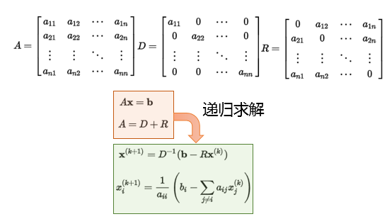
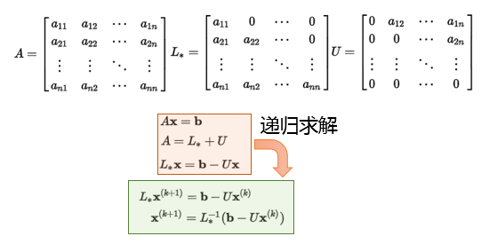
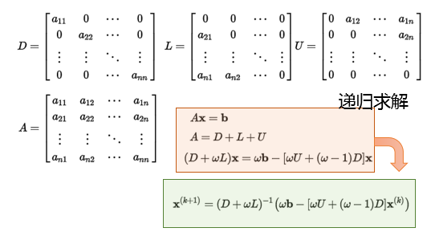

##	矩阵分解

-	矩阵加法分解：将矩阵分解为三角阵、对角阵之和
	-	常用于迭代求解线性方程组

-	矩阵乘法分解：将矩阵分解为三角镇、对角阵、正交阵之积

> - 以下分解均在实数域上，扩展至复数域需同样将相应因子矩阵
	扩充至复数域上定义

##	矩阵加法分解

###	Jacobi分解

Jacobi分解：将矩阵分解为对角阵、非对角阵

###	Gauss-Seidel分解

Gauss-Seidel分解：将矩阵分解为上、下三角矩阵

###	Successive Over Relaxation

SOR：逐次超松弛迭代法，分解为对角、上三角、上三角矩阵，同时
增加权重$w$调整分解后比例

-	利用内在等式应用的平衡性、不动点收敛理论可以快速迭代
	-	$x$拆分到等式左右两侧，可以视为$y=x$和另外函数交点
	-	根据不动点收敛理论可以进行迭代求解

##	LU系列分解

###	LU Decomposition

LU分解：将方阵分解为*lower triangualr matrix*、
*upper triangluar matrix*

$$\begin{align*}
A & = L U \\

\begin{bmatrix}
a_{1,1} & a_{1,2} & \cdots & a_{1,m} \\
a_{2,1} & a_{2,2} & \cdots & a_{2,m} \\
\vdots & \vdots & \ddots & \vdots \\
a_{m,1} & a_{m,2} & \cdots & a_{m,m}
\end{bmatrix} & = 

\begin{bmatrix}
l_{1,1} & 0 & \cdots & 0 \\
l_{2,1} & l_{2,2} & \cdots & 0 \\
\vdots & \vdots & \ddots & \vdots \\
l_{m,1} & l_{m,2} & \cdots & l_{m,m}
\end{bmatrix}

\begin{bmatrix}
u_{1,1} & u_{1,2} & \cdots & u_{1,m} \\
0 & u_{2,2} & \cdots & u_{2,m} \\
\vdots & \vdots & \ddots & \vdots \\
0 & 0 & \cdots & u_{m,m}
\end{bmatrix}

\end{align*}$$

> - $L$：下三角矩阵
> - $U$：上三角矩阵

-	特别的可以要求某个矩阵对角线元素为1
-	几何意义：由单位阵出发，经过竖直、水平切变

####	特点

-	LU分解实际上不需要额外存储空间，矩阵L、U可以合并存储

-	LU分解可以快速求解线性方程组，可以视为高斯消元法的矩阵
	形式

	-	得到矩阵LU分解后，对任意向量b，可使用**已有**LU分解
		求解
		-	L为消元过程中的行系数和对角线全为1的下三角矩阵
			（负系数在矩阵中为正值）
		-	U为消元结果上三角矩阵

	-	则解方程组$Ax=b$等价于$LUx=b$
		-	先求解$Ly=b$
		-	再求解$Ux=x$

###	LDU Decomposition

LDU分解：将矩阵分解为下三角、上三角、对角矩阵

$$\begin{align*}
A & = L D U \\

\begin{bmatrix}
a_{1,1} & a_{1,2} & \cdots & a_{1,m} \\
a_{2,1} & a_{2,2} & \cdots & a_{2,m} \\
\vdots & \vdots & \ddots & \vdots \\
a_{m,1} & a_{m,2} & \cdots & a_{m,m}
\end{bmatrix} & = 

\begin{bmatrix}
1 & 0 & \cdots & 0 \\
l_{2,1} & 1 & \cdots & 0 \\
\vdots & \vdots & \ddots & \vdots \\
l_{m,1} & l_{m,2} & \cdots & 1
\end{bmatrix}

\begin{bmatrix}
u_{1,1} & 0 & \cdots & 0\\
0 & 0 & \cdots & 0 \\
\vdots & \vdots & \ddots & \vdots \\
0 & 0 & \cdots & u_{m,m}
\end{bmatrix}

\begin{bmatrix}
1 & u_{1,2}/u_{1,1} & \cdots & u_{1,m}/u_{1,1} \\
0 & 1 & \cdots & u_{2,m}/u_{2,2} \\
\vdots & \vdots & \ddots & \vdots \\
0 & 0 & \cdots & 1
\end{bmatrix}

\end{align*}$$

-	LU分解可以方便的得到LDU分解：提取对角阵、然后对应矩阵
	元素等比缩放

###	PLU[Q] Decomposition

> - PLU分解：将方阵分解为置换矩阵、下三角、上三角矩阵
> - PLUQ分解：将方阵分解为置换矩阵、下三角、上三角、置换矩阵

-	考虑$P^{-1}A=LU$，交换$A$行即可作普通LU分解，PLUQ分解
	类似
-	PLU分解数值稳定性好、实用工具

###	LL/Cholesky Decomposition

LL分解：将对称阵分解为下三角、转置

$$\begin{align*}
A & = L L^T \\

\begin{bmatrix}
a_{1,1} & a_{1,2} & \cdots & a_{1,m} \\
a_{2,1} & a_{2,2} & \cdots & a_{2,m} \\
\vdots & \vdots & \ddots & \vdots \\
a_{m,1} & a_{m,2} & \cdots & a_{m,m}
\end{bmatrix} & = 

\begin{bmatrix}
l_{1,1} & 0 & \cdots & 0 \\
l_{2,1} & l_{2,2} & \cdots & 0 \\
\vdots & \vdots & \ddots & \vdots \\
l_{m,1} & l_{m,2} & \cdots & l_{m,m}
\end{bmatrix}

\begin{bmatrix}
l_{1,1} & l_{2,1} & \cdots & l_{m,1} \\
0 & l_{2,2} & \cdots & l_{m,2} \\
\vdots & \vdots & \ddots & \vdots \\
0 & 0 & \cdots & l_{m,m}
\end{bmatrix}

\end{align*}$$

-	Cholesky分解常用于分解$A^TA$
	-	常用于相关分析，分解相关系数阵、协方差阵

-	相较于一般LU分解，Cholesky分解速度更快、数值稳定性更好

> - 类似的有LDL分解，同时提取对角线元素即可

##	Singular Value Decomposition

*SVD*奇异值分解：将矩阵分解为正交矩阵、对角矩阵、正交矩阵

$$
M_{m*n} = U_{m*r} \Sigma_{r*r} V_{n*r}^T
$$

-	**特征值分解**在任意矩阵上推广：相应的特征值、特征向量
	被称为奇异值、奇异向量
-	几何意义：由单位阵出发，经旋转、缩放、再旋转

###	特点

-	$\Sigma$对角线元素为$M^T M$、$M M^T$的奇异值
	-	可视为在输入输出间进行标量的放缩控制
	-	同$U$、$V$的列向量相对应

-	$U$的列向量称为左奇异向量
	-	$M M^T$的特征向量
	-	与$M$正交的“输入”或“分析”基向量

-	$V$的列向量成为右奇异向量
	-	$M^T M$的特征向量
	-	与$M$正交的“输出”基向量

###	低阶近似

-	对$m * n$阶原始矩阵$M$
	-	设其秩为$K \leq min(m, n)$，奇异值为
		$d_1 \geq d_2 \geq \cdots \geq d_K > 0$
	-	不失一般性可以设其均值为0

-	根据*Eckart and Young*的结果

	$$
	\forall r \leq K, \sum_{k=1}^r d_k u_k v_k^T =
		\arg\min_{\bar M \in M(r)} \| M - \bar M \|_F^2
	$$

	> - $u_k, v_k$：$U, V$的第$k$列向量
	> - $\|M\|_F$：矩阵的Frobenius范数

##	QR Decomposition

QR分解：将矩阵分解为正交矩阵、上三角矩阵

$$\begin{align*}
A = Q R
\end{align*}$$

-	几何意义：由单位阵出发，经旋转、切变

###	特点

-	正交矩阵逆为其转置，同样可以方便求解线性方程组

